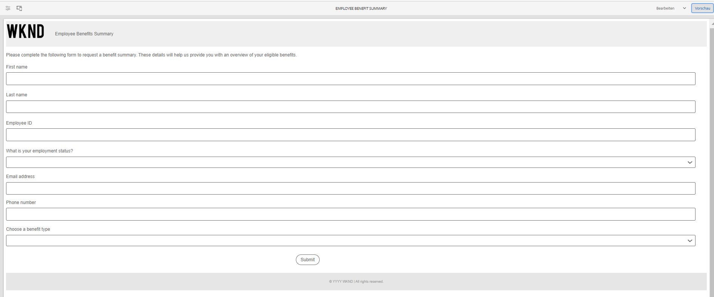
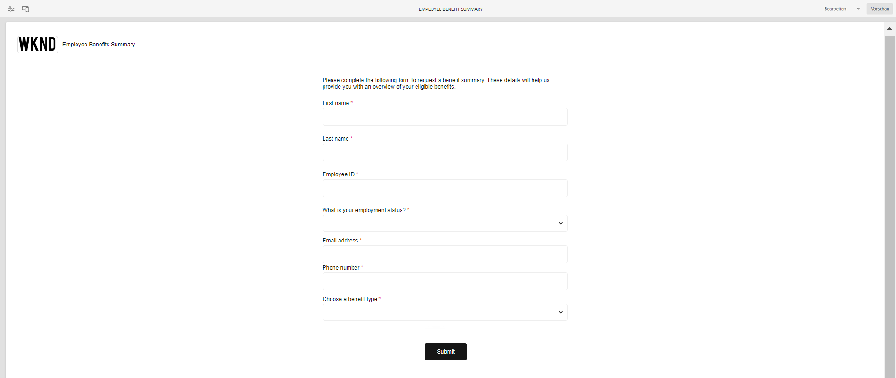
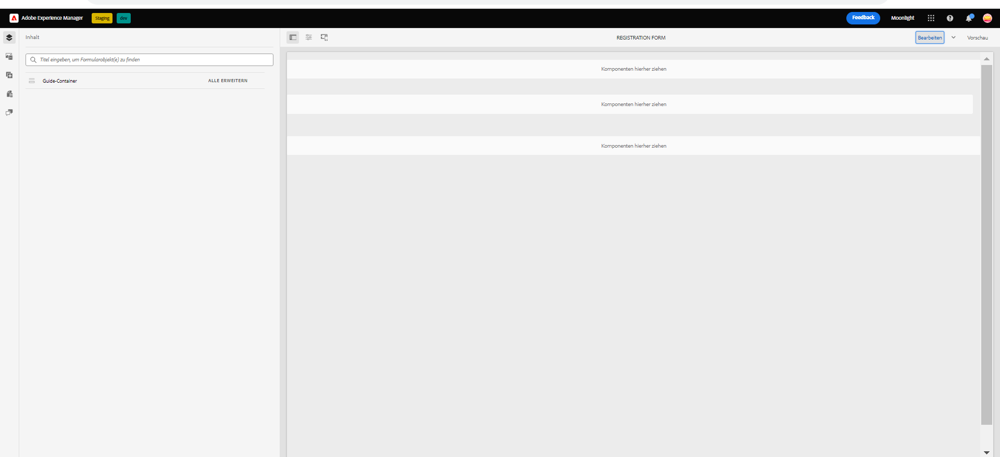

# Muster-Designs, Vorlagen und Formulardatenmodelle in Kernkomponenten {#sample-themes-templates-and-data-models}

AEM Forms as a Cloud Service bietet Beispiel-Referenzthemen, Vorlagen und Formulardatenmodelle, die Ihnen helfen, schnell mit der Erstellung von Adaptive Forms mit Kernkomponenten zu beginnen. Sie können [Aktivieren der adaptiven Forms-Kernkomponenten](https://experienceleague.adobe.com/docs/experience-manager-cloud-service/content/forms/setup-configure-migrate/enable-adaptive-forms-core-components.html?lang=de) zur as a Cloud Service und lokalen Entwicklungsumgebung von AEM Forms, um OOTB-Beispielvorlagen zu erhalten und [Verwenden und Anpassen von Beispieldesigns](https://experienceleague.adobe.com/docs/experience-manager-cloud-service/content/forms/adaptive-forms-authoring/authoring-adaptive-forms-core-components/create-an-adaptive-form-on-forms-cs/using-themes-in-core-components.html) in [!DNL AEM Forms].

Die im Referenzinhaltspaket enthaltenen Musterdesigns, Vorlagen und Formulardatenmodelle sind:

| Vorlagen | Designs | Formulardatenmodelle |
---------|----------|---------
| Einfach | Canvas | Microsoft® Dynamics 365 |
| Leer | WKND | Salesforce |
| Kontakt | Easel |  |
| Aktualisierung der Kontaktdetails |   |   |
| Einverständnisformular | |  |
| Anfrage zum Protokolldienst |  |  |
| Feedback geben |  |  |
| Vorteile der Registrierung |  |   |
| Zusammenfassung der Leistungen für Arbeitnehmer |   |   |
| Kontoauszug anfordern |   |   |
| Sicherheitsüberprüfungsformular |   |   |
| Qualitätskontrolle |   |   |
| Kaufanfrage |  |  |

## Beispieldesigns {#Sample-Themes}

Anhand von Beispieldesigns können Autoren die Formatierung für Formulare definieren und anpassen. Autoren mit Grundkenntnissen von CSS können Designs nach Bedarf anpassen. Formularverfasser [Aktivieren der adaptiven Forms-Kernkomponenten](https://experienceleague.adobe.com/docs/experience-manager-cloud-service/content/forms/setup-configure-migrate/enable-adaptive-forms-core-components.html?lang=de) in der as a Cloud Service und lokalen Entwicklungsumgebung von AEM Forms, um diese Themen wie folgt zu behandeln:

### Canvas {#Canvas}

Das Arbeitsflächendesign ist das Standarddesign für Formulare und hebt die Verwendung von Grundfarben, Transparenz und flachen Symbolen hervor. Im Screenshot unten sehen Sie, wie das Canvas -Design aussieht.

### WKND {#WKND}

Das WKND-Design verkörpert ein lebendiges, fantasievolles und ansprechendes Design, um Ihren Formularen ein stilvolles Erscheinungsbild zu verleihen. Das Design basiert auf dem Erscheinungsbild und Stil von [WKND-Site](https://wknd.site/us/en.html) , auf der eine Reise- und Abenteuerwebsite aufbaut [Adobe Experience Manager-Kernkomponenten](https://experienceleague.adobe.com/docs/experience-manager-core-components/using/introduction).

### Easel {#Easel}

Einfaches Design hilft dabei, ein ansprechendes und einfach einzurichtendes Formular zu erstellen. Es ist auf Einfachheit und Benutzerfreundlichkeit abgestimmt. Das Easel-Design basiert auf dem Konzept, wo ein tragbarer Stand von Künstlern verwendet, um eine Leinwand während der Arbeit an ihren Gemälden zu unterstützen.

## Beispielvorlagen {#Sample-templates}

Vorlagen definieren die anfängliche Formularstruktur, den Inhalt und die Aktionen, die in Ihrem Formular repliziert werden sollen, oder verwenden eine ähnliche Vorlagenstruktur wie das Formular, z. B. Einverständnisformular, Registrierungsformular für Vorteile und vieles mehr. Sie erhalten die folgenden Vorlagen von [Aktivieren der adaptiven Forms-Kernkomponenten](https://experienceleague.adobe.com/docs/experience-manager-cloud-service/content/forms/setup-configure-migrate/enable-adaptive-forms-core-components.html?lang=de) in der as a Cloud Service oder lokalen Entwicklungsumgebung von AEM Forms. Die Beispielvorlagen in den Kernkomponenten des adaptiven Forms sind:

### Einfach {#Basic}

Eine einfache Vorlage hilft Ihnen beim schnellen Erstellen eines Registrierungserlebnisformulars. Sie können sie auch verwenden, um eine Vorschau der Funktionen von [Adaptive Forms-Kernkomponenten](https://experienceleague.adobe.com/docs/experience-manager-core-components/using/adaptive-forms/introduction). Es bietet ein Assistenten-Layout für eine abschnittsweise Darstellung der Daten.

>[!BEGINTABS]

>[!TAB Desktop]

>[!TAB Telefon]

>[!TAB Tablet]

>[!ENDTABS]

### Leer {#Blank}

Eine leere Arbeitsflächenvorlage wird verwendet, um eine Struktur, einen Inhalt und Regeln für adaptive Formulare von Grund auf neu zu erstellen. In die leere Vorlage sind keine Formularkomponenten eingefügt.

### Kontakt {#Contact-Us}

Die Formularvorlage Kontakt wird verwendet, um ein Formular zu erstellen, das die Kommunikation zwischen Website-Besuchern und Administratoren erleichtert. Benutzer können über das Formular Abfragen, Feedback oder Supportanfragen senden.

### Aktualisierung der Kontaktdetails {#Contact-Details-Update}

Die Vorlage für die Aktualisierung von Kontaktdetails hilft Autoren bei der Erstellung eines Formulars für die Aktualisierung von Adresse und Kontaktdaten von Kunden. Das Formular unterstützt Kunden auch bei der Aktualisierung personenbezogener Daten in Bezug auf Abonnements oder Vorteile, um eine nahtlose Kommunikation und einen unterbrechungsfreien Zugriff auf die Dienste oder Vorteile zu gewährleisten.

### Einverständnisformular {#Consent-Form}

Die Vorlage für das Einverständnisformular wird verwendet, um ein Formular für die Beschaffung eines Rechtsdokuments von Teilnehmern zu erstellen, die an einer bestimmten Aktivität, einem Forschungsstudium, einem medizinischen Verfahren oder einer Situation teilnehmen, in der ihre personenbezogenen Daten oder Rechte involviert sein können. Das Formular gewährleistet Transparenz, schützt die Rechte des Teilnehmers und schafft ein klares Verständnis dessen, was der Einzelne zustimmt.

### Protokolldienstanfrage {#Log-Service-Request}

Die Protokolldienst-Anforderungsvorlage hilft beim Erstellen eines Formulars, das anfragespezifische Protokollierungsdienste von einem Dienstleister anfordert. Das Formular dient als formelle Anfrage zum Erstellen eines Tickets, bei dem bestimmte Ereignisse, Aktivitäten oder Daten zur Überwachung oder zum Tracking-Status protokolliert werden.

### Feedback geben {#Give-Feedback}

Mit der Rückmeldevorlage können Sie ein Formular erstellen, das eine konstruktive Rückmeldung an eine andere Person oder ein Team liefert. Das Formular hilft sicherzustellen, dass das Feedback klar, spezifisch und umsetzbar ist, und fördert offene Kommunikation und Verbesserung.

### Leistungseinstufung {#Benefits-Enrollment}

Mit der Vorlage für das Anmeldeformular für Vorteile können Sie ein Formular erstellen, in dem Sie wichtige Informationen von Ihren Mitarbeitern zu ihren bevorzugten Vorteilen und Deckungsoptionen erfassen. Sie begleitet in der Regel den jährlichen Zeitraum der Leistungseinstufung.

### Zusammenfassung der Arbeitnehmervorteile {#Employee-Benefits-Summary}

Die Vorlage für die Zusammenfassung der Leistungen für Arbeitnehmer wird verwendet, um ein Formular zu erstellen, in dem wichtige Details zu den Vorteilen einer Person erfasst werden. Es hilft bei der schnellen und präzisen Bewertung der Abdeckung, indem ein umfassender Überblick über effiziente Hilfe und Unterstützung bereitgestellt wird.

### Kontoauszug anfordern {#Request-for-Account-Statement}

Die Vorlage für Kontoauszugsanfragen hilft bei der Erstellung eines Formulars, das den Prozess des Abrufs einer präzisen und aktuellen Kundenanweisung auslöst. Die Erklärung enthält eine detaillierte Aufzeichnung von Finanztransaktionen, -aktivitäten oder anderen relevanten Informationen über Kunden, die dieses Formular verwenden.

### Sicherheitskontrolle {#Safety-Inspection}

Die Vorlage für Sicherheitsüberprüfungsformulare hilft bei der Erstellung eines Formulars zur Eingabe von Details für eine sichere Arbeitsumgebung. Durch regelmäßige Inspektionen mit diesem Formular können potenzielle Risiken ermittelt werden. Der Vordruck umfasst verschiedene Aspekte wie Notausstiege, Brandsicherheit, elektrische Sicherheit, Gefahrstoffe, persönliche Schutzausrüstung, Ergonomie der Workstation für die Sicherheit und das Wohlbefinden von Mitarbeitern, Besuchern und Kunden.

### Qualitätskontrolle {#Quality-Control-Inspection}

Anhand der Vorlage für die Qualitätskontrolle wird ein Formular erstellt, in dem das Erscheinungsbild, die Abmessungen, die Funktionalität, die Dokumentation, die Testergebnisse und die Gesamtqualität eines Produkts oder Artikels bewertet und dokumentiert werden. Sie hilft bei der Identifizierung von Mängeln, Nichtkonformitäten und Korrekturmaßnahmen, die zur Gewährleistung der Einhaltung von Qualitätsstandards erforderlich sind.

### Kaufanfrage {#Purchase-Request}

Mit der Vorlage für Bestellformulare können Sie ein Formular erstellen, um den Vergabeverfahren einzuleiten und es Mitarbeitern zu ermöglichen, den Kauf von für ihre Arbeit erforderlichen Waren oder Dienstleistungen förmlich anzufordern. Das Formular erfasst wichtige Details wie Artikelbeschreibung, Menge, bevorzugter Lieferant (falls zutreffend), Budgetzuweisung, Begründung des Kaufs, Lieferinformationen und erforderliche Genehmigungen.

## Referenzformular-Datenmodelle {#reference-models}

Nachdem Sie die [Adaptives Formular](https://experienceleague.adobe.com/docs/experience-manager-core-components/using/adaptive-forms/introduction.html?lang=en#adaptive-forms-core-components) basierend auf [Kernkomponente](https://experienceleague.adobe.com/docs/experience-manager-core-components/using/adaptive-forms/introduction.html?lang=en#adaptive-forms-core-components), können Sie das Backend Ihres Formulars mit der Datenbank Microsoft® Dynamics 365- und Salesforce-Servern verbinden, um geschäftliche Workflows zu ermöglichen. Beispiel:

* Schreiben Sie Daten in Microsoft® Dynamics 365 und Salesforce bei der Übermittlung des adaptiven Formulars.
* Schreiben Sie Daten in Microsoft® Dynamics 365 und Salesforce über benutzerdefinierte Entitäten, die im Formulardatenmodell definiert sind, und umgekehrt.
* Abfragen von Microsoft® Dynamics 365- und Salesforce-Server auf Daten und Vorausfüllen von Adaptive Forms.
* Lesen Sie Daten von Microsoft® Dynamics 365- und Salesforce-Servern.

Sie können die folgenden Formulardatenmodelle erhalten, indem Sie das [Referenzinhaltspaket](https://experience.adobe.com/#/downloads/content/software-distribution/en/aemcloud.html?package=/content/software-distribution/en/details.html/content/dam/aemcloud/public/aem-forms-reference-content.ui.content-2.1.0.zip) installieren:

* Microsoft® Dynamics 365
* Salesforce

Informationen zur Verwendung dieser Modelle finden Sie unter [Konfigurieren von Microsoft® Dynamics 365- und Salesforce-Cloud-Services](https://experienceleague.adobe.com/docs/experience-manager-cloud-service/content/forms/integrate/use-form-data-model/configure-msdynamics-salesforce.html?lang=de#configure-dynamics-cloud-service)
