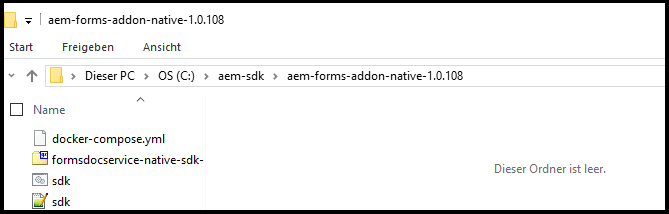

# Einrichten einer lokalen Entwicklungsumgebung für AEM Forms {#overview}

Wenn Sie eine [!DNL &#x200B; Adobe Experience Manager Forms]-as-a-[!DNL &#x200B; Cloud Service]-Umgebung einrichten und konfigurieren, richten Sie Entwicklungs-, Staging- und Produktionsumgebungen in der Cloud ein. Darüber hinaus können Sie auch eine lokale Entwicklungsumgebung einrichten und konfigurieren.

Sie können die lokale Entwicklungsumgebung verwenden, um die folgenden Aktionen durchzuführen, ohne sich bei der Cloud-Entwicklungsumgebung anzumelden:

* [Erstellen von Formularen](creating-adaptive-form.md) und zugehörigen Elementen (Designs, Vorlagen, benutzerdefinierte Übermittlungsaktionen usw.)
* [Konvertieren von PDF-Formularen in adaptive Formulare](https://experienceleague.adobe.com/docs/aem-forms-automated-conversion-service/using/convert-existing-forms-to-adaptive-forms.html?lang=de)
* Erstellen von Programmen zum Generieren der [Kundenkommunikation](aem-forms-cloud-service-communications-introduction.md) nach Bedarf oder im Batch-Modus

Nachdem ein adaptives Formular oder zugehörige Elemente in der lokalen Entwicklungsinstanz oder in einem Programm zum Generieren der [Kundenkommunikation] bereit sind, können Sie das Programm mit dem adaptiven Formular oder der Kundenkommunikation aus der lokalen Entwicklungsumgebung in eine Cloud Service-Umgebung exportieren, um weitere Tests durchzuführen oder zu Produktionsumgebungen zu wechseln.

Sie können auch benutzerdefinierten Code wie benutzerdefinierte Komponenten und den Vorbefüllungs-Service in der lokalen Entwicklungsumgebung entwickeln und testen. Wenn der benutzerdefinierte Code getestet und bereit ist, können Sie das Git-Repository Ihrer Cloud Service-Entwicklungsumgebung verwenden, um den benutzerdefinierten Code bereitzustellen.

Um eine neue lokale Entwicklungsumgebung einzurichten und sie zur Entwicklung für Aktivitäten zu nutzen, führen Sie folgende Aktionen in angegebener Reihenfolge durch:

* [Einrichten von Entwicklungs-Tools](#setup-development-tools-for-AEM-projects)

* [Einrichten einer lokalen Autoren- und Veröffentlichungsinstanz](#set-up-local-experience-manager-environment-for-development)

* [Hinzufügen eines Forms-Archivs in lokalen Entwicklungsinstanzen und Konfigurieren von Benutzern](#add-forms-archive-configure-users)

* [Einrichten einer lokalen Entwicklungsumgebung für Microservices](#docker-microservices)

* [Einrichten eines Entwicklungsprojekts](#forms-cloud-service-local-development-environment)

* [Einrichten lokaler Dispatcher-Tools](#setup-local-dispatcher-tools)

<!--
You can use the local development environment to create and test Adaptive Forms without connecting to the Cloud Service. [!DNL AEM Forms] provides an SDK to help test all the cloud-ready functionalities on the local development environment. When your forms and related assets are ready and tested on the local development environment, you can import these forms and related assets to an [!DNL AEM Forms] as a Cloud Service instance for publishing. 

You can also develop and test custom code like custom components and prefill service on the local development environment. When the custom code is tested and ready, you can use the Git repository of your [!DNL AEM Forms] as a Cloud Service development environment to deploy the custom code. 

>[!NOTE]
>
> Pre-pilot release does not support using an [!DNL AEM Forms] as a Cloud Service development instance to create forms. You can create forms, related assets, and custom code only on a local development environment.-->

<!--
You configure two types of development environments:

* **[!DNL AEM Forms] as a Cloud Service development environment:** Use the [[!DNL AEM Forms] as a Cloud Service](setup-forms-cloud-service.md) environment to store, manage, and publish Adaptive Forms and related assets. Do not use an [!DNL AEM Forms] as a Cloud Service environment to create Adaptive Forms and related assets <!--, form-centric workflows, a form data model, or to generate a Document of Record. -->

<!--
* **Local development environment:** You can use the local development environment to create and test Adaptive Forms without connecting to the service. Adobe provides a SDK for the local development to help test all the cloud-ready functionalities. 
Use a local development environment:
    
    * To create forms and related assets (themes, templates, custom Submit Actions, and more) and convert PDF forms to Adaptive Forms. After an Adaptive Form or related assets are ready on the local development instance, you can export the Adaptive Form and related assets from the local development environment to an [!DNL AEM Forms] as a Cloud Service development environment for publishing.  
    
    * To update configuration settings and develop and test custom code like custom components and prefill service. When the custom code is tested and ready, you can use the Git repository of your [!DNL AEM Forms] as a Cloud Service development environment to deploy the custom code.  

You can use the local development environment to create and test Adaptive Forms without connecting to the service. Adobe provides a SDK for the local development to help test all the cloud-ready functionalities. When your forms and related assets are ready and tested on the local development environment, you can import these forms and related assets to an [!DNL AEM Forms] as a Cloud Service instance for publishing. 

You can use the [development tools](https://experienceleague.adobe.com/docs/experience-manager-65/developing/devtools/dev-tools.html?lang=de) to write custom code, customize or create new Adaptive Forms components, create a custom prefill service, or modify default configurations of an [!DNL AEM Forms] as a Cloud Service instance. 

-->

## Voraussetzungen

Sie benötigen folgende Software, um eine lokale Entwicklungsumgebung einzurichten. Laden Sie diese herunter, bevor Sie mit der Einrichtung der lokalen Entwicklungsumgebung beginnen:

| Software | Beschreibung | Downloadlinks |
|---|---|---|
| Adobe Experience Manager as a Cloud Service SDK | SDK enthält [!DNL Adobe Experience Manager]-QuickStart- und -Dispatcher-Tools | Laden Sie das neueste SDK von [Software Distribution](#software-distribution) herunter. |  |
| Adobe Experience Manager Forms-Funktionsarchiv (AEM Forms-Add-on) | Tools zum Erstellen, Gestalten und Optimieren adaptiver Formulare und anderer Adobe Experience Manager Forms-Funktionen | Download aus [Software Distribution](#software-distribution) |
| (Optional) Adobe Experience Manager Forms-Referenzinhalt | Tools zum Erstellen, Gestalten und Optimieren adaptiver Formulare und anderer Adobe Experience Manager Forms-Funktionen | Download aus [Software Distribution](#software-distribution) |
| (Optional) Adobe Experience Manager Forms Designer | Tools zum Erstellen, Gestalten und Optimieren adaptiver Formulare und anderer Adobe Experience Manager Forms-Funktionen | Download aus [Software Distribution](#software-distribution) |

### Herunterladen der neuesten Software-Version von Software Distribution {#software-distribution}

Herunterladen der neuesten Version von Adobe Experience Manager as a Cloud Service SDK, Experience Manager Forms-Funktionsarchiv (AEM Forms-Add-on), Forms-Referenzelemente oder Forms Designer von [Software Distribution](https://experience.adobe.com/#/downloads/content/software-distribution/de/aemcloud.html):

1. Melden Sie sich bei <https://experience.adobe.com/#/downloads> mit Ihrer Adobe ID an.

   >[!NOTE]
   >
   > Ihre Adobe-Organisation muss für AEM as a Cloud Service bereitgestellt werden, um das AEM as a Cloud Service SDK herunterladen zu können.

1. Navigieren Sie zur Registerkarte **[!UICONTROL AEM as a Cloud Service]**.
1. Sortieren Sie in absteigender Reihenfolge nach dem Veröffentlichungsdatum.
1. Klicken Sie auf die neueste Version von Adobe Experience Manager as a Cloud Service SDK, Experience Manager Forms-Funktionsarchiv (AEM Forms-Add-on), Forms-Referenz-Assets oder Forms Designer.

   >[!NOTE]
   >
   > Es wird empfohlen, die neueste Version des Experience Manager Forms-Funktionsarchivs (AEM Forms-Add-on), der Formularverweis-Assets oder von Forms Designer herunterzuladen, um eine nahtlose Kompatibilität mit dem Adobe Experience Manager as a Cloud Service SDK sicherzustellen.

1. Lesen und akzeptieren Sie den Endbenutzer-Lizenzvertrag. Klicken Sie auf die Schaltfläche **[!UICONTROL Herunterladen]**.

## Einrichten von Entwicklungs-Tools für AEM-Projekte {#setup-development-tools-for-AEM-projects}

Das Adobe Experience Manager Forms-Projekt ist eine benutzerdefinierte Code-Basis. Diese enthält Code, Konfigurationen und Inhalte, die über Cloud Manager in [!DNL Adobe Experience Manager] as a Cloud Service bereitgestellt werden. Der [AEM-Projekt Maven-Archetyp](https://github.com/adobe/aem-project-archetype) stellt die Grundlinie für das Projekt bereit.

Richten Sie die folgenden Entwicklungs-Tools ein, die für Ihr [!DNL Adobe Experience Manager]-Projekt zur Entwicklung verwendet werden sollen:

* [Java™](https://experienceleague.adobe.com/docs/experience-manager-learn/cloud-service/local-development-environment-set-up/development-tools.html?lang=de#local-development-environment-set-up)
* [Git](https://experienceleague.adobe.com/docs/experience-manager-learn/cloud-service/local-development-environment-set-up/development-tools.html?lang=de#install-git)
* [Node.js (npm)](https://experienceleague.adobe.com/docs/experience-manager-learn/cloud-service/local-development-environment-set-up/development-tools.html?lang=de#node-js)
* [Maven](https://experienceleague.adobe.com/docs/experience-manager-learn/cloud-service/local-development-environment-set-up/development-tools.html?lang=de#install-maven)

Detaillierte Anweisungen zum Einrichten der zuvor erwähnten Entwicklungs-Tools finden Sie unter [Einrichten von Entwicklungs-Tools](https://experienceleague.adobe.com/docs/experience-manager-learn/cloud-service/local-development-environment-set-up/development-tools.html?lang=de).

## Einrichten einer lokalen Experience Manager-Umgebung für die Entwicklung

Das Cloud Service-SDK stellt eine QuickStart-Datei bereit. Es führt eine lokale Version von Experience Manager aus. Sie können entweder die Autoren- oder die Veröffentlichungsinstanz lokal ausführen.

Während QuickStart eine lokale Entwicklungsumgebung bietet, sind hier nicht alle Funktionen vorhanden, die bei [!DNL Adobe Experience Manager] as a Cloud Service verfügbar sind. Testen Sie daher Ihre Funktionen und den Code immer in einer [!DNL Adobe Experience Manager] as a Cloud Service-Entwicklungsumgebung, bevor Sie sie in die Staging- oder Produktionsumgebung verschieben.

Installieren und Konfigurieren einer lokalen Experience Manager-Umgebung:

* [Herunterladen und Extrahieren](https://experience.adobe.com/#/downloads/content/software-distribution/de/aemcloud.html) des [!DNL Adobe Experience Manager] as a Cloud Service SDK
* [Einrichten einer Autoreninstanz](https://experienceleague.adobe.com/docs/experience-manager-learn/cloud-service/local-development-environment-set-up/aem-runtime.html?lang=de#set-up-local-aem-author-service)
* [Einrichten einer Veröffentlichungsinstanz](https://experienceleague.adobe.com/docs/experience-manager-learn/cloud-service/local-development-environment-set-up/aem-runtime.html?lang=de#set-up-local-aem-publish-service)

## Hinzufügen eines Forms-Archivs für lokale Autoren- und Veröffentlichungsinstanzen und Konfigurieren Forms-spezifischer Benutzer {#add-forms-archive-configure-users}

Führen Sie folgende Schritte in der aufgeführten Reihenfolge aus, um Forms-Archive zu Experience Manager-Instanzen hinzuzufügen und Forms-spezifische Benutzer zu konfigurieren:

### Installieren des neuesten Forms-Add-on-Funktionsarchivs {#add-forms-archive}

Das Funktionsarchiv für Adobe Experience Manager Forms as a Cloud Service bietet Tools zum Erstellen, Gestalten und Optimieren von adaptiven Formularen in der lokalen Entwicklungsumgebung. Installieren Sie das Paket, um ein adaptives Formular zu erstellen, und verwenden Sie verschiedene andere Funktionen von [!DNL AEM Forms]. Installieren des Pakets:

1. Laden Sie das neueste [!DNL AEM Forms]-Archiv für Ihr Betriebssystem aus [Software Distribution](https://experience.adobe.com/#/downloads/content/software-distribution/de/aemcloud.html) herunter und extrahieren Sie es.

1. Navigieren Sie zum Verzeichnis „crx-quickstart/install“. Wenn der Ordner nicht vorhanden ist, erstellen Sie ihn.

1. Stoppen Sie Ihre AEM-Instanz und platzieren Sie das [!DNL AEM Forms]-Add-on-Funktionsarchiv `aem-forms-addon-<version>.far` im Installationsordner.
1. Wechseln Sie zum aktiven Befehlsfenster und drücken Sie die Tastenkombination `Ctrl + C`, um das SDK neu zu starten.

   >[!NOTE]
   >
   > Es wird empfohlen, den Tastaturbefehl „Strg+C“ zu verwenden, um das SDK neu zu starten. Das Neustarten des AEM SDK mit anderen Methoden, z. B. dem Beenden von Java-Prozessen, kann zu Inkonsistenzen in der AEM-Entwicklungsumgebung führen.

<!--**Q**: I've set up a Aem as a Cloud Service environment and added the Forms Add-On for a project. After the .far file addition, the bundles are not in the active state and are in installed state only due to the missing dependencies. How to make the bundles in the active state?
**A**: To resolve the issue:
1. Start the AEM and wait for it to start completely (all bundles up)
1. Stop aem (ctrl + c). Place the forms far in the install folder.
1. Restart AEM.-->


### Konfigurieren von Benutzern und Berechtigungen {#configure-users-and-permissions}

Erstellen Sie Benutzer wie „Formularentwickler“ oder „Formularpraktiker“ und [fügen Sie diese Benutzer vordefinierten Formulargruppen hinzu](https://experienceleague.adobe.com/docs/experience-manager-learn/cloud-service/accessing/aem-users-groups-and-permissions.html?lang=de#accessing), um ihnen die erforderlichen Berechtigungen zu gewähren. In folgender Tabelle werden alle Benutzertypen und vordefinierten Gruppen für jeden Formularbenutzertyp aufgeführt:

| Benutzertyp | AEM-Gruppe |
|---|---|
| Formularpraktiker/ | [!DNL forms-users] (AEM Forms-Benutzer), [!DNL template-authors], [!DNL workflow-users], [!DNL workflow-editors] und [!DNL fdm-authors] |
| Formularentwickler | [!DNL forms-users] (AEM Forms-Benutzer), [!DNL template-authors], [!DNL workflow-users], [!DNL workflow-editors] und [!DNL fdm-authors] |
| Customer Experience Lead oder UX-Designer | [!DNL forms-users], [!DNL template-authors] |
| AEM-Administrator | [!DNL aem-administrators], [!DNL fd-administrators] |
| Endanwender | Fügen Sie Benutzer, die sich anmelden müssen, um ein adaptives Formular anzuzeigen und zu übermitteln, der Gruppe [!DNL forms-users] hinzu. </br> Wenn für den Zugriff auf adaptive Formulare keine Benutzerauthentifizierung erforderlich ist, weisen Sie diesen Benutzern keine Gruppe zu. |

<!--  

## Set up a local AEM instance for development

Perform the following steps in the listed order to set up and configure your local development environment:

1. **Set up an AEM author instance:** You require an author instance to create Adaptive Forms. Download and extract the latest AEM SDK archive. Run the quick start file in author run mode to set up an author instance. For detailed instructions, see [default local instance](https://experienceleague.adobe.com/docs/experience-manager-learn/cloud-service/local-development-environment-set-up/aem-runtime.html?lang=de).  

1. **Install the latest [!DNL AEM Forms] add-on feature archive:** [!DNL AEM Forms] add-on feature archive provides tools to create, style, and optimize Adaptive Forms on the local development environment. Install the package to create an Adaptive Form and use various other features of [!DNL AEM Forms]. To install the package:

    1. Download and extract the latest [!DNL AEM Forms] archive for your operating system from [Software Distribution](https://experience.adobe.com/#/downloads/content/software-distribution/en/aemcloud.html).

    1. Navigate to the crx-quickstart/install directory. If the folder does not exist, create it.

    1. Stop your Cloud ready AEM instance, place the [!DNL AEM Forms] add-on feature archive, `aem-forms-addon-<version>.far`,  in the install folder, and restart the instance.

1. **Configure users and permissions:** Create users like Form Developer and Form Practitioner a nd add these users to pre-defined forms group to provide them required permissions. The table below lists all types of users and pre-defined groups for each type of forms users:
  
    | User Type | AEM Group |
    |---|---|
    | Form Practitioner  | forms-users (AEM Forms Users), template-authors  |
    | Form Developer | forms-users (AEM Forms Users), template-authors |
    | End-User| everyone* |

    `*` When a user should log in to access or submit Adaptive Forms, add such users to the everyone group.  -->

<!--    
### Set up an AEM project for the development tasks related to local AEM 6.5.5 Forms instance

Use this project to update configurations, create overlays, develop custom Adaptive Form components, and custom code using the local development environment. To set up the project:

1. **Install and configure Maven and set up an AEM project based on Apache Maven:** Apache Maven is an open-source tool for managing software projects. It helps automate builds and provides quality project information. It is the recommended build management tool for AEM projects. For detailed instructions to set up an AEM project based on Apache Maven, see [How to Build AEM Projects using Apache Maven](https://experienceleague.adobe.com/docs/experience-manager-65/developing/devtools/ht-projects-maven.html?lang=de).

1. Configure the project to use [uber-jar](https://experienceleague.adobe.com/docs/experience-manager-65/release-notes/release-notes.html?lang=de#install-aem-forms-jee-installer) version 6.5.5 or later and [[!DNL AEM Forms] Client SDK](https://repo1.maven.org/maven2/com/adobe/aemfd/aemfd-client-sdk/) version 6.0.160 or later.  

1. **Set Up an Integrated Development Environment:**  Set up an IDE of your choice for development, see [Set Up an Integrated Development Environment](https://experienceleague.adobe.com/docs/experience-manager-learn/foundation/development/set-up-a-local-aem-development-environment.html?lang=de#set-up-an-integrated-development-environment) for detailed instructions.
 -->

## Einrichten einer lokalen Entwicklungsumgebung für das Datensatzdokument (DoR) {#docker-microservices}

AEM Forms as a Cloud Service bietet eine Docker-basierte SDK-Umgebung zur einfacheren Entwicklung des Datensatzdokuments und zur Verwendung anderer Microservices. So müssen Sie plattformspezifische Binärdateien und Anpassungen nicht manuell konfigurieren. So richten Sie die Umgebung ein:

1. Installieren und Konfigurieren von Docker:

   * (Für Microsoft® Windows) Installieren Sie [Docker Desktop](https://www.docker.com/products/docker-desktop). Damit werden `Docker Engine` und `docker-compose` auf Ihrem Computer konfiguriert.

   * (Apple macOS) Installieren Sie [Docker Desktop für Mac](https://hub.docker.com/editions/community/docker-ce-desktop-mac). Dazu gehören Docker Engine, Docker-CLI-Client, Docker Compose, Docker Content Trust, Kubernetes und Credential Helper.

   * (Für Linux®) Installieren Sie [Docker Engine](https://docs.docker.com/engine/install/#server) und [Docker Compose](https://docs.docker.com/compose/install/) auf Ihrem Computer.

   >[!NOTE]
   >
   > * Setzen Sie für Apple macOS Ordner, die lokale AEM-Autoreninstanzen enthalten, auf die Zulassungsliste.
   >
   > * Docker Desktop für Windows unterstützt zwei Backends, Hyper-V
   > (veraltet) und WSL2 (modern). Die Dateifreigabe wird
   > bei Verwendung von WSL2 (modern) von Docker automatisch verwaltet. Bei Verwendung von Hyper-V (alt)
   > müssen Sie die Dateifreigabe explizit konfigurieren.

1. Erstellen Sie parallel zu Ihrer Autoren- und Veröffentlichungsinstanz einen Ordner, z. B. „aem-sdk“. Beispiel: C:\aem-sdk.

1. Extrahieren Sie die Datei `aem-forms-addon-<version>.zip\aem-forms-addon-native-<version>.zip`.

   

1. Erstellen Sie eine Umgebungsvariable AEM_HOME und verweisen Sie auf die lokale AEM-Autoreninstallation. Beispiel: C:\aem\author\.

1. Öffnen Sie „sdk.bat“ oder „sdk.sh“ zur Bearbeitung. Legen Sie AEM_HOME auf die lokale AEM-Autoreninstallation fest. Beispiel: C:\aem\author\.

1. Öffnen Sie eine Eingabeaufforderung und navigieren Sie zum Ordner `aem-forms-addon-native-<version>`.

1. Stellen Sie sicher, dass Ihre lokale AEM-Autoreninstanz ausgeführt wird. Führen Sie folgende Befehle aus, um das SDK zu starten:

   * Unter Microsoft® Windows

     ```shell
     sdk.bat start
     ```


   * Linux® oder Apple macOS

     ```Shell
     % export AEM_HOME=[local AEM Author installation]
     % ./sdk.sh start
     ```


   >[!NOTE]
   >
   > Wenn Sie die Umgebungsvariable in der Datei sdk.sh definiert haben, ist die Angabe in der Befehlszeile optional. Die Option zum Definieren der Umgebungsvariablen in der Befehlszeile wird bereitgestellt, um den Befehl auszuführen, ohne das Shell-Skript zu aktualisieren.

   

Sie können jetzt die lokale Entwicklungsumgebung zum Rendern des Datensatzdokuments verwenden. Laden Sie zum Testen eine XDP-Datei in Ihre Umgebung hoch und rendern Sie sie. Beispiel: <http://localhost:4502/libs/xfaforms/profiles/default.print.pdf?template=crx:///content/dam/formsanddocuments/cheque-request.xdp> konvertiert die XDP-Datei in das PDF-Dokument.

## Einrichten eines Entwicklungsprojekts für Forms, basierend auf dem Experience Manager-Archetyp {#forms-cloud-service-local-development-environment}

Verwenden Sie dieses Projekt, um adaptive Formulare zu erstellen, Konfigurationsaktualisierungen und Überlagerungen bereitzustellen, benutzerdefinierte adaptive Formularkomponenten zu erstellen sowie zu testen und benutzerdefinierten Code im lokalen [!DNL Experience Manager Forms]-SDK zu erstellen. Nach dem lokalen Test können Sie das Projekt in [!DNL Experience Manager Forms] as a Cloud Service-Produktions- und -Nichtproduktionsumgebungen bereitstellen. Beim Bereitstellen des Projekts werden auch die folgenden AEM Forms-Assets bereitgestellt:

| Designs | Vorlagen | Formulardatenmodell (FDM) |
---------|----------|---------
| Canvas 3.0 | Allgemein | Microsoft® Dynamics 365 |
| Tranquil | Leer | Salesforce |
| Urbane |   |  |
| Ultramarine |  |  |
| Beryl |  |  |

>[!NOTE]
>
> Richten Sie ein auf AEM-Archetyp Version 30 oder höher basierendes Projekt ein, um Microsoft® Dynamics 365- und Salesforce-Formulardatenmodelle (FDM) mit AEM Forms as a Cloud Service abzurufen und zu verwenden.
> &#x200B;> Richten Sie ein auf AEM-Archetyp Version 32 oder höher basierendes Projekt ein, um Tranquil-, Urbane- und Ultramarine-Designs mit AEM Forms as a Cloud Service abzurufen und zu verwenden.

Einrichten des Projekts:

1. **Klonen Sie das Cloud Manager-Git-Repository in Ihrer lokalen Entwicklungsinstanz:** Ihr Cloud Manager-Git-Repository enthält ein AEM-Standardprojekt. Es basiert auf dem [AEM-Archetyp](https://github.com/adobe/aem-project-archetype/). Klonen Sie Ihr Cloud Manager-Git-Repository mithilfe der Self-Service-Git-Kontoverwaltung der Cloud Manager-Benutzeroberfläche, um das Projekt in Ihre lokale Entwicklungsumgebung zu bringen. Weitere Informationen zum Zugriff auf das Repository finden Sie unter [Zugriff auf Repositorys](https://experienceleague.adobe.com/docs/experience-manager-cloud-manager/using/managing-code/accessing-repos.html?lang=de).

<!-- 1. 
After the repository is cloned, [integrate your Git repo with Cloud Manager](https://experienceleague.adobe.com/docs/experience-manager-cloud-manager/using/managing-code/setup-cloud-manager-git-integration.html?lang=de)

**Make cloned AEM project compatible with [!DNL AEM Forms] as a Cloud Service:** Remove uber-jar and other non-cloud dependencies from the pom.xml files of the project. You can refer the pom.xml files of the [sample AEM project](assets/FaaCSample.zip) for the list of required dependencies and update your AEM project accordingly. You can also refer [AEM Project Structure](https://experienceleague.adobe.com/docs/experience-manager-cloud-service/content/implementing/developing/aem-project-content-package-structure.html?lang=de) to learn changes required to make an AEM project compatible with AEM as a Cloud Service.  -->

1. **Erstellen Sie ein [!DNL Experience Manager Forms] als [Cloud Service]-Projekt:** Erstellen Sie ein [!DNL Experience Manager Forms] als [Cloud Service]-Projekt, das auf dem neuesten [AEM-Archetyp](https://github.com/adobe/aem-project-archetype) oder höher basiert. Der Archetyp unterstützt Entwickler beim einfachen Einstieg in die Entwicklung für [!DNL AEM Forms] as a Cloud Service. Darin sind auch einige Beispiel-Designs und Vorlagen enthalten, die Ihnen bei den ersten Schritten helfen.

   Öffnen Sie die Eingabeaufforderung und führen Sie den folgenden Befehl aus, um ein [!DNL Experience Manager Forms] as a Cloud Service-Projekt zu erstellen.

   ```shell
   mvn -B org.apache.maven.plugins:maven-archetype-plugin:3.2.1:generate -D archetypeGroupId=com.adobe.aem -D archetypeArtifactId=aem-project-archetype -D archetypeVersion="41" -D appTitle=mysite -D appId=mysite -D groupId=com.mysite -D includeFormsenrollment="y" -D aemVersion="cloud"
   ```

   Ändern Sie im obigen Befehl `appTitle`, `appId` und `groupId`, sodass die Werte Ihrer Umgebung entsprechen. Setzen Sie außerdem den Wert für includeFormsenrollment, includeFormSkommunikations und includeFormSheadless je nach Ihrer Lizenz und Ihren Anforderungen auf `y` oder `n`. „includeFormSheadless“ ist erforderlich, um adaptive Formulare basierend auf Kernkomponenten zu erstellen.

   * Verwenden Sie die Option `includeFormsenrollment=y` zum Einschließen von Forms-spezifischen Konfigurationen, Designs, Vorlagen, Kernkomponenten und Abhängigkeiten, die zum Erstellen adaptiver Formulare erforderlich sind. Wenn Sie das Formularportal verwenden, legen Sie die Option `includeExamples=y` fest. Dadurch werden dem Projekt Kernkomponenten des Formularportals hinzugefügt.

   * Durch Verwenden der Option `includeFormscommunications=y` werden Formular-Kernkomponenten und -Abhängigkeiten einbezogen, die für die Verwendung der Kundenkommunikations-Funktion erforderlich sind.

     >[!WARNING]
     >
     >* Wenn Sie ein Archetyp-Projekt mit Version 45 erstellen, legt die Dateil /pom.xml im [AEM Archetyp-Projektordner] die Formular-Kernkomponenten-Version zunächst auf 2.0.64 fest. Aktualisieren Sie vor dem Erstellen oder Bereitstellen des Archetyp-Projekts die Version der Formular-Kernkomponenten auf 2.0.62.

1. Stellen Sie das Projekt in Ihrer lokalen Entwicklungsumgebung bereit. Sie können folgenden Befehl verwenden, um die Bereitstellung für Ihre lokale Entwicklungsumgebung durchzuführen.

   `mvn -PautoInstallPackage clean install`

   Die vollständige Liste der Befehle finden Sie unter [Erstellen und Installieren](https://experienceleague.adobe.com/docs/experience-manager-core-components/using/developing/archetype/using.html?lang=de#building-and-installing)

1. [Stellen Sie den Code in Ihrer [!DNL AEM Forms] as a Cloud Service-Umgebung bereit](https://experienceleague.adobe.com/docs/experience-manager-cloud-service/implementing/deploying/overview.html?lang=de#customer-releases).

## Einrichten lokaler Dispatcher-Tools {#setup-local-dispatcher-tools}

Dispatcher ist ein Apache HTTP-Webservermodul, das eine Sicherheits- und Leistungsebene zwischen der CDN- und der AEM Publish-Ebene bereitstellt. Er ist ein integraler Bestandteil der Gesamtarchitektur von Experience Manager und sollte auch in der lokalen Entwicklungsumgebung vorhanden sein.

Führen Sie folgende Schritte aus, um den lokalen Dispatcher zu konfigurieren und ihm dann Forms-spezifische Regeln hinzuzufügen:

### Einrichten des lokalen Dispatchers {#setup-local-dispatcher}

Das [!DNL Experience Manager] as a Cloud Service SDK enthält die empfohlene Version der Dispatcher-Tools, die die lokale Konfiguration, Validierung und Simulation von Dispatcher erleichtern. Dispatcher-Tools sind Docker-basiert und bieten Befehlszeilen-Tools, um Apache HTTP-Webserver- und Dispatcher-Konfigurationsdateien in ein kompatibles Format zu übertragen und sie in Dispatcher bereitzustellen, der im Docker-Container ausgeführt wird.

Durch das Caching auf Dispatcher kann [!DNL AEM Forms] adaptive Formulare auf einem Client vorbefüllen. Dadurch wird die Rendering-Geschwindigkeit vorbefüllter Formulare verbessert.

Detaillierte Anweisungen zum Einrichten von Dispatcher finden Sie unter [Einrichten lokaler Dispatcher-Tools](https://experienceleague.adobe.com/docs/experience-manager-learn/cloud-service/local-development-environment-set-up/dispatcher-tools.html?lang=de#local-development-environment-set-up)

### Hinzufügen Forms-spezifischer Regeln für Dispatcher {#forms-specific-rules-to-dispatcher}

Führen Sie folgende Schritte aus, um den Dispatcher-Cache für Experience Manager Forms as a Cloud Service zu konfigurieren:

1. Öffnen Sie Ihr AEM-Projekt und navigieren Sie zu `\src\conf.dispatcher.d\available_farms`
1. Erstellen Sie eine Kopie der `default.farm`-Datei. Zum Beispiel `forms.farm`.
1. Öffnen Sie die neu erstellte `forms.farm`-Datei zur Bearbeitung und ersetzen Sie folgenden Code:

   ```json
   #/ignoreUrlParams {
   #/0001 { /glob "*" /type "deny" }
   #/0002 { /glob "q" /type "allow" }
   #}
   ```

   durch

   ```json
   /ignoreUrlParams {
   /0001 { /glob "*" /type "deny" }
   /0002 { /glob "dataRef" /type "allow" }
   }
   ```

1. Speichern und schließen Sie die Datei.
1. Wechseln Sie zu `conf.d/enabled_farms` und erstellen Sie eine symbolische Verknüpfung zur Datei `forms.farm`.
1. Kompilieren Sie das Projekt und stellen Sie es in Ihrer [!DNL AEM Forms] as a Cloud Service-Umgebung bereit.

### Überlegungen zum Caching {#considerations-about-caching}

* Durch das Caching in Dispatcher kann [!DNL AEM Forms] adaptive Formulare auf einem Client vorbefüllen. Dadurch wird die Rendering-Geschwindigkeit vorbefüllter Formulare verbessert.
* Das Caching geschützter Inhaltsfunktionen ist standardmäßig deaktiviert. Um die Funktion zu aktivieren, können Sie die Anweisungen ausführen, die im Artikel [Caching geschützten Inhalts](https://experienceleague.adobe.com/docs/experience-manager-dispatcher/using/configuring/permissions-cache.html?lang=de) bereitgestellt werden.
* Möglicherweise kann der Dispatcher einige adaptiven Formulare und damit verbundene adaptive Formulare nicht ungültig machen. Informationen zum Beheben solcher Probleme finden Sie unter [[!DNL AEM Forms] Caching](troubleshooting-caching-performance.md) im Abschnitt zur Fehlerbehebung.
* Caching lokalisierter adaptiver Formulare:
   * Verwenden Sie das URL-Format `http://host:port/content/forms/af/<afName>.<locale>.html` anstelle von `http://host:port/content/forms/af/afName.html?afAcceptLang=<locale>`, um die lokalisierte Version eines adaptiven Formulars aufzurufen.
   * Die Option „Browser-Gebietsschema“ ist standardmäßig deaktiviert. Ändern der Einstellung des Browser-Gebietsschemas
* Wenn Sie das URL-Format `http://host:port/content/forms/af/<adaptivefName>.html` verwenden und „Browser-Gebietsschema verwenden“ im Konfiguratioins-Manager deaktiviert ist, wird die nicht lokalisierte Version des adaptiven Formulars bereitgestellt. Die nicht lokalisierte Sprache ist die Sprache, die bei der Entwicklung des adaptiven Formulars verwendet wurde. Das für Ihren Browser konfigurierte Gebietsschema (Browser-Gebietsschema) wird nicht berücksichtigt und es wird eine nicht lokalisierte Version des adaptiven Formulars bereitgestellt.
* Wenn Sie das URL-Format `http://host:port/content/forms/af/<adaptivefName>.html` verwenden und „Browser-Gebietsschema verwenden“ im Konfigurations-Manager aktiviert ist, wird, sofern verfügbar, eine lokalisierte Version des adaptiven Formulars bereitgestellt. Die Sprache des lokalisierten adaptiven Formulars basiert auf dem für Ihren Browser konfigurierten Gebietsschema (Browser-Gebietsschema). Dies kann dazu führen, dass nur [die erste Instanz eines adaptiven Formulars zwischengespeichert abgelegt wird]. Um zu verhindern, dass das Problem in Ihrer Instanz auftritt, lesen Sie [Nur die erste Instanz eines adaptiven Formulars wird zwischengespeichert](troubleshooting-caching-performance.md) im Abschnitt zur Fehlerbehebung.

Ihre lokale Entwicklungsumgebung ist bereit.

## Aktivieren der Kernkomponenten für adaptive Formulare in AEM Forms as a Cloud Service und lokaler Entwicklungsumgebung

Durch die Aktivierung der Kernkomponenten für adaptive Formulare in AEM Forms as a Cloud Service können Sie mit der Erstellung, Veröffentlichung und Bereitstellung von auf Kernkomponenten basierenden adaptiven Formularen und Headless-Formularen beginnen, und das mithilfe Ihrer Instanzen von AEM Forms as a Cloud Service für mehrere Kanäle. Sie benötigen eine Umgebung mit aktivierten Kernkomponenten für adaptive Formulare, um adaptive Headless-Formulare zu verwenden.

>[!NOTE]
>
> Installieren Sie die neueste Version von , um adaptive Forms-Kernkomponenten für Ihre AEM Cloud Service-Umgebung zu aktivieren.

## Upgrade Ihrer lokalen Entwicklungsumgebung {#upgrade-your-local-development-environment}

Ein Upgrade des SDK auf eine neue Version erfordert das Ersetzen der gesamten lokalen Entwicklungsumgebung, wodurch Code, Konfiguration und Inhalt in den lokalen Repositorys verlorengehen. Stellen Sie sicher, dass alle Codes, Konfigurationen oder Inhalte, die nicht entfernt werden sollen, sicher in Git übertragen oder als CRX-Pakete aus den lokalen Experience Manager-Instanzen exportiert werden.

### Vermeiden von Inhaltsverlusten beim Upgrade des SDK {#avoid-content-loss-when-upgrading--SDK}

Beim Upgrade des SDK werden ganz neue Autoren- und Veröffentlichungsinstanzen erstellt, einschließlich eines neuen Repositorys ([Einrichten eines AEM-Projekts](#forms-cloud-service-local-development-environment)), d. h. alle Änderungen, die an einem früheren SDK-Repository vorgenommen wurden, gehen verloren. Durchführbare Strategien für die Beibehaltung von Inhalten zwischen SDK-Upgrades finden Sie unter [Vermeiden von Inhaltsverlusten beim Upgrade des AEM-SDK](https://experienceleague.adobe.com/docs/experience-manager-learn/cloud-service/local-development-environment-set-up/aem-runtime.html?lang=de#optional-local-aem-runtime-set-up-tasks)

<!--When you update any  Forms-specifc configuration, create overlays, develop custom Adaptive Form components, or develop and test any custom code in AEM project for the development tasks related to local development instance, use the AEM project cloned from the Cloud Manager Git repository to [deploy the custom code and other changes to your [!DNL AEM Forms] as a Cloud Service's production or non-production environment](https://video.tv.adobe.com/v/30191?quality=9).

## Upgrade your local development environment {#update-local-setup}

Update the local AEM setup (AEM SDK) to latest version at least monthly on, or shortly after, the last Thursday of each month, which is the release cadence for AEM as a Cloud Service "feature releases". You can download local AEM SDK from [Software Distribution](https://experience.adobe.com/#/downloads/content/software-distribution/en/aemcloud.html).

Updating the AEM SDK to a new version requires replacing the entire local development environment, resulting in a loss of all code, configuration and content in the local AEM repositories. Ensure that any code, config or content that should not be destroyed is safely committed to Git, or exported from the local AEM instance as AEM Packages.

### How to avoid content loss when upgrading the AEM SDK {#avoid-content-loss-when-upgrading--AEM-SDK}

Upgrading the AEM SDK is effectively creating a brand new AEM runtime ([Set up a local AEM instance](setup-forms-cloud-service.md)), including a new repository ([Set up AEM project](#forms-cloud-service-local-development-environment)), meaning any changes made to a prior AEM SDK's repository are lost. The following are viable strategies for aiding in persisting content between AEM SDK upgrades, and can be used discretely or in concert:

1. Create a content package dedicated to containing the sample content to aid in development and maintain it in Git. Any content that should be persisted through AEM SDK upgrades would be persisted into this package and re-deployed after upgrading the AEM SDK.
1. Use [oak-upgrade](https://jackrabbit.apache.org/oak/docs/migration.html) with the `includepaths` directive, to copy content from the prior AEM SDK repository to the new AEM SDK repository.
1. Back up any content using AEM Package Manager and content packages on the prior AEM SDK and re-install them on the new AEM SDK.

Remember, using the above approaches to maintain code between AEM SDK upgrades, indicates a development anti-pattern. Non-disposable code should originate in your Development IDE and flow into AEM SDK via deployments.

For information about troubleshooting, stopping local AEM environment, run modes, and deployment, see [Set up local AEM Runtime](https://experienceleague.adobe.com/docs/experience-manager-learn/cloud-service/local-development-environment-set-up/aem-runtime.html?lang=de#local-development-environment-set-up).-->

### Sichern und Importieren Forms-spezifischer Inhalte in eine neue SDK-Umgebung {#backup-and-import-Forms-specific-content-to-new-SDK-environment}

Sichern von Assets und Verschieben vom vorhandenen SDK in eine neue SDK-Umgebung:

* Erstellen Sie eine Sicherung Ihres vorhandenen Inhalts.

* Richten Sie eine neue SDK-Umgebung ein.

* Importieren Sie die Sicherung in Ihre neue SDK-Umgebung.

### Erstellen Sie eine Sicherung Ihres vorhandenen Inhalts {#create-backup-of-your-existing-content}

Sichern Sie adaptive Formulare, Vorlagen, Formulardatenmodell (FDM), Design, Konfigurationen und benutzerdefinierten Code. Sie können folgende Aktion ausführen, um eine Sicherung zu erstellen:

1. Adaptive Formulare, Designs und PDF-Formulare [herunterladen](import-export-forms-templates.md#manage-forms-and-related-assets).
1. Vorlagen für adaptive Formulare exportieren.

1. Formulardatenmodelle herunterladen.

1. Bearbeitbare Vorlagen, Cloud-Konfigurationen und Workflow-Modell exportieren. Um alle zuvor erwähnten Elemente aus Ihrem bestehenden SDK zu exportieren, erstellen Sie ein [CRX-Paket](https://experienceleague.adobe.com/docs/experience-manager-cloud-service/implementing/deploying/overview.html?lang=de) mit folgenden Filtern:

   * /conf/ReferenceEditableTemplates
   * /conf/global/settings/cloudconfigs
   * /conf/global/settings/wcm
   * /var/workflow/models
   * /conf/global/settings/workflow
1. Exportieren Sie E-Mail-Konfigurationen und Code von Übermittlungs- und Vorbefüllungsaktionen aus Ihrer lokalen Entwicklungsumgebung. Um diese Einstellungen und Konfigurationen zu exportieren, erstellen Sie eine Kopie folgender Ordner und Dateien in Ihrer lokalen Entwicklungsumgebung:

   * `[Archetype Project in Cloud Service Git]/core/src/main/java/com/<program name>/core/service`
   * `[Archetype Project in Cloud Service Git] /core/src/main/java/com/<program name>/core/servlets/FileAttachmentServlet.java`
   * `[Archetype Project in Cloud Service Git]/ui.apps/src/main/content/jcr_root/apps/<program name>/config`

### Importieren Sie die Sicherung in Ihre neue SDK-Umgebung {#import-the-backup-to-your-new-SDK-environment}

Importieren Sie adaptive Formulare, Vorlagen, Formulardatenmodell, Design, Konfigurationen und benutzerdefinierten Code in Ihre neue Umgebung. Sie können zum Importieren der Sicherung folgende Aktion ausführen:

1. Adaptive Formulare, Designs und PDF-Formulare in die neue SDK-Umgebung [importieren](import-export-forms-templates.md#manage-forms-and-related-assets).
1. Adaptive Formularvorlagen in die neue SDK-Umgebung importieren.

1. Formulardatenmodellen in die neue SDK-Umgebung hochladen.

1. Bearbeitbare Vorlagen, Cloud-Konfigurationen und Workflow-Modell importieren. Um alle zuvor erwähnten Elemente in Ihre neue SDK-Umgebung zu importieren, importieren Sie das CRX-Paket, das diese Elemente enthält, in Ihre neue SDK-Umgebung.

1. Importieren Sie E-Mail-Konfigurationen und Code von Übermittlungs- und Vorbefüllungsaktionen aus Ihrer lokalen Entwicklungsumgebung. Um diese Einstellungen und Konfigurationen zu importieren, fügen Sie folgende Dateien aus Ihrem alten in Ihr neues Archetyp-Projekt ein:

   * `[Archetype Project in Cloud Service Git]/core/src/main/java/com/<program name>/core/service`
   * `[Archetype Project in Cloud Service Git] /core/src/main/java/com/<program name>/core/servlets/FileAttachmentServlet.java`
   * `[Archetype Project in Cloud Service Git]/ui.apps/src/main/content/jcr_root/apps/<program name>/config`

Ihre neue Umgebung enthält jetzt Formulare und zugehörige Elemente aus Ihrer alten Umgebung.
