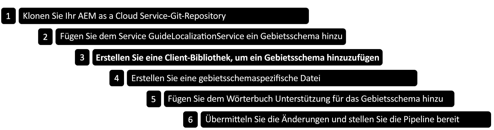

# Gebietsschema für adaptive Forms auf Basis von Kernkomponenten hinzufügen {#supporting-new-locales-for-adaptive-forms-localization}


| Version | Artikel-Link |
| -------- | ---------------------------- |
| Foundation-Komponenten | [Hier klicken](supporting-new-language-localization.md) |
| Kernkomponenten | Dieser Artikel |

AEM Forms bietet vorkonfiguriert Unterstützung für die Gebietsschemata Englisch (en), Spanisch (es), Französisch (fr), Italienisch (it), Deutsch (de), Japanisch (ja), brasilianisches Portugiesisch (pt-BR), Chinesisch (zh-CN), Chinesisch – Taiwan (zh-TW) und Koreanisch (ko-KR). Sie können auch Unterstützung für weitere Gebietsschemata hinzufügen, wie Hindi (hi_IN).

## Gebietsschema-Wörterbücher {#about-locale-dictionaries}

Die Lokalisierung von adaptiven Formularen beruht auf zwei Arten von Gebietsschema-Wörterbüchern:

* **Formularspezifisches Wörterbuch** Enthält Zeichenfolgen, die in adaptiven Formularen verwendet werden. Beispielsweise Beschriftungen, Feldnamen, Fehlermeldungen und Hilfebeschreibungen. Wird für jedes Gebietsschema in Form eines Satzes von XLIFF-Dateien für die einzelnen Gebietsschemas verwaltet und ist unter `[author-instance]/libs/cq/i18n/gui/translator.html` verfügbar.

* **Globale Wörterbücher** In der AEM-Client-Bibliothek gibt es zwei globale Wörterbücher, die als JSON-Objekte verwaltet werden. Diese Wörterbücher enthalten Standardfehlermeldungen, Monatsnamen, Währungssymbole, Datums- und Uhrzeitmuster usw. Sie finden diese Wörterbücher unter `[author-instance]/libs/fd/xfaforms/clientlibs/I18N`. Für jedes Gebietsschema gibt es einen separaten Ordner. Globale Wörterbücher werden nicht oft aktualisiert. Durch die separaten JavaScript-Dateien für jedes Gebietsschema können Browser diese im Cache zwischenspeichern. Dies reduziert den Netzwerk-Traffic, wenn auf demselben Server auf verschiedene adaptive Formulare zugegriffen wird.

## Voraussetzungen {#prerequistes}

Bevor Sie mit der Unterstützung für ein neues Gebietsschema beginnen,

* Installieren Sie einen Nur-Text-Editor (IDE) für eine einfachere Bearbeitung. Die Beispiele in diesem Dokument basieren auf Microsoft VS Code.
* Klonen Sie das Repository der adaptiven Forms-Kernkomponenten. So klonen Sie das Repository:
   1. Öffnen Sie die Befehlszeile oder das temporäre Fenster und navigieren Sie zu einem Speicherort für das Repository. Beispiel `/adaptive-forms-core-components`
   1. Führen Sie den folgenden Befehl aus, um das Repository zu klonen:

      ```SHELL
          git clone https://github.com/adobe/aem-core-forms-components.git
      ```

  Das Repository enthält eine Client-Bibliothek, die zum Hinzufügen eines Gebietsschemas erforderlich ist.


## Gebietsschema hinzufügen {#add-localization-support-for-non-supported-locales}

AEM Forms unterstützt die Lokalisierung von Inhalten in adaptiven Formulare in den Sprachumgebungen Englisch (en), Spanisch (es), Französisch (fr), Italianisch (it), Deutsch (de), Japanisch (ja), brasilianisches Portugiesisch (pt-BR), Chinesisch (zh-CN), Chinesisch – Taiwan (zh-TW) und Koreanisch (ko-KR). Gehen Sie wie folgt vor, um Unterstützung für ein neues Gebietsschema zur Laufzeit von Adaptive Forms hinzuzufügen:



### 1. Klonen Sie Ihr AEM as a Cloud Service Git-Repository {#clone-the-repository}

1. Öffnen Sie die Befehlszeile und wählen Sie einen Ordner zum Speichern des Repositorys aus, z. B. `/cloud-service-repository/`.

1. Führen Sie den folgenden Befehl aus, um das Repository zu klonen:

   ```SHELL
   git clone https://git.cloudmanager.adobe.com/<my-org>/<my-program>/
   ```

   Ersetzen `<my-org>` und `<my-program>` in der obigen URL mit Ihrem Organisationsnamen und Programmnamen. Detaillierte Anweisungen zum Abrufen des Organisationsnamens, Programmnamens oder des vollständigen Pfads Ihres Git-Repositorys sowie der zum Klonen des Repositorys erforderlichen Anmeldeinformationen finden Sie im Abschnitt [Zugriff auf Git](https://experienceleague.adobe.com/docs/experience-manager-cloud-service/content/onboarding/journey/developers.html?lang=de#accessing-git) Artikel.

   Nach erfolgreichem Abschluss des Befehls wird ein Ordner `<my-program>` erstellt wird. Sie enthält den Inhalt, der aus dem Git-Repository geklont wurde. Im Rest des Artikels wird der Ordner als `[AEM Forms as a Cloud Service Git repostory]`.


### 2. Fügen Sie dem Guide Localization Service das neue Gebietsschema hinzu. {#add-a-locale-to-the-guide-localization-service}

1. Öffnen Sie den im vorherigen Abschnitt geklonten Repository-Ordner in einem Texteditor.
1. Navigieren Sie zum Ordner `[AEM Forms as a Cloud Service Git repostory]/ui.config/src/main/content/jcr_root/apps/<appid>/osgiconfig/config`. Sie finden die `<appid>` im `archetype.properties` -Dateien des Projekts.
1. Öffnen Sie die Datei `[AEM Forms as a Cloud Service Git repostory]/ui.config/src/main/content/jcr_root/apps/<appid>/osgiconfig/config/Guide Localization Service.cfg.json`, um sie zu bearbeiten. Wenn die Datei nicht vorhanden ist, erstellen Sie sie. Eine Beispieldatei mit unterstützten Gebietsschemata sieht wie folgt aus:

   

1. Fügen Sie die [Gebietsschema-Code für die Sprache](https://de.wikipedia.org/wiki/Liste_der_ISO-639-1-Codes) Sie möchten z. B. &quot;hi&quot;für &quot;nachträglich&quot;hinzufügen.
1. Speichern und schließen Sie die Datei.

### 3. Erstellen einer Client-Bibliothek zum Hinzufügen eines Gebietsschemas

AEM Forms bietet eine Beispiel-Client-Bibliothek, mit der Sie neue Gebietsschemata einfach hinzufügen können. Sie können die `clientlib-it-custom-locale` Client-Bibliothek aus dem Repository Adaptive Forms Core Components auf GitHub in Ihr as a Cloud Service Forms-Repository. Gehen Sie wie folgt vor, um die Client-Bibliothek hinzuzufügen:

1. Öffnen Sie das Repository Adaptive Forms Core Components in Ihrem Texteditor. Wenn Sie das Repository nicht geklont haben, lesen Sie [Voraussetzungen](#prerequistes) für Anweisungen zum Klonen des Repositorys.
1. Wechseln Sie in das Verzeichnis `/aem-core-forms-components/it/apps/src/main/content/jcr_root/apps/forms-core-components-it/clientlibs`.
1. Kopieren Sie die `clientlib-it-custom-locale` Verzeichnis.
1. Navigieren Sie zu `[AEM Forms as a Cloud Service Git repostory]/ui.apps/src/main/content/jcr_root/apps/moonlightprodprogram/clientlibs` und fügen Sie die `clientlib-it-custom-locale` Verzeichnis.


### 4. Gebietsschemaspezifische Datei erstellen {#locale-specific-file}

1. Navigieren Sie zu `[AEM Forms as a Cloud Service Git repostory]/ui.apps/src/main/content/jcr_root/apps/<program-id>/clientlibs/clientlib-it-custom-locale/resources/i18n/`
1. Suchen Sie die [Englisch locale .json file on GitHub](https://github.com/adobe/aem-core-forms-components/blob/master/ui.af.apps/src/main/content/jcr_root/apps/core/fd/af-clientlibs/core-forms-components-runtime-all/resources/i18n/en.json), der den neuesten Satz von Standardzeichenfolgen enthält, die im Produkt enthalten sind.
1. Erstellen Sie eine neue JSON-Datei für Ihr spezifisches Gebietsschema.
1. Spiegeln Sie in der neu erstellten JSON-Datei die Struktur der englischen Gebietsschema-Datei.
1. Ersetzen Sie die englischen Sprachzeichenfolgen in Ihrer JSON-Datei durch die entsprechenden lokalisierten Zeichenfolgen für Ihre Sprache.
1. Speichern und schließen Sie die Datei.


### 4. Gebietsschema-Unterstützung zum Wörterbuch hinzufügen {#add-locale-support-for-the-dictionary}

Führen Sie diesen Schritt nur dann durch, wenn das `<locale>`, das Sie hinzufügen möchten, nicht unter den Gebietsschemata `en`, `de`, `es`, `fr`, `it`, `pt-br`, `zh-cn`, `zh-tw`, `ja` oder `ko-kr` ist.

1. Navigieren Sie zum Ordner `[AEM Forms as a Cloud Service Git repostory]/ui.content/src/main/content/jcr_root/etc/`.

1. Erstellen Sie eine `etc` Ordner unter `jcr_root` Ordner, falls noch nicht vorhanden.

1. Ordner erstellen `languages` unter `etc` Ordner, falls noch nicht vorhanden.

   

1. Erstellen Sie eine `.content.xml` Datei unter `languages` Ordner. Fügen Sie der Datei den folgenden Inhalt hinzu:

   ```XML
   <?xml version="1.0" encoding="UTF-8"?>
   <jcr:root xmlns:jcr="http://www.jcp.org/jcr/1.0" xmlns:nt="http://www.jcp.org/jcr/nt/1.0"
   jcr:primaryType="nt:unstructured"
   languages="[de,es,fr,it,pt-br,zh-cn,zh-tw,ja,ko-kr]"/>
   ```

1. Fügen Sie den Gebietsschema-Code zum `languages` -Eigenschaft. Zum Beispiel hat hi für das Eingabefeld zum folgenden Beispielcode hinzugefügt.


   ```XML
   <?xml version="1.0" encoding="UTF-8"?>
   <jcr:root xmlns:jcr="http://www.jcp.org/jcr/1.0" xmlns:nt="http://www.jcp.org/jcr/nt/1.0"
   jcr:primaryType="nt:unstructured"
   languages="[de,es,fr,it,pt-br,zh-cn,zh-tw,ja,ko-kr,hi]"/>
   ```

1. Fügen Sie die neu erstellten Ordner im `filter.xml` under `/ui.content/src/main/content/meta-inf/vault/filter.xml` as:

   ```
   <filter root="/etc/languages"/>
   ```

   

### 5. Zusagen der Änderungen und Bereitstellen der Pipeline {#commit-changes-in-repo-deploy-pipeline}

Übertragen Sie die Änderungen an das GIT-Repository, nachdem Sie eine neue Gebietsschema-Unterstützung hinzugefügt haben. Stellen Sie Ihren Code mithilfe der Full-Stack-Pipeline bereit. Erfahren Sie, wie Sie [eine Pipeline einrichten](https://experienceleague.adobe.com/docs/experience-manager-cloud-service/content/onboarding/journey/developers.html?lang=de#setup-pipeline), um Unterstützung für ein neues Gebietsschema hinzuzufügen.
Sobald die Pipeline-Einrichtung abgeschlossen ist, wird das neu hinzugefügte Gebietsschema in der AEM-Umgebung angezeigt.

## Verwenden eines hinzugefügten Gebietsschemas in adaptiven Formularen {#use-added-locale-in-af}

Führen Sie die folgenden Schritte aus, um ein adaptives Formular mit einem neu hinzugefügten Gebietsschema zu verwenden und zu rendern:

1. Melden Sie sich bei Ihrer AEM-Autoreninstanz an.
1. Gehen Sie zu **Formulare** > **Formulare und Dokumente**.
1. Wählen Sie ein adaptives Formular aus und klicken Sie auf **Wörterbuch hinzufügen**. Daraufhin wird der Assistent **Wörterbuch zum Übersetzungsprojekt hinzufügen** geöffnet.
1. Geben Sie den **Projekttitel** an und wählen Sie die **Zielsprachen** aus dem Dropdown-Menü im Assistenten **Wörterbuch zum Übersetzungsprojekt hinzufügen**.
1. Klicken auf **Fertig** und führen Sie das erstellte Übersetzungsprojekt aus.
1. Wählen Sie ein adaptives Formular aus und klicken Sie auf **Vorschau als HTML**.
1. Fügen Sie `&afAcceptLang=<locale-name>` in der URL eines adaptiven Formulars hinzu.
1. Aktualisieren Sie die Seite. Das adaptive Formular wird daraufhin im angegebenen Gebietsschema dargestellt.

Es gibt zwei Methoden, das Gebietsschema eines adaptiven Formulars zu identifizieren. Beim Rendern identifiziert ein adaptives Formular das angeforderte Gebietsschema folgendermaßen:

* Durch Abrufen des `[local]`-Selektors in der URL des adaptiven Formulars. Das Format der URL ist `http://host:[port]/content/forms/af/[afName].[locale].html?wcmmode=disabled`. Mithilfe der `[local]`-Auswahl können adaptive Formulare zwischengespeichert werden.

* Durch Abrufen der folgenden Parameter in der angegebenen Reihenfolge:

   * Anforderungsparameter `afAcceptLang`
Um das Browsergebietsschema der Benutzer zu überschreiben, können Sie die `afAcceptLang` -Anfrageparameter, um das Gebietsschema zu erzwingen. So erzwingt beispielsweise die folgende URL die Darstellung des Formulars im kanadisch-französischen Gebietsschema:
     `https://'[server]:[port]'/<contextPath>/<formFolder>/<formName>.html?wcmmode=disabled&afAcceptLang=ca-fr`

   * Das für den Benutzer bzw. die Benutzerin festgelegte Browser-Gebietsschema, das in der Abfrage über den Header `Accept-Language` spezifiziert wird.

Wenn keine Client-Bibliothek für das angeforderte Gebietsschema vorhanden ist, wird nach einer Client-Bibliothek für den Sprachcode im Gebietsschema gesucht. Wenn das angeforderte Gebietsschema beispielsweise `en_ZA` (Südafrikanisches Englisch) und die Client-Bibliothek für `en_ZA` nicht vorhanden ist, verwendet das adaptive Formular die Client-Bibliothek für `en` (Englisch) Sprache, sofern vorhanden. Wenn jedoch keines davon vorhanden ist, verwendet das adaptive Formular das Wörterbuch für das Gebietsschema `en`.


Nachdem das Gebietsschema identifiziert ist, wählt das adaptive Formular das formularspezifische Wörterbuch aus. Wenn das formularspezifische Wörterbuch für das angeforderte Gebietsschema nicht gefunden wird, wird das Wörterbuch für die Sprache verwendet, in der das adaptive Formular erstellt wird.

Wenn keine Sprachinformationen verfügbar sind, wird das adaptive Formular in seiner Originalsprache angezeigt, der Sprache, die bei seiner Entwicklung verwendet wird.

Holen Sie sich die [Muster-Client-Bibliothek](/help/forms/assets/locale-support-sample.zip), um die Unterstützung für neue Gebietsschemata hinzuzufügen. Sie müssen den Inhalt des Ordners im erforderlichen Gebietsschema ändern.

## Best Practices zur Unterstützung neuer Lokalisierungen {#best-practices}

* Adobe empfiehlt die Erstellung eines Übersetzungsprojekts nach der Erstellung eines adaptiven Formulars.

* Wenn neue Felder in einem vorhandenen adaptiven Formular hinzugefügt werden:
   * **Für maschinelle Übersetzung**: Erstellen Sie das Wörterbuch neu und führen Sie das Übersetzungsprojekt aus. Felder, die einem adaptiven Formular nach dem Erstellen eines Übersetzungsprojekts hinzugefügt wurden, bleiben unübersetzt.
   * **Für die menschliche Übersetzung**: Exportieren Sie das Wörterbuch über `[server:port]/libs/cq/i18n/gui/translator.html`. Aktualisieren Sie das Wörterbuch für die neu hinzugefügten Felder und laden Sie es hoch.
