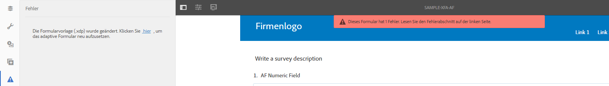
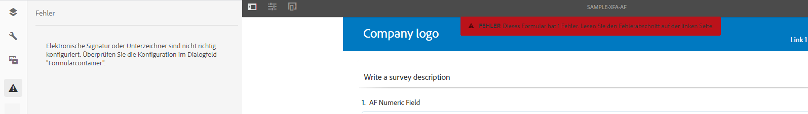
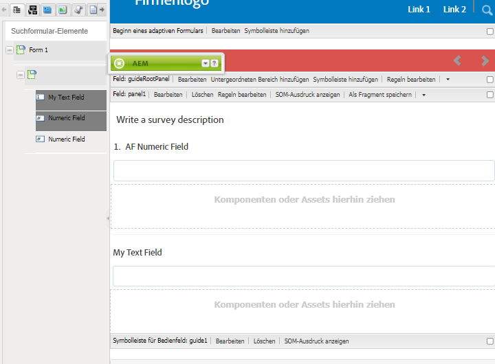
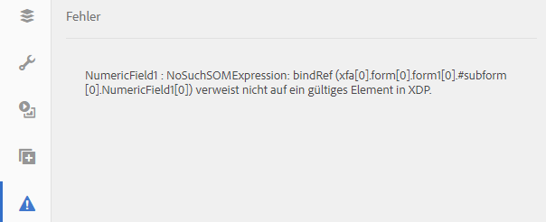

# Synchronisieren von adaptiven Formularen mit XFA-Formularvorlagen{#synchronizing-adaptive-forms-with-xfa-form-templates}

## Einführung {#introduction}

Sie können adaptive Formulare basierend auf einer XFA-Formularvorlage (`*.XDP`-Datei) erstellen. Diese Wiederverwendung ermöglicht es Ihnen, das, was Sie in bestehende XFA-Formulare investiert haben, zu erhalten. Informationen dazu, wie Sie mithilfe einer XFA-Formularvorlage ein adaptives Formular erstellen, finden Sie unter [Erstellen eines adaptiven Formulars basierend auf einer Vorlage](creating-adaptive-form.md).

Sie können Felder aus der XDP-Datei in Ihrem adaptiven Formular wiederverwenden. Diese Felder werden als gebundene Felder bezeichnet. Die Eigenschaften der gebundenen Felder (wie Skripte, Beschriftungen und Anzeigeformat) werden aus der XDP-Datei kopiert. Sie können sich auch dafür entscheiden, die Werte einiger dieser Eigenschaften zu überschreiben.

[!DNL AEM Forms] bietet die Möglichkeit, die Felder der adaptiven Formulare mit allen Änderungen synchronisiert zu halten, die später an den entsprechenden Feldern in der XDP-Datei vorgenommen werden. In diesem Artikel wird beschrieben, wie Sie diese Synchronisierung aktivieren können.

In der Autorenumgebung von [!DNL AEM Forms] können Sie Felder aus einem XFA-Formular (links) in ein adaptives Formular (rechts) ziehen.

## Voraussetzungen {#prerequisites}

Um die Informationen in diesem Artikel nutzen zu können, sollten Sie mit den folgenden Themen vertraut sein:

* [Erstellen eines adaptiven Formulars](creating-adaptive-form.md)

* XFA (XML Forms Architecture)

Um die Assets für das Beispiel im Artikel zu verwenden, laden Sie das Beispielpaket wie im nächsten Abschnitt ([Beispielpaket](synchronizing-adaptive-forms-xfa.md#p-sample-package-p)) beschrieben herunter.

## Beispielpaket {#sample-package}

Der Artikel verwendet ein Beispiel, um zu veranschaulichen, wie Sie das adaptive Formular mit einer aktualisierten XFA-Formularvorlage synchronisieren. Die im Beispiel verwendeten Assets sind in einem Paket verfügbar, das aus dem Abschnitt [Downloads](synchronizing-adaptive-forms-xfa.md#p-downloads-p) in diesem Artikel heruntergeladen werden kann.

Nachdem Sie das Paket hochgeladen haben, können Sie diese Assets in der [!DNL AEM Forms]-Benutzeroberfläche anzeigen.

Installieren Sie das Paket mit dem Package Manager: `https://<server>:<port>/crx/packmgr/index.jsp`

Das Paket enthält die folgenden Assets:

1. `sample-form.xdp`: Die als Beispiel verwendete XFA-Formularvorlage

1. `sample-xfa-af`: Das adaptive Formular, das auf der Datei sample-form.xdp basiert. Dieses adaptive Formular enthält jedoch keine Felder. Im nächsten Schritt fügen wir diesem adaptiven Formular Inhalte hinzu.

### Hinzufügen von Inhalten zu einem adaptiven Formular {#add-content-to-adaptive-form-br}

1. Navigieren Sie zu https://&lt;server>:&lt;port>/aem/forms.html. Geben Sie Ihre Anmeldeinformationen ein, wenn Sie danach gefragt werden.
1. Öffnen Sie sample-af-xfa zur Bearbeitung im Autorenmodus.
1. Wählen Sie im Inhalts-Browser in der Seitenleiste die Registerkarte „Datenmodellobjekte“. Ziehen Sie „NumericField1“ und „TextField1“ auf das adaptive Formular.
1. Ändern Sie den Titel von „NumericField1“ von **Numerisches Feld** zu **Numerisches AF-Feld**.

>[!NOTE]
>
>In den vorangegangenen Schritten haben wir eine Eigenschaft eines Felds in der XDP-Datei überschrieben. Diese Eigenschaft wird daher nicht synchronisiert, wenn die entsprechende Eigenschaft in der XDP-Datei später geändert wird.

## Erkennen von Änderungen in der XDP-Datei {#detecting-changes-in-xdp-file}

Sobald es Änderungen in einer XDP-Datei oder einem Fragment gibt, kennzeichnet die [!DNL AEM Forms]-Benutzeroberfläche alle adaptiven Formulare, die auf der XDP-Datei oder dem Fragment basieren.

Nachdem Sie eine XDP-Datei aktualisiert haben, müssen Sie sie erneut in die [!DNL AEM Forms]-Benutzeroberfläche hochladen, damit die Änderungen gekennzeichnet werden.

Als Beispiel aktualisieren wir die Datei `sample-form.xdp` mithilfe der folgenden Schritte:

1. Navigieren Sie zu `https://<server>:<port>/projects.html.`. Geben Sie bei Aufforderung Ihre Anmeldedaten ein.
1. Klicken Sie links auf die Registerkarte „Formulare“.
1. Laden Sie die Datei `sample-form.xdp` auf Ihren lokalen Computer herunter. Die XDP-Datei wird als `.zip`-Datei heruntergeladen, die mit einem beliebigen Entpackprogramm extrahiert werden kann.

1. Öffnen Sie die Datei `sample-form.xdp` und ändern Sie den Titel des Felds „TextField1“ von **Textfeld** zu **Mein Textfeld**.

1. Laden Sie die Datei `sample-form.xdp` wieder in die [!DNL AEM Forms]-Benutzeroberfläche hoch.

Wenn eine XDP-Datei aktualisiert wird, wird ein Symbol im Editor angezeigt, wenn Sie die adaptiven Formulare, die auf der XDP-Datei basieren, bearbeiten. Dieses Symbol zeigt an, dass das adaptive Formular nicht mehr mit der XDP-Datei synchron ist. In der folgenden Abbildung sehen Sie das Symbol links in der Randleiste angezeigt.

## Synchronisieren von adaptiven Formularen mit der aktuellen XDP-Datei {#synchronizing-adaptive-forms-with-the-latest-xdp-file}

Wenn ein adaptives Formular, das mit der XDP-Datei nicht mehr synchron ist, das nächste Mal für das Authoring geöffnet wird, wird die folgende Meldung angezeigt: **Schema/Form Template for the Adaptive Form has been updated. `Click Here` to rebase it with the new version.** (Schema/Formularvorlage für das adaptive Formular wurde geändert. Klicken Sie hier, um ein Rebase mit der neuen Version auszuführen.)

Durch Klicken auf die Meldung werden die Felder im adaptiven Formular mit den zugehörigen Feldern in der XDP-Datei synchronisiert.

Öffnen Sie für das in diesem Artikel verwendete Beispiel `sample-xfa-af` im Autorenmodus. Die Meldung wird am unteren Rand des adaptiven Formulars angezeigt.

### Aktualisieren der Eigenschaften {#updating-the-properties}

Alle Eigenschaften, die aus der XDP-Datei in das adaptive Formular kopiert wurden, werden aktualisiert, mit Ausnahme der Eigenschaften, die in dem adaptiven Formular explizit (im Komponentendialogfeld) vom Autor überschrieben wurden. Die Liste der Eigenschaften, die aktualisiert wurden, ist in den Serverprotokollen verfügbar.

Um die Eigenschaften im adaptiven Formular des Beispiels zu aktualisieren, klicken Sie auf den (mit `"Click Here"` beschrifteten) Link in der Meldung. Der Titel von „TextField1“ ändert sich von **Textfeld** zu **Mein Textfeld**.

>[!NOTE]
>
>Die Beschriftung „Numerisches AF-Feld“ wurde nicht geändert, da Sie diese Eigenschaft im Dialogfeld für die Komponenteneigenschaften überschrieben haben, wie in [Hinzufügen von Inhalten zu adaptiven Formularen](synchronizing-adaptive-forms-xfa.md#p-add-content-to-adaptive-form-br-p) beschrieben.

### Hinzufügen neuer Felder aus einer XDP-Datei in ein adaptives Formular   {#adding-new-fields-from-xdp-file-to-adaptive-form-nbsp}

Felder, die der XDP-Originaldatei später hinzugefügt werden, werden in der Registerkarte „Formularhierarchie“ angezeigt. Sie können diese neuen Felder in das adaptive Formular ziehen.

Sie müssen nicht auf den Link in der Fehlermeldung klicken, um die Felder in der Registerkarte „Formularhierarchie“ zu aktualisieren.

### Gelöschte Felder in der XDP-Datei {#deleted-fields-in-xdp-file}

Wenn ein zuvor in ein adaptives Formular kopiertes Feld in einer XDP-Datei gelöscht wird, wird eine Fehlermeldung im Autorenmodus angezeigt, die angibt, dass das Feld in der XDP-Datei nicht vorhanden ist. In diesem Fall müssen Sie das Feld in dem adaptiven Formular manuell löschen oder die Eigenschaft `bindRef` im Komponentendialogfeld entfernen.

Die folgenden Schritte veranschaulichen diesen Vorgang für die Assets, die in dem Beispiel in diesem Artikel verwendet wurden:

1. Aktualisieren Sie die Datei `sample-form.xdp` und löschen Sie „NumericField1“.
1. Laden Sie die Datei `sample-form.xdp` in die [!DNL AEM Forms]-Benutzeroberfläche hoch.
1. Öffnen Sie das adaptive Formular `sample-xfa-af` für das Authoring. Die folgende Fehlermeldung wird angezeigt: „Schema/Form Template for the Adaptive Form has been updated.“ `Click Here` to rebase it with the new version (Schema/Formularvorlage für das adaptive Formular wurde geändert. Klicken Sie hier, um ein Rebase mit der neuen Version auszuführen.)

1. Klicken Sie auf den (mit „`Click Here`“ beschrifteten) Link in der Meldung. Eine Fehlermeldung wird angezeigt, die besagt, dass das Feld in der XDP-Datei nicht mehr vorhanden ist.

Das gelöschte Feld wird außerdem mit einem Symbol gekennzeichnet, um einen Fehler im Feld anzuzeigen.

>[!NOTE]
>
>Die Felder in dem adaptiven Formular, die eine inkorrekte Bindung aufweisen (einen ungültigen `bindRef`-Wert im Bearbeitungsdialogfeld) werden ebenfalls als gelöschte Felder betrachtet. Wenn die Autorin bzw. der Autor diese Fehler nicht behebt und das adaptive Formular veröffentlicht, wird das Feld als normales, ungebundenes adaptives Formularfeld behandelt und in den ungebundenen Abschnitt der XML-Ausgabedatei aufgenommen.

## Downloads {#downloads}

Inhaltspaket für das Beispiel in diesem Artikel

[Datei laden](assets/sample-xfa-af-sync-1.0.zip)
