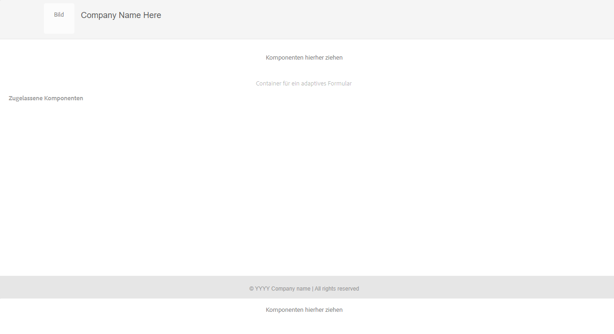

# Erstellen einer adaptiven Formularvorlage basierend auf Kernkomponenten {#adaptive-form-templates}

Wenn Sie ein Formular erstellen, fügen Sie Felder und Komponenten hinzu, um Formularstruktur, Inhalt und Aktionen im Editor zu definieren. Sie können Felder und Komponenten im`guideRootPanel` des Formularcontainers hinzufügen. Mit dem Vorlageneditor können Sie eine Vorlage erstellen, die eine grundlegende Struktur und anfänglichen Inhalt enthält, die Autorinnen und Autoren zum Erstellen von Formularen verwenden können.

Beispiel: Sie möchten, dass alle Autoren in einem Registrierungsformular bestimmte Textfelder, Navigationsschaltflächen und eine Schaltfläche zum Senden verwenden. Sie können eine Vorlage mit den Komponenten erstellen, die Autoren verwenden können, damit ihr Formular konsistent mit anderen Registrierungsformularen ist. Wenn Autorinnen und Autoren die Vorlage verwenden, um ein adaptives Formular zu erstellen, erbt das neue Formular die Struktur und die Komponenten, die Sie in der Vorlage festgelegt haben. Mit dem Vorlageneditor können Sie:

* Kopf- und Fußzeilenkomponenten eines Formulars in der Strukturebene hinzufügen.
* Den anfänglichen Inhalt für das Formular angeben.
* Design und Übermittlungsaktionen festlegen.

<!--
You can download and install [!DNL AEM Forms] reference content package from [Software Distribution](https://experience.adobe.com/#/downloads/content/software-distribution/en/aemcloud.html) portal to import reference themes and templates to your environment.
-->

## Voraussetzung

**Aktivieren der Kernkomponenten von Adaptive Forms für Ihre Umgebung**: Wenn Sie ein Programm erstellen, sind die Kernkomponenten von Adaptive Forms bereits für Ihre Umgebung aktiviert. Installieren Sie die neueste Version, um Kernkomponenten von Adaptive Forms für Ihre AEM Cloud Service-Umgebung zu aktivieren.

>[!NOTE]
>
> Bei der Bereitstellung der Forms as a Cloud Service-Umgebung, die auf Archetyp 45 basiert, werden die Vorlagen für **adaptive Formulare (Kernkomponente)** und auf Kernkomponenten basierende Themen zu Ihrer Umgebung hinzugefügt.

## Arbeiten mit Vorlagen {#working-with-templates}

Über das Menü „Werkzeuge“ können Sie auf den Vorlagen-Editor zugreifen: Navigieren Sie zu **[!UICONTROL Adobe Experience Manager]** > **[!UICONTROL Werkzeuge]** > **[!UICONTROL Allgemein]** > **[!UICONTROL Vorlagen]**. Hier befinden sich die Vorlagen in Ordnern für bearbeitbare Vorlagen.

>[!NOTE]
>
> Sie finden die auf Kernkomponenten basierenden bearbeitbaren Vorlagen in komponentenspezifischen Ordnern.

In Experience Manager steht ein globaler Ordner zum Organisieren von Vorlagen zur Verfügung. Er ist jedoch nicht standardmäßig aktiviert. Sie können Ihren Administrator bitten, den globalen Ordner zu aktivieren, oder einen Ordner für Vorlagen erstellen. Weitere Informationen zum Erstellen von Ordnern finden Sie unter [Vorlagenordner](https://experienceleague.adobe.com/docs/experience-manager-cloud-service/sites/authoring/features/templates.html?lang=de#editing-templates-template-authors).

## Erstellen einer Vorlage {#create-template}

Nachdem Sie einen Ordner erstellt haben, öffnen Sie den Ordner und führen Sie die folgenden Schritte aus, um eine Vorlage zu erstellen:

1. Wählen Sie im erstellten Ordner **[!UICONTROL Erstellen]**.
1. Wählen Sie im Abschnitt **[!UICONTROL Einen Vorlagentyp auswählen]** die Vorlage **[!UICONTROL Adaptives Formular (Kernkomponente)]** und wählen Sie dann **[!UICONTROL Weiter]**.

1. Geben Sie im Abschnitt **[!UICONTROL Vorlagendetails]** einen **Vorlagentitel** ein und wählen Sie **[!UICONTROL Erstellen]**.
Sie können auch eine Beschreibung angeben.

1. Wählen Sie **[!UICONTROL Fertig]**, um zur Konsole zurückzukehren, oder **[!UICONTROL Öffnen]**, um die Vorlage im Editor zu öffnen.

## Benutzeroberfläche des Vorlageneditors {#template-editor-ui}

Wenn Sie eine Vorlage zum Bearbeiten öffnen, können Sie die folgenden AEM-Editor-Komponenten sehen:

* **Seitensymbolleiste**: Enthält die folgenden Optionen:

   * **Seitliches Bedienfeld ein/aus**: Hiermit können Sie die Seitenleiste ein- oder ausblenden.
   * **Seiteninformationen**: Ermöglicht Ihnen die Angabe von Informationen wie dem Zeitpunkt der Veröffentlichung oder der Zurücknahme der Veröffentlichung, Miniaturen, Client-seitigen Bibliotheken, einer Seitenrichtlinie und dem Seiten-Design einer Client-seitigen Bibliothek.
     <!-- * **Emulator**: Lets you simulate and customize the look for different devices.-->
   * **Modusauswahl**: Hiermit können Sie den Modus ändern. Sie können zwischen den Modi **[!UICONTROL Struktur]**, **[!UICONTROL Anfänglicher Inhalt]**, **[!UICONTROL Layout-Steuerung]** wählen. Im Modus „Struktur“ können Sie die Kopf- und Fußzeile hinzufügen und anpassen. Im Modus „Anfänglicher Inhalt“ können Sie den Formularinhalt anpassen.
   * **Vorschau**: Hier können Sie das Aussehen der Vorlage bei Veröffentlichung in einer Vorschau simulieren. Sie können den Ebenenselektor und die Vorschau verwenden, um zwischen Bearbeitungs- und Vorschau-Modus zu wechseln.
* **Seitenleiste**: Enthält Inhalts-, Eigenschaften-, Elemente- und Komponenten-Browser.
* **Komponenten-Symbolleiste**: Wenn Sie eine Komponente auswählen, sehen Sie eine Symbolleiste, in der Sie die Komponente anpassen können.
* **Seite**: Der Bereich, in dem Sie Inhalt hinzufügen, um die Vorlage zu erstellen.

<!-- See [Introduction to authoring Adaptive Forms](introduction-forms-authoring.md) to understand the Touch UI editor. -->

## Bearbeiten einer Vorlage {#editing-a-template}

Verschiedene Modi zum Auswählen und Bearbeiten des entsprechenden Aspekts der Vorlage:

* [Struktur](#structure)
* [Anfänglicher Inhalt](#initial-content)
* [Layout](#layout)

Der Ebenenselektor ist neben der Option „Vorschau“ in der rechten oberen Ecke des Bildschirms verfügbar.

### Struktur {#structure}

Wenn Sie die Strukturebene im Vorlageneditor auswählen, ist es hilfreich, im Voraus die Inhalte zu definieren, die beim Erstellen der mit der Vorlage verknüpften adaptiven Formulare nicht geändert werden können.

<!-- you can see the layout containers above and below the Adaptive Form Container. Authors can use these layout containers for header and footer. -->

<!--

**A. Layout container for Header component**
Drag-drop the Adaptive Form Header component in the layout container above the Adaptive Form Container. After you add the component, you can specify its properties that let you add a logo and provide its title.
**B. Adaptive Form Container component**
Drag-drop the Adaptive Form components in the Adaptive Form Container. You can specify the design and arrangement of fields and components in the template editor. After you add the components, you can specify its properties.
**C. Layout container for Footer component**
Similarly, when you drag-drop the footer component in the layout container below the Adaptive Form Container, you can provide the copyright information and company details. 
You can add, edit, or customize the header and footer. Drag-drop the Adaptive Form Header and Footer component to customize the template. Drag-drop the Adaptive Form components in the Adaptive Form Container. You can specify the design and arrangement of fields and components in the template editor. 

Header and footer are added in the Initial Content layer.
-->

#### Sperren/Entsperren von Komponenten in der Strukturebene {#locking-unlocking-components-in-the-structure-layer}

Wenn Sie die Vorlage bearbeiten, wenn die Strukturebene ausgewählt ist, können Sie die Kopf- und Fußzeile der Vorlage entsperren. Wenn eine Komponente in der Vorlage entsperrt wurde, können Formularautoren die Komponente in dem adaptiven Formular bearbeiten, das die Vorlage verwendet. Das Sperren einer Komponente verhindert ihre Bearbeitung durch Formularautoren. Die Sperroption ist in der Komponenten-Symbolleiste verfügbar.

Beispielsweise können Sie die Kopfzeilenkomponente zur Vorlage hinzufügen. Wenn Sie die Komponente auswählen, wird in der Komponenten-Symbolleiste eine Sperroption angezeigt. In der Regel enthält die Kopfzeile den Firmennamen und das Logo und Sie möchten nicht, dass Formularautorinnen und -autoren das Logo und die Kopfzeile in einer Vorlage ändern. In einem adaptiven Formular, das mit der Vorlage erstellt wurde, bei der die Kopfzeilenkomponente gesperrt ist, können Formularautoren das Logo und den Firmennamen nicht ändern.

>[!NOTE]
>
>Es wird davon abgeraten, ein Bild oder Logo in der Kopfzeilenkomponente einzeln zu sperren oder zu entsperren. Sie können die Kopfzeilenkomponente entsperren.

### Anfänglicher Inhalt {#initial-content}

Wenn die Option „Anfänglicher Inhalt“ ausgewählt ist, wird der Container des adaptiven Formulars der Vorlage wie ein adaptives Formular zur Bearbeitung geöffnet. Damit können Sie vordefinierte Inhalte erstellen, die beim Erstellen von adaptiven Formularen, die mit der Vorlage verknüpft sind, geändert werden können. Wie beim Authoring eines adaptiven Formulars können Sie anfängliche Einstellungen festlegen, z. B. das Design und Übermittlungsaktionen.

Formularautorinnen und -autoren verwenden sie als Grundlage zum Erstellen eines Formulars. Die Struktur des Inhaltsflusses wird in der Ebene „Anfänglicher Inhalt“ der Vorlage angegeben. Um zum Bearbeiten des anfänglichen Inhalts der Formularvorlage zu wechseln, bevor Sie die Vorschau in der Seitensymbolleiste anzeigen, wählen Sie  **>** **[!UICONTROL Anfänglicher Inhalt]**.

In der Ebene „Anfänglicher Inhalt“ erstellen Sie die Vorlage für ein adaptives Formular, das Ihre Autoren als Grundlage verwenden. Das Erstellen einer Vorlage ähnelt dem Erstellen eines Formulars. Sie verwenden die in der Seitenleiste verfügbaren Optionen. Die Seitenleiste bietet Browser für Inhalte, Eigenschaften, Assets und Komponenten.

<!-- See [Sidebar](introduction-forms-authoring.md#sidebar). -->

>[!NOTE]
>
>Wenn Sie als Übermittlungsaktion „Inhalt speichern“ oder „PDF speichern“ auswählen, wird die Option zum Angeben des Speicherpfads angezeigt. Wenn Sie den Pfad in der Vorlage angeben, haben alle daraus erstellten Formulare denselben Pfad. Sie können den richtigen Speicherpfad angeben oder sicherstellen, dass Formularautorinnen und -autoren ihn aktualisieren, um zu verhindern, dass Daten aus jedem Formular an demselben Speicherort gespeichert werden.

### Layout {#layout}

Bei der Bearbeitung einer Vorlage können Sie das Layout festlegen, wobei standardmäßig ein responsives Layout verwendet wird. Das Layout hilft bei der Verwaltung der Breite einer Komponente basierend auf der Gerätebreite, um einen responsiven Entwurf eines adaptiven Formulars zu erleichtern.

Weitere Informationen finden Sie in dem Artikel [Grundlegendes zum responsiven Layout](https://experienceleague.adobe.com/docs/experience-manager-learn/sites/page-authoring/responsive-layout-feature-video-understand.html?lang=de).

## Aktivieren der Vorlage {#enabling-the-template}

Wenn Sie eine Vorlage erstellen, wird sie als Entwurf hinzugefügt. Aktivieren Sie die Vorlage, um sie zum Erstellen von adaptiven Formularen zu verwenden. Aktivieren einer Vorlage:

1. Navigieren Sie zu **[!UICONTROL Adobe Experience Manager]** > **[!UICONTROL Tools]** > **[!UICONTROL Vorlagen]** und öffnen Sie den Ordner, in dem Sie die Vorlage erstellt haben.
Die Vorlage, die Sie erstellt haben, ist als Entwurf gekennzeichnet.
1. Wählen Sie die Vorlage aus und wählen Sie dann **[!UICONTROL Aktivieren]** in der Symbolleiste.
Beim Erstellen eines adaptiven Formulars wird Ihnen die Vorlage angezeigt, wenn Sie aufgefordert werden, eine Vorlage auszuwählen.

## Importieren oder Exportieren einer Vorlage {#importing-or-exporting-a-template}

Ein Formular funktioniert mit seiner Vorlage. Wenn Sie ein adaptives Formular herunterladen, das mit einer benutzerdefinierten Vorlage erstellt wird, wird die Vorlage nicht heruntergeladen. Wenn Sie das Formular in eine andere [!DNL AEM Forms]-Instanz importieren, wird es ohne die Vorlage importiert. Wenn ein Formular importiert wird, aber die Vorlage nicht verfügbar ist, wird das Formular nicht gerendert. Es ist auch möglich, die benutzerdefinierte Vorlage vom `/conf`-Knoten in `https://<server>:<port>/crx/packmgr` zu verpacken und in die [!DNL AEM Forms]-Instanz zu importieren, in die Sie das Formular hochladen möchten. Sie können auch [eine Vorlage mit dem AEM-Archetyp erstellen und sie für Ihre Cloud Services-Instanz bereitstellen](https://experienceleague.adobe.com/docs/experience-manager-learn/getting-started-wknd-tutorial-develop/pages-templates.html?lang=de#prerequisites).

>[!NOTE]
>
> * Sie können die Vorlage [!UICONTROL Datensatzdokument] auch direkt im Editor für adaptive Formulare oder Vorlagen-Editor für adaptive Formulare konfigurieren. Weitere Informationen finden Sie unter [Generieren von Datensatzdokumenten für adaptive Formulare](/help/forms/generate-document-of-record-for-non-xfa-based-adaptive-forms.md#document-of-record-support-in-adaptive-form-editor-dor-support-in-adaptiveform).

## Verknüpfen eines Formulardatenmodellschema mit einer Vorlage {#associating-form-data-model-schema-in-template}

Autorinnen und Autoren können ein [!UICONTROL Formulardatenmodellschema] in einem Vorlagen-Editor mit einer Vorlage für ein adaptives Formular verknüpfen. Dies ermöglicht es Autorinnen und Autoren, ein Schema aus dem Vorlageneditor auswählen. Wenn Sie ein Schema mit einer Vorlage verknüpfen und Formularautorinnen oder -autoren ein Formular basierend auf der Vorlage erstellen, wird das Schema für das Formular vorausgewählt. Dies hilft Formularautorinnen und -autoren, die Verwendung von Schemata zu regeln und spart ihnen außerdem Zeit. So wählen Sie ein Formulardatenmodellschema im Vorlageneditor aus:

1. Wählen Sie auf der linken Seite **[!UICONTROL Inhalts-Browser]** aus.
1. Navigieren Sie zum Formular-Container **[!UICONTROL Einstellung]**.
1. Wählen Sie **[!UICONTROL Datenmodell]** aus.
1. Wählen Sie das Formulardatenmodell (FDM) über **[!UICONTROL Formulardatenmodell auswählen]** und speichern Sie die Konfiguration.

<!--

## Creating an Adaptive Form template with tabs and panels {#creating-an-adaptive-form-template-with-tabs-and-panels-nbs}

For example, you want to create a template with the following tabs:

* General Information
* Professional Information

You have added a logo, provided a title, and added a footer in the structure layer. Lock the header and footer to stop form authors from editing them when they use the template to create forms.

Change the layer from **Structure** to **Initial Content**, and start adding content to the form. To create a tabbed structure, add a child Panel in the guideRootPanel of the Adaptive Form container. To add a panel:

* You can add a panel by tapping the **[!UICONTROL +]** button when you select the **[!UICONTROL Drag components here]** option.

* You can drag-drop the panel component from the components browser in the sidebar.
* You can add child panel of the `guideRootPanel` from the component toolbar.

To create the General Information and Professional Information tabs, add two panels in the child panel of the `guideRootPanel`. Select the panels and select  to open the properties in the sidebar. Change the element names as `general-info` and `professional-info`, and titles as General Information and Professional Information respectively. In the sidebar, select content to open the content browser. In the Form Objects tab, select `guideRootPanel`. In the editor, the guideRootPanel is selected. Select  in the component toolbar to open its properties. In the Panel Layout field, select **[!UICONTROL Tabs on Top]** and select **[!UICONTROL Done]**. The tabbed template structure is applied.

### Adding content in tabs {#adding-content-in-tabs}

After you add panels and structure them as tabs, you can add fields inside the tabs. When you select a tab in the editor, you can see the **[!UICONTROL Drag components here]** option. You can drag-drop components such as text-boxes, list items, and buttons. You can drag-drop components from the components browser in the sidebar.

Each component has properties that enhance data capturing and manipulation. For example, you can enable the **[!UICONTROL Required field]** property of a component. Your authors can specify a message that your customers see when they skip filling a required field. Specify the message in **[!UICONTROL Required Field Message]** property.

In the example template, Name, Phone number, and Date of birth fields are added in the General Information tab. In the Professional Information tab, Currently employed, employment type, Educational qualification fields are added.

After you have added fields, you can add buttons such as Submit and Reset.
-->

### Hinzufügen benutzerdefinierter Eigenschaften zu adaptiven Formularkomponenten mithilfe der Vorlagenrichtlinie

Mit der Option „Benutzerdefinierte Eigenschaften“ können Sie mithilfe der Formularvorlage benutzerdefinierte Attribute (Schlüssel-Wert-Paare) mit einer Kernkomponente eines adaptiven Formulars verknüpfen. Die benutzerdefinierten Eigenschaften werden im Abschnitt **[!UICONTROL Eigenschaften]** der Headless-Ausgabedarstellung der Komponente angezeigt. So kann ein dynamisches Formularverhalten erzeugt werden, das sich je nach den benutzerdefinierten Attributwerten anpasst. Beispielsweise können Entwickelnde verschiedene Ausgabedarstellungen einer Headless-Formularkomponente für Mobile-, Desktop- oder Web-Plattformen entwerfen und so das Benutzererlebnis auf einer Vielzahl von Geräten erheblich verbessern.

Schritte zum Hinzufügen benutzerdefinierter Eigenschaften zu Kernkomponentenfeldern für adaptive Formulare:

1. [Fügen Sie in der Richtlinie eines Vorlageneditors einen benutzerdefinierten Gruppennamen hinzu](#add-a-custom-group-name)
1. [Auswählen eines benutzerdefinierten Gruppennamen im Dialogfeld „Bearbeiten“ einer Komponente eines adaptiven Formulars](#select-a-custom-group-name)

#### Fügen Sie in der Richtlinie des Vorlageneditors einen benutzerdefinierten Gruppennamen hinzu {#add-a-custom-group-name}

1. Navigieren Sie zu **[!UICONTROL Adobe Experience Manager]** > **[!UICONTROL Tools]** > **[!UICONTROL Allgemein]** > **[!UICONTROL Vorlagen]**.
1. Wählen Sie die Vorlage basierend auf Kernkomponenten aus und öffnen Sie sie im Bearbeitungsmodus.
1. Klicken Sie auf das Symbol **[!UICONTROL Richtlinie]**  eines Kernkomponentenfelds für adaptive Formulare, in dem die benutzerdefinierten Eigenschaften definiert werden müssen. Das Dialogfeld **[!UICONTROL Adaptives Formularfeld]** wird angezeigt.
1. Wählen Sie die Registerkarte **[!UICONTROL Benutzerdefinierte Eigenschaften]** aus.
1. Geben Sie den **[!UICONTROL Richtliniennamen]** unter dem Abschnitt **[!UICONTROL Richtlinie]** an.
1. Geben Sie den **[!UICONTROL Gruppennamen]** an und fügen Sie ein Schlüssel-Wert-Paar hinzu, das einer bestimmten Gruppe zugeordnet ist. Der Gruppenname ist für Formularautorinnen und -autoren im Dialogfeld „Bearbeiten“ einer Komponente sichtbar. Wenn Sie den Gruppennamen auswählen, gilt jedes zugeordnete Schlüssel-Wert-Paar für eine Komponente.
1. Klicken Sie auf **[Fertig]**.

Wenn Sie mithilfe der Vorlagenrichtlinie eine oder mehrere benutzerdefinierte Eigenschaftsgruppen hinzufügen, wird im Dialogfeld „Bearbeiten“ einer entsprechenden Kernkomponente die Registerkarte **[!UICONTROL Erweitert]** angezeigt.

#### Wählen Sie im Dialogfeld „Bearbeiten“ einer Kernkomponente einen benutzerdefinierten Gruppennamen aus {#select-a-custom-group-name}

1. Öffnen Sie ein adaptives Formular im Bearbeitungsmodus.
1. Wählen Sie die Komponente aus, für die die benutzerdefinierten Eigenschaften im Vorlageneditor definiert wurden, und wählen Sie dann  aus, um das Dialogfeld „Bearbeiten“ der Komponente zu öffnen.
1. Wählen Sie die Registerkarte **[!UICONTROL Erweitert]** aus.
1. Wählen Sie den Namen der benutzerdefinierten Eigenschaftsgruppe aus der Dropdown-Liste **[!UICONTROL Benutzerdefinierte Eigenschaftsauswahl]** aus. Alle definierten benutzerdefinierten Gruppennamen werden automatisch in die Dropdown-Liste eingefügt.
1. Wählen Sie **[!UICONTROL Fertig]**, um die Eigenschaften zu speichern.

>[!NOTE]
>
> * Mit dem Kontrollkästchen **[!UICONTROL Zusätzliche benutzerdefinierte Eigenschaften]** können Sie dynamisch komponentenspezifische benutzerdefinierte Eigenschaften zusätzlich zu den in der Vorlagenrichtlinie vorgesehenen hinzufügen. Die benutzerdefinierte Eigenschaft der spezifischen Komponente hat Vorrang vor der benutzerdefinierten Eigenschaft, die in der Vorlagenrichtlinie festgelegt wird, wenn die Schlüsselnamenwerte übereinstimmen.

## Erstellen eines adaptiven Formulars mithilfe der Vorlage {#creating-an-adaptive-form-using-the-template}

Nachdem Sie eine Vorlage erstellt und aktiviert haben, steht sie im Formular-Manager zur Verfügung, wenn Sie ein adaptives Formular erstellen. Weitere Informationen zum Verwenden einer Vorlage und zum Erstellen eines adaptiven Formulars finden Sie unter [Erstellen eines adaptiven Formulars basierend auf Kernkomponenten](/help/forms/creating-adaptive-form-core-components.md).
<!--
## Change display option of out of the box templates  {#change-display-option-of-out-of-the-box-templates}

You can create custom templates for Adaptive Forms to define basic structure and initial content. [!DNL AEM Forms] also provides a set of out of the box template for Adaptive Forms. You can choose to show or hide the templates.

Perform the following steps to show and hide templates:

1. Log in to [!DNL AEM Forms] author instance and navigate to **[!UICONTROL Tools]** &gt; **[!UICONTROL Operations]** &gt; **[!UICONTROL Web Console]**.

   >[!NOTE]
   >
   >The URL of AEM web console is https://'[server]:[port]'/system/console/configMgr

1. Locate and open the **FormsManager Configuration** settings:

    * To show or hide out of the box Adaptive Forms template, check or uncheck the **Include Out of the box AF and AD Templates** option.
    * To show or hide out of the box Adaptive Form templates that were added in AEM 6.0 Forms or AEM 6.1 Forms releases but are now deprecated, check or uncheck the **Include AEM 6.0 AF Templates** option. If this option is checked, and you want it to take effect, it requires the **Include Out of the box AF and AD Templates** configuration to be enabled.

1. Click **Save**. The display options for the out of the box templates are changed. 

## Save an Adaptive Form as a template {#saving-adaptive-form-as-template}

You can also save an Adaptive Form as a template for future use. To save a Adaptive Form as a template:

1. Select an Adaptive Form to save it as a template.
1. Click **[!UICONTROL Save as Template]**. A dialog box appears.
1. Specify **[!UICONTROL Title]** (mandatory field), **[!UICONTROL Location]** (mandatory field) and **[!UICONTROL Description]** (optional field) for the template. 
1. Click **[!UICONTROL Create]**.

   

>[!NOTE]
>
>To use the same container policy as of the source Adaptive Form, it is recommended to save the template in the same folder as of the source Adaptive Form. In case, the template is saved in any other folder, than the created template uses a default container policy.
-->

## Best Practices {#best-practices}

* Erstellen Sie Vorlagen mithilfe der Komponenten, die auf Kernkomponenten basieren, z. B. Adaptiver Formulartext, Container für adaptive Formulare und mehr. Um Informationen über Kernkomponenten adaptiver Formulare zu erhalten [klicken Sie hier](https://experienceleague.adobe.com/docs/experience-manager-core-components/using/adaptive-forms/introduction.html?lang=de).
* Begrenzen Sie die Anzahl der Vorlagen so, dass sie den grundlegend unterschiedlichen Formulartypen auf den Websites entsprechen.
* Bieten Sie in Ihren benutzerdefinierten Komponenten, die in einer Vorlage verwendet werden, die notwendige Flexibilität und Konfigurationsmöglichkeiten.

<!--
## See next

* [Create style or themes for your forms](using-themes-in-core-components.md)
* [Create an Adaptive Form (core components)](/help/forms/creating-adaptive-form-core-components.md)

-->

## Siehe auch {#see-also}

{{see-also}}
* [Erstellen von Stilen oder Themen für Ihre Formulare](using-themes-in-core-components.md)
* [Erstellen eines adaptiven Formulars (Kernkomponenten)](/help/forms/creating-adaptive-form-core-components.md)

