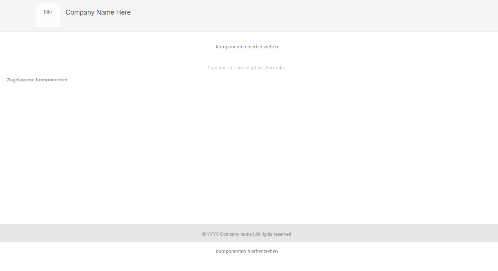

# Erstellen einer adaptiven Formularvorlage {#adaptive-form-templates}

>[!NOTE]
>
> Adobe empfiehlt, die modernen und erweiterbaren [Kernkomponenten](https://experienceleague.adobe.com/docs/experience-manager-core-components/using/adaptive-forms/introduction.html?lang=de) für die Datenerfassung zu verwenden, um [neue adaptive Formulare zu erstellen](/help/forms/creating-adaptive-form-core-components.md) oder [adaptive Formulare zu AEM Sites-Seiten hinzuzufügen](/help/forms/create-or-add-an-adaptive-form-to-aem-sites-page.md). Diese Komponenten stellen einen bedeutenden Fortschritt bei der Erstellung adaptiver Formulare dar und sorgen für beeindruckende Anwendererlebnisse. In diesem Artikel wird der ältere Ansatz zum Erstellen von adaptiven Formularen mithilfe von Foundation-Komponenten beschrieben.

| Version | Artikel-Link |
| -------- | ---------------------------- |
| AEM 6.5 | [Hier klicken](https://experienceleague.adobe.com/docs/experience-manager-65/forms/adaptive-forms-advanced-authoring/template-editor.html?lang=de) |
| AEM as a Cloud Service | Dieser Artikel |

Wenn Sie ein Formular erstellen, fügen Sie Felder und Komponenten hinzu, um Formularstruktur, Inhalt und Aktionen im Editor zu definieren. Sie können Felder und Komponenten im`guideRootPanel` des Formularcontainers hinzufügen. Mit dem Vorlageneditor können Sie eine Vorlage erstellen, die eine grundlegende Struktur und anfänglichen Inhalt enthält, die Autorinnen und Autoren zum Erstellen von Formularen verwenden können.

Beispiel: Sie möchten, dass alle Autoren in einem Registrierungsformular bestimmte Textfelder, Navigationsschaltflächen und eine Schaltfläche zum Senden verwenden. Sie können eine Vorlage mit den Komponenten erstellen, die Autoren verwenden können, damit ihr Formular konsistent mit anderen Registrierungsformularen ist. Wenn Autoren die Vorlage verwenden, um ein adaptives Formular zu erstellen, erbt das neue Formular die Struktur und die Komponenten, die Sie in der Vorlage festgelegt haben. Mit dem Vorlageneditor können Sie:

* Kopf- und Fußzeilenkomponenten eines Formulars in der Strukturebene hinzufügen.
* Den anfänglichen Inhalt für das Formular angeben.
* Design und Übermittlungsaktionen festlegen.

Sie können das [!DNL AEM Forms]-Referenzinhaltspaket vom [Software Distribution Portal](https://experience.adobe.com/#/downloads/content/software-distribution/de/aemcloud.html) herunterladen und installieren, um Referenz-Designs und Vorlagen in Ihre Umgebung zu importieren.

## Arbeiten mit Vorlagen {#working-with-templates}

Über das Menü „Werkzeuge“ können Sie auf den Vorlagen-Editor zugreifen: Navigieren Sie zu **[!UICONTROL Adobe Experience Manager]** > **[!UICONTROL Werkzeuge]** > **[!UICONTROL Allgemein]** > **[!UICONTROL Vorlagen]**. Hier befinden sich die Vorlagen in Ordnern für bearbeitbare Vorlagen.

In Experience Manager steht ein globaler Ordner zum Organisieren von Vorlagen zur Verfügung. Er ist jedoch nicht standardmäßig aktiviert. Sie können Ihren Administrator bitten, den globalen Ordner zu aktivieren, oder einen Ordner für Vorlagen erstellen. Weitere Informationen zum Erstellen von Ordnern finden Sie unter [Vorlagenordner](https://experienceleague.adobe.com/docs/experience-manager-cloud-service/sites/authoring/features/templates.html?lang=de#editing-templates-template-authors).

### Erstellen einer Vorlage {#create-template}

Nachdem Sie einen Ordner erstellt haben, öffnen Sie den Ordner und führen Sie die folgenden Schritte aus, um eine Vorlage zu erstellen:

1. Wählen Sie **[!UICONTROL Erstellen]** innerhalb des Ordners, den Sie erstellt haben.
1. Im Abschnitt „Vorlagentyp auswählen“ wählen Sie **[!UICONTROL Adaptive Formularvorlage]** und wählen Sie dann **[!UICONTROL Weiter]**.

1. Geben Sie im Abschnitt „Vorlagendetails“ einen Namen für die Vorlage an und wählen Sie **[!UICONTROL Erstellen]**.
Sie können auch eine Beschreibung angeben.

1. Wählen Sie **[!UICONTROL Fertig]**, um zur Konsole zurückzukehren, oder **[!UICONTROL Öffnen]**, um die Vorlage im Editor zu öffnen.

### Benutzeroberfläche des Vorlageneditors {#template-editor-ui}

Wenn Sie eine Vorlage zum Bearbeiten öffnen, können Sie die folgenden AEM-Editor-Komponenten sehen:

* **Seitensymbolleiste**: Enthält die folgenden Optionen:

   * **Seitliches Bedienfeld ein/aus**: Hiermit können Sie die Seitenleiste ein- oder ausblenden.
   * **Seiteninformationen**: Ermöglicht Ihnen die Angabe von Informationen wie dem Zeitpunkt der Veröffentlichung oder der Zurücknahme der Veröffentlichung, Miniaturen, Client-seitigen Bibliotheken, einer Seitenrichtlinie und dem Seiten-Design einer Client-seitigen Bibliothek.
     <!-- * **Emulator**: Lets you simulate and customize the look for different devices.-->
   * **Modusauswahl:** Hiermit können Sie den Modus ändern. Sie können aus den Modi **[!UICONTROL Struktur]**, **[!UICONTROL Ursprünglicher Inhalt]** und **[!UICONTROL Layout-Steuerung]** wählen. Im Modus „Struktur“ können Sie die Kopf- und Fußzeile hinzufügen und anpassen. Im Modus „Anfänglicher Inhalt“ können Sie den Formularinhalt anpassen.
   * **Vorschau**: Hier können Sie das Aussehen der Vorlage bei Veröffentlichung in einer Vorschau simulieren. Sie können den Ebenenselektor und die Vorschau verwenden, um zwischen Bearbeitungs- und Vorschau-Modus zu wechseln.
* **Seitenleiste**: Enthält Inhalts-, Eigenschaften-, Elemente- und Komponenten-Browser.
* **Komponenten-Symbolleiste**: Wenn Sie eine Komponente auswählen, sehen Sie eine Symbolleiste, in der Sie die Komponente anpassen können.
* **Seite**: Der Bereich, in dem Sie Inhalt hinzufügen, um die Vorlage zu erstellen.

<!-- See [Introduction to authoring Adaptive Forms](introduction-forms-authoring.md) to understand the Touch UI editor. -->

### Bearbeiten einer Vorlage {#editing-a-template}

Eine adaptive Formularvorlage wird mit zwei Ebenen erstellt:

* Struktur
* Anfänglicher Inhalt

Der Ebenenselektor ist neben der Option „Vorschau“ in der rechten oberen Ecke des Bildschirms verfügbar.

### Struktur {#structure}

Wenn Sie die Strukturebene im Vorlageneditor auswählen, werden die Layout-Container über und unter dem Container für adaptive Formulare angezeigt. Autorinnen und Autoren können diese Layout-Container für Kopf- und Fußzeilen verwenden. Sie können die Kopf- und Fußzeile hinzufügen, bearbeiten oder anpassen. Ziehen Sie die Kopfzeilenkomponente des adaptiven Formulars in den Layout-Container über dem Container des adaptiven Formulars, um die Vorlagenkopfzeile anzupassen. Ziehen Sie die Fußzeilenkomponente des adaptiven Formulars in den Layout-Container unter dem Container des adaptiven Formulars, um die Vorlagenfußzeile anzupassen.

Layout-Container in der Strukturebene

**A.** Layout-Container für die Kopfzeilenkomponente **B.** Layout-Container für die Fußzeilenkomponente

Ziehen Sie die Kopfzeilenkomponente des adaptiven Formulars in den Layout-Container über dem Container des adaptiven Formulars. Nachdem Sie die Komponente hinzugefügt haben, können Sie deren Eigenschaften festlegen, mit denen Sie ein Logo hinzufügen und dessen Titel angeben können.

Wenn Sie die Fußzeilenkomponente in den Layout-Container unter dem Container des adaptiven Formulars ziehen, können Sie ebenso Urheberrechtsinformationen und Unternehmensdetails angeben.

Kopf- und Fußzeile in der Strukturebene hinzugefügt

#### Sperren/Entsperren von Komponenten in der Strukturebene {#locking-unlocking-components-in-the-structure-layer}

Wenn Sie die Vorlage bearbeiten, wenn die Strukturebene ausgewählt ist, können Sie die Kopf- und Fußzeile der Vorlage entsperren. Wenn eine Komponente in der Vorlage entsperrt wurde, können Formularautoren die Komponente in dem adaptiven Formular bearbeiten, das die Vorlage verwendet. Das Sperren einer Komponente verhindert ihre Bearbeitung durch Formularautoren. Die Sperroption ist in der Komponenten-Symbolleiste verfügbar.

Beispielsweise können Sie die Kopfzeilenkomponente zur Vorlage hinzufügen. Wenn Sie die Komponente auswählen, wird in der Komponenten-Symbolleiste eine Sperroption angezeigt. In der Regel enthält die Kopfzeile den Firmennamen und das Logo und Sie möchten nicht, dass Formularautorinnen und -autoren das Logo und die Kopfzeile in einer Vorlage ändern. In einem adaptiven Formular, das mit der Vorlage erstellt wurde, bei der die Kopfzeilenkomponente gesperrt ist, können Formularautoren das Logo und den Firmennamen nicht ändern.

>[!NOTE]
>
>Es wird davon abgeraten, ein Bild oder Logo in der Kopfzeilenkomponente einzeln zu sperren oder zu entsperren. Sie können die Kopfzeilenkomponente entsperren.

### Anfänglicher Inhalt {#initial-content}

Wenn die Option „Anfänglicher Inhalt“ ausgewählt ist, wird der Container des adaptiven Formulars der Vorlage wie ein adaptives Formular zur Bearbeitung geöffnet. Wie beim Authoring eines adaptiven Formulars können Sie anfängliche Einstellungen festlegen, z. B. das Design und Übermittlungsaktionen.

Formularautorinnen und -autoren verwenden sie als Grundlage zum Erstellen eines Formulars. Die Struktur des Inhaltsflusses wird in der Ebene „Anfänglicher Inhalt“ der Vorlage angegeben. Um zum Bearbeiten des anfänglichen Inhalts der Formularvorlage zu wechseln, bevor Sie die Vorschau in der Seitensymbolleiste anzeigen, wählen Sie  **>** **[!UICONTROL Anfänglicher Inhalt]**.

In der Ebene „Anfänglicher Inhalt“ erstellen Sie die Vorlage für ein adaptives Formular, das Ihre Autoren als Grundlage verwenden. Das Erstellen einer Vorlage ähnelt dem Erstellen eines Formulars. Sie verwenden die in der Seitenleiste verfügbaren Optionen. Die Seitenleiste bietet Browser für Inhalte, Eigenschaften, Assets und Komponenten.

<!-- See [Sidebar](introduction-forms-authoring.md#sidebar). -->

>[!NOTE]
>
>Wenn Sie als Übermittlungsaktion „Inhalt speichern“ oder „PDF speichern“ auswählen, wird die Option zum Angeben des Speicherpfads angezeigt. Wenn Sie den Pfad in der Vorlage angeben, haben alle daraus erstellten Formulare denselben Pfad. Sie können den richtigen Speicherpfad angeben oder sicherstellen, dass Formularautorinnen und -autoren ihn aktualisieren, um zu verhindern, dass Daten aus jedem Formular an demselben Speicherort gespeichert werden.

#### Erstellen einer adaptiven Formularvorlage mit Registerkarten und Bedienfeldern {#creating-an-adaptive-form-template-with-tabs-and-panels-nbsp}

Nehmen wir an, Sie möchten eine Vorlage mit den folgenden Registerkarten erstellen:

* Allgemeine Informationen
* Berufliche Informationen

Sie haben ein Logo hinzugefügt, einen Titel angegeben und eine Fußzeile in der Strukturebene hinzugefügt. Sperren Sie die Kopf- und Fußzeile, damit Autoren sie nicht bearbeiten, wenn sie die Vorlage zum Erstellen von Formularen verwenden.

Ändern Sie die Ebene von „Struktur“ in „Anfänglicher Inhalt“ und beginnen Sie mit dem Hinzufügen von Inhalten zum Formular. Um eine Struktur mit Registerkarten zu erstellen, fügen Sie ein untergeordnetes Bedienfeld im guideRootPanel des Containers für adaptive Formulare hinzu. So fügen Sie ein Bedienfeld hinzu:

* Sie können ein Bedienfeld hinzufügen, indem Sie auf die Schaltfläche **[!UICONTROL +]** tippen, wenn Sie die Option **[!UICONTROL Komponenten hierher ziehen]** auswählen.

* Sie können die Bedienfeldkomponente aus dem Komponenten-Browser in der Seitenleiste ziehen.
* Sie können ein untergeordnetes Bedienfeld von `guideRootPanel` aus der Symbolleiste hinzufügen.

Um die Registerkarten „Allgemeine Informationen“ und „Berufliche Informationen“ zu erstellen, fügen Sie zwei Bedienfelder im untergeordneten Bedienfeld von `guideRootPanel` hinzu. Wählen Sie die Bedienfelder und dann  aus, um die Eigenschaften in der Seitenleiste zu öffnen. Ändern Sie die Elementnamen in `general-info` und `professional-info` und die Titel in „Allgemeine Informationen“ bzw. „Berufliche Informationen“. Wählen Sie in der Seitenleiste einen Inhalt, um den Inhalts-Browser zu öffnen. Wählen Sie in der Registerkarte „Formularobjekte“ `guideRootPanel` aus. Im Editor ist „guideRootPanel“ ausgewählt. Wählen Sie in der Komponenten-Symbolleiste das Symbol  aus, um die zugehörigen Eigenschaften zu öffnen. Wählen Sie im Feld „Bedienfeldlayout“ die Option **[!UICONTROL Registerkarten oben]** und dann **[!UICONTROL Fertig]** aus. Die Vorlagenstruktur mit Registerkarten wird angewendet.

#### Hinzufügen von Inhalten in Registerkarten {#adding-content-in-tabs}

Nachdem Sie Bedienfelder hinzugefügt und als Registerkarten strukturiert haben, können Sie Felder in den Registerkarten hinzufügen. Wenn Sie eine Registerkarte im Editor auswählen, wird die Option **[!UICONTROL Komponenten hierhin ziehen]** sichtbar. Sie können Komponenten wie Textboxen, Listenelemente und Schaltflächen per Drag-and-Drop verschieben. Sie können Komponenten aus dem Komponenten-Browser in der Seitenleiste ziehen.

Jede Komponente verfügt über Eigenschaften, die die Datenerfassung und -bearbeitung verbessern. Beispielsweise können Sie die Eigenschaft **[!UICONTROL Erforderliches Feld]** einer Komponente aktivieren. Ihre Autorinnen und Autoren können eine Nachricht angeben, die Ihre Kundinnen und Kunden sehen sollen, wenn sie beim Ausfüllen ein erforderliches Feld überspringen. Geben Sie die Meldung in der Eigenschaft **[!UICONTROL Erforderliches Feld]** an.

In der Beispielvorlage werden die Felder „Name“, „Telefonnummer“ und „Geburtsdatum“ auf der Registerkarte „Allgemeine Informationen“ hinzugefügt. Auf der Registerkarte „Berufliche Informationen“ werden die Felder „Derzeit beschäftigt“, „Beschäftigungstyp“ und „Bildungsabschluss“ hinzugefügt.

Nachdem Sie Felder hinzugefügt haben, können Sie Schaltflächen wie „Senden“ und „Zurücksetzen“ hinzufügen.

### Aktivieren der Vorlage {#enabling-the-template}

Wenn Sie eine Vorlage erstellen, wird sie als Entwurf hinzugefügt. Aktivieren Sie die Vorlage, um sie zum Erstellen von adaptiven Formularen zu verwenden. Aktivieren einer Vorlage:

1. Navigieren Sie zu **[!UICONTROL Adobe Experience Manager]** > **[!UICONTROL Werkzeuge]** > **[!UICONTROL Vorlagen]** und öffnen Sie den Ordner, in dem Sie die Vorlage erstellt haben.

1. Die Vorlage, die Sie erstellt haben, ist als Entwurf gekennzeichnet.
1. Wählen Sie die Vorlage aus und wählen Sie dann **[!UICONTROL Aktivieren]** in der Symbolleiste.
Beim Erstellen eines adaptiven Formulars wird Ihnen die Vorlage angezeigt, wenn Sie aufgefordert werden, eine Vorlage auszuwählen.

## Importieren oder Exportieren einer Vorlage {#importing-or-exporting-a-template}

Ein Formular funktioniert mit seiner Vorlage. Wenn Sie ein adaptives Formular herunterladen, das mit einer benutzerdefinierten Vorlage erstellt wird, wird die Vorlage nicht heruntergeladen. Wenn Sie das Formular in eine andere [!DNL AEM Forms]-Instanz importieren, wird es ohne die Vorlage importiert. Wenn ein Formular importiert wird, aber die Vorlage nicht verfügbar ist, wird das Formular nicht gerendert. Es ist auch möglich, die benutzerdefinierte Vorlage vom `/conf`-Knoten in `https://<server>:<port>/crx/packmgr` zu verpacken und in die [!DNL AEM Forms]-Instanz zu importieren, in die Sie das Formular hochladen möchten. Sie können auch [eine Vorlage mit dem AEM-Archetyp erstellen und sie für Ihre Cloud Services-Instanz bereitstellen](https://experienceleague.adobe.com/docs/experience-manager-learn/getting-started-wknd-tutorial-develop/pages-templates.html?lang=de#prerequisites).

>[!NOTE]
>
> * Sie können die Vorlage [!UICONTROL Datensatzdokument“ auch ] den Builder für adaptive Formulare oder den Vorlagen-Builder für adaptive Formulare konfigurieren. Weitere Informationen finden Sie unter [Generieren von Datensatzdokumenten für adaptive Formulare](/help/forms/generate-document-of-record-for-non-xfa-based-adaptive-forms.md#document-of-record-support-in-adaptive-form-editor-dor-support-in-adaptiveform).

## Verknüpfen eines Formulardatenmodellschema mit einer Vorlage {#associating-form-data-model-schema-in-template}

Autorinnen und Autoren können ein [!UICONTROL Formulardatenmodellschema] in einem Vorlagen-Editor mit einer Vorlage für ein adaptives Formular verknüpfen. Dies ermöglicht es Autorinnen und Autoren, ein Schema aus dem Vorlageneditor auswählen. Wenn Sie ein Schema mit einer Vorlage verknüpfen und Formularautorinnen oder -autoren ein Formular basierend auf der Vorlage erstellen, wird das Schema für das Formular vorausgewählt. Dies hilft Formularautorinnen und -autoren, die Verwendung von Schemata zu regeln und spart ihnen außerdem Zeit. So wählen Sie ein Formulardatenmodellschema im Vorlageneditor aus:

1. Wählen Sie **[!UICONTROL Inhalts-Browser]** auf der linken Seite.
1. Navigieren Sie zum Formular-Container **[!UICONTROL Einstellung]**.
1. Wählen Sie **[!UICONTROL Datenmodell]** aus.
1. Wählen Sie das Formulardatenmodell über **[!UICONTROL Formulardatenmodell auswählen]** und speichern Sie die Konfiguration.

## Erstellen eines adaptiven Formulars mithilfe der Vorlage {#creating-an-adaptive-form-using-the-template}

Nachdem Sie eine Vorlage erstellt und aktiviert haben, steht sie im Formular-Manager zur Verfügung, wenn Sie ein adaptives Formular erstellen. Um eine Vorlage zu verwenden und ein adaptives Formular zu erstellen, finden Sie weitere Informationen unter [Erstellen eines adaptiven Formulars](creating-adaptive-form.md).

<!--
## Change display option of out of the box templates  {#change-display-option-of-out-of-the-box-templates}

You can create custom templates for Adaptive Forms to define basic structure and initial content. [!DNL AEM Forms] also provides a set of out of the box template for Adaptive Forms. You can choose to show or hide the templates.

Perform the following steps to show and hide templates:

1. Log in to [!DNL AEM Forms] author instance and navigate to **[!UICONTROL Tools]** &gt; **[!UICONTROL Operations]** &gt; **[!UICONTROL Web Console]**.

   >[!NOTE]
   >
   >The URL of AEM web console is https://'[server]:[port]'/system/console/configMgr

1. Locate and open the **FormsManager Configuration** settings:

    * To show or hide out of the box Adaptive Forms template, check or uncheck the **Include Out of the box AF and AD Templates** option.
    * To show or hide out of the box Adaptive Form templates that were added in AEM 6.0 Forms or AEM 6.1 Forms releases but are now deprecated, check or uncheck the **Include AEM 6.0 AF Templates** option. If this option is checked, and you want it to take effect, it requires the **Include Out of the box AF and AD Templates** configuration to be enabled.

1. Click **Save**. The display options for the out of the box templates are changed. -->

## Speichern eines adaptiven Formulars als Vorlage {#saving-adaptive-form-as-template}

Sie können ein adaptives Formular auch als Vorlage für zukünftige Verwendungen speichern. So speichern Sie ein adaptives Formular als Vorlage:

1. Wählen Sie ein adaptives Formular aus, um es als Vorlage zu speichern.
1. Klicken Sie auf **[!UICONTROL Als Vorlage speichern]**. Ein Dialogfeld wird angezeigt.
1. Geben Sie **[!UICONTROL Titel]** (Pflichtfeld), **[!UICONTROL Speicherort]** (Pflichtfeld) und **[!UICONTROL Beschreibung]** (optionales Feld) für die Vorlage an.
1. Klicken Sie auf **[!UICONTROL Erstellen]**.

   

>[!NOTE]
>
>Um dieselbe Container-Richtlinie wie für das adaptive Quellformular zu verwenden, wird empfohlen, die Vorlage im selben Ordner wie das adaptive Quellformular zu speichern. Falls die Vorlage in einem anderen Ordner gespeichert wird, verwendet die erstellte Vorlage eine standardmäßige Container-Richtlinie.

## Empfehlungen {#recommendations}

* Wenn Sie Eigenschaften des Formulars im Vorlageneditor ändern, verwenden Sie nicht die Eigenschaft „BindReference“.
* Wenn Sie einen Haltepunkt hinzufügen möchten, erstellen Sie ihn dann, wenn Sie die Vorlage für das adaptive Formular bearbeiten.
Weitere Informationen zu Haltepunkten finden Sie unter [Responsive Layout](https://experienceleague.adobe.com/docs/experience-manager-cloud-service/sites/authoring/features/responsive-layout.html?lang=de#authoring).

## Siehe auch {#see-also}

{{see-also}}
