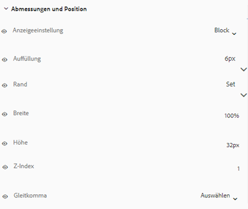

# Erstellen und Verwenden von Designs {#creating-and-using-themes}

Sie können Designs erstellen und anwenden, um ein adaptives Formular<!-- or an interactive communication--> zu formatieren. Zu einem Design gehören Stildetails für die Komponenten und Bereiche. Die Stile umfassen Eigenschaften wie Hintergrundfarben, Statusfarben, Transparenz, Ausrichtung und Größe. Wenn Sie ein Design anwenden, spiegeln die entsprechenden Komponenten den angegebenen Stil wider. Das Design wird unabhängig, ohne Verweis auf ein adaptives Formular<!-- or interactive communication -->, verwaltet.

Sie können das [!DNL AEM Forms]-Referenzinhaltspaket vom [Software Distribution Portal](https://experience.adobe.com/#/downloads/content/software-distribution/en/aemcloud.html) herunterladen und installieren, um Referenz-Designs und Vorlagen in Ihre Umgebung zu importieren.

## Erstellen, Herunterladen und Hochladen eines Designs {#creating-downloading-or-uploading-a-theme}

Ein Design wird als separate Entität erstellt und gespeichert, einschließlich Metaeigenschaften wie adaptiver Formulare. Dadurch kann ein Design in mehreren adaptiven Formularen<!-- or  and interactive communications--> wiederverwendet werden. Sie können ein Design auch in eine andere Instanz verschieben und wiederverwenden.

### Erstellen von Designs {#creating-a-theme}

So erstellen Sie ein Design:

1. Klicken Sie in **[!UICONTROL Adobe Experience Manager]** auf **[!UICONTROL Formulare]** und anschließend auf **[!UICONTROL Designs]**.

1. Klicken Sie auf der Seite „Designs“ auf **[!UICONTROL Erstellen]** > **[!UICONTROL Design]**.
Ein Assistent zum Erstellen eines Designs wird gestartet.

1. Geben Sie in **[!UICONTROL Name]** den Namen des Designs an.

1. Geben Sie im Feld **[!UICONTROL Standardvorschau für dieses Design]** ein Formular für die Vorschau des Designs an. Klicken Sie auf **[!UICONTROL Standard verwenden]**, um das Standardformular für die Vorschau des Designs zu verwenden.

1. Geben Sie einen **[!UICONTROL Konfigurations-Container]** an. Sie können einen **[!UICONTROL Konfigurations-Container]** wählen, der Konfigurationsdetails von Adobe Font für Ihr Konto enthält. Sie können die Option auch vorerst leer lassen und die Details später unter [Themeneigenschaften](#metadata-of-a-theme) angeben.

1. Klicken Sie auf **[!UICONTROL Erstellen]** und anschließend auf **[!UICONTROL Bearbeiten]**, um das Design im Design-Editor zu öffnen, oder klicken Sie auf **[!UICONTROL Fertig]**, um zur Seite mit den Designs zurückzukehren.

### Unterschied zu Designs in Experience Manager 6.5 Forms und früheren Versionen {#difference-in-themes}

In einer Cloud Service-Instanz erstellte Designs:

* Verfügen über die Versionsnummer 2.

* Werden gespeichert unter `/content/dam/formsanddocuments-themes/<theme-name>/`.

* Stellen die Option zur Angabe der Client-Bibliothek nicht bereit. Sie können keine Kategorie und keinen Pfad für die Client-Bibliothek angeben.

* Verfügen über keine Schreib- und Aktualisierungsberechtigungen am Speicherort /apps (Forms-Benutzergruppe verfügt nicht über die Berechtigung zum Schreiben und Aktualisieren am Speicherort /apps).

* Stellen Sie vor dem Hochladen eines mit [!DNL Experience Manager Forms] 6.5 oder einer früheren Version erstellten Designs auf eine Cloud Service-Instanz sicher, dass der Speicherort der Client-Bibliothek auf `etc/clientlibs/fd/themes` festgelegt ist. Wenn sich die Client-Bibliothek nicht im Ordner `etc` befindet, ändern Sie den Speicherort manuell zu `etc/clientlibs/fd/themes`.  Sie können die Änderung an Ihrer Instanz von [!DNL Experience Manager Forms] 6.5 oder einer früheren Version vornehmen. Nachdem der Speicherort der Client-Bibliothek festgelegt wurde, kann ein Administrator Designs in die Cloud Service-Instanz hochladen oder mit dem Content Transfer Tool die Designs von Instanzen der Version 6.5 oder einer Vorgängerversion zur Cloud Service-Instanz migrieren.

   Ändern Sie außerdem den Namen der Kategorie. Wenn der Name nicht geändert wird, kann ein Fehler `theme with same category name exists` auftreten. Die Änderung des Kategorienamens hat keine Auswirkungen auf die adaptiven Formulare, in denen das Design verwendet wird.

### Download eines Designs {#downloading-a-theme}

Sie können Designs als Zip-Datei exportieren und sie in anderen Projekten oder Experience Manager-Instanzen verwenden. Herunterladen von Designs

1. Klicken Sie in **[!UICONTROL Adobe Experience Manager]** auf **[!UICONTROL Formulare]** und dann auf **[!UICONTROL Designs]**.

1. **[!UICONTROL Wählen]** Sie auf der Designseite ein Design aus und klicken Sie auf **[!UICONTROL Herunterladen]**. Ein Dialogfeld mit den Details des Designs wird angezeigt.

1. Klicken Sie auf **[!UICONTROL Herunterladen]**. Das Design wird als eine zip.-Datei heruntergeladen.

>[!NOTE]
>
>Wenn Sie ein Design herunterladen, dem ein adaptives Formular zugeordnet ist, und das zugehörige adaptive Formular auf einer benutzerdefinierten Vorlage basiert, dann laden Sie auch diese Vorlage herunter. Wenn Sie das heruntergeladene Design und adaptive Formular hochladen, dann laden Sie auch die zugehörige benutzerdefinierte Vorlage hoch.

### Hochladen eines Designs {#uploading-a-theme}

Ein Benutzer mit Administratorrechten kann ein Design hochladen, das in [!DNL Experience Manager Forms] 6.5 oder früher erstellt wurde.

Hochladen von Designs

1. Klicken Sie in **[!UICONTROL Adobe Experience Manager]** auf **[!UICONTROL Formulare]** und dann auf **[!UICONTROL Designs]**.

1. Auf der Seite „Designs“ klicken Sie auf **[!UICONTROL Erstellen]** > **[!UICONTROL Datei-Upload]**.
1. In der Eingabeaufforderung zu „Datei-Upload“ suchen Sie ein Design-Paket auf Ihrem Computer, wählen es aus und klicken auf **[!UICONTROL Hochladen]**.
Das hochgeladene Design ist auf der Seite „Designs“ verfügbar.

## Metadaten eines Designs {#metadata-of-a-theme}

Liste der Metaeigenschaften eines Designs (auf der Eigenschaftenseite eines Designs).

<table>
 <tbody>
  <tr>
   <th>
<strong>ID</strong>
 
 
 </th>
   <th><strong>Name</strong></th>
   <th><strong>Kann bearbeitet werden</strong></th>
   <th><strong>Beschreibung der Eigenschaft</strong></th>
  </tr>
  <tr>
   <td>1.</td>
   <td>Titel</td>
   <td>Ja</td>
   <td>Anzeigename des Designs.</td>
  </tr>
  <tr>
   <td>2.</td>
   <td>Beschreibung</td>
   <td>Ja</td>
   <td>Beschreibung des Designs.</td>
  </tr>
  <tr>
   <td>3.</td>
   <td>Typ</td>
   <td>Nein</td>
   <td>
    <ul>
     <li>Asset-Typ.</li>
     <li>Wert ist immer „Design“.</li>
    </ul> </td>
  </tr>
  <tr>
   <td>4.</td>
   <td>Erstellt</td>
   <td>Nein</td>
   <td>Datum der Designerstellung</td>
  </tr>
  <tr>
   <td>5.</td>
   <td>Verfassername</td>
   <td>Ja</td>
   <td>Verfasser des Designs. Berechnet zum Zeitpunkt der Designerstellung.</td>
  </tr>
  <tr>
   <td>6.</td>
   <td>Datum der letzten Änderung</td>
   <td>Nein</td>
   <td>Datum, an dem das Design zuletzt geändert wurde.</td>
  </tr>
  <tr>
   <td>7.</td>
   <td>Status</td>
   <td>Nein</td>
   <td>Status des Designs (Geändert/Veröffentlicht).</td>
  </tr>
  <tr>
   <td>8.</td>
   <td>Einschaltzeit für Veröffentlichung</td>
   <td>Ja</td>
   <td>Zeitpunkt der automatischen Veröffentlichung des Designs.</td>
  </tr>
  <tr>
   <td>9.</td>
   <td>Ausschaltzeit für Veröffentlichung</td>
   <td>Ja</td>
   <td>Zeitpunkt, zu dem die Veröffentlichung des Designs automatisch rückgängig gemacht wird.</td>
  </tr>
  <tr>
   <td>10.</td>
   <td>Tags</td>
   <td>Ja</td>
   <td>Eine Beschriftung am Design zur Kennzeichnung, um die Suche zu erleichtern.</td>
  </tr>
  <!-- <tr>
   <td>11.</td>
   <td>References</td>
   <td>Links</td>
   <td>
    <ul>
     <li>Contains 'Referred by' section. Lists forms that use the theme.</li>
     <li>Since the theme does not refer to any other asset, there is no 'Refers' section.</li>
    </ul> </td>
  </tr>
   <tr>
   <td>12.</td>
   <td>Clientlib Location</td>
   <td>Yes</td>
   <td>
    <ul>
     <li>The user-defined repository path within '/etc' where the clientlibs corresponding to this theme are stored.</li>
     <li>Default value - '/etc/clientlibs/fd/themes' + relative path of theme asset.</li>
     <li>If the location does not exist, the folder hierarchy is auto-generated.</li>
     <li>When this value is changed, the clientlib node structure is moved to the new location entered.  <em><strong>Note:</strong> If you change default clientlib location, in the CRXDE repository assign <code>crx:replicate, rep:write, rep:glob:*, rep:itemNames:: js.txt, jcr:read </code>to <code>forms-users</code> and <code>crx:replicate</code>, <code>jcr:read </code>to <code>fd-service</code> in the new location. Also attach another ACL by adding <code>deny jcr:addChildNodes</code> for <code>forms-user</code></em></li>
    </ul> </td>
  </tr> 
  <tr>
   <td>13.</td>
   <td>Clientlib Category Name</td>
   <td>Yes</td>
   <td>
    <ul>
     <li>The user-defined clientlib category name for this theme.</li>
     <li>An error is displayed if the name is already in use by some other existing theme.</li>
     <li>Default value - computed using theme location.</li>
     <li>When this value is changed, the category name is updated on the corresponding clientlib node. Updating Clientlib Category Name in the jsp files is not required because clientlib category name is used by reference.</li>
    </ul> </td>
  </tr> -->
 </tbody>
</table>

## Informationen zum Design-Editor {#about-the-theme-editor}

Beim Design-Editor handelt es sich um eine benutzerfreundliche Oberfläche für Geschäftskunden und Web-Designer/Entwickler mit Funktionen zur einfachen Festlegung der Formatierung verschiedener Elemente adaptiver Formulare <!-- and interactive communication -->. Wenn Sie ein Design erstellen, wird es wie Formulare <!--  , interactive communications, letters, document fragments, and data dictionaries--> als separate Entität gespeichert.

Mit dem Design-Editor können Sie Stile der in einem Design formatierten Komponenten anpassen. Sie können festlegen, wie ein Formular <!-- or interactive communication --> auf einem Gerät angezeigt wird.

Der Design-Editor ist in zwei Bereiche unterteilt:

* **Arbeitsfläche** – Wird auf der rechten Seite angezeigt. Hier wird ein Muster für ein adaptives Formular <!--  or interactive communication --> angezeigt, in dem alle Formatierungsänderungen sofort dargestellt werden. Sie können Objekte auch direkt auf der Arbeitsfläche auswählen, um die damit verknüpften Stile anzuzeigen und diese Stile zu bearbeiten. Das oben angezeigte Lineal für die Geräteauflösung bestimmt das Erscheinungsbild der Arbeitsfläche. Durch Auswahl eines Auflösungshaltepunktes auf dem Lineal wird die Vorschau des Musterformulars <!--  or interactive communication --> für die jeweilige Auflösung angezeigt. Die Arbeitsfläche wird [nachfolgend](themes.md#using-canvas) detailliert beschrieben.

* **Seitenleiste** – Wird auf der linken Seite angezeigt. Sie umfasst die folgenden Elemente:

   * **Selektor:** Zeigt die für die Formatierung ausgewählte Komponente und die Eigenschaften, die Sie gestalten können, an. Der Selektor stellt alle Komponenten eines bestimmten Typs dar. Wenn Sie eine Textfeld-Komponente in einem Design für die Formatierung auswählen, erben alle Textfelder im Formular <!-- or interactive communication --> diesen Stil. Mit Selektoren können Sie eine allgemeine Komponente oder eine spezielle Komponente für die Formatierung auswählen. Beispielsweise ist eine Feldkomponente eine allgemeine Komponente, und ein Textfeld ist eine spezielle Komponente.

      **Formatierung allgemeiner Komponenten:**
Ein Feld kann ein numerisches Feld wie Alter oder ein Textfeld wie Adresse sein.
Wenn Sie einen Stil für ein Feld definieren, werden alle Felder wie Alter, Name, Adresse entsprechend formatiert.

      **Formatierung einer spezifischen Komponente**: Eine spezifische Komponente wirkt sich auf die Objekte der betreffenden Kategorie aus. Wenn Sie im Design für die Komponente „Numerisches Feld“ einen Stil definieren, wird der Stil nur auf das numerische Feldobjekt angewendet.

      Beispiel: Ein Textfeld wie Adresse ist länger, und ein numerisches Feld wie Alter ist kürzer. Sie können ein numerisches Feld auswählen, seine Länge verkürzen und es auf Ihr Formular anwenden. Die Breite aller numerischen Felder wird in Ihrem Formular verringert.

      Wenn Sie alle Feldkomponenten mit einer bestimmten Hintergrundfarbe anpassen, übernehmen alle Felder in Ihrem Formular, wie Alter, Name und Adresse, die Hintergrundfarbe. Wenn Sie ein numerisches Feld wie Alter auswählen und seine Breite verringern, wird die Breite aller numerischer Felder, wie Alter, Anzahl der Personen in einer Familie, verringert. Die Breite von Textfeldern wird nicht geändert.

   * **Status:** Hier können Sie die Stile eines Objekts mit einem bestimmten Status anpassen. Beispielsweise können Sie das Aussehen eines Objekts mit dem Status „Standard“, „Fokus“, „Deaktiviert“, „Mausberührung“ oder „Fehler“ festlegen.
   * **Eigenschaftenkategorien:** Formatierungseigenschaften sind in verschiedene Kategorien unterteilt. Beispiel: Abmessung und Position, Text, Hintergrund, Rahmen und Effekte. Unter jeder Kategorie geben Sie Informationen zur Formatierung an. Unter „Hintergrund“ können Sie z. B. „Hintergrundfarbe“ sowie „Bild und Verlauf“ angeben.

   * **Erweitert:** Hier können Sie einem Objekt benutzerdefiniertes CSS hinzufügen, womit im Falle einer Überschneidung die durch visuelle Steuerelemente definierten Eigenschaften überschrieben werden.

   * **CSS anzeigen**: Ermöglicht das Anzeigen von CSS für die ausgewählte Komponente.
   Zusätzlich befindet sich unten in der Seitenleiste ein Pfeil. Wenn Sie auf den Pfeil klicken, erhalten Sie zwei zusätzliche Optionen: **Erfolg simulieren** und **Fehler simulieren.** Diese Optionen werden zusammen mit den oben beschriebenen Optionen [nachfolgend](themes.md#using-rail) detailliert erläutert.

 **A.** Seitenleiste **B.** Arbeitsfläche

### Formatieren von Komponenten {#styling-components}

Ein Design kann in mehreren adaptiven Formularen<!-- and interactive communications --> verwendet werden. Damit wird die Komponentenformatierung, die Sie im Design angegeben haben, importiert. Sie können mehrere Komponenten formatieren, z. B. Titel, Beschreibungen, Bereiche, Felder, Symbole und Textfelder. Verwenden Sie Widgets zur Konfiguration von Komponenteneigenschaften in einem Design. Vorkenntnisse im Umgang mit CSS oder LESS sind nicht erforderlich, aber wünschenswert, obwohl Sie im Abschnitt „CSS-Überschreibung“ CSS-Code schreiben oder benutzerdefinierte Selektoren bereitstellen können. Der Abschnitt „CSS-Überschreibung“ wird angezeigt, wenn Sie eine Komponente in der Seitenleiste auswählen.

Optionen in der Seitenleiste, über die Sie verschiedene Komponenten auswählen und gestalten können.

Wenn Sie auf die Schaltfläche „Bearbeiten“ für eine Komponente in der Seitenleiste klicken, wird die Komponente auf der Arbeitsfläche ausgewählt, und Sie können die Komponente mithilfe der Optionen in der Seitenleiste formatieren.

Bestimmte Komponenten, wie Textfelder, numerische Felder, Optionsfelder und Kontrollkästchen, werden unter allgemeinen Komponenten, wie „Feld“, kategorisiert. Angenommen, Sie möchten die Formatierung von Optionsfeldern anpassen. Um Optionsfelder für die Formatierung auszuwählen, wählen Sie **[!UICONTROL Feld]** > **[!UICONTROL Widget]** > **[!UICONTROL Optionsfeld]**.

### Formatieren von Bedienfeld-Layouts {#styling-panel-layouts-br}

Designs in [!DNL AEM Forms] können zur Formatierung von Elementen im Layout von Bereichen in Formularen<!-- and  interactive communications --> verwendet werden. Es wird die Formatierung von Elementen in gebrauchsfertigen und in benutzerdefinierten Layouts unterstützt.

Zu den gebrauchsfertigen Bereichen gehören:

* Registerkarten links
* Registerkarten oben
* Akkordeon
* Responsiv
* Assistent
* Layout für Mobilgeräte

   * Bedienfeldnamen in der Kopfzeile
   * Ohne Bedienfeldnamen in der Kopfzeile

Die Selektoren variieren je nach Layout.
Die Formatierung benutzerdefinierter Layouts im Design-Editor umfasst Folgendes:

* Definieren der Komponenten für ein Layout, das formatiert werden kann, und der CSS-Selektoren für die eindeutige Identifizierung dieser Komponenten.
* Definieren der CSS-Eigenschaften, die auf diese Komponenten angewendet werden können.
* Definieren der Formatierung für diese Komponenten interaktiv über die Benutzeroberfläche.

### Unterschiedliche Stile für unterschiedliche Bildschirmgrößen {#different-styles-for-different-screen-sizes-br}

Layouts für Desktop und Mobilgeräte können leicht abweichende oder vollständig unterschiedliche Stile aufweisen. Bei Mobilgeräten haben Tablets und Mobiltelefone ähnliche Layouts, mit Ausnahme der Komponentengrößen.

Verwenden Sie Design-Editor-Haltepunkte, um eine unterschiedliche Formatierung für unterschiedliche Bildschirmgrößen zu definieren. Sie können ein Basisgerät oder eine Auflösung wählen, mit dem oder der Sie mit dem Erstellen des Designs beginnen, und die Stilvariationen für andere Auflösungen werden automatisch generiert. Sie können die Formatierung für alle Auflösungen explizit ändern.

>[!NOTE]
>
>Das Design wird zuerst mithilfe eines Formulars<!-- or interactive communication--> erstellt und dann auf verschiedene Formulare<!-- or interactive communications--> angewendet. Die bei der Erstellung des Designs verwendeten Haltepunkte können sich von dem Formular<!-- or interactive communication --> unterscheiden, auf das das Design angewendet wird. Die CSS-Medienabfragen basieren auf dem Formular<!-- or interactive communication -->, das bei der Designerstellung verwendet wird, und nicht auf dem Formular<!-- or interactive communication -->, auf das das Design angewendet wird.

### Kontextänderungen der Formatierungseigenschaften in der Seitenleiste bei der Auswahl der Objekte {#styling-properties-context-changes-in-sidebar-on-selecting-objects}

Wenn Sie eine Komponente auf der Arbeitsfläche auswählen, werden deren Formatierungseigenschaften in der Seitenleiste angezeigt. Wählen Sie den Objekttyp und ihren Status aus und geben Sie dann dessen Stil vor.

### Kürzlich verwendete Stile im Design-Editor {#recently-used-styles-in-theme-editor}

Im Design-Editor werden bis zu zehn Stile zwischengespeichert, die auf eine Komponente angewendet wurden. Die im Cache gespeicherten Stile können für andere Komponenten eines Designs verwendet werden. Kürzlich verwendete Stile stehen direkt unter der ausgewählten Komponente in der Seitenleiste in Form eines Listenfelds zur Auswahl. Zunächst ist die Liste der zuletzt verwendeten Stile leer.

Während Sie eine Komponente mit Stilen versehen, werden die Stile zwischengespeichert und in der Listbox aufgelistet. In diesem Beispiel wird die Beschriftung des Textfelds so gestaltet, dass die Schriftgröße und -farbe geändert wird. Sie können ähnliche Schritte für die Auswahl eines Bildes oder das Ändern von Farben befolgen, um eine Komponente zu gestalten. Beobachten Sie, wie der Stil zwischengespeichert und in der Listbox aufgelistet wird, wenn Sie die Stile der Feldbeschriftung ändern.

In diesem Beispiel wird der Stil für die Feldbeschriftung geändert, und wenn Responsive-Bedienfeldbeschreibung für den Stil ausgewählt ist, wird ein Listeneintrag in der Asset-Bibliothek hinzugefügt. Der Eintrag in der Asset-Bibliothek kann verwendet werden, um den Stil für die Responsive-Bedienfeldbeschreibung zu ändern.

Wenn ein Stil der Asset-Bibliothek hinzugefügt wird, steht er für andere Designs und im [Stilmodus](inline-style-adaptive-forms.md) in der Benutzeroberfläche des Formular-Editors zur Verfügung. Wenn Sie den Stilmodus des Formular-Editors <!-- or interactive communication editor --> verwenden, um eine Komponente zu formatieren, wird der Stil ebenfalls zwischengespeichert und ist in den Designs verfügbar.

Mit der Plus-Schaltfläche in der Asset-Bibliothek können Sie den Stil dauerhaft mit einem Namen speichern. Das Pluszeichen speichert den Stil, selbst wenn Sie sich nicht auf die Schaltfläche „Speichern“ in der Seitenleiste klicken, um den Stil auf eine Komponente anzuwenden. Die Plusschaltfläche zum Speichern eines Stils für die spätere Verwendung ist im Stilmodus nicht verfügbar.

Wenn Sie einen benutzerdefinierten Namen für einen Stil angeben, ist der Stil an ein Design gebunden und steht nicht mehr für andere Designs zur Verfügung. Löschen eines gespeicherten Stils:

1. Klicken Sie in der Symbolleiste der Arbeitsfläche auf **[!UICONTROL Themenoptionen]**  > **[!UICONTROL Stile verwalten]**.
1. Wählen Sie im Dialogfeld „Stile verwalten“ einen gespeicherten Stil aus und klicken Sie auf **[!UICONTROL Löschen]**.

   

### Live-Vorschau, Speichern und Verwerfen von Änderungen {#live-preview-save-and-discard-changes}

Änderungen, die an der Formatierung vorgenommen werden, sind sofort in dem Formular <!-- or interactive communication --> auf der Arbeitsfläche sichtbar. Mit der Live-Vorschau können Sie die Auswirkungen der Formatierung interaktiv definieren und anzeigen. Wenn Sie die Formatierung einer Komponente ändern, wird die Schaltfläche **[!UICONTROL Fertig]** in der Seitenleiste aktiviert. Um die Änderungen beizubehalten, verwenden Sie die Schaltfläche **[!UICONTROL Fertig]**.

>[!NOTE]
>
>Wenn ein ungültiges Zeichen in ein Feld eingegeben wird, wird die Farbe der Feldbegrenzung rot und eine Fehlermeldung wird in der oberen linken Ecke des Bildschirms angezeigt. Wenn Sie z. B. Alphabetzeichen in ein Textfeld eingeben, das numerische Zeichen als Eingabe akzeptiert, wird die Rahmenbegrenzung des Eingabefelds rot. Sie können ein solches Design nicht speichern, ohne den Fehler zu beheben, der in der Mitte am unteren Bildschirmrand angezeigt wird.

### Design mit einem anderen adaptiven Formular {#theme-with-another-adaptive-form}

Wenn Sie ein Design erstellen, wird es mit einem Formular erstellt, das im Lieferumfang des Design-Editors enthalten ist. Sie geben die Formatierung für die Komponenten in diesem Formular vor. Anstelle des Formulars, das mit dem Design-Editor ausgeliefert wird, können Sie ein Formular <!-- or interactive communication --> Ihrer Wahl auswählen, um die Formatierung vorzugeben und die Ergebnisse in der Vorschau zu betrachten.

So ersetzen Sie das aktuelle Formular oder die <!-- interactive communication --> auf der Arbeitsfläche des Design-Editors:

1. Klicken Sie im Bereich „Design-Editor“ auf **[!UICONTROL Themenoptionen]**  > **[!UICONTROL Konfigurieren]**.

1. Wählen Sie auf der Registerkarte „Allgemein“ ein Formular <!-- or interactive communication --> für das Feld **[!UICONTROL Adaptives Formular]** aus.

### Wiederholen/Rückgängigmachen {#redo-undo}

Sie können unerwünschte versehentliche Änderungen rückgängig machen oder wiederherstellen. Verwenden Sie die Schaltflächen „Wiederholen“/„Rückgängig“ auf der Arbeitsfläche.

Die Schaltflächen „Wiederholen“/„Rückgängig“ werden angezeigt, wenn Sie eine Komponente im Design-Editor formatieren.

## Verwenden des Design-Editors {#using-the-theme-editor}

Mit dem Design-Editor können Sie ein Design bearbeiten, das Sie erstellt oder hochgeladen haben. Navigieren Sie zu **[!UICONTROL Formulare und Dokumente]** > **[!UICONTROL Designs]**, wählen Sie ein Design aus und öffnen Sie es. Das Design wird im Design-Editor geöffnet.

Wie bereits erwähnt, besteht der Design-Editor aus zwei Bereichen: Seitenleiste und Arbeitsfläche.

Anpassen der Formatierung für den Erfolgsstatus der Komponente Widget „Textfeld“ im Design-Editor. Die Komponente wird auf der Arbeitsfläche ausgewählt und der Status in der Seitenleiste. Die in der Seitenleiste verfügbaren Formatierungsoptionen werden verwendet, um das Aussehen einer Komponente anzupassen.

### Verwenden der Arbeitsfläche {#using-canvas}

Das Design wird entweder mit dem gebrauchsfertigen Formular oder mit einem Formular <!-- or interactive communication --> Ihrer Wahl erstellt. Die Arbeitsfläche zeigt die Vorschau des Formulars oder der <!-- interactive communication -->, die zum Erstellen des Designs verwendet werden, mit den im Design festgelegten Anpassungen an. Das Lineal über dem Formular wird für das Festlegen des Layouts entsprechend der Displaygröße Ihres Geräts verwendet.

In der Arbeitsflächen-Symbolleiste sehen Sie Folgendes:

* **[!UICONTROL Seitliches Bedienfeld ein/aus]** : Hiermit können Sie die Seitenleiste ein- oder ausblenden.
* **[!UICONTROL Themenoptionen]** : Bietet drei Optionen.

   * Konfigurieren: Stellt Optionen zur Auswahl des Vorschau-Formulars <!-- or interactive communication , base clientlib, -->und der Adobe Fonts-Konfiguration zur Verfügung.
   * Design-CSS anzeigen: Erzeugt CSS für das ausgewählte Design.
   * Stile verwalten: Bietet Optionen zum Verwalten von Text- und Bildstilen.
   * Hilfe: Zeigt eine Einführung in den Design-Editor mit Abbildungen an.

* **[!UICONTROL Emulator]** : Emuliert das Erscheinungsbild des Designs für verschiedene Displaygrößen. Eine Displaygröße wird im Emulator als Haltepunkt behandelt. Sie können einen Haltepunkt auswählen und einen Stil für ihn angeben. Zwei solche Haltepunkte sind beispielsweise Desktop und Tablet. Sie können unterschiedliche Formate für jeden Haltepunkt angeben.

Wenn Sie eine Komponente auf der Arbeitsfläche auswählen, wird die Komponenten-Symbolleiste darüber angezeigt. Mit der Komponenten-Symbolleiste können Sie Komponenten auswählen oder zu allgemeinen Komponenten auf Containerebene wechseln. Beispiel: Sie wählen ein numerisches Feld in einem Bereich aus. Ihnen werden die folgenden Optionen in der Komponenten-Symbolleiste angezeigt:

* **[!UICONTROL Widget „Numerisches Feld“]**: Hiermit können Sie die Komponente auswählen, um die Darstellung in der Seitenleiste anzupassen.
* **[!UICONTROL Widget „Feld“]**: Hiermit können Sie die allgemeine Komponente für die Formatierung auswählen. In diesem Beispiel werden alle Texteingabekomponenten (Textfeld/numerisches Feld/numerische Schritte/Datumseingabe) für die Formatierung ausgewählt.

* : Hiermit können Sie die übergeordnete Komponente für die Formatierung auswählen. Wenn Sie „Numerisches Feld“ auswählen und auf dieses Symbol tippen, wird die Feldkomponente ausgewählt. Wenn Sie „Feldkomponente“ auswählen und auf dieses Symbol tippen, wird der Bereich ausgewählt. Wenn Sie mehrfach zur Auswahl auf dieses Symbol tippen, wählen Sie das Formularlayout für die Formatierung aus.

>[!NOTE]
>
>Die in der Komponenten-Symbolleiste verfügbaren Optionen variieren je nach ausgewählter Komponente.

### Verwenden der Seitenleiste {#using-rail}

Die Seitenleiste im Design-Editor bietet Optionen zur Anpassung von Formatierungen für Komponenten in einem Design und zur Verwendung von Selektoren. Mit Selektoren können Sie eine Gruppe von Komponenten oder einzelne Komponenten auswählen, und Sie können nach Selektoren in der Seitenleiste suchen. Sie können Selektoren für benutzerdefinierte Komponenten schreiben.

Wenn Sie eine Komponente auf der Arbeitsfläche oder Selektoren in der Seitenleiste auswählen, werden in der Seitenleiste alle Optionen angezeigt, mit denen Sie die zugehörigen Stile anpassen können.
Im Folgenden sehen Sie die Optionen, die in der Seitenleiste angezeigt werden, wenn Sie eine Komponente auswählen:

* Status
* Eigenschaftenblatt
* Fehler/Erfolg simulieren

#### Status {#state}

Ein Status ist ein Indikator für die Benutzerinteraktion mit einer Komponente. Wenn ein Benutzer beispielsweise falsche Daten in ein Textfeld eingibt, ändert sich der Status des Textfelds zu einem Fehlerzustand. Mit dem Design-Editor können Sie die spezifische Formatierung für einen bestimmten Status angeben.

Die Optionen für die Anpassung der Statusstile variieren je nach Komponente.

#### Eigenschaftenblatt {#property-sheet}

<table>
 <tbody>
  <tr>
   <td><strong>Eigenschaft</strong></td>
   <td><strong>Verwendung</strong></td>
  </tr>
  <tr>
   <td>
Abmessungen und Position
 </td>
   <td>
Hier können Sie die Formatierung für Ausrichtung, Größe, Positionierung und Platzierung von Komponenten im Design festlegen. 
 
Verfügbar sind Optionen für Anzeigeeinstellung, Auffüllung, Rand, Breite, Höhe und Z-Indexposition.
 
Im Layout-Modus können Sie die Breite von Komponenten auch über eine einfache Drag-and-Drop-Schnittstelle definieren. Weitere Informationen finden Sie unter <a href="resize-using-layout-mode.md">Verwenden des Layout-Modus zum Ändern der Größe von Komponenten</a>.
 </td>
  </tr>
  <tr>
   <td>
Text
 </td>
   <td>
Sie können die Textstile in der Komponente des Designs anpassen.
 
Sie möchten beispielsweise die Darstellung des in Textfeldern eingegebenen Texts ändern.
 
Ihre Optionen sind Schriftfamilie, Stärke, Farbe, Größe, Zeilenhöhe, Textausrichtung, Zeichenabstand, Texteinzug, Unterstreichungen, Kursivdarstellung, Groß-/Kleinschreibung, vertikale Ausrichtung, Grundlinie und Richtung. 
 </td>
  </tr>
  <tr>
   <td>
Hintergrund 
 </td>
   <td>
Hiermit können Sie den Hintergrund der Komponente mit einem Bild oder einer Farbe füllen. 
 </td>
  </tr>
  <tr>
   <td>
Rahmen
 </td>
   <td>
Hiermit können Sie festlegen, wie der Rahmen der Komponente angezeigt wird. Sie können beispielsweise festlegen, dass das Textfeld einen dunkelroten, starken Rand mit einer gepunkteten Linie hat. 
 
Ihre Optionen sind Breite, Stil, Radius und Farbe des Rahmens.
 </td>
  </tr>
  <tr>
   <td>
Effekte
 </td>
   <td>
Hiermit können Sie Spezialeffekte zu den Komponenten hinzufügen, z. B. Deckkraft, Übergangsmodus und Schatten. 
 </td>
  </tr>
  <tr>
   <td>
Erweitert
 </td>
   <td>
Zum Hinzufügen von:

    <ul>
     <li>Eigenschaften für die Pseudo-Elemente <code>::before</code> und <code>::after</code> zum Hinzufügen von Inhalten nach oder vor dem Standardinhalt im Selektor und deren Formatierung. Siehe <a href="https://www.w3schools.com/css/css_pseudo_elements.asp" target="_blank">CSS-Pseudo-Elemente</a>.</li>
     <li>Benutzerdefiniertem Inline-CSS-Code einer Komponente.</li>
    </ul> 
Wenn Sie benutzerdefinierten CSS-Code hinzufügen, überschreibt dieser die Anpassungen, die Sie mithilfe der Optionen in der Seitenleiste hinzugefügt haben. 
 </td>
  </tr>
 </tbody>
</table>

#### Fehler/Erfolg simulieren {#simulate-error-success}

Die Optionen „Fehler simulieren“ und „Erfolg simulieren“ sind am unteren Rand der Seitenleiste verfügbar. Sie können sie mithilfe eines Pfeils zum Anzeigen/Ausblenden sehen, der am Ende der Seitenleiste sichtbar ist. Mit dem Design-Editor können Sie verschiedene Status einer Komponente formatieren.

Fügen Sie beispielsweise Ihrem Formular ein numerisches Feld hinzu und legen Sie seine Formatierung im Design-Editor fest. Sobald ein Benutzer einen alphanumerischen Wert im Feld eingibt, soll sich die Hintergrundfarbe des Textfelds ändern. Wählen Sie das numerische Feld im Thema aus und verwenden Sie die Statusoption in der Seitenleiste. Wählen Sie in der Seitenleiste den Status „Fehler“ und ändern Sie die Hintergrundfarbe zu Rot. Um das Verhalten in der Vorschau anzuzeigen, können Sie die Option „Fehler simulieren“ verwenden, die in der Seitenleiste verfügbar ist. Die Optionen „Fehler simulieren“ und „Erfolg simulieren“ werden hier genauer beschrieben:

* **Erfolg simulieren**:
Hier können Sie sehen, wie eine Komponente aussieht, wenn Sie die Formatierung für den Erfolgsstatus festlegen. Beispiel: In einem Formular legen Kunden Kennwörter fest. Benutzer können Kennwörter gemäß Richtlinien festlegen, die Sie erstellen. Wenn ein Benutzer ein Kennwort eingibt, das allen Richtlinien entspricht, wird das Textfeld grün. Wenn das Textfeld grün wird, zeigt es damit den Erfolgsstatus an. Sie können die Formatierung für eine Komponente im Erfolgsstatus festlegen und das Erscheinungsbild mit der Option „Erfolg simulieren“ simulieren.

* **Fehler simulieren**:
Hier können Sie sehen, wie eine Komponente aussieht, wenn Sie die Formatierung für den Fehlerstatus festlegen. Beispiel: In einem Formular legen Kunden Kennwörter fest. Benutzer können Kennwörter gemäß Richtlinien festlegen, die Sie erstellen. Wenn ein Benutzer ein Kennwort eingibt, das den Richtlinien nicht entspricht, wird das Textfeld rot. Wenn das Textfeld rot wird, zeigt es damit den Fehlerstatus an. Sie können die Formatierung für eine Komponente im Fehlerstatus festlegen und das Erscheinungsbild mit der Option „Fehler simulieren“ simulieren.

### Formatieren einer Komponente {#styling-a-component}

Beispiel: In Ihrem Formular gibt es zwei Arten von Textfeldern: In das eine lassen sich nur numerische und in das andere nur alphanumerische Werte eingeben. Sie können die Formatierung für das Textfeld anpassen, in das nur numerische Werte eingegeben werden können (ein numerisches Feld).

Mit den folgenden Schritten passen Sie die Formatierung für eine bestimmte Komponente (in diesem Beispiel ein numerisches Feld) an:

1. Wählen Sie im Design-Editor das numerische Feld auf der Arbeitsfläche aus.
1. Wenn Sie das numerische Feld auswählen, wird die Komponenten-Symbolleiste mit drei Optionen angezeigt:

   * **[!UICONTROL Widget „Numerisches Feld“]**
   * **[!UICONTROL Widget „Feld“]**

1. Wählen Sie **[!UICONTROL Widget „Numerisches Feld“]**.
1. Der Titel der Seitenleiste ändert sich zu „Widget ‚Numerisches Feld‘“, und sie enthält die Optionen zum Anpassen des Erscheinungsbildes.
Ändern Sie mit der Option **[!UICONTROL Abmessung und Position]** in der Seitenleiste die Größe der Komponente. Stellen Sie sicher, dass der Status **[!UICONTROL Standard]** lautet.

Wählen Sie in der Komponenten-Symbolleiste statt **[!UICONTROL Widget „Numerisches Feld“]** die Option **[!UICONTROL Widget „Feld“]** und führen Sie die oben genannten Schritte durch. Wenn Sie Abmessungen für die Option **[!UICONTROL Widget „Feld“]** auswählen, haben alle Textfelder mit Ausnahme des numerischen Felds die gleiche Größe.

### Formatieren von Feldern für einen bestimmten Status {#styling-fields-given-state}

Mit der Komponenten-Symbolleiste können Sie auch die Formatierung für verschiedene Status von Komponenten festlegen. Wenn eine Komponente beispielsweise deaktiviert ist, besitzt sie den Status „deaktiviert“. Die allgemein verwendeten Status einer Komponente, die Sie im Design-Editor gestalten können, sind: „Standard“, „Fokus“, „Deaktiviert“, „Fehler“ und „Mausberührung“. Sie können eine Komponente auf der Arbeitsfläche auswählen und die Option „Status“ in der Seitenleiste verwenden, um ihr Erscheinungsbild individuell anzupassen.

Mit den folgenden Schritten passen Sie die Formatierung für einen bestimmten Komponentenstatus an:

1. Wählen Sie eine Komponente auf der Arbeitsfläche aus und wählen Sie die entsprechende Option in der Komponenten-Symbolleiste.
In der Seitenleiste werden die Optionen zum Anpassen der Formatierung für die Komponente angezeigt.
1. Wählen Sie einen Status in der Seitenleiste aus. Beispielsweise den Status „Fehler“.
1. Verwenden Sie Optionen wie **[!UICONTROL Rahmen, Hintergrund]** in der Seitenleiste, um das Erscheinungsbild der Komponente anzupassen.
1. Durch Auswahl der Option **[!UICONTROL Fehler simulieren]** am unteren Rand der Seitenleiste können Sie während der Bearbeitung sehen, wie die Formatierung aussieht.

Wenn Sie die Formatierung einer Komponente anpassen, nachdem Sie den Status festgelegt haben, wird die Anpassung für die Komponente nur für den festgelegten Status angezeigt. Angenommen, Sie passen die Formatierung für die Komponente an, wenn der Status „Mausberührung“ festgelegt ist. Die Anpassung wird für die Komponente angezeigt, wenn Sie im generierten Formular <!-- or interactive communication -->, auf das das Design angewendet wird, den Mauszeiger über die Komponente bewegen.

Um das Verhalten von anderen Statuszuständen als „Fehler“ und „Erfolg“ zu simulieren, verwenden Sie den Vorschaumodus. Um den Vorschaumodus zu aktivieren, klicken Sie in der Symbolleiste der Seite auf **[!UICONTROL Vorschau]**.

### Formatieren von Layouts für kleinere Displays {#styling-layouts-for-smaller-displays}

Verwenden Sie das Lineal auf der Arbeitsfläche, um Haltepunkte für Geräte mit kleineren Displays auszuwählen. Klicken Sie auf der Arbeitsfläche auf „Emulator“ , um Lineal und Haltepunkte anzuzeigen. Mithilfe der Haltepunkte können Sie ein Formular <!-- or interactive communication --> für Displaygrößen verschiedener Geräte, wie Smartphones und Tablets, in der Vorschau anzeigen. Der Design-Editor unterstützt verschiedene Displaygrößen.

So formatieren Sie Komponenten für verschiedene Haltepunkte:

1. Wählen Sie auf der Arbeitsfläche einen Haltepunkt über dem Lineal aus.
Ein Haltepunkt steht für ein Mobilgerät und dessen Displaygröße.
1. Verwenden Sie die Seitenleiste, um die Formatierung von Komponenten des Formulars <!-- or interactive communication --> im Design für die ausgewählte Displaygröße anzupassen.
1. Stellen Sie sicher, dass die Anpassung gespeichert wird.

Sie können Komponenten von Formularen <!-- or interactive communication --> für verschiedene Geräte formatieren. Komponenten von Formularen <!-- and interactive communication --> für Desktops und Mobilgeräte können völlig unterschiedliche Stile aufweisen.

### Verwenden von Web Fonts in einem Design {#using-web-fonts-in-a-theme}

Sie können jetzt die Schriftarten, die in einem Webservice verfügbar sind, in einem adaptiven Formular <!-- or interactive communication --> verwenden. Standardmäßig ist [Adobe Fonts](https://fonts.adobe.com/), der Adobe-Service für Web-Schriftarten, als Konfiguration verfügbar. Um Adobe Fonts zu verwenden, erstellen Sie ein Kit, fügen Schriftarten hinzu und beziehen die Kit-ID von [Adobe Fonts](https://fonts.adobe.com/).

Führen Sie die folgenden Schritte aus, um Adobe Fonts in Experience Manager zu konfigurieren:

1. Klicken Sie in der Author-Instanz auf **[!UICONTROL Adobe Experience Manager ]**>**[!UICONTROL  Tools ]** >**[!UICONTROL  Bereitstellung ]**>**[!UICONTROL  Cloud Services ]**.
1. Navigieren Sie auf der Seite **[!UICONTROL Cloud Services]** zur Option **[!UICONTROL Adobe Fonts]** und öffnen Sie sie. Öffnen Sie den Konfigurationsordner und klicken Sie auf **[!UICONTROL Erstellen]**.
1. Geben Sie im Dialogfeld **[!UICONTROL Konfiguration erstellen]** einen Titel für die neue Konfiguration an und klicken Sie auf **[!UICONTROL Erstellen]**.

   Daraufhin werden Sie zur Seite „Konfiguration“ geleitet.

1. Geben Sie im Dialogfeld „Komponente bearbeiten“, das angezeigt wird, Ihre Kit-ID ein und klicken Sie auf **[!UICONTROL OK]**.

Mit den folgenden Schritten konfigurieren Sie ein Design für die Verwendung der Adobe Fonts-Konfiguration:

1. Öffnen Sie in der Author-Instanz im Design-Editor ein Design.
1. Navigieren Sie im Design-Editor zu **[!UICONTROL Themenoptionen]**  > **[!UICONTROL Konfigurieren]**.
1. Wählen Sie im Feld **[!UICONTROL Adobe Fonts-Konfiguration]** ein Kit aus und klicken Sie auf **[!UICONTROL Speichern]**.

   Jetzt können Sie sehen, dass die Schriften der Font-Familien-Eigenschaft des Designs hinzugefügt werden.

<!-- >
### Listing and selecting fonts in theme editor {#listing-and-selecting-fonts-in-theme-editor}

You can use the theme configuration service to add more fonts to the theme editor. Perform the following steps to add fonts:

1. Log in to Experience Manager Web Console with administrative privileges. URL for the Experience Manager Web Console is `https://'[server]:[port]'/system/console/configMgr`.
1. Open **[!UICONTROL Adaptive Form Theme Configuration Service]**.

   

1. Click +, specify the name of the font, and click **Save**. The font is added and available in theme editor. -->

#### Auswählen der Schriftarten im Design-Editor {#selecting-fonts-in-theme-editor}

Verwenden Sie die Schaltfläche „+“, um eine Schrift hinzuzufügen. Wenn Sie eine Schrift hinzufügen, wird sie in der Seitenleiste angezeigt.

Neben der Option zur Konfiguration des Designs können Sie Ihre Schrift auch aus dem Designeditor selbst hinzufügen. Geben Sie die Schrift, die Sie verwenden möchten, in das Feld „Schriftfamilie“ unter der Seitenleiste ein und drücken Sie die Eingabetaste auf Ihrer Tastatur.

Wenn Sie eine Schrift auswählen, wird sie unter der Schriftfamilienliste hinzugefügt. Sie können die Option „Maske“ im Designeditor verwenden, um die aufgelisteten Schriften zu deaktivieren oder zu aktivieren.

Sie können die Komponentenschriftänderung sehen.

Das Schriftfamilienfeld unterstützt mehrere Schriftarten. Wenn Sie eine Schrift eingeben, sucht der Browser nach ihr und wendet sie auf die ausgewählte Komponente an. Wenn der Browser eine Schrift nicht finden kann, sucht er nach einer Schrift, die in der Familie daneben liegt. Sie können mit der Eingabe der gewünschten Schrift beginnen. Wenn Sie die Schrift, die Sie verwenden möchten, nicht finden, können Sie eine generische Schrift in der Familie eingeben und verwenden.

#### Maskieren von Stilen, die im Designeditor angewendet wurden {#mask-styles-applied-in-theme-editor}

Sie können die Stile maskieren, die in einem Design angewendet wurden. In der Seitenleiste im Design-Editor steht das Symbol  zur Verfügung, mit dem Sie einen angewendeten Stil deaktivieren können. Wenn Sie beispielsweise die Abmessungen einer Komponente in einem Formular <!-- or interactive communication --> ändern, können Sie diese Änderung mit der Maskieren-Schaltfläche auf der linken Seite einer Eigenschaft deaktivieren. Wenn Sie ein Design speichern, bleiben die gewählten Maskierungsoptionen erhalten.

Das folgende Beispiel zeigt maskierte und nicht maskierte Stile in einem Design.

## Anwenden eines Designs auf ein Formular {#applying-a-theme-to-a-form-or-interactive-communication-br}

So wenden Sie ein Design auf ein adaptives Formular an:

1. Öffnen Sie das Formular im Bearbeitungsmodus. Um ein Formular im Bearbeitungsmodus zu öffnen, wählen Sie ein Formular aus und klicken Sie dann auf **[!UICONTROL Öffnen]**.
1. Wählen Sie im Bearbeitungsmodus eine Komponente aus und klicken Sie anschließend zuerst auf  > **[!UICONTROL Container für ein adaptives Formular]** und dann auf .

   Sie können die Eigenschaften Ihres Formulars in der Seitenleiste bearbeiten.

1. Klicken Sie in der Seitenleiste auf **[!UICONTROL Formatierung]**.
1. Wählen Sie im Dropdown-Menü **[!UICONTROL Adaptives Formulardesign]** ein Design aus und klicken Sie auf **[!UICONTROL Fertig]** .

Zudem können Sie während der Erstellung eines adaptives Formulars ein Design definieren.

<!-- To apply a theme to an interactive communication:

1. Open your interactive communication in edit mode. To open a interactive communication in edit mode, select a form and click **Open**.
1. In the edit mode, select a component, then click  &gt;**Document Container**, and then click .

   You can edit properties of your form in the sidebar.

1. In the sidebar, under **Basic**, select your theme from the **Theme** drop-down and click **Done**  -->

### Ändern des Designs eines Formulars zur Laufzeit {#change-theme-of-a-form-at-runtime}

Ein Design versieht verschiedene Komponenten eines Formulars mit Stilen. Mit der `themeOverride`-Eigenschaft können Sie das Design eines Formulars dynamisch ändern. Eine typische URL eines Formulars lautet:

`https://<server>:<port>/content/forms/af/test.html`

Mit dem Parameter „themeOverride“ können Sie ein Design zur Laufzeit anwenden.

`https://<server>:<port>/content/forms/af/test.html?themeOverride=/content/dam/formsanddocuments-themes/simpleEnrollmentTheme`

Mit der Option `themeOverride` können Sie einen Pfad zu einem Design angeben. Damit wird das Design des Formulars geändert und das Formular mit aktualisierten Stilen aktualisiert.

## Kreieren eines bestimmten Erscheinungsbildes mithilfe von Designs {#specific-af-appearance}

[!DNL AEM Forms] stellt neben dem standardmäßigen Arbeitsflächen-Design auch viele andere Designs zur Verfügung. Wenn Sie andere Designs sowie weitere Änderungen zur Gestaltung Ihres Formulars <!-- or interactive communication --> verwenden möchten, kopieren Sie das gewünschte Design aus dem Design-Bibliotheksordner. Fügen Sie die kopierten Designs an einer Stelle außerhalb des Ordners für die Designbibliothek ein und bearbeiten Sie das kopierte Design wie benötigt.

Gehen Sie wie folgt vor, um ein Design zu kopieren:

1. Navigieren Sie in der Author-Instanz zu **[!UICONTROL Adobe Experience Manager]** > **[!UICONTROL Formulare]** > **[!UICONTROL Designs]**.
1. Öffnen Sie den Ordner für die Designbibliothek.
1. Setzen Sie im Ordner für die Designbibliothek den Mauszeiger auf das entsprechende vordefinierte Design und tippen Sie auf **[!UICONTROL Kopieren]**.
1. Fügen Sie das kopierte Design außerhalb des Ordners für die Designbibliothek ein.
1. Passen Sie das kopierte Design an.

Nachdem Sie das Thema angepasst haben, wenden Sie es auf Ihr Formular an <!-- or interactive communication -->.

>[!NOTE]
>
>Ändern Sie die Designs im Ordner „Designbibliothek“ nicht. Dieser Ordner enthält System-Designs. Alle Änderungen, die Sie an diesen Designs vorgenommen haben, werden bei der Installation einer neueren Version oder eines Hotfix von [!DNL AEM Forms] überschrieben.

## Auswirkungen auf andere Anwendungsfälle adaptiver Formulare {#impact-on-other-adaptive-form-use-cases}

* **Formular veröffentlichen/Veröffentlichung aufheben:** Beim Veröffentlichen eines Formulars wird das angewendete Design ebenfalls veröffentlicht (wenn es nicht bereits veröffentlicht ist).
* **Formular importieren/exportieren:** Beim Importieren oder Exportieren eines Formulars wird das zugehörige Design ebenfalls automatisch importiert oder exportiert.
* **Verweise eines Formulars:** Der Abschnitt „Verweist“ in den Formularverweisen enthält einen zusätzlichen Eintrag für das Design.
* **Zeit der letzten Änderung eines Formulars:** Wird aktualisiert, wenn das zugehörige Design geändert wird.
<!-- * **A/B Testing:** You can apply a different theme to two versions of the form in A/B testing. The information of the two themes is individually stored on the two guide containers. -->

## CSS-Generierungssequenz {#css-generation-sequence}

Wenn Sie „CSS anzeigen“ wählen, sammelt der Design-Editor alle Styling-Informationen und erstellt ein CSS. Die Informationen werden in der folgenden Reihenfolge gesammelt:

<!-- 1. Styling defined in the theme's base client library. -->
1. Benutzerdefinierte Stile, die mithilfe der Eigenschaften in der Seitenleiste angegeben wurden
1. Mithilfe der Option zur CSS-Überschreibung angegebene CSS-Stile

Beispielsweise ist die Hintergrundfarbe eines Textfelds Blau<!-- in the base client library-->. Sie ändern dies mithilfe der Eigenschaften in der Seitenleiste in Rosa. Beim Generieren des CSS wird Rosa als Hintergrundfarbe des Textfelds verwendet. Nachdem Sie die Hintergrundfarbe mithilfe der Eigenschaften geändert haben, ändert ein anderer Autor die Hintergrundfarbe des Textfelds mithilfe der CSS-Überschreibungsoption in Weiß. Beim Generieren des CSS wird Weiß als Hintergrundfarbe festgelegt.

## Debugging von Stilen {#debugging-styles}

Wenn Sie im Design-Editor Stile für Komponenten angeben, wird wie oben beschrieben ein CSS generiert. Wenn Sie eine allgemeine Komponente formatieren, werden die darin enthaltenen Komponenten ebenfalls formatiert. Wenn Sie beispielsweise ein Feld formatieren, werden auch das darin enthaltene Textfeld und die Beschriftung formatiert. Wenn Sie das Textfeld innerhalb des Felds formatieren, wird eigens für dieses Textfeld CSS generiert. Damit Sie das für das Feld und die Komponente erstellte CSS debuggen können, bietet Design-Editor Optionen, mit denen Sie CSS anzeigen können.

Zum Anzeigen des generierten CSS stehen die folgenden Optionen zur Verfügung:

* Option **CSS anzeigen** in der Seitenleiste: Wenn Sie eine Komponente im Design auswählen, wird die Option „CSS anzeigen“ in der Seitenleiste angezeigt. Sie ermöglicht die Anzeige des generierten CSS, einschließlich CSS für die Pseudo-Elemente `::before` und `::after`.
* Option **Design-CSS anzeigen** in der Symbolleiste der Arbeitsfläche: Klicken Sie in der Symbolleiste der Arbeitsfläche auf  > **[!UICONTROL Design-CSS anzeigen]**. Daraufhin wird das gesamte Design-CSS angezeigt, das anhand der von Ihnen im Design-Editor definierten Eigenschaften generiert wurde.

## Fehlerbehebung, Empfehlungen und Best Practices {#troubleshooting-recommendations-and-best-practices}

* **Vermeiden von Assets aus einem anderen Design**

   Bei der Bearbeitung von Designs können Sie Assets (etwa Bilder) aus anderen Designs durchsuchen und hinzufügen. Angenommen, Sie bearbeiten den Hintergrund einer Seite. Wenn Sie beispielsweise **[!UICONTROL Seite]**  > **[!UICONTROL Hintergrund]** > **[!UICONTROL Hinzufügen]** > **[!UICONTROL Bild]** auswählen, wird ein Dialogfeld angezeigt, in dem Sie Bilder aus anderen Designs suchen und hinzufügen können.

* Es können Probleme im aktuellen Design auftreten, wenn ein Asset aus einem anderen Design hinzugefügt und dieses andere Design später verschoben oder gelöscht wird. Wir empfehlen daher, keine Assets aus anderen Designs zu suchen und hinzuzufügen.

<!-- * **Using base clientlib, theme editor, and inline styling**

    * **Base clientlib**:

      Base client library contains styling information. To use styling information in client-side libraries in themes.

        1. Navigate to **[!UICONTROL Experience Manager]** &gt; **[!UICONTROL Forms]** &gt; **[!UICONTROL Themes]**.
        1. In the Themes page, select a theme and click **[!UICONTROL Properties]**.
        1. In the Properties page that opens, click **[!UICONTROL Advanced]**.
        1. In the Advanced tab, in the Clientlib Location field, browse, and select the client-library you want to use.
        1. Click **[!UICONTROL Save]**.

      The styling you specify in client library is imported in the theme that uses it. For example, you specify styling for text box, numeric box, and switch in the client library. When you import your client library in the theme, styling for text box, numeric box, and switch is imported. You can then style other components using theme editor. -->
    Sie können auch ein Design erstellen, Kopien davon anfertigen und dann die in den kopierten Designs enthaltenen Stile für ähnliche Anwendungsfälle abändern.
    Siehe [Kreieren eines bestimmten Erscheinungsbildes mithilfe von Designs](#specific-af-appearance)
    
    * **Design-Editor:**
    
    Mit dem Design-Editor können Sie Stile zum Formatieren eines Formulars erstellen &lt;!-- oder einer interaktiven Kommunikation -->. Sie können auch die Gestaltung von Komponenten in einem Design festlegen, um ein konsistentes Erscheinungsbild der von Ihnen entwickelten Formulare &lt;!-- oder interaktiven Kommunikation --> zu ermöglichen. Es wird empfohlen, Formatierungsinformationen in einem Design anzugeben und dann das Design auf ein Formular anzuwenden.
    
    * **Inline-Formatierung:**
    
     Während der Bearbeitung eines Formulars können Sie Komponenten mithilfe des Formatierungsmodus im Multikanal-Editor für das Formular &lt;!-- oder die interaktive Kommunikation --> gestalten. Wenn der Formatierungsmodus verwendet wird, um die Formularkomponentenformatierung zu ändern, wird die Formatierung, die im Design angegeben ist, überschrieben. Wenn Sie Formatierungen für bestimmte Komponenten eines bestimmten Formulars ändern möchten, finden Sie weitere Informationen unter [Inline-Formatierung von Komponenten](inline-style-adaptive-forms.md).

<!-- * **Using client-side libraries**

  If you want to create client libraries to import styling information, see [Using Client-Side Libraries](https://experienceleague.adobe.com/docs/experience-manager-cloud-service/implementing/developing/clientlibs.html). After you create a client library, you can import it in your theme using the steps mentioned above. -->

* **Ändern der Layout-Breite des Container-Bereichs**

   Es wird nicht empfohlen, die Layout-Breite des Container-Bereichs zu ändern. Wenn Sie die Breite eines Container-Bereichs angeben, wird er statisch und passt sich nicht mehr an unterschiedliche Displays an.

* **Verwendung des Formular- oder Design-Editors für die Arbeit mit Kopf- und Fußzeile**

   Verwenden Sie den Design-Editor, wenn Sie Kopf- und Fußzeilen mit Formatierungsoptionen wie Schriftschnitt, Hintergrund und Transparenz formatieren möchten.
Wenn Sie Informationen wie ein Logo, einen Firmennamen in der Kopfzeile und Copyright-Informationen in der Fußzeile angeben möchten, verwenden Sie dazu die im Formular-Editor verfügbaren Optionen.
