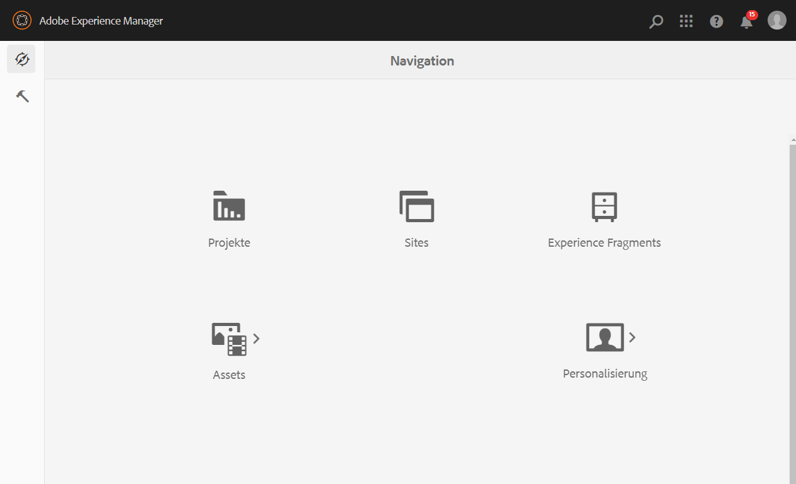
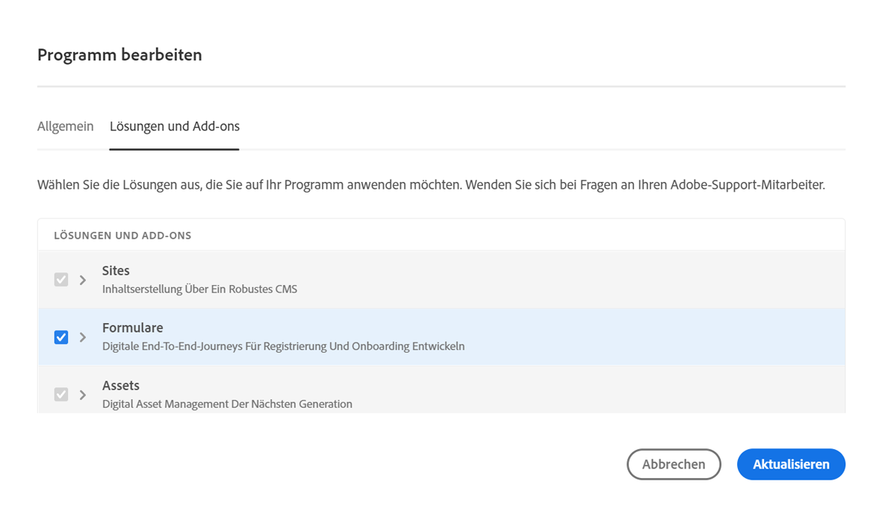

# Konfiguration {#installation-and-configuration}

Beim Konfigurieren einer Cloud Service-Umgebung können folgende Probleme auftreten:

## Forms-Option ist nicht verfügbar

Die Option **[!UICONTROL Formulare]** ist auf der Seite **[!UICONTROL Navigation]** nicht verfügbar.

So aktivieren Sie die Option **[!UICONTROL Formulare]**:

1. Melden Sie sich bei [Cloud Manager](https://experience.adobe.com/) an.
1. Suchen Sie Ihr Programm und klicken Sie auf das Symbol . Dadurch wird die Seite „Programm bearbeiten“ für Ihr Programm geöffnet.
1. Öffnen Sie die Registerkarte **[!UICONTROL Lösungen und Add-ons]**.
1. Wählen Sie die Option **[!UICONTROL Formulare]** aus und klicken Sie auf **[!UICONTROL Speichern]**.

   .

1. [Erstellen](https://experienceleague.adobe.com/docs/experience-manager-cloud-manager/using/how-to-use/configuring-pipeline.html?lang=de#how-to-use) Sie sowohl Produktions- als auch Nicht-Produktions-Pipelines und [führen](https://experienceleague.adobe.com/docs/experience-manager-cloud-manager/using/how-to-use/deploying-code.html?lang=de) Sie sie aus.

Nachdem die Pipeline erstellt und bereitgestellt wurde, die Option **[!UICONTROL Formulare]** auf der Seite **[!UICONTROL Navigation]**.

<!--  
## Environment creation fails {#environment-creation-fails}

Users are unable to create an [!DNL AEM Forms] as a Cloud Service environment. The environment creation fails after running for some time.

A missing profile can lead to environment creation failure. Check that the profile exists in Admin Console. If the profile does not exist, perform the following steps to create the profile:

1. Log in to [Admin Console](https://adminconsole.adobe.com/). Use Adobe ID of administrator provisioned to use Automated Forms Conversion Service to login. Do not any other ID or Federated ID to login.
1. Click the **[!UICONTROL Automated Forms Conversion Service]** option.
1. Click **[!UICONTROL New Profile]** in the Products tab.
1. Specify Name, Display Name, and Description for the profile. Click **[!UICONTROL Done]**. A profile is created.

If the profile exists and issues still persist, contact Adobe Support. -->

## Build-Pipeline schlägt fehl {#build-pipeline-fails}

Benutzer können die Build-Pipeline nicht ausführen. Die Pipeline schlägt nach einiger Zeit fehl.

Um das Problem zu beheben, öffnen Sie Cloud Manager, wählen Sie die Option **[!UICONTROL Aktualisieren]** für Ihre Umgebung aus und führen Sie die Pipeline aus.

## Bundles haben keinen aktiven Status {#bundles-inactive-state}

Um das Problem zu beheben, führen Sie die folgenden Schritte aus:

1. Starten Sie AEM vollständig und warten Sie, bis alle Pakete verfügbar sind.
1. Stoppen Sie AEM (Strg+C).
1. Platzieren Sie die `.far`-Forms-Datei in den Installationsordner.
1. Starten Sie den AEM-Server neu.