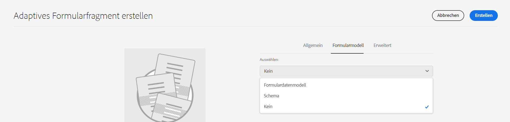
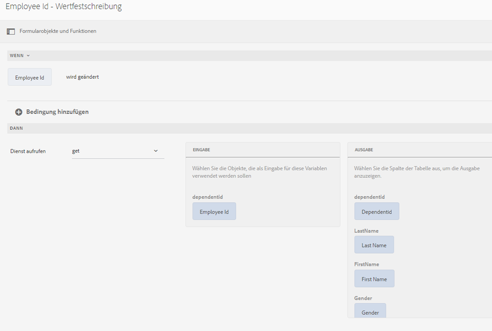

# Verwenden von Formulardatenmodellen {#use-form-data-model}

| Version | Artikel-Link |
| -------- | ---------------------------- |
| AEM 6.5 | [Hier klicken](https://experienceleague.adobe.com/docs/experience-manager-65/forms/form-data-model/using-form-data-model.html) |
| AEM as a Cloud Service | Dieser Artikel |

Mit der [!DNL Experience Manager Forms]-Datenintegration können Sie unterschiedliche Back-End-Datenquellen verwenden, um ein Formulardatenmodell zu erstellen, das Sie als Schema in verschiedenen Workflows für adaptive Formulare <!--and interactive communications--> verwenden können. Dafür ist das Konfigurieren von Datenquellen und das Erstellen von Formulardatenmodellen erforderlich, basierend auf Datenmodellobjekten sowie Services, die in den Datenquellen verfügbar sind. Weitere Informationen finden Sie in den folgenden Themen:

* [[!DNL Experience Manager Forms]-Datenintegration](data-integration.md)
* [Konfigurieren von Datenquellen](configure-data-sources.md)
* [Erstellen des Formulardatenmodells](create-form-data-models.md)
* [Arbeiten mit einem Formulardatenmodell](work-with-form-data-model.md)

Ein Formulardatenmodell ist eine Erweiterung des JSON-Schemas, die Sie verwenden können für:

* [Erstellen adaptiver Formulare und Fragmente](#create-af)
  <!--* [Create interactive communications and building blocks like text, list, and condition fragments](#create-ic)-->
* [Vorschau mit Beispieldaten](#preview-ic)
* [den Formulardatenmodell-Service](#prefill)
* [Zurückschreiben von übermittelten adaptiven Formulardaten in Datenquellen](#write-af)
* [Aufrufen von Services über Regeln für adaptive Formulare](#invoke-services)

## Erstellen adaptiver Formulare und Fragmente {#create-af}

Sie können [adaptive Formulare](creating-adaptive-form.md) und adaptive Formularfragmente<!-- [Adaptive Form Fragments](adaptive-form-fragments.md) --> auf Grundlage eines Formulardatenmodells erstellen. Gehen Sie wie folgt vor, um ein Formulardatenmodell beim Erstellen eines adaptiven Formulars oder eines adaptiven Formularfragments zu verwenden:

1. Wählen Sie auf der Registerkarte „Formularmodell“ im Bildschirm „Eigenschaften hinzufügen“ **[!UICONTROL Formulardatenmodell]** aus der Dropdownliste **[!UICONTROL Auswählen aus]**.

   

1. Tippen Sie auf **[!UICONTROL Formulardatenmodell auswählen]**, um es zu erweitern. Alle verfügbaren Formulardatenmodelle werden aufgelistet.

   Wählen Sie ein Formulardatenmodell aus.

   

1. (**Nur adaptive Formularfragmente**) Sie können ein adaptives Formularfragment auf Grundlage eines einzelnen Datenmodellobjekts in einem Formulardatenmodell erstellen. Erweitern **[!UICONTROL Definitionen des Formulardatenmodells]** angezeigt. Es listet alle Datenmodellobjekte im angegebenen Formulardatenmodell auf. Wählen Sie ein Datenmodellobjekt aus der Liste aus.

   

   Sobald das auf einem Formulardatenmodell basierende adaptive Formular oder Formularfragment erstellt ist, werden Formulardatenmodellobjekte auf der Registerkarte **[!UICONTROL Data Sources]** des Inhaltsbrowsers im Editor für adaptive Formulare angezeigt.

   >[!NOTE]
   >
   >Für adaptive Formularfragmente werden nur das beim Authoring gewählte Datenmodellobjekt und die mit diesem verknüpften Datenmodellobjekte auf der Registerkarte „Data Sources“ angezeigt.

   

   Indem Sie Datenmodellobjekte in das adaptive Formular oder Fragment ziehen und dort ablegen, können Sie Formularfelder hinzufügen. Die hinzugefügten Formularfelder behalten die Metadateneigenschaften bei und binden mit den Datenmodellobjekteigenschaften. Durch die Bindung wird sichergestellt, dass die Feldwerte bei der Formularübermittlung in den entsprechenden Datenquellen aktualisiert und vorausgefüllt werden, wenn das Formular wiedergegeben wird.

<!-- ## Create interactive communications {#create-ic}

You can create an interactive communication based on a Form Data Model that you can use to prefill interactive communication with data from configured data sources. In addition, the building blocks of an interactive communication, such as text, list, and condition document fragments can be based on a form data model.

You can choose a Form Data Model when creating an interactive communication or a document fragment. The following image shows the General tab of the Create Interactive Communication dialog.

General tab of Create Interactive Communication dialog

For more information, see:

[Create an interactive communication](create-interactive-communication.md)

[Text in Interactive Communications](texts-interactive-communications.md)

[Conditions in Interactive Communications](conditions-interactive-communications.md)

[List fragments](lists.md) -->

## Vorschau mit Beispieldaten {#preview-ic}

Mit dem Formulardatenmodell-Editor können Sie Beispieldaten für Datenmodellobjekte im Formulardatenmodell generieren und bearbeiten. Sie können diese Daten zur Vorschau und zum Testen adaptiver <!--interactive communications and-->-Formulare verwenden. Sie müssen die Beispieldaten vor der Vorschau generieren, wie beschrieben unter [Arbeiten mit einem Formulardatenmodell](work-with-form-data-model.md#sample).

<!--To preview an interactive communication with sample Form Data Model data:

1. On [!DNL  Experience Manager] author instance, navigate to **[!UICONTROL Forms > Forms & Documents]**.
1. Select an interactive communication and tap **[!UICONTROL Preview]** in the toolbar to select **[!UICONTROL Web Channel]**, **[!UICONTROL Print Channel]**, or **[!UICONTROL Both Channels]** to preview the interactive communication.
1. In the Preview [*channel*] dialog, ensure that **[!UICONTROL Test Data of Form Data Model]** is selected and tap **[!UICONTROL Preview]**.

The interactive communication opens with prefilled sample data.

-->

Um ein adaptives Formular mit Beispieldaten in der Vorschau anzuzeigen, öffnen Sie das Formular im Autorenmodus und tippen Sie auf **[!UICONTROL Vorschau]**.

## Vorbefüllen mit dem Formulardatenmodell-Service {#prefill}

[!DNL Experience Manager Forms] bietet einen standardmäßigen Vorbefüllungs-Service für Formulardatenmodelle, den Sie für adaptive Formulare <!--and interactive communications--> auf Grundlage eines Formulardatenmodells aktivieren können. Der Vorbefüllungs-Service fragt Datenquellen nach Datenmodellobjekten im adaptiven Formular <!--and interactive communication--> ab und befüllt dementsprechend Daten, während das Formular oder die Kommunikation gerendert wird.

Um den Vorbefüllungs-Service für ein adaptives Formular zu aktivieren, öffnen Sie die Eigenschaften des Containers für ein adaptives Formular und wählen Sie **[!UICONTROL Vorbefüllungs-Service für Formulardatenmodell]** aus der Dropdown-Liste **[!UICONTROL Vorbefüllungs-Service]** im Akkordeon „Standard“ aus. Speichern Sie anschließend die Eigenschaften.

<!--To configure Form Data Model prefill service in an interactive communication, you can select Form Data Model Prefill Service in the Prefill Service drop-down while creating it or later by modifying the properties.

Edit Properties dialog for an interactive communication-->

## Schreiben von übermittelten adaptiven Formulardaten in Datenquellen {#write-af}

Sie können ein auf einem Formulardatenmodell basierendes Formular so konfigurieren, dass die vom Benutzer im Formular übermittelten Daten für ein Datenmodellobjekt bei der Übermittlung in dessen Datenquellen geschrieben werden. Zu diesem Zweck stellen [!DNL Experience Manager Forms] die [Übermittlungsaktion für Formulardatenmodelle](configuring-submit-actions.md) zur Verfügung. Standardmäßig ist diese nur für adaptive Formulare verfügbar, die auf einem Formulardatenmodell basieren. Durch diese Aktion werden übermittelte Daten für ein Datenmodellobjekt in dessen Datenquelle geschrieben.

Um die Übermittlungsaktion für Formulardatenmodelle zu konfigurieren, öffnen Sie die Eigenschaften des Container für das adaptive Formular und wählen Sie **[!UICONTROL Mit Formulardatenmodell übermitteln]** aus der Dropdownliste „Übermittlungsaktion“ im Akkordeon „Übermittlung“ aus. Suchen Sie dann ein Datenmodellobjekt aus dem **[!UICONTROL Name des zu sendenden Datenmodellobjekts]** angezeigt. Speichern Sie die Eigenschaften.

Beim Senden des Formulars werden die Daten für das konfigurierte Datenmodellobjekt in die entsprechende Datenquelle geschrieben.

<!---->

Sie können auch Formularanhänge mit der Objekteigenschaft des binären Datenmodells an eine Datenquelle senden. Führen Sie folgende Schritte aus, um Anlagen an eine JDBC-Datenquelle zu senden:

1. Fügen Sie dem Formulardatenmodell ein Datenmodellobjekt hinzu, das eine binäre Eigenschaft enthält.
1. Ziehen Sie im adaptiven Formular die Komponente **[!UICONTROL Dateianhang]** aus dem Komponentenbrowser auf das adaptive Formular.
1. Tippen Sie auf die hinzugefügte Komponente, um sie auszuwählen, und tippen Sie dann auf , um den Eigenschaftenbrowser für die Komponente zu öffnen.
1. Tippen Sie im Feld „Bindungsverweis“ auf , navigieren Sie zur binären Eigenschaft, die Sie im Formulardatenmodell hinzugefügt haben, und wählen Sie sie aus. Konfigurieren Sie weitere Eigenschaften entsprechend.

   Tippen Sie auf , um die Eigenschaften zu speichern. Das Anlagenfeld ist jetzt an die binäre Eigenschaft des Formulardatenmodells gebunden.

1. Aktivieren Sie im Abschnitt Übermittlung der Eigenschaften des Containers für adaptive Formulare die Option **[!UICONTROL Übermitteln von Formularanlagen]**. Er sendet den Anhang im Feld der binären Eigenschaft bei der Formularübermittlung an die Datenquelle.

## Aufrufen von Services in adaptiven Formularen mithilfe von Regeln {#invoke-services}

In einem auf einem Formulardatenmodell basierenden adaptiven Formular können Sie [Regeln erstellen](rule-editor.md), um die im Formulardatenmodell konfigurierten Services aufzurufen. Die **[!UICONTROL Dienste aufrufen]** -Vorgang in einer Regel listet alle verfügbaren Dienste im Formulardatenmodell auf und ermöglicht die Auswahl von Eingabe- und Ausgabefeldern für den Dienst. Sie können mit dem Regeltyp **[!UICONTROL Wert festlegen]** außerdem einen Formulardatenmodell-Service aufrufen und die vom Service zurückgegebene Ausgabe als Wert eines Feldes einstellen.

Beispielsweise ruft folgende Regel einen Get-Service auf, für den die Mitarbeiter-ID als Eingabe angegeben werden muss und der die entsprechenden Werte in den Feldern für die Angehörigen-ID, den Nachnamen, den Vornamen und das Geschlecht zurückgibt.

Darüber hinaus können Sie mithilfe der `guidelib.dataIntegrationUtils.executeOperation`-API ein JavaScript im Codeeditor für den Regeleditor schreiben. <!-- For API details, see [API to invoke Form Data Model service](invoke-form-data-model-services.md).-->

### Formulardatenmodell mit benutzerdefinierten Funktionen aufrufen {#invoke-form-data-model-using-custom-functions}

Sie können [Aufrufen eines Formulardatenmodells aus dem Regeleditor mithilfe benutzerdefinierter Funktionen](/help/forms/rule-editor.md#custom-functions-in-rule-editor-custom-functions). Um das Formulardatenmodell aufzurufen, fügen Sie der Zulassungsliste ein Formulardatenmodell hinzu. So fügen Sie ein Formulardatenmodell zu einer Zulassungsliste hinzu:

1. Navigieren Sie zur Experience Manager-Webkonsole unter `https://server:host/system/console/configMgr`.
1. Suchen **[!UICONTROL Whitelisting auf adaptiver Formularebene des Formulardatenmodells für den Dienstaufruf - Konfigurationsfactory]**.
1. Klicks  -Symbol, um die Konfiguration hinzuzufügen.
1. Hinzufügen **[!UICONTROL Inhaltspfadmuster]** um den Speicherort Ihrer adaptiven Forms anzugeben.  Standardmäßig lautet der Wert `/content/forms/af/(.*)` , das alle adaptiven Forms umfasst. Sie können auch den Pfad für ein bestimmtes adaptives Formular angeben.
1. Hinzufügen **[!UICONTROL Pfadmuster des Formulardatenmodells]** um den Speicherort des Formulardatenmodells anzugeben. Standardmäßig lautet der Wert `/content/dams/formsanddocuments-fdm/(.*)` , das das gesamte Formulardatenmodell umfasst. Sie können auch den Pfad für ein bestimmtes Formulardatenmodell angeben.
1. Speichern Sie die Einstellungen.

Die hinzugefügte Konfiguration wird unter dem **[!UICONTROL Whitelisting auf adaptiver Formularebene des Formulardatenmodells für den Dienstaufruf - Konfigurationsfactory]** -Option.

>[!VIDEO](https://video.tv.adobe.com/v/3423977/adaptive-forms-custom-function-rule-editor)

>[!NOTE]
>
> So rufen Sie ein Formulardatenmodell über ein AEM Archetyp-Projekt über den Regeleditor mit benutzerdefinierten Funktionen auf:
>
>1. [Konfigurationsdatei erstellen](https://github.com/adobe/aem-core-forms-components/blob/master/it/config/src/main/content/jcr_root/apps/system/config/com.adobe.aemds.guide.factory.impl.AdaptiveFormFDMConfigurationFactoryImpl~core-components-it.cfg.json).
>1. Legen Sie Eigenschaften von getContentPathPattern und getFormDataModelPathPattern fest.
>1. Stellen Sie das Projekt bereit.
