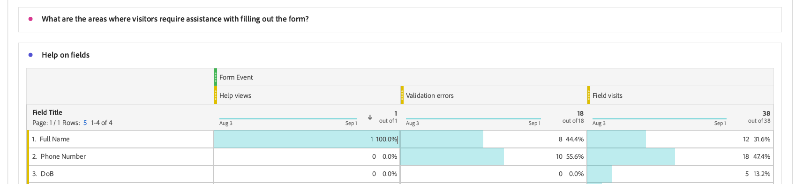

# Anzeigen und Verstehen von Analyseberichten zu adaptiven Formularen {#viewing-and-understanding-aem-forms-analytics-reports}

| Version | Artikel-Link |
| -------- | ---------------------------- |
| AEM as a Cloud Service | Dieser Artikel |
| AEM 6.5 | [Hier klicken](https://experienceleague.adobe.com/docs/experience-manager-65/forms/integrate-aem-forms-with-experience-cloud-solutions/view-understand-aem-forms-analytics-reports.html?lang=de) |

In der sich schnell entwickelnden Landschaft der digitalen Analyse ist es unerlässlich, globale Trends zu verfolgen, um fundierte Entscheidungen zu treffen und digitale Erfahrungen zu optimieren. Um dies anzugehen, lassen sich adaptive Formulare nahtlos in Adobe Analytics integrieren, um Leistungsmetriken für Ihre veröffentlichten Formulare und Dokumente zu erfassen und zu verfolgen. Ziel der Analyse dieser Metriken ist es, datengesteuerte Entscheidungen mithilfe von Metriken und Analysen zu treffen, um die Benutzerfreundlichkeit und die Effektivität der Formulare zu verbessern.

Durch die Erfassung und Verfolgung wichtiger Leistungsindikatoren können Unternehmen Bereiche mit Verbesserungspotenzial identifizieren, Benutzererlebnisse optimieren und letztlich bessere Ergebnisse erzielen, um außergewöhnliche Kundenerlebnisse zu schaffen.

## Einrichten von Adobe Analytics für adaptive Formulare {#setup-adobe-analytics-to-aem-forms}

Für den AEM-Formularanalysebericht integrieren Sie zunächst Adobe Analytics über die Experience Cloud-Einrichtungsautomatisierung in AEM Forms. Für die Automatisierung der Experience Cloud-Einrichtung in adaptiven Formularen sind eine Adobe Analytics-Lizenz, Datenerfassung (ehemals Adobe Launch) zur Verwaltung von Tracking-Skripten und die Integration in die Experience Platform Launch-API erforderlich, um die Datenerfassung und die Erstellung von Einblicken zu optimieren. Lesen Sie den Artikel [Aktivieren von Adobe Analytics für ein adaptives Formular mithilfe der Automatisierung der Experience Cloud-Einrichtung](/help/forms/enable-adobe-analytics-adaptive-form-using-experience-cloud-setup-automation.md) für vollständige Einrichtungsinformationen.

## Anzeigen des Berichts für adaptive Formulare von Adobe Analytics {#view-adobe-analytics-report}

1. Wechseln Sie auf Ihrer AEM-Instanz zu **[!UICONTROL Formulare]** >> **[!UICONTROL Formulare und Dokumente]**.
1. Wählen Sie Ihr Formular aus. Sie sehen, dass Adobe Analytics integriert ist, wie auf der linken Seite gezeigt, zu den für Adobe Analytics aktivierten Formularen.

   {width="100%"}

1. Klicken Sie auf **Adobe Analytics**, um Ihren Bericht anzuzeigen und Leistungsdaten zu analysieren.

## Analysebericht für adaptive Formulare {#understanding-aem-forms-analytics-reports}

Adobe Analytics bietet eine umfassende Palette von Leistungsmetriken für adaptive Formulare, die wertvolle Einblicke in die Formularnutzung bieten. Diese Metriken sind:

### **Welche Leistung erzielen adaptive Formulare?** {#how-your-adaptive-form-is-performing}

Es sind die Metriken Formularwiedergaben, Formularübermittlungen, Validierungsfehler und Unique Visitors enthalten, mit denen Sie die Nutzung und Effektivität Ihrer Formulare bewerten können:

* **Formularwiedergaben**: Formularwiedergaben zeigen, wie oft das Formular wiedergegeben oder geöffnet wurde.

* **Formularübermittlungen**: Formularübermittlungen geben an, wie oft adaptive Formulare erfolgreich vervollständigt und von Benutzenden gesendet wurden.

* **Validierungsfehler**: Validierungsfehler zeigen die Gesamtzahl der validierungsbezogenen Fehler an, die in den Formularfeldern aufgetreten sind.

* **Unique Visitors**: Unique Visitors stellen die Anzahl der Wiedergaben des Formulars durch Besuchende dar. Weitere Informationen über Unique Visitors finden Sie unter [Unique Visitors, Besuche und Kundenverhalten](https://experienceleague.adobe.com/docs/analytics/components/metrics/visits.html?lang=de). 

  {width="100%"}

### **Besucherinnen und Besucher Ihrer Formulare** {#visitors-to-your-forms}

Dies hilft Ihnen, wertvolle Einblicke in die Besucheraktivität auf Ihren Formularen zu erhalten:

* **Besuche und Übermittlungen**: Beschreibt die Häufigkeit von Besuchen auf Ihren Formularen in einem Datumsbereich und die entsprechende Anzahl von Formularübermittlungen. Um weitere Informationen hierzu zu erhalten, klicken Sie auf [Besuche](https://experienceleague.adobe.com/docs/analytics/components/metrics/visits.html?lang=de).
* **Unique Visitors und ihre Gesamtbesuche**: Dabei wird zwischen neuen und wiederkehrenden Benutzenden unterschieden. So können Besucherinnen und Besucher beispielsweise jeden Tag einen Monat lang zu Ihrer Site kommen, zählen jedoch immer noch als einzelne Unique Visitors. Gehen Sie auf [Unique Visitors](https://experienceleague.adobe.com/docs/analytics/components/metrics/unique-visitors.html?lang=de) für detaillierte Informationen.

  {width="100%"}

### **Gerätetyp** {#device-type}

„Gerätetyp“ hilft Ihnen dabei, den Gerätetyp zu identifizieren, der für den Zugriff auf Ihre Formulare verwendet wurde. Der Gerätetyp wird als Mobilgerätetyp kategorisiert. In diesem Fall ist es beispielsweise Mobilgerätetyp: andere, und Mobilgerätetyp: Mobiltelefon. Zu den verschiedenen Arten von Mobilgeräten gehören unter anderem Mobiltelefon, Tablet, Medien-Player oder Gaming-Konsole.

{width="100%"}

### **Geografische Aufgliederung** {#geographical-breakdown}

Sie zeigt den Standort an, von dem aus auf die Formulare zugegriffen wird. Sie enthält regionsspezifische Informationen zu Benutzerinnen und Benutzern von Formularen. Sie können beispielsweise sehen, dass eine regionsspezifische Information über eine Person Indien ist, wie in der Abbildung dargestellt.

{width="100%"}

### **Top-Quellen für Traffic und beliebte Formulare** {#top-sources-of-traffic-and-popular-forms}

Auf diese Weise können Sie die primäre Quelle oder den Link identifizieren, von dem aus Ihre Formulare referenziert werden. Im folgenden Bild sehen Sie beispielsweise Suchinstanzen für Ihre adaptiven Formulare mit 18,9 % **Eingegeben/mit Lesezeichen versehen**, 70,4 % **Suchmaschinen** und 10,7 % von **anderen Websites**. Sie können Dimensionselemente entsprechend Ihren Anforderungen festlegen. Außerdem können Sie herausfinden, welche die am häufigsten besuchten oder beliebtesten Formulare sind.

{width="100%"}

### **Benutzeraktivität in Top-Formularen** {#user-activity-on-top-forms}

Eine umfassende Ansicht der Benutzerinteraktion mit Feldbesuchen, Formularwiedergaben, Validierungsfehlern, abgebrochenen Formularen und Formularübermittlungen bietet Einblicke in die aktivsten Formulare. In der unten stehenden Abbildung sehen Sie, dass das Antragsformular gemäß den Formularereignismetriken das aktivste ist.

{width="100%"}

### **Zeitleiste für die Formularbesuchszeit** {#timeline-for-time-spent-on-forms}

Es handelt sich um die Zeit, die Benutzende im Zeitverlauf auf Ihren Formularen verbringen, um Interaktionsmuster zu identifizieren.

{width="100%"}

### **Bereiche, in denen Besucherinnen und Besucher beim Ausfüllen des Formulars Hilfe benötigen** {#areas-requiring-assistance}

Metriken wie Hilfsansichten, Validierungsfehler und Feldbesuche zeigen, wo Benutzende Hilfe benötigen oder wie Fehler in Feldern verfolgt werden können. In der Abbildung unten sehen Sie dies beispielsweise in einem Formular mit Feldern wie **Vollständiger Name**, **Telefonnummer**, **Geburtsdatum**. Das Feld **Vollständiger Name** hat 12 Besuche, von 12 Besuchen haben 8 Besuche einen Validierungsfehler und 1 angeklicktes Hilfesymbol für die Hilfeansicht in diesem Feld. Sie können die Metrikdaten für andere Formularfelder anzeigen.

{width="100%"}

### **Das letzte Formularfeld, das Besuchende angezeigt haben, bevor sie das Formular verlassen haben** {#last-form-field-that-visitors-viewed}

Sie können damit die Formularfelder analysieren, in denen die Benutzenden Zeit verbracht haben, bevor sie das Formular verlassen haben. Ein Beispiel bietet die unten stehenden Abbildung. Auf 5 verlassenen Formularen sind 2 Benutzende beim Feld **Vollständiger Name** gegangen, 2 beim Feld **Telefonnummer** und 1 beim Feld **Texteingabe**.

{width="100%"}

## Siehe auch {#see-also}

* [Aktivieren von Adobe Analytics für ein adaptives Formular mithilfe der Automatisierung der Experience Cloud-Einrichtung.](/help/forms/enable-adobe-analytics-adaptive-form-using-experience-cloud-setup-automation.md)
* [Hinzufügen eines adaptiven Formulars zu einer AEM Sites-Seite oder einem Experience Fragment](/help/forms/create-or-add-an-adaptive-form-to-aem-sites-page.md)
* [Integrieren von AEM Forms mit Adobe Analytics](/help/forms/integrate-aem-forms-with-adobe-analytics.md)
