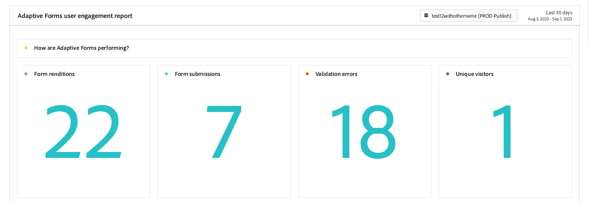

# Anzeigen und Verstehen der Analyseberichte für adaptive Forms {#viewing-and-understanding-aem-forms-analytics-reports}

 Dies ist eine Vorabveröffentlichungsfunktion, auf die über unsere [Pre-Release-Kanal](https://experienceleague.adobe.com/docs/experience-manager-cloud-service/content/release-notes/prerelease.html#new-features). 

In der sich schnell entwickelnden Landschaft der digitalen Analyse ist es unerlässlich, sich an globale Trends zu halten, um fundierte Entscheidungen zu treffen und digitale Erfahrungen zu optimieren. Um dies zu beheben, integrieren Adaptive Forms nahtlos in Adobe Analytics , um Leistungsmetriken für Ihre veröffentlichten Formulare und Dokumente zu erfassen und zu verfolgen. Ziel der Analyse dieser Metriken ist es, datengesteuerte Entscheidungen mithilfe von Metriken und Analysen zu treffen, um die Benutzerfreundlichkeit und Effektivität der Formulare zu verbessern.

Durch Erfassung und Verfolgung wichtiger Leistungsindikatoren können Unternehmen Bereiche für Verbesserungen identifizieren, Benutzererlebnisse optimieren und letztlich bessere Ergebnisse erzielen, um außergewöhnliche Kundenerlebnisse zu schaffen.

## Einrichten von Adobe Analytics für adaptive Forms {#setup-adobe-analytics-to-aem-forms}

Für den AEM Forms Analytics-Bericht integrieren Sie zunächst Adobe Analytics über die Experience Cloud-Setup-Automatisierung in AEM Forms. Für die Automatisierung des Experience Cloud-Setups in Adaptive Forms sind eine Adobe Analytics-Lizenz, Datenerfassung (ehemals Adobe Launch) zur Verwaltung von Tracking-Skripten und Integration in die Experience Platform Launch-API erforderlich, um die Datenerfassung und die Erstellung von Einblicken zu optimieren. Besuch [Aktivieren Sie Adobe Analytics für ein adaptives Formular mithilfe der Automatisierung des Experience Cloud-Setups.](/help/forms/forms-experience-cloud-setup-automation.md) für eine vollständige Einrichtungsinformationen.

## Anzeigen des Berichts &quot;Adaptive Forms Adobe Analytics&quot; {#view-adobe-analytics-report}

1. Wechseln Sie in Ihrer AEM-Instanz zu **[!UICONTROL Forms]** >> **[!UICONTROL Forms und Dokument]**.
1. Wählen Sie das Formular aus. Sie sehen, dass Adobe Analytics wie auf der linken Seite gezeigt integriert ist und für Adobe Analytics aktiviert ist.

   

1. Klicks **Adobe Analytics** , um Ihren Bericht anzuzeigen und Leistungsdaten zu analysieren.

## Analysebericht für adaptive Forms {#understanding-aem-forms-analytics-reports}

Adobe Analytics bietet eine umfassende Palette von Leistungsmetriken für adaptive Forms, die wertvolle Einblicke in die Formularnutzung bieten. Diese Metriken sind:

### **Welche Leistung erzielt Adaptive Forms?** {#how-your-adaptive-form-is-performing}

Sie enthält die Metriken Formularwiedergaben, Formularübermittlungen, Validierungsfehler und Unique Visitors, mit denen Sie die Nutzung und Effektivität Ihrer Formulare bewerten können:

* **Formularwiedergaben**: Formularwiedergaben zeigen, wie oft das Formular wiedergegeben oder geöffnet wurde.

* **Formularübermittlungen**: Formularübermittlungen geben an, wie oft adaptive Formulare erfolgreich abgeschlossen und von Benutzern gesendet wurden.

* **Validierungsfehler**: Überprüfungsfehler zeigt die Gesamtzahl der validierungsbezogenen Fehler an, die in den Feldern der Formulare aufgetreten sind.

* **Unique Visitors**: Unique Visitors stellen die Anzahl der Wiedergaben des Formulars durch einen Besucher dar. Weitere Informationen zu Unique Visitors finden Sie unter [Unique Visitors, Besuche und Kundenverhalten](https://experienceleague.adobe.com/docs/analytics/components/metrics/visits.html).

  

### **Besucher Ihrer Formulare** {#visitors-to-your-forms}

So erhalten Sie wertvolle Einblicke in die Besucheraktivität in Ihren Formularen:

* **Besuche und Übermittlungen**: Beschreibt die Häufigkeit von Besuchen bei Formularen in einem Datumsbereich und die entsprechende Anzahl von Formularübermittlungen, um weitere Informationen zu diesem Klick zu erhalten. [Besuche](https://experienceleague.adobe.com/docs/analytics/components/metrics/visits.html).
* **Unique Visitors und ihre Gesamtbesuche**: Dabei wird zwischen den neuen und den wiederkehrenden Benutzern unterschieden. So kann ein Besucher beispielsweise jeden Tag einen Monat lang zu Ihrer Site kommen, zählt jedoch immer noch als einzelner Unique Visitor. Besuch [Unique Visitors](https://experienceleague.adobe.com/docs/analytics/components/metrics/unique-visitors.html) für detaillierte Informationen.

  

### **Gerätetyp** {#device-type}

Gerätetyp hilft Ihnen dabei, den Gerätetyp zu identifizieren, der für den Zugriff auf Ihre Formulare verwendet wird. Der Gerätetyp wird als Mobilgerätetyp kategorisiert. In diesem Fall ist es beispielsweise Mobilgerätetyp: Andere und Mobilgerätetyp: Mobiltelefon. Zu den verschiedenen Arten von Mobilgeräten gehören Mobiltelefon, Tablet, Medienplayer, Gaming-Konsole und mehr.

### **Geografische Aufgliederung** {#geographical-breakdown}

Er zeigt den Speicherort an, von dem aus auf die Forms zugegriffen wird. Sie enthält regionsspezifische Informationen zu Formularbenutzern. Sie können beispielsweise sehen, dass eine regionsspezifische Information über einen Formularbenutzer Indien ist, wie in der Abbildung dargestellt.

### **Top-Quellen für Traffic und beliebte Formulare** {#top-sources-of-traffic-and-popular-forms}

Auf diese Weise können Sie die primäre Quelle oder den Link identifizieren, von dem aus Ihre Formulare referenziert werden. Im folgenden Bild sehen Sie beispielsweise Suchinstanzen für Ihre adaptiven Formulare mit 18,9 % **Eingegeben/mit Lesezeichen versehen**, 70,49% basierend auf **Suchmaschinen**, und 24 % stammen aus **Andere Websites**. Sie können Dimensionselemente basierend auf Ihren Anforderungen definieren. Außerdem können Sie herausfinden, welche die am häufigsten besuchten oder beliebtesten Formulare sind.

### **Benutzeraktivität in Top-Formularen** {#user-activity-on-top-forms}

Eine umfassende Ansicht der Benutzerinteraktion mit Feldbesuchen, Formularwiedergaben, Überprüfungsfehlern, abgebrochenen Formularen und Formularübermittlungen bietet Einblicke in die am aktivsten Formulare. In der unten stehenden Abbildung sehen Sie, dass das Antragsformular basierend auf den Formularereignismetriken die aktivste ist.

### **Zeitleiste für die Formularbesuchszeit** {#timeline-for-time-spent-on-forms}

Es ist die Zeit, die Benutzer mit der Zeit auf Ihre Formulare verbringen, um Interaktionsmuster zu identifizieren.

### **Bereiche, in denen Besucher beim Ausfüllen des Formulars Hilfe benötigen** {#areas-requiring-assistance}

Metriken wie Hilfeansichten, Validierungsfehler und Feldbesuche zeigen, wo Benutzer Hilfe benötigen oder wie Fehler in Feldern verfolgt werden können. In der Abbildung unten sehen Sie dies beispielsweise in einem Formular mit Feldern wie **Vollständiger Name**, **Telefonnummer**, **DoB**. Die **Vollständiger Name** -Feld 12 Besuche, von 12 Besuchen 8 Besuche haben einen Validierungsfehler und 1 angeklicktes Hilfesymbol für die Hilfeansicht in diesem Feld. Sie können die Metrikdaten für andere Formularfelder anzeigen.

### **Das letzte Formularfeld, das Besucher angezeigt haben, bevor sie das Formular verlassen haben** {#last-form-field-that-visitors-viewed}

Sie können damit die Formularfelder analysieren, in denen die Benutzer Zeit verbracht haben, bevor sie das Formular verlassen haben. Beispiel: In der unten stehenden Abbildung sind von 5 verlassenen Formularen 2 im Feld übrig. **Vollständiger Name**, 2 links im Feld **Telefonnummer** und 1 im Feld links **Texteingabe**.

