# Arbeiten mit Formulardatenmodellen {#work-with-form-data-model}

| Version | Artikel-Link |
| -------- | ---------------------------- |
| AEM 6.5 | [Hier klicken](https://experienceleague.adobe.com/docs/experience-manager-65/forms/form-data-model/work-with-form-data-model.html?lang=de) |
| AEM as a Cloud Service | Dieser Artikel |


Der Formulardatenmodelleditor bietet eine intuitive Benutzeroberfläche sowie Tools zum Bearbeiten und Konfigurieren eines Formulardatenmodells. Mithilfe des Editors können Sie Datenmodellobjekte, Eigenschaften und Services aus verknüpften Datenquellen im Formulardatenmodell hinzufügen und konfigurieren. Darüber hinaus können Sie Datenmodellobjekte und -eigenschaften ohne Datenquellen erstellen und später mit den entsprechenden Datenmodellobjekten und -eigenschaften verknüpfen. Sie können auch Beispieldaten für Datenmodellobjekteigenschaften generieren und bearbeiten, die Sie zum Vorbefüllen adaptiver Formulare <!--and interactive communications--> und interaktiver Kommunikation während der Vorschau verwenden können. Sie können Datenmodellobjekte und Services testen, die in einem Formulardatenmodell konfiguriert sind, um sicherzustellen, dass sie ordnungsgemäß in Datenquellen integriert sind.

Wenn Sie mit der Forms-Datenintegration noch nicht vertraut sind und keine Datenquelle konfiguriert oder kein Formulardatenmodell erstellt haben, lesen Sie folgende Themen:

* [[!DNL Experience Manager Forms]-Datenintegration](data-integration.md)
* [Konfigurieren von Datenquellen](configure-data-sources.md)
* [Erstellen des Formulardatenmodells](create-form-data-models.md)

Weitere Details zu verschiedenen Aufgaben und Konfigurationen, die Sie mit dem Formulardatenmodelleditor durchführen können, finden Sie im Folgenden.

>[!NOTE]
>
>Sie müssen Mitglied der beiden Gruppen **fdm-author** und **forms-user** sein, um Formulardatenmodelle erstellen und verwenden zu können. Wenden Sie sich an Ihren [!DNL Experience Manager]-Administrator, um Mitglied der Gruppen zu werden.

## Hinzufügen von Datenmodellobjekten und Services {#add-data-model-objects-and-services}

Nachdem Sie ein Formulardatenmodell mit Datenquellen erstellt haben, können Sie mit dem Formulardatenmodelleditor Datenmodellobjekte und Services hinzufügen, deren Eigenschaften konfigurieren, Verknüpfungen zwischen Datenmodellobjekten erstellen und das Formulardatenmodell sowie die Services testen.

Sie können Datenmodellobjekte und Services aus verfügbaren Datenquellen zum Formulardatenmodell hinzufügen. Dabei werden hinzugefügte Datenmodellobjekte auf der Registerkarte „Modell“ und hinzugefügte Services auf der Registerkarte „Services“ angezeigt.

Hinzufügen von Datenmodellobjekten und Services:

1. Melden Sie sich bei der [!DNL Experience Manager]-Autorinstanz an, navigieren Sie zu **[!UICONTROL Formulare > Datenintegrationen]** und öffnen Sie das Formulardatenmodell, zu dem Sie Datenmodellobjekte hinzufügen möchten.
1. Erweitern Sie im Bereich „Data Sources“ die Datenquellen, um verfügbare Datenmodellobjekte und Services anzuzeigen.
1. Wählen Sie Datenmodellobjekte und Dienste aus, die Sie dem Formulardatenmodell hinzufügen möchten, und wählen Sie **[!UICONTROL Auswahl hinzufügen]**.

   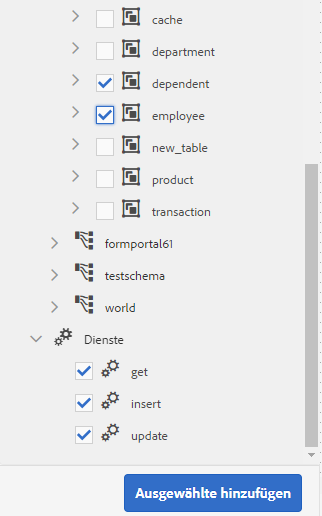

   Ausgewählte Datenmodellobjekte und Services

   Auf der Registerkarte **[!UICONTROL Modell]** wird eine grafische Darstellung aller Datenmodellobjekte und ihrer Eigenschaften angezeigt, die zum Formulardatenmodell hinzugefügt wurden. Jedes Datenmodellobjekt wird durch ein Feld im Formulardatenmodell dargestellt.

   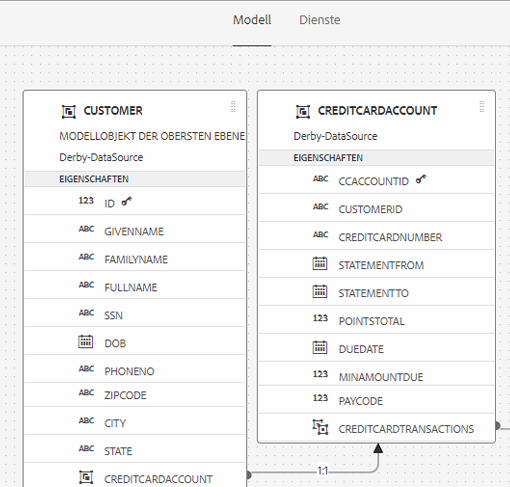

   Registerkarte **[!UICONTROL Modell]** mit hinzugefügten Datenmodellobjekten

   >[!NOTE]
   >
   >Sie können die Datenmodellobjektfelder durch Ziehen im Inhaltsbereich anordnen. Alle im Formulardatenmodell hinzugefügten Datenmodellobjekte sind im Bedienfeld „Data Sources“ ausgegraut.

   Auf der Registerkarte **[!UICONTROL Services]** wird eine Liste der hinzugefügten Services angezeigt.

   

   Registerkarte **[!UICONTROL Services]** mit Datenmodell-Services

   >[!NOTE]
   >
   >Das OData-Service-Metadatendokument enthält außer den Datenmodellobjekten und Services Navigationseigenschaften, die die Verknüpfung zwischen zwei Datenmodellobjekten definieren. Weitere Informationen finden Sie unter [Arbeiten mit Navigationseigenschaften von OData-Services](#work-with-navigation-properties-of-odata-services).

1. Auswählen **[!UICONTROL Speichern]** zum Speichern des Formularmodellobjekts.

   >[!NOTE]
   >
   >Sie können die auf der Registerkarte „Services“ eines Formulardatenmodells konfigurierten Services mithilfe von Regeln für adaptive Formulare aufrufen. Die konfigurierten Services sind in der Aktion zum Aufrufen von Services im Regeleditor verfügbar. Weitere Informationen zum Verwenden dieser Services in Regeln für adaptive Formulare finden Sie unter „Aufrufen von Services und Festlegen von Werten für Regeln“ im [Regeleditor](rule-editor.md).

## Erstellen von Datenmodellobjekten und untergeordneten Eigenschaften {#create-data-model-objects-and-child-properties}

### Erstellen von Datenmodellobjekten {#create-data-model-objects}

Sie können zwar Datenmodellobjekte aus konfigurierten Datenquellen hinzufügen, aber auch Datenmodellobjekte oder Entitäten ohne Datenquellen erstellen. Dies ist insbesondere dann hilfreich, wenn Sie im Formulardatenmodell keine Datenquellen konfiguriert haben.

So erstellen Sie ein Datenmodellobjekt ohne Datenquellen:

1. Melden Sie sich bei der [!DNL Experience Manager]-Autorinstanz an, navigieren Sie zu **[!UICONTROL Formulare > Datenintegrationen]** und öffnen Sie das Formulardatenmodell, zu dem Sie ein Datenmodellobjekt oder eine Entität hinzufügen möchten.
1. Auswählen **[!UICONTROL Entität erstellen]**.
1. Im [!UICONTROL Datenmodell erstellen] Dialogfeld einen Namen für das Datenmodellobjekt angeben und **[!UICONTROL Hinzufügen]**. Ein Datenmodellobjekt wird dem Formulardatenmodell hinzugefügt. Das neu hinzugefügte Datenmodellobjekt ist nicht an eine Datenquelle gebunden und weist keine Eigenschaften auf, wie in folgender Abbildung dargestellt.

   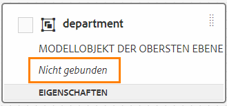

Als Nächstes können Sie untergeordnete Eigenschaften zu ungebundenen Datenmodellobjekten hinzufügen.

### Hinzufügen von untergeordneten Eigenschaften {#child-properties}

Mit dem Formulardatenmodelleditor können Sie untergeordnete Eigenschaften in einem Datenmodellobjekt erstellen. Die Eigenschaft ist bei der Erstellung an keine Eigenschaft in einer Datenquelle gebunden. Sie können die untergeordnete Eigenschaft später mit einer anderen Eigenschaft im enthaltenen Datenmodellobjekt verknüpfen.

Erstellen einer untergeordneten Eigenschaft:

1. Wählen Sie in einem Formulardatenmodell ein Datenmodellobjekt aus und wählen Sie **[!UICONTROL Untergeordnete Eigenschaft erstellen]**.
1. Geben Sie im Dialogfeld **[!UICONTROL Untergeordnete Eigenschaft erstellen]** unter **[!UICONTROL Name]** und **[!UICONTROL Typ]** einen Namen bzw. einen Datentyp für die Eigenschaft an. Sie können optional einen Titel und eine Beschreibung für die Eigenschaft angeben.
1. Aktivieren Sie die Option „Berechnet“, wenn die Eigenschaft eine berechnete Eigenschaft ist. Der Wert einer berechneten Eigenschaft wird anhand einer Regel oder eines Ausdrucks ausgewertet. Weitere Informationen finden Sie unter [Bearbeiten von Eigenschaften](#properties).
1. Wenn das Datenmodellobjekt an eine Datenquelle gebunden ist, wird die hinzugefügte untergeordnete Eigenschaft automatisch an die Eigenschaft des übergeordneten Datenmodellobjekts mit demselben Namen und Datentyp gebunden.

   Um eine untergeordnete Eigenschaft manuell mit einer Datenmodellobjekteigenschaft zu verknüpfen, wählen Sie das Symbol &quot;Durchsuchen&quot;neben dem **[!UICONTROL Bindungsverweis]** -Feld. Im Dialogfeld **[!UICONTROL Objekt auswählen]** sind alle Eigenschaften des übergeordneten Datenmodellobjekts aufgeführt. Wählen Sie eine Eigenschaft aus, an die gebunden werden soll, und wählen Sie das Häkchensymbol aus. Beachten Sie, dass Sie nur eine Eigenschaft desselben Datentyps wie die untergeordnete Eigenschaft auswählen können.

1. Auswählen **[!UICONTROL Fertig]** , um die untergeordnete Eigenschaft zu speichern, und wählen Sie **[!UICONTROL Speichern]** , um das Formulardatenmodell zu speichern. Die untergeordnete Eigenschaft wird jetzt dem Datenmodellobjekt hinzugefügt.

Nachdem Sie Datenmodellobjekte und -eigenschaften erstellt haben, können Sie weiterhin adaptive Formulare <!--and interactive communications--> auf Grundlage des Formulardatenmodells erstellen. Wenn später Datenquellen verfügbar und konfiguriert sind, können Sie das Formulardatenmodell mit Datenquellen verknüpfen. Die Bindung wird in zugehörigen adaptiven Formularen automatisch aktualisiert <!--and interactive communications-->. Weitere Informationen zum Erstellen adaptiver Formulare <!--and interactive communications--> mithilfe des Formulardatenmodells finden Sie unter [Verwenden eines Formulardatenmodells](using-form-data-model.md).

### Binden von Datenmodellobjekten und -eigenschaften {#bind-data-model-objects-and-properties}

Wenn die Datenquellen, die Sie in das Formulardatenmodell integrieren möchten, verfügbar sind, können Sie sie zum Formulardatenmodell hinzufügen, wie in [Aktualisieren von Datenquellen](create-form-data-models.md#update) beschrieben. Führen Sie dann die folgenden Schritte aus, um die ungebundenen Datenmodellobjekte und -eigenschaften zu binden:

1. Wählen Sie im Formulardatenmodell die ungebundene Datenquelle aus, die Sie an eine Datenquelle binden möchten.
1. Wählen Sie **[!UICONTROL Eigenschaften bearbeiten]** aus.
1. Im **[!UICONTROL Eigenschaften bearbeiten]** das Symbol &quot;Durchsuchen&quot;neben dem **[!UICONTROL Bindung]** -Feld. Er öffnet sich das Dialogfeld **[!UICONTROL Objekt auswählen]** mit den Datenquellen, die zum Formulardatenmodell hinzugefügt wurden.

   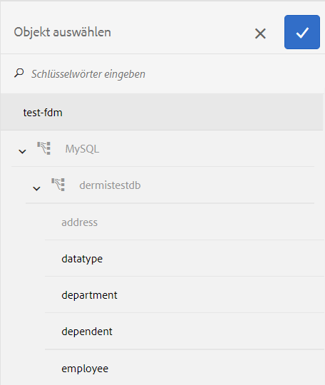

1. Erweitern Sie die Datenquellenstruktur, wählen Sie ein Datenmodellobjekt aus, an das Sie eine Bindung vornehmen möchten, und wählen Sie das Häkchen-Symbol aus.
1. Auswählen **[!UICONTROL Fertig]** , um die Eigenschaften zu speichern, und wählen Sie dann **[!UICONTROL Speichern]** , um das Formulardatenmodell zu speichern. Das Datenmodellobjekt ist jetzt an eine Datenquelle gebunden. Beachten Sie, dass das Datenmodellobjekt nicht mehr als ungebunden markiert ist.

   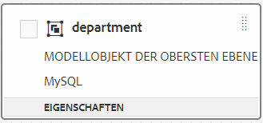

## Konfigurieren von Services {#configure-services}

Um Daten für ein Datenmodellobjekt zu lesen und zu schreiben, gehen Sie folgendermaßen vor, um Lese- und Schreib-Services zu konfigurieren:

1. Aktivieren Sie das Kontrollkästchen oben in einem Datenmodellobjekt, um es auszuwählen, und wählen Sie es aus. **[!UICONTROL Eigenschaften bearbeiten]**.

   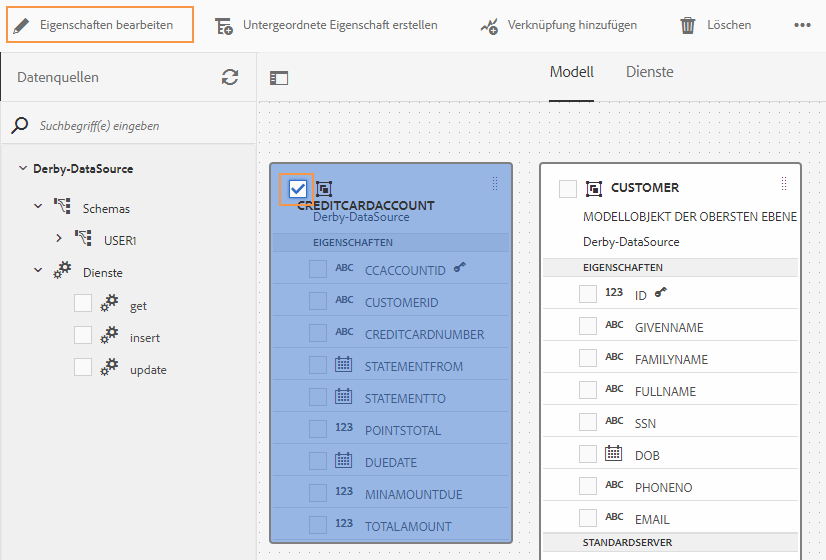

   Bearbeiten von Eigenschaften, um Lese- und Schreib-Services für Datenmodellobjekte zu konfigurieren

   Der Dialog [!UICONTROL Eigenschaften bearbeiten] wird geöffnet.

   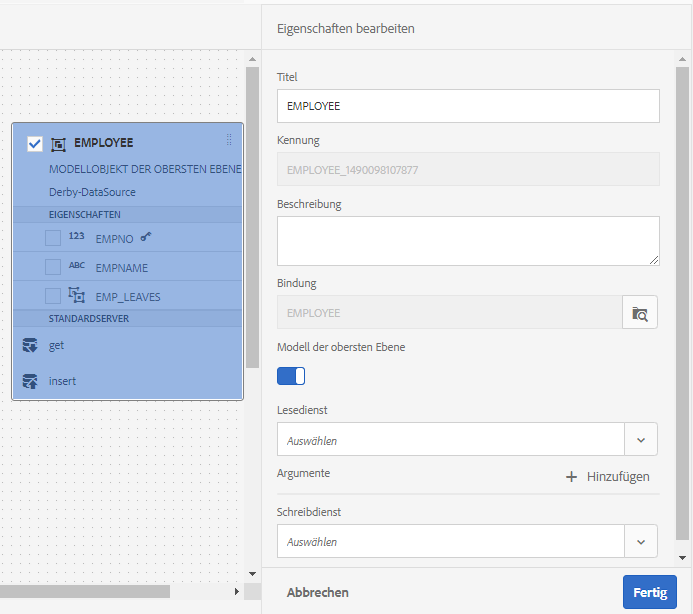

   Dialog „Eigenschaften bearbeiten“

   >[!NOTE]
   >
   >Das OData-Service-Metadatendokument enthält außer den Datenmodellobjekten und Services Navigationseigenschaften, die die Verknüpfung zwischen zwei Datenmodellobjekten definieren. Wenn Sie eine OData-Service-Datenquelle zu einem Formulardatenmodell hinzufügen, steht im Formulardatenmodell ein Service für alle Navigationseigenschaften in einem Datenmodellobjekt zur Verfügung. Mithilfe dieses Service können Sie die Navigationseigenschaften des entsprechenden Datenmodellobjekts lesen.
   >
   >
   >Weitere Informationen zur Verwendung des Service finden Sie unter [Arbeiten mit Navigationseigenschaften von OData-Services](#work-with-navigation-properties-of-odata-services).

1. Schalten Sie **[!UICONTROL Objekt der obersten Ebene]** ein, um anzugeben, ob das Datenmodellobjekt ein Modellobjekt der obersten Ebene ist.

   Datenmodellobjekte, die in einem Formulardatenmodell konfiguriert sind, stehen auf der Registerkarte „Datenmodellobjekte“ im Inhaltsbrowser adaptiver Formulare zur Verfügung, die auf dem Formulardatenmodell basieren. Wenn Sie eine Verknüpfung zwischen zwei Datenmodellobjekten hinzufügen, wird das Ziel-Datenmodellobjekt auf der Registerkarte **[!UICONTROL Datenmodellobjekte]** unter dem Ausgangs-Datenmodellobjekt geschachtelt. Wenn das verschachtelte Datenmodell ein Objekt der obersten Ebene ist, wird es auch separat auf der Registerkarte **[!UICONTROL Datenmodellobjekte]** angezeigt. Daher werden zwei Einträge davon angezeigt, einer innerhalb und einer außerhalb der geschachtelten Hierarchie, was zu Verwirrung bei Formularautoren führen könnte. Damit das zugeordnete Datenmodellobjekt nur in der verschachtelten Hierarchie angezeigt wird, deaktivieren Sie die Eigenschaft „Objekt der obersten Ebene“.

1. Wählen Sie Lese- und Schreib-Services für die ausgewählten Datenmodellobjekte aus. Die Argumente für die Services werden angezeigt.

   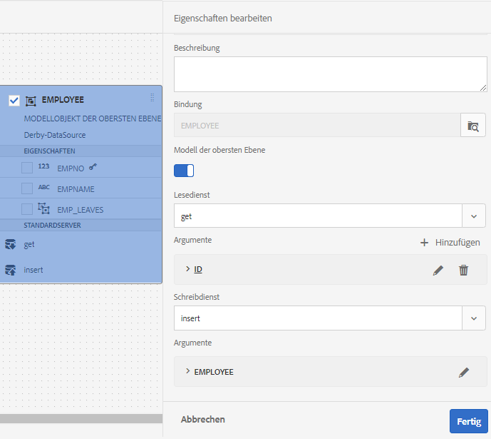

   Für die Mitarbeiterdatenquelle konfigurierte Lese- und Schreib-Services

1. Auswählen  für das Argument des Lesedienstes auf [das Argument an ein Benutzerprofilattribut, Anfrageattribut oder Literalwert binden](#bindargument) und geben Sie den Bindungswert an.
1. Auswählen **[!UICONTROL Fertig]** , um das Argument zu speichern, **[!UICONTROL Fertig]** speichern Sie die Eigenschaften und dann **[!UICONTROL Speichern]** , um das Formulardatenmodell zu speichern.

### Binden von Argumenten des Lese-Service {#bindargument}

Binden Sie das Argument des Lese-Service an ein Benutzerprofilattribut, ein Anforderungsattribut oder einen Literalwert, basierend auf einem Bindungswert. Der Wert wird als Argument an den Service übergeben, um Details abzurufen, die mit dem angegebenen Wert aus der Datenquelle verknüpft sind.

#### Literalwert {#literal-value}

Wählen Sie **[!UICONTROL Literal]** aus dem Dropdownmenü **[!UICONTROL Bindung an]** aus und geben Sie einen Wert in das Feld **[!UICONTROL Bindungswert]** ein. Die mit dem Wert verknüpften Details werden aus der Datenquelle abgerufen. Verwenden Sie diese Option, um Details abzurufen, die mit einem statischen Wert verknüpft sind.

In diesem Beispiel werden die mit **4367655678** als Wert für das `mobilenum`-Argument verknüpften Details aus der Datenquelle abgerufen. Die verknüpften Details können beim Übergeben des Werts für ein Mobilnummerargument Eigenschaften wie Kundennamen, Kundenadresse und Ort enthalten.

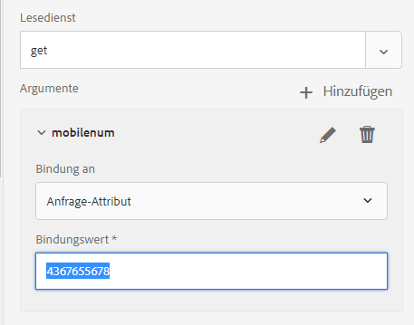

#### Benutzerprofilattribut {#user-profile-attribute}

Wählen Sie **[!UICONTROL Benutzerprofilattribut]** aus dem Dropdownmenü **[!UICONTROL Bindung an]** aus und geben Sie den Attributnamen in das Feld **[!UICONTROL Bindungswert]** ein. Die Details des Benutzers, der bei der [!DNL Experience Manager]-Instanz angemeldet ist, werden auf Grundlage des Attributnamens aus der Datenquelle abgerufen.

Der im Feld **[!UICONTROL Bindungswert]** angegebene Attributname muss den vollständigen Bindungspfad bis zum Attributnamen für den Benutzer enthalten. Öffnen Sie die folgende URL, um auf die Benutzerdetails in CRXDE zuzugreifen:

`https://[server-name]:[port]/crx/de/index.jsp#/home/users/`

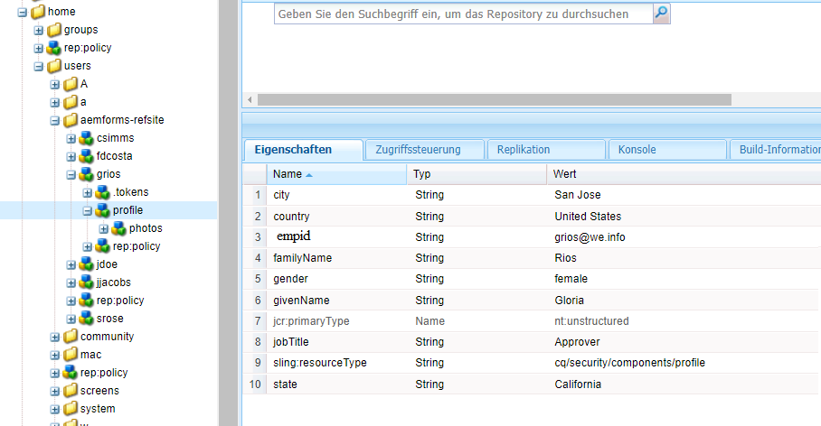

Geben Sie in diesem Beispiel `profile.empid` im Feld **[!UICONTROL Bindungswert]** für den `grios`-Benutzer an.

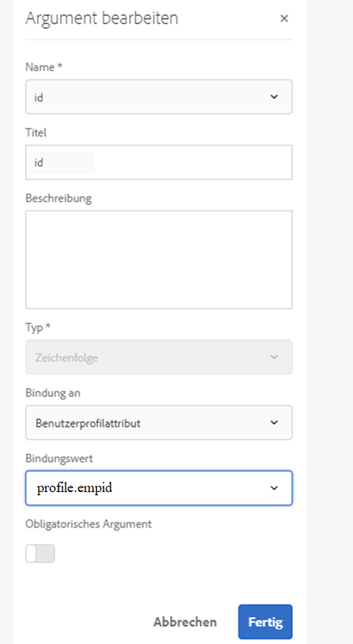

In diesem Beispiel nimmt das Argument `id` den Wert des Attributs `empid` des Benutzerprofils und übergibt ihn als Argument an den Lese-Service. Dieser liest es und gibt Werte der zugehörigen Eigenschaften aus dem Mitarbeiter-Datenmodellobjekt für `empid` zurück, das mit dem angemeldeten Benutzer verknüpft ist.

#### Anforderungsattribut {#request-attribute}

Verwenden Sie das Anforderungsattribut, um die verknüpften Eigenschaften aus der Datenquelle abzurufen.

1. Wählen Sie **[!UICONTROL Anforderungsattribut]** aus dem Dropdownmenü **[!UICONTROL Bindung an]** aus und geben Sie den Attributnamen in das Feld **[!UICONTROL Bindungswert]** ein.

1. Erstellen Sie eine [Überlagerung](https://experienceleague.adobe.com/docs/experience-manager-cloud-service/implementing/developing/full-stack/overlays.html?lang=de#developing) für head.jsp. Um die Überlagerung zu erstellen, öffnen Sie CRX DE und kopieren Sie die Datei `https://<server-name>:<port number>/crx/de/index.jsp#/libs/fd/af/components/page2/afStaticTemplatePage/head.jsp` nach `https://<server-name>:<port number>/crx/de/index.jsp#/apps/fd/af/components/page2/afStaticTemplatePage/head.jsp`.

   >[!NOTE]
   >
   > * Wenn Sie eine statische Vorlage verwenden, überlagern Sie head.jsp unter:
   >   `/libs/fd/af/components/page2/afStaticTemplatePage/head.jsp`
   > * Wenn Sie eine bearbeitbare Vorlage verwenden, überlagern Sie die Datei aftemplatedpage.jsp unter:
   >   `/libs/fd/af/components/page2/aftemplatedpage/aftemplatedpage.jsp`

1. Legen Sie [!DNL paramMap] für das Anforderungsattribut fest. Fügen Sie beispielsweise folgenden Code in die JSP-Datei im Ordner „Apps“ ein:

   ```javascript
   <%Map paraMap = new HashMap();
    paraMap.put("<request_attribute>",request.getParameter("<request_attribute>"));
    request.setAttribute("paramMap",paraMap);
   ```

   Verwenden Sie zum Beispiel folgenden Code, um den Wert von „petid“ aus der Datenquelle abzurufen:


   ```javascript
   <%Map paraMap = new HashMap();
   paraMap.put("petId",request.getParameter("petId"));
   request.setAttribute("paramMap",paraMap);%>
   ```

Die Details werden auf Grundlage des in der Anforderung angegebenen Attributnamens aus der Datenquelle abgerufen.

Wenn Sie beispielsweise das Attribut `petid=100` in der Anforderung angeben, werden Eigenschaften abgerufen, die mit dem Attributwert aus der Datenquelle verknüpft sind.

## Hinzufügen von Verknüpfungen {#add-associations}

In der Regel werden die Datenmodellobjekten in einer Datenquelle mit einander verknüpft. Die Zuordnung kann 1:1 oder 1:n sein. Beispielsweise können einem Mitarbeitenden mehrere abhängige Elemente zugeordnet sein. Dies wird als Eins-zu-Viele-Verknüpfung bezeichnet und in der Form `1:n` auf der Linie dargestellt, die die zugeordneten Datenmodellobjekte verbindet. Wenn jedoch eine Verknüpfung einen eindeutigen Mitarbeiternamen für eine gegebene Mitarbeiter-ID zurückgibt, wird dies als Eins-zu-Eins-Verknüpfung bezeichnet.

Wenn Sie verknüpfte Datenmodellobjekte in einer Datenquelle einem Formulardatenmodell hinzufügen, werden ihre Verknüpfungen beibehalten und mit Pfeillinien verbunden angezeigt. In einem Formulardatenmodell können Sie Verknüpfungen zwischen Datenmodellobjekten über unterschiedliche Datenquellen hinweg hinzufügen.

>[!NOTE]
>
>Vordefinierte Verknüpfungen in einer JDBC-Datenquelle werden im Formulardatenmodell nicht beibehalten. Sie müssen sie manuell erstellen.

So fügen Sie eine Verknüpfung hinzu:

1. Aktivieren Sie das Kontrollkästchen oben in einem Datenmodellobjekt, um es auszuwählen, und wählen Sie es aus. **[!UICONTROL Verknüpfung hinzufügen]**. Das Dialogfeld „Verknüpfung hinzufügen“ wird geöffnet.

   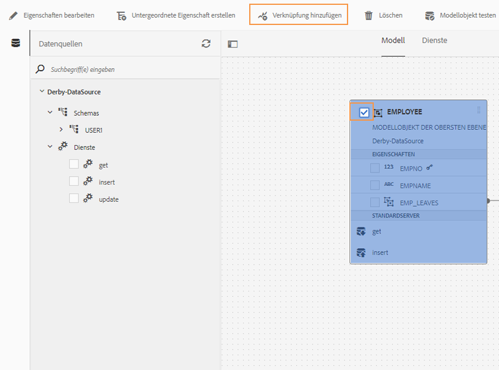

   >[!NOTE]
   >
   >Das OData-Service-Metadatendokument enthält außer den Datenmodellobjekten und Services Navigationseigenschaften, die die Verknüpfung zwischen zwei Datenmodellobjekten definieren. Sie können diese Navigationseigenschaften verwenden, um Verknüpfungen im Formulardatenmodell hinzuzufügen. Weitere Informationen finden Sie unter [Arbeiten mit Navigationseigenschaften von OData-Services](#work-with-navigation-properties-of-odata-services).

   Der Dialog [!UICONTROL Verknüpfung hinzufügen] wird geöffnet.

   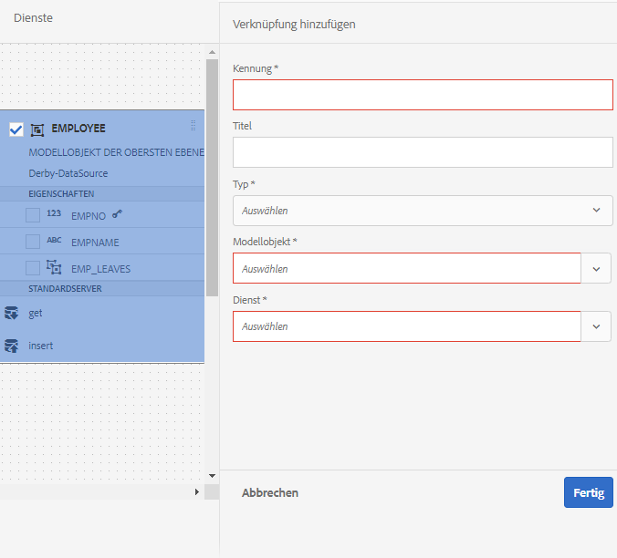

   Dialogfeld „Verknüpfung hinzufügen“

1. Tun Sie Folgendes im Bereich „Verknüpfung hinzufügen“:

   * Geben Sie einen Titel für die Verknüpfung ein.
   * Wählen Sie den Verknüpfungstyp: **[!UICONTROL Eins-zu-Eins]** oder **[!UICONTROL Eins-zu-Viele]**.
   * Wählen Sie das Datenmodellobjekt aus, mit dem verknüpft werden soll.
   * Wählen Sie den Lese-Service, der die Daten aus dem ausgewählten Modellobjekt lesen soll. Das Argument des Lese-Service wird angezeigt. Bearbeiten und ändern Sie das Argument bei Bedarf und binden Sie es an die Eigenschaft des gewünschten Datenmodellobjekts.

   Im folgenden Beispiel ist `dependentid` das Standardargument für den Lese-Service des Datenmodellobjekts „Angehörige“.

   

   Standardargument für den Lese-Service für „Angehörige“ ist „dependentid“

   Das Argument muss allerdings eine mit dem verknüpfenden Datenmodellobjekt gemeinsame Eigenschaft sein, in diesem Beispiel `Employeeid`. Daher muss das Argument `Employeeid` an die Eigenschaft `id` des Mitarbeiter-Datenmodellobjekts gebunden sein, damit die verknüpften Informationen zu Angehörigen aus dem Datenmodellobjekt für Angehörige abgerufen werden können.

   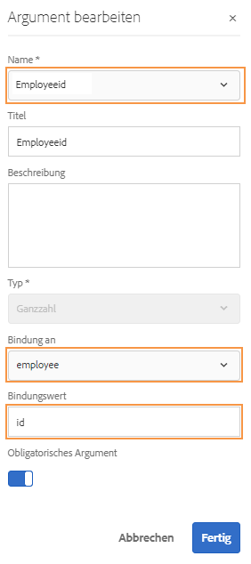

   Aktualisiertes Argument und Bindung

   Auswählen **[!UICONTROL Fertig]** , um das -Argument zu speichern.

1. Auswählen **[!UICONTROL Fertig]** zum Speichern der Zuordnung und dann **[!UICONTROL Speichern]** , um das Formulardatenmodell zu speichern.
1. Wiederholen Sie die Schritte, um nach Bedarf weitere Verknüpfungen zu erstellen.

>[!NOTE]
>
>Die hinzugefügte Verknüpfung wird im Feld „Datenmodellobjekt“ mit dem angegebenen Titel und einer Zeile angezeigt, die die verknüpften Datenmodellobjekte miteinander verbindet.
>
>Sie können eine Zuordnung bearbeiten, indem Sie das entsprechende Kontrollkästchen aktivieren und **[!UICONTROL Verknüpfung bearbeiten]**.

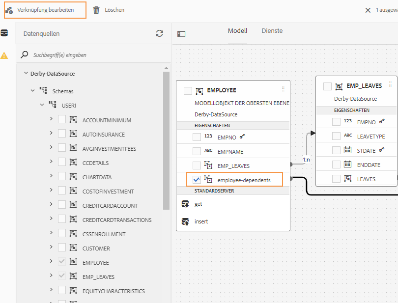

## Bearbeiten von Eigenschaften {#properties}

Sie können Eigenschaften von Datenmodellobjekten, Eigenschaften sowie m Formulardatenmodell hinzugefügte Services bearbeiten.

So bearbeiten Sie Eigenschaften:

1. Aktivieren Sie im Formulardatenmodell das Kontrollkästchen neben einem Datenmodellobjekt, einer Eigenschaft oder einem Service.
1. Auswählen **[!UICONTROL Eigenschaften bearbeiten]**. Der Bereich **[!UICONTROL Eigenschaften bearbeiten]** für das Modellobjekt, die Eigenschaft oder den Service in der Auswahl wird geöffnet.

   * **[!UICONTROL Datenmodellobjekt]**: Geben Sie die Lese- und Schreib-Services an und bearbeiten Sie Argumente.
   * **[!UICONTROL Eigenschaft]**: Geben Sie den Typ, den Untertyp und das Format der Eigenschaft an. Sie können auch angeben, ob die ausgewählte Eigenschaft der Primärschlüssel für das Datenmodellobjekt ist.
   * **[!UICONTROL Service]**: Geben Sie das Eingabemodellobjekt, den Ausgabetyp und Argumente für den Service an. Bei einem Get-Service können Sie angeben, ob ein Array als Rückgabe erwartet wird.

     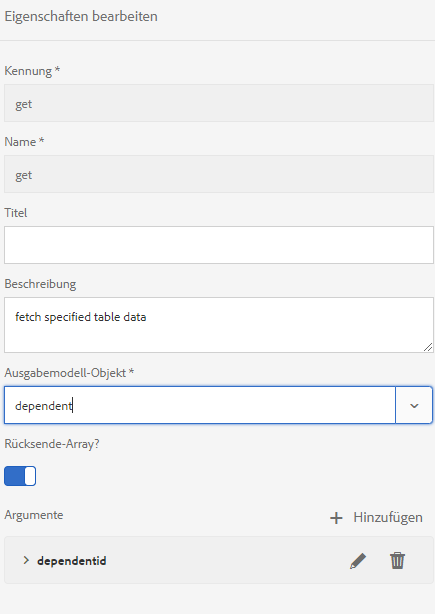

   Dialog „Eigenschaften bearbeiten“ für einen Get-Service

1. Auswählen **[!UICONTROL Fertig]** zum Speichern von Eigenschaften und dann **[!UICONTROL Speichern]** , um das Formulardatenmodell zu speichern.

### Erstellen berechneter Eigenschaften {#computed}

Eine berechnete Eigenschaft ist diejenige, deren Wert anhand einer Regel oder eines Ausdrucks berechnet wird. Mithilfe einer Regel können Sie den Wert einer berechneten Eigenschaft auf ein Zeichenfolgenliteral, eine Zahl, das Ergebnis eines mathematischen Ausdrucks oder den Wert einer anderen Eigenschaft im Formulardatenmodell festlegen.

Beispielsweise können Sie eine berechnete Eigenschaft **FullName** erstellen, deren Wert ein Ergebnis der Verkettung der vorhandenen Eigenschaften **FirstName** und **LastName** ist. Gehen Sie dazu wie folgt vor:

1. Erstellen Sie eine neue Eigenschaft mit dem Namen `FullName`, deren Datentyp „Zeichenfolge“ ist.
1. Aktivieren **[!UICONTROL Berechnet]** und wählen **[!UICONTROL Fertig]** , um die Eigenschaft zu erstellen.

   

   Die berechnete FullName-Eigenschaft wird erstellt. Beachten Sie, dass das Symbol neben der Eigenschaft darstellt, dass es sich um eine berechnete Eigenschaft handelt.

   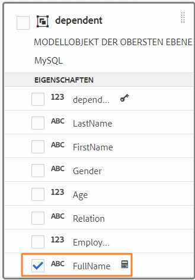

1. Wählen Sie die FullName-Eigenschaft aus und wählen Sie **[!UICONTROL Regel bearbeiten]**. Das Fenster „Regeleditor“ wird geöffnet.
1. Wählen Sie im Fenster des Regeleditors die Option **[!UICONTROL Erstellen]**. Ein Regelfenster **[!UICONTROL Wert festlegen]** wird geöffnet.

   Wählen Sie in der Dropdownliste **[!UICONTROL Mathematischer Ausdruck]**. Weitere verfügbare Optionen sind **[!UICONTROL Formulardatenmodellobjekt]** und **[!UICONTROL Zeichenfolge]**.

1. Wählen Sie im mathematischen Ausdruck **[!UICONTROL FirstName]** und **[!UICONTROL LastName]** als erstes bzw. zweites Objekt aus. Wählen Sie **[!UICONTROL plus]** als Operator.

   Auswählen **[!UICONTROL Fertig]** und wählen Sie **[!UICONTROL Schließen]** , um das Fenster des Regeleditors zu schließen. Die Regel sieht ähnlich der Folgenden aus:

   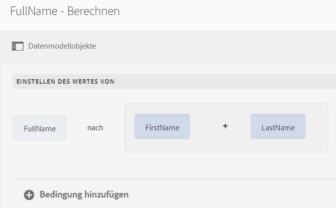

1. Wählen Sie im Formulardatenmodell **[!UICONTROL Speichern]**. Die berechnete Eigenschaft wird konfiguriert.

## Arbeiten mit Navigationseigenschaften von OData-Services {#work-with-navigation-properties-of-odata-services}

In OData-Services werden Navigationseigenschaften verwendet, um Zuordnungen zwischen zwei Datenmodellobjekten zu definieren. Diese Eigenschaften werden für einen Entitätstyp oder einen komplexen Typ definiert. So enthält beispielsweise im folgenden Extract aus der Metadatendatei der [TripPin](https://www.odata.org/blog/trippin-new-odata-v4-sample-service/)-OData-Beispiel-Services die Entität „Person“ drei Navigationseigenschaften: „Friends“, „BestFriend“ und „Trips“.

Weitere Informationen zu Navigationseigenschaften finden Sie in der [OData-Dokumentation](https://docs.oasis-open.org/odata/odata/v4.0/errata03/os/complete/part3-csdl/odata-v4.0-errata03-os-part3-csdl-complete.html#_Toc453752536).

```xml
<edmx:Edmx xmlns:edmx="https://docs.oasis-open.org/odata/ns/edmx" Version="4.0">
<script/>
<edmx:DataServices>
<Schema xmlns="https://docs.oasis-open.org/odata/ns/edm" Namespace="Microsoft.OData.Service.Sample.TrippinInMemory.Models">
<EntityType Name="Person">
<Key>
<PropertyRef Name="UserName"/>
</Key>
<Property Name="UserName" Type="Edm.String" Nullable="false"/>
<Property Name="FirstName" Type="Edm.String" Nullable="false"/>
<Property Name="LastName" Type="Edm.String"/>
<Property Name="MiddleName" Type="Edm.String"/>
<Property Name="Gender" Type="Microsoft.OData.Service.Sample.TrippinInMemory.Models.PersonGender" Nullable="false"/>
<Property Name="Age" Type="Edm.Int64"/>
<Property Name="Emails" Type="Collection(Edm.String)"/>
<Property Name="AddressInfo" Type="Collection(Microsoft.OData.Service.Sample.TrippinInMemory.Models.Location)"/>
<Property Name="HomeAddress" Type="Microsoft.OData.Service.Sample.TrippinInMemory.Models.Location"/>
<Property Name="FavoriteFeature" Type="Microsoft.OData.Service.Sample.TrippinInMemory.Models.Feature" Nullable="false"/>
<Property Name="Features" Type="Collection(Microsoft.OData.Service.Sample.TrippinInMemory.Models.Feature)" Nullable="false"/>
<NavigationProperty Name="Friends" Type="Collection(Microsoft.OData.Service.Sample.TrippinInMemory.Models.Person)"/>
<NavigationProperty Name="BestFriend" Type="Microsoft.OData.Service.Sample.TrippinInMemory.Models.Person"/>
<NavigationProperty Name="Trips" Type="Collection(Microsoft.OData.Service.Sample.TrippinInMemory.Models.Trip)"/>
</EntityType>
```

Wenn Sie einen OData-Service in einem Formulardatenmodell konfigurieren, werden alle Navigationseigenschaften in einem Entitäten-Container über einen Service im Formulardatenmodell bereitgestellt. In diesem Beispiel können im OData-Service „TripPin“ die drei Navigationseigenschaften des Entitäten-Containers `Person` über ein und denselben `GET LINK`-Service im Formulardatenmodell gelesen werden.

Im Folgenden wird der Service `GET LINK of Person /People` im Formulardatenmodell hervorgehoben. Dies ist ein kombinierter Service für die drei Navigationseigenschaften in der Entität `Person` des OData-Service „TripPin“.

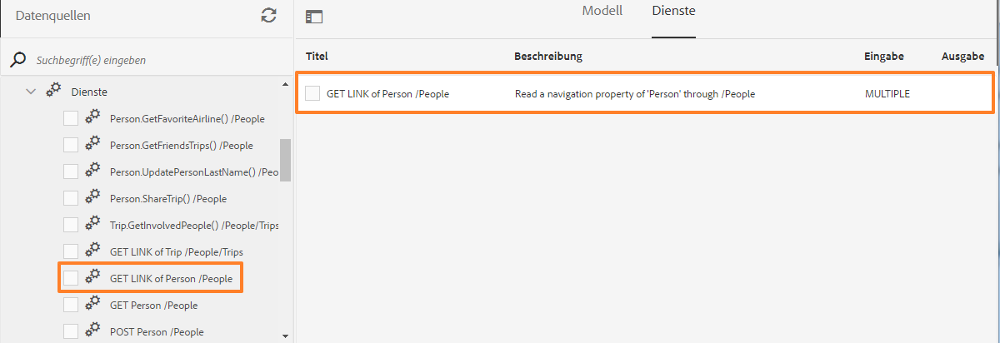

Sobald Sie den `GET LINK`-Service auf der Registerkarte „Services“ im Formulardatenmodell hinzufügen, können Sie die Eigenschaften bearbeiten, um das Modellobjekt für die Ausgabe und die im Service zu verwendende Navigationseigenschaft zu wählen. Im folgenden Beispiel nutzt der Service `GET LINK of Person /People` die Angabe „Trip“ als Ausgabemodellobjekt und die Navigationseigenschaft als „Trips“.

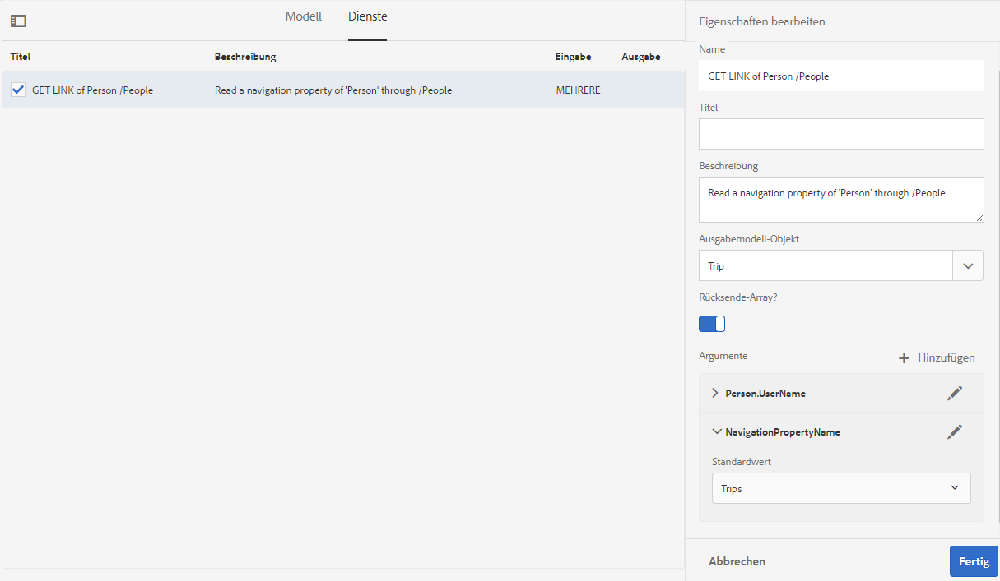

>[!NOTE]
>
>Die im Feld **[!UICONTROL Standardwert]** des Arguments **NavigationPropertyName** verfügbaren Werte hängen vom Status des Schalters **[!UICONTROL Rückgabe-Array?]** ab. Wenn er aktiviert ist, werden die Navigationseigenschaften des Sammlungstyps angezeigt.

In diesem Beispiel können Sie auch „Person“ als Ausgabemodellobjekt und als Argument für die Navigationseigenschaft „Friends“ oder „BestFriend“ wählen (abhängig davon, ob **[!UICONTROL Rückgabe-Array?]** aktiviert oder deaktiviert ist).

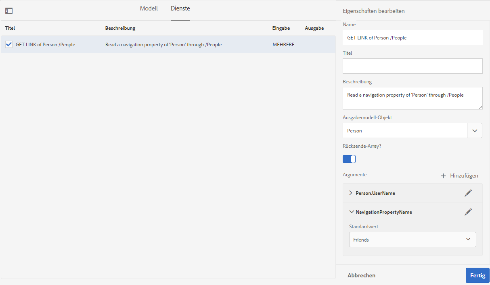

Darüber hinaus können Sie beim Hinzufügen von Verknüpfungen im Formulardatenmodell einen `GET LINK`-Service auswählen und die entsprechenden Navigationseigenschaften konfigurieren. Damit eine Navigationseigenschaft ausgewählt werden kann, müssen Sie jedoch darauf achten, dass im Feld **[!UICONTROL Bindung an]** der Wert **[!UICONTROL Literal]** eingestellt ist.

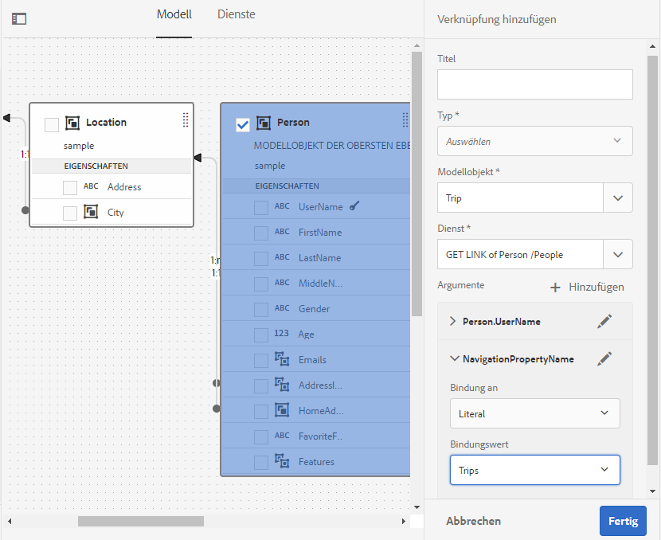

## Beispieldaten generieren und bearbeiten {#sample}

Mit dem Formulardatenmodelleditor können Sie Beispieldaten für alle Datenmodellobjekt-Eigenschaften, einschließlich berechneter Eigenschaften, in einem Formulardatenmodell generieren. Es handelt sich um einen Satz zufälliger Werte, die dem für jede Eigenschaft konfigurierten Datentyp entsprechen. Sie können auch Daten bearbeiten und speichern, die auch dann beibehalten werden, wenn Sie die Beispieldaten neu generieren.

Gehen Sie wie folgt vor, um Beispieldaten zu generieren und zu bearbeiten:

1. Öffnen Sie ein Formulardatenmodell und wählen Sie **[!UICONTROL Beispieldaten bearbeiten]**. Es werden Beispieldaten im Fenster „Beispieldaten bearbeiten“ generiert und angezeigt.

   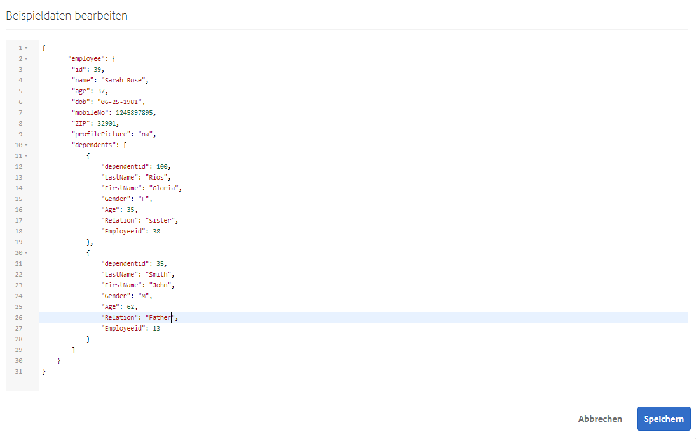

1. In **[!UICONTROL Beispieldaten bearbeiten]** , bearbeiten Sie die Daten nach Bedarf und wählen Sie **[!UICONTROL Speichern]**.

<!--Next, you can use the sample data to prefill and test interactive communications based on the form data model. For more information, see [Use form data model](using-form-data-model.md).-->

## Testen von Datenmodellobjekten und Services {#test-data-model-objects-and-services}

Ihr Formulardatenmodell ist konfiguriert. Bevor Sie es verwenden, sollten Sie jedoch testen, ob die konfigurierten Datenmodellobjekte und Services erwartungsgemäß funktionieren. Testen von Datenmodellobjekten und Services

1. Wählen Sie ein Datenmodellobjekt oder einen Dienst im Formulardatenmodell aus und wählen Sie **[!UICONTROL Testmodell-Objekt]** oder **[!UICONTROL Testdienst]**, bzw.

   Das Fenster „Formulardatenmodell testen“ wird geöffnet.

   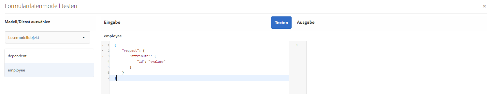

1. Wählen Sie im Fenster [!UICONTROL Formulardatenmodell testen] unter „Eingabe“ das zu testende Datenmodellobjekt bzw. den Service.

1. Geben Sie einen Argumentwert im Testcode an und wählen Sie **[!UICONTROL Test]**. Ist der Test erfolgreich, wird die Ausgabe im Bereich „Ausgabe“ angezeigt.

   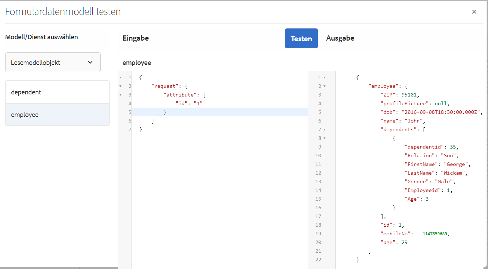

Auf ähnliche Weise können Sie andere Datenmodellobjekte und Service im Formulardatenmodell testen.

## Automatisiertes Validieren von Eingabedaten {#automated-validation-of-input-data}

Das Formulardatenmodell validiert Daten, die als Eingabe beim Aufruf der DermisBridge-API empfangen werden (auf Grundlage der im Formulardatenmodell verfügbaren Validierungskriterien). Die Validierung basiert auf dem Flag-Satz `ValidationOptions` im Abfrageobjekt, das zum Aufrufen der API verwendet wird.

Das Flag kann auf einen der folgenden Werte eingestellt werden:

* **VOLLSTÄNDIG**: FDM führt die Validierung anhand aller Begrenzungen durch
* **OFF**: Keine Validierung
* **EINFACH**: FDM führt die Validierung anhand der Begrenzungen „erforderlich“ und „löschbar“ durch

Wenn für das `ValidationOptions`-Flag kein Wert festgelegt ist, wird für die Eingabedaten eine **EINFACH**-Validierung durchgeführt.

Folgendes Beispiel zeigt, was passiert, wenn Sie für das Validierungs-Flag **VOLLSTÄNDIG** einstellen:

```java
operationOptions.setValidationOptions(ValidationOptions.FULL);
```

>[!NOTE]
>
>Der Wert, den Sie für ein Attribut in den Eingabedaten angeben, muss mit dem Datentyp übereinstimmen, der für das Attribut im Metadatendokument definiert ist.\
>Wenn der Wert nicht mit dem für das Attribut definierten Datentyp übereinstimmt, zeigt die DermisBridge-API eine Ausnahme an, unabhängig vom Wert des `ValidationOptions`-Flags. Wenn als Protokollebene „Debuggen“ festgelegt ist, wird ein Fehler in der Datei **error.log** protokolliert.

Das Formulardatenmodell validiert Eingabedaten auf Grundlage einer Liste von Datentypbegrenzungen. Die Liste von Begrenzungen für Eingabedaten kann je nach Datenquelle variieren.

In folgender Tabelle sind die Begrenzungen für Eingabedaten auf Grundlage der Datenquelle aufgeführt:

<table>
 <tbody> 
  <tr> 
   <td>Begrenzungen</td> 
   <td>Beschreibung</td> 
   <td>Eingabedatenquelle</td> 
  </tr> 
  <tr> 
   <td>required</td> 
   <td>Bei Wert „true“ muss der Parameter in die Eingabedaten aufgenommen werden.</td> 
   <td>Swagger, WSDL und Datenbank</td> 
  </tr> 
  <tr> 
   <td>nullable</td> 
   <td>Bei Wert „true“ kann der Wert für den Parameter in den Eingabedaten auf Null gesetzt werden.</td> 
   <td>WSDL, OData und Datenbank</td> 
  </tr> 
  <tr> 
   <td>maximum</td> 
   <td>Gibt die Obergrenze für numerische Werte an. Der als Obergrenze angegebene Wert kann auch dem Parameter in den Eingabedaten zugewiesen werden.</td> 
   <td>Swagger und WSDL</td> 
  </tr> 
  <tr> 
   <td>minimum</td> 
   <td>Gibt die Untergrenze für numerische Werte an. Der als Untergrenze angegebene Wert kann auch dem Parameter in den Eingabedaten zugewiesen werden.</td> 
   <td>Swagger und WSDL</td> 
  </tr> 
  <tr> 
   <td>exclusiveMaximum</td> 
   <td>Gibt die Obergrenze für numerische Werte an. Der als Obergrenze angegebene Wert darf nicht dem Parameter in den Eingabedaten zugewiesen werden.</td> 
   <td>Swagger und WSDL</td> 
  </tr> 
  <tr> 
   <td>exclusiveMinimum</td> 
   <td>Gibt die Untergrenze für numerische Werte an. Der als Untergrenze angegebene Mindestwert darf nicht dem Parameter in den Eingabedaten zugewiesen werden.</td> 
   <td>Swagger und WSDL</td> 
  </tr> 
  <tr> 
   <td>minLength</td> 
   <td>Gibt die Untergrenze für die Anzahl der Zeichen in einer Zeichenfolge an. Der als Untergrenze angegebene Wert kann auch dem Parameter in den Eingabedaten zugewiesen werden.</td> 
   <td>Swagger und WSDL</td> 
  </tr> 
  <tr> 
   <td>maxLength</td> 
   <td>Gibt die Obergrenze für die Anzahl der Zeichen in einer Zeichenfolge an. Der als Obergrenze angegebene Wert kann auch dem Parameter in den Eingabedaten zugewiesen werden.</td> 
   <td>Swagger, WSDL, OData und Datenbank</td> 
  </tr> 
  <tr> 
   <td>pattern</td> 
   <td>Gibt eine feste Sequenz an Zeichen an. Die Eingabezeichenfolge wird nur dann erfolgreich validiert, wenn die Zeichen dem angegebenen Muster entsprechen.</td> 
   <td>Swagger</td> 
  </tr> 
  <tr> 
   <td>minItems</td> 
   <td>Gibt die Mindestanzahl von Elementen in einem Array an. Der als Untergrenze angegebene Wert kann auch dem Parameter in den Eingabedaten zugewiesen werden.</td> 
   <td>Swagger und WSDL</td> 
  </tr> 
  <tr> 
   <td>maxItems</td> 
   <td>Gibt die maximale Anzahl von Elementen in einem Array an. Der als Obergrenze angegebene Wert kann auch dem Parameter in den Eingabedaten zugewiesen werden.</td> 
   <td>Swagger und WSDL</td> 
  </tr> 
  <tr> 
   <td>uniqueItems</td> 
   <td>Bei Wert „true“ müssen alle Elemente des Arrays in den Eingabedaten eindeutig sein.</td> 
   <td>Swagger</td> 
  </tr> 
  <tr> 
   <td>enum (string)<br /> <br /> </td> 
   <td>Beschränkt den Wert eines Parameters in den Eingabedaten auf einen festen Satz von Zeichenfolgewerten. Es muss sich um ein Array mit mindestens einem Element handeln, wobei jedes Element eindeutig ist.</td> 
   <td>Swagger, WSDL und OData</td> 
  </tr> 
  <tr> 
   <td>enum (number)<br /> <br /> </td> 
   <td>Beschränkt den Wert eines Parameters in den Eingabedaten auf einen festen Satz numerischer Werte. Es muss sich um ein Array mit mindestens einem Element handeln, wobei jedes Element eindeutig ist.</td> 
   <td>WSDL</td> 
  </tr> 
 </tbody> 
</table>

In diesem Beispiel werden die Eingabedaten anhand der in der Swagger-Datei definierten Begrenzungen „maximum“, „minimum“ und „required“ validiert. Die Eingabedaten erfüllen die Validierungskriterien nur, wenn die Bestellnummer vorhanden ist und einen Wert von 1 bis 10 hat.

```json
   parameters: [
   {
   name: "orderId",
   in: "path",
   description: "ID of pet that must be fetched",
   required: true,
   type: "integer",
   maximum: 10,
   minimum: 1,
   format: "int64"
   }
   ]
```

Eine Ausnahme wird angezeigt, wenn die Eingabedaten die Validierungskriterien nicht erfüllen. Wenn als Protokollebene **Debuggen** festgelegt ist, wird ein Fehler in der Datei **error.log** protokolliert. Beispiel:

```verilog
21.01.2019 17:26:37.411 *ERROR* com.adobe.aem.dermis.core.validation.JsonSchemaValidator {"errorCode":"AEM-FDM-001-044","errorMessage":"Input validations failed during operation execution.","violations":{"/orderId":["numeric instance is greater than the required maximum (maximum: 10, found: 16)"]}}
```

## Nächste Schritte {#next-steps}

Sie haben ein funktionierendes Formulardatenmodell, das jetzt für die Verwendung in Workflows für adaptive Formulare <!--and interactive communications--> bereit ist. Weitere Informationen finden Sie unter [Verwenden eines Formulardatenmodells](using-form-data-model.md).
