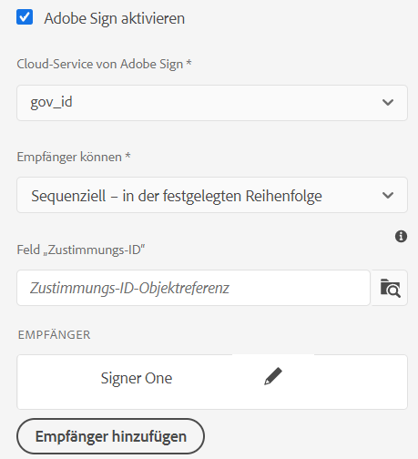
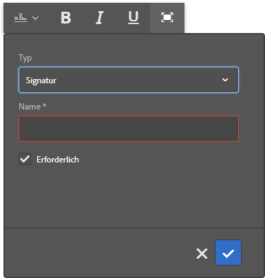
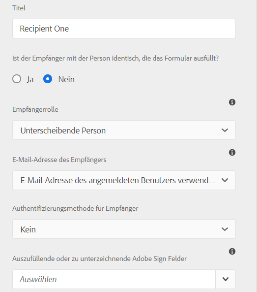
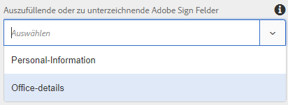
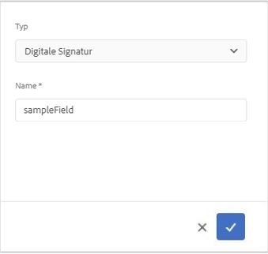

# Verwenden von [!DNL Adobe Sign] in einem adaptiven Formular {#using-adobe-sign-in-an-adaptive-form}

>[!NOTE]
>
> Adobe empfiehlt, die modernen und erweiterbaren [Kernkomponenten](https://experienceleague.adobe.com/docs/experience-manager-core-components/using/adaptive-forms/introduction.html?lang=de) für die Datenerfassung zu verwenden, um [neue adaptive Formulare zu erstellen](/help/forms/creating-adaptive-form-core-components.md) oder [adaptive Formulare zu AEM Sites-Seiten hinzuzufügen](/help/forms/create-or-add-an-adaptive-form-to-aem-sites-page.md). Diese Komponenten stellen einen bedeutenden Fortschritt bei der Erstellung adaptiver Formulare dar und sorgen für beeindruckende Anwendererlebnisse. In diesem Artikel wird der ältere Ansatz zum Erstellen von adaptiven Formularen mithilfe von Foundation-Komponenten beschrieben.


| Version | Artikel-Link |
| -------- | ---------------------------- |
| AEM 6.5 | [Hier klicken](https://experienceleague.adobe.com/docs/experience-manager-65/forms/adaptive-forms-advanced-authoring/working-with-adobe-sign.html?lang=de) |
| AEM as a Cloud Service | Dieser Artikel |


[!DNL Adobe Sign] Aktiviert E-Signatur-Workflows für adaptive Formulare. E-Signaturen verbessern die Workflows bei der Verarbeitung von Dokumenten in den Bereichen Recht, Vertrieb, Gehaltsabrechnung, Personalverwaltung u. a.

In einem typischen Szenario mit [!DNL Adobe Sign] und adaptiven Formularen füllt ein Benutzer ein adaptives Formular aus, um einen Service zu beantragen, für den Signaturen von mindestens einer Partei erforderlich sind. Beispielsweise sind für einen Hypotheken- und Kreditkartenantrag rechtskräftige Signaturen von allen Kreditnehmern und Mitantragstellern erforderlich. Um elektronische Signatur-Workflows für ähnliche Szenarien zu aktivieren, können Sie [!DNL Adobe Sign] in ein adaptives Formular integrieren. Einige weitere Anwendungsbeispiele für [!DNL Adobe Sign] sind:

* Geschäftsabschlüsse von jedem Gerät aus mit vollautomatischen Prozessen für Vorschlag, Angebot und Vertrag.
* Schnelleres Abschließen von Prozessen im Personalwesen und Zugang zu digitalen Abläufen für Ihre Mitarbeitenden.
* Kürzere Vertragszyklen und schnelleres Onboarding Ihrer Lieferanten.
* Erstellen digitaler Workflows zur Automatisierung häufig verwendeter Prozesse.

Die Integration von [!DNL Adobe Sign] mit [!DNL AEM Forms] unterstützt folgende Funktionen:

* Workflows für Signaturen eines einzelnen oder mehrerer Benutzer
* Workflows mit sequenzieller und simultaner Signatur
* Signieren von Formularen als anonymer oder angemeldeter Benutzer
* Dynamische Signaturvorgänge (Integration mit [!DNL AEM Forms]-Workflow)
* Authentifizierung über eine Wissensdatenbank, Telefon, Social Media und mit einem amtlichen Lichtbildausweis
* Weisen Sie den einzelnen Empfängern der Vereinbarung Rollen zu. Die Service-Level von Adobe Sign für Unternehmen bieten die Möglichkeit, die [Rollen für Empfänger von Vereinbarungen](#addsignerstoanadaptiveform) zu erweitern.

<!-- * In-form and out-of-form signing experiences -->

## Voraussetzungen {#prerequisites}

Stellen Sie sicher, dass folgende Voraussetzungen erfüllt sind, bevor Sie [!DNL Adobe Sign] in einem adaptiven Formular verwenden:

* Stellen Sie sicher, dass [!DNL AEM Forms] as a Cloud Service für die Verwendung von Adobe Sign konfiguriert ist. Weitere Informationen finden Sie unter [Integrieren von Adobe Sign mit [!DNL AEM Forms]](adobe-sign-integration-adaptive-forms.md).
* Halten Sie die Liste der Empfänger bereit. Sie benötigen mindestens eine E-Mail-Adresse für jeden Empfänger.

## Konfigurieren von [!DNL Adobe Sign] für adaptive Formulare {#configure-adobe-sign-for-an-adaptive-form}

Konfigurieren von [!DNL Adobe Sign] für ein adaptives Formular:

1. [Aktivieren von [!DNL Adobe Sign] für ein adaptives Formular](#enableadobsignforanadaptiveform)
1. [Hinzufügen von  [!DNL Adobe Sign] -Feldern zu einem adaptiven Formular](#addadobesignfieldstoanadaptiveform)
1. [Auswahl von [!DNL Adobe Sign] as a Cloud Service für ein adaptives Formular](#select-adobe-sign-cloud-service-and-signing-order)

1. [Hinzufügen eines [!DNL Adobe Sign] -Empfängers zu einem adaptiven Formular](#addsignerstoanadaptiveform)
1. [Übermittlungsaktion für ein adaptives Formular auswählen](#selectsubmitactionforanadaptiveform)



### Aktivieren von [!DNL Adobe Sign] für ein adaptives Formular  {#enableadobesign}

Sie können [!DNL Adobe Sign] für ein vorhandenes adaptives Formular aktivieren oder ein [!DNL Adobe Sign]-fähiges adaptives Formular erstellen. Wählen Sie eine der folgenden Möglichkeiten:

* [Ein  [!DNL Adobe Sign] -fähiges adaptives Formular erstellen](#create-an-adaptive-form-for-adobe-sign)
* [ [!DNL Adobe Sign]  für ein vorhandenes adaptives Formular aktivieren](#editafsign).

#### Erstellen eines adaptiven Formulars für Adobe Sign {#create-an-adaptive-form-for-adobe-sign}

Erstellen eines signaturfähigen adaptiven Formulars:

1. Gehen Sie zu **[!UICONTROL Adobe Experience Manager]** > **[!UICONTROL Formulare]** > **[!UICONTROL Formulare und Dokumente]**.
1. Wählen Sie **[!UICONTROL Erstellen]** und dann **[!UICONTROL Adaptives Formular]** aus. Eine Liste von Vorlagen wird angezeigt. Wählen Sie eine Vorlage aus und dann **[!UICONTROL Weiter]**.
1. Auf der Registerkarte **[!UICONTROL Standard]**:

   1. Geben Sie **[!UICONTROL Name]** und **[!UICONTROL Titel]** für das adaptive Formular an.

   1. Wählen Sie den [Konfigurations-Container](adobe-sign-integration-adaptive-forms.md#configure-adobe-sign-with-aem-forms) aus, der bei der [Integration von [!DNL Adobe Sign] in [!DNL AEM Forms]](adobe-sign-integration-adaptive-forms.md) erstellt wurde.

   Der Konfigurations-Container enthält die für Ihre Umgebung konfigurierten [!DNL Adobe Sign]-Cloud Services. Diese Services stehen im Editor für adaptive Formulare zur Auswahl.

1. Wählen Sie auf der Registerkarte **[!UICONTROL Formularmodell]** eine der folgenden Optionen:

   * Wenn Sie über eine benutzerdefinierte Formularvorlage verfügen und ein Datensatzdokument auf Grundlage der Formularvorlage benötigen, wählen Sie die Option **[!UICONTROL Formularvorlage als Vorlage für das Datensatzdokument zuordnen]** und wählen Sie eine Datensatzdokumentvorlage aus. Wenn Sie diese Option verwenden, zeigen die zum Signieren gesendeten Dokumente nur die Felder an, die auf der zugehörigen Formularvorlage basieren. Es werden nicht alle Felder des adaptiven Formulars angezeigt.

   * Wenn Sie keine benutzerdefinierte Formularvorlage haben, wählen Sie die Option **[!UICONTROL Datensatzdokument erzeugen]**. Wenn Sie diese Option verwenden, zeigt das zum Signieren gesendete Dokument alle Felder des adaptiven Formulars an.

1. Wählen Sie **[!UICONTROL Erstellen]**. Es wird ein signaturfähiges adaptives Formular erstellt. Sie können Ihre [!DNL Adobe Sign]-Felder zum Formular hinzufügen und dieses zum Signieren senden.

#### Aktivieren von [!DNL Adobe Sign] für ein adaptives Formular {#editafsign}

Verwenden von [!DNL Adobe Sign] in einem vorhandenen adaptiven Formular:

1. Gehen Sie zu **[!UICONTROL Adobe Experience Manager]** > **[!UICONTROL Forms]** > **[!UICONTROL Formulare und Dokumente]**.
1. Wählen Sie das adaptive Formular aus und wählen Sie dann **[!UICONTROL Eigenschaften]**.
1. Wählen Sie auf der Registerkarte **[!UICONTROL Standard]** den [Konfigurations-Container](adobe-sign-integration-adaptive-forms.md#configure-adobe-sign-with-aem-forms) aus, der bei der Integration von [!DNL Adobe Sign] in [!DNL AEM Forms] erstellt wurde.
1. Wählen Sie auf der Registerkarte **[!UICONTROL Formularmodus]** eine der folgenden Optionen aus:

   * Wenn Sie über eine benutzerdefinierte Formularvorlage verfügen und ein Datensatzdokument auf Grundlage der Formularvorlage benötigen, wählen Sie die Option **[!UICONTROL Formularvorlage als Vorlage für das Datensatzdokument zuordnen]** und wählen Sie eine Datensatzdokumentvorlage aus. Wenn Sie diese Option verwenden, zeigen die zum Signieren gesendeten Dokumente nur die Felder an, die auf der zugehörigen Formularvorlage basieren. Es werden nicht alle Felder des adaptiven Formulars angezeigt.

   * Wenn Sie keine benutzerdefinierte Formularvorlage haben, wählen Sie die Option **[!UICONTROL Datensatzdokument erzeugen]**. Wenn Sie diese Option verwenden, zeigt das zum Signieren gesendete Dokument alle Felder des adaptiven Formulars an.

1. Wählen Sie **[!UICONTROL Speichern und schließen]**. Das adaptive Formular ist für [!DNL Adobe Sign] aktiviert. Jetzt können Sie Ihre [!DNL Adobe Sign]-Felder zum Formular hinzufügen und dieses zum Signieren senden.

### Hinzufügen von [!DNL Adobe Sign]-Feldern zu einem adaptiven Formular {#addadobesignfieldstoanadaptiveform}

[!DNL Adobe Sign] verfügt über verschiedene Felder, die in einem adaptiven Formular platziert werden können. In diese Felder können verschiedene Datentypen wie Signaturen, Initialen, Firma oder Titel eingegeben werden. Sie helfen dabei, beim Signieren zusätzliche Informationen zusammen mit den Signaturen zu erfassen. Sie können die [!DNL Adobe Sign]-Blockkomponente verwenden, um [!DNL Adobe Sign]-Felder an verschiedenen Stellen in einem adaptiven Formular zu platzieren.

Gehen Sie wie folgt vor, um einem adaptiven Formular Felder hinzuzufügen und eine Reihe von Optionen für diese Felder anzupassen:

1. Ziehen Sie die Komponente **[!UICONTROL Adobe Sign-Block]** aus dem Komponentenbrowser in das adaptive Formular und legen Sie sie dort ab. Die Komponente [!DNL Adobe Sign]-Block verfügt über alle unterstützten [!DNL Adobe Sign]-Felder. Standardmäßig fügt sie dem adaptiven Formular ein **[!UICONTROL Signatur]**-Feld hinzu.

   

   Standardmäßig ist der [!DNL Adobe Sign]-Block im veröffentlichten adaptiven Formular nicht sichtbar. Er wird nur in den Signaturdokumenten angezeigt. Sie können die Sichtbarkeit des [!DNL Adobe Sign]-Blocks in den Eigenschaften der [!DNL Adobe Sign]-Blockkomponente ändern.

   >[!NOTE]
   >
   >  * Die Verwendung des [!DNL Adobe Sign]-Blocks ist nicht zwingend erforderlich, um [!DNL Adobe Sign] in einem adaptiven Formular zu verwenden. Wenn Sie den [!DNL Adobe Sign]-Block nicht verwenden und Felder für die Empfänger hinzufügen, wird das Standardsignaturfeld unten in den Signaturdokumenten angezeigt.
   >  * Verwenden Sie den [!DNL Adobe Sign]-Block nur für adaptive Formulare, die automatisch ein Datensatzdokument generieren. Wenn Sie das Datensatzdokument mithilfe einer benutzerdefinierten XDP-Datei generieren oder ein formularvorlagenbasiertes adaptives Formular verwenden, wird der [!DNL Adobe Sign]-Block nicht unterstützt.


1. Wählen Sie die Komponente **[!UICONTROL Adobe Sign-Block]** aus und wählen Sie dann das Symbol **[!UICONTROL Bearbeiten]** (). Es werden Optionen zum Hinzufügen von Feldern und zum Formatieren der Darstellung von Feldern angezeigt.

   

   **A.** Wählen Sie [!DNL Adobe Sign]-Felder aus und fügen Sie sie hinzu. **B.** Erweitern Sie den [!DNL Adobe Sign]-Block zur Vollbildansicht.

1. Wählen Sie auf dem Feld **[!UICONTROL Adobe Sign]** das Symbol . Es zeigt Optionen zum Auswählen und Hinzufügen von [!DNL Adobe Sign]-Feldern an.

   Erweitern Sie die Dropdown-Liste **[!UICONTROL Typ]**, wählen Sie ein [!DNL Adobe Sign]-Feld aus und wählen Sie dann das Symbol „Fertig“ (), um das ausgewählte Feld zum [!DNL Adobe Sign]-Block hinzuzufügen. Die Dropdown-Liste **[!UICONTROL Typ]** enthält die Feldtypen „Signatur“, „Empfängerinformationen“ und „Daten“. Die Integration von [!DNL Adobe Sign] in AEM [!DNL Forms] unterstützt nur die in der Dropdown-Liste [!UICONTROL Typ] angegebenen Felder. Ausführliche Informationen zu [!DNL Adobe Sign]-Feldern finden Sie in der [Adobe Sign-Dokumentation](https://helpx.adobe.com/de/sign/help/field-types.html).

   

   Es ist zwingend erforderlich, einen eindeutigen Namen für ein Feld anzugeben. Sie können auch die Option „Erforderlich“ aktivieren, um ein Feld als Pflichtfeld zu markieren. Zusätzlich zu den Optionen **[!UICONTROL Name]** und **[!UICONTROL Erforderlich]** verfügen einige [!DNL Adobe Sign]-Felder über weitere Optionen. Dies kann z. B. „Maske“ oder „mit mehreren Zeilen“ sein. Geben Sie außerdem eindeutige Namen für die einzelnen [!DNL Adobe Sign]-Felder an, unabhängig davon, ob diese Felder sich im selben oder in verschiedenen [!DNL Adobe Sign]-Blocks befinden.

   Wenn Sie in der Dropdown-Liste **[!UICONTROL Digitale Signatur]** auswählen, können Sie digitale Signaturen auf das adaptive Formular anwenden:

   * Online mit Cloud-Signaturen, um mit einer [digitalen ID](https://helpx.adobe.com/de/sign/kb/digital-certificate-providers.html) zu signieren, die von einem Trust-Dienstleister gehostet wird.
   * Lokal durch Herunterladen des Dokuments mit Adobe Acrobat oder Reader mit einer Smart Card, einem USB-Token oder einer dateibasierten digitalen ID.

### Aktivieren von [!DNL Adobe Sign] für ein adaptives Formular {#enableadobsignforanadaptiveform}

[!DNL Adobe Sign] ist standardmäßig nicht für adaptive Formulare aktiviert. So aktivieren Sie es:

1. Wählen Sie im Inhalts-Browser **[!UICONTROL Formular-Container]** und das Symbol **[!UICONTROL Konfigurieren]**  aus. Dadurch wird der Eigenschaftenbrowser geöffnet, der die Eigenschaften des Containers für adaptive Formulare anzeigt.
1. Erweitern Sie im Eigenschaftenbrowser das Akkordeon **[!UICONTROL Elektronische Signatur]** und wählen Sie die Option **[!UICONTROL Adobe Sign aktivieren]**. Dadurch wird [!DNL Adobe Sign] für ein adaptives Formular aktiviert.

### Auswählen von [!DNL Adobe Sign] as a Cloud Service und der Signaturreihenfolge {#select-adobe-sign-cloud-service-and-signing-order}

Sie können mehrere [!DNL Adobe Sign]-Services für eine Instanz von AEM [!DNL Forms] konfigurieren. Es empfiehlt sich, für jede Funktion (Personalwesen, Finanzen usw.) eine eigene Gruppe von Services zu verwenden. Dies erleichtert das Tracking und die Berichterstellung für signierte Dokumente. So könnte beispielsweise eine Bank mehrere Abteilungen umfassen. In diesem Fall können Sie für jede Abteilung eine eigene Konfiguration einrichten, damit die Dokumente leichter zu verfolgen sind.

Ein Dokument kann auch mehrere Empfänger haben. Beispielsweise können bei einem Kreditkartenantrag mehrere Antragsteller vorhanden sein. Die Bank benötigt die Unterschriften aller Antragsteller, bevor sie mit der Bearbeitung beginnt. Bei Szenarien mit mehreren Empfängern können Sie wählen, ob diese das Dokument nacheinander oder simultan unterschreiben sollen.

So wählen Sie einen Cloud Service und die Signierreihenfolge aus:


1. Wählen Sie im Inhalts-Browser **[!UICONTROL Formular-Container]** und das Symbol **[!UICONTROL Konfigurieren]**  aus. Dadurch wird der Eigenschaftenbrowser geöffnet, der die Eigenschaften des Containers für adaptive Formulare anzeigt.
1. Erweitern Sie im Eigenschaftenbrowser das Akkordeon **[!UICONTROL Elektronische Signatur]** und wählen Sie die Option **[!UICONTROL Adobe Sign aktivieren]**. Dadurch wird [!DNL Adobe Sign] für ein adaptives Formular aktiviert.
1. Wählen Sie einen Cloud Service aus der bereits konfigurierten Liste der [!DNL Adobe Sign]-Cloud Services aus.

   Wenn die Liste **[!UICONTROL Cloud-Service von Adobe Sign]** leer ist, befolgen Sie den Artikel zum [Konfigurieren von [!DNL Adobe Sign] mit [!DNL AEM Forms]](adobe-sign-integration-adaptive-forms.md), um den Service zu konfigurieren.

   Die Dropdown-Liste führt die existierenden Cloud-Services im Ordner `global` unter Werkzeuge > **[!UICONTROL Cloud-Services]** > **[!UICONTROL Adobe Sign]** auf. Darüber hinaus werden in der Dropdown-Liste auch die Cloud-Services aufgeführt, die in dem Ordner vorhanden sind, den Sie beim Erstellen eines adaptiven Formulars im Feld **[!UICONTROL Konfigurations-Container]** auswählen.

1. Wählen Sie über **[!UICONTROL Formular übermitteln]** die Option zum Konfigurieren der Übermittlungsaktion aus. Sie können eine der beiden folgenden Optionen auswählen:
   * **Formular übermitteln (und die Vereinbarung zur Unterzeichnung senden)**: Mit dieser Option wird das Formular sofort übermittelt und anschließend zur Unterzeichnung an die Empfängerinnen und Empfänger gesendet.
   * **Formular übermitteln (nachdem alle Empfänger das Unterzeichnungsverfahren abgeschlossen haben)**: Mit dieser Option werden adaptive Formulare erst übermittelt, nachdem alle Unterzeichnenden den Unterzeichnungsvorgang abgeschlossen haben. Sie können das Intervall konfigurieren, um den Signaturstatus für alle Unterzeichnenden zu überprüfen. Weitere Informationen finden Sie unter [Konfigurieren der  [!DNL Adobe Acrobat Sign] -Planung](/help/forms/adobe-sign-integration-adaptive-forms.md#configure-dnl-adobe-acrobat-sign-scheduler-to-sync-the-signing-status).

1. Wählen Sie die Signaturreihenfolge im Dialogfeld **[!UICONTROL Empfänger können]**. Die Empfänger können ein adaptives Formular **[!UICONTROL sequenziell]**, d. h. ein Empfänger nach dem anderen, oder **[!UICONTROL simultan]** in beliebiger Reihenfolge signieren.

   In sequenzieller Reihenfolge erhält ein Empfänger nach dem anderen die Adobe Sign-Vereinbarung. Nachdem der Empfänger die zugewiesene Aktion abgeschlossen hat, wird die Vereinbarung an den nächsten Empfänger gesendet usw.

   Alle Empfängerinnen und Empfänger erhalten die Adobe Sign-Vereinbarung gleichzeitig und können parallel zueinander tätig werden.

1. Verwenden Sie das Feld „Zustimmungs-ID“, um eine bindref zur Zustimmungs-ID (agreementId) zuzuordnen. Es fügt die Vereinbarung-ID zum Abschnitt afBoundData der Übermittlungsdaten für schemabasierte Formulare hinzu. Die Vereinbarungs-ID wird auch zum Abschnitt afSubmissionInfo in den übermittelten Daten für alle Adobe Sign-fähigen Formulare hinzugefügt. Sie können die Vereinbarungs-ID verwenden, um den Vertragsstatus mithilfe von benutzerdefiniertem Code zu verfolgen (kundenspezifische Implementierung erforderlich).

   >[!NOTE]
   >
   > Wenn ein adaptives Formular mithilfe eines Formulardatenmodells (FDM) erstellt wird, wird das Feld „Vereinbarungs-ID“ im Dialogfeld angezeigt.

1. [Fügen Sie dem adaptiven Formular Empfängerinnen und Empfänger hinzu](working-with-adobe-sign.md#addsignerstoanadaptiveform) und wählen Sie das Symbol „Fertig“ , um die Änderungen zu speichern.

### Hinzufügen von Empfängern zu einem adaptiven Formular {#addsignerstoanadaptiveform}

Es kann einen oder mehrere Empfänger für eine Adobe Sign-Vereinbarung geben. Wenn Sie einen Empfänger hinzufügen, können Sie auch Authentifizierungsdetails für den Empfänger konfigurieren und auswählen, ob der Formularausfüller und der Empfänger dieselbe Person sind. Führen Sie die folgenden Schritte durch, um einen Empfänger hinzuzufügen und seine Details anzugeben:

1. Wählen Sie im Inhalts-Browser **[!UICONTROL Formular-Container]** und das Symbol **[!UICONTROL Konfigurieren]**  aus. Dadurch wird der Eigenschaftenbrowser geöffnet, der Eigenschaften des Containers für adaptive Formulare anzeigt.
1. Erweitern Sie im Eigenschaftenbrowser das Akkordeon **[!UICONTROL Elektronische Signatur]** und wählen Sie die Option **[!UICONTROL Adobe Sign aktivieren]**. Dadurch wird [!DNL Adobe Sign] für ein adaptives Formular aktiviert.
1. Wählen Sie **[!UICONTROL Empfänger hinzufügen]** aus. Dadurch wird dem adaptiven Formular ein Empfänger hinzugefügt. Sie können dem adaptiven Formular mehrere Empfänger hinzufügen. Alle Empfänger erhalten bei Übermittlung des adaptiven Formulars eine Adobe Sign-Vereinbarung.
   

1. Klicken Sie auf das Symbol **[!UICONTROL Bearbeiten]** , und geben Sie folgende Informationen zum Empfänger ein:

   * **[!UICONTROL Titel]:** Geben Sie einen Titel an, um einen Empfänger eindeutig zu identifizieren.

   * **[!UICONTROL Ist der Empfänger mit der Person identisch, die das Formular ausfüllt?]:** Wählen Sie **[!UICONTROL Ja]**, wenn der Formularausfüller und der erste Empfänger dieselbe Person sind. <!-- If the option is set to **No,** then do not use the signature step component in the Adaptive Form. If the form contains a Signature Step component, then the field is automatically set to Yes. -->

   * **[!UICONTROL Empfängerrolle]:** Wählen Sie die Rolle eines Empfängers aus. Die Service-Level von Adobe Sign für Unternehmen bieten die Möglichkeit, die [Rollen für Empfänger von Vereinbarungen](https://helpx.adobe.com/de/sign/using/set-up-signer-approver-roles.html) über die **Unterschreibende Person** hinaus zu erweitern, um ihre Workflow-Anforderungen besser zu erfüllen.

   * **[!UICONTROL E-Mail-Adresse des Empfängers]:** Geben Sie die E-Mail-Adresse des Empfängers an. Der Empfänger erhält die Adobe Sign-Vereinbarung über die angegebene E-Mail-Adresse. Sie können eine E-Mail-Adresse verwenden, die in einem Formularfeld im Experience Manager-Benutzerprofil des angemeldeten Benutzers angegeben ist, oder eine E-Mail-Adresse manuell eingeben. Dieser Schritt ist obligatorisch.

     >[!NOTE]
     >
     >Vergewissern Sie sich, dass die E-Mail-Adresse des ersten bzw. einzigen Empfängers (sofern es einen einzelnen Empfänger gibt) nicht mit dem [!DNL Adobe Sign]-Konto identisch ist, das zum Konfigurieren von AEM Cloud Services verwendet wird.

   * **[!UICONTROL Authentifizierungsmethode für Empfänger]:** Geben Sie die Authentifizierungsmethode für einen Empfänger an, bevor Sie die Adobe Sign-Vereinbarung öffnen. Sie können für [!DNL Adobe Acrobat Sign] zwischen Authentifizierung per Telefon, Wissensdatenbank, Social Media-Profil und [amtlichem Lichtbildausweis](https://helpx.adobe.com/de/sign/using/adobesign-authentication-government-id.html) wählen. Bei [!DNL Adobe Acrobat Sign for Government] können Sie zwischen telefonischer und wissensbasierter Authentifizierung wählen.

   >[!NOTE]
   >
   >    * Bei der Authentifizierung über Social Media steht standardmäßig eine Option zum Authentifizieren über Facebook, Google und LinkedIn zur Verfügung. Wenden Sie sich an den [!DNL Adobe Sign]-Support, wenn Sie weitere Anbieter von Authentifizierung über Social Media aktivieren möchten.
   >

   * Auszufüllende oder zu unterzeichnende **[!DNL Adobe Sign]Felder**: Wählen Sie die [!DNL Adobe Sign]-Felder für den Empfänger. Ein adaptives Formular kann mehrere [!DNL Adobe Sign]-Felder enthalten. Sie können bestimmte Felder für einen bestimmten Empfänger aktivieren. Das Feld zeigt alle verfügbaren [!DNL Adobe Sign]-Blöcke an. Wenn Sie einen Block auswählen, werden alle Felder des Blocks ausgewählt. Über das X-Symbol können Sie die Auswahl eines Feldes aufheben.

   

   Die Abbildung oben zeigt zwei [!DNL Adobe Sign]-Blöcke als Beispiel: „Personal-Information“ und „Office-details“

   Wählen Sie das Symbol . Der Empfänger wird hinzugefügt.

### Übermittlungsaktion für ein adaptives Formular auswählen {#selectsubmitactionforanadaptiveform}

Nachdem Sie dem adaptiven Formular [!DNL Adobe Sign]-Felder hinzugefügt, [!DNL Adobe Sign] über den Formular-Container aktiviert, den Cloud-Service von [!DNL Adobe Sign] ausgewählt und Empfänger der Adobe Sign-Vereinbarung hinzugefügt haben, wählen Sie die geeignete Übermittlungsaktion für das adaptive Formular. Ausführliche Informationen zu Übermittlungsaktionen für adaptive Formulare finden Sie unter [Konfigurieren der Übermittlungsaktion](configuring-submit-actions.md).

Die Unterzeichnung und Übermittlung eines Formulars sind voneinander unabhängig. Die Übermittlung des adaptiven Formulars erfolgt, sobald eine Adobe Sign-Vereinbarung erstellt wurde, nachdem ein Benutzer ein Formular übermittelt hat. [!DNL AEM Forms] as a Cloud Service wartet nicht, bis die Empfänger ein adaptives Formular signieren oder andere Aktionen ausführen, um es zu übermitteln. Ein Formular wird übermittelt, sobald ein Benutzer auf die Schaltfläche zum Übermitteln klickt oder bei einem Zusammenfassungsschritt die Zusammenfassung des Formulars angezeigt wird.

Außerdem bettet ein [!DNL Adobe Sign]-fähiges adaptives Formular die Adobe Sign-Vereinbarungs-ID zum Übermitteln von Daten ein. Sie können die Vereinbarungs-ID verwenden, um den Vertragsstatus mithilfe von benutzerdefiniertem Code zu verfolgen (kundenspezifische Implementierung erforderlich).

Die Adobe Sign Vereinbarungs-ID (agreementId) ist in den übermittelten Daten des adaptiven Formulars enthalten. Standardmäßig ist die Vereinbarungs-ID im Knoten `afSubmissionInfo` der übermittelten Daten vorhanden.

```xml
   <?xml version="1.0" encoding="UTF-8"?>
   <afData>
      <afUnboundData>
         <data>
            <textbox1613455050902>ff</textbox1613455050902>
         </data>
      </afUnboundData>
      <afBoundData>
         <data xmlns:xfa="http://www.xfa.org/schema/xfa-data/1.0/" />
      </afBoundData>
      <afSubmissionInfo>
         <lastFocusItem>guide[0].guide1[0].guideRootPanel[0].textbox1613455050902[0]</lastFocusItem>
         <stateOverrides />
         <signers>
            <signer0>
               <email />
            </signer0>
         </signers>
         <afPath>/content/dam/formsanddocuments/testsign</afPath>
         <afSubmissionTime>20210311031009</afSubmissionTime>
         <agreementId>xxxxxxxxxxxxxxxxxxxxxxxxxxxxxxxxxxxxxxxxxxxxx</agreementId>
      </afSubmissionInfo>
   </afData>
```

Optional können Sie auch eine „bindref“ mit einer Vereinbarungs-ID (agreementId) verknüpfen. Dadurch wird die Vereinbarungs-ID zum Abschnitt „afBoundData“ der übermittelten Daten hinzugefügt. Bei folgenden übermittelten Daten ist die Vereinbarungs-ID beispielsweise an den Knoten `<userName>` gebunden:

```xml
      <?xml version="1.0" encoding="UTF-8"?>
      <afData>
         <afUnboundData>
            <data />
         </afUnboundData>
         <afBoundData>
            <config xmlns:xfa="http://www.xfa.org/schema/xfa-data/1.0/" xmlns:xsi="http://www.w3.org/2001/XMLSchema-instance">
               <userName>3AAABLblqZhC2MWu7GFauKh45j_t2ih8mAtmbdIcNSl1HgQubhMJfDaDfylyN7NQiYRam_44ISKm45enIOafHqWZrdaxShf9r</userName>
               <dateOfBirth>0001-01-01</dateOfBirth>
            </config>
         </afBoundData>
         <afSubmissionInfo>
            <lastFocusItem>guide[0].guide1[0].guideRootPanel[0].projectDetails[0]</lastFocusItem>
            <stateOverrides />
            <signers>
               <signer0>
                  <email />
               </signer0>
            </signers>
            <afPath>/content/dam/formsanddocuments/testathon2021-1/gaurav/xsd-based</afPath>
            <afSubmissionTime>20210311095211</afSubmissionTime>
            <agreementId>xxxxxxxxxxxxxxxxxxxxxxxxxxxxxxxxxxxxxxxxxxxx</agreementId>
         </afSubmissionInfo>
      </afData>
```

<!-- Remove when forms portal goes live
>[!NOTE]
>
>Data of the Adaptive Form is stored temporarily on Forms Portal. Adobe recommends using [custom storage for Forms Portal](/help/forms/using/configuring-draft-submission-storage.md). It ensures that the PII (personally identifiable information) data is not stored on AEM servers. 
-->

Damit ist der Ablauf zur Formularunterzeichnung vollständig. Sie können das Formular in der Vorschau anzeigen, um das Signiererlebnis zu überprüfen. Im veröffentlichten Formular werden [!DNL Adobe Sign]-Blockfelder angezeigt, wenn ein Empfänger das Formular per E-Mail zum Signieren erhält. Wenn die Option **[!UICONTROL Ist der Empfänger mit der Person identisch, die das Formular ausfüllt?]** mit „Ja“ gekennzeichnet und die Bedingung erfüllt ist, wird der Benutzer nach den Übermittlungen zur Adobe Sign-Vereinbarung weitergeleitet, und der Benutzer kann das Dokument sofort signieren, anstatt darauf zu warten, dass die Vereinbarung per E-Mail eintrifft.

## Konfigurieren von Cloud-Signaturen für ein adaptives Formular {#configure-cloud-signatures-for-an-adaptive-form}

Cloud-basierte digitale Signaturen oder Remote-Signaturen sind eine neue Generation digitaler Signaturen, die über Desktop, Mobilgeräte und das Web funktionieren – sowie höchste Regelkonformität und Sicherheit für die Authentifizierung der Empfänger erfüllen. Sie können ein adaptives Formular mit Cloud-basierten digitalen Signaturen signieren.

Nachdem Sie die [Eigenschaften des adaptiven Formulars für Adobe Sign bearbeitet haben](working-with-adobe-sign.md#enableadobesign), führen Sie folgende Schritte aus, um einem adaptiven Formular ein Cloud-Signaturfeld hinzuzufügen:

1. Ziehen Sie die Komponente **[!UICONTROL Adobe Sign-Block]** aus dem Komponenten-Browser in das adaptive Formular und legen Sie sie dort ab. Die Komponente [!UICONTROL Adobe Sign-Block] enthält alle unterstützten [!DNL Adobe Sign]-Felder. Standardmäßig fügt sie dem adaptiven Formular ein **[!UICONTROL Signatur]**-Feld hinzu.

   

1. Wählen Sie die Komponente **[!UICONTROL Adobe Sign Block]** und dann das Symbol **[!UICONTROL Bearbeiten]** . Es werden Optionen zum Hinzufügen von Feldern und zum Formatieren der Darstellung von Feldern angezeigt.

   

   **A.** Wählen Sie [!DNL Adobe Sign]-Felder aus und fügen Sie sie hinzu. **B.** Erweitern Sie den [!DNL Adobe Sign]-Block zur Vollbildansicht.

1. Wählen Sie das Symbol **[!UICONTROL Adobe Sign]** . Es zeigt Optionen zum Auswählen und Hinzufügen von [!DNL Adobe Sign]-Feldern an.

   Erweitern Sie das Dropdown-Feld **[!UICONTROL Typ]**, wählen Sie **[!UICONTROL Digitale Signatur]** und dann das Symbol **[!UICONTROL Fertig]** aus, um das ausgewählte Feld zum [!DNL Adobe Sign]-Block hinzuzufügen.

   

   Es ist zwingend erforderlich, einen eindeutigen Namen für ein Feld anzugeben.

   Anwenden digitaler Signaturen auf das adaptive Formular mithilfe von:

   * Cloud-Signaturen: Signieren Sie mit einer [digitalen ID](https://helpx.adobe.com/de/sign/kb/digital-certificate-providers.html), die von einem Trust-Dienstleister gehostet wird.
   * Adobe Acrobat oder Reader: Laden Sie das Dokument herunter und öffnen Sie es mit Adobe Acrobat oder Reader, um es mit einer Smart Card, einem USB-Token oder einer dateibasierten digitalen ID zu signieren.

     >[!NOTE]
     >
     > Die digitale Signatur ist auch auf [!DNL Adobe Acrobat Sign for Government] anwendbar, kann aber nicht mit Cloud-Signaturen angewendet werden.

   Nachdem Sie das Feld „Cloudsignatur“ zum adaptiven Formular hinzugefügt haben, führen Sie folgende Schritte aus, um den Konfigurationsprozess abzuschließen:

   * [Aktivieren von Adobe Sign für ein adaptives Formular](#enableadobsignforanadaptiveform)
   * [Auswählen des Adobe Sign Cloud Service für ein adaptives Formular](#selectadobesigncloudserviceforanadaptiveform)
   * [Hinzufügen von Empfängern zu einem adaptiven Formular](#addsignerstoanadaptiveform)
   * [Übermittlungsaktion für ein adaptives Formular auswählen](#selectsubmitactionforanadaptiveform)

### Konfigurieren der Komponente für Danksagungsseite oder Zusammenfassungsschritt {#configure-the-thank-you-page-or-summary-step-component}

Die Komponente **[!UICONTROL Zusammenfassungsschritt]** übermittelt automatisch das Formular, befüllt die Informationen auf der angepassten Zusammenfassungsseite und zeigt die Zusammenfassung des übermittelten Formulars an. Die Komponente „Zusammenfassungsschritt“ nimmt die vollständige für das Formular verfügbare Breite ein. Wir empfehlen, keine anderen Komponenten in dem Abschnitt zu platzieren, der die Komponente „Zusammenfassungsschritt“ enthält.

## Häufig gestellte Fragen {#frequently-asked-questions}

**F:** Es ist möglich, ein adaptives Formular in ein anderes adaptives Formular einzubetten. Kann das eingebettete adaptive Formular für [!DNL Adobe Sign] aktiviert werden?
**A:** Nein. Experience Manager Forms unterstützt die Verwendung eines adaptiven Formulars, das ein [!DNL Adobe Sign]-fähiges adaptives Formular zum Signieren einbettet, nicht.

**F:** Wenn ich ein adaptives Formular unter Verwendung der erweiterten Vorlage erstelle und es zur Bearbeitung öffne, wird die Fehlermeldung „Elektronische Signatur oder Empfänger sind nicht korrekt konfiguriert“ angezeigt. Wie behebe ich den Fehler?
**A:** Adaptive Formulare, die die erweiterte Vorlage nutzen, sind für die Verwendung von [!DNL Adobe Sign] konfiguriert. Um den Fehler zu beheben, erstellen Sie eine [!DNL Adobe Sign]-Cloud-Konfiguration, wählen Sie sie aus und konfigurieren Sie einen [!DNL Adobe Sign]-Empfänger für das adaptive Formular.

**F:** Kann ich [!DNL Adobe Sign]-Text-Tags in einer statischen Textkomponente eines adaptiven Formulars verwenden?
**A:** Ja, Sie können Text-Tags in einer Textkomponente verwenden, um [!DNL Adobe Sign]-Felder einem adaptiven Formular mit Datensatzdokument hinzuzufügen (nur Option für automatisch generiertes Datensatzdokument). Informationen zu den Verfahren und Regeln zum Erstellen eines Text-Tags finden Sie in der [Adobe Sign-Dokumentation](https://helpx.adobe.com/de/sign/using/text-tag.html). Beachten Sie außerdem, dass adaptive Formulare Text-Tags nur begrenzt unterstützen. Sie können die Text-Tags verwenden, um nur die von [Adobe Sign-Block](working-with-adobe-sign.md#configure-cloud-signatures-for-an-adaptive-form) unterstützten Felder zu erstellen.

## Fehlerbehebung {#troubleshoot}

### Fehler bei der [!DNL Adobe Sign]-Vereinbarung {#adobe-sign-agreement-failures}

**Problem**
Wenn der [!DNL Adobe Sign]-Service für ein adaptives Formular konfiguriert ist, kann vom Service keine [!DNL Adobe Sign]-Vereinbarung für das zugrunde liegende adaptive Formular erstellt werden.

**Auflösung**

* Überprüfen Sie die im adaptiven Formular verwendete [Konfiguration von Adobe Sign Cloud Service](adobe-sign-integration-adaptive-forms.md).
* Stellen Sie sicher, dass das API-Programm auf dem [!DNL Adobe Sign]-Server, das zum Konfigurieren des [!DNL Adobe Sign] Cloud Service verwendet wird, über die erforderlichen Berechtigungen verfügt.
* Wenn Sie mehrere [!DNL Adobe Sign]-Cloud Services verwenden, verweisen Sie die **[!UICONTROL oAuth-URL]** aller Services auf denselben **[!UICONTROL Adobe Sign-Shard]**.

* Verwenden Sie separate E-Mail-Adressen, um das [!DNL Adobe Sign]-Konto und das Konto für den ersten oder einzigen Empfänger zu konfigurieren. Die E-Mail-Adresse des ersten bzw. einzigen Empfängers (sofern es nur einen einzelnen Empfänger gibt) darf nicht mit dem [!DNL Adobe Sign]-Konto identisch sein, das zum Konfigurieren von AEM Cloud Services verwendet wird.

>[!MORELIKETHIS]
>
>* [Integrieren von [!DNL Adobe Sign] mit [!DNL AEM Forms]](adobe-sign-integration-adaptive-forms.md)
>* [Best Practices für die Verwendung von [!DNL Adobe Sign] mit adaptiven Formularen](https://medium.com/adobetech/using-adobe-sign-to-e-sign-an-adaptive-form-heres-the-best-way-to-do-it-dc3e15f9b684)


## Siehe auch {#see-also}

{{see-also}}