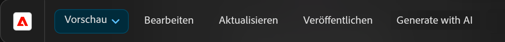

# Varianten generieren – in AEM-Editoren integriert {#generate-variations-integrated-in-aem-editors}

Wenn Sie nach einer Möglichkeit suchen, Ihre digitalen Kanäle zu optimieren und die Inhaltserstellung zu beschleunigen, können Sie die in den AEM-Editoren integrierte Funktion „Varianten generieren“ verwenden. 

Die Funktion „Varianten generieren“ verwendet generative künstliche Intelligenz (KI), um Inhaltsvarianten basierend auf Ihren Eingaben zu erstellen. Nachdem Sie Varianten erstellt haben, können Sie den Inhalt auf Ihrer Website verwenden und deren Erfolg außerdem mithilfe der Funktion [Experimente](https://www.aem.live/docs/experimentation) von [Edge Delivery Services](/help/edge/overview.md) messen.

Dies kann die Inhaltsgeschwindigkeit beschleunigen, indem markenkonforme Inhalte in Minutenschnelle erstellt werden. Dies wiederum verbessert die Konversion mit neuen Kopiervarianten.

Sie können über die folgenden Editoren auf [„Varianten generieren“ zugreifen](#access-generate-variations) ([sobald sie konfiguriert wurden](#access-generate-variations)):

* [innerhalb des Sidekick von AEM Edge Delivery Services; für dokumentenbasiertes Authoring](#access-aem-sidekick)
* [im universellen Editor](#access-aem-universal-editor)
* [im Inhaltsfragmenteditor](#access-aem-content-fragment-editor)

>[!IMPORTANT]
>
>Auf dieser Seite wird das dokumentenbasierte Authoring als Grundlage für Beispiele verwendet, die Prinzipien gelten jedoch für die anderen Editoren.

>[!NOTE]
>
>In allen Fällen müssen Sie zur Verwendung von „Varianten generieren“ sicherstellen, dass die [Voraussetzungen für den Zugriff](#access-prerequisites) erfüllt sind.

>[!NOTE]
>
>Es wird empfohlen, diese Version zu verwenden, da auf die eigenständige Version von [„Varianten generieren“ zwar noch weiterhin direkt zugegriffen werden kann](/help/generative-ai/generate-variations.md), dies in Zukunft jedoch nicht mehr unterstützt wird.

Sie haben dann folgende Möglichkeiten:

* [Auswählen des Inhalts, mit dem Sie arbeiten möchten](#select-the-content) – aus vorhandenen Inhaltsblöcken
   * Der ausgewählte Block steuert, was angezeigt wird und welche Aktionen verfügbar sind.
* [Beschreiben der gewünschten Änderungen](#describe-the-changes-you-want)
* [Generieren von Varianten Ihrer Inhalte](#generate-copy) und [im Anschluss das Durchführen weiterer Aktionen, falls gewünscht](#take-further-action-on-a-variation)
* [Auswählen und Verwenden einer Variante](#use-a-generated-variation)
* Überprüfen des [Verlaufs](#history)
* Anzeigen Ihrer [Favoriten](#favorites)

## Rechtlicher Hinweis und Nutzungshinweis {#legal-usage-note}

<!--
Generative AI and Generate Variations for AEM are powerful tools – but **you** are responsible for use of the output.

Your inputs to the service should be tied to a context. This context can be your branding materials, website content, data, schemas for such data, templates, or other trusted documents.

You must evaluate the accuracy of any output as appropriate to your use case.

Before using Generate Variations you are recommended to read the [Adobe Experience Cloud Generative AI User Guidelines](https://www.adobe.com/legal/licenses-terms/adobe-dx-gen-ai-user-guidelines.html).
-->

Die [Verwendung von „Varianten generieren“](#generative-action-usage) ist an den Verbrauch generativer Aktionen gebunden.

>[!NOTE]
>
>Im [Sicherheits-Factsheet](https://www.adobe.com/content/dam/cc/de/trust-center/ungated/whitepapers/experience-cloud/aem-sites-generate-variations-security-fact-sheet.pdf) finden Sie weitere Informationen zu „Varianten generieren“ in AEM.

## Überblick {#overview}

Wenn Sie die in einen Editor integrierte Funktion „Varianten generieren“ öffnen, wird Ihnen die Erweiterung als unverankertes Bedienfeld mit drei Registerkarten angezeigt.


* Der Editor:
   * Zeigt den Inhaltsfluss im Editor an.
   * Hier können Sie einen Inhaltsblock zur Verwendung in **Varianten generieren** auswählen.
* **Varianten generieren**:
   * ist ein unverankertes Bedienfeld mit drei Registerkarten, die beliebig verschoben werden können.
   * [Generieren](#get-started-with-generate-variations):
      * Zeigt den [ausgewählten Inhalt](#select-the-content) an.
      * Stellt Beispiel-**Vorschläge** für Änderungen bereit.
      * Ermöglicht Ihnen das [Beschreiben der gewünschten Änderungen](#describe-the-changes-you-want).
      * Ermöglicht Ihnen das [Generieren](#generate-copy) neuer Varianten.
      * Zeigt die generierten Varianten an. <!--, together with their [brand score](#the-brand-score).-->
      * [Durchführen weiterer Aktionen für eine Variante](#take-further-action-on-a-variation).
      * [Verwenden Sie eine generierte Variante](#use-a-generated-variation).
   * [Verlauf](#history):
      * Zeigt den aktuellen Verlauf der Generationen an.
   * [Favoriten](#favorites):
      * Zeigt Ergebnisse früherer Generierungen an, die Sie als Favoriten gekennzeichnet haben.
   * **Bedingungen für die generative KI von Adobe**: führt zu den [Benutzerrichtlinien für die generative KI von Adobe](https://www.adobe.com/legal/licenses-terms/adobe-dx-gen-ai-user-guidelines.html).

## Erste Schritte mit „Varianten generieren“ {#get-started-with-generate-variations}

Die Benutzeroberfläche führt Sie durch den Prozess der Inhaltserstellung. Nach dem Öffnen der Benutzeroberfläche besteht der erste Schritt darin, den Inhaltsblock auszuwählen, den Sie verwenden möchten.

### Auswählen des Inhalts {#select-the-content}

Wählen Sie aus dem Hauptinhaltsfluss des Editors den Inhalt aus, für den Sie Varianten generieren möchten. Diese **Auswahl** wird auf der Registerkarte **Generieren** angezeigt.

### Beschreiben der gewünschten Änderungen {#describe-the-changes-you-want}

Um Varianten des Inhalts zu generieren, müssen Sie die gewünschten Änderungen beschreiben. Sie können entweder einen der bereitgestellten **Vorschläge** auswählen oder Ihre eigene Beschreibung angeben.

Sie können auch **Modifikatoren** angeben, um mehr Kontext bereitzustellen:

* **Eine Web-Seite referenzieren**
Geben Sie eine URL für mehr Kontext an.
* **Inhaltsübersicht hochladen**
Aktualisieren Sie eine `.docx`-Datei mit Details zur Inhaltsübersicht (10 MB oder weniger).

### Generieren einer Kopie {#generate-copy}

Nachdem Sie die gewünschten Änderungen beschrieben haben, wählen Sie **Generieren** aus, um die Antworten der generativen KI anzuzeigen.


<!--
### The Brand Score {#the-brand-score}

The brand score shows you how on-brand the generated variation is.
-->

### Durchführen einer weiteren Aktion für eine Variante {#take-further-action-on-a-variation}

Wenn Sie eine einzelne Variante auswählen, können Sie die folgenden Aktionen verwenden:

* **Bearbeiten**
   * Sie können den Text der generierten Variante bearbeiten.

      * Ihre Aktualisierungen können auf der Web-Seite in der Vorschau angezeigt werden.

   * Speichern Sie Ihre Änderungen für eine zukünftige Verwendung.
* **Favorit**
   * Markieren Sie diese Variante für künftige Referenzzwecke.
   * Nach dem Markieren wird sie auf der Registerkarte [Favoriten](#favorites) angezeigt.
* **KI-Begründung**
   * Im Sinne einer zusätzlichen Transparenz wird hier kurz beschrieben, warum diese bestimmte Variante durch generative KI generiert wurde.

### Verwenden einer generierten Variante {#use-a-generated-variation}

Zur Verwendung des mit generativer KI generierten Inhalts müssen Sie den Inhalt zunächst auswählen und dann **in CSV exportieren**.

Nach dem Export können Sie den Inhalt an einer anderen Stelle verwenden, z. B. beim Erstellen von Inhalten für Ihre Website. Sie können auch ein [Experiment](https://www.aem.live/docs/experimentation) durchführen.

>[!NOTE]
>
>Wenn der Zugriff auf „Varianten generieren“ über den [universellen Editor von AEM](#access-aem-universal-editor) oder den [AEM-Inhaltsfragmenteditor](#access-aem-content-fragment-editor) erfolgt, wird der ausgewählte generierte Inhalt automatisch in AEM gespeichert.

## Verlauf {#history}

Auf dieser Registerkarte werden Ihre vergangenen Aktivitäten angezeigt, nachdem Sie **Generieren** ausgewählt haben. Ein Eintrag **Verlauf** wird hinzugefügt.

Wenn Sie zu einem späteren Zeitpunkt denselben Inhalt im Hauptfluss auswählen und die Registerkarte **Verlauf** öffnen, werden alle für diesen Block generierten Varianten angezeigt.

## Favoriten {#favorites}

Nach der Überprüfung des Inhalts können Sie ausgewählte Varianten als Favoriten speichern.

Nach dem Speichern werden sie unter **Favoriten** angezeigt. Favoriten werden beibehalten (bis Sie ihren **Favoritenstatus aufheben** oder bis Sie den Browsercache löschen).

* Sie können einen Eintrag **bearbeiten**, seinen **Favoritenstatus aufheben** oder die **KI-Begründung** für diesen Eintrag anzeigen.
* Sobald eine Variante ausgewählt ist, können Sie sie auch **in CSV exportieren**.

## Nutzung generischer Aktionen {#generative-action-usage}

Die Verwaltung der Nutzung hängt von der durchgeführten Aktion ab:

* Varianten generieren

  Jede Generierung einer Kopiervariante entspricht einer generativen Aktion. Als Kundin oder Kunde verfügen Sie über eine bestimmte Anzahl von generativen Aktionen, die mit Ihrer AEM-Lizenz einhergehen. Sobald das Basiskontingent aufgebraucht ist, können Sie zusätzliche Aktionen erwerben.

  >[!NOTE]
  >
  >Weitere Informationen zum Basiskontingent finden Sie unter [Adobe Experience Manager: Cloud Service | Produktbeschreibung](https://helpx.adobe.com/de/legal/product-descriptions/aem-cloud-service.html). Wenn Sie weitere generative Aktionen erwerben möchten, können Sie sich an Ihr Accountteam wenden.

## Zugriff auf „Varianten generieren“ {#access-generate-variations}

Sobald die Voraussetzungen erfüllt sind, können Sie über AEM as a Cloud Service oder den Sidekick von Edge Delivery Services auf „Varianten generieren“ zugreifen.

### Voraussetzungen für den Zugriff {#access-prerequisites}

Um „Varianten generieren“ zu verwenden, müssen Sie sicherstellen, dass die Voraussetzungen erfüllt sind:

* [Zugriff auf Experience Manager as a Cloud Service mit Edge Delivery Services](#access-to-aemaacs-with-edge-delivery-services)

#### Zugriff auf Experience Manager as a Cloud Service mit Edge Delivery Services{#access-to-aemaacs-with-edge-delivery-services}

Benutzende, die Zugriff auf die Funktion „Varianten generieren“ benötigen, müssen über die Berechtigung für eine Experience Manager as a Cloud Service-Umgebung mit Edge Delivery Services verfügen.

>[!NOTE]
>
>Wenn Ihr Vertrag für AEM Sites as a Cloud Service keine Edge Delivery Services umfasst, müssen Sie einen neuen Vertrag unterzeichnen, um Zugriff zu erhalten.
>
>Wenden Sie sich an Ihr Accountteam, um zu besprechen, wie Sie zu AEM Sites as a Cloud Service mit Edge Delivery Services wechseln können.

Um bestimmten Benutzenden Zugriff zu gewähren, weisen Sie ihr Benutzerkonto dem jeweiligen Produktprofil zu. Weitere Informationen finden Sie unter [Zuweisen von AEM-Produktprofilen](/help/journey-onboarding/assign-profiles-cloud-manager.md).

### Zugriff über den AEM Sidekick für dokumentenbasiertes Authoring {#access-aem-sidekick}

Der Zugriff über den AEM Sidekick wird für das [dokumentenbasierte Authoring](https://www.aem.live/docs/aem-authoring) verwendet.

Bevor Sie über den Sidekick (von Edge Delivery Services) auf „Varianten generieren“ zugreifen können, müssen bestimmte Konfigurationen vorgenommen werden.

>[!NOTE]
>
>Informationen zum Installieren und Konfigurieren des Sidekicks finden Sie im Dokument [Installieren des AEM Sidekicks](https://www.aem.live/docs/sidekick-extension).

Um „Varianten generieren“ im Sidekick (von Edge Delivery Services) verwenden zu können, müssen Sie die folgenden Konfigurationen in Ihre Edge Delivery Services-Projekte einfügen.

1. Aktivieren Sie unsere App in:

   * `tools/sidekick/config.json`

   Diese muss mit Ihrer vorhandenen Konfiguration zusammengeführt und dann bereitgestellt werden.

   Beispiel:

   ```prompt
   {
     "plugins": [
       {
         "id": "aem-genai-variations",
         "titleI18n": {
           "en": "Generate with AI"
         },
         "environments": [
           "preview"
         ],
         "includePaths": [
           "**.docx**"
         ],
         "event": "aem-genai-variations-sidekick"
       }
     ]
   }
   ```

1. Erstellen:

   * `/tools/sidekick/aem-genai-variations.js`

   Sie müssen diese Datei mit folgendem Inhalt erstellen:

   ```prompt
   (function () {
     let isAEMGenAIVariationsAppLoaded = false;
     function loadAEMGenAIVariationsApp() {
       const script = document.createElement('script');
       script.src = 'https://experience.adobe.com/solutions/aem-sites-genai-aem-genai-variations-mfe/static-assets/resources/sidekick/client.js?source=plugin';
       script.onload = function () {
         isAEMGenAIVariationsAppLoaded = true;
       };
       script.onerror = function () {
         console.error('Error loading AEMGenAIVariationsApp.');
       };
       document.head.appendChild(script);
     }
   
     function handlePluginButtonClick() {
       if (!isAEMGenAIVariationsAppLoaded) {
         loadAEMGenAIVariationsApp();
       }
     }
   
     // The code snippet for the Sidekick V1 extension, https://chromewebstore.google.com/detail/aem-sidekick/ccfggkjabjahcjoljmgmklhpaccedipo?hl=en
     const sidekick = document.querySelector('helix-sidekick');
     if (sidekick) {
       // sidekick already loaded
       sidekick.addEventListener('custom:aem-genai-variations-sidekick', handlePluginButtonClick);
     } else {
       // wait for sidekick to be loaded
       document.addEventListener('sidekick-ready', () => {
         document.querySelector('helix-sidekick')
           .addEventListener('custom:aem-genai-variations-sidekick', handlePluginButtonClick);
       }, { once: true });
     }
   
     // The code snippet for the Sidekick V2 extension, https://chromewebstore.google.com/detail/aem-sidekick/igkmdomcgoebiipaifhmpfjhbjccggml?hl=en
     const sidekickV2 = document.querySelector('aem-sidekick');
     if (sidekickV2) {
       // sidekick already loaded
       sidekickV2.addEventListener('custom:aem-genai-variations-sidekick', handlePluginButtonClick);
     } else {
       // wait for sidekick to be loaded
       document.addEventListener('sidekick-ready', () => {
         document.querySelector('aem-sidekick')
           .addEventListener('custom:aem-genai-variations-sidekick', handlePluginButtonClick);
       }, { once: true });
     }
   }());
   ```

1. Aktualisieren:

   * `/scripts/scripts.js`

   Dies muss aktualisiert werden, um die folgende Anweisung in die Funktion `loadLazy()` einzuschließen:

   ```prompt
     import('../tools/sidekick/aem-genai-variations.js');
   ```

   Dadurch wird sichergestellt, dass `/tools/sidekick/aem-genai-variations.js` im Rahmen des Lazy Loading-Vorgangs geladen wird.

   

1. Anschließend müssen Sie möglicherweise sicherstellen, dass Benutzende Zugriff auf [Experience Manager as a Cloud Service mit Edge Delivery Services](#access-to-aemaacs-with-edge-delivery-services) haben.

1. Sie können dann auf die Funktion zugreifen, indem Sie in der Symbolleiste des Sidekicks die Option **Mit KI generieren** auswählen:

   

### Zugriff über den universellen Editor von AEM {#access-aem-universal-editor}

Der Zugriff über den [universellen Editor von AEM](/help/sites-cloud/authoring/universal-editor/authoring.md) wird als Erweiterung implementiert.

* Weitere Informationen zum Zugriff auf „Varianten generieren“ über den universellen Editor finden Sie im Dokument [Inhaltserstellung mit dem universellen Editor](/help/sites-cloud/authoring/universal-editor/authoring.md#generate-variations).
* Weitere Informationen zum Aktivieren der Erweiterung finden Sie im Dokument [Extension Manager in AEM Experience Manager](https://developer.adobe.com/uix/docs/extension-manager/).

### Zugriff über den AEM-Inhaltsfragmenteditor {#access-aem-content-fragment-editor}

Der Zugriff über den [AEM-Inhaltsfragmenteditor](/help/sites-cloud/administering/content-fragments/authoring.md#generate-variations-ai) wird als Erweiterung implementiert. Weitere Informationen finden Sie unter [Extension Manager in AEM Experience Manager](https://developer.adobe.com/uix/docs/extension-manager/).

## Weiterführende Informationen {#further-information}

Weitere Informationen finden Sie auch unter:

* [GenAI – Generieren von Varianten auf GitHub](https://github.com/adobe/aem-genai-assistant#setting-up-aem-genai-assistant)
* [Experimente mit Edge Delivery Services](https://www.aem.live/docs/experimentation)
* [Generative KI in Experience Cloud-Produkten](https://experienceleague.adobe.com/de/docs/core-services/interface/features/generative-ai)

   * [Generative KI in Experience Cloud-Produkten – Adobe Experience Manager](https://experienceleague.adobe.com/de/docs/core-services/interface/features/generative-ai#aem)

* [Landingpage für „Varianten generieren“ in Experience Cloud](https://experience.adobe.com/solutions/aem-sites-genai-aem-genai-variations-mfe/static-assets/resources/ga.html)

* [Generative KI in AEM as a Cloud Service](/help/ai-in-aem/overview.md#generative-ai-in-aem)

## Versionsverlauf {#release-history}

Weitere Informationen zu aktuellen und früheren Versionen finden Sie in den [Versionshinweisen für „Varianten generieren“](/help/generative-ai/release-notes-generate-variations.md)
