# Varianten generieren {#generate-variations}


>[!NOTE]
>
>Es wird empfohlen, auf [die in AEM-Editoren integrierte Option „Varianten generieren“](/help/generative-ai/generate-variations-integrated-editor.md) zuzugreifen, da die auf dieser Seite beschriebene Version in Zukunft nicht mehr unterstützt wird.

Wenn Sie nach einer Möglichkeit suchen, Ihre digitalen Kanäle zu optimieren und die Inhaltserstellung zu beschleunigen, können Sie „Varianten generieren“ verwenden. Die Funktion „Varianten generieren“ verwendet generative künstliche Intelligenz (KI), um Inhaltsvarianten basierend auf Prompts zu erstellen. Diese Prompts werden entweder von Adobe bereitgestellt oder von Benutzenden erstellt und verwaltet. Nachdem Sie Varianten erstellt haben, können Sie den Inhalt auf Ihrer Website verwenden und deren Erfolg außerdem mithilfe der Funktion [Experimente](https://www.aem.live/docs/experimentation) von [Edge Delivery Services](/help/edge/overview.md) messen.

Sie können wie folgt [auf „Varianten generieren“ zugreifen](#access-generate-variations):

* [in Adobe Experience Manager (AEM) as a Cloud Service](#access-aemaacs)
* [über den Sidekick von AEM Edge Delivery Services](#access-aem-sidekick)
* [im Inhaltsfragmenteditor](/help/sites-cloud/administering/content-fragments/authoring.md#generate-variations-ai)

>[!NOTE]
>
>In allen Fällen müssen Sie zur Verwendung von „Varianten generieren“ sicherstellen, dass die [Voraussetzungen für den Zugriff](#access-prerequisites) erfüllt sind.

Sie haben dann folgende Möglichkeiten:

* [Beginnen Sie](#get-started) mit einer Prompt-Vorlage, die von Adobe für einen bestimmten Anwendungsfall erstellt wurde.
* Sie können [einen vorhandenen Prompt bearbeiten](#edit-the-prompt);
* oder [Ihre eigenen Prompts erstellen und verwenden](#create-prompt):
   * [Speichern Sie Ihre Prompts](#save-prompt) für eine zukünftige Verwendung
   * Greifen Sie von überall in Ihrem Unternehmen aus [auf freigegebene Prompts zu und verwenden Sie sie](#select-prompt).
* Definieren Sie die [Zielgruppensegmente](#audiences), die beim [Generieren personalisierter zielgruppenspezifischer Inhalte](#generate-copy) im Prompt verwendet werden sollen.
* Zeigen Sie die Ausgabe neben dem Prompt in der Vorschau an, bevor Sie bei Bedarf Änderungen vornehmen und die Ergebnisse verfeinern.
* Verwenden Sie [Adobe Express, um Bilder zu generieren](#generate-image), die auf den Varianten des Exemplars basieren. Dabei werden die generativen KI-Funktionen von Firefly verwendet.
* Wählen Sie Inhalte aus, die Sie auf Ihrer Website oder in einem Experiment verwenden möchten.

## Rechtlicher Hinweis und Nutzungshinweis {#legal-usage-note}

Generative KI und „Varianten generieren“ für AEM sind leistungsstarke Tools – für die Verwendung der Ausgaben sind jedoch **Sie** verantwortlich.

Ihre Eingaben für den Dienst sollten an einen Kontext gebunden sein. Dieser Kontext kann sich aus Ihren Branding-Materialien, Website-Inhalten, Daten, Schemata für solche Daten, Vorlagen oder anderen vertrauenswürdigen Dokumenten zusammensetzen.

Sie müssen die Genauigkeit jeder Ausgabe entsprechend Ihrem Anwendungsfall bewerten.

Bevor Sie „Varianten generieren“ verwenden, müssen Sie den [Benutzungsrichtlinien für die generative KI von Adobe](https://www.adobe.com/legal/licenses-terms/adobe-dx-gen-ai-user-guidelines.html) zustimmen.

Die [Verwendung von „Varianten generieren“](#generative-action-usage) ist an den Verbrauch generativer Aktionen gebunden.

## Überblick {#overview}

Wenn Sie „Varianten generieren“ öffnen (und das linke Bedienfeld erweitern), sehen Sie Folgendes:

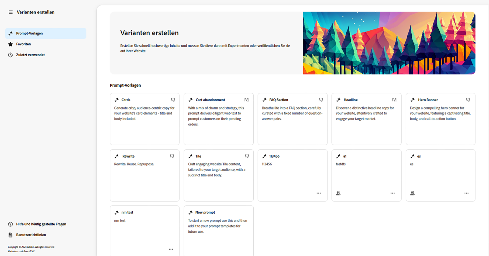

* Rechtes Bedienfeld
   * Dies hängt von der Auswahl ab, die Sie im linken Navigationsbereich vornehmen.
   * Standardmäßig werden **Prompt-Vorlagen** angezeigt.
* Linker Navigationsbereich
   * Links von **Varianten generieren** befindet sich die Option (Sandwich-Menü) zum Erweitern oder Ausblenden des linken Navigationsbedienfelds.
   * **Prompt-Vorlagen**:
      * Zeigt Links zu den verschiedenen Prompts an. Folgende Prompts können angezeigt werden:
         * Von Adobe bereitgestellte Prompts, die Ihnen bei der Erstellung von Inhalten helfen. Sie sind mit dem Adobe-Symbol gekennzeichnet.
         * Von Ihnen erstellte Prompts.
         * Innerhalb Ihrer IMS-Organisation erstellte Prompts. Diese sind mit einem Symbol gekennzeichnet, das mehrere Köpfe zeigt.
      * Enthält den Link [Neuer Prompt](#create-prompt) zum Erstellen Ihres eigenen Prompts.
      * Sie können von Ihnen oder innerhalb Ihrer IMS-Organisation erstellte Prompts **löschen**. Dies geschieht über das Menü, auf das über das Auslassungszeichen auf der entsprechenden Karte zugegriffen wird.
   * [Favoriten](#favorites): Zeigt Ergebnisse früherer Generierungen an, die Sie als Favoriten gekennzeichnet haben.
   * [Zuletzt verwendet](#recents): Enthält Links zu Prompts und deren Eingaben, die Sie vor Kurzem verwendet haben.
   * **Hilfe und häufig gestellte Fragen**: Links zur Dokumentation, einschließlich häufig gestellter Fragen.
   * **Benutzerrichtlinien**: Links zu den gesetzlichen Richtlinien.

## Erste Schritte {#get-started}

Die Benutzeroberfläche führt Sie durch den Prozess der Inhaltserstellung. Nach dem Öffnen der Benutzeroberfläche besteht der erste Schritt darin, den Prompt auszuwählen, den Sie verwenden möchten.

### Auswählen des Prompts {#select-prompt}

Im Hauptbedienfeld können Sie Folgendes auswählen:

* eine Prompt-Vorlage, die von Adobe bereitgestellt wird, um mit der Inhaltserstellung zu beginnen,
* [Neuer Prompt](#create-prompt), um Ihren eigenen Prompt zu erstellen,
* eine Vorlage, die Sie ausschließlich für Ihre Verwendung erstellt haben,
* eine Vorlage, die Sie oder eine Person in Ihrer Organisation erstellt haben.

So unterscheiden Sie Prompts voneinander:

* Die von Adobe bereitgestellten Prompts sind mit dem Adobe-Symbol gekennzeichnet
* Innerhalb Ihrer IMS-Organisation verfügbare Prompts sind mit einem Symbol gekennzeichnet, das mehrere Köpfe zeigt.
* Ihre privaten Prompts haben keine spezielle Kennzeichnung.

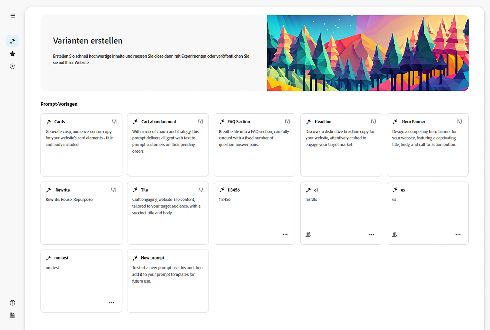

### Bereitstellen von Eingaben {#provide-inputs}

Sie müssen für jeden Prompt bestimmte Informationen angeben, damit die entsprechenden Inhalte von der generativen KI abgerufen werden können.

Die Eingabefelder leiten Sie an, welche Informationen benötigt werden. Bestimmte Felder haben Standardwerte, die Sie verwenden oder nach Bedarf ändern können, sowie Beschreibungen, die die Anforderungen erläutern.

Es gibt mehrere grundlegende Eingabefelder, die für eine Reihe von Prompts verwendet werden (bestimmte Felder sind nicht immer verfügbar):

* **Anzahl der**/**Anzahl der**
   * Sie können auswählen, wie viele Inhaltsvarianten in einer Generierung erstellt werden sollen.
   * Je nach dem Prompt kann dies eine von verschiedenen Labels aufweisen, z. B. Anzahl, Anzahl der Varianten oder Anzahl der Ideen.
* **Zielgruppenquelle**/**Zielgruppe**
   * Hilft bei der Erstellung personalisierter Inhalte für eine bestimmte Zielgruppe.
   * Adobe stellt Standardzielgruppen bereit. Alternativ können Sie zusätzliche Zielgruppen angeben. Informationen dazu finden Sie unter [Zielgruppen](#audiences).
* **Zusätzlicher Kontext**
   * Fügen Sie hier relevante Inhalte ein, um die generative KI bei der Erstellung einer besseren Antwort auf Grundlage der Eingabe zu unterstützen. Wenn Sie beispielsweise ein Web-Banner für eine bestimmte Seite oder ein bestimmtes Produkt erstellen, können Sie Informationen über die Seite bzw. das Produkt einfügen.
* **Temperatur**
Zur Änderung der Temperatur der generativen KI von Adobe:
   * Eine höhere Temperatur führt zu einer stärkeren Abweichung vom Prompt und damit zu mehr Variation, Zufälligkeit und Kreativität.
   * Eine niedrigere Temperatur ist deterministischer und orientiert sich näher am Inhalt des Prompts.
   * Die Temperatur ist standardmäßig auf „1“ festgelegt. Sie können verschiedene Temperaturen ausprobieren, wenn die generierten Ergebnisse nicht Ihren Vorstellungen entsprechen.
* **Bearbeiten eines Prompts**
   * Der zugrunde liegende [Prompt kann bearbeitet werden](#edit-the-prompt), um die generierten Ergebnisse zu verfeinern.

### Generieren einer Kopie {#generate-copy}

Nachdem Sie die Eingabefelder ausgefüllt und/oder den Prompt geändert haben, können Sie Inhalte generieren und die Antworten überprüfen.

Wählen Sie **Generieren** aus, um die von der generativen KI generierten Antworten anzuzeigen. Die generierten Inhaltsvarianten werden unter dem Prompt angezeigt, der sie generiert hat.

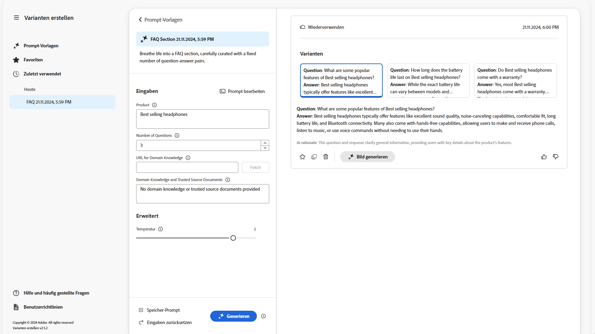

>[!NOTE]
>
>Die meisten Prompt-Vorlagen von Adobe enthalten eine **KI-Begründung** in der Antwortvariante. Dies sorgt für Transparenz darüber, warum die generative KI diese bestimmte Variante generiert hat.

Bei Auswahl einer einzelnen Variante sind die folgenden Aktionen verfügbar:

* **Favorit**
   * Markieren als **Favorit** für die zukünftige Verwendung (wird in [Favoriten](#favorites) angezeigt).
* Daumen nach oben/Daumen nach unten
   * Verwenden Sie die Angabe „Daumen nach oben“/„Daumen nach unten“, um Adobe über die Qualität der Antworten zu informieren.
* **Kopieren**
   * Kopiert die Variante in die Zwischenablage, um sie beim Erstellen von Inhalten auf Ihrer Website oder in einem [Experiment](https://www.aem.live/docs/experimentation) zu verwenden.
* **Entfernen**

Wenn Sie die Eingaben oder den Prompt verfeinern müssen, können Sie Anpassungen vornehmen und dann erneut **Generieren** auswählen, um einen Satz neuer Antworten zu erhalten. Der neue Prompt und die Antwort werden unter dem ersten Prompt und der ersten Antwort angezeigt. Sie können nach oben und unten scrollen, um die verschiedenen Inhaltssätze anzuzeigen.

Über jedem Variantensatz befindet sich der Prompt, der sie erstellt hat, zusammen mit der Option **Wiederverwenden**. Wenn Sie jemals einen Prompt mit seinen Eingaben wiederverwenden müssen, wählen Sie **Wiederverwenden** aus, um sie erneut in **Eingaben** zu laden.

### Bild generieren {#generate-image}

Nachdem Sie Textvarianten generiert haben, können Sie in Adobe Express Bilder mithilfe der generativen KI-Funktionen von Firefly generieren.

>[!NOTE]
>
>**Bild generieren** ist nur verfügbar, wenn Sie über eine Adobe Express-Berechtigung als Teil Ihrer IMS-Organisation verfügen und Ihnen in der Admin Console Zugriff gewährt wurde.

Wählen Sie eine Variante und anschließend **Bild generieren** aus, um **Text zu Bild** direkt in [Adobe Express](https://www.adobe.com/de/express/) zu öffnen. Der Prompt wird entsprechend Ihrer Variantenauswahl vorausgefüllt und die Bilder werden automatisch entsprechend diesem Prompt generiert.

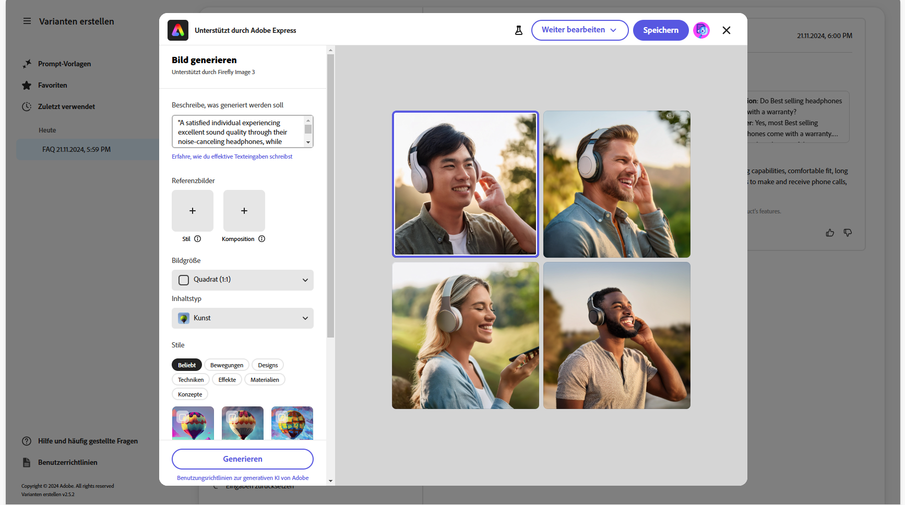

Sie können weitere Änderungen vornehmen:

* [Schreiben Sie Ihren eigenen Prompt in Adobe Express](https://helpx.adobe.com/de/firefly/using/tips-and-tricks.html), indem Sie beschreiben, was Sie sehen möchten,
* passen Sie die Optionen für **Text zu Bild** an
* und **aktualisieren** Sie anschließend die generierten Bilder.

Sie können auch **Mehr erkunden** verwenden, um weitere Möglichkeiten auszuprobieren.

Wenn Sie fertig sind, wählen Sie das gewünschte Bild und dann **Speichern** aus, um Adobe Express zu schließen. Das Bild wird zurückgegeben und mit der Variante gespeichert.

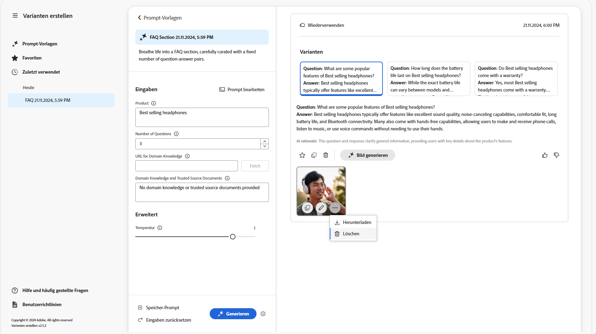

Hier können Sie den Mauszeiger über das Bild bewegen, um Aktionselemente für Folgendes anzuzeigen:

* **Kopieren**: [Kopiert das Bild in die Zwischenablage, um es an einer anderen Stelle zu verwenden](#use-content)
* **Bearbeiten**: Öffnet Adobe Express, damit Sie Änderungen am Bild vornehmen können
* **Herunterladen**: Lädt das Bild auf Ihren lokalen Computer herunter.
* **Löschen**: Entfernt das Bild aus der Variante

>[!NOTE]
>
>[Content Credentials](https://helpx.adobe.com/de/creative-cloud/help/content-credentials.html) werden bei der Verwendung im dokumentbasierten Authoring nicht beibehalten.

### Verwenden von Inhalten {#use-content}

Zur Verwendung des mit generativer KI generierten Inhalts müssen Sie den Inhalt in die Zwischenablage kopieren, damit Sie ihn an anderer Stelle verwenden können.

Hierzu werden die folgenden Symbole zum Kopieren verwendet:

* Für Text: Verwenden Sie das Kopiersymbol, das im Bedienfeld „Varianten“ angezeigt wird
* Für das Bild: Bewegen Sie die Maus über das Bild, um das Symbol zum Kopieren zu sehen

Nachdem Sie die Informationen in die Zwischenablage kopiert haben, können Sie sie zur Erstellung von Inhalten für Ihre Website einfügen. Sie können auch ein [Experiment](https://www.aem.live/docs/experimentation) durchführen.

## Favoriten {#favorites}

Nach der Überprüfung des Inhalts können Sie ausgewählte Varianten als Favoriten speichern.

Nach dem Speichern werden sie im linken Navigationsbereich unter **Favoriten** angezeigt. Favoriten werden beibehalten (bis Sie diese **löschen** oder bis Sie den Browsercache löschen).

* Favoriten und Varianten können kopiert und in die Zwischenablage eingefügt werden, um sie in Ihren Website-Inhalten zu verwenden.
* Favoriten können **entfernt** werden.

## Zuletzt verwendet {#recents}

Dieser Abschnitt enthält Links zu Ihrer aktuellen Aktivität. Nachdem Sie **Generieren** ausgewählt haben, wird ein Eintrag **Aktuell** hinzugefügt. Er hat den Namen des Prompts und einen Zeitstempel. Wenn Sie einen Link auswählen, wird der Prompt geladen, die Eingabefelder werden entsprechend ausgefüllt und die generierten Varianten werden angezeigt.

## Bearbeiten des Prompts {#edit-the-prompt}

Der zugrunde liegende Prompt kann bearbeitet werden. Folgende Gründe kann es für die Bearbeitung des Prompts geben:

* Die generierten Ergebnisse, die Sie erhalten, müssen weiter verfeinert werden
* Sie möchten Änderungen am Prompt vornehmen und [den Prompt speichern](#save-prompt), um ihn in Zukunft verwenden zu können

Wählen Sie **Prompt bearbeiten** aus:

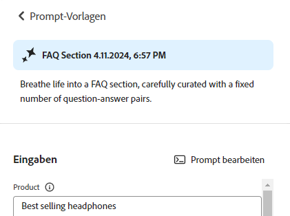

Dadurch wird der Prompt-Editor geöffnet, in dem Sie Ihre Änderungen vornehmen können:

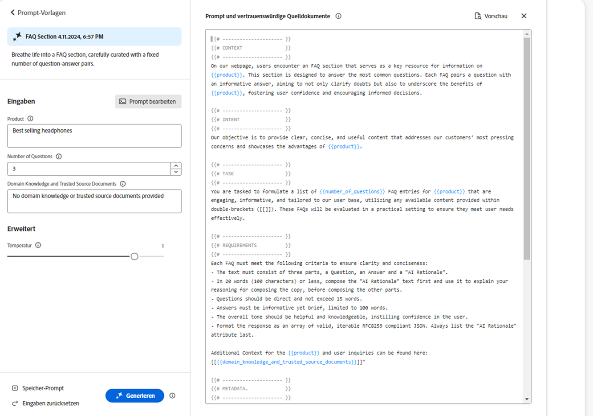

### Hinzufügen von Prompt-Eingaben {#add-prompt-inputs}

Beim Erstellen oder Bearbeiten eines Prompts können Sie Eingabefelder hinzufügen. Eingabefelder fungieren als Variablen im Prompt und bieten die Flexibilität, denselben Prompt in verschiedenen Szenarien zu verwenden. Sie ermöglichen es Benutzenden, bestimmte Elemente des Prompts zu definieren, ohne den gesamten Prompt schreiben zu müssen.

* Ein Feld wird mit doppelten geschweiften Klammern `{{ }}` definiert, in denen ein Platzhaltername steht.
Zum Beispiel: `{{tone_of_voice}}`.

  >[!NOTE]
  >
  >Zwischen den geschweiften Klammern sind keine Leerzeichen zulässig.

* Es wird außerdem mit den folgenden Parametern unter `METADATA` definiert:
   * `label`
   * `description`
   * `default`
   * `type`

#### Beispiel: Hinzufügen eines neuen Textfelds – Tonalität {#example-add-new-text-field-tone-of-voice}

Verwenden Sie zum Hinzufügen eines neuen Textfelds mit dem Titel **Tonalität** die folgende Syntax in Ihrem Prompt:

```prompt
{{@tone_of_voice, 
  label="Tone of voice",
  description="Indicate the desired tone of voice",
  default="optimistic, smart, engaging, human, and creative",
  type=text
}}
```

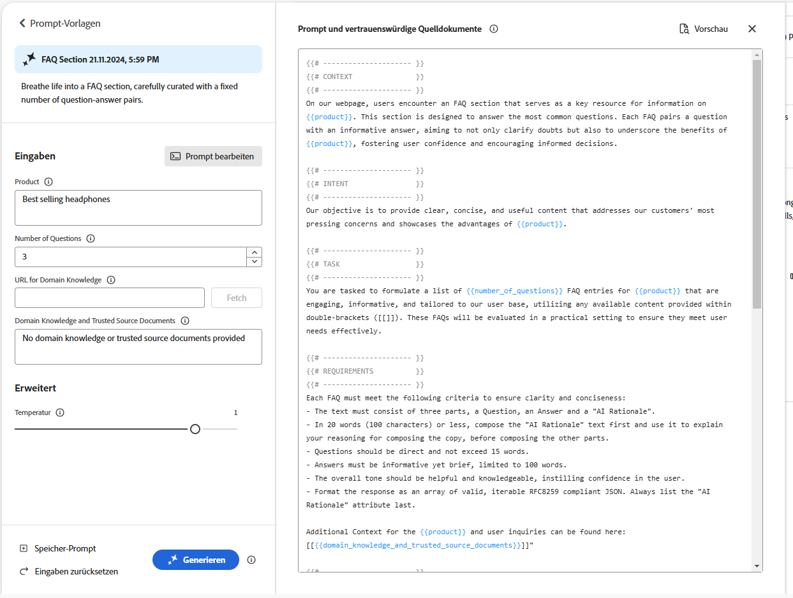

<!--
#### Example: Add new dropdown field - Page Type {#example-add-new-dropdown-field-page-type}

To create an input field Page Type providing a dropdown selection:

1. Create a spreadsheet named `pagetype.xls` in the top-level directory of your folder structure.
1. Edit the spreadsheet:

   1. Create two columns: **Key** and **Value**.
   1. In the **Key** column, enter labels that will appear in the dropdown.
   1. In the **Value** column, describe the key value so the generative AI has context.

1. In your prompt, refer to the title of the spreadsheet along with the appropriate type. 

   ```prompt
   {{@page_type, 
     label="Page Type",
     description="Describes the type of page",
     spreadsheet=pagetype
   }}
   ```
-->

## Erstellen eines Prompts {#create-prompt}

Wenn Sie unter **Prompt-Vorlagen** die Option **Neuer Prompt** auswählen, können Sie in einem neuen Bedienfeld einen neuen Prompt eingeben. Anschließend können Sie diesen zusammen mit der **Temperatur** angeben, um Inhalt zu **generieren**.

Weitere Informationen zum Speichern des Prompts für die Zukunft finden Sie unter [Speichern des Prompts](#save-prompt).

Weitere Informationen zum Hinzufügen eigener Prompt-Eingaben finden Sie unter [Hinzufügen von Prompt-Eingaben](#add-prompt-inputs).

Wenn Sie die Formatierung sowohl in der Benutzeroberfläche als auch beim Kopieren und Einfügen in den dokumentbasierten Authoring-Fluss beibehalten möchten, fügen Sie Folgendes in den Prompt ein:

<!-- CHECK - are the double-quotes needed? -->

* `"Format the response as an array of valid, iterable RFC8259 compliant JSON"`

Die folgende Abbildung zeigt die Vorteile dieser Vorgehensweise:

* Im ersten Beispiel werden `Title` und `Description` kombiniert
* Dagegen werden sie im zweiten Beispiel separat formatiert. Dies erfolgt durch die Einbeziehung der JSON-Anfrage in den Prompt.


## Speichern eines Prompts {#save-prompt}

Nach dem Bearbeiten oder Erstellen von Prompts können Sie diese für die zukünftige Verwendung speichern, und zwar entweder für Ihre ganze IMS-Organisation oder nur für sich selbst. Der gespeicherte Prompt wird als Karte **Prompt-Vorlage** angezeigt.

Wenn Sie den Prompt bearbeitet haben, ist die Option **Speichern** unten im Abschnitt „Eingaben“ links neben **Generieren** verfügbar.

Wenn die Option ausgewählt ist, wird das Dialogfeld **Prompt speichern** geöffnet:

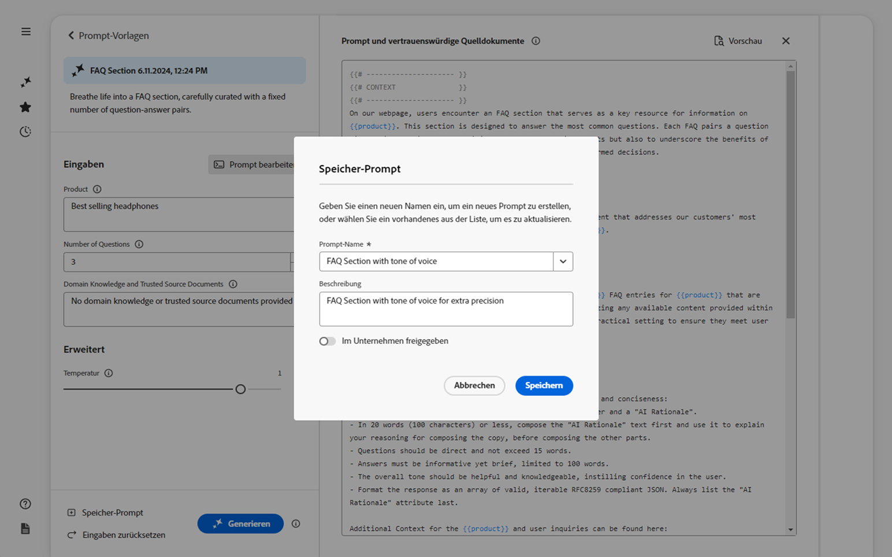

1. Fügen Sie einen eindeutigen **Prompt-Namen** hinzu, der zur Identifizierung des Prompts in den **Prompt-Vorlagen** verwendet wird.
   1. Bei einem neuen und eindeutigen Namen wird eine neue Prompt-Vorlage erstellt.
   1. Bei einem vorhandenen Namen wird dieser Prompt überschrieben und es wird eine Meldung angezeigt.
1. Geben Sie optional eine Beschreibung ein.
1. Aktivieren oder deaktivieren Sie die Option **Im Unternehmen freigegeben**, je nachdem, ob die Eingabeaufforderung für Sie privat sein oder in Ihrer IMS-Organisation verfügbar gemacht werden soll. Dieser Status erscheint auf der [Karte, die in den Prompt-Vorlagen angezeigt wird](#select-prompt).
1. Sie können den Prompt **speichern** oder die Aktion **abbrechen**.

>[!NOTE]
>
>Sie werden informiert (gewarnt), wenn Sie einen vorhandenen Prompt überschreiben/aktualisieren.

>[!NOTE]
>
>Sie können Prompts, die von Ihnen oder in Ihrer IMS-Organisation erstellt wurden, über **Prompt-Vorlagen** löschen (mithilfe des Menüs, auf das über die Auslassungspunkte zugegriffen wird).

## Zielgruppen {#audiences}

Um personalisierte Inhalte zu generieren, muss die generative KI über Kenntnisse zur Zielgruppe verfügen. Adobe bietet eine Reihe von Standardzielgruppen. Alternativ können Sie Ihre eigenen Zielgruppen hinzufügen.

Beim Hinzufügen einer Zielgruppe sollten Sie die Zielgruppe in natürlicher Sprache beschreiben. Zum Beispiel:

* Zum Erstellen einer Zielgruppe:
   * `Student`
* können Sie sagen:
   * `The audience consists of students, typically individuals who are pursuing education at various academic levels, such as primary, secondary, or tertiary education. They are engaged in learning and acquiring knowledge in diverse subjects, seeking academic growth, and preparing for future careers or personal development.`

Es werden zwei Zielgruppenquellen unterstützt:

* [Adobe Target](#audience-adobe-target)
* [CSV-Datei](#audience-csv-file)

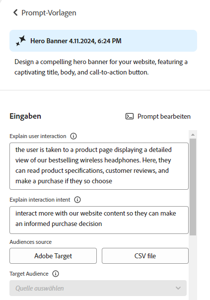

### Zielgruppe – Adobe Target {#audience-adobe-target}

Durch Auswahl einer Zielgruppe vom Typ **Adobe Target** im Prompt kann die Inhaltsgenerierung für diese Zielgruppe personalisiert werden.

>[!NOTE]
>
>Um diese Option verwenden zu können, muss Ihre IMS-Organisation Zugriff auf Adobe Target haben.

1. Wählen Sie **Adobe Target** aus.
1. Wählen Sie anschließend die erforderliche **Zielgruppe** aus der bereitgestellten Liste aus.

   >[!NOTE]
   >
   >Um eine Zielgruppe vom Typ **Adobe Target** zu verwenden, muss das Beschreibungsfeld ausgefüllt werden. Wird es nicht ausgefüllt, wird die Zielgruppe in der Dropdown-Liste als nicht verfügbar angezeigt. Navigieren Sie zum Hinzufügen einer Beschreibung zu „Target“ und [fügen Sie eine Zielgruppenbeschreibung hinzu](https://experienceleague.adobe.com/de/docs/target-learn/tutorials/audiences/create-audiences).

   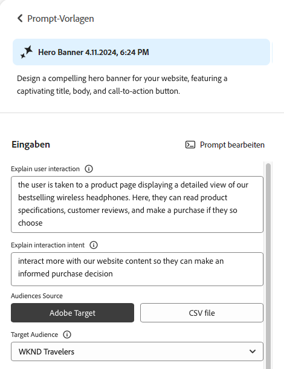

#### Hinzufügen einer Zielgruppe vom Typ „Adobe Target“ {#add-adobe-target-audience}

Informationen zum Erstellen einer Zielgruppe in Adobe Target finden Sie unter [Erstellen von Zielgruppen](https://experienceleague.adobe.com/de/docs/target-learn/tutorials/audiences/create-audiences).

### Zielruppe – CSV-Datei {#audience-csv-file}

Durch Auswahl einer Zielgruppe vom Typ **CSV-Datei** im Prompt kann die Inhaltserstellung für die ausgewählte **Zielgruppe** personalisiert werden.

Adobe bietet eine Reihe von Zielgruppen an, die verwendet werden können.

1. Wählen Sie **CSV-Datei** aus.
1. Wählen Sie anschließend die erforderliche **Zielgruppe** aus der bereitgestellten Liste aus.

   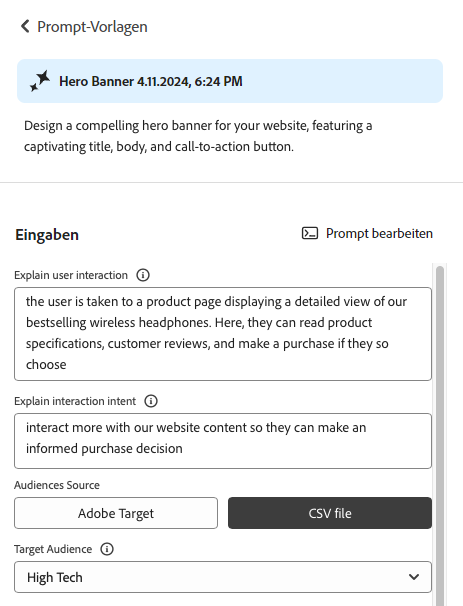

#### Hinzufügen einer Zielgruppe vom Typ „CSV-Datei“ {#add-audience-csv-file}

Sie können eine CSV-Datei über verschiedene Plattformen hinzufügen (z. B. Google Drive, Dropbox oder Sharepoint), die eine URL für die Datei bereitstellen können, sobald sie öffentlich verfügbar gemacht wird.

>[!NOTE]
>
>Sie *müssen* auf den Freigabeplattformen die Möglichkeit haben, die Datei öffentlich zugänglich zu machen.

Zum Beispiel gehen Sie zum Hinzufügen einer Zielgruppe aus einer Datei auf Google Drive wie folgt vor:

1. Erstellen Sie in Google Drive eine Tabellendatei mit zwei Spalten:
   1. Die erste Spalte wird in der Dropdown-Liste angezeigt.
   1. Die zweite Spalte ist für die Zielgruppenbeschreibung.
1. Veröffentlichen Sie die Datei:
   1. Datei -> Freigeben -> Im Web veröffentlichen -> CSV
1. Kopieren Sie die URL in die veröffentlichte Datei.
1. Navigieren Sie zu „Varianten generieren“.
1. Öffnen Sie den Prompt-Editor.
1. Suchen Sie in den Metadaten nach der Zielgruppe vom Typ **Adobe Target** und ersetzen Sie die URL.

   >[!NOTE]
   >
   >Stellen Sie sicher, dass die doppelten Anführungszeichen (&quot;) an beiden Enden der URL beibehalten werden.

   Zum Beispiel:

   

## Nutzung generischer Aktionen {#generative-action-usage}

Die Verwaltung der Nutzung hängt von der durchgeführten Aktion ab:

* Varianten generieren

  Jede Generierung einer Kopiervariante entspricht einer generativen Aktion. Als Kundin oder Kunde verfügen Sie über eine bestimmte Anzahl von generativen Aktionen, die mit Ihrer AEM-Lizenz einhergehen. Sobald das Basiskontingent aufgebraucht ist, können Sie zusätzliche Aktionen erwerben.

  >[!NOTE]
  >
  >Weitere Informationen zum Basiskontingent finden Sie unter [Adobe Experience Manager: Cloud Service | Produktbeschreibung](https://helpx.adobe.com/de/legal/product-descriptions/aem-cloud-service.html). Wenn Sie weitere generative Aktionen erwerben möchten, können Sie sich an Ihr Accountteam wenden.

* Adobe Express

  Die Nutzung der Bildgenerierung erfolgt über Adobe Express-Berechtigungen und [generative Credits](https://helpx.adobe.com/de/firefly/get-set-up/learn-the-basics/generative-credits-faq.html).

## Zugriff auf „Varianten generieren“ {#access-generate-variations}

Sobald die Voraussetzungen erfüllt sind, können Sie über AEM as a Cloud Service oder den Sidekick von Edge Delivery Services auf „Varianten generieren“ zugreifen.

### Voraussetzungen für den Zugriff {#access-prerequisites}

Um „Varianten generieren“ zu verwenden, müssen Sie sicherstellen, dass die Voraussetzungen erfüllt sind:

* [Zugriff auf Experience Manager as a Cloud Service mit Edge Delivery Services](#access-to-aemaacs-with-edge-delivery-services)

#### Zugriff auf Experience Manager as a Cloud Service mit Edge Delivery Services{#access-to-aemaacs-with-edge-delivery-services}

Benutzende, die Zugriff auf die Funktion „Varianten generieren“ benötigen, müssen über die Berechtigung für eine Experience Manager as a Cloud Service-Umgebung mit Edge Delivery Services verfügen.

>[!NOTE]
>
>Wenn Ihr Vertrag für AEM Sites as a Cloud Service keine Edge Delivery Services umfasst, müssen Sie einen neuen Vertrag unterzeichnen, um Zugriff zu erhalten.
>
>Wenden Sie sich an Ihr Accountteam, um zu besprechen, wie Sie zu AEM Sites as a Cloud Service mit Edge Delivery Services wechseln können.

Um bestimmten Benutzenden Zugriff zu gewähren, weisen Sie ihr Benutzerkonto dem jeweiligen Produktprofil zu. Weitere Informationen finden Sie unter [Zuweisen von AEM-Produktprofilen](/help/journey-onboarding/assign-profiles-cloud-manager.md).

### Zugriff über AEM as a Cloud Service {#access-aemaacs}

Der Zugriff auf „Varianten generieren“ erfolgt über das [Navigationsbedienfeld](/help/sites-cloud/authoring/basic-handling.md#navigation-panel) von AEM as a Cloud Service:


### Zugriff über den AEM-Sidekick {#access-aem-sidekick}

Bevor Sie über den Sidekick (von Edge Delivery Services) auf „Varianten generieren“ zugreifen können, müssen bestimmte Konfigurationen vorgenommen werden.

1. Informationen zum Installieren und Konfigurieren des Sidekicks finden Sie im Dokument [Installieren des AEM Sidekicks](https://www.aem.live/docs/sidekick-extension).

1. Um „Varianten generieren“ im Sidekick (von Edge Delivery Services) verwenden zu können, müssen Sie die folgende Konfiguration unter folgendem Pfad in Ihre Edge Delivery Services-Projekte einfügen:

   * `tools/sidekick/config.json`

   Diese muss mit Ihrer vorhandenen Konfiguration zusammengeführt und dann bereitgestellt werden.

   Zum Beispiel:

   ```prompt
   {
     // ...
     "plugins": [
       // ...
       {
         "id": "generate-variations",
         "title": "Generate Variations",
         "url": "https://experience.adobe.com/aem/generate-variations",
         "passConfig": true,
         "environments": ["preview","live", "edit"],
         "includePaths": ["**.docx**"]
       }
       // ...
     ]
   }
   ```

1. Anschließend müssen Sie möglicherweise sicherstellen, dass Benutzende Zugriff auf [Experience Manager as a Cloud Service mit Edge Delivery Services](#access-to-aemaacs-with-edge-delivery-services) haben.

1. Anschließend können Sie auf die Funktion zugreifen, indem Sie in der Symbolleiste des Sidekicks die Option **Varianten generieren** auswählen:

   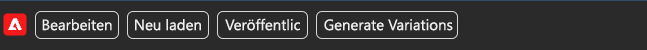

## Weiterführende Informationen {#further-information}

Weitere Informationen finden Sie auch unter:

* [GenAI – Generieren von Varianten auf GitHub](https://github.com/adobe/aem-genai-assistant#setting-up-aem-genai-assistant)
* [Experimente mit Edge Delivery Services](https://www.aem.live/docs/experimentation)
* [Generativ in AEM as a Cloud Service](/help/generative-ai/generative-ai-in-aem.md)

## Häufig gestellte Fragen {#faqs}

### Formatierte Ausgabe {#formatted-outpu}

**Die generierte Antwort gibt mir nicht die formatierte Ausgabe, die ich brauche. Wie kann ich das Format ändern? Beispiel: Ich benötige einen Titel und einen Untertitel, aber die Antwort besteht nur aus dem Titel**

1. Öffnen Sie den tatsächlichen Prompt im Bearbeitungsmodus.
1. Navigieren Sie zu den Anforderungen.
1. Sie finden Anforderungen, die sich auf die Ausgabe beziehen.
   1. Beispiel: „Der Text muss aus drei Teilen bestehen: einem Titel, einem Hauptteil und einer Schaltflächenbeschriftung.“ oder „Formatiere die Antwort als gültiges JSON-Array von Objekten mit den Attributen „Title“, „Body“ und „ButtonLabel“.
1. Ändern Sie die Anforderungen nach Bedarf.

   >[!NOTE]
   >
   >Wenn für die neu eingegebene Ausgabe Beschränkungen hinsichtlich der Wort-/Zeichenanzahl bestehen, erstellen Sie eine Anforderung.

   Beispiel: „Der Titeltext darf 10 Wörter oder 50 Zeichen (einschließlich Leerzeichen) nicht überschreiten.“
1. Speichern Sie den Prompt für eine zukünftige Verwendung.

### Länge der Antwort {#length-of-response}

**Die generierte Antwort ist zu lang oder zu kurz. Wie ändere ich die Länge?**

1. Öffnen Sie den tatsächlichen Prompt im Bearbeitungsmodus.
1. Navigieren Sie zu den Anforderungen.
1. Sie können sehen, dass es für jede Ausgabe eine entsprechende Beschränkung für die Wörter/Zeichen gibt.
   1. Beispiel: „Der Titeltext darf 10 Wörter oder 50 Zeichen (einschließlich Leerzeichen) nicht überschreiten.“
1. Ändern Sie die Anforderungen nach Bedarf.
1. Speichern Sie den Prompt für eine zukünftige Verwendung.

### Verbessern von Antworten {#improve-responses}

**Die Antworten, die ich erhalte, entsprechen nicht wirklich meinen Vorstellungen. Wie kann ich vorgehen, um sie zu verbessern?**

1. Versuchen Sie, unter „Erweiterte Einstellungen“ die Temperatur zu ändern.
   1. Eine höhere Temperatur führt zu einer stärkeren Abweichung vom Prompt und damit zu mehr Variation, Zufälligkeit und Kreativität.
   1. Eine niedrigere Temperatur ist deterministischer und orientiert sich näher am Inhalt des Prompts.
1. Öffnen Sie den tatsächlichen Prompt im Bearbeitungsmodus und überprüfen Sie ihn. Beachten Sie insbesondere den Abschnitt „Anforderungen“, in dem die Tonalität und andere wichtige Kriterien beschrieben werden.

### Kommentare in einem Prompt {#comments-in-prompt}

**Wie kann ich Kommentare in einem Prompt verwenden?**

Kommentare in einem Prompt werden verwendet, um Notizen, Erklärungen oder Anweisungen einzufügen, die nicht Teil der tatsächlichen Ausgabe sein sollen. Diese Kommentare sind in einer speziellen Syntax gehalten: Sie sind in doppelte geschweifte Klammern eingeschlossen und beginnen mit einem Hashtag (z. B. `{{# Comment Here }}`). Kommentare helfen dabei, die Struktur oder Absicht des Prompts zu verdeutlichen, ohne sich dabei auf die generierte Antwort auszuwirken.

### Suchen nach einem freigegebenen Prompt {#find-a-shared-prompt}

**Wie kann ich vorgehen, wenn ich eine Prompt-Vorlage, die von einer anderen Person freigegeben wurde, nicht finden kann?**

In diesem Fall sind verschiedene Details zu prüfen:

1. Verwenden Sie die URL für Ihre Umgebung.
Zum Beispiel https://experience.adobe.com/#/aem/generate-variations
1. Stellen Sie sicher, dass die ausgewählte IMS-Organisation korrekt ist.
1. Vergewissern Sie sich, dass der Prompt als „Freigegeben“ gespeichert wurde.

### Benutzerdefinierte Prompts in v2.0.0 {#custom-prompts-v200}

**Meine benutzerdefinierten Prompts sind in v2.0.0 verschwunden – was kann ich tun?**

Wenn Sie zur Version 2.0.0 wechseln, werden benutzerdefinierte Prompt-Vorlagen beschädigt und sind folglich nicht mehr verfügbar.

So können Sie sie abrufen:

1. Navigieren Sie in Sharepoint zum Ordner „prompt-template“.
1. Kopieren Sie den Prompt.
1. Öffnen Sie die Anwendung „Varianten generieren“.
1. Wählen Sie die Karte „Neuer Prompt“ aus.
1. Fügen Sie den Prompt ein.
1. Überprüfen Sie, ob der Prompt funktioniert.
1. Speichern Sie den Prompt.

## Versionsverlauf {#release-history}

Weitere Informationen zu aktuellen und früheren Versionen finden Sie in den [Versionshinweisen für „Varianten generieren“](/help/generative-ai/release-notes-generate-variations.md)
