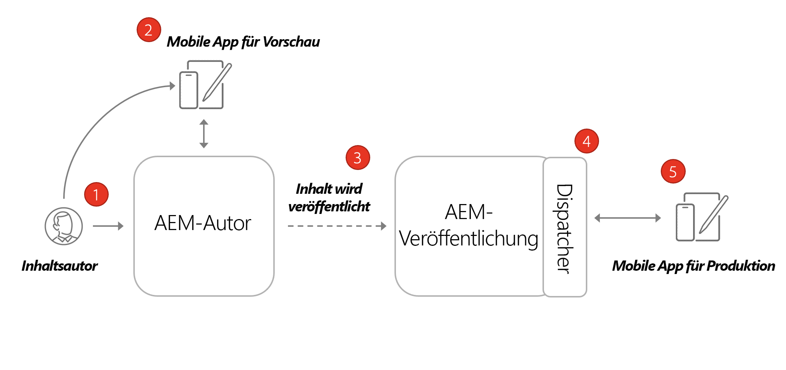
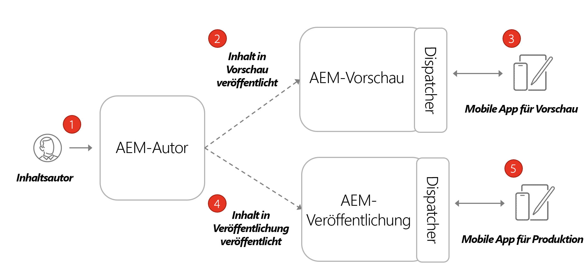

# Architektur von AEM Headless

Eine typische AEM-Umgebung besteht aus einem Autorendienst, einem Veröffentlichungsdienst und einem optionalen Vorschaudienst.

* **Der Autoren-Service**, mit dem interne Anwender Inhalte erstellen, verwalten und in der Vorschau anzeigen.

* **Der Veröffentlichungs-Service** fungiert als „Live-Umgebung“ und ist in der Regel der Bereich, mit die Endanwender interagieren. Inhalte werden nach der Bearbeitung und Genehmigung im Autoren-Service an den Veröffentlichungs-Service weitergeleitet. Das häufigste Bereitstellungsmuster bei AEM Headless-Programmen besteht darin, die Produktionsversion des Programms mit dem Veröffentlichungs-Service von AEM zu verbinden.

* **Der Vorschaudienst** ist funktionell identisch mit dem **Veröffentlichungsdienst**. Sie wird jedoch nur internen Benutzern zur Verfügung gestellt. Dadurch ist es ein ideales System für Genehmiger, bevorstehende Inhaltsänderungen zu überprüfen, bevor sie für Endbenutzer live geschaltet werden.

* **Der Dispatcher** ist ein statischer Webserver, der durch das AEM Dispatcher-Modul erweitert wird. Es bietet Caching-Funktionen und eine weitere Sicherheitsebene. Die **Dispatcher** befindet sich vor dem **Veröffentlichen** und **Vorschau** Dienste.

Innerhalb eines AEM as a Cloud Service Programms können Sie über mehrere Umgebungen verfügen: Entwicklung, Staging und Produktion. Jede Umgebung verfügt über eine eigene **Autor**, **Veröffentlichen** und **Vorschau** Dienste. Weitere Informationen zum Verwalten von [Umgebungen hier](/help/implementing/cloud-manager/manage-environments.md)

## Autoren- und Veröffentlichungsmodell

Das häufigste Bereitstellungsmuster bei AEM Headless-Programmen besteht darin, die Produktionsversion des Programms mit dem Veröffentlichungs-Service von AEM zu verbinden.

Das obige Diagramm zeigt dieses allgemeine Bereitstellungsmuster.

1. A **Inhaltsautor** verwendet den AEM-Autorendienst zum Erstellen, Bearbeiten und Verwalten von Inhalten.
1. Die **Inhaltsautor** und anderen internen Benutzern können die Inhalte direkt im Autorendienst in der Vorschau angezeigt werden. Es kann eine Vorschauversion der Anwendung eingerichtet werden, die eine Verbindung zum Autorendienst herstellt.
1. Nachdem der Inhalt genehmigt wurde, kann er im AEM-Veröffentlichungsdienst veröffentlicht werden.
1. Die **Dispatcher** eine Ebene vor der **Veröffentlichen** -Dienst, der bestimmte Anforderungen zwischenspeichern kann und eine Sicherheitsebene bietet.
1. Endbenutzer interagieren mit der Produktionsversion der Anwendung. Die Produktionsanwendung stellt über den Dispatcher eine Verbindung zum Veröffentlichungsdienst her und verwendet die GraphQL-APIs, um Inhalte anzufordern und zu nutzen.

## Autorenvorschau Veröffentlichungsbereitstellung

Eine weitere Option für Headless-Implementierungen besteht darin, eine **AEM** Dienst. Mit diesem Ansatz können Inhalte zuerst in der **Vorschau** -Dienst und eine Vorschauversion der Headless-Anwendung können eine Verbindung herstellen. Der Vorteil dieses Ansatzes besteht darin, dass die **Vorschau** Der Dienst kann mit denselben Authentifizierungsanforderungen und -berechtigungen wie die **Veröffentlichen** -Dienst, was die Simulation des Produktionserlebnisses erleichtert.

1. A **Inhaltsautor** verwendet den AEM-Autorendienst zum Erstellen, Bearbeiten und Verwalten von Inhalten.
1. Der Inhalt wird zuerst im AEM Preview-Dienst veröffentlicht.
1. Es kann eine Vorschauversion der Anwendung eingerichtet werden, die eine Verbindung zum Vorschaudienst herstellt.
1. Sobald Inhalte geprüft und genehmigt wurden, können sie im AEM-Veröffentlichungsdienst veröffentlicht werden.
1. Endbenutzer interagieren mit der Produktionsversion der Anwendung. Die Produktionsanwendung stellt über den Dispatcher eine Verbindung zum Veröffentlichungsdienst her und verwendet die GraphQL-APIs, um Inhalte anzufordern und zu nutzen.

