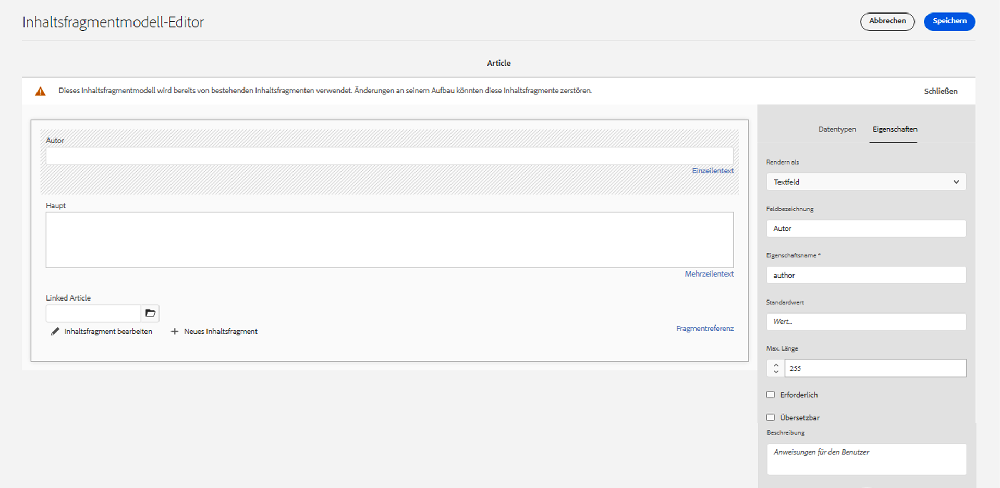

# AEM GraphQL-API zur Verwendung mit Inhaltsfragmenten {#graphql-api-for-use-with-content-fragments}

Erfahren Sie, wie Sie Inhaltsfragmente in Adobe Experience Manager (AEM) as a Cloud Service mit der AEM GraphQL-API für die Headless-Bereitstellung von Inhalten verwenden.

Die mit Inhaltsfragmenten verwendete GraphQL-API von AEM as a Cloud Service basiert stark auf der standardmäßigen Open-Source-GraphQL-API.

Die Verwendung der GraphQL-API in AEM ermöglicht die effiziente Bereitstellung von Inhaltsfragmenten an JavaScript-Clients in Headless CMS-Implementierungen:

* Vermeiden von iterativen API-Anfragen wie bei REST,
* Sicherstellen, dass die Bereitstellung auf die spezifischen Anforderungen beschränkt ist,
* Ermöglichen der Massenbereitstellung von genau dem, was zum Rendern als Antwort auf eine einzelne API-Anfrage benötigt wird.

>[!NOTE]
>
>GraphQL wird derzeit in zwei (separaten) Szenarios in Adobe Experience Manager (AEM) as a Cloud Service verwendet:
>
>* [AEM Commerce nutzt Daten von einer Commerce-Plattform über GraphQL](/help/commerce-cloud/integrating/magento.md).
>* AEM-Inhaltsfragmente stellen in Kombination mit der AEM-GraphQL-API (einer auf GraphQL basierenden benutzerdefinierten Implementierung) strukturierte Inhalte für die Verwendung in Ihren Programmen bereit.

>[!NOTE]
>
>Weitere Informationen finden Sie unter [AEM-APIs für die strukturierte Bereitstellung und Verwaltung von Inhalten](/help/headless/apis-headless-and-content-fragments.md). Dort erhalten Sie einen Überblick über die verschiedenen verfügbaren APIs und einen Vergleich einiger der beteiligten Konzepte.

>[!NOTE]
>
>Aktuelle Informationen zu Experience Manager-APIs finden Sie unter [Adobe Experience Manager as a Cloud Service-APIs](https://developer.adobe.com/experience-cloud/experience-manager-apis/).

## Die GraphQL-API {#graphql-api}

GraphQL ist:

* „*...eine Abfragesprache für APIs und eine Laufzeitumgebung zur Erfüllung dieser Abfragen mit Ihren vorhandenen Daten. GraphQL bietet eine vollständige und verständliche Beschreibung der Daten in Ihrer API, gibt Kunden die Möglichkeit, genau das abzufragen, was sie benötigen, und nicht mehr, macht es einfacher, APIs im Laufe der Zeit weiterzuentwickeln, und ermöglicht leistungsstarke Entwicklerwerkzeuge.*“

  Weitere Informationen finden Sie unter [GraphQL.org](https://graphql.org)

* „*...eine offene Spezifikation für eine flexible API-Schicht. Legen Sie GraphQL über Ihre bestehenden Backends, um Produkte schneller als je zuvor zu erstellen ...*“

  Weitere Informationen finden Sie unter [GraphQL entdecken](https://www.graphql.com).

* *„... eine Datenabfragesprache und -spezifikation, die 2012 intern von Facebook entwickelt wurde, bevor sie 2015 öffentlich als Open Source zur Verfügung gestellt wurde. Es bietet eine Alternative zu REST-basierten Architekturen mit dem Ziel, die Produktivität der Entwickler zu erhöhen und die Menge der übertragenen Daten zu minimieren. GraphQL wird von Hunderten von Unternehmen aller Größenordnungen in der Produktion eingesetzt ...“*

  Siehe [GraphQL Foundation](https://foundation.graphql.org/).

<!--
"*Explore GraphQL is maintained by the Apollo team. Our goal is to give developers and technical leaders around the world the tools they need to understand and adopt GraphQL.*". 
-->

Weitere Informationen zur GraphQL-API finden Sie in den folgenden Abschnitten (neben vielen anderen Ressourcen):

* Unter [graphql.org](https://graphql.org):

   * [Einführung in GraphQL](https://graphql.org/learn)

   * [GraphQL-Spezifikation](https://spec.graphql.org/)

* Unter [graphql.com](https://graphql.com):

   * [Handbücher](https://www.graphql.com/guides/)

   * [Tutorials](https://www.graphql.com/tutorials/)

   * [Fallstudien](https://www.graphql.com/case-studies/)

Die Implementierung von GraphQL für AEM basiert auf der standardmäßigen GraphQL-Java-Bibliothek. Siehe:

* [graphQL.org – Java](https://graphql.org/code/#java)

* [GraphQL-Java auf GitHub](https://github.com/graphql-java)

### GraphQL-Terminologie {#graphql-terminology}

GraphQL verwendet Folgendes:

* **[Abfragen](https://graphql.org/learn/queries/)**

* **[Schemata und Typen](https://graphql.org/learn/schema/)**:

   * Schemata werden von AEM basierend auf den Inhaltsfragmentmodellen generiert.
   * GraphQL stellt mithilfe Ihrer Schemata die Typen und Vorgänge dar, die für die GraphQL-Implementierung für AEM zulässig sind.

* **[Felder](https://graphql.org/learn/queries/#fields)**

* **[GraphQL-Endpunkt](graphql-endpoint.md)**
   * Der Pfad in AEM, der auf GraphQL-Abfragen antwortet und Zugriff auf die GraphQL-Schemata bietet.

   * Weitere Informationen finden Sie unter [Aktivieren des GraphQL-Endpunkts](graphql-endpoint.md).

In der [(GraphQL.org) Einführung in GraphQL](https://graphql.org/learn/) finden Sie ausführliche Informationen, einschließlich der [Best Practices](https://graphql.org/learn/best-practices/).

### GraphQL-Abfragetypen {#graphql-query-types}

Mit GraphQL können Sie Abfragen für Folgendes durchführen:

* Einen **einzelnen Eintrag**

* Eine **[Liste von Einträgen](https://graphql.org/learn/schema/#lists-and-non-null)**

AEM bietet Funktionen zum Konvertieren von Abfragen (beide Typen) in [Persistente Abfragen, die vom Dispatcher und ](/help/headless/graphql-api/persisted-queries.md) CDN zwischengespeichert werden können.

### Best Practices für GraphQL-Abfragen (Dispatcher und CDN) {#graphql-query-best-practices}

Die [persistenten Abfragen](/help/headless/graphql-api/persisted-queries.md) sind die empfohlene Methode für die Nutzung bei Veröffentlichungsinstanzen, da:

* sie zwischengespeichert werden
* sie zentral von AEM as a Cloud Service verwaltet werden

>[!NOTE]
>
>Normalerweise gibt es keinen Dispatcher/kein CDN auf der Autoreninstanz, sodass die Verwendung persistenter Abfragen dort keinen Vorteil bringt, außer dass sie getestet werden können.

GraphQL-Abfragen über POST werden nicht empfohlen, da sie nicht zwischengespeichert werden. Daher ist der Dispatcher auf einer Standardinstanz so konfiguriert, dass er solche Abfragen blockiert.

GraphQL unterstützt zwar auch GET-Anfragen, diese können jedoch Einschränkungen unterliegen (z. B. die Länge der URL), die durch die Verwendung persistierter Abfragen vermieden werden können.

Weitere Informationen finden Sie unter [Aktivieren der Caching-Funktion für persistierte Abfragen](/help/headless/deployment/dispatcher-caching.md).

>[!NOTE]
>
>Um direkte und/oder POST-Abfragen im Dispatcher zuzulassen, können Sie Ihren Systemadministrator bzw. Ihre Systemadministratorin bitten, Folgendes zu tun:
>
>* Eine [Cloud Manager-Umgebungsvariable](/help/implementing/cloud-manager/environment-variables.md) mit dem Namen `ENABLE_GRAPHQL_ENDPOINT`
>* und dem Wert `true` erstellen

>[!NOTE]
>
>Die Möglichkeit, direkte Abfragen durchzuführen, könnte irgendwann in der Zukunft entfernt werden.

### GraphiQL-IDE {#graphiql-ide}

Zusätzlich können Sie GraphQL-Abfragen mit der [GraphiQL-IDE](/help/headless/graphql-api/graphiql-ide.md) testen und debuggen.

## Anwendungsfälle für Autoren und Autorinnen, Vorschau und Veröffentlichung {#use-cases-author-preview-publish}

Die Anwendungsfälle können vom Typ der AEM as a Cloud Service-Umgebung abhängig sein:

* Veröffentlichungsumgebung; wird verwendet, um:
   * Daten für das JS-Programm (Standardanwendungsfall) abzufragen

* Vorschauumgebung; wird verwendet, um:
   * eine Vorschau der Abfragen vor der Bereitstellung in der Publishing-Umgebung anzuzeigen
      * Daten für das JS-Programm (Standardanwendungsfall) abzufragen

* Autorenumgebung; wird verwendet, um:
   * Daten für „Content-Management-Zwecke“ abzufragen:
      * GraphQL in AEM as a Cloud Service ist derzeit eine schreibgeschützte API.
      * Die REST-API kann für CR(u)D-Vorgänge verwendet werden.

## Berechtigungen {#permission}

Die Berechtigungen sind diejenigen, die für den Zugriff auf Assets erforderlich sind.

GraphQL-Abfragen werden mit der Berechtigung der AEM-Benutzenden der zugrunde liegenden Anfrage ausgeführt. Wenn die Benutzenden keinen Lesezugriff auf einige (als Assets gespeicherte) Fragmente haben, werden diese nicht Teil der Ergebnismenge.

Außerdem benötigen die Benutzenden Zugriff auf einen GraphQL-Endpunkt, um GraphQL-Abfragen ausführen zu können.

## Schema-Generierung {#schema-generation}

GraphQL ist eine stark typisierte API, was bedeutet, dass die Daten klar strukturiert und nach Typ geordnet sein müssen.

Die GraphQL-Spezifikation enthält eine Reihe von Richtlinien zum Erstellen einer robusten API zum Abfragen von Daten in einer bestimmten Instanz. Dazu muss ein Client das [Schema](#schema-generation) abrufen, das alle für eine Abfrage erforderlichen Typen enthält.

Bei Inhaltsfragmenten basieren die GraphQL-Schemata (Struktur und Typen) auf **aktivierten** [Inhaltsfragmentmodellen](/help/sites-cloud/administering/content-fragments/managing-content-fragment-models.md) und deren Datentypen.

>[!CAUTION]
>
>Alle GraphQL-Schemata (abgeleitet von Inhaltsfragmentmodellen, die **aktiviert** wurden) können über den GraphQL-Endpunkt gelesen werden.
>
>Das bedeutet, dass Sie sicherstellen müssen, dass keine vertraulichen Daten verfügbar sind, da sie auf diese Weise an die Öffentlichkeit gelangen könnten. Dazu gehören beispielsweise Informationen, die als Feldnamen in der Modelldefinition vorhanden sein könnten.

Wenn Benutzende beispielsweise ein Inhaltsfragmentmodell mit dem Namen `Article` erstellen, generiert AEM den GraphQL-Typ `ArticleModel`. Die Felder dieses Typs entsprechen den im Modell definierten Feldern und Datentypen. Außerdem werden einige Einstiegspunkte für Abfragen erstellt, die für diesen Typ gelten, z. B. `articleByPath` oder `articleList`.

1. Ein Inhaltsfragmentmodell:

   

1. Das entsprechende GraphQL-Schema (Ausgabe aus der automatischen GraphiQL-Dokumentation):
   

   Dies zeigt, dass der generierte Typ `ArticleModel` mehrere [Felder](#fields) enthält.

   * Drei davon wurden vom Benutzer kontrolliert: `author`, `main` und `referencearticle`.

   * Die anderen Felder wurden automatisch von AEM hinzugefügt und helfen, Informationen zu einem bestimmten Inhaltsfragment bereitzustellen. In diesem Beispiel (die [Hilfsfelder](#helper-fields)) `_path`, `_metadata` und `_variations`.

1. Nachdem ein Benutzer ein Inhaltsfragment basierend auf dem Modell „Article“ erstellt hat, kann es über GraphQL abgefragt werden. Beispiele finden Sie in den [Beispielabfragen](/help/headless/graphql-api/sample-queries.md#graphql-sample-queries) (basierend auf einer [Beispielstruktur für Inhaltsfragmente zur Verwendung mit GraphQL](/help/headless/graphql-api/sample-queries.md#content-fragment-structure-graphql)).

In GraphQL für AEM ist das Schema flexibel. Dies bedeutet, dass es jedes Mal automatisch generiert wird, wenn ein Inhaltsfragmentmodell erstellt, aktualisiert oder gelöscht wird. Die Datenschema-Caches werden auch aktualisiert, wenn Sie ein Inhaltsfragmentmodell aktualisieren.

<!-- move the following to a separate "in depth" page -->

Die Datenschema-Caches werden auch aktualisiert, wenn Sie ein Inhaltsfragmentmodell aktualisieren.

Der Sites GraphQL-Service überwacht (im Hintergrund) alle Änderungen, die an einem Inhaltsfragmentmodell vorgenommen werden. Wenn Aktualisierungen erkannt werden, wird nur dieser Teil des Schemas neu generiert. Diese Optimierung spart Zeit und sorgt für Stabilität.

Wenn Sie zum Beispiel:

1. ein Paket installieren, das `Content-Fragment-Model-1` und `Content-Fragment-Model-2` enthält:

   1. GraphQL-Typen werden für `Model-1` und `Model-2` generiert.

1. Ändern Sie anschließend `Content-Fragment-Model-2`:

   1. Nur der GraphQL-Typ `Model-2` wird aktualisiert.

   1. `Model-1` bleibt unverändert.

>[!NOTE]
>
>Dies ist wichtig, wenn Sie Massenaktualisierungen von Inhaltsfragmentmodellen über die REST-API oder auf andere Weise durchführen möchten.

Das Schema wird über denselben Endpunkt wie die GraphQL-Abfragen bereitgestellt, wobei der Client die Tatsache behandelt, dass das Schema mit der `GQLschema`-Erweiterung aufgerufen wird. Wenn Sie beispielsweise eine einfache `GET`-Anfrage an `/content/cq:graphql/global/endpoint.GQLschema` ausführen, wird das Schema mit dem Inhaltstyp ausgegeben: `text/x-graphql-schema;charset=iso-8859-1`.

<!-- move through to here to a separate "in depth" page -->

### Schemagenerierung – Nicht veröffentlichte Modelle {#schema-generation-unpublished-models}

Wenn Inhaltsfragmente verschachtelt sind, kann es vorkommen, dass ein übergeordnetes Inhaltsfragmentmodell veröffentlicht wird, ein referenziertes Modell jedoch nicht.

>[!NOTE]
>
>Die AEM-Benutzeroberfläche verhindert dies, aber wenn die Veröffentlichung programmgesteuert oder mit Inhaltspaketen erfolgt, kann es vorkommen.

In diesem Fall generiert AEM ein *unvollständiges* Schema für das übergeordnete Inhaltsfragmentmodell. Das bedeutet, dass die Fragmentreferenz, die vom nicht veröffentlichten Modell abhängt, aus dem Schema entfernt wird.

## Felder {#fields}

Innerhalb des Schemas gibt es einzelne Felder, die zwei grundlegenden Kategorien angehören:

* Von Ihnen generierte Felder.

  Eine Auswahl von [Datentypen](#Data-types) wird verwendet, um Felder basierend auf der Konfiguration Ihres Inhaltsfragmentmodells zu erstellen. Die Feldnamen werden dem Feld **Eigenschaftsname** auf der Registerkarte **Datentyp** entnommen.

   * Daneben gibt es auch die Einstellung **Rendern als**, da Benutzende bestimmte Datentypen konfigurieren können. Beispielsweise kann ein einzeiliges Textfeld so konfiguriert werden, dass es mehrere einzeilige Texte enthält, indem `multifield` aus der Dropdown-Liste ausgewählt wird.

* GraphQL für AEM generiert auch eine Reihe von [Hilfsfeldern](#helper-fields).

### Datentypen {#data-types}

GraphQL für AEM unterstützt eine Liste von Typen. Alle unterstützten Datentypen für Inhaltsfragmentmodelle und die entsprechenden GraphQL-Typen werden dargestellt:

| Datentyp für Inhaltsfragmentmodelle | GraphQL-Typ | Beschreibung |
|--- |--- |--- |
| Einzeilentext | `String`, `[String]` | Wird für einfache Zeichenfolgen wie Autorennamen, Ortsnamen usw. verwendet. |
| Mehrzeilentext | `String`, `[String]` | Wird für die Ausgabe von Text verwendet, z. B. für den Textkörper eines Artikels |
| Zahl | `Float`, `[Float]` | Wird für die Anzeige von Gleitkommazahlen und regulären Zahlen verwendet |
| Boolesch | `Boolean` | Wird für die Anzeige von Kontrollkästchen → einfachen Wahr/Falsch-Aussagen verwendet |
| Datum und Uhrzeit | `Calendar` | Wird verwendet, um Datum und Uhrzeit in einem ISO 8601-Format anzuzeigen. Je nach ausgewähltem Typ gibt es drei Varianten, die in AEM-GraphQL verwendet werden können: `onlyDate`, `onlyTime`, `dateTime` |
| Aufzählung | `String` | Wird verwendet, um eine Option aus einer Liste von Optionen anzuzeigen, die bei der Modellerstellung definiert wurde |
| Tags | `[String]` | Wird verwendet, um eine Liste von Zeichenfolgen anzuzeigen, die in AEM verwendete Tags darstellen |
| Inhaltsreferenz | `String`, `[String]` | Wird verwendet, um den Pfad zu einem anderen Asset in AEM anzuzeigen |
| Inhaltsreferenz (UUID) | `String`, `[String]` | Wird verwendet, um den durch eine UUID dargestellten Pfad zu einem anderen Asset in AEM anzuzeigen |
| Fragmentreferenz | *Ein Modelltyp* <br><br>Einzelnes Feld: `Model` – Modelltyp, direkt referenziert <br><br>Multifeld, mit einem referenzierten Typ: `[Model]`: Array vom Typ `Model`, direkt referenziert von Array <br><br>Multifeld, mit mehreren referenzierten Typen: `[AllFragmentModels]`: Array aller Modelltypen, referenziert von Array mit Vereinigungstyp  |  Wird verwendet, um auf ein oder mehrere Inhaltsfragmente bestimmter Modelltypen zu verweisen, die beim Erstellen des Modells definiert wurden |
| Fragmentreferenz (UUID) | *Ein Modelltyp* <br><br>Einzelnes Feld: `Model` – Modelltyp, direkt referenziert <br><br>Multifeld, mit einem referenzierten Typ: `[Model]`: Array vom Typ `Model`, direkt referenziert von Array <br><br>Multifeld, mit mehreren referenzierten Typen: `[AllFragmentModels]`: Array aller Modelltypen, referenziert von Array mit Vereinigungstyp  |  Wird verwendet, um auf ein oder mehrere Inhaltsfragmente bestimmter Modelltypen zu verweisen, die beim Erstellen des Modells definiert wurden |

{style="table-layout:auto"}

### Hilfsfelder {#helper-fields}

Zusätzlich zu den Datentypen für benutzergenerierte Felder generiert GraphQL für AEM auch mehrere *Hilfsfelder*, um ein Inhaltsfragment zu identifizieren oder zusätzliche Informationen über ein Inhaltsfragment bereitzustellen.

Diese [Hilfsfelder](#helper-fields) sind durch ein vorangestelltes `_` gekennzeichnet, um zu unterscheiden, was vom Benutzer bzw. von der Benutzerin definiert und was automatisch generiert wurde.

#### Pfad  {#path}

Das Pfadfeld wird in AEM GraphQL als Kennung verwendet. Es stellt den Pfad des Inhaltsfragment-Assets im AEM Repository dar. Wir haben es als Kennung für ein Inhaltsfragment ausgewählt, da es:

* innerhalb von AEM eindeutig ist,
* leicht abgerufen werden kann.

Der folgende Code zeigt die Pfade aller Inhaltsfragmente an, die auf der Grundlage des Inhaltsfragmentmodells `Author` erstellt wurden, das im WKND-Tutorial vorgestellt wurde.

```graphql
{
  authorList {
    items {
      _path
    }
  }
}
```

Um ein einzelnes Inhaltsfragment eines bestimmten Typs abzurufen, müssen Sie zuerst dessen Pfad bestimmen. Zum Beispiel:

```graphql
{
  authorByPath(_path: "/content/dam/wknd-shared/en/contributors/sofia-sj-berg") {
    item {
      _path
      firstName
      lastName
    }
  }
}
```

Siehe [Beispielabfrage – ein einzelnes Fragment für eine bestimmte Stadt](/help/headless/graphql-api/sample-queries.md#sample-single-specific-city-fragment).

#### ID (UUID) {#id-uuid}

Das ID-Feld wird in AEM GraphQL auch als Kennung verwendet. Es stellt den Pfad des Inhaltsfragment-Assets im AEM-Repository dar, enthält jedoch nicht den tatsächlichen Pfad, sondern eine UUID, die für die Ressource steht. Wir haben es als Kennung für ein Inhaltsfragment ausgewählt, da es:

* innerhalb von AEM eindeutig ist,
* leicht abgerufen werden kann,
* sich nicht ändert, wenn die Ressource verschoben wird.

Die UUID für ein Inhaltsfragment und für ein referenziertes Inhaltsfragment oder Asset kann über die JSON-Eigenschaft `_id` zurückgegeben werden.

```graphql
{
  articleList {
    items {
        _id
        _path
    }
  }
}
```

#### Metadaten {#metadata}

Mit GraphQL stellt AEM auch die Metadaten eines Inhaltsfragments zur Verfügung. Metadaten sind die Informationen, die ein Inhaltsfragment beschreiben, z. B. der Titel eines Inhaltsfragments, der Miniaturbildpfad, die Beschreibung eines Inhaltsfragments, das Erstellungsdatum usw.

Da Metadaten über den Schema-Editor generiert werden und daher keine bestimmte Struktur haben, wurde der GraphQL-Typ `TypedMetaData` implementiert, um die Metadaten eines Inhaltsfragments anzuzeigen. `TypedMetaData` stellt die Informationen gruppiert nach den folgenden Skalartypen bereit:

| Feld |
|--- |
| `stringMetadata:[StringMetadata]!` |
| `stringArrayMetadata:[StringArrayMetadata]!` |
| `intMetadata:[IntMetadata]!` |
| `intArrayMetadata:[IntArrayMetadata]!` |
| `floatMetadata:[FloatMetadata]!` |
| `floatArrayMetadata:[FloatArrayMetadata]!` |
| `booleanMetadata:[BooleanMetadata]!` |
| `booleanArrayMetadata:[booleanArrayMetadata]!` |
| `calendarMetadata:[CalendarMetadata]!` |
| `calendarArrayMetadata:[CalendarArrayMetadata]!` |

Jeder Skalartyp repräsentiert entweder ein einzelnes Name-Wert-Paar oder ein Array von Name-Wert-Paaren, wobei der Wert dieses Paares dem Typ entspricht, in dem er gruppiert wurde.

Wenn Sie beispielsweise den Titel eines Inhaltsfragments abrufen möchten, wissen wir, dass diese Eigenschaft eine Zeichenfolgeneigenschaft ist. Daher würden wir eine Abfrage für alle Zeichenfolgenmetadaten durchführen:

Abfragen von Metadaten:

```graphql
{
  authorByPath(_path: "/content/dam/wknd-shared/en/contributors/sofia-sj-berg") {
    item {
      _metadata {
        stringMetadata {
          name
          value
        }
      }
    }
  }
}
```

Sie können alle GraphQL-Typen für Metadaten anzeigen, wenn Sie das generierte GraphQL-Schema anzeigen. Alle Modelltypen haben dieselben `TypedMetaData`.

>[!NOTE]
>
>**Unterschied zwischen normalen und Array-Metadaten**
>&#x200B;>Beachten Sie, dass sich `StringMetadata` und `StringArrayMetadata` beide auf das beziehen, was im Repository gespeichert ist, und nicht darauf, wie Sie sie abrufen.
>
>Wenn Sie beispielsweise das Feld `stringMetadata` aufrufen, erhalten Sie ein Array aller im Repository gespeicherten Metadaten als `String` und wenn Sie `stringArrayMetadata` aufrufen, erhalten Sie ein Array aller Metadaten, die im Repository als `String[]` gespeichert wurden.

Weitere Informationen finden Sie unter [Beispielabfrage für Metadaten – Liste der Metadaten für Auszeichnungen mit dem Titel „GB“](/help/headless/graphql-api/sample-queries.md#sample-metadata-awards-gb).

#### Varianten {#variations}

Das Feld `_variations` wurde implementiert, um die Abfrage der Varianten eines Inhaltsfragments zu vereinfachen. Zum Beispiel:

```graphql
{
  authorByPath(_path: "/content/dam/wknd-shared/en/contributors/ian-provo") {
    item {
      _variations
    }
  }
}
```

>[!NOTE]
>
>Das Feld `_variations` enthält keine `master`-Varianten, weil die Originaldaten (in der Benutzeroberfläche als *Master* referenziert) technisch gesehen nicht als explizite Varianten betrachtet werden.

Weitere Informationen finden Sie unter [Beispielabfrage – Alle Städte mit einer gegebenen Variante](/help/headless/graphql-api/sample-queries.md#sample-cities-named-variation).

>[!NOTE]
>
>Wenn die angegebene Variante für ein Inhaltsfragment nicht vorhanden ist, werden die Originaldaten (auch bekannt als primäre Variante) als Standard (Ersatz) zurückgegeben.

<!--
## Security Considerations {#security-considerations}
-->

## GraphQL-Variablen {#graphql-variables}

Mit GraphQL können Variablen in die Abfrage eingefügt werden. Weitere Informationen finden Sie in der [GraphQL-Dokumentation für Variablen](https://graphql.org/learn/queries/#variables).

Um beispielsweise alle Inhaltsfragmente des Typs `Author` in einer bestimmten Variante abzurufen (falls verfügbar), können Sie in GraphiQL das Argument `variation` angeben.


**Abfrage**:

```graphql
query($variation: String!) {
  authorList(variation: $variation) {
    items {
      _variation
      lastName
      firstName
    }
  }
}
```

**Abfragevariablen**:

```json
{
  "variation": "another"
}
```

Diese Abfrage gibt die vollständige Autorenliste zurück. Autorinnen und Autoren ohne die Variante `another` greifen auf die Originaldaten zurück (`_variation` meldet in diesem Fall `master`).

Wenden Sie einen [Filter](#filtering) an, wenn Sie die Liste auf Autorinnen und Autoren beschränken möchten, die die angegebene Variante bereitstellen (und Autorinnen und Autoren überspringen möchten, die auf die Originaldaten zurückgreifen würden):

```graphql
query($variation: String!) {
  authorList(variation: $variation, filter: {
    _variation: {
      _expressions: {
        value: $variation
      }
    }
  }) {
    items {
      _variation
      lastName
      firstName
    }
  }
}
```

## GraphQL-Anweisungen {#graphql-directives}

In GraphQL besteht die Möglichkeit, die Abfrage basierend auf Variablen zu ändern, die als GraphQL-Anweisungen bezeichnet werden.

Sie können beispielsweise das Feld `adventurePrice` basierend auf einer Variablen `includePrice` in eine Abfrage für alle `AdventureModels` einfügen.


**Abfrage**:

```graphql
query GetAdventureByType($includePrice: Boolean!) {
  adventureList {
    items {
      title
      price @include(if: $includePrice)
    }
  }
}
```

**Abfragevariablen**:

```json
{
    "includePrice": true
}
```

## Filtern {#filtering}

Sie können auch Filterung in Ihren GraphQL-Abfragen verwenden, um bestimmte Daten zurückzugeben.

Beim Filtern wird eine Syntax verwendet, die auf logischen Operatoren und Ausdrücken basiert.

Der kleinste Teil ist ein einzelner Ausdruck, der auf den Inhalt eines bestimmten Felds angewendet werden kann. Er vergleicht den Inhalt des Felds mit einem gegebenen konstanten Wert.

Beispielsweise würde der Ausdruck

```graphql
{
  value: "some text"
  _op: EQUALS
}
```

den Inhalt des Felds mit dem Wert `some text` vergleichen und wäre erfolgreich, wenn der Inhalt dem Wert entspricht. Andernfalls schlägt der Ausdruck fehl.

Die folgenden Operatoren können verwendet werden, um Felder mit einem bestimmten Wert zu vergleichen:

| Operator | Typ(en) | Der Ausdruck ist erfolgreich, wenn ... |
|--- |--- |--- |
| `EQUALS` | `String`, `ID`, `Boolean` | ... der Wert identisch mit dem Inhalt des Felds ist |
| `EQUALS_NOT` | `String`, `ID` | ... der Wert *nicht* identisch mit dem Inhalt des Felds ist |
| `CONTAINS` | `String` | ... der Inhalt des Felds den Wert enthält (`{ value: "mas", _op: CONTAINS }` passt zu `Christmas`, `Xmas`, `master`, ...) |
| `CONTAINS_NOT` | `String` | ... der Inhalt des Felds *nicht* den Wert enthält |
| `STARTS_WITH` | `ID` | ... die ID mit einem bestimmten Wert beginnt (`{ value: "/content/dam/", _op: STARTS_WITH` passt zu `/content/dam/path/to/fragment`, aber nicht zu `/namespace/content/dam/something`) |
| `EQUAL` | `Int`, `Float` | ... der Wert identisch mit dem Inhalt des Felds ist |
| `UNEQUAL` | `Int`, `Float` | ... der Wert *nicht* identisch mit dem Inhalt des Felds ist |
| `GREATER` | `Int`, `Float` | ... der Inhalt des Felds größer als der Wert ist |
| `GREATER_EQUAL` | `Int`, `Float` | ... der Inhalt des Felds größer oder gleich dem Wert ist |
| `LOWER` | `Int`, `Float` | ... der Inhalt des Felds kleiner als der Wert ist |
| `LOWER_EQUAL` | `Int`, `Float` | ... der Inhalt des Felds kleiner oder gleich dem Wert ist |
| `AT` | `Calendar`, `Date`, `Time` | ... der Inhalt des Felds mit dem Wert identisch ist (einschließlich Zeitzoneneinstellung) |
| `NOT_AT` | `Calendar`, `Date`, `Time` | ... der Inhalt des Felds *nicht* identisch mit dem Wert ist |
| `BEFORE` | `Calendar`, `Date`, `Time` | ... der durch den Wert angegebene Zeitpunkt vor dem durch den Feldinhalt angegebenen Zeitpunkt liegt |
| `AT_OR_BEFORE` | `Calendar`, `Date`, `Time` | ... der durch den Wert angegebene Zeitpunkt vor oder am selben durch den Feldinhalt angegebenen Zeitpunkt liegt |
| `AFTER` | `Calendar`, `Date`, `Time` | ... der durch den Wert angegebene Zeitpunkt nach dem durch den Feldinhalt angegebenen Zeitpunkt liegt |
| `AT_OR_AFTER` | `Calendar`, `Date`, `Time` | ... der durch den Wert angegebene Zeitpunkt nach oder am selben durch den Feldinhalt angegebenen Zeitpunkt liegt |

Bei einigen Typen können Sie auch zusätzliche Optionen angeben, mithilfe derer die Auswertung eines Ausdrucks geändert werden kann:

| Option | Typ(en) | Beschreibung |
|--- |--- |--- |
| `_ignoreCase` | `String` | Ignoriert die Groß- und Kleinschreibung einer Zeichenkette, ein Wert von `time` entspricht z. B. `TIME`, `time`, `tImE`, ... |
| `_sensitiveness` | `Float` | Ermöglicht eine bestimmte Spanne für `float`-Werte, die als identisch betrachtet werden (um technische Einschränkungen aufgrund der internen Darstellung von `float`-Werten zu umgehen; sollte vermieden werden, da diese Option negative Auswirkungen auf die Leistung haben kann |

Ausdrücke können mithilfe eines logischen Operators (`_logOp`) zu einer Gruppe kombiniert werden:

* `OR` – die Ausdrucksgruppe ist erfolgreich, wenn mindestens ein Ausdruck erfolgreich ist
* `AND` – die Ausdrucksgruppe ist erfolgreich, wenn alle Ausdrücke erfolgreich sind (Standard)

Jedes Feld kann anhand einer eigenen Ausdrucksgruppe gefiltert werden. Die Ausdrucksgruppen aller im Filterargument erwähnten Felder werden schließlich durch einen eigenen logischen Operator kombiniert.

Eine Filterdefinition (als das `filter`-Argument an eine Abfrage übergeben) enthält:

* Eine Unterdefinition für jedes Feld (auf das Feld kann über seinen Namen zugegriffen werden, z. B. gibt es ein `lastName`-Feld im Filter für das `lastName`-Feld im Daten(feld)typ)
* Jede Unterdefinition enthält das `_expressions`-Array, das die Ausdrucksgruppe bereitstellt, und das `_logOp`-Feld, das den logischen Operator definiert, mit dem die Ausdrücke kombiniert werden sollten
* Jeder Ausdruck wird durch den Wert (`value`-Feld) und den Operator (`_operator`-Feld) definiert, mit dem der Inhalt eines Felds verglichen werden soll

Sie können `_logOp` auslassen, wenn Sie Elemente mit `AND` kombinieren wollen, und `_operator`, wenn Sie auf Gleichheit prüfen wollen, da dies die Standardwerte sind.

Das folgende Beispiel zeigt eine vollständige Abfrage, die alle Personen filtert, die über eine `lastName` von `Provo` verfügen oder `sjö` enthalten, ohne die Groß-/Kleinschreibung zu beachten:

```graphql
{
  authorList(filter: {
    lastname: {
      _logOp: OR
      _expressions: [
        {
          value: "sjö",
          _operator: CONTAINS,
          _ignoreCase: true
        },
        {
          value: "Provo"
        }
      ]
    }
  }) {
    items {
      lastName
      firstName
    }
  }
}
```

Sie können zwar auch nach verschachtelten Feldern filtern, dies wird jedoch nicht empfohlen, da es zu Leistungsproblemen führen kann.

Weitere Beispiele finden Sie unter:

* Details zu den [Erweiterungen von GraphQL für AEM](#graphql-extensions)

* [Beispielabfragen unter Verwendung dieses Beispielinhalts und dieser Beispielstruktur](/help/headless/graphql-api/sample-queries.md#graphql-sample-queries-sample-content-fragment-structure)

   * Und [Beispielinhalt und -struktur](/help/headless/graphql-api/sample-queries.md#content-fragment-structure-graphql) speziell für die Verwendung in Beispielabfragen

* [Beispielabfragen basierend auf dem WKND-Projekt](/help/headless/graphql-api/sample-queries.md#sample-queries-using-wknd-project)

## Sortieren {#sorting}

>[!NOTE]
>
>Für optimale Leistung sollten Sie [Ihre Inhaltsfragmente für Paging und Sortierung in der GraphQL-Filterung](/help/headless/graphql-api/graphql-optimized-filtering-content-update.md) aktualisieren.

Mit dieser Funktion können Sie die Abfrageergebnisse entsprechend einem bestimmten Feld sortieren.

Die Sortierkriterien:

* ist eine durch Kommas getrennte Liste von Werten, die den Feldpfad darstellen
   * das erste Feld in der Liste definiert die primäre Sortierreihenfolge, das zweite Feld wird verwendet, wenn zwei Werte der primären Sortierkriterien gleich sind, das dritte, wenn die ersten beiden Kriterien gleich sind, usw.
   * gepunktete Notation, z. B. „field1.subfield.subfield“ usw.
* mit optionaler Sortierrichtung
   * ASC (aufsteigend) oder DESC (absteigend); standardmäßig wird ASC angewendet
   * die Richtung kann pro Feld angegeben werden. Dies bedeutet, dass Sie ein Feld in aufsteigender Reihenfolge sortieren können, ein anderes in absteigender Reihenfolge (name, firstName DESC)

Zum Beispiel:

```graphql
query {
  authorList(sort: "lastName, firstName") {
    items {
      firstName
      lastName
    }
  }
}
```

Ein weiteres Beispiel:

```graphql
{
  authorList(sort: "lastName DESC, firstName DESC") {
    items {
        lastName
        firstName
    }
  }
}
```

Sie können auch ein Feld innerhalb eines verschachtelten Fragments mithilfe des Formats `nestedFragmentname.fieldname` sortieren.

>[!NOTE]
>
>Dies kann sich negativ auf die Leistung auswirken.

Zum Beispiel:

```graphql
query {
  articleList(sort: "authorFragment.lastName")  {
    items {
      title
      authorFragment {
        firstName
        lastName
        birthDay
      }
      slug
    }
  }
}
```

## Paging {#paging}

>[!NOTE]
>
>Für optimale Leistung sollten Sie [Ihre Inhaltsfragmente für Paging und Sortierung in der GraphQL-Filterung](/help/headless/graphql-api/graphql-optimized-filtering-content-update.md) aktualisieren.

Mit dieser Funktion können Sie Paging für Abfragetypen durchführen, was eine Liste zurückgibt. Es werden zwei Methoden bereitgestellt:

* `offset` und `limit` in einer `List`-Abfrage
* `first` und `after` in einer `Paginated`-Abfrage

### Listenabfrage – Versatz und Limit {#list-offset-limit}

In einer `...List`-Abfrage können Sie `offset` und `limit` verwenden, um eine bestimmte Teilmenge der Ergebnisse zurückzugeben:

* `offset`: Gibt den ersten zurückzugebenden Datensatz an
* `limit`: Gibt die maximale Anzahl an zurückzugebenden Datensätzen an

Beispiel für die Ausgabe der Ergebnisseite, die bis zu fünf Artikel enthält, beginnend mit dem fünften Artikel aus der *vollständigen* Ergebnisliste:

```graphql
query {
   articleList(offset: 5, limit: 5) {
    items {
      authorFragment {
        lastName
        firstName
      }
    }
  }
}
```

<!-- When available link to BP and replace "JCR query level" with a more neutral term. -->

<!-- When available link to BP and replace "JCR query result set" with a more neutral term. -->

>[!NOTE]
>
>* Für das Paging ist eine stabile Sortierreihenfolge erforderlich, damit es bei mehreren Abfragen, die verschiedene Seiten desselben Ergebnisses anfordern, korrekt funktioniert. Standardmäßig wird der Repository-Pfad jedes Elements des Ergebnissatzes verwendet, um sicherzustellen, dass die Reihenfolge immer gleich ist. Wenn eine andere Sortierreihenfolge verwendet wird und diese Sortierung nicht auf JCR-Abfrageebene durchgeführt werden kann, hat dies negative Auswirkungen auf die Leistung, da der gesamte Ergebnissatz in den Speicher geladen werden muss, bevor die Seiten bestimmt werden können.
>
>* Je höher der Versatz, desto länger dauert es, die Elemente aus der vollständigen JCR-Abfrageergebnismenge zu überspringen. Eine alternative Lösung für große Ergebnissätze ist die Verwendung der paginierten Abfrage mit der `first`- und `after`-Methode.

### Paginiete Abfrage – „first“ und „after“ {#paginated-first-after}

Der Abfragetyp `...Paginated` verwendet die meisten `...List`-Abfragetypfunktionen (Filtern, Sortieren), verwendet jedoch anstelle von `offset`/`limit`-Argumenten die `first`/`after`-Argumente gemäß der Definition in der [GraphQL-Cursor-Verbindungsspezifikation](https://relay.dev/graphql/connections.htm). Eine weniger formale Einführung finden Sie in der [Einführung in GraphQL](https://graphql.org/learn/pagination/#pagination-and-edges).

* `first`: Die `n` ersten zurückzugebenden Elemente.
Der Standardwert lautet `50`.
Der Maximalwert ist `100`.
* `after`: Der Cursor, der den Anfang der angeforderten Seite bestimmt; zu beachten ist, dass das durch den Cursor dargestellte Element nicht in der Ergebnismenge enthalten ist; der Cursor eines Elements wird durch das Feld `cursor` der `edges`-Struktur bestimmt.

Ein Beispiel für die Ausgabe einer Ergebnisseite mit bis zu fünf Abenteuern, beginnend mit dem angegebenen Cursor-Element in der *vollständigen* Ergebnisliste:

```graphql
query {
    adventurePaginated(first: 5, after: "ODg1MmMyMmEtZTAzMy00MTNjLThiMzMtZGQyMzY5ZTNjN2M1") {
        edges {
          cursor
          node {
            title
          }
        }
        pageInfo {
          endCursor
          hasNextPage
        }
    }
}
```

<!-- When available link to BP -->
<!-- Due to internal technical constraints, performance will degrade if sorting and filtering is applied on nested fields. Therefore it is recommended to use filter/sort fields stored at root level. For more information, see the [Best Practices document](link). -->

>[!NOTE]
>
>* Standardmäßig verwendet Paging die UUID des Repository-Knotens, der das Sortierungsfragment darstellt, um sicherzustellen, dass die Reihenfolge der Ergebnisse immer gleich ist. Wenn `sort` verwendet wird, wird die UUID implizit genutzt um eine eindeutige Sortierung sicherzustellen, auch für zwei Elemente mit identischen Sortierschlüsseln.
>
>* Aufgrund interner technischer Einschränkungen wird die Leistung beeinträchtigt, wenn die Sortierung und Filterung auf verschachtelte Felder angewendet wird. Es wird daher empfohlen, auf der Stammebene gespeicherte Filter-/Sortierfelder zu verwenden. Dies ist auch die empfohlene Methode, um große paginierte Ergebnismengen abzufragen.

## Web-optimierte Bildbereitstellung in GraphQL-Abfragen {#web-optimized-image-delivery-in-graphql-queries}

Mit einer Web-optimierten Bildbereitstellung können Sie eine GraphQL-Abfrage verwenden, um:

* Anfordern einer URL für ein DAM-Asset-Bild (referenziert durch eine **Inhaltsreferenz**)

* Parameter mit der Abfrage zu übergeben, sodass automatisch eine bestimmte Ausgabedarstellung des Bildes generiert und zurückgegeben wird

  >[!NOTE]
  >
  >Die angegebene Ausgabedarstellung wird nicht in AEM Assets gespeichert. Die Ausgabedarstellung wird generiert und für einen kurzen Zeitraum im Cache gespeichert.

* Die URL als Teil der JSON-Bereitstellung zurückzugeben

Sie können AEM verwenden, um:

* [Web-optimierte Bildbereitstellung](https://experienceleague.adobe.com/docs/experience-manager-core-components/using/developing/web-optimized-image-delivery.html?lang=de) in GraphQL-Abfragen zu übergeben.

Dies bedeutet, dass die Befehle bei der Ausführung der Abfrage auf die gleiche Weise angewendet werden wie URL-Parameter bei GET-Anfragen für diese Bilder.

Auf diese Weise können Sie Bildausgabeformate für die JSON-Bereitstellung dynamisch erstellen, sodass Sie diese Ausgabedarstellungen nicht manuell erstellen und im Repository speichern müssen.

Die Lösung in GraphQL bietet Ihnen folgende Möglichkeiten:

* Eine URL anfordern: Verwenden Sie `_dynamicUrl` für den Verweis `ImageRef`.

* Parameter übergeben: Fügen Sie `_assetTransform` in den Header der Liste ein, in der Ihre Filter definiert sind.

>[!NOTE]
>
>Eine **Inhaltsreferenz** kann sowohl für DAM- als auch für Dynamic Media-Assets verwendet werden. Zum Abrufen der entsprechenden URL werden verschiedene Parameter verwendet:
>* `_dynamicUrl`: ein DAM-Asset
>* `_dmS7Url`: ein Dynamic Media-Asset
> 
>Wenn es sich bei dem referenzierten Asset um ein DAM-Asset handelt, ist der Wert für `_dmS7Url` `null`. Siehe [Bereitstellung von Dynamic Media-Assets nach URL in GraphQL-Abfragen](#dynamic-media-asset-delivery-by-url).

### Struktur der Umwandlungsanfrage {#structure-transformation-request}

`AssetTransform` (`_assetTransform`) wird verwendet, um die URL-Umwandlungsanfragen zu stellen.

Die Struktur und Syntax sind:

* `format`: eine Auflistung mit allen unterstützten Formaten durch ihre Erweiterung: GIF, PNG, PNG8, JPG, PJPG, BJPG, WEBP, WEBPLL oder WEBPLY
* `seoName`: eine Zeichenfolge, die anstelle des Knotennamens als Dateiname verwendet wird
* `crop`: eine Rahmenunterstruktur, wenn Breite oder Höhe weggelassen wird, wird die Höhe bzw. Breite als derselbe Wert verwendet
   * `xOrigin`: der x-Ursprung des Rahmens und ist obligatorisch
   * `yOrigin`: der y-Ursprung des Rahmens und ist obligatorisch
   * `width`: die Breite des Rahmens
   * `height`: die Höhe des Rahmens
* `size`: eine Unterstruktur der Dimension, wenn die Breite oder Höhe weggelassen wird, wird die Höhe bzw. Breite als derselbe Wert verwendet
   * `width`: die Breite der Dimension
   * `height`: die Höhe der Dimension
* `rotation`: eine Auflistung aller unterstützten Rotationen: R90, R180, R270
* `flip`: eine Auflistung von HORIZONTAL, VERTICAL, HORIZONTAL_AND_VERTICAL
* `quality`: eine Ganzzahl zwischen 1 und 100, die den Prozentsatz der Bildqualität angibt
* `width`: eine Ganzzahl, die die Breite des Ausgabebilds definiert, aber vom Bildgenerator ignoriert wird

Die URL-Umwandlung ist für alle Abfragetypen verfügbar: nach Pfad, Liste oder mit Paginierung.

### Web-optimierte Bildbereitstellung mit vollständigen Parametern {#web-optimized-image-delivery-full-parameters}

Im Folgenden finden Sie eine Beispielabfrage mit einem vollständigen Satz von Parametern:

```graphql
{
  articleList(
    _assetTransform: {
      format:GIF
      seoName:"test"
      crop:{
        xOrigin:10
        yOrigin:20
        width:50
        height:45
      }
      size:{
        height:100
        width:200
      }
      rotation:R90
      flip:HORIZONTAL_AND_VERTICAL
      quality:55
      width:123
    }
  ) {
    items {
      _path
      featuredImage {
        ... on ImageRef {
          _dynamicUrl
        }
      }
    }
  }
}
```

### Web-optimierte Bildbereitstellung mit einer einzelnen Abfragevariable {#web-optimized-image-delivery-single-query-variable}

Das folgende Beispiel zeigt die Verwendung einer einzelnen Abfragevariable:

```graphql
query ($seoName: String!) {
  articleList(
    _assetTransform: {
      format:GIF
      seoName:$seoName
      crop:{
        xOrigin:10
        yOrigin:20
        width:50
        height:45
      }
      size:{
        height:100
        width:200
      }
      rotation:R90
      flip:HORIZONTAL_AND_VERTICAL
      quality:55
      width:123
    }
  ) {
    items {
      _path
      featuredImage {
        ... on ImageRef {
          _dynamicUrl
        }
      }
    }
  }
}
```

### Web-optimierte Bildbereitstellung mit mehreren Abfragevariablen {#web-optimized-image-delivery-multiple-query-variables}

Das folgende Beispiel zeigt die Verwendung mehrerer Abfragevariablen:

```graphql
query ($seoName: String!, $format: AssetTransformFormat!) {
  articleList(
    _assetTransform: {
      format:$format
      seoName:$seoName
      crop:{
        xOrigin:10
        yOrigin:20
        width:50
        height:45
      }
      size:{
        height:100
        width:200
      }
      rotation:R90
      flip:HORIZONTAL_AND_VERTICAL
      quality:55
      width:123
    }
  ) {
    items {
      _path
      featuredImage {
        ... on ImageRef {
          _dynamicUrl
        }
      }
    }
  }
}
```

### Web-optimierte Bildbereitstellungsanfrage nach URL {#web-optimized-image-delivery-request-url}

Wenn Sie Ihre Abfrage als persistierte Abfrage speichern (z. B. unter dem Namen `dynamic-url-x`), können Sie die persistierte Abfrage direkt [ausführen](/help/headless/graphql-api/persisted-queries.md#execute-persisted-query).

Verwenden Sie beispielsweise die folgenden URLs, um die vorherigen Beispiele direkt auszuführen (gespeichert als persistierte Abfragen):

* [Einzelner Parameter](#dynamic-image-delivery-single-specified-parameter); Persistierte Abfrage namens `dynamic-url-x`

   * `http://localhost:4502/graphql/execute.json/wknd-shared/dynamic-url-x;seoName=xxx`

     Die Antwort sieht wie folgt aus:

     

* [Mehrere Parameter](#dynamic-image-delivery-multiple-specified-parameters); Persistierte Abfrage namens `dynamic`

   * `http://localhost:4502/graphql/execute.json/wknd-shared/dynamic;seoName=billiboy;format=GIF;`

     >[!CAUTION]
     >
     >Das abschließende `;`ist obligatorisch, um die Liste der Parameter sauber zu beenden.

### Einschränkungen bei der Web-optimierten Bereitstellung von Bildern {#web-optimized-image-delivery-limitations}

Die folgenden Einschränkungen gelten:

* Modifikatoren, die auf alle Bilder in der Abfrage angewendet werden (globale Parameter)

* Zwischenspeichern von Kopfzeilen

   * Keine Zwischenspeicherung bei Author
   * Zwischenspeicherung bei Publish – Alter von maximal 10 Minuten (kann vom Client nicht geändert werden)

## Bereitstellung von Dynamic Media-Assets nach URL in GraphQL-Abfragen{#dynamic-media-asset-delivery-by-url}

Mit GraphQL für AEM-Inhaltsfragmente können Sie eine URL für ein AEM Dynamic Media (Scene7)-Asset anfordern (referenziert durch eine **Inhaltsreferenz**).

Die Lösung in GraphQL bietet Ihnen folgende Möglichkeiten:

* Verwenden von `_dmS7Url` für die Referenz `ImageRef`
   * Ansehen einer [Beispielabfrage für die Bereitstellung von Dynamic Media-Assets nach URL – Bildverweis](#sample-query-dynamic-media-asset-delivery-by-url-imageref)
* Verwenden von `_dmS7Url` für mehrere Verweise; `ImageRef`, `MultimediaRef` und `DocumentRef`
   * Ansehen einer [Beispielabfrage für die Bereitstellung von Dynamic Media-Assets nach URL – Mehrere Verweise](#sample-query-dynamic-media-asset-delivery-by-url-multiple-refs)

* Verwenden von `_dmS7Url` mit der Funktion für das smarte Zuschneiden

   * Die Eigenschaft `_smartCrops` legt die Konfigurationen für das smarte Zuschneiden offen, die für ein bestimmtes Asset verfügbar sind

   * Siehe [Beispielabfrage für die Bereitstellung von Dynamic Media-Assets nach URL – mit smartem Zuschneiden](#sample-query-dynamic-media-asset-delivery-by-url-smart-crop)

>[!NOTE]
>
>Dazu müssen Sie über eine [Dynamic Media Cloud-Konfiguration](/help/assets/dynamic-media/config-dm.md) verfügen.
>
>Dies fügt die Attribute `dam:scene7File` und `dam:scene7Domain` zu den Metadaten des Assets hinzu, wenn es erstellt wird.

>[!NOTE]
>
>Eine **Inhaltsreferenz** kann sowohl für DAM- als auch für Dynamic Media-Assets verwendet werden. Zum Abrufen der entsprechenden URL werden verschiedene Parameter verwendet:
>
>* `_dmS7Url`: ein Dynamic Media-Asset
>* `_dynamicUrl`: ein DAM-Asset
> 
>Wenn es sich bei dem referenzierten Asset um ein Dynamic Media-Asset handelt, ist der Wert für `_dynamicURL` `null`. Siehe [Web-optimierte Bildbereitstellung in GraphQL-Abfragen](#web-optimized-image-delivery-in-graphql-queries).

### Beispielabfrage für die Bereitstellung von Dynamic Media-Assets nach URL – Bildverweis{#sample-query-dynamic-media-asset-delivery-by-url-imageref}

Es folgt eine Beispielabfrage:
* für mehrere Inhaltsfragmente vom Typ `team` und `person`, die einen `ImageRef` zurückgeben

```graphql
query allTeams {
  teamList {
    items {
      _path
      title
      teamMembers {
        fullName
        profilePicture {
          __typename
          ... on ImageRef{
            _dmS7Url
            height
            width
          }
        }
      }
    }
  }
} 
```

### Beispielabfrage für die Bereitstellung von Dynamic Media-Assets nach URL – Mehrere Verweise{#sample-query-dynamic-media-asset-delivery-by-url-multiple-refs}

Es folgt eine Beispielabfrage:
* für mehrere Inhaltsfragmente vom Typ `team` und `person`, die einen `ImageRef`, `MultimediaRef` und `DocumentRef` zurückgeben:

```graphql
query allTeams {
  teamList {
    items {
      _path
      title
      teamMembers {
        fullName
        profilePicture {
          __typename
          ... on ImageRef{
            _dmS7Url
            height
            width
          }
        }
       featureVideo {
          __typename
          ... on MultimediaRef{
            _dmS7Url
            size
          }
        }
      about-me {
          __typename
          ... on DocumentRef{
            _dmS7Url
            _path
          }
        }
      }
    }
  }
}
```

### Beispielabfrage für die Bereitstellung von Dynamic Media-Assets nach URL – mit smartem Zuschneiden {#sample-query-dynamic-media-asset-delivery-by-url-smart-crop}

Es folgt eine Beispielabfrage:

* zum Anzeigen der für die angeforderten Assets verfügbaren Konfigurationen für das smarte Zuschneiden

```graphql
query allTeams {
  teamList {
    items {
      title
      teamMembers {
        profilePicture {
          ... on ImageRef {
            height
            width
            _dmS7Url
            _smartCrops {
              width
              height
              name
            }
          }
        }
      }
    }
  }
} 
```

## Dynamic Media für die Unterstützung von OpenAPI-Assets (Remote-Assets) {#dynamic-media-for-openapi-asset-support}

Dank der Integration von [Remote-Assets](/help/sites-cloud/administering/content-fragments/authoring.md#reference-remote-assets) können Sie im Inhaltsfragmenteditor auf Assets verweisen, die nicht lokal in der aktuellen AEM-Instanz vorhanden sind. Sie wird von Dynamic Media für die Unterstützung von OpenAPI-Assets im Inhaltsfragmenteditor und in GraphQL JSON implementiert.

### Beispielabfrage für Dynamic Media für die Unterstützung von OpenAPI-Assets (Remote-Assets) {#sample-query-dynamic-media-for-openapi-asset-support}

Es folgt eine Beispielabfrage:

* So lässt sich das Konzept der Referenzierung von Remote-Assets veranschaulichen

  ```graphql
  {
    testModelList {
      items {
        remoteasset {
          ... on RemoteRef {
              repositoryId
                  assetId
          }
        }
        multiplecontent {
          ... on ImageRef {
            _path
            _authorUrl
            _publishUrl
          }
          ... on RemoteRef {
              repositoryId
              assetId
          }
        }
      }
      _references {
        ... on ImageRef {
            _path
            _authorUrl
            _publishUrl
          }
          ... on RemoteRef {
              repositoryId
              assetId
          }
      }
    }
  }
  ```

* die Antwort

  ```graphql
  {
    "data": {
      "testModelList": {
        "items": [
          {
            "remoteasset": {
              "repositoryId": "delivery-p123456-e123456.adobeaemcloud.com",
              "assetId": "urn:aaid:aem:1fb05fe4-c12b-4f85-b1ca-aa92cdbd6a62"
            },
            "multiplecontent": [
              {
                "repositoryId": "delivery-p123456-e123456.adobeaemcloud.com",
                "assetId": "urn:aaid:aem:1fb05fe4-c12b-4f85-b1ca-aa92cdbd6a62"
              },
              {
                "_path": "/content/dam/test-folder/test.jpg",
                "_authorUrl": "http://localhost:4502/content/dam/test-folder/test.jpg",
                "_publishUrl": "http://localhost:4503/content/dam/test-folder/test.jpg"
              }
            ]
          }
        ],
        "_references": [
          {
            "repositoryId": "delivery-p123456-e123456.adobeaemcloud.com",
            "assetId": "urn:aaid:aem:1fb05fe4-c12b-4f85-b1ca-aa92cdbd6a62"
          },
          {
            "_path": "/content/dam/test-folder/test.jpg",
            "_authorUrl": "http://localhost:4502/content/dam/test-folder/test.jpg",
            "_publishUrl": "http://localhost:4503/content/dam/test-folder/test.jpg"
          }
        ]
      }
    }
  }  
  ```

**Einschränkungen**

Derzeit gelten folgende Einschränkungen:

* Die Bereitstellung von GraphQL unterstützt nur `repositoryId` und `assetId` (andere Asset-Metadaten werden nicht zurückgegeben).

  >[!NOTE]
  >
  >Die vollständige URL muss dann Client-seitig und basierend auf der [Asset-Bereitstellungs-API](https://developer.adobe.com/experience-cloud/experience-manager-apis/api/stable/assets/delivery/#operation/getAssetSeoFormat) erstellt werden.

* Nur *genehmigte* Assets stehen für Verweise aus den Remote-Repositorys zur Verfügung.
* Wenn ein Asset, auf das verwiesen wird, aus dem Remote-Repository entfernt wird, führt dies zu einer beschädigten Asset-Referenz für Inhaltsfragmente.
* Alle Repositorys für Bereitstellungs-Assets, auf die Benutzende Zugriff haben, stehen zur Auswahl. Die Liste „Verfügbar“ kann nicht beschränkt werden.
* Sowohl die AEM-Instanz als auch die Remote-Asset-Repository-Instanz müssen dieselbe Version aufweisen.
* Über das [Management Sites-API](https://developer.adobe.com/experience-cloud/experience-manager-apis/api/stable/sites/) und die [Bereitstellung von AEM-Inhaltsfragmenten mit OpenAPI](https://developer.adobe.com/experience-cloud/experience-manager-apis/api/stable/contentfragments/delivery/?lang=de) werden keine Asset-Metadaten verfügbar gemacht. Sie müssen die Asset-Metadaten-API verwenden, um die Details der Asset-Metadaten abzurufen.

## GraphQL für AEM – Zusammenfassung der Erweiterungen {#graphql-extensions}

Die grundlegende Funktionsweise von Abfragen mit GraphQL für AEM entspricht der Standard-GraphQL-Spezifikation. Für GraphQL-Abfragen mit AEM gibt es einige Erweiterungen:

* Wenn Sie ein einzelnes Ergebnis benötigen:
   * Verwenden Sie den Modellnamen; z. B. Stadt

* Wenn Sie eine Ergebnisliste erwarten:
   * Fügen Sie `List` zum Modellnamen hinzu, z. B. `cityList`
   * Siehe [Beispielabfrage – Alle Informationen zu allen Städten](/help/headless/graphql-api/sample-queries.md#sample-all-information-all-cities)

  Sie haben dann folgende Möglichkeiten:

   * [Ergebnisse sortieren](#sorting)

      * `ASC`: Aufsteigend
      * `DESC`: Absteigend

   * Ergebnisseite zurückgeben mit einer der folgenden Möglichkeiten:

      * [einer Listenabfrage mit Versatz und Limit](#list-offset-limit)
      * [einer paginierten Abfrage mit „zuerst“ und „danach“](#paginated-first-after)

   * Siehe [Beispielabfrage – Alle Informationen zu allen Städten](/help/headless/graphql-api/sample-queries.md#sample-all-information-all-cities)

* Der Filter `includeVariations` ist in den Abfragetypen `List` und `Paginated` enthalten. Um Inhaltsfragmentvarianten in den Abfrageergebnissen abzurufen, muss der Filter `includeVariations` auf `true` festgelegt sein.

   * Siehe [Beispielabfrage für mehrere Inhaltsfragmente und deren Varianten eines bestimmten Modells](/help/headless/graphql-api/sample-queries.md#sample-wknd-multiple-fragment-variations-given-model)

  >[!CAUTION]
  >Der Filter `includeVariations` und das vom System generierte Feld `_variation` können nicht zusammen in derselben Abfragedefinition verwendet werden.

* Wenn Sie ein logisches ODER verwenden möchten:
   * Verwenden Sie ` _logOp: OR`
   * [Beispielabfrage – Alle Personen mit dem Namen „Jobs“ oder „Smith“](/help/headless/graphql-api/sample-queries.md#sample-all-persons-jobs-smith)

* Es gibt ebenfalls ein logisches UND, es ist aber (oft) implizit.

* Sie können Feldnamen abfragen, die den Feldern im Inhaltsfragmentmodell entsprechen.
   * [Beispielabfrage – Vollständige Details über den CEO und die Mitarbeiter eines Unternehmens](/help/headless/graphql-api/sample-queries.md#sample-full-details-company-ceos-employees)

* Zusätzlich zu den Feldern aus Ihrem Modell gibt es einige vom System generierte Felder (denen ein Unterstrich vorangestellt ist):

   * Für Inhalte:

      * `_locale`: Anzeigen der Sprache; basierend auf Language Manager
         * Siehe [Beispielabfrage für mehrere Inhaltsfragmente eines bestimmten Gebietsschemas](/help/headless/graphql-api/sample-queries.md#sample-wknd-multiple-fragments-given-locale)

      * `_metadata`: Anzeigen von Metadaten für Ihr Fragment
         * Siehe [Beispielabfrage für Metadaten – Liste der Metadaten für Auszeichnungen mit dem Titel „GB“](/help/headless/graphql-api/sample-queries.md#sample-metadata-awards-gb)

      * `_model`: Zulassen von Abfragen nach einem Inhaltsfragmentmodell (Pfad und Titel)
         * Siehe [Beispielabfrage für ein Inhaltsfragmentmodell anhand eines Modells](/help/headless/graphql-api/sample-queries.md#sample-wknd-content-fragment-model-from-model)

      * `_path`: Der Pfad zu Ihrem Inhaltsfragment im Repository
         * Siehe [Beispielabfrage – ein Einzelstadtfragment](/help/headless/graphql-api/sample-queries.md#sample-single-specific-city-fragment)

      * `_id`: Die UUID für Ihr Inhaltsfragment im Repository

         * Siehe [Beispielabfrage für ein Inhaltsfragment eines bestimmten Modells mit UUID-Referenzen](/help/headless/graphql-api/sample-queries.md#sample-wknd-fragment-specific-model-uuid-references)
         * [Siehe „Beispielabfrage für Inhaltsfragmente nach UUID-Referenz“](/help/headless/graphql-api/sample-queries.md#sample-wknd-fragment-specific-model-uuid-reference)

      * `_reference`: Anzeigen von Verweisen; einschließlich Inline-Verweisen im Rich-Text-Editor
         * Siehe [Beispielabfrage für mehrere Inhaltsfragmente mit vorab abgerufenen Verweisen](/help/headless/graphql-api/sample-queries.md#sample-wknd-multiple-fragments-prefetched-references)

      * `_variation`: Anzeige bestimmter Varianten in Ihrem Inhaltsfragment

        >[!NOTE]
        >
        >Wenn die angegebene Variante für ein Inhaltsfragment nicht vorhanden, wird standardmäßig die primäre Variante (als Ersatz) zurückgegeben.

        >[!CAUTION]
        >
        >Das systemgenerierte Feld `_variation` kann nicht zusammen mit dem Filter `includeVariations` verwendet werden.

         * Weitere Informationen finden Sie unter [Beispielabfrage – Alle Städte mit einer gegebenen Variante](/help/headless/graphql-api/sample-queries.md#sample-cities-named-variation)

   * Für die Bildbereitstellung:

      * `_authorURL`: ist die vollständige URL zum Bild-Asset in AEM Author
      * `_publishURL`: ist die vollständige URL zum Bild-Asset in AEM Publish

      * Für die [Web-optimierte Bildbereitstellung](#web-optimized-image-delivery-in-graphql-queries) (von DAM-Assets):

         * `_dynamicUrl`: die vollständige URL zum Web-optimierten DAM-Asset auf dem Verweis `ImageRef`

           >[!NOTE]
           >
           >`_dynamicUrl` ist die bevorzugte URL für Web-optimierte DAM-Assets und sollte, wann immer möglich, die Verwendung von `_path`, `_authorUrl` und `_publishUrl` ersetzen.

         * `_assetTransform`: zur Übergabe von Parametern im Header der Liste, in der Ihre Filter definiert sind

         * Siehe:

            * [Beispielabfrage für die Web-optimierte Bereitstellung von Bildern mit allen Parametern](#web-optimized-image-delivery-full-parameters)

            * [Beispielabfrage für die Web-optimierte Bereitstellung von Bildern mit einem einzigen angegebenen Parameter](#web-optimized-image-delivery-single-query-variable)

      * `_dmS7Url`: in der `ImageRef`-Referenz für die Bereitstellung der URL an ein [Dynamic Media-Asset](#dynamic-media-asset-delivery-by-url)

         * Siehe [Beispielabfrage für die Bereitstellung von Dynamic Media-Assets nach URL – ImageRef](#sample-query-dynamic-media-asset-delivery-by-url-imageref)

         * Siehe [Beispielabfrage für die Bereitstellung von Dynamic Media-Assets nach URL – Mehrere Verweise](#sample-query-dynamic-media-asset-delivery-by-url-multiple-refs)

   * `_tags`: um die IDs von Inhaltsfragmenten oder Varianten anzuzeigen, die Tags enthalten (dies ist ein Array von `cq:tags`-Kennungen).

      * Siehe [Beispielabfrage – Namen aller Städte, die als Städtereisen markiert sind](/help/headless/graphql-api/sample-queries.md#sample-names-all-cities-tagged-city-breaks)
      * Siehe [Beispielabfrage für Inhaltsfragmentvarianten eines bestimmten Modells, an die ein bestimmtes Tag angehängt ist](/help/headless/graphql-api/sample-queries.md#sample-wknd-fragment-variations-given-model-specific-tag)
      * Siehe [Beispielabfrage mit Filtern nach _tags-ID und Ausschließen von Varianten](/help/headless/graphql-api/sample-queries.md#sample-filtering-tag-not-variations)
      * Siehe [Beispielabfrage mit Filtern nach _tags-ID und Einschließen von Varianten](/help/headless/graphql-api/sample-queries.md#sample-filtering-tag-with-variations)

     >[!NOTE]
     >
     >Tags können auch durch Auflisten der Metadaten eines Inhaltsfragments abgefragt werden.

   * Und Operationen:

      * `_operator`: bestimmte Operatoren anwenden: `EQUALS`, `EQUALS_NOT`, `GREATER_EQUAL`, `LOWER`, `CONTAINS`, `STARTS_WITH`
         * Siehe [Beispielabfrage – Alle Personen, die nicht den Namen „Jobs“ haben](/help/headless/graphql-api/sample-queries.md#sample-all-persons-not-jobs)
         * Siehe [Beispielabfrage – Alle Abenteuer, bei denen `_path` mit einem bestimmten Präfix beginnt](/help/headless/graphql-api/sample-queries.md#sample-wknd-all-adventures-cycling-path-filter)

      * `_apply`: bestimmte Bedingungen anwenden; zum Beispiel `AT_LEAST_ONCE`
         * Siehe [Beispielabfrage – Filtern eines Arrays nach einem Element, das mindestens einmal vorkommen muss](/help/headless/graphql-api/sample-queries.md#sample-array-item-occur-at-least-once)

      * `_ignoreCase`: Groß-/Kleinschreibung bei der Abfrage ignorieren
         * Siehe [Beispielabfrage – Alle Städte mit SAN im Namen, unabhängig von der Groß-/Kleinschreibung](/help/headless/graphql-api/sample-queries.md#sample-all-cities-san-ignore-case)

* GraphQL-Vereinigungstypen werden unterstützt:

   * Verwenden Sie `... on`
      * Siehe [Beispielabfrage für ein Inhaltsfragment eines bestimmten Modells mit einer Inhaltsreferenz](/help/headless/graphql-api/sample-queries.md#sample-wknd-fragment-specific-model-content-reference)

* Fallback bei der Abfrage verschachtelter Fragmente:

   * Wenn eine bestimmte Variante nicht in einem verschachtelten Fragment vorhanden ist, wird die **primäre** Variante ausgegeben.

## Abfragen des GraphQL-Endpunkts von einer externen Website {#query-graphql-endpoint-from-external-website}

Für den Zugriff auf den GraphQL-Endpunkt über eine externe Website müssen Sie Folgendes konfigurieren:

* [CORS-Filter](/help/headless/deployment/cross-origin-resource-sharing.md)
* [Referrer-Filter](/help/headless/deployment/referrer-filter.md)

## Authentifizierung {#authentication}

Siehe [Authentifizierung für AEM-GraphQL-Remote-Abfragen in Inhaltsfragmenten](/help/headless/security/authentication.md).

## Automatische Tests {#automated-testing}

Beim Ausführen einer Bereitstellungs-Pipeline in AEM Cloud Manager werden während der Pipeline-Ausführung automatisierte Tests ausgeführt.

Um genaue Ergebnisse zu erzielen, sollte Ihre AEM as a Cloud Service-**Staging-Umgebung** Ihre **Produktionsumgebung** so gut wie möglich widerspiegeln. Dies ist insbesondere für Inhalte wichtig.

Sie können dies erreichen, indem Sie in AEM as a Cloud Service mit dem Werkzeug zum [Kopieren von Inhalten](/help/implementing/developing/tools/content-copy.md) Produktionsinhalte in die Staging-Umgebung kopieren.

## Einschränkungen {#limitations}

Zum Schutz vor potenziellen Problemen gibt es Standardbeschränkungen für Abfragen:

* Die Abfrage darf nicht mehr als 1 Million (1024 × 1024) Zeichen enthalten.
* Die Abfrage darf nicht mehr als 15.000 Token enthalten.
* Die Abfrage darf nicht mehr als 200.000 Whitespace-Token enthalten.

Außerdem müssen Sie Folgendes beachten:

* Es wird ein Feldkonfliktfehler zurückgegeben, wenn Ihre GraphQL-Abfrage Felder mit demselben Namen in zwei (oder mehr) Modellen enthält und die folgenden Bedingungen erfüllt sind:

   * Etwa in folgendem Fall:

      * Zwei (oder mehr Modelle) als mögliche Verweise werden verwendet, wenn sie im Inhaltsfragmentverweis als zulässiger **Modelltyp** definiert sind.

     und:

      * Diese beiden Modelle haben Felder mit einem gemeinsamen Namen. Das bedeutet, dass in beiden Modellen der gleiche Name vorkommt.

     und

      * Diese Felder weisen unterschiedliche Datentypen auf.

   * Zum Beispiel:

      * Wenn zwei (oder mehr) Fragmente mit verschiedenen Modellen (z. B. `M1`, `M2`) als mögliche Verweise (Inhaltsverweis oder Fragmentverweis) aus einem anderen Fragment verwendet werden, z. B. `Fragment1` `MultiField/List`,
      * und diese beiden Fragmente mit verschiedenen Modellen (`M1`, `M2`) Felder mit demselben Namen, aber unterschiedlichen Typen haben.
Beispiel:
         * `M1.Title` als `Text`
         * `M2.Title` als `Text/MultiField`
      * Dann tritt ein Feldkonfliktfehler auf, wenn die GraphQL-Abfrage das `Title`-Feld enthält.

## Häufig gestellte Fragen {#faqs}

Es wurden folgende Fragen aufgeworfen:

1. **F**: „*Wie unterscheidet sich die GraphQL-API für AEM von der Query Builder-API?*“

   * **A**:
„*Die AEM-GraphQL-API bietet vollständige Kontrolle über die JSON-Ausgabe und ist ein Industriestandard für die Abfrage von Inhalten.
Für die Zukunft plant AEM, in die AEM GraphQL-API zu investieren.*“

## Tutorial – Erste Schritte mit AEM Headless und GraphQL {#tutorial}

Suchen Sie nach einem praktischen Tutorial? Lesen Sie das umfassende Tutorial [Erste Schritte mit AEM Headless und GraphQL](https://experienceleague.adobe.com/docs/experience-manager-learn/getting-started-with-aem-headless/graphql/overview.html?lang=de), in dem veranschaulicht wird, wie Inhalte mithilfe der GraphQL-APIs von AEM erstellt und verfügbar gemacht und von einer externen App in einem Headless CMS-Szenario verwendet werden.
