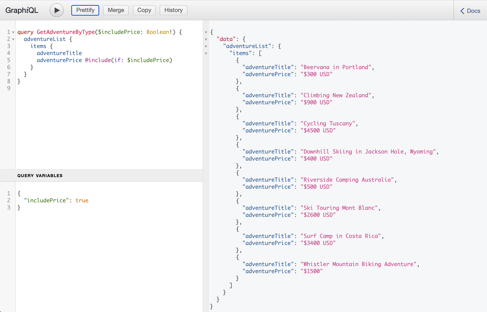

# AEM GraphQL-API zur Verwendung mit Inhaltsfragmenten {#graphql-api-for-use-with-content-fragments}

Erfahren Sie, wie Sie Inhaltsfragmente in Adobe Experience Manager (AEM) as a Cloud Service mit der AEM GraphQL-API für die Headless-Bereitstellung von Inhalten verwenden.

Die mit Inhaltsfragmenten verwendete GraphQL-API von AEM as a Cloud Service basiert stark auf der standardmäßigen Open-Source-GraphQL-API.

Die Verwendung der GraphQL-API in AEM ermöglicht die effiziente Bereitstellung von Inhaltsfragmenten an JavaScript-Clients in Headless CMS-Implementierungen:

* Vermeiden von iterativen API-Anfragen wie bei REST,
* Sicherstellen, dass die Bereitstellung auf die spezifischen Anforderungen beschränkt ist,
* Ermöglichen der Massenbereitstellung von genau dem, was zum Rendern als Antwort auf eine einzelne API-Anfrage benötigt wird.

>[!NOTE]
>
>GraphQL wird derzeit in zwei (separaten) Szenarios in Adobe Experience Manager (AEM) as a Cloud Service verwendet:
>
>* [AEM Commerce nutzt Daten von einer Commerce-Plattform über GraphQL](/help/commerce-cloud/integrating/magento.md).
>* AEM-Inhaltsfragmente stellen in Kombination mit der AEM-GraphQL-API (einer auf GraphQL basierenden benutzerdefinierten Implementierung) strukturierte Inhalte für die Verwendung in Ihren Programmen bereit.


## Die GraphQL-API {#graphql-api}

GraphQL ist:

* „*...eine Abfragesprache für APIs und eine Laufzeitumgebung zur Erfüllung dieser Abfragen mit Ihren vorhandenen Daten. GraphQL bietet eine vollständige und verständliche Beschreibung der Daten in Ihrer API, gibt Kunden die Möglichkeit, genau das abzufragen, was sie benötigen, und nicht mehr, macht es einfacher, APIs im Laufe der Zeit weiterzuentwickeln, und ermöglicht leistungsstarke Entwicklerwerkzeuge.*“

   Weitere Informationen finden Sie unter [GraphQL.org](https://graphql.org)

* „*...eine offene Spezifikation für eine flexible API-Schicht. Legen Sie GraphQL über Ihre bestehenden Backends, um Produkte schneller als je zuvor zu erstellen ...*“

   Weitere Informationen finden Sie unter [GraphQL entdecken](https://www.graphql.com).

* *„... eine Datenabfragesprache und -spezifikation, die 2012 intern von Facebook entwickelt wurde, bevor sie 2015 öffentlich als Open Source zur Verfügung gestellt wurde. Sie bietet eine Alternative zu REST-basierten Architekturen mit dem Ziel, die Produktivität von Entwicklern zu erhöhen und die Menge der übertragenen Daten zu minimieren. GraphQL wird von Hunderten von Unternehmen aller Größenordnungen in der Produktion eingesetzt ...“*

   Siehe [GraphQL Foundation](https://foundation.graphql.org/).

<!--
"*Explore GraphQL is maintained by the Apollo team. Our goal is to give developers and technical leaders around the world all of the tools they need to understand and adopt GraphQL.*". 
-->

Weitere Informationen zur GraphQL-API finden Sie in den folgenden Abschnitten (neben vielen anderen Ressourcen):

* Unter [graphql.org](https://graphql.org):

   * [Einführung in GraphQL](https://graphql.org/learn)

   * [GraphQL-Spezifikation](https://spec.graphql.org/)

* Unter [graphql.com](https://graphql.com):

   * [Handbücher](https://www.graphql.com/guides/)

   * [Tutorials](https://www.graphql.com/tutorials/)

   * [Fallstudien](https://www.graphql.com/case-studies/)

Die Implementierung von GraphQL für AEM basiert auf der standardmäßigen GraphQL-Java-Bibliothek. Siehe:

* [graphQL.org – Java](https://graphql.org/code/#java)

* [GraphQL-Java auf GitHub](https://github.com/graphql-java)

### GraphQL-Terminologie {#graphql-terminology}

GraphQL verwendet Folgendes:

* **[Abfragen](https://graphql.org/learn/queries/)**

* **[Schemata und Typen](https://graphql.org/learn/schema/)**:

   * Schemata werden von AEM basierend auf den Inhaltsfragmentmodellen generiert.
   * GraphQL stellt mithilfe Ihrer Schemata die Typen und Vorgänge dar, die für die GraphQL-Implementierung für AEM zulässig sind.

* **[Felder](https://graphql.org/learn/queries/#fields)**

* **[GraphQL-Endpunkt](graphql-endpoint.md)**
   * Der Pfad in AEM, der auf GraphQL-Abfragen antwortet und Zugriff auf die GraphQL-Schemata bietet.

   * Weitere Informationen finden Sie unter [Aktivieren des GraphQL-Endpunkts](graphql-endpoint.md).

In der [(GraphQL.org) Einführung in GraphQL](https://graphql.org/learn/) finden Sie ausführliche Informationen, einschließlich der [Best Practices](https://graphql.org/learn/best-practices/).

### GraphQL-Abfragetypen {#graphql-query-types}

Mit GraphQL können Sie Abfragen für Folgendes durchführen:

* Einen **einzelnen Eintrag**

* Eine **[Liste von Einträgen](https://graphql.org/learn/schema/#lists-and-non-null)**

AEM bietet Funktionen zum Konvertieren von Abfragen (beide Typen) in [Beständige Abfragen, die zwischengespeichert werden können](/help/headless/graphql-api/persisted-queries.md) durch den Dispatcher und das CDN.

### Best Practices für GraphQL-Abfragen (Dispatcher und CDN) {#graphql-query-best-practices}

Die [Beständige Abfragen](/help/headless/graphql-api/persisted-queries.md) sind die empfohlene Methode für Veröffentlichungsinstanzen, da:

* sie zwischengespeichert werden
* sie zentral von AEM as a Cloud Service verwaltet werden

>[!NOTE]
>
>Normalerweise gibt es keinen Dispatcher/CDN auf der Autoreninstanz, sodass die Verwendung persistenter Abfragen dort keinen Vorteil bringt. außer sie zu testen.

GraphQL-Abfragen, die POST-Anforderungen verwenden, werden nicht empfohlen, da sie nicht zwischengespeichert werden. Daher ist der Dispatcher in einer Standardinstanz so konfiguriert, dass solche Abfragen blockiert werden.

GraphQL unterstützt zwar auch GET-Anfragen, diese können jedoch Einschränkungen (z. B. die Länge der URL) erreichen, die durch die Verwendung persistenter Abfragen vermieden werden können.

>[!NOTE]
>
>Um direkte und/oder POST-Abfragen im Dispatcher zuzulassen, können Sie Ihren Systemadministrator bitten, Folgendes zu tun:
>
>* Erstellen Sie eine [Umgebungsvariable Cloud Manager](/help/implementing/cloud-manager/environment-variables.md) aufgerufen `ENABLE_GRAPHQL_ENDPOINT`
>* und dem Wert `true` erstellen


>[!NOTE]
>
>Die Möglichkeit, direkte Abfragen durchzuführen, könnte irgendwann in der Zukunft entfernt werden.

### GraphiQL-IDE {#graphiql-ide}

Zusätzlich können Sie GraphQL-Abfragen mit der [GraphiQL-IDE](/help/headless/graphql-api/graphiql-ide.md) testen und debuggen.

## Anwendungsfälle für Autoren- und Veröffentlichungsumgebungen {#use-cases-author-publish-environments}

Die Anwendungsfälle können vom Typ der AEM as a Cloud Service-Umgebung abhängig sein:

* Veröffentlichungsumgebung; wird verwendet, um:
   * Daten für das JS-Programm (Standardanwendungsfall) abzufragen

* Autorenumgebung; wird verwendet, um:
   * Daten für „Content-Management-Zwecke“ abzufragen:
      * GraphQL in AEM as a Cloud Service ist derzeit eine schreibgeschützte API.
      * Die REST-API kann für CR(u)D-Vorgänge verwendet werden.

## Berechtigungen {#permission}

Die Berechtigungen sind diejenigen, die für den Zugriff auf Assets erforderlich sind.

GraphQL-Abfragen werden mit der Berechtigung des AEM-Benutzers der zugrunde liegenden Anfrage ausgeführt. Wenn der Benutzer keinen Lesezugriff auf einige (als Assets gespeicherte) Fragmente hat, wird er nicht Teil der Ergebnismenge.

Außerdem muss der Benutzer Zugriff auf einen GraphQL-Endpunkt haben, um GraphQL-Abfragen ausführen zu können.

## Schema-Generierung {#schema-generation}

GraphQL ist eine stark typisierte API, was bedeutet, dass die Daten klar strukturiert und nach Typ geordnet sein müssen.

Die GraphQL-Spezifikation enthält eine Reihe von Richtlinien zum Erstellen einer robusten API zum Abfragen von Daten in einer bestimmten Instanz. Dazu muss ein Client das [Schema](#schema-generation) abrufen, das alle für eine Abfrage erforderlichen Typen enthält.

Bei Inhaltsfragmenten basieren die GraphQL-Schemata (Struktur und Typen) auf **aktivierten** [Inhaltsfragmentmodellen](/help/sites-cloud/administering/content-fragments/content-fragments-models.md) und deren Datentypen.

>[!CAUTION]
>
>Alle GraphQL-Schemata (abgeleitet von Inhaltsfragmentmodellen, die **aktiviert** wurden) können über den GraphQL-Endpunkt gelesen werden.
>
>Das bedeutet, dass Sie sicherstellen müssen, dass keine vertraulichen Daten verfügbar sind, da sie auf diese Weise an die Öffentlichkeit gelangen könnten. Dazu gehören beispielsweise Informationen, die als Feldnamen in der Modelldefinition vorhanden sein könnten.

Wenn ein Benutzer beispielsweise ein Inhaltsfragmentmodell mit dem Namen `Article`, generiert AEM einen GraphQL-Typ `ArticleModel`. Die Felder dieses Typs entsprechen den im Modell definierten Feldern und Datentypen. Außerdem werden einige Einstiegspunkte für Abfragen erstellt, die für diesen Typ gelten, z. B. `articleByPath` oder `articleList`.

1. Ein Inhaltsfragmentmodell:

   

1. Das entsprechende GraphQL-Schema (Ausgabe aus der automatischen GraphiQL-Dokumentation):
   

   Dies zeigt, dass der generierte Typ `ArticleModel` mehrere [Felder](#fields) enthält.

   * Drei davon wurden vom Benutzer kontrolliert: `author`, `main` und `referencearticle`.

   * Die anderen Felder wurden von AEM automatisch hinzugefügt und stellen hilfreiche Methoden zur Bereitstellung von Informationen über ein bestimmtes Inhaltsfragment dar. in diesem Beispiel (das [Helper-Felder](#helper-fields)) `_path`, `_metadata`, `_variations`.

1. Nachdem ein Benutzer ein Inhaltsfragment basierend auf dem Modell „Article“ erstellt hat, kann es über GraphQL abgefragt werden. Beispiele finden Sie in den [Beispielabfragen](/help/headless/graphql-api/sample-queries.md#graphql-sample-queries) (basierend auf einer [Beispielstruktur für Inhaltsfragmente zur Verwendung mit GraphQL](/help/headless/graphql-api/sample-queries.md#content-fragment-structure-graphql)).

In GraphQL für AEM ist das Schema flexibel. Dies bedeutet, dass es jedes Mal automatisch generiert wird, wenn ein Inhaltsfragmentmodell erstellt, aktualisiert oder gelöscht wird. Die Datenschema-Caches werden auch aktualisiert, wenn Sie ein Inhaltsfragmentmodell aktualisieren.

<!-- move the following to a separate "in depth" page -->

Die Datenschema-Caches werden auch aktualisiert, wenn Sie ein Inhaltsfragmentmodell aktualisieren.

Der Sites GraphQL-Service überwacht (im Hintergrund) alle Änderungen, die an einem Inhaltsfragmentmodell vorgenommen werden. Wenn Aktualisierungen erkannt werden, wird nur dieser Teil des Schemas neu generiert. Diese Optimierung spart Zeit und sorgt für Stabilität.

Wenn Sie zum Beispiel:

1. ein Paket installieren, das `Content-Fragment-Model-1` und `Content-Fragment-Model-2` enthält:

   1. Es werden GraphQL-Typen für `Model-1` und `Model-2` generiert.

1. anschließend `Content-Fragment-Model-2` ändern:

   1. Nur der GraphQL-Typ `Model-2` wird aktualisiert.

   1. `Model-1` bleibt unverändert.

>[!NOTE]
>
>Dies ist wichtig, wenn Sie Massenaktualisierungen von Inhaltsfragmentmodellen über die REST-API oder auf andere Weise durchführen möchten.

Das Schema wird über denselben Endpunkt wie die GraphQL-Abfragen bereitgestellt, wobei der Client die Tatsache behandelt, dass das Schema mit der `GQLschema`-Erweiterung aufgerufen wird. Wenn Sie beispielsweise eine einfache `GET`-Anfrage an `/content/cq:graphql/global/endpoint.GQLschema` ausführen, wird das Schema mit dem Inhaltstyp ausgegeben: `text/x-graphql-schema;charset=iso-8859-1`.

<!-- move through to here to a separate "in depth" page -->

### Schemagenerierung – Nicht veröffentlichte Modelle {#schema-generation-unpublished-models}

Wenn Inhaltsfragmente verschachtelt sind, kann es vorkommen, dass ein übergeordnetes Inhaltsfragmentmodell veröffentlicht wird, ein referenziertes Modell jedoch nicht.

>[!NOTE]
>
>Die AEM-Benutzeroberfläche verhindert dies, aber wenn die Veröffentlichung programmgesteuert oder mit Inhaltspaketen erfolgt, kann es vorkommen.

In diesem Fall generiert AEM ein *unvollständiges* Schema für das übergeordnete Inhaltsfragmentmodell. Das bedeutet, dass die Fragmentreferenz, die vom nicht veröffentlichten Modell abhängt, aus dem Schema entfernt wird.

## Felder {#fields}

Innerhalb des Schemas gibt es einzelne Felder, die zwei grundlegenden Kategorien angehören:

* Von Ihnen generierte Felder.

   Auswahl von [Datentypen](#Data-types) werden verwendet, um Felder basierend auf der Konfiguration Ihres Inhaltsfragmentmodells zu erstellen. Die Feldnamen stammen aus dem **Eigenschaftsname** des **Datentyp** Registerkarte.

   * Es gibt auch die **Rendern als** -Einstellung zu berücksichtigen, da Benutzer bestimmte Datentypen konfigurieren können. Beispielsweise kann ein einzeiliges Textfeld so konfiguriert werden, dass es mehrere einzeilige Texte enthält, indem Sie `multifield` aus dem Dropdown-Menü aus.

* GraphQL für AEM generiert auch eine Reihe von [Hilfsfeldern](#helper-fields).

### Datentypen {#data-types}

GraphQL für AEM unterstützt eine Liste von Typen. Alle unterstützten Datentypen für Inhaltsfragmentmodelle und die entsprechenden GraphQL-Typen werden dargestellt:

| Datentyp für Inhaltsfragmentmodelle | GraphQL-Typ | Beschreibung |
|--- |--- |--- |
| Einzeilentext | Zeichenfolge, [Zeichenfolge] |  Wird für einfache Zeichenfolgen wie Autorennamen, Ortsnamen usw. verwendet. |
| Mehrzeilentext | Zeichenfolge, [Zeichenfolge] |  Wird für die Ausgabe von Text verwendet, z. B. für den Textkörper eines Artikels |
| Zahl |  Gleitkommazahl, [Gleitkommazahl] | Wird für die Anzeige von Gleitkommazahlen und regulären Zahlen verwendet |
| Boolesch |  Boolesch |  Wird für die Anzeige von Kontrollkästchen → einfachen Wahr/Falsch-Aussagen verwendet |
| Datum und Uhrzeit | Kalender |  Wird verwendet, um Datum und Uhrzeit in einem ISO 8086-Format anzuzeigen. Je nach ausgewähltem Typ gibt es drei Varianten, die in AEM-GraphQL verwendet werden können: `onlyDate`, `onlyTime`, `dateTime` |
| Aufzählung |  Zeichenfolge |  Wird verwendet, um eine Option aus einer Liste von Optionen anzuzeigen, die bei der Modellerstellung definiert wurde |
|  Tags |  [Zeichenfolge] |  Wird verwendet, um eine Liste von Zeichenfolgen anzuzeigen, die in AEM verwendete Tags darstellen |
| Inhaltsreferenz |  Zeichenfolge, [Zeichenfolge] |  Wird verwendet, um den Pfad zu einem anderen Asset in AEM anzuzeigen |
| Fragmentreferenz |  *Ein Modelltyp* |  Wird verwendet, um auf ein anderes Inhaltsfragment eines bestimmten Modelltyps zu verweisen, das beim Erstellen des Modells definiert wurde |

### Hilfsfelder {#helper-fields}

Zusätzlich zu den Datentypen für benutzergenerierte Felder generiert GraphQL für AEM eine Reihe von *Hilfsfeldern*, um ein Inhaltsfragment zu identifizieren oder zusätzliche Informationen zu einem Inhaltsfragment bereitzustellen.

Diese [Hilfsfelder](#helper-fields) sind mit einem vorangestellten `_` gekennzeichnet, um zu unterscheiden, was vom Benutzer definiert und was automatisch generiert wurde.

#### Pfad  {#path}

Das Pfadfeld wird in AEM GraphQL als Kennung verwendet. Es stellt den Pfad des Inhaltsfragment-Assets im AEM Repository dar. Wir haben dies als Kennung eines Inhaltsfragments ausgewählt, da es:

* innerhalb von AEM eindeutig ist,
* leicht abgerufen werden kann.

Der folgende Code zeigt die Pfade aller Inhaltsfragmente an, die basierend auf dem Inhaltsfragmentmodell erstellt wurden `Author`, wie im WKND-Tutorial angegeben.

```graphql
{
  authorList {
    items {
      _path
    }
  }
}
```

Um ein einzelnes Inhaltsfragment eines bestimmten Typs abzurufen, müssen Sie auch zuerst dessen Pfad bestimmen. Beispiel:

```graphql
{
  authorByPath(_path: "/content/dam/wknd-shared/en/contributors/sofia-sj-berg") {
    item {
      _path
      firstName
      lastName
    }
  }
}
```

Siehe [Beispielabfrage – ein Einzelstadtfragment](/help/headless/graphql-api/sample-queries.md#sample-single-specific-city-fragment).

#### Metadaten {#metadata}

Mit GraphQL stellt AEM auch die Metadaten eines Inhaltsfragments zur Verfügung. Metadaten sind Informationen, die ein Inhaltsfragment beschreiben, z. B. den Titel eines Inhaltsfragments, den Miniaturpfad, die Beschreibung eines Inhaltsfragments, das Datum, an dem es erstellt wurde, usw.

Da Metadaten über den Schema-Editor generiert werden und daher keine bestimmte Struktur haben, wurde der GraphQL-Typ `TypedMetaData` implementiert, um die Metadaten eines Inhaltsfragments anzuzeigen. `TypedMetaData` stellt die Informationen gruppiert nach den folgenden Skalartypen bereit:

| Feld |
|--- |
| `stringMetadata:[StringMetadata]!` |
| `stringArrayMetadata:[StringArrayMetadata]!` |
| `intMetadata:[IntMetadata]!` |
| `intArrayMetadata:[IntArrayMetadata]!` |
| `floatMetadata:[FloatMetadata]!` |
| `floatArrayMetadata:[FloatArrayMetadata]!` |
| `booleanMetadata:[BooleanMetadata]!` |
| `booleanArrayMetadata:[booleanArrayMetadata]!`  |
| `calendarMetadata:[CalendarMetadata]!` |
| `calendarArrayMetadata:[CalendarArrayMetadata]!` |

Jeder Skalartyp repräsentiert entweder ein einzelnes Name-Wert-Paar oder ein Array von Name-Wert-Paaren, wobei der Wert dieses Paares dem Typ entspricht, in dem er gruppiert wurde.

Wenn Sie beispielsweise den Titel eines Inhaltsfragments abrufen möchten, wissen wir, dass diese Eigenschaft eine Zeichenfolgeneigenschaft ist. Daher würden wir eine Abfrage für alle Zeichenfolgenmetadaten durchführen:

Abfragen von Metadaten:

```graphql
{
  authorByPath(_path: "/content/dam/wknd-shared/en/contributors/sofia-sj-berg") {
    item {
      _metadata {
        stringMetadata {
          name
          value
        }
      }
    }
  }
}
```

Sie können alle GraphQL-Typen für Metadaten anzeigen, wenn Sie das generierte GraphQL-Schema anzeigen. Alle Modelltypen haben dieselben `TypedMetaData`.

>[!NOTE]
>
>**Unterschied zwischen normalen und Array-Metadaten**
>Beachten Sie, dass sich `StringMetadata` und `StringArrayMetadata` beide auf das beziehen, was im Repository gespeichert ist, und nicht darauf, wie Sie sie abrufen.
>
>Wenn Sie beispielsweise das Feld `stringMetadata` aufrufen, erhalten Sie ein Array aller im Repository gespeicherten Metadaten als `String` und wenn Sie `stringArrayMetadata` aufrufen, erhalten Sie ein Array aller Metadaten, die im Repository als `String[]` gespeichert wurden.

Weitere Informationen finden Sie unter [Beispielabfrage für Metadaten – Liste der Metadaten für Auszeichnungen mit dem Titel „GB“](/help/headless/graphql-api/sample-queries.md#sample-metadata-awards-gb).

#### Varianten {#variations}

Das Feld `_variations` wurde implementiert, um die Abfrage der Varianten eines Inhaltsfragments zu vereinfachen. Beispiel:

```graphql
{
  authorByPath(_path: "/content/dam/wknd-shared/en/contributors/ian-provo") {
    item {
      _variations
    }
  }
}
```

>[!NOTE]
>
>Beachten Sie Folgendes: `_variations` enthält kein `master` Änderung der ursprünglichen Daten (referenziert als *Übergeordnet* in der Benutzeroberfläche) nicht als explizite Variante betrachtet.

Weitere Informationen finden Sie unter [Beispielabfrage – Alle Städte mit einer gegebenen Variante.](/help/headless/graphql-api/sample-queries.md#sample-cities-named-variation)

>[!NOTE]
>
>Wenn die angegebene Variante für ein Inhaltsfragment nicht vorhanden ist, werden die Originaldaten (auch als Übergeordnete Variante bezeichnet) als (Fallback-)Standard zurückgegeben.

<!--
## Security Considerations {#security-considerations}
-->

## GraphQL-Variablen {#graphql-variables}

Mit GraphQL können Variablen in die Abfrage eingefügt werden. Weitere Informationen finden Sie in der [GraphQL-Dokumentation zu Variablen](https://graphql.org/learn/queries/#variables).

Um beispielsweise alle Inhaltsfragmente vom Typ abzurufen `Author` in einer bestimmten Variante (sofern verfügbar) können Sie das -Argument angeben `variation` in GraphiQL.


**Abfrage**:

```graphql
query($variation: String!) {
  authorList(variation: $variation) {
    items {
      _variation
      lastName
      firstName
    }
  }
}
```

**Abfragevariablen**:

```json
{
  "variation": "another"
}
```

Diese Abfrage gibt die vollständige Liste der Autoren zurück. Autoren ohne `another` wird auf die ursprünglichen Daten zurückgesetzt (`_variation` wird Bericht `master` in diesem Fall).

Wenn Sie die Liste auf Autoren beschränken möchten, die die angegebene Variante bereitstellen (und Autoren überspringen möchten, die auf die Originaldaten zurückgreifen würden), müssen Sie eine [filter](#filtering):

```graphql
query($variation: String!) {
  authorList(variation: $variation, filter: {
    _variation: {
      _expressions: {
        value: $variation
      }
    }
  }) {
    items {
      _variation
      lastName
      firstName
    }
  }
}
```

## GraphQL-Anweisungen {#graphql-directives}

In GraphQL besteht die Möglichkeit, die Abfrage basierend auf Variablen zu ändern, die als GraphQL-Anweisungen bezeichnet werden.

Sie können beispielsweise das Feld `adventurePrice` basierend auf einer Variablen `includePrice` in eine Abfrage für alle `AdventureModels` einfügen.



**Abfrage**:

```graphql
query GetAdventureByType($includePrice: Boolean!) {
  adventureList {
    items {
      title
      price @include(if: $includePrice)
    }
  }
}
```

**Abfragevariablen**:

```json
{
    "includePrice": true
}
```

## Filtern {#filtering}

Sie können auch Filterung in Ihren GraphQL-Abfragen verwenden, um bestimmte Daten zurückzugeben.

Beim Filtern wird eine Syntax verwendet, die auf logischen Operatoren und Ausdrücken basiert.

Der atomischste Teil ist ein einzelner Ausdruck, der auf den Inhalt eines bestimmten Felds angewendet werden kann. Er vergleicht den Inhalt des Felds mit einem bestimmten konstanten Wert.

Beispielsweise der Ausdruck

```graphql
{
  value: "some text"
  _op: EQUALS
}
```

würde den Inhalt des Felds mit dem Wert vergleichen `some text` und ist erfolgreich, wenn der Inhalt dem Wert entspricht. Andernfalls schlägt der Ausdruck fehl.

Die

Die folgenden Operatoren können verwendet werden, um Felder mit einem bestimmten Wert zu vergleichen:

| Operator | Typ(en) | Der Ausdruck ist erfolgreich, wenn ... |
|--- |--- |--- |
| `EQUALS` | `String`, `ID`, `Boolean` | ... der Wert identisch mit dem Inhalt des Felds ist |
| `EQUALS_NOT` | `String`, `ID` | ... lautet der Wert *not* entspricht dem Inhalt des Felds |
| `CONTAINS` | `String` | ... enthält der Inhalt des Felds den Wert (`{ value: "mas", _op: CONTAINS }` Übereinstimmung `Christmas`, `Xmas`, `master`, ...) |
| `CONTAINS_NOT` | `String` | ... der Inhalt des Felds *not* enthält den Wert |
| `STARTS_WITH` | `ID` | ... beginnt die ID mit einem bestimmten Wert (`{ value: "/content/dam/", _op: STARTS_WITH` Übereinstimmung `/content/dam/path/to/fragment`, aber nicht `/namespace/content/dam/something` |
| `EQUAL` | `Int`, `Float` | ... der Wert identisch mit dem Inhalt des Felds ist |
| `UNEQUAL` | `Int`, `Float` | ... lautet der Wert *not* entspricht dem Inhalt des Felds |
| `GREATER` | `Int`, `Float` | ... der Inhalt des Felds größer als der Wert ist |
| `GREATER_EQUAL` | `Int`, `Float` | ... der Inhalt des Felds größer oder gleich dem Wert ist |
| `LOWER` | `Int`, `Float` | ... der Inhalt des Felds kleiner als der Wert ist |
| `LOWER_EQUAL` | `Int`, `Float` | ... der Inhalt des Felds kleiner oder gleich dem Wert ist |
| `AT` | `Calendar`, `Date`, `Time` | ... der Inhalt des Felds ist mit dem Wert identisch (einschließlich Zeitzoneneinstellung) |
| `NOT_AT` | `Calendar`, `Date`, `Time` | ... lautet der Inhalt des Felds *not* entspricht dem Wert |
| `BEFORE` | `Calendar`, `Date`, `Time` | ... der durch den Wert angegebene Zeitpunkt vor dem durch den Inhalt des Felds angegebenen Zeitpunkt liegt |
| `AT_OR_BEFORE` | `Calendar`, `Date`, `Time` | ... der durch den Wert bezeichnete Zeitpunkt vor oder am selben Zeitpunkt liegt, der durch den Inhalt des Felds angegeben wird |
| `AFTER` | `Calendar`, `Date`, `Time` | ... der durch den Wert angegebene Zeitpunkt nach dem durch den Inhalt des Felds angegebenen Zeitpunkt liegt |
| `AT_OR_AFTER` | `Calendar`, `Date`, `Time` | ... der durch den Wert bezeichnete Zeitpunkt nach oder zum selben Zeitpunkt liegt, der durch den Inhalt des Felds gekennzeichnet ist |

Einige Typen ermöglichen es auch, zusätzliche Optionen anzugeben, die die Art und Weise der Auswertung eines Ausdrucks ändern:

| Option | Typ(en) | Beschreibung |
|--- |--- |--- |
| `_ignoreCase` | `String` | Ignoriert die Groß-/Kleinschreibung einer Zeichenfolge, z. B. den Wert `time` Übereinstimmung `TIME`, `time`, `tImE`, ... |
| `_sensitiveness` | `Float` | Ermöglicht einen bestimmten Spielraum für `float` Werte, die als identisch betrachtet werden (um technische Einschränkungen aufgrund der internen Darstellung von `float` Werte; sollte vermieden werden, da diese Option negative Auswirkungen auf die Leistung haben kann |

Ausdrücke können mithilfe eines logischen Operators (`_logOp`):

* `OR` - der Satz von Ausdrücken wird erfolgreich sein, wenn mindestens ein Ausdruck erfolgreich ist
* `AND` - der Satz von Ausdrücken wird erfolgreich sein, wenn alle Ausdrücke erfolgreich sind (Standard)

Jedes Feld kann anhand eines eigenen Ausdruckssatzes gefiltert werden. Die Ausdruckssätze aller im Filterargument erwähnten Felder werden schließlich durch einen eigenen logischen Operator kombiniert.

Eine Filterdefinition (wird als `filter` -Argument zu einer Abfrage) enthält:

* Eine Unterdefinition für jedes Feld (auf das Feld kann über seinen Namen zugegriffen werden, z. B. gibt es eine `lastName` im Filter für `lastName` im Feld &quot;Datentyp&quot;(Feld)
* Jede Unterdefinition enthält die `_expressions` -Array, das den Ausdruckssatz bereitstellt, und die `_logOp` -Feld, das den logischen Operator definiert, mit dem die Ausdrücke kombiniert werden sollen
* Jeder Ausdruck wird durch den Wert (`value` und dem Operator (`_operator` -Feld) der Inhalt eines Felds mit

Beachten Sie, dass Sie `_logOp` , wenn Sie Elemente mit `AND` und `_operator` , wenn Sie nach Gleichheit suchen möchten, da dies die Standardwerte sind.

Das folgende Beispiel zeigt eine vollständige Abfrage, die alle Personen filtert, die über eine `lastName` von `Provo` oder enthalten `sjö`unabhängig vom Fall:

```graphql
{
  authorList(filter: {
    lastname: {
      _logOp: OR
      _expressions: [
        {
          value: "sjö",
          _operator: CONTAINS,
          _ignoreCase: true
        },
        {
          value: "Provo"
        }
      ]
    }
  }) {
    items {
      lastName
      firstName
    }
  }
}
```

Sie können zwar auch nach verschachtelten Feldern filtern, es wird jedoch nicht empfohlen, da dies zu Leistungsproblemen führen kann.

Weitere Beispiele finden Sie unter:

* Details zu den [Erweiterungen von GraphQL für AEM](#graphql-extensions)

* [Beispielabfragen unter Verwendung dieses Beispielinhalts und dieser Beispielstruktur](/help/headless/graphql-api/sample-queries.md#graphql-sample-queries-sample-content-fragment-structure)

   * Und [Beispielinhalt und -struktur](/help/headless/graphql-api/sample-queries.md#content-fragment-structure-graphql) speziell für die Verwendung in Beispielabfragen

* [Beispielabfragen basierend auf dem WKND-Projekt](/help/headless/graphql-api/sample-queries.md#sample-queries-using-wknd-project)

## Sortieren {#sorting}

Mit dieser Funktion können Sie die Abfrageergebnisse nach einem bestimmten Feld sortieren.

Die Sortierkriterien:

* ist eine kommagetrennte Liste von Werten, die den Feldpfad darstellen
   * Das erste Feld in der Liste definiert die primäre Sortierreihenfolge, das zweite Feld wird verwendet, wenn zwei Werte der primären Sortierkriterien gleich sind, das dritte, wenn die ersten beiden Kriterien gleich sind usw.
   * gepunktete Notation, z. B. field1.subfield.subfield usw.
* mit optionaler Bestellrichtung
   * ASC (aufsteigend) oder DESC (absteigend); als Standard-ASC angewendet wird
   * die Richtung kann pro Feld angegeben werden; Dies bedeutet, dass Sie ein Feld in aufsteigender Reihenfolge sortieren können, ein anderes in absteigender Reihenfolge (name, firstName DESC)

Beispiel:

```graphql
query {
  authorList(sort: "lastName, firstName") {
    items {
      firstName
      lastName
    }
  }
}
```

Und auch:

```graphql
{
  authorList(sort: "lastName DESC, firstName DESC") {
    items {
        lastName
        firstName
    }
  }
}
```

<!-- to be included? -->

Sie können auch ein Feld innerhalb eines verschachtelten Fragments im folgenden Format sortieren: `nestedFragmentname.fieldname`.

>[!NOTE]
>
>Dies kann sich negativ auf die Leistung auswirken.

Beispiel:

```graphql
query {
  articleList(sort: "authorFragment.lastName")  {
    items {
      title
      authorFragment {
        firstName
        lastName
        birthDay
      }
      slug
    }
  }
}
```

## Paging {#paging}

Mit dieser Funktion können Sie Paging für Abfragetypen durchführen, die eine Liste zurückgeben. Es werden zwei Methoden bereitgestellt:

* `offset` und `limit` in `List` Abfrage
* `first` und `after` in `Paginated` Abfrage

### Listenabfrage - Versatz und Limit {#list-offset-limit}

In `...List`Abfrage, die Sie verwenden können `offset` und `limit` um eine bestimmte Teilmenge der Ergebnisse zurückzugeben:

* `offset`: Gibt den ersten zurückzugebenden Datensatz an
* `limit`: Gibt die maximale Anzahl an zurückzugebenden Datensätzen an

So können Sie beispielsweise die Seite mit Ergebnissen ausgeben, die bis zu fünf Artikel enthalten, beginnend mit dem fünften Artikel aus dem *complete* Ergebnisliste:

```graphql
query {
   articleList(offset: 5, limit: 5) {
    items {
      authorFragment {
        lastName
        firstName
      }
    }
  }
}
```

<!-- When available link to BP and replace "JCR query level" with a more neutral term. -->

<!-- When available link to BP and replace "JCR query result set" with a more neutral term. -->

>[!NOTE]
>
>* Für das Paging ist eine stabile Sortierreihenfolge erforderlich, damit mehrere Abfragen, die verschiedene Seiten desselben Ergebnissatzes anfordern, ordnungsgemäß funktionieren. Standardmäßig wird der Repository-Pfad jedes Elements des Ergebnissatzes verwendet, um sicherzustellen, dass die Reihenfolge immer gleich ist. Wenn eine andere Sortierreihenfolge verwendet wird und diese Sortierung nicht auf JCR-Abfrageebene durchgeführt werden kann, hat dies negative Auswirkungen auf die Leistung, da der gesamte Ergebnissatz in den Speicher geladen werden muss, bevor die Seiten bestimmt werden können.
>
>* Je höher der Offset, desto länger dauert es, die Elemente aus der vollständigen JCR-Abfrage-Ergebnismenge zu überspringen. Eine alternative Lösung für große Ergebnismengen ist die Verwendung der Paginierten Abfrage mit `first` und `after` -Methode.


### Paginierte Abfrage - zuerst und danach {#paginated-first-after}

Die `...Paginated` Der Abfragetyp verwendet die meisten `...List` Abfragetypfunktionen (Filtern, Sortieren), jedoch anstelle der Verwendung von `offset`/`limit` -Argumente verwendet es die `first`/`after` -Argumente, definiert durch [Spezifikation der GraphQL Cursor-Verbindungen](https://relay.dev/graphql/connections.htm). Eine weniger formale Einführung finden Sie in der [Einführung in GraphQL](https://graphql.org/learn/pagination/#pagination-and-edges).

* `first`: Die `n` erste Elemente zurückgeben.
Der Standardwert lautet `50`.
Der Maximalwert ist `100`.
* `after`: Der Cursor, der den Anfang der angeforderten Seite bestimmt; Beachten Sie, dass das durch den Cursor dargestellte Element nicht in der Ergebnismenge enthalten ist. der Cursor eines Elements wird durch die `cursor` des `edges` Struktur.

Geben Sie beispielsweise die Ergebnisseite mit bis zu fünf Abenteuern aus, beginnend mit dem angegebenen Cursor in der Variablen *complete* Ergebnisliste:

```graphql
query {
    adventurePaginated(first: 5, after: "ODg1MmMyMmEtZTAzMy00MTNjLThiMzMtZGQyMzY5ZTNjN2M1") {
        edges {
          cursor
          node {
            title
          }
        }
        pageInfo {
          endCursor
          hasNextPage
        }
    }
}
```

<!-- When available link to BP -->
<!-- Due to internal technical constraints, performance will degrade if sorting and filtering is applied on nested fields. Therefore it is recommended to use filter/sort fields stored at root level. For more information, see the [Best Practices document](link). -->

>[!NOTE]
>
>* Standardmäßig verwenden Paging die UUID des Repository-Knotens, der das Fragment zur Sortierung darstellt, um sicherzustellen, dass die Reihenfolge der Ergebnisse immer gleich ist. Wann `sort` verwendet wird, wird die UUID implizit verwendet, um eine eindeutige Sortierung sicherzustellen. auch für zwei Elemente mit identischen Sortierschlüsseln.
>
>* Aufgrund interner technischer Einschränkungen wird die Leistung beeinträchtigt, wenn Sortierung und Filterung auf verschachtelte Felder angewendet werden. Es wird daher empfohlen, auf der Stammebene gespeicherte Filter-/Sortierfelder zu verwenden. Dies ist auch die empfohlene Methode, wenn Sie große paginierte Ergebnismengen abfragen möchten.


## GraphQL für AEM – Zusammenfassung der Erweiterungen {#graphql-extensions}

Die grundlegende Funktionsweise von Abfragen mit GraphQL für AEM entspricht der Standard-GraphQL-Spezifikation. Für GraphQL-Abfragen mit AEM gibt es einige Erweiterungen:

* Wenn Sie eine Ergebnisliste erwarten:
   * Fügen Sie `List` zum Modellnamen hinzu, z. B. `cityList`
   * Siehe [Beispielabfrage – Alle Informationen zu allen Städten](/help/headless/graphql-api/sample-queries.md#sample-all-information-all-cities)

   Sie haben dann folgende Möglichkeiten:

   * [Ergebnisse sortieren](#sorting)

      * `ASC` : Aufsteigend
      * `DESC` : Absteigend
   * Gibt eine Ergebnisseite mit zurück:

      * [Eine Listenabfrage mit Offset und Limit](#list-offset-limit)
      * [Eine paginierte Abfrage mit dem ersten und dem ersten](#paginated-first-after)
   * Siehe [Beispielabfrage – Alle Informationen zu allen Städten](/help/headless/graphql-api/sample-queries.md#sample-all-information-all-cities)


* Wenn Sie ein einzelnes Ergebnis benötigen:
   * Verwenden Sie den Modellnamen, z. B. „city“

* Wenn Sie eine Ergebnisliste erwarten:
   * Fügen Sie `List` zum Modellnamen hinzu, z. B. `cityList`
   * Siehe [Beispielabfrage – Alle Informationen zu allen Städten](/help/headless/graphql-api/sample-queries.md#sample-all-information-all-cities)

* Wenn Sie ein logisches ODER verwenden möchten:
   * Verwenden Sie ` _logOp: OR`
   * [Beispielabfrage – Alle Personen mit dem Namen „Jobs“ oder „Smith“](/help/headless/graphql-api/sample-queries.md#sample-all-persons-jobs-smith)

* Es gibt ebenfalls ein logisches UND, es ist aber (oft) implizit.

* Sie können Feldnamen abfragen, die den Feldern im Inhaltsfragmentmodell entsprechen.
   * [Beispielabfrage – Vollständige Details über den CEO und die Mitarbeiter eines Unternehmens](/help/headless/graphql-api/sample-queries.md#sample-full-details-company-ceos-employees)

* Zusätzlich zu den Feldern aus Ihrem Modell gibt es einige vom System generierte Felder (denen ein Unterstrich vorangestellt ist):

   * Für Inhalte:

      * `_locale`: Anzeigen der Sprache; basierend auf Language Manager
         * Siehe [Beispielabfrage für mehrere Inhaltsfragmente eines bestimmten Gebietsschemas](/help/headless/graphql-api/sample-queries.md#sample-wknd-multiple-fragments-given-locale)
      * `_metadata`: Anzeigen von Metadaten für Ihr Fragment
         * Siehe [Beispielabfrage für Metadaten – Liste der Metadaten für Auszeichnungen mit dem Titel „GB“](/help/headless/graphql-api/sample-queries.md#sample-metadata-awards-gb)
      * `_model`: Zulassen von Abfragen nach einem Inhaltsfragmentmodell (Pfad und Titel)
         * Siehe [Beispielabfrage für ein Inhaltsfragmentmodell anhand eines Modells](/help/headless/graphql-api/sample-queries.md#sample-wknd-content-fragment-model-from-model)
      * `_path`: Der Pfad zu Ihrem Inhaltsfragment im Repository
         * Siehe [Beispielabfrage – ein Einzelstadtfragment](/help/headless/graphql-api/sample-queries.md#sample-single-specific-city-fragment)
      * `_reference`: Anzeigen von Verweisen; einschließlich Inline-Verweisen im Rich-Text-Editor
         * Siehe [Beispielabfrage für mehrere Inhaltsfragmente mit vorab abgerufenen Verweisen](/help/headless/graphql-api/sample-queries.md#sample-wknd-multiple-fragments-prefetched-references)
      * `_variation`: Anzeige bestimmter Varianten in Ihrem Inhaltsfragment

         >[!NOTE]
         >
         >Wenn die angegebene Variante für ein Inhaltsfragment nicht existiert, wird standardmäßig die Master-Variante (als Fallback) zurückgegeben.

         * Weitere Informationen finden Sie unter [Beispielabfrage – Alle Städte mit einer gegebenen Variante](#sample-cities-named-variation)
   * Und Operationen:

      * `_operator`: bestimmte Operatoren anwenden; `EQUALS`, `EQUALS_NOT`, `GREATER_EQUAL`, `LOWER`, `CONTAINS`, `STARTS_WITH`
         * Siehe [Beispielabfrage – Alle Personen, die nicht den Namen „Jobs“ haben](/help/headless/graphql-api/sample-queries.md#sample-all-persons-not-jobs)
         * Siehe [Beispielabfrage – Alle Abenteuer, bei denen `_path` mit einem bestimmten Präfix beginnt](/help/headless/graphql-api/sample-queries.md#sample-wknd-all-adventures-cycling-path-filter)
      * `_apply`: bestimmte Bedingungen anwenden; zum Beispiel `AT_LEAST_ONCE`
         * Siehe [Beispielabfrage – Filtern eines Arrays nach einem Element, das mindestens einmal vorkommen muss](/help/headless/graphql-api/sample-queries.md#sample-array-item-occur-at-least-once)
      * `_ignoreCase`: Groß-/Kleinschreibung bei der Abfrage ignorieren
         * Siehe [Beispielabfrage – Alle Städte mit SAN im Namen, unabhängig von der Groß-/Kleinschreibung](/help/headless/graphql-api/sample-queries.md#sample-all-cities-san-ignore-case)


* GraphQL-Vereinigungstypen werden unterstützt:

   * Verwenden Sie `... on`
      * Siehe [Beispielabfrage für ein Inhaltsfragment eines bestimmten Modells mit einer Inhaltsreferenz](/help/headless/graphql-api/sample-queries.md#sample-wknd-fragment-specific-model-content-reference)

* Fallback bei der Abfrage verschachtelter Fragmente:

   * Wenn eine bestimmte Variante nicht in einem verschachtelten Fragment vorhanden ist, wird die **primäre** Variante ausgegeben.

## Abfragen des GraphQL-Endpunkts von einer externen Website {#query-graphql-endpoint-from-external-website}

Für den Zugriff auf den GraphQL-Endpunkt über eine externe Website müssen Sie Folgendes konfigurieren:

* [CORS-Filter](/help/headless/deployment/cross-origin-resource-sharing.md)
* [Referrer-Filter](/help/headless/deployment/referrer-filter.md)

## Authentifizierung {#authentication}

Siehe [Authentifizierung für AEM-GraphQL-Remote-Abfragen in Inhaltsfragmenten](/help/headless/security/authentication.md).

## Häufig gestellte Fragen {#faqs}

Es wurden folgende Fragen aufgeworfen:

1. **F**: „*Wie unterscheidet sich die GraphQL-API für AEM von der Query Builder-API?*“

   * **A**:
„*Die AEM-GraphQL-API bietet vollständige Kontrolle über die JSON-Ausgabe und ist ein Industriestandard für die Abfrage von Inhalten.
Für die Zukunft plant AEM, in die AEM GraphQL-API zu investieren.*“

## Tutorial – Erste Schritte mit AEM Headless und GraphQL {#tutorial}

Suchen Sie nach einem praktischen Tutorial? Lesen Sie das umfassende Tutorial [Erste Schritte mit AEM Headless und GraphQL](https://experienceleague.adobe.com/docs/experience-manager-learn/getting-started-with-aem-headless/graphql/overview.html?lang=de), in dem veranschaulicht wird, wie Inhalte mithilfe der GraphQL-APIs von AEM erstellt und verfügbar gemacht und von einem externen Programm in einem Headless CMS-Szenario verwendet werden.
