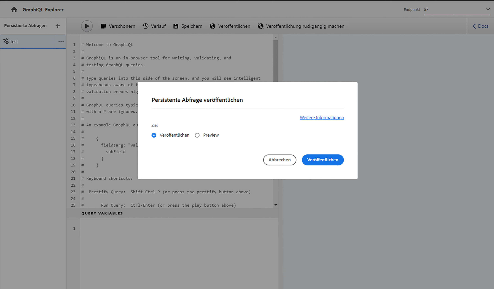

# Verwenden der GraphiQL-IDE {#graphiql-ide}

Eine Implementierung der standardmäßigen [GraphQL](https://graphql.org/learn/serving-over-http/#graphiql)-IDE ist für die Verwendung mit der GraphQL-API von Adobe Experience Manager (AEM) as a Cloud Service verfügbar.

>[!NOTE]
>
>GraphiQL ist in allen Umgebungen von AEM enthalten (kann jedoch nur bei der Konfiguration Ihrer Endpunkte aufgerufen/angezeigt werden).
>
>In früheren Versionen war ein Paket erforderlich, um die GraphiQL-IDE zu installieren. Sollten Sie ein solches Paket installiert haben, kann es jetzt entfernt werden.

>[!NOTE]
>Sie müssen [Ihre Endpunkte](/help/headless/graphql-api/graphql-endpoint.md) im [Konfigurations-Browser](/help/sites-cloud/administering/content-fragments/setup.md#enable-content-fragment-functionality-configuration-browser) konfiguriert haben, bevor Sie die GraphiQL-IDE verwenden.

Das **GraphiQL**-Tool erlaubt es Ihnen, Ihre GraphQL-Abfragen zu testen und zu debuggen, indem es Ihnen folgendes ermöglicht:

* Auswahl des **Endpunkts**, der der Sites-Konfiguration entspricht, die Sie für Ihre Abfragen verwenden möchten
* Direkte Eingabe neuer Abfragen
* Erstellen und Zugreifen auf **[Persistente Abfragen](/help/headless/graphql-api/persisted-queries.md)**
* Ausführen von Abfragen mit sofortiger Anzeige der Ergebnisse
* Verwalten von **Abfragevariablen**
* Speichern und Verwalten von **Persistenten Abfragen**
* **Persistierte Abfragen** entweder in Ihrem **Publish**- oder **Preview**-Service veröffentlichen bzw. die Veröffentlichung aufheben; zum Beispiel in/aus `dev-publish`
* Anzeige des **Verlaufs** der vorherigen Abfragen
* Verwenden des **Dokumentations-Explorers**, um auf die Dokumentation zuzugreifen; hilft Ihnen zu lernen und zu verstehen, welche Methoden verfügbar sind.

Sie können auf den Abfrage-Editor wie folgt zugreifen:

* **Tools** > **Allgemein** > **GraphQL-Abfrage-Editor**
* Direkt, zum Beispiel: `http://localhost:4502/aem/graphiql.html`

Sie können GraphiQL auf Ihrem System verwenden, damit Abfragen von Ihrer Client-Anwendung über GET-Anfragen durchgeführt werden können, und um Abfragen zu veröffentlichen. Zur Verwendung in der Produktion müssen Sie dann [Ihre Abfragen in Ihre Produktionsumgebung verschieben](/help/headless/graphql-api/persisted-queries.md#transfer-persisted-query-production). Zunächst an den Produktionsautor, um die neu erstellten Inhalte mit den Abfragen zu validieren, und schließlich an die Produktionsveröffentlichung für die Live-Nutzung.

## Auswahl des Endpunkts {#selecting-endpoint}

In einem ersten Schritt müssen Sie den **[Endpunkt](/help/headless/graphql-api/graphql-endpoint.md)** auswählen, den Sie für die Abfragen verwenden möchten. Der Endpunkt ist für die Sites-Konfiguration geeignet, die Sie für Ihre Abfragen verwenden möchten.

Diese ist in der Dropdown-Liste oben rechts verfügbar.

## Erstellen und Beibehalten einer neuen Abfrage {#creating-new-query}

Sie können Ihre neue Abfrage im Editor eingeben, der sich im Bereich links in der Mitte, direkt unter dem GraphiQL-Logo befindet.

>[!NOTE]
>
>Wenn Sie bereits eine gespeicherte Abfrage ausgewählt haben, die im Editorbereich angezeigt wird, wählen Sie `+` (neben **Persistente Abfragen**), um den Editor für Ihre neue Abfrage zu leeren.

Fangen Sie einfach an zu tippen, im Editor ist auch folgendes möglich:

* verwenden von Mouse-over, um zusätzliche Informationen über Elemente anzuzeigen
* bietet Funktionen wie Syntax-Hervorhebung, Autovervollständigung, Auto-Vorschlag

>[!NOTE]
>
>GraphQL-Abfragen beginnen normalerweise mit dem Zeichen `{`.
>
>Zeilen, die mit einem `#` beginnen, werden ignoriert.

Verwenden Sie **Speichern unter**, um Ihre neue Abfrage beizubehalten.

## Aktualisieren einer persistenten Abfrage {#updating-persisted-query}

Wählen Sie die Abfrage, die Sie aktualisieren möchten, aus der Liste im Bereich **Persistente Abfragen** (ganz links).

Die Abfrage wird im Editor-Panel angezeigt. Nehmen Sie die gewünschten Änderungen vor, und verwenden Sie dann **Speichern**, um die Aktualisierungen in der persistenten Abfrage zu speichern.

## Ausführen von Abfragen {#running-queries}

Sie können eine neue Abfrage sofort ausführen oder eine persistente Abfrage laden und ausführen. Um eine persistierte Abfrage zu laden, wählen Sie sie aus der Liste aus – die Abfrage wird im Editor-Panel angezeigt.

In beiden Fällen ist die Abfrage, die im Editor-Panel angezeigt wird, die Abfrage, die ausgeführt wird, wenn Sie entweder:

* das Symbol **Abfrage ausführen** auswählen, oder
* die Tastaturkombination `Control-Enter` verwenden.

## Abfragevariablen {#query-variables}

Mit der GraphiQL-IDE können Sie auch Ihre [Abfragevariablen](/help/headless/graphql-api/content-fragments.md#graphql-variables) verwalten.

Zum Beispiel:

## Verwaltung des Cache für Ihre persistenten Abfragen {#managing-cache}

[Persistente Abfragen](/help/headless/graphql-api/persisted-queries.md) werden empfohlen, da sie in den Dispatcher- und CDN-Ebenen zwischengespeichert werden können, was letztendlich die Leistung der anfordernden Client-Anwendung verbessert. Standardmäßig macht AEM den Cache des Content Delivery Network (CDN) basierend auf einer Standard-TTL (Time To Live) ungültig.

>[!NOTE]
>
>Siehe [Caching persistenter Abfragen](/help/headless/graphql-api/persisted-queries.md#caching-persisted-queries).

>[!NOTE]
>
>Benutzerdefinierte Neuschreibungsregeln für den Dispatcher können die Standardeinstellungen für AEM Publish überschreiben.
>
>Falls Sie TTL-basierte Cache-Steuerungs-Header vom Dispatcher senden, die auf einem Muster für Standortübereinstimmungen basieren, sollten Sie gegebenenfalls `/graphql/execute.json/*` aus den Übereinstimmungen ausschließen.

Mit GraphQL können Sie die HTTP-Cache-Header konfigurieren, um diese Parameter für einzelne persistente Abfragen festzulegen.

1. Die Option **Headers** kann über die drei vertikalen Punkte rechts neben dem Namen der persistenten Abfrage (ganz linkes Bedienfeld) aufgerufen werden:

   

1. Wenn Sie dies auswählen, öffnet sich der Dialog **Cache-Konfiguration**:

   

1. Wählen Sie den entsprechenden Parameter aus und passen Sie dann den Wert nach Bedarf an:

   * **cache-control** – **max-age**
Caches können diesen Inhalt für eine bestimmte Anzahl von Sekunden speichern. Normalerweise ist dies die TTL (Time To Live) des Browsers.
   * **surrogate-control** – **s-maxage** 
Wie max-age, gilt aber speziell für Proxy-Caches.
   * **surrogate-control** – **stale-while-revalidate**
Caches können eine zwischengespeicherte Antwort auch dann weiter bereitstellen, wenn sie schon veraltet ist, und zwar bis zu der angegebenen Anzahl von Sekunden.
   * **surrogate-control** – **stale-if-error**
Caches können im Falle eines Ursprungsfehlers eine zwischengespeicherte Antwort bis zu der angegebenen Anzahl von Sekunden weiterhin bereitstellen.

1. Wählen Sie **Speichern**, um die Änderungen beizubehalten.

## Publishing und Vorschau von persistierten Abfragen {#publishing-previewing-persisted-queries}

Sobald Sie Ihre persistierte Abfrage aus der Liste (linkes Bedienfeld) ausgewählt haben, können Sie die Aktion **Publish** verwenden.

Dadurch wird die Abfrage in der von Ihnen gewählten Umgebung aktiviert. Sie können entweder Ihre **Publish**-Umgebung (z. B. `dev-publish`) oder Ihre **Vorschau**-Umgebung für den einfachen Zugriff Ihrer Anwendungen beim Testen wählen.

>[!NOTE]
>
>Für den Cache der persistenten Abfrage `Time To Live` {„cache-control“:„parameter“:value} ist der Standardwert von 2 Stunden (7.200 Sekunden) definiert.

## Veröffentlichung persistierte Abfragen aufheben {#unpublishing-persisted-queries}

Wie bei der Veröffentlichung können Sie, sobald Sie Ihre persistierte Abfrage aus der Liste (linkes Bedienfeld) ausgewählt haben, die Aktion **Veröffentlichung aufheben** verwenden.

Dadurch wird die Abfrage in der von Ihnen gewählten Umgebung deaktiviert; entweder in Ihrer **Publish**-Umgebung oder in Ihrer **Vorschau**-Umgebung.

>[!NOTE]
>
>Sie sollten auch sicherstellen, dass Sie die notwendigen Änderungen an Ihrer Client-Anwendung vorgenommen haben, um mögliche Probleme zu vermeiden.

## Kopieren der URL, um direkt auf die Abfrage zuzugreifen {#copy-url}

Mit der Option **URL kopieren** können Sie eine Abfrage simulieren, indem Sie die URL kopieren, mit der Sie direkt auf die persistente Abfrage zugreifen und die Ergebnisse sehen. Diese kann dann zu Testzwecken verwendet werden, z. B. durch Zugriff in einem Browser:

<!--
  >[!NOTE]
  >
  >The URL needs [encoding before using programmatically](/help/headless/graphql-api/persisted-queries.md#encoding-query-url).
  >
  >The target environment might need adjusting, depending on your requirements.
-->

Zum Beispiel:

`http://localhost:4502/graphql/execute.json/global/article-list-01`

Wenn Sie diese URL in einem Browser verwenden, können Sie die Ergebnisse bestätigen:

Die Option **URL kopieren** ist über die drei vertikalen Punkte rechts neben dem Namen der persistenten Abfrage zugänglich (Bereich ganz links):

## Löschen persistenter Abfragen {#deleting-persisted-queries}

Die Option **Löschen** ist auch über die drei vertikalen Punkte rechts neben dem Namen der persistenten Abfrage (Bereich ganz links) zugänglich.

<!-- what happens if you try to delete something that is still published? -->

## Installieren der persistenten Abfrage in der Produktion {#installing-persisted-query-production}

Nachdem Sie Ihre persistente Abfrage mit GraphiQL entwickelt und getestet haben, ist das letzte Ziel, sie in [Ihre Produktionsumgebung zu übertragen](/help/headless/graphql-api/persisted-queries.md#transfer-persisted-query-production), damit sie von Ihren Anwendungen verwendet werden kann.

## Tastaturbefehle {#keyboard-shortcuts}

Es gibt eine Auswahl von Tastaturbefehlen, die direkten Zugriff auf Aktionssymbole in der IDE bieten:

* Abfrage schön machen:  `Shift-Control-P`
* Abfrage zusammenführen:  `Shift-Control-M`
* Abfrage ausführen:  `Control-Enter`
* Automatisch vervollständigen:  `Control-Space`

>[!NOTE]
>
>Auf manchen Tastaturen ist die Taste `Control` mit `Ctrl` beschriftet.
