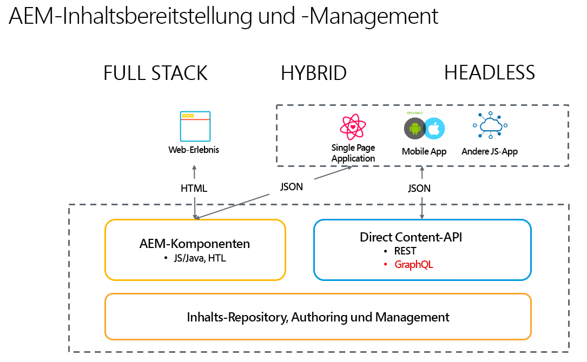

# Einführung in Adobe Experience Manager als Headless-CMS {#introduction-aem-headless}

Erfahren Sie, wie Sie Adobe Experience Manager (AEM) als Headless-CMS (Content Management System) mit Funktionen wie Inhaltsfragmentmodellen, Inhaltsfragmenten und einer GraphQL-API verwenden können, die zusammen Headless-Erlebnisse in großem Umfang ermöglichen.

Sie können eine ausführliche Dokumentation der verschiedenen Funktionen lesen und/oder die Auswahl der [Headless-Touren verfolgen, um einen Überblick über die ersten Schritte zu erhalten](#first-steps).

>[!NOTE]
>
>Siehe auch [Was ist Headless?](/help/headless/what-is-headless.md) für eine Einführung in Headless-Konzepte und -Terminologie.

## Überblick {#overview}

AEM Headless ist eine CMS-Lösung aus Experience Manager, mit der strukturierte Inhalte (Inhaltsfragmente) in AEM von jeder App über HTTP mithilfe von GraphQL genutzt werden können. Headless-Implementierungen ermöglichen die skalierte Bereitstellung von Erlebnissen über Plattformen und Kanäle hinweg.

Bei Headless-Implementierungen wird auf eine Seiten- und Komponentenverwaltung verzichtet, wie es bei Full-Stack- und Hybridlösungen üblich ist. Stattdessen basieren sie auf der Erstellung kanalneutraler, wiederverwendbarer Inhaltsfragmente und deren kanalübergreifenden Bereitstellung. Es handelt sich um ein modernes und dynamisches Entwicklungsmuster zur Implementierung von Web-Erlebnissen.

## Funktionen {#aem-headless-features}

AEM as a Cloud Service ist ein flexibles Tool für das Headless-Implementierungsmodell, das drei leistungsstarke Funktionen bietet:

1. **Inhaltsfragmentmodelle**
   * Inhaltsfragmentmodelle sind strukturierte Darstellungen von Inhalten.
   * Inhaltsfragmentmodelle werden von Informationsarchitektinnen und -architekten im AEM-Editor für Inhaltsfragmentmodelle definiert.
   * Inhaltsfragmentmodelle dienen als Grundlage für Inhaltsfragmente.
1. **Inhaltsfragmente**
   * Ein Inhaltsfragment wird auf Basis eines Inhaltsfragmentmodells erstellt.
   * Inhaltsfragmente werden von Inhaltsautorinnen und -autoren mit dem AEM-Inhaltsfragment-Editor erstellt.
   * Inhaltsfragmente werden als AEM-Assets gespeichert, können jedoch entweder über die Assets-Konsole oder die [Inhaltsfragmentkonsole](/help/sites-cloud/administering/content-fragments/overview.md#content-fragments-console) verwaltet werden.
1. **Inhalts-API für die Bereitstellung**
   * Unter [AEM-APIs für die Bereitstellung und Verwaltung strukturierter Inhalte](/help/headless/apis-headless-and-content-fragments.md) finden Sie einen Überblick über die verschiedenen verfügbaren APIs und einen Vergleich einiger der damit verbundenen Konzepte.

   * Die direkte Bereitstellung von Inhalten ist auch mit dem [JSON-Export der Inhaltsfragment-Kernkomponente](https://experienceleague.adobe.com/docs/experience-manager-core-components/using/components/content-fragment-component.html?lang=de) möglich.

## Ihre ersten Schritte {#first-steps}

Für die ersten Schritte mit AEM Headless-Funktionen stehen verschiedene Ressourcen zur Verfügung. Jeder Leitfaden ist auf verschiedene Anwendungsfälle und Zielgruppen zugeschnitten.

| Ressource | Beschreibung | Typ | Zielgruppe | Schätzung Zeit |
|---|---|---|---|---|
| [Headless-Entwickler-Tour](/help/journey-headless/developer/overview.md) | **Entwickler, die noch nicht mit AEM- und Headless**-Technologien vertraut sind, erhalten hier eine umfassende Einführung in AEM und seine Headless-Funktionen, von der Theorie des Headless-Systems bis zum Go-Live Ihres ersten Headless-Projekts. | -Anleitung | Entwickler, die noch **nicht mit AEM und Headless vertraut** sind | 1 Stunde |
| [Headless-Einrichtung](/help/headless/setup/introduction.md) | **Erfahrene AEM-Anwender**, die eine kurze Zusammenfassung der wichtigsten AEM-Headless-Funktionen benötigen, sollten sich diesen Schnellstart-Überblick ansehen. | Referenz-Setup | Entwickler, Administratoren **mit AEM-Erfahrung** | 20 Minuten |
| [Praktisches Headless-Tutorial](https://experienceleague.adobe.com/docs/experience-manager-learn/getting-started-with-aem-headless/graphql/multi-step/overview.html?lang=de) | **Wenn Sie einen praxisnahen Ansatz bevorzugen und mit AEM vertraut sind**: dieses Tutorial steigt direkt in die Implementierung einer einfachen Headless-App ein. | Tutorial | Entwickler | 2 Stunden |
| [Headless-Architekten-Tour](/help/journey-headless/architect/overview.md) | **Architekten, die noch nicht mit AEM und Headless-Technologien vertraut sind**, beginnen hier mit einer Einführung in die leistungsstarken, flexiblen Headless-Funktionen von Adobe Experience Manager as a Cloud Service und erfahren, wie man Inhalte für ein Projekt modellieren kann. | -Anleitung | Architekten | 1 Stunde |
| [Headless-Authoring-Tour](/help/journey-headless/author/overview.md) | **Geschäftsanwender, die AEM und Headless-Technologien noch nicht kennen**, beginnen hier mit einer Einführung in die leistungsstarken, flexiblen, Headless-Funktionen von Adobe Experience Manager as a Cloud Service und wie man Inhalte für ein Projekt modellieren kann. | -Anleitung | Inhaltsersteller | 1 Stunde |
| [Headless-Übersetzungs-Tour](/help/journey-headless/translation/overview.md) | Für diejenigen, die sich für den **Übersetzungsansatz von AEM für Headless interessieren.**. Erfahren Sie mehr über Headless-Technologien und wie Sie Übersetzungsprojekte in AEM von A bis Z erstellen und aktualisieren können. | -Anleitung | Übersetzungsspezialisten | 1 Stunde |

## Vergleich von Headful und Headless {#headful-headless}

Diese Anleitung konzentriert sich auf das vollständige Headless-Implementierungsmodell von AEM. In AEM muss die Entscheidung zwischen Headful und Headless aber keine Entweder-oder-Entscheidung sein. Headless-Funktionen können verwendet werden, um Inhalte zu verwalten und für verschiedene Endpunkte bereitzustellen sowie um Inhaltserstellern gleichzeitig die Bearbeitung von Einzelseiten-Webanwendungen zu ermöglichen. Alles in AEM.

>[!TIP]
>
>Weitere Informationen finden Sie im Dokument [Headful und Headless in AEM](/help/implementing/developing/headful-headless.md).
