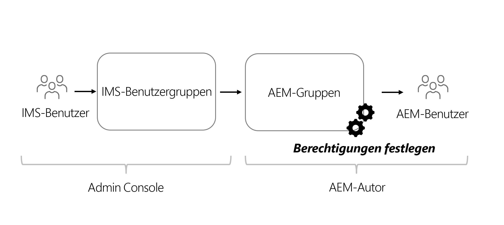

# Überlegungen zu Berechtigungen für Headless-Inhalte

Bei einer Headless-Implementierung gibt es mehrere Bereiche von Sicherheit und Berechtigungen, die berücksichtigt werden sollten. Berechtigungen und Rollen können je nach AEM-Umgebung, **Autor** oder **Veröffentlichung**, umfassend berücksichtigt werden. Jede Umgebung enthält unterschiedliche Rollen mit unterschiedlichen Anforderungen.

## Überlegungen zum Autoren-Service

Der Autoren-Service, mit dem interne Anwender Inhalte erstellen, verwalten und veröffentlichen. Berechtigungen beziehen sich auf die verschiedenen Rollen, die Inhalte verwalten.

### Verwalten von Berechtigungen auf Gruppenebene

Als Best Practice sollten Berechtigungen für Gruppen in AEM festgelegt werden. Diese Gruppen werden auch als lokale Gruppen bezeichnet und können in der AEM-Autorenumgebung verwaltet werden.

Die einfachste Möglichkeit, die Gruppenmitgliedschaft zu verwalten, besteht darin, Adobe Identity Management System (IMS)-Gruppen zu verwenden und [IMS-Gruppen für lokale AEM-Gruppen](https://experienceleague.adobe.com/docs/experience-manager-cloud-service/content/security/ims-support.html?lang=de#managing-permissions-in-aem) zuzuweisen.

Im Großen und Ganzen läuft der Prozess so ab:

1. Fügen Sie IMS-Benutzer mithilfe der [Admin Console](https://adminconsole.adobe.com/) einer neuen oder einer bestehenden IMS-Benutzergruppe hinzu.
1. IMS-Gruppen werden mit AEM synchronisiert, wenn sich Benutzer anmelden.
1. Weisen Sie AEM-Gruppen IMS-Gruppen zu.
1. Legen Sie Berechtigungen für AEM-Gruppen fest.
1. Wenn sich Benutzer bei AEM anmelden und über IMS authentifiziert werden, übernehmen sie die Berechtigungen der AEM-Gruppe.

>[!TIP]
>
>Eine ausführliche Videoeinführung zur Verwaltung von IMS und AEM Benutzenden und Gruppen finden Sie unter [Konfigurieren des Zugriffs auf AEM as a Cloud Service](https://experienceleague.adobe.com/docs/experience-manager-learn/cloud-service/accessing/overview.html?lang=de).

Um **Gruppen** in AEM zu verwalten, gehen Sie zu **Tools** > **Sicherheit** > **Gruppen**.

Um die Berechtigungen von Gruppen in AEM zu verwalten, gehen Sie zu **Tools** > **Sicherheit** > **Berechtigungen**.

### DAM-Benutzer

„DAM“ steht in diesem Zusammenhang für Digital Asset Management. Die **DAM-Benutzer** sind eine vorkonfigurierte Gruppe in AEM, die für „alltägliche“ Benutzer verwendet werden kann, die digitale Assets und Inhaltsfragmente verwalten. Diese Gruppe bietet Berechtigungen für **Ansicht**, **Hinzufügen**, **Aktualisieren**, **Löschen** und **Veröffentlichen** von Inhaltsfragmenten und aller anderen Dateien in AEM Assets.

Wenn Sie IMS für die Gruppenmitgliedschaft verwenden, fügen Sie die entsprechenden IMS-Gruppen als Mitglieder der Gruppe **DAM-Benutzer** hinzu. Mitglieder der IMS-Gruppe übernehmen bei der Anmeldung in die AEM-Umgebung die Berechtigungen der Gruppe „DAM-Benutzer“.

#### Anpassen der Gruppe „DAM-Benutzer“

Es ist ratsam, die Berechtigungen einer vorkonfigurierten Gruppe nicht direkt zu ändern. Stattdessen können Sie auch Ihre eigene(n) Gruppe(n) erstellen, die nach den Berechtigungen der Gruppe **DAM-Benutzer** modelliert sind und den Zugriff auf verschiedene **Ordner** innerhalb von AEM Assets weiter einschränken.

Um detailliertere Berechtigungen zu ermöglichen, verwenden Sie die Konsole **Berechtigungen** in AEM und ändern Sie den Pfad von `/content/dam` in einen spezifischeren Pfad, z. B. `/content/dam/mycontentfragments`.

Es kann wünschenswert sein, dieser Benutzergruppe Berechtigungen zum Erstellen und Bearbeiten von Inhaltsfragmenten zu erteilen, jedoch nicht zum Löschen. Informationen zum Überprüfen und Zuweisen von Berechtigungen für die Bearbeitung, aber nicht zum Löschen finden Sie unter [Inhaltsfragmente – Überlegungen zum Löschen](/help/sites-cloud/administering/content-fragments/delete-considerations.md).

### Modell-Editoren

Die Möglichkeit, **Inhaltsfragmentmodelle** zu ändern, sollte Administratoren überlassen werden oder einer **kleinen Gruppe** von Benutzern mit erweiterten Berechtigungen. Das Ändern des Inhaltsfragmentmodells hat viele Auswirkungen in nachgeschalteten Vorgängen.

>[!CAUTION]
>
>Änderungen an Inhaltsfragmentmodellen ändern die zugrunde liegende GraphQL-API, auf die Headless-Anwendungen angewiesen sind.

Wenn Sie eine Gruppe erstellen möchten, die Inhaltsfragmentmodelle verwalten kann, aber keinen vollständigen Administratorzugriff hat, können Sie eine Gruppe mit den folgenden Einträgen für die Zugriffssteuerung erstellen:

| Pfad  | Berechtigung | Berechtigungen |
|-----| -------------| ---------|
| `/conf` | **zulassen** | `jcr:read` |
| `/conf/<config-name>/settings/dam/cfm` | **zulassen** | `rep:write`, `crx:replicate` |

## Berechtigungen für Veröffentlichungs-Service

Der Veröffentlichungs-Service fungiert als „Live-Umgebung“ und ist in der Regel der Bereich, mit die GraphQL-API-Benutzer interagieren. Inhalte werden nach der Bearbeitung und Genehmigung im Autoren-Service an den Veröffentlichungs-Service weitergeleitet. Die Headless-Anwendung nutzt dann über GraphQL-APIs die genehmigten Inhalte aus dem Veröffentlichungs-Service.

Standardmäßig sind über die GraphQL-Endpunkte des AEM-Veröffentlichungs-Service veröffentlichte Inhalte für alle verfügbar, auch für nicht authentifizierte Benutzer.

### Berechtigungen für Inhalte

Inhalte, die über die GraphQL-APIs von AEM verfügbar gemacht werden, können durch [Geschlossene Benutzergruppen (CUGs)](https://experienceleague.adobe.com/docs/experience-manager-learn/assets/advanced/closed-user-groups.html?lang=de) eingeschränkt werden, die für Asset-Ordner festgelegt werden und angeben, welche AEM-Benutzergruppen (und deren Mitglieder) auf den Inhalt der Asset-Ordner zugreifen können.

Assets-CUGs funktionieren, indem:

* sie zunächst den Zugriff auf den Ordner und die Unterordner verweigern
* sie dann den Lesezugriffs auf den Ordner und die Unterordner für alle AEM-Benutzergruppen zulassen, die in der CUG-Liste aufgeführt sind

CUGs können für Asset-Ordner eingerichtet werden, die über GraphQL-APIs verfügbar gemachte Inhalte enthalten. Der Zugriff auf Asset-Ordner in der AEM-Veröffentlichungsumgebung sollte über Benutzergruppen gesteuert werden und nicht direkt über den Benutzer. Erstellen (oder wiederverwenden) Sie eine AEM-Benutzergruppe, die Zugriff auf Asset-Ordner gewährt, die Inhalte enthalten, die von GraphQL-APIs verfügbar gemacht werden.

#### Auswahl des Authentifizierungsschemas{#publish-permissions-users}

Das [AEM-Headless-SDK](https://github.com/adobe/aem-headless-client-js#create-aemheadless-client) unterstützt zwei Authentifizierungstypen:

* [Token-basierte Authentifizierung](/help/implementing/developing/introduction/generating-access-tokens-for-server-side-apis.md) unter Verwendung von Service-Anmeldedaten, die an ein einzelnes technisches Konto gebunden sind.
* Einfache Authentifizierung mit AEM Benutzern.

### Zugriff auf die GraphQL-API

HTTP-Anforderungen, die die [entsprechenden Authentifizierungs-Anmeldedaten](https://github.com/adobe/aem-headless-client-js#create-aemheadless-client) für die GraphQL-API-Endpunkte des AEM-Veröffentlichungs-Service bereitstellen, enthalten Inhalte, die mit den entsprechenden Anmeldedaten gelesen werden dürfen, sowie anonym zugängliche Inhalte. Andere Benutzer der GraphQL-API können die Inhalte in den CUG-geschützten Ordnern nicht lesen.
