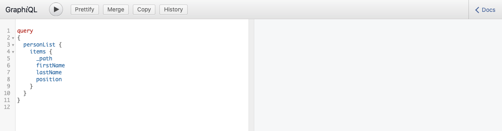

# Erstellen einer API-Anfrage – Headless-Einrichtung {#accessing-delivering-content-fragments}

Erfahren Sie, wie Sie die GraphQL-API für die Headless-Bereitstellung von Inhaltsfragmentinhalten und die Assets-REST-API von AEM zur Verwaltung von Inhaltsfragmenten verwenden.

## Was sind GraphQL- und Assets-REST-APIs? {#what-are-the-apis}

[Nachdem Sie einige Inhaltsfragmente erstellt haben](create-content-fragment.md), können Sie die APIs von AEM verwenden, um sie headless bereitzustellen.

* Mit der [GraphQL-API](/help/headless/graphql-api/content-fragments.md) können Sie Anfragen für den Zugriff auf und die Bereitstellung von Inhaltsfragmenten erstellen. Diese API bietet die zuverlässigsten Funktionen zum Abfragen und Verwenden von Inhaltsfragmentinhalten.
   * Um die API zu verwenden, [definieren Sie Endpunkte und aktivieren Sie sie in AEM](/help/headless/graphql-api/graphql-endpoint.md), und aktivieren Sie gegebenenfalls die [installierte GraphiQL-Oberfläche](/help/headless/graphql-api/graphiql-ide.md).
* Mit der [Assets-REST-API](/help/assets/content-fragments/assets-api-content-fragments.md) können Sie Inhaltsfragmente (und andere Assets) erstellen und ändern.

>[!NOTE]
>
>Die [OpenAPIs für Inhaltsfragmente und Inhaltsfragmentmodelle](/help/headless/content-fragment-openapis.md) sind ebenfalls verfügbar.

Der Rest dieses Handbuchs konzentriert sich auf den GraphQL-Zugriff und die Bereitstellung von Inhaltsfragmenten.

## Aktivieren eines GraphQL-Endpunkts {#enable-graphql-endpoint}

Bevor die GraphQL-APIs verwendet werden können, muss ein GraphQL-Endpunkt erstellt werden.

1. Gehen Sie zu **Tools**, **Allgemein** und wählen Sie **GraphQL** aus.
1. Wählen Sie **Erstellen** aus.
1. Das Dialogfeld **Neuen GraphQL-Endpunkt erstellen** wird geöffnet. Hier können Sie Folgendes angeben:
   * **Name**: Name des Endpunkts; Sie können einen beliebigen Text eingeben.
   * **GraphQL-Schema verwenden, das bereitgestellt wurde von**: Verwenden Sie die Dropdown-Liste, um die gewünschte Konfiguration auszuwählen.
1. Bestätigen Sie mit **Erstellen**.
1. In der Konsole wird nun ein **Pfad** basierend auf der zuvor erstellten Konfiguration angezeigt. Dieser Pfad wird zum Ausführen von GraphQL-Abfragen verwendet.

   ```
   /content/cq:graphql/<configuration-name>/endpoint
   ```

Weitere Informationen zum Aktivieren von GraphQL-Endpunkten finden Sie unter [Verwalten von GraphQL-Endpunkten in AEM](/help/headless/graphql-api/graphql-endpoint.md).

## Abfragen von Inhalten unter Verwendung von GraphQL mit GraphiQL

Informationsarchitektinnen und -architekten entwerfen Abfragen für ihre Kanalendpunkte, um Inhalte bereitzustellen. Berücksichtigen Sie diese Abfragen pro Endpunkt und Modell nur einmal. Für die Zwecke dieses Erste-Schritte-Handbuchs müssen Sie nur eine erstellen.

GraphiQL ist eine IDE, die in Ihrer AEM-Umgebung integriert ist; sie wird verfügbar/sichtbar, nachdem Sie [Ihre Endpunkte konfiguriert haben](#enable-graphql-endpoint).

1. Melden Sie sich bei AEM as a Cloud Service an und rufen Sie die GraphiQL-Oberfläche auf:

   Sie können auf den Abfrage-Editor wie folgt zugreifen:

   * **Tools** > **Allgemein** > **GraphQL-Abfrage-Editor**
   * direkt, zum Beispiel: `http://localhost:4502/aem/graphiql.html`

1. Die GraphiQL-IDE ist ein In-Browser-Abfrage-Editor für GraphQL. Sie können damit Abfragen zum Abrufen von Inhaltsfragmenten erstellen, um diese als JSON-Datei headless bereitzustellen.
   * In der Dropdown-Liste oben rechts können Sie den Endpunkt auswählen.
   * In einem Bereich ganz links werden die persistenten Abfragen aufgelistet (sofern verfügbar)
   * Im mittleren linken Bereich können Sie Ihre Abfrage erstellen.
   * Im mittleren rechten Bereich werden die Ergebnisse angezeigt.
   * Der Abfrage-Editor bietet Code-Vervollständigung und Hotkeys, um die Abfrage einfach auszuführen.

   

1. Angenommen, das von uns erstellte Modell `person` wurde mit den Feldern `firstName`, `lastName` und `position` aufgerufen. Wir können dann eine einfache Abfrage erstellen, um den Inhalt unseres Inhaltsfragments abzurufen.

   ```text
   query 
   {
     personList {
       items {
         _path
         firstName
         lastName
         position
       }
     }
   }
   ```

1. Geben Sie die Abfrage in das linke Bedienfeld ein.
   

1. Klicken Sie auf die Schaltfläche **Abfrage ausführen** oder verwenden Sie den `Ctrl-Enter`-Hotkey. Die Ergebnisse werden als JSON im rechten Bedienfeld angezeigt.
   

1. Klicken Sie oben rechts auf der Seite auf den Link **Dokumente**, um die kontextbezogene Dokumentation anzuzeigen, damit Sie Abfragen erstellen können, die sich an Ihre eigenen Modelle anpassen.
   

GraphQL ermöglicht strukturierte Abfragen, die nicht nur auf bestimmte Datensätze oder einzelne Datenobjekte abzielen, sondern auch bestimmte Elemente der Objekte und verschachtelte Ergebnisse bereitstellen können, Unterstützung für Abfragevariablen bieten und vieles mehr.

GraphQL kann sowohl iterative API-Anfragen als auch Überbereitstellungen vermeiden und ermöglicht stattdessen eine Massenbereitstellung von genau dem, was zum Rendern als Antwort auf eine einzelne API-Abfrage benötigt wird. Das resultierende JSON kann verwendet werden, um Daten in anderen Sites oder Mobile Apps bereitzustellen.

## Nächste Schritte {#next-steps}

Das war´s! Sie haben nun ein grundlegendes Verständnis für das Headless-Content-Management in AEM. Es gibt viele weitere Ressourcen, mit deren Hilfe Sie sich ein umfassendes Verständnis der verfügbaren Funktionen aneignen können.

* **[Inhaltsfragmente](/help/sites-cloud/administering/content-fragments/managing.md)** – Weitere Informationen zum Erstellen und Verwalten von Inhaltsfragmenten
* **[Unterstützung von Inhaltsfragmenten in der AEM Assets-HTTP-API](/help/assets/content-fragments/assets-api-content-fragments.md)** – Weitere Informationen zum direkten Zugriff auf AEM-Inhalte über die HTTP-API über CRUD-Vorgänge (Erstellen, Lesen, Aktualisieren, Löschen)
* **[GraphQL-API](/help/headless/graphql-api/content-fragments.md)** – Weitere Informationen zum Headless-Bereitstellen von Inhaltsfragmenten

>[!NOTE]
>
>Die [OpenAPIs für Inhaltsfragmente und Inhaltsfragmentmodelle](/help/headless/content-fragment-openapis.md) sind ebenfalls verfügbar.
