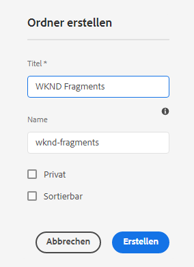
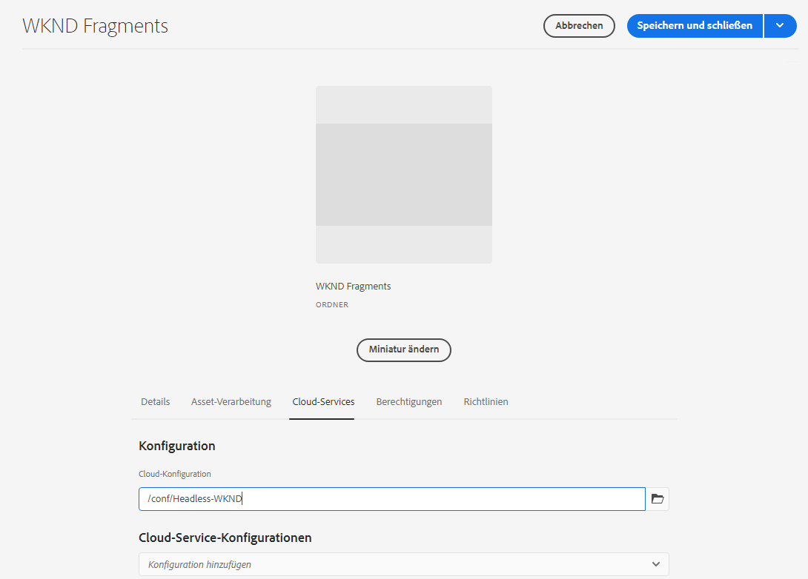
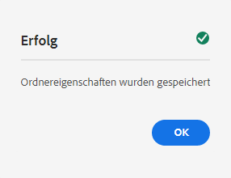

# Erstellen eines Asset-Ordners – Headless-Einrichtung {#creating-an-assets-folder}

Verwenden Sie AEM-Inhaltsfragmentmodelle, um die Struktur von Inhaltsfragmenten zu definieren – die Grundlage für Ihren Headless-Content. Inhaltsfragmente werden dann in Asset-Ordnern gespeichert.

## Was ist ein Asset-Ordner? {#what-is-an-assets-folder}

[Nachdem Sie nun Inhaltsfragmentmodelle erstellt haben](create-content-model.md), die die Struktur definieren, die Sie für Ihre künftigen Inhaltsfragmente verwenden möchten, würden Sie sicher gern einige Fragmente erstellen.

Zunächst müssen Sie jedoch einen Ordner für Assets erstellen, in dem Sie diese speichern.

Asset-Ordner dienen der [Organisation traditioneller Inhalts-Assets](/help/assets/manage-digital-assets.md) wie Bilder und Videos, zusammen mit Inhaltsfragmenten.

## Erstellen eines Asset-Ordners {#how-to-create-an-assets-folder}

Administratoren müssen nur gelegentlich Ordner erstellen, um Inhalte bei der Erstellung zu organisieren. Für die Zwecke dieser Anleitung für den Einstieg müssen wir nur einen Ordner erstellen.

1. Melden Sie sich bei AEM as a Cloud Service an und wählen Sie im Hauptmenü **Navigation > Assets > Dateien** aus.
1. Wählen Sie **Erstellen > Ordner** aus.
1. Geben Sie einen **Titel** und einen **Namen** für Ihren Ordner an.
   * Der **Titel** sollte beschreibend sein.
   * Der **Name** wird zum Knotennamen im Repository.
      * Er wird automatisch auf der Grundlage des Titels generiert und gemäß den [AEM-Benennungskonventionen](/help/implementing/developing/introduction/naming-conventions.md) angepasst.
      * Er kann bei Bedarf angepasst werden.

   
1. Wählen Sie den erstellten Ordner aus, indem Sie den Mauszeiger über das Häkchen bewegen und darauf tippen. Wählen Sie anschließend **Eigenschaften** in der Symbolleiste (oder verwenden Sie den [Tastaturbefehl](/help/sites-cloud/authoring/sites-console/keyboard-shortcuts.md) `p`).
1. Wählen Sie im Fenster **Eigenschaften** die Registerkarte **Cloud-Services** aus.
1. Wählen Sie für **Cloud-** die [zuvor erstellte Konfiguration](create-configuration.md).
   
1. Wählen Sie **Speichern und schließen**.
1. Wählen Sie **OK** im Bestätigungsfenster aus.

   

Sie können im soeben erstellten Ordner weitere Unterordner erstellen. Die Unterordner übernehmen die **Cloud-Konfiguration** des übergeordneten Ordners. Dies kann jedoch überschrieben werden, wenn Sie Modelle aus einer anderen Konfiguration verwenden möchten.

Wenn Sie eine lokalisierte Site-Struktur verwenden, können Sie unter Ihrem neuen Ordner [einen Sprachstamm](/help/assets/translate-assets.md) erstellen.

## Nächste Schritte {#next-steps}

Nachdem Sie nun einen Ordner für Ihre Inhaltsfragmente erstellt haben, können Sie mit dem vierten Teil der ersten Schritte fortfahren und [Inhaltsfragmente erstellen](create-content-fragment.md).

>[!TIP]
>
>Ausführliche Informationen zur Verwaltung von Inhaltsfragmenten finden Sie in der [Dokumentation zu Inhaltsfragmenten](/help/sites-cloud/administering/content-fragments/overview.md).
