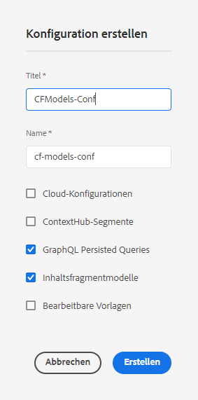

# Erstellen einer Konfiguration – Einrichten von Headless {#creating-configuration}

Als ersten Schritt für den Einstieg in Headless in AEM as a Cloud Service müssen Sie eine Konfiguration erstellen.

## Was ist eine Konfiguration? {#what-is-a-configuration}

Der Konfigurations-Browser bietet eine generische Konfigurations-API, eine Inhaltsstruktur und einen Auflösungsmechanismus für Konfigurationen in AEM.

Stellen Sie sich im Kontext von Headless-Content-Management in AEM eine Konfiguration als einen Arbeitsplatz in AEM vor, an dem Sie Ihre Inhaltsmodelle erstellen können, die die Struktur Ihrer zukünftigen Inhalte und Inhaltsfragmente definieren. Sie können über mehrere Konfigurationen verfügen, um diese Modelle zu trennen.

Wenn Sie mit [Seitenvorlagen in einer Full-Stack-AEM-Implementierung](/help/sites-cloud/authoring/page-editor/templates.md) vertraut sind, ist die Verwendung von Konfigurationen für die Verwaltung von Inhaltsmodellen ähnlich.

## Erstellen einer Konfiguration {#how-to-create-a-configuration}

Ein Administrator muss eine Konfiguration nur einmal oder sehr selten erstellen, wenn für die Organisation Ihrer Inhaltsmodelle ein neuer Arbeitsbereich erforderlich ist. Für die Zwecke dieser ersten Schritte müssen wir nur eine Konfiguration erstellen.

1. Melden Sie sich bei AEM as a Cloud Service an und wählen Sie im Hauptmenü **Tools > Allgemein > Konfigurations-Browser** aus.
1. Geben Sie einen **Titel** und einen **Namen** für Ihre Konfiguration an.
   * Der **Titel** sollte beschreibend sein.
   * Der **Name** wird zum Knotennamen im Repository.
      * Er wird automatisch auf der Grundlage des Titels generiert und gemäß den [AEM-Benennungskonventionen](/help/implementing/developing/introduction/naming-conventions.md) angepasst.
      * Er kann bei Bedarf angepasst werden.
1. Überprüfen Sie die folgenden Optionen:
   * **Inhaltsfragmentmodelle**
   * **GraphQL – Persistente Abfragen**

   

1. Wählen Sie **Erstellen** aus

Sie können bei Bedarf mehrere Konfigurationen erstellen. Konfigurationen können auch verschachtelt sein.

>[!NOTE]
>
>Abhängig von Ihren Implementierungsanforderungen können zusätzlich zu **Inhaltsfragmentmodellen** und **persistenten GraphQL-Abfragen** Konfigurationsoptionen erforderlich sein.

## Nächste Schritte {#next-steps}

Mit dieser Konfiguration können Sie nun mit dem zweiten Teil der ersten Schritte fortfahren und [Inhaltsfragmentmodelle](create-content-model.md) erstellen.

>[!TIP]
>
>Ausführliche Informationen zum Konfigurations-Browser finden Sie in der [Dokumentation zum Konfigurations-Browser](/help/implementing/developing/introduction/configurations.md).
