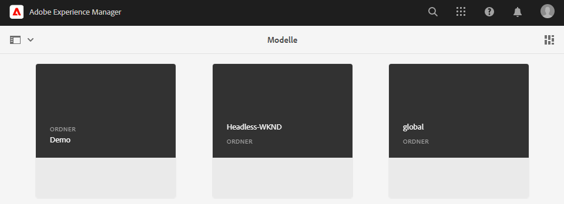
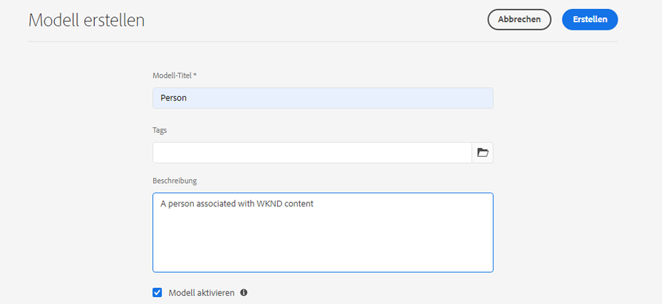
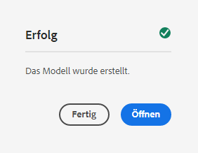
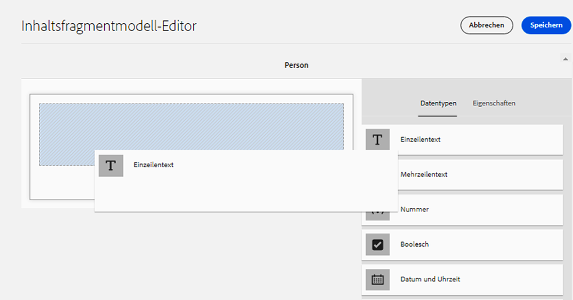
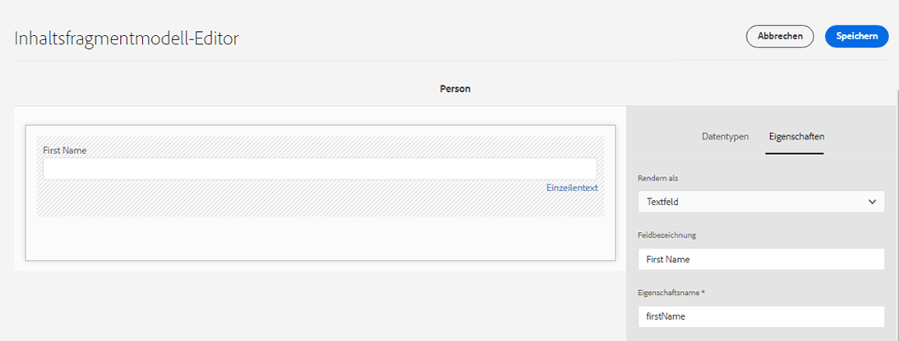
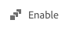
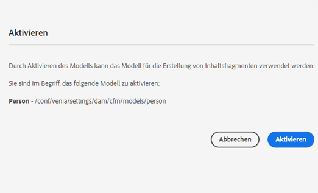
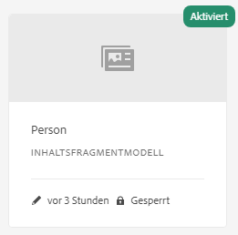

# Erstellen von Inhaltsfragmentmodellen – Headless-Einrichtung {#creating-content-fragment-models}

Definieren Sie die Struktur des Inhalts, den Sie mithilfe von AEM Headless-Funktionen mit Inhaltsfragmentmodellen erstellen und bereitstellen möchten.

## Was sind Inhaltsfragmentmodelle? {#what-are-content-fragment-models}

[Nachdem Sie nun eine Konfiguration erstellt haben](create-configuration.md), können Sie damit Inhaltsfragmentmodelle erstellen.

Inhaltsfragmentmodelle definieren die Struktur der Daten und Inhalte, die Sie in AEM erstellen und verwalten. Sie dienen als Gerüst für Ihre Inhalte. Bei der Erstellung von Inhalten wählen Ihre Autoren aus den von Ihnen definierten Inhaltsfragmentmodellen aus, die sie bei der Erstellung von Inhalten anleiten.

## Erstellen eines Inhaltsfragmentmodells {#how-to-create-a-content-fragment-model}

Ein Informationsarchitekt würde diese Aufgaben nur sporadisch durchführen, da neue Modelle erforderlich sind. Für die Zwecke dieser Anleitung für den Einstieg müssen wir nur ein Modell erstellen.

1. Melden Sie sich bei AEM as a Cloud Service an und wählen Sie im Hauptmenü **Werkzeuge**, **Allgemein**, **Inhaltsfragmentmodelle**.
1. Tippen oder klicken Sie auf den Ordner, der durch Erstellung Ihrer Konfiguration erstellt wurde.

   
1. Tippen oder klicken Sie auf **Erstellen**.
1. Geben Sie einen **Modell-Titel**, **Tags** und eine **Beschreibung** an. Sie können auch **Modell aktivieren** aus- oder abwählen, um zu steuern, ob das Modell unmittelbar nach der Erstellung aktiviert wird.

   
1. Tippen oder klicken Sie im Bestätigungsfenster auf **Öffnen**, um Ihr Modell zu konfigurieren.

   
1. Erstellen Sie mit dem **Inhaltsfragmentmodell-Editor** das Inhaltsfragmentmodell, indem Sie Felder aus der Spalte **Datentypen** ziehen und ablegen.

   

1. Nachdem Sie ein Feld platziert haben, müssen Sie dessen Eigenschaften konfigurieren. Der Editor wechselt automatisch zur Registerkarte **Eigenschaften** für das hinzugefügte Feld, über die Sie die erforderlichen Felder bereitstellen können.

   

1. Wenn Sie mit dem Erstellen des Modells fertig sind, tippen oder klicken Sie auf **Speichern**.

1. Der Modus des neu erstellten Modells hängt davon ab, ob Sie beim Erstellen des Modells **Modell aktivieren** ausgewählt haben:
   * ausgewählt – das neue Modell ist bereits **aktiviert**
   * nicht ausgewählt – das neue Modell wird im Modus **Entwurf** erstellt

1. Wenn nicht bereits aktiviert, muss das Modell **aktiviert** werden, um es zu verwenden.
   1. Wählen Sie das soeben erstellte Modell aus und tippen oder klicken Sie auf **Aktivieren**.

      
   1. Bestätigen Sie die Aktivierung des Modells, indem Sie im Bestätigungsdialogfeld auf **Aktivieren** tippen oder klicken.

      
1. Das Modell ist jetzt aktiviert und einsatzbereit.

   

Der **Inhaltsfragmentmodell-Editor** unterstützt viele verschiedene Datentypen wie einfache Textfelder, Asset-Referenzen, Verweise auf andere Modelle und JSON-Daten.

Sie können mehrere Modelle erstellen. Modelle können auf andere Inhaltsfragmente verweisen. Verwenden Sie [Konfigurationen](create-configuration.md), um Ihre Modelle zu organisieren.

## Nächste Schritte {#next-steps}

Nachdem Sie nun die Strukturen der Inhaltsfragmente durch die Erstellung von Modellen definiert haben, können Sie zum dritten Teil der Anleitung für den Einstieg übergehen und [Ordner erstellen, in denen Sie die Fragmente selbst speichern](create-assets-folder.md).

>[!TIP]
>
>Ausführliche Informationen zu Inhaltsfragmentmodellen finden Sie in der [Dokumentation zu Inhaltsfragmentmodellen](/help/sites-cloud/administering/content-fragments/content-fragment-models.md).
