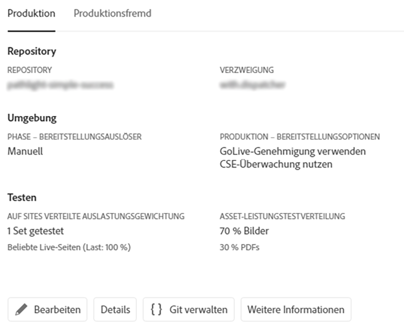
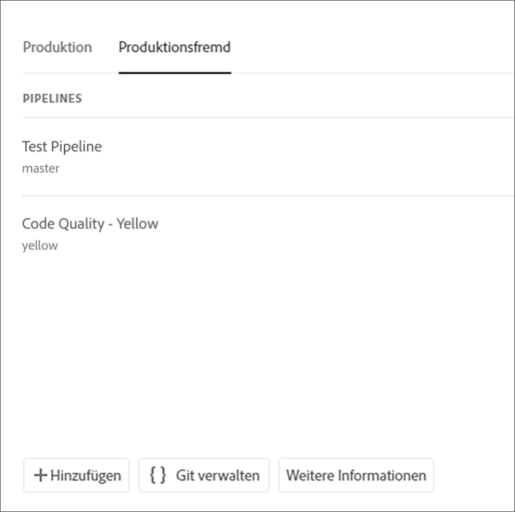
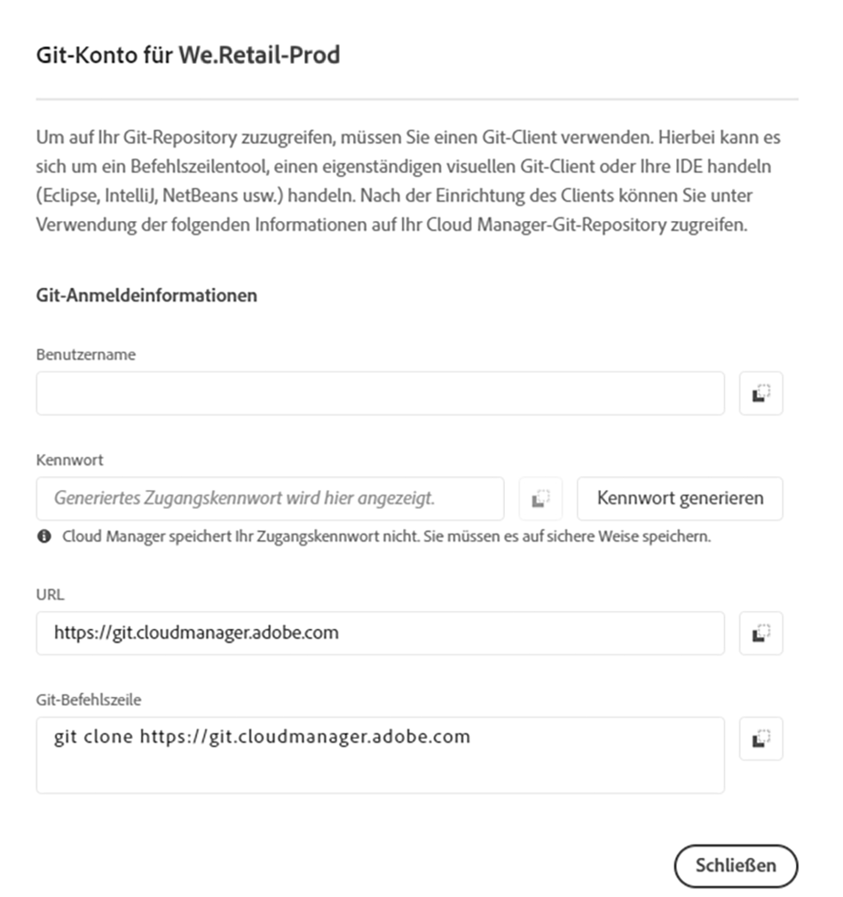

# Zugriff auf Git {#accessing-git}

Sie können über die Benutzeroberfläche von Cloud Manager mit der Self-Service-Git-Kontoverwaltung auf Ihr Git-Repository zugreifen und es verwalten.

## Verwenden der Self-Service-Git-Kontoverwaltung {#self-service-git}

Verwenden Sie die Schaltfläche **Git verwalten**, Sie in der Benutzeroberfläche von Cloud Manager – insbesondere auf der Pipeline-Karte – finden.

1. Navigieren Sie zur Seite *Programmübersicht* und zur Karte „Pipelines“.

1. Sie sehen die Option **Git verwalten**, mit der Sie auf Ihr Git-Repository zugreifen und es verwalten können.

   

   Wenn Sie außerdem die Registerkarte **Produktionsfremde** Pipelines auswählen, wird auch dort die Option **Git verwalten** angezeigt.

   

>[!NOTE]
>Die Option **Git verwalten** ist für Benutzer mit den Rollen „Entwickler“ und „Bereitstellungs-Manager“ sichtbar. Wenn Sie auf diese Schaltfläche klicken, wird ein Dialogfeld geöffnet, in dem der Benutzer die URL zum Cloud Manager-Git-Repository sowie den Benutzernamen und das Kennwort findet.

Wichtige Aspekte bei der Verwaltung Ihres Git-Repositorys in Cloud Manager:

* **URL**: Die Repository-URL
* **Benutzername**: Der Benutzername
* **Kennwort**: Der Wert, der angezeigt wird, wenn auf die Schaltfläche **Kennwort generieren** geklickt wird.

>[!NOTE]
>
>Ein Benutzer kann eine Kopie seines Codes auschecken und Änderungen am lokalen Code-Repository vornehmen. Sobald die Änderungen vorgenommen wurden, kann der Benutzer die Code-Änderungen wieder in das Remote-Code-Repository in Cloud Manager übertragen.
