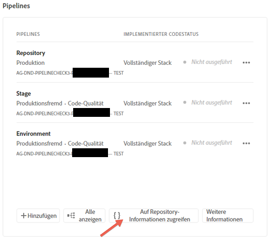
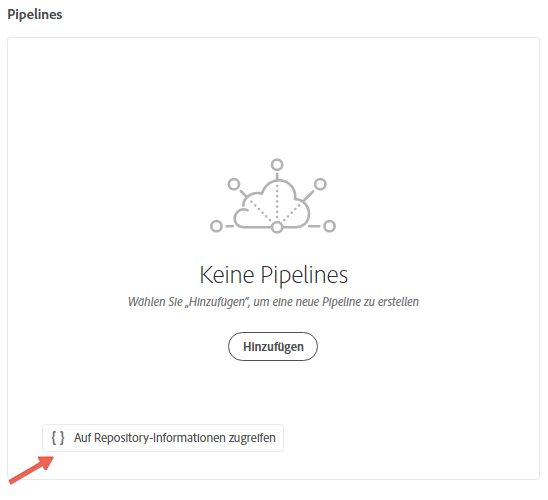
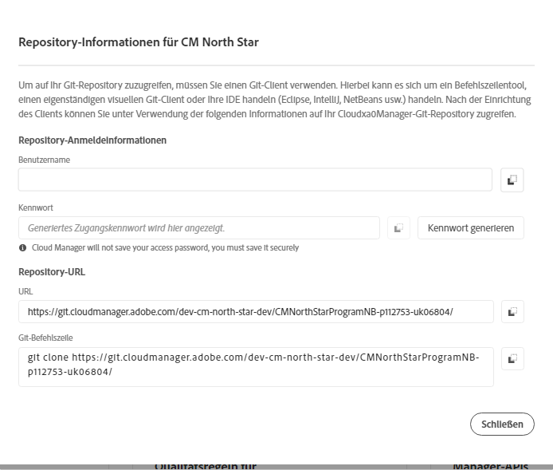

# Zugreifen auf Repositorys {#accessing-repos}

Sie können über die Benutzeroberfläche von Cloud Manager mit der Self-Service-Git-Kontoverwaltung auf Ihr Git-Repository zugreifen und es verwalten.

## Verwenden der Kontoverwaltung für Self-Service-Repositorys {#self-service-repos}

Verwenden Sie die Schaltfläche **Zugriff auf Repo Info** in der Cloud Manager-Benutzeroberfläche, insbesondere auf der Pipeline-Karte.

1. Navigieren Sie von Ihrer Seite **Programmübersicht** zur Karte **Pipelines** .

1. Sie sehen die Option **Zugriff auf Repo Info** , um auf Ihr Git-Repository zuzugreifen und es zu verwalten.

   

   Wenn Sie außerdem die Pipeline-Registerkarte **Nicht-Produktion** auswählen, wird auch dort die Option **Zugriff auf Repo Info** angezeigt.

   

   >[!NOTE]
   >Die Option **Zugriff auf Repo Info** ist für Benutzer in der Rolle &quot;Entwickler&quot;oder &quot;Bereitstellungs-Manager&quot;sichtbar. Wenn Sie auf diese Schaltfläche klicken, wird ein Dialogfeld geöffnet, in dem der Benutzer die URL zum Cloud Manager-Git-Repository sowie den Benutzernamen und das Kennwort findet.

   

   Wichtige Aspekte bei der Verwaltung Ihres Git-Repositorys in Cloud Manager:

   * **URL**: Die Repository-URL
   * **Benutzername**: Der Benutzername
   * **Kennwort**: Der Wert, der angezeigt wird, wenn auf die Schaltfläche **Kennwort generieren** geklickt wird.

      >[!NOTE]
      >Ein Benutzer kann eine Kopie seines Codes auschecken und Änderungen am lokalen Code-Repository vornehmen. Sobald die Änderungen vorgenommen wurden, kann der Benutzer die Code-Änderungen wieder in das Remote-Code-Repository in Cloud Manager übertragen.
