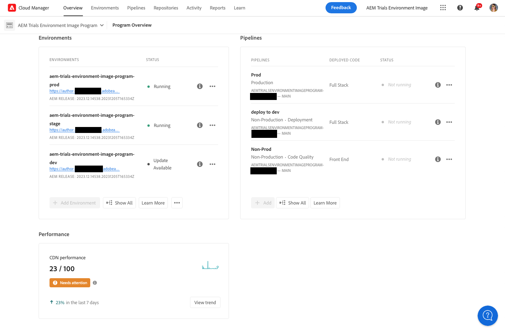

# CDN-Leistungs-Dashboard {#cdn-performance}

Erfahren Sie, wie Cloud Manager die Leistung des Inhaltsbereitstellungsnetzwerks (Content Delivery Network, CDN) bewertet und was Sie über das Dashboard lernen können.

## Überblick {#overview}

Jedes Cloud Manager-Programm verfügt über ein CDN-Leistungs-Dashboard. Dieses Dashboard enthält einen Gesamtwert für die CDN-Leistung sowie bei Bedarf Trends, Warnungen und Verbesserungsvorschläge.


## Zugriff auf das Dashboard {#accessing}

Das CDN-Dashboard ist auf der Übersichtsseite jedes Programms verfügbar.

1. Melden Sie sich unter [my.cloudmanager.adobe.com](https://my.cloudmanager.adobe.com/) bei Cloud Manager an und wählen Sie die entsprechende Organisation aus.

1. Klicken Sie in der Konsole **[Meine Programme](/help/implementing/cloud-manager/navigation.md#my-programs)** auf das Programm, dessen CDN-Dashboard angezeigt werden soll.

   

1. Scrollen Sie auf der Seite **Programmübersicht** Ihres Programms nach unten unter die Karten **Umgebungen** und **Pipelines**, um die Karte **Leistung** zu sehen.

   

## Verwenden des Dashboards {#using}

Das Dashboard enthält einen Gesamtwert für die CDN-Leistung sowie bei Bedarf Trends, Warnungen und Verbesserungsvorschläge.


Für Details zu Ihrer CDN-Leistung sowie für Vorschläge, wie Sie diese verbessern können, klicken Sie auf **Trend anzeigen**.


Klicken Sie auf **Ansicht** unterhalb des Diagramms, um die Zeitspanne des Diagramms zu ändern.

Für Vorschläge zur Verbesserung der CDN-Leistung wählen Sie die Registerkarte **Empfehlungen**.


Klicken Sie auf den Pfeil neben einer Empfehlung in der Liste, um Details zu den zu ergreifenden Verbesserungsmaßnahmen und zur Ursache des Problems anzuzeigen.

## Cache-Trefferdefinition {#cache-hit}

Das Cache-Trefferverhältnis ist eine Maßeinheit dafür, wie viele Inhaltsanfragen ein Cache erfolgreich füllen kann, im Vergleich zu wie vielen Anforderungen er erhält. Je höher das Cache-Trefferverhältnis ist, desto besser ist die Leistung eines CDN.

>[!TIP]
>
>Adobe empfiehlt, dass Benutzende ein Cache-Trefferverhältnis von 99 % anstreben.

```text
Cache Hit Ratio = Cache Hits / (Hits + Misses + Passes + Other)
```

* **Hit**: Daten werden aus dem Cache angefordert und gefunden.
* **Miss**: Daten werden aus dem Cache angefordert, aber nicht gefunden.
* **Pass**: Daten werden aus dem Cache angefordert und er so ist eingestellt, dass diese Daten auf keinen Fall zwischengespeichert werden.
* **Other**: Alle Datenanforderungen aus dem Cache, für die nichts der obigen der Fall ist.

Cache-Metriken werden alle 24 Stunden aktualisiert.

>[!TIP]
>
>Weitere Informationen zur Interaktion von Cloud Manager und CDN mit dem Dispatcher finden Sie im Dokument [Zwischenspeicherung in AEM as a Cloud Service.](/help/implementing/dispatcher/caching.md).
