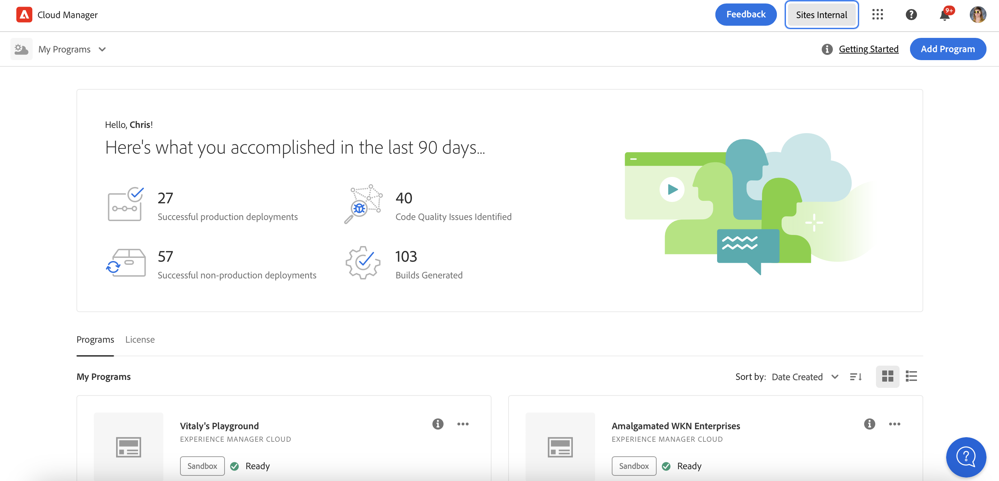

# CDN-Leistungs-Dashboard {#cdn-performance}

Erfahren Sie, wie Cloud Manager die Leistung des Inhaltsbereitstellungsnetzwerks (Content Delivery Network, CDN) bewertet und was Sie über das Dashboard lernen können.

## Übersicht {#overview}

Jedes Cloud Manager-Programm verfügt über ein Dashboard zur CDN-Leistung. Dieses Dashboard enthält einen Gesamtwert für die CDN-Leistung sowie bei Bedarf Trends, Warnungen und Verbesserungsvorschläge.


## Zugriff auf das Dashboard {#accessing}

Das CDN-Dashboard ist auf der Übersichtsseite jedes Programms verfügbar.

1. Melden Sie sich unter [my.cloudmanager.adobe.com](https://my.cloudmanager.adobe.com/) bei Cloud Manager an und wählen Sie die entsprechende Organisation aus.

1. Im **[Eigene Programme](/help/implementing/cloud-manager/getting-access-to-aem-in-cloud/editing-programs.md#my-programs)** auf das Programm, dessen CDN-Dashboard Sie anzeigen möchten, tippen oder klicken Sie darauf.

   

1. Im **Programmübersicht** Seite Ihres Programms nach unten scrollen Sie unter dem **Umgebungen** und **Pipelines** Karten, um die **Leistung** Karte.

   

## Dashboard verwenden {#using}

Das Dashboard enthält einen Gesamtwert für die CDN-Leistung sowie bei Bedarf Trends, Warnungen und Verbesserungsvorschläge.


Tippen oder klicken Sie auf , um Details zu Ihrer CDN-Leistung sowie Vorschläge zur Verbesserung zu erhalten. **Trend anzeigen**.


Tippen oder klicken **Ansicht** unterhalb des Diagramms, um die Zeitspanne des Diagramms zu ändern.

Für Vorschläge zur Verbesserung der CDN-Leistung wählen Sie die **Recommendations** Registerkarte.


Tippen oder klicken Sie auf den Pfeil neben einer Empfehlung in der Liste, um Details zu den zu ergreifenden Maßnahmen und zur Ursache des Problems anzuzeigen.

## Cache-Trefferdefinition {#cache-hit}

Das Cache-Trefferverhältnis ist eine Maßeinheit dafür, wie viele Inhaltsanforderungen ein Cache erfolgreich füllen kann, im Vergleich zu wie vielen Anforderungen er erhält. Je höher das Cache-Trefferverhältnis ist, desto besser ist die Leistung eines CDN.

>[!TIP]
>
>Adobe empfiehlt, dass Benutzer ein Cache-Trefferverhältnis von 99 % anstreben.

```text
Cache Hit Ratio = Cache Hits / (Hits + Misses + Passes + Other)
```

* **Treffer** - Daten werden aus dem Cache angefordert und gefunden.
* **Miss** - Daten werden aus dem Cache angefordert und nicht gefunden.
* **Pass** - Daten werden aus dem Cache angefordert und auf jeden Fall nicht auf diese Daten zwischengespeichert.
* **Sonstiges** - Alle Datenanforderungen aus dem Cache, die mit keinem anderen Fall übereinstimmen.

Cache-Metriken werden alle 24 Stunden aktualisiert.

>[!TIP]
>
>Weitere Informationen zur Interaktion von Cloud Manager und CDN mit dem Dispatcher finden Sie im Dokument . [Zwischenspeicherung in AEM as a Cloud Service.](/help/implementing/dispatcher/caching.md)
