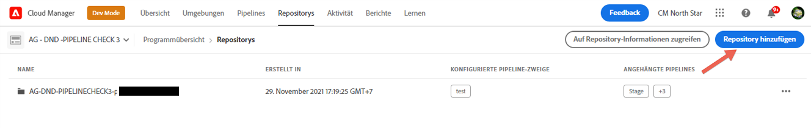
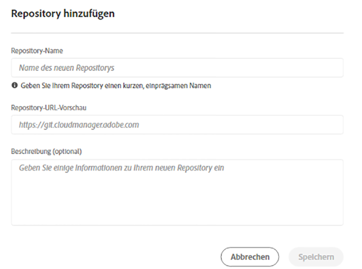
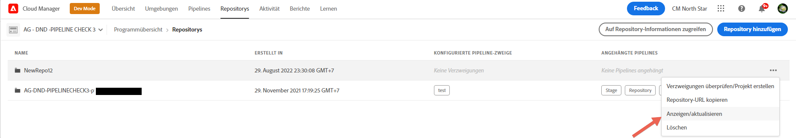

# Cloud Manager-Repositorys {#cloud-manager-repos}

Repositorys, die in Cloud Manager erstellt und verfügbar sind, können über die Seite Repositorys angezeigt und verwaltet werden.

## Hinzufügen und Verwalten von Repositorys {#add-manage-repos}

Gehen Sie wie folgt vor, um Repositorys in Cloud Manager anzuzeigen und zu verwalten:

1. Klicken Sie auf der Seite **Programmübersicht** auf die Registerkarte **Repositorys** und navigieren Sie zur Seite **Repositorys** .

1. Klicken Sie auf **Repository** hinzufügen , um den Assistenten zu starten.

   >[!NOTE]
   >Ein Benutzer mit der Rolle &quot;Bereitstellungsmanager&quot;oder &quot;Business Owner&quot;muss angemeldet sein, um ein Repository hinzufügen zu können.

   


1. Geben Sie den Namen und die Beschreibung wie gewünscht ein und klicken Sie auf **Speichern**.

   

1. Wählen Sie **Speichern** aus. Ihr neu erstelltes Repo wird wie unten dargestellt in der Tabelle angezeigt.

   

   >[!NOTE]
   >In Cloud Manager erstellte Repositorys stehen Ihnen auch zur Auswahl während der Schritte zum Hinzufügen oder Bearbeiten der Pipeline zur Verfügung. Weitere Informationen finden Sie unter [Konfigurieren der CI/CD-Pipeline](https://experienceleague.adobe.com/docs/experience-manager-cloud-service/implementing/using-cloud-manager/configure-pipeline.html?lang=en) .

1. Sie können das Repository auswählen und auf die Menüoptionen ganz rechts in der Tabelle klicken, um **Repository-URL kopieren**, **Anzeigen und Aktualisieren** oder **Löschen** Ihres Repositorys zu kopieren, wie in der folgenden Abbildung dargestellt.

   


## Unterstützung von Git-Untermodulen {#git-submodule-support}

Git-Untermodule können verwendet werden, um den Inhalt mehrerer Verzweigungen zum Zeitpunkt der Erstellung über Git-Repositorys hinweg zusammenzuführen. Wenn der Build-Prozess von Cloud Manager ausgeführt wird, nachdem das für die Pipeline konfigurierte Repository geklont und die konfigurierte Verzweigung ausgecheckt wurde, wird der Befehl ausgeführt, wenn die Verzweigung eine `.gitmodules`-Datei im Stammverzeichnis enthält.

```
$ git submodule update --init
```

Dadurch wird jedes Untermodul in das entsprechende Verzeichnis eingecheckt. Diese Technik ist eine potenzielle Alternative zu https://experienceleague.adobe.com/docs/experience-manager-cloud-service/implementing/managing-code/working-with-multiple-source-git-repositories.html für Organisationen, die mit der Verwendung von Git-Untermodulen vertraut sind und keinen externen Zusammenführungsprozess verwalten möchten.

Angenommen, es gibt drei Repositorys, die jeweils eine einzige Verzweigung mit dem Namen main enthalten. Im &quot;primären&quot;Repository, d. h. dem in den Pipelines konfigurierten, verfügt die Hauptverzweigung über eine Datei &quot;pom.xml&quot;, in der die in den beiden anderen Repositorys enthaltenen Projekte deklariert werden:

```xml
<?xml version="1.0" encoding="UTF-8"?>
<project xmlns="http://maven.apache.org/POM/4.0.0" xmlns:xsi="http://www.w3.org/2001/XMLSchema-instance"
    xsi:schemaLocation="http://maven.apache.org/POM/4.0.0 http://maven.apache.org/maven-v4_0_0.xsd">
    <modelVersion>4.0.0</modelVersion>
   
    <groupId>customer.group.id</groupId>
    <artifactId>customer-reactor</artifactId>
    <version>0.0.1-SNAPSHOT</version>
    <packaging>pom</packaging>
   
    <modules>
        <module>project-a</module>
        <module>project-b</module>
    </modules>
   
</project>
```

Anschließend würden Sie Untermodule für die beiden anderen Repositorys hinzufügen:

```
$ git submodule add -b main https://git.cloudmanager.adobe.com/ProgramName/projectA/ project-a
$ git submodule add -b main https://git.cloudmanager.adobe.com/ProgramName/projectB/ project-b
```

Dies führt zu einer `.gitmodules` -Datei, die wie folgt aussieht:

```
[submodule "project-a"]
    path = project-a
    url = https://git.cloudmanager.adobe.com/ProgramName/projectA/
    branch = main
[submodule "project-b"]
    path = project-b
    url = https://git.cloudmanager.adobe.com/ProgramName/projectB/
    branch = main
```

Weitere Informationen zu Git-Untermodulen finden Sie im [Git-Referenzhandbuch](https://git-scm.com/book/en/v2/Git-Tools-Submodules).

Beachten Sie bei der Verwendung von Git-Untermodulen Folgendes:

* Die Git-URL muss sich genau in der oben beschriebenen Syntax befinden. Betten Sie aus Sicherheitsgründen keine Anmeldeinformationen in diese URLs ein.
* Es werden nur Untermodule im Stammverzeichnis des Zweigs unterstützt.
* Git-Untermodulverweise werden für bestimmte Git-Commits gespeichert. Wenn also Änderungen am Submodul-Repository vorgenommen werden, muss der referenzierte Commit aktualisiert werden, z. B. mithilfe von `git submodule update --remote` .

