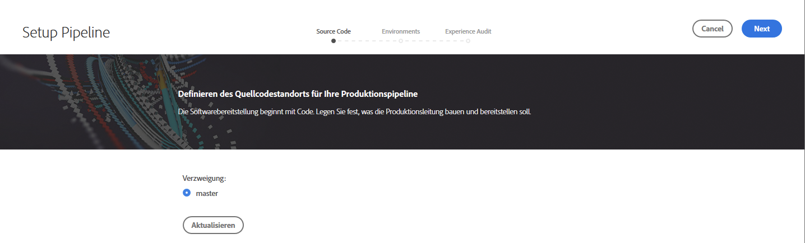
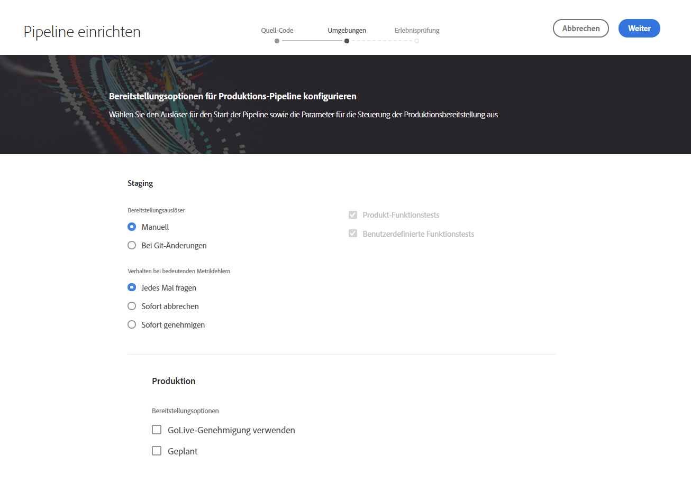
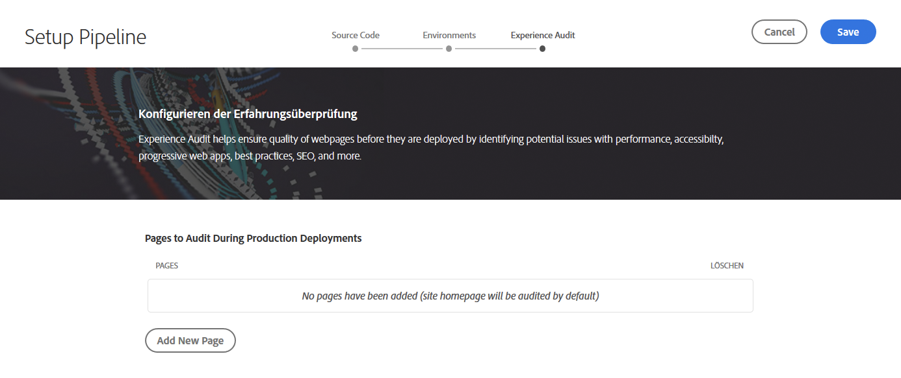
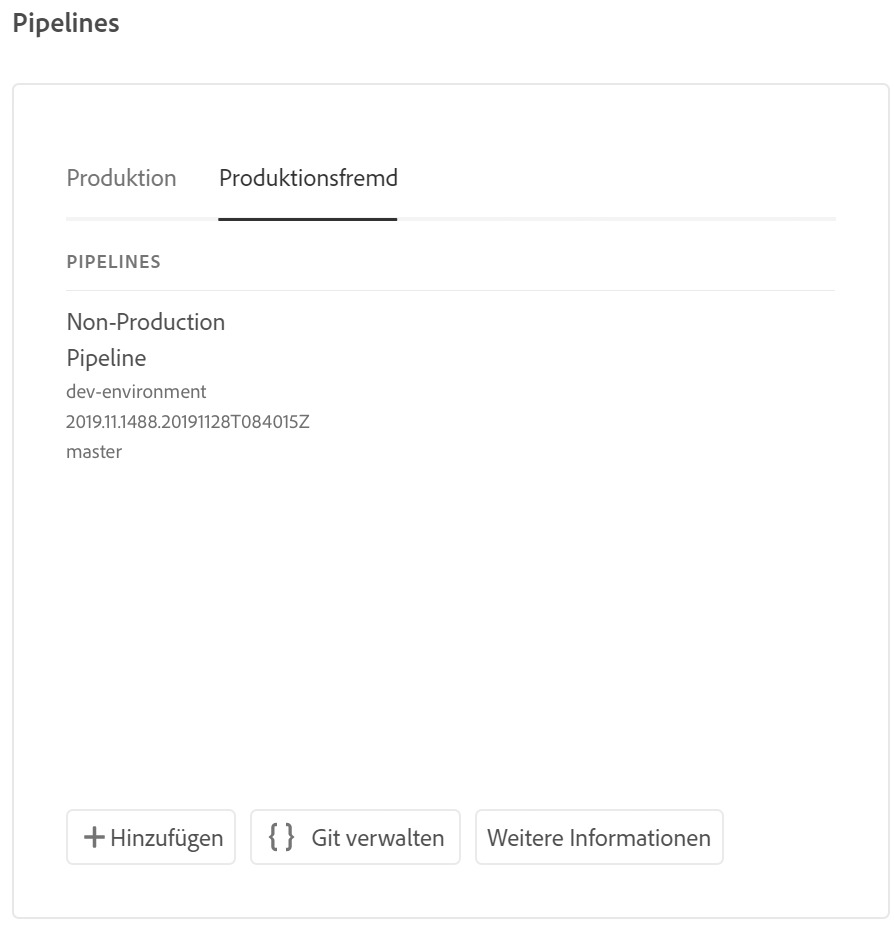
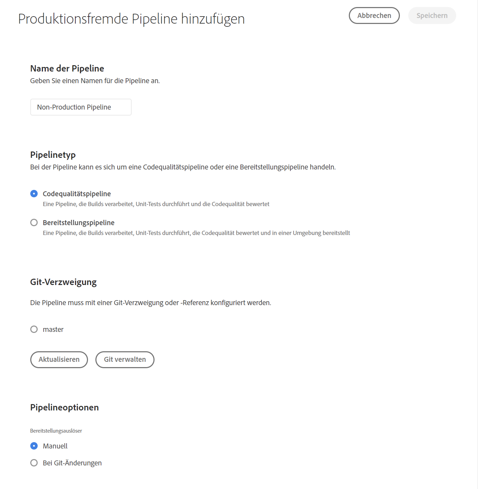
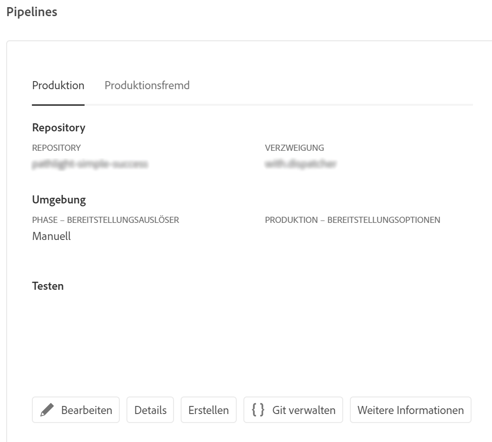

# Konfigurieren der CI/CD-Pipeline {#configure-ci-cd-pipeline}

In Cloud Manager gibt es zwei Arten von Pipelines:

* **Produktions-Pipeline**:

   Eine Produktions-Pipeline kann erst hinzugefügt werden, nachdem ein Satz aus Produktions- und Staging-Umgebung erstellt wurde.

   Weitere Informationen finden Sie unter [Einrichten einer Produktions-Pipeline](configure-pipeline.md#setting-up-the-pipeline).

* **Produktionsfremde Pipeline**

   Auf der Seite **Überblick** der Benutzeroberfläche von Cloud Manager kann eine produktionsfremde Pipeline hinzugefügt werden.

   Weitere Informationen finden Sie unter [Produktionsfremde Pipelines und Pipelines für Tests der Code-Qualität](configure-pipeline.md#non-production-pipelines).

>[!NOTE]
>Zur Konfiguration der Pipeline müssen Sie:
> * den Auslöser festlegen, der die Pipeline startet,
> * Parameter zur Steuerung der Produktionsimplementierung festlegen,
> * Leistungstestparameter konfigurieren.

## Einrichten einer Produktions-Pipeline {#setting-up-production-pipeline}

Der Implementierungs-Manager ist für die Einrichtung der Produktions-Pipeline verantwortlich.

>[!NOTE]
>Eine Produktions-Pipeline kann erst eingerichtet werden, wenn die Erstellung eines Programms abgeschlossen wurde, das Git-Repository über mindestens eine Verzweigung verfügt und ein Satz aus Produktions- und Staging-Umgebung erstellt wurde.

Bevor Sie Code bereitstellen, müssen Sie Ihre Pipelineeinstellungen über [!UICONTROL Cloud Manager] konfigurieren.

>[!NOTE]
>
>Sie können die Pipelineeinstellungen nach der Ersteinrichtung ändern.

## Konfigurieren der Pipeline-Einstellungen in [!UICONTROL Cloud Manager] {#configuring-the-pipeline-settings-from-cloud-manager}

Sobald Sie Ihr Programm eingerichtet haben und über mindestens eine Umgebung mit der [!UICONTROL Cloud Manager]-Benutzeroberfläche verfügen, können Sie Ihre Implementierungs-Pipeline einrichten.

Führen Sie folgende Schritte aus, um das Verhalten und die Voreinstellungen für Ihre Pipeline zu konfigurieren:

1. Klicken Sie auf **Pipeline einrichten**, um Ihre Pipeline einzurichten und zu konfigurieren.

   

1. Der Bildschirm **Pipeline einrichten** wird angezeigt. Wählen Sie die Verzweigung aus und klicken Sie auf **Weiter**.

   

1. Konfigurieren Sie die Implementierungsoptionen.

   

   Sie können den Auslöser definieren, mit dem die Pipeline gestartet wird:

   * **Manuell**: Die Pipeline wird über die Benutzeroberfläche manuell gestartet.
   * **Zu Git-Änderungen**: Startet die CI/CD-Pipeline, wenn zur konfigurierten Git-Verzweigung Commits hinzugefügt werden. Wenn Sie diese Option auswählen, können Sie die Pipeline weiterhin manuell starten.

   Bei der Einrichtung oder Bearbeitung der Pipeline kann der Implementierungsmanager festlegen, wie sich die Pipeline verhält, wenn bei einem der Quality Gates (Test der Code-Qualität, Sicherheitstest und Leistungstest) ein wichtiger Fehler auftritt.

   Das ist für Kunden nützlich, die die Prozesse stärker automatisieren möchten. Die verfügbaren Optionen sind:

   * **Jedes Mal fragen**: Das ist die Standardeinstellung und erfordert manuelles Eingreifen bei einem wichtigen Fehler.
   * **Sofort**  abbrechen: Wenn diese Option aktiviert ist, wird die Pipeline bei Auftreten eines wichtigen Fehlers abgebrochen. Damit wird im Grunde ein Benutzer simuliert, der manuell jeden Fehler ablehnt.
   * **Sofort**  genehmigen: Bei Auswahl dieser Option wird die Pipeline automatisch fortgesetzt, sobald ein Fehler &quot;Wichtig&quot;auftritt. Damit wird im Grunde ein Benutzer simuliert, der manuell jeden Fehler genehmigt.

1. Die Einstellungen für die Produktions-Pipeline enthalten eine dritte Registerkarte mit der Bezeichnung **Experience Audit**. Diese Option enthält eine Tabelle der URL-Pfade, die im Experience Audit stets enthalten sein sollten.

   >[!NOTE]
   >Sie müssen auf **Neue Seite hinzufügen** klicken, um einen eigenen benutzerspezifischen Link zu definieren.

   

   Klicken Sie auf **Neue Seite hinzufügen**, um einen URL-Pfad anzugeben, der in die Erlebnisprüfung aufgenommen werden soll.

   Wenn Sie zum Beispiel `https://wknd.site/us/en/about-us.html` in die Erlebnisprüfung einschließen möchten, geben Sie den Pfad `us/en/about-us.html` in dieses Feld ein und klicken Sie auf **Speichern**.

   

   Die in der Tabelle angezeigte URL lautet:

   `https://publish-p14253-e43686.adobeaemcloud.com/us/en/about-us.html`

   

   Es können maximal 25 Zeilen eingefügt werden. Wenn der Benutzer in diesem Abschnitt keine Seiten übermittelt hat, wird die Startseite der Site standardmäßig in die Erlebnisprüfung einbezogen.

   Weitere Informationen finden Sie unter [Verstehen der Ergebnisse von Experience Audit](/help/implementing/cloud-manager/experience-audit-testing.md).

   >[!NOTE]
   > Die konfigurierten Seiten werden an den Dienst gesendet und gemäß den Tests für Leistung, Barrierefreiheit, SEO (Suchmaschinenoptimierung), Best Practice und PWA (Progressive Web App) bewertet.

1. Klicken Sie im Bildschirm **Pipeline bearbeiten** auf **Speichern**. Auf der Seite **Übersicht** wird nun die Karte **Ihr Programm bereitstellen** angezeigt. Klicken Sie auf **Bereitstellen**, um das Programm bereitzustellen.

   

## Produktionsfremde Pipelines und Pipelines für Tests der Codequalität {#non-production-pipelines}

Zusätzlich zur Haupt-Pipeline, die für die Staging- und Produktionsumgebung bereitgestellt wird, können Kunden weitere Pipelines einrichten, die als **produktionsfremde Pipelines** bezeichnet werden. Diese Pipelines führen immer die Schritte Build-Erstellung und Tests der Codequalität aus. Sie können optional auch für die Adobe Managed Services-Umgebung bereitgestellt werden.

Auf dem Startbildschirm werden diese Pipelines in einer neuen Karte aufgeführt:

1. Greifen Sie im Cloud Manager-Startbildschirm auf die Kachel **Nicht-Produktions-Pipelines** zu.

   

1. Klicken Sie auf **Hinzufügen**, um den Pipeline-Namen, den Pipeline-Typ und die Git-Verzweigung anzugeben.

   Außerdem können Sie in den Pipeline-Optionen Implementierungsauslöser und das Verhalten bei wichtigen Fehlern festlegen.

   

1. Klicken Sie auf **Speichern**, damit die Pipeline (wie unten dargestellt) auf der Karte auf dem Startbildschirm mit drei Aktionen angezeigt wird:

   

   * **Bearbeiten**: Ermöglicht die Bearbeitung der Pipeline-Einstellungen.
   * **Erstellen**: Wechselt zur Ausführungsseite, von der die Pipeline ausgeführt werden kann.
   * **Git verwalten**: Ermöglicht es dem Benutzer, die für den Zugriff auf das Cloud Manager-Git-Repository erforderlichen Informationen abzurufen.

## Die nächsten Schritte {#the-next-steps}

Nachdem die Konfiguration der Pipeline abgeschlossen ist, müssen Sie Ihren Code bereitstellen.

Weitere Informationen finden Sie unter [Bereitstellen Ihres Codes](deploy-code.md).
