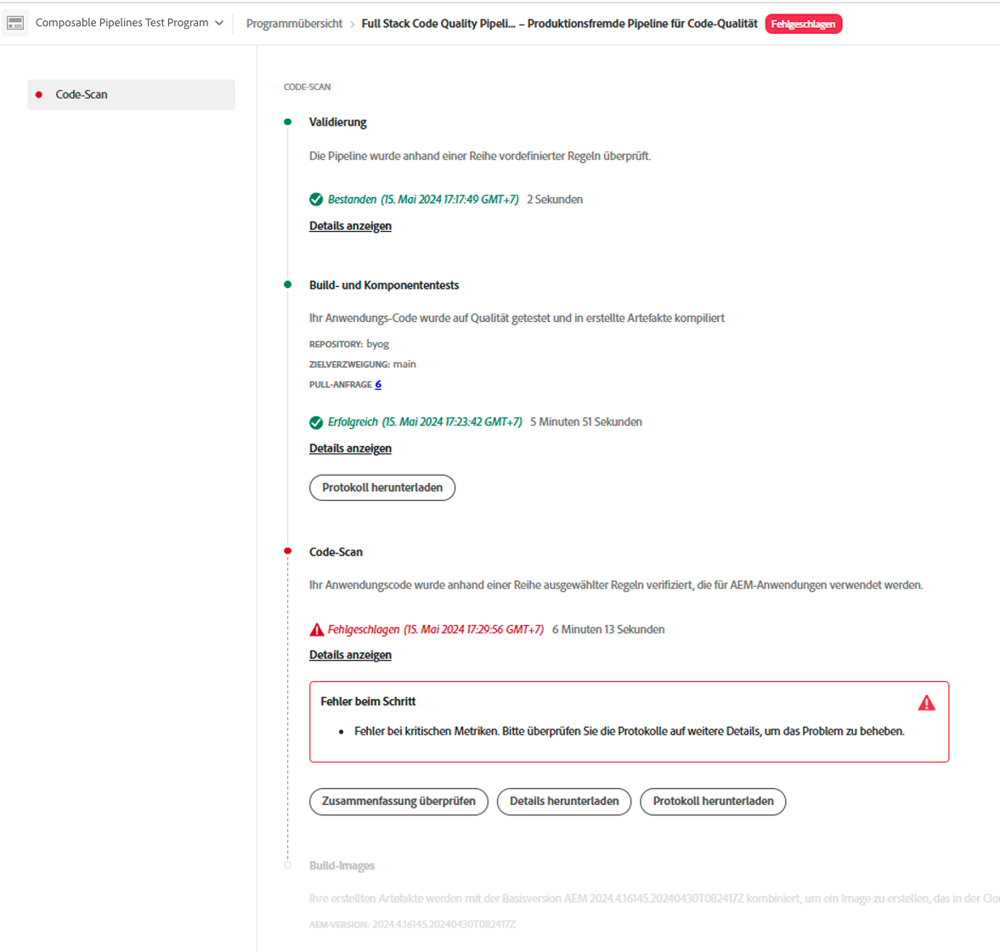

# Verwalten von Pipelines {#managing-pipelines}

Erfahren Sie, wie Sie Ihre vorhandenen Pipelines verwalten, einschließlich ihrer Bearbeitung, Ausführung und Löschung.

## Pipeline-Karte {#pipeline-card}

Die Karte **Pipelines** auf der Seite **Programmübersicht** in Cloud Manager bietet Ihnen einen Überblick über alle Ihre Pipelines und deren aktuellen Status.

Wenn Sie auf  neben den einzelnen Pipelines klicken, können Sie die folgenden Aktionen ausführen:

* [Ausführen einer Pipeline](#running-pipelines)
* [Abbrechen einer Pipeline](#cancel)
* [Bearbeiten einer Pipeline](#editing-pipelines)
* [Löschen einer Pipeline](#deleting-pipelines)
* [Anzeigen von Details der letzten Ausführung einer Pipeline](#view-details)

Am Ende der Pipeline-Liste befinden sich die folgenden allgemeinen Optionen:

* **Hinzufügen**: Dient zum [Hinzufügen einer neuen Produktions-Pipeline](configuring-production-pipelines.md) oder zum [Hinzufügen einer neuen produktionsfremden Pipeline](configuring-non-production-pipelines.md).
* **Alle anzeigen**: Leitet den Anwender zum Bildschirm „Pipelines“, wo alle Pipelines in einer detaillierteren Tabelle angezeigt werden.
* **Zugriff auf Repo Info**: Zeigt die Informationen an, die für den Zugriff auf das Cloud Manager-Git-Repository erforderlich sind
* **Weitere Infos**: Navigiert zu den Dokumentationsressourcen zur CI/CD-Pipeline.

## Seite „Pipelines“ {#pipelines}

Die Seite **Pipelines** zeigt eine vollständige Liste aller Pipelines für das ausgewählte Programm an. Diese Information ist nützlich, da sie umfassendere Informationen enthält, als auf der [Pipeline-Karte](#pipeline-card) verfügbar sind.

1. Melden Sie sich unter [my.cloudmanager.adobe.com](https://my.cloudmanager.adobe.com/ ) bei Cloud Manager an und wählen Sie die entsprechende Organisation aus.

1. Wählen Sie in der Konsole **[Meine Programme](/help/implementing/cloud-manager/navigation.md#my-programs)** das Programm aus.

1. Klicken Sie auf der Seite **Programmübersicht** auf die Registerkarte  **Pipelines**.

1. Auf der Seite **Pipelines** können Sie eine Liste aller Pipelines für das Programm sehen und die Pipeline-Ausführung starten und stoppen, wie Sie es auf der **Pipelines-Karte** tun würden.

Wenn eine Pipeline ausgeführt wird, können Sie in der Spalte **Status** auf  klicken, um ein Popup mit Informationen zur Ausführung anzuzeigen. Klicken Sie im Popup-Fenster auf **Details anzeigen**, um [Details zur Pipeline-Ausführung](#view-details) zu sehen.

Sie können auch auf  neben der Pipeline klicken, um zusätzliche Aktionen durchzuführen, die dem Pipeline-Status entsprechen, z. B. die Pipeline [bearbeiten](#editing-pipelines) oder die [Ausführung abbrechen](#cancel).

## Seite „Aktivität“ {#activity}

Die Seite **Aktivität** enthält eine vollständige Liste aller Pipelines, die für das ausgewählte Programm und andere wichtige Programmereignisse ausgeführt werden.

1. Melden Sie sich unter [my.cloudmanager.adobe.com](https://my.cloudmanager.adobe.com/ ) bei Cloud Manager an und wählen Sie die entsprechende Organisation sowie das entsprechende Programm aus.

1. Klicken Sie auf der Seite **Programmübersicht** im Seitenmenü auf  **Aktivität**.

1. Auf der Seite **Aktivität** sehen Sie eine Liste aller Pipeline-Ausführungen für das Programm, einschließlich aktueller und vorheriger Ausführungen.

Wenn eine Pipeline ausgeführt wird, können Sie in der Spalte **Status** auf  klicken, um ein Popup mit Informationen zur Ausführung anzuzeigen.

Klicken Sie auf die Zeile für die Pipeline-Ausführung, um [Details zur Pipeline-Ausführung](#view-details) anzuzeigen.

Sie können auch auf  klicken, um zusätzliche Aktionen für die Pipeline-Ausführung durchzuführen, z. B. Details anzeigen oder das Protokoll herunterladen, wodurch Sie zur [Seite mit den Pipeline-Details](#view-details) gelangen.

## Ausführen einer Pipeline {#running-pipelines}

1. Melden Sie sich unter [my.cloudmanager.adobe.com](https://my.cloudmanager.adobe.com/ ) bei Cloud Manager an und wählen Sie die entsprechende Organisation sowie das entsprechende Programm aus.

1. Navigieren Sie von der Seite **Programmübersicht** aus zur Karte **Pipelines**.

1. Klicken Sie neben der von Ihnen ausgeführten Pipeline auf .

1. Klicken Sie im Dropdown-Menü auf  **Ausführen**.

   Die Pipeline wird gestartet und der Fortschritt in der Spalte **Status** angezeigt.

Sie können die Details der Ausführung sehen, indem Sie erneut auf  klicken und dann **[Details anzeigen](#view-details)** auswählen.

Je nach Pipeline-Typ können Sie die Ausführung möglicherweise abbrechen, indem Sie erneut auf  klicken und **Abbrechen** auswählen.

## Bearbeiten einer Pipeline {#editing-pipelines}

Sie können eine Pipeline bearbeiten, wenn sie nicht ausgeführt wird.

1. Melden Sie sich unter [my.cloudmanager.adobe.com](https://my.cloudmanager.adobe.com/ ) bei Cloud Manager an und wählen Sie die entsprechende Organisation sowie das entsprechende Programm aus.

1. Navigieren Sie von der Seite **Programmübersicht** aus zur Karte **Pipelines**.

1. Klicken Sie neben der Pipeline, die bearbeitet werden soll, auf .

1. Klicken Sie im Dropdown-Menü auf **Bearbeiten**.

1. Bearbeiten Sie im Dialogfeld **Produktions-Pipeline bearbeiten** bzw. **Produktionsfremde Pipeline bearbeiten** die Details, die Sie beim Erstellen der Pipeline eingegeben haben.

   Auf den folgenden Seiten finden Sie Details zu den Feldern und Konfigurationsoptionen, die für Pipelines verfügbar sind.
   * [Konfigurieren einer Produktions-Pipeline](configuring-production-pipelines.md)
   * [Konfigurieren einer produktionsfremden Pipeline](configuring-non-production-pipelines.md)

1. Wenn Sie fertig sind, klicken Sie **Aktualisieren**.

>[!NOTE]
>
>Pipelines auf Web-Ebene und Konfigurations-Pipelines werden bei privaten Repositorys nicht unterstützt. Weitere Informationen sowie eine vollständige Liste der Einschränkungen finden Sie unter [Hinzufügen eines privaten GitHub-Repositorys in Cloud Manager](/help/implementing/cloud-manager/managing-code/private-repositories.md).

## Löschen einer Pipeline {#deleting-pipelines}

Sie können eine Pipeline löschen, wenn sie nicht ausgeführt wird.

1. Melden Sie sich unter [my.cloudmanager.adobe.com](https://my.cloudmanager.adobe.com/ ) bei Cloud Manager an und wählen Sie die entsprechende Organisation sowie das entsprechende Programm aus.

1. Navigieren Sie von der Seite **Programmübersicht** aus zur Karte **Pipelines**.

1. Klicken Sie neben der von Ihnen ausgeführten Pipeline auf .

1. Klicken Sie im Dropdown-Menü auf **Löschen**.

## Anzeigen von Details der letzten Ausführung einer Pipeline {#view-details}

Sie können die Details einer Pipeline prüfen, um den Status und die Protokolle ihrer letzten Ausführung anzuzeigen. Ein Zugriff auf die Details ist jedoch nur möglich, wenn die Pipeline aktuell ausgeführt wird oder bereits mindestens einmal ausgeführt wurde.

1. Melden Sie sich unter [my.cloudmanager.adobe.com](https://my.cloudmanager.adobe.com/ ) bei Cloud Manager an und wählen Sie die entsprechende Organisation sowie das entsprechende Programm aus.

1. Navigieren Sie von der Seite **Programmübersicht** aus zur Karte **Pipelines**.

1. Klicken Sie im Dropdown-Menü neben der von Ihnen ausgeführten Pipeline auf .

1. Klicken Sie im Dropdown-Menü auf **Letzte Ausführung anzeigen**.

   Sie gelangen zur Detailseite der Pipeline, die gerade ausgeführt wird.

   

   Von hier aus können Sie den Status der verschiedenen Schritte der Pipeline einsehen und Build-Protokolle zu Diagnosezwecken abrufen. Weitere Informationen zur Bereitstellung von Code und Durchführung von Testläufen finden Sie unter [Bereitstellen Ihres Codes](/help/implementing/cloud-manager/deploy-code.md).

   Es werden alle Schritte einer Pipeline-Ausführung angezeigt, wobei die Schritte, die noch nicht gestartet wurden, ausgegraut sind. Die abgeschlossenen Schritte werden mit ihrer jeweiligen Dauer angezeigt.

   Wenn ein Pipeline-Schritt abgeschlossen ist, wird eine Zusammenfassung angezeigt.

   

1. Klicken Sie auf **Details anzeigen**, um den Abschnitt **Dauer** zu erweitern. Dort können Sie die durchschnittliche Pipeline-Dauer basierend auf den historischen Trends des Programms anzeigen.

   

1. Wenn Ihre Pipeline den Schritt **Code-Scan** umfasst hat, bei dem Probleme aufgetreten sind, klicken Sie auf die Schaltfläche **Details herunterladen**, um auf eine Liste der [Code-Qualitätstests](/help/implementing/cloud-manager/code-quality-testing.md) zuzugreifen, die nicht bestanden wurden.

   

   Die CSV-Datei enthält eine Spalte mit dem **Speicherort der Projektdatei**, in der der Pfad zum problematischen Code relativ zum Projekt angezeigt wird. Im Gegensatz dazu entspricht die Spalte **Dateispeicherort** dem von Maven generierten Pfad.

   

## Abbrechen einer Pipeline {#cancel}

Sie können die Pipeline-Ausführung sicher abbrechen, wenn sie sich in der Phase der Validierung oder des Bildaufbaus befindet.

1. Melden Sie sich unter [my.cloudmanager.adobe.com](https://my.cloudmanager.adobe.com/ ) bei Cloud Manager an und wählen Sie die entsprechende Organisation sowie das entsprechende Programm aus.

1. Klicken Sie auf der Seite „Programmübersicht“ auf der Karte **Pipelines** auf  für die Pipeline, für die ein Abbruch durchgeführt werden soll.

   

1. Klicken Sie auf **Abbrechen**.

Alternativ können Sie eine Pipeline auf der Seite mit den Pipeline-Details abbrechen.

1. Melden Sie sich unter [my.cloudmanager.adobe.com](https://my.cloudmanager.adobe.com/ ) bei Cloud Manager an und wählen Sie die entsprechende Organisation sowie das entsprechende Programm aus.

1. Navigieren Sie von der Seite **Programmübersicht** zur Registerkarte  **Pipelines** und wählen Sie die Pipeline aus, für die ein Abbruch durchgeführt werden soll.

   Sie gelangen zur Detailseite der Pipeline, die gerade ausgeführt wird.

   

1. Klicken Sie auf **Abbrechen**.
