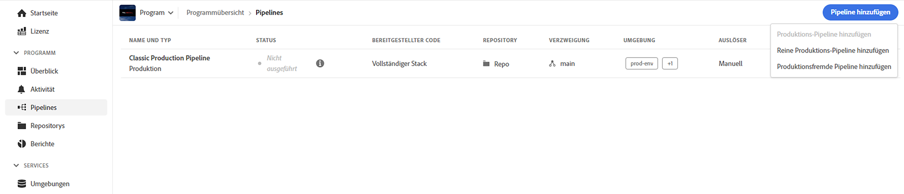
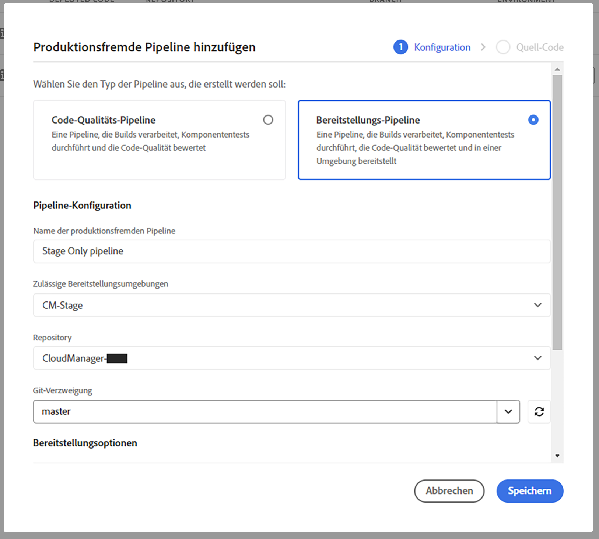

# Reine Staging- und Produktions-Pipelines {#stage-prod-only}

Erfahren Sie, wie Sie Staging- und Produktionsbereitstellungen mithilfe von dedizierten Pipelines aufteilen können.

>[!NOTE]
>
>Diese Funktion ist nur für das [Early-Adopter-Programm](/help/implementing/cloud-manager/release-notes/current.md#early-adoption) verfügbar.

## Überblick {#overview}

Staging- und Produktionsumgebungen sind eng miteinander verbunden. Standardmäßig sind die damit verknüpften Bereitstellungen mit einer einzelnen Pipeline verknüpft. Hierbei handelt es sich um eine Bereitstellungs-Pipeline, die sowohl für die Staging- als auch für die Produktionsumgebung in diesem Programm bereitgestellt wird. Diese Kopplung ist zwar in der Regel geeignet, es gibt jedoch einige Anwendungsfälle, in denen Nachteile vorliegen:

* Wenn Sie die Bereitstellung nur für die Staging-Umgebung durchführen möchten, können Sie dies nur tun, indem Sie den Schritt **Zur Produktion weiterleiten** in der Pipeline ablehnen. Die Ausführung wird jedoch als abgebrochen markiert.
* Wenn Sie den neuesten Code in einer Staging-Umgebung für die Produktion bereitstellen möchten, müssen Sie die gesamte Pipeline einschließlich der Staging-Bereitstellung erneut bereitstellen, selbst wenn dort kein Code geändert wurde.
* Da Umgebungen während der Bereitstellung nicht aktualisiert werden können, ist es nicht möglich, die Produktionsumgebung zu aktualisieren, wenn Sie mehrere Tage in der Staging-Umgebung pausieren und testen möchten, bevor Sie sie zur Produktion weiterleiten. Dies macht nicht abhängige Aufgaben wie die Aktualisierung von [Umgebungsvariablen](/help/implementing/cloud-manager/getting-access-to-aem-in-cloud/build-environment-details.md#environment-variables) unmöglich.

Reine Staging- und Produktions-Pipelines bieten Lösungen für diese Anwendungsfälle, indem sie dedizierte Bereitstellungsoptionen bieten.

* **Bereitstellungs-Pipelines für reine Staging-Umgebungen** stellen nur in einer Staging-Umgebung bereit und beenden die Ausführung, sobald die Bereitstellung und die Tests abgeschlossen sind.
   * Eine reine Staging-Pipeline verhält sich genauso wie die standardmäßig gekoppelte Full-Stack-Produktions-Pipeline, jedoch ohne die Schritte der Produktionsbereitstellung (Genehmigung, Zeitplan, Bereitstellung).
* **Bereitstellungs-Pipelines für reine Produktionsumgebungen** stellen nur in einer Produktionsumgebung bereit, mit der Möglichkeit, eine erfolgreich abgeschlossene und validierte Ausführung in der Staging-Umgebung auszuwählen und ihre Artefakte in der Produktionsumgebung bereitzustellen.
   * Reine Produktions-Pipelines verwenden die Artefakte aus den Staging-Bereitstellungen erneut und überspringen die Erstellungsphase.

Weder reine Staging- noch reine Produktions-Pipelines werden ausgeführt, während eine Full-Stack-Produktions-Pipeline läuft und umgekehrt. Wenn sowohl bei der reinen Staging- als auch bei der Full-Stack-Produktions-Pipeline der Trigger **Bei Git-Änderungen** konfiguriert wurde und auf dieselbe Verzweigung und dasselbe Repository verweist, wird nur die reine Staging-Pipeline automatisch gestartet. Reine Produktions-Pipelines werden nicht mit **Bei Git-Änderungen** gestartet, da sie nicht direkt mit einem Repository verknüpft sind.

Diese dedizierten Pipelines bieten mehr Flexibilität. Beachten Sie jedoch die folgenden Details zum Betrieb und Empfehlungen.

## Einschränkungen {#limitations}

Reine Produktions-Pipelines verwenden immer die Artefakte aus der reinen Produktions-Pipeline, unabhängig davon, was in der Zwischenzeit über die standardmäßig gekoppelte Produktions-Pipeline auf der Staging-Umgebung bereitgestellt worden ist.

* Dies könnte zu unerwünschten Code-Rollbacks führen.
* Adobe empfiehlt, die standardmäßig gekoppelte Produktions-Pipeline nicht mehr zu verwenden, wenn Sie mit der Verwendung der reinen Produktions- und Staging-Pipelines beginnen.
* Wenn Sie weiterhin die standardmäßigen gekoppelten Pipelines und die reinen Staging-/Produktions-Pipelines ausführen möchten, sollten Sie die Wiederverwendung von Artefakten nicht vergessen, um Code-Rollbacks zu vermeiden.

## Bekannte Probleme {#known-issues}

Beachten Sie auch die folgenden bekannten Probleme, bevor Sie mit dem Testen dieser Funktion beginnen.

* Wenn Sie reine Produktions-Pipelines verwenden, profitieren Sie möglicherweise nicht von den neuesten AEM-Aktualisierungen.
   * In einigen Fällen kann der AEM-Aktualisierungsprozess den Code wieder auf den Code zurücksetzen, der zuletzt über die Full-Stack-Pipeline bereitgestellt wurde.
* Sie können keine [Umgebungswiederherstellung](/help/operations/restore.md#offsite-backup) anfordern, wenn Sie reine Produktions- oder Staging-Pipelines verwenden.

## Pipeline-Erstellung {#pipeline-creation}

Die Erstellung von reinen Produktions- und Staging-Pipelines erfolgt auf ähnliche Weise wie bei den standardmäßig gekoppelten [Produktions-Pipelines](/help/implementing/cloud-manager/configuring-pipelines/configuring-production-pipelines.md) und [produktionsfremden Pipelines.](/help/implementing/cloud-manager/configuring-pipelines/configuring-non-production-pipelines.md) Weitere Informationen finden Sie in diesen Dokumenten.

1. Tippen oder klicken Sie im Fenster **Pipelines** auf **Pipeline hinzufügen**.

   * Wählen Sie **Produktionsfremde Pipeline hinzufügen**, um eine reine Staging-Pipeline zu erstellen.
   * Wählen Sie **Reine Produktions-Pipeline hinzufügen**, um eine reine Produktions-Pipeline zu erstellen.

   

>[!NOTE]
>
>Bestimmte Optionen können ausgegraut sein, wenn die entsprechenden Pipelines bereits vorhanden sind.
>
>* **Reine Produktions-Pipeline hinzufügen** ist nicht verfügbar, wenn noch keine reine Staging-Pipeline existiert.
>* **Produktions-Pipeline hinzufügen** ist nicht verfügbar, wenn bereits eine standardmäßige gekoppelte Pipeline vorhanden ist.
>* Pro Programm ist nur eine reine Produktions-Pipeline und eine reine Staging-Pipeline zulässig.

### Reine Staging-Pipelines {#stage-only}

1. Sobald Sie die Option **Produktionsfremde Pipeline hinzufügen** gewählt haben, öffnet sich der Dialog **Produktionsfremde Pipeline hinzufügen**.
1. Um eine reine Staging-Pipeline zu erstellen, wählen Sie die Staging-Umgebung im Feld **Zulässige Bereitstellungsumgebungen** für Ihre Pipeline aus. Füllen Sie die restlichen Felder aus und tippen oder klicken Sie auf **Fortfahren**.

   

1. Auf der Registerkarte **Staging-Tests** können Sie dann Tests definieren, die in der Staging-Umgebung durchgeführt werden sollen. Tippen oder klicken Sie auf **Speichern**, um Ihre neue Pipeline zu speichern.

### Reine Produktions-Pipelines {#prod-only}

1. Sobald Sie die Option **Reine Produktions-Pipeline hinzufügen** gewählt haben, öffnet sich das Dialogfeld **Reine Produktions-Pipeline hinzufügen**.
1. Geben Sie einen **Pipeline-Namen** an. Die verbleibenden Optionen und Funktionen des Dialogfelds funktionieren genauso wie im Dialogfeld zur Erstellung der standardmäßig gekoppelten Pipeline. Tippen oder klicken Sie auf **Speichern**, um die Pipeline zu speichern.

## Ausführen von reinen Produktions- und Staging-Pipelines {#running}

Reine Produktions- und Staging-Pipelines werden auf die gleiche Weise ausgeführt wie [alle anderen Pipelines.](/help/implementing/cloud-manager/configuring-pipelines/managing-pipelines.md#running-pipelines) Weitere Informationen finden Sie in dieser Dokumentation.

Darüber hinaus kann ein Lauf einer reinen Produktions-Pipeline direkt aus den Ausführungsdetails einer reinen Staging-Pipeline ausgelöst werden.

### Reine Staging-Pipelines {#stage-only-run}

Eine reine Staging-Pipeline wird fast genauso ausgeführt wie eine standardmäßige gekoppelte Pipeline. Am Ende des Laufs, nach den Testschritten, können Sie jedoch über die Schaltfläche **Build weiterleiten** eine reine Produktions-Pipeline-Ausführung starten, die die Artefakte, die während dieses Durchlaufs in der Staging-Umgebung bereitgestellt wurden, verwendet und in der Produktion bereitstellt.

Die Schaltfläche **Build weiterleiten** wird nur angezeigt, wenn Sie die neueste erfolgreiche Ausführung der reinen Staging-Pipeline verwenden. Wenn Sie darauf tippen bzw. klicken, werden Sie aufgefordert, die Ausführung der reinen Produktions-Pipeline zu bestätigen oder eine reine Produktions-Pipeline zu erstellen, falls noch keine vorhanden ist.

### Reine Produktions-Pipelines {#prod-only-run}

Bei reinen Produktions-Pipelines ist es wichtig, die Quellartefakte zu identifizieren, die für die Produktion bereitgestellt werden sollen. Diese Details finden Sie im Schritt **Artefaktvorbereitung**. Sie können zu diesen Ausführungen navigieren, um weitere Details und Protokolle zu erhalten.

