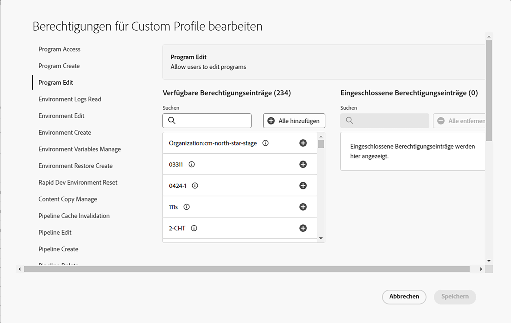

# Benutzerdefinierte Berechtigungen {#custom-permissions}

Erfahren Sie, wie Sie mit benutzerdefinierten Berechtigungen benutzerdefinierte Berechtigungsprofile mit konfigurierbaren Berechtigungen erstellen können, um den Zugriff auf Programme, Pipelines und Umgebungen für Cloud Manager-Benutzende zu beschränken.

## Einführung {#introduction}

Cloud Manager bietet eine Reihe vordefinierter Rollen, die den Zugriff auf verschiedene Cloud Manager-Funktionen steuern:

* Geschäftsinhaber
* Programm-Manager
* Bereitstellungs-Manager
* Entwicklerin oder Entwickler

Mit benutzerdefinierten Berechtigungen können Benutzende neue benutzerdefinierte Berechtigungsprofile mit konfigurierbaren Berechtigungen erstellen, um den Zugriff auf Programme, Pipelines und Umgebungen für Benutzerinnen und Benutzer von Cloud Manager zu beschränken.

>[!TIP]
>
>Weitere Informationen zu vordefinierten Rollen finden Sie unter [AEM as a Cloud Service – Team- und Produktprofile](/help/onboarding/aem-cs-team-product-profiles.md).

## Verwenden benutzerdefinierter Berechtigungen {#using}

Um eigene, benutzerdefinierte Berechtigungen zu erstellen und zu verwenden, sind drei Schritte erforderlich:

1. [Erstellen Sie ein Produktprofil](#create).
1. [Weisen Sie dem Produktprofil benutzerdefinierte Berechtigungen zu](#assign-permissions).
1. [Weisen Sie dem Produktprofil Benutzende zu](#assign-users).

In diesem Abschnitt werden diese Schritte beschrieben. Möglicherweise helfen Ihnen die Informationen in den Abschnitten [Begriffe](#terms) und [Konfigurierbare Berechtigungen](#configurable-permissions) bei der Erstellung Ihrer eigenen benutzerdefinierten Berechtigungen.

>[!NOTE]
>
>Sie müssen über Produktadministratorrechte in der Admin Console verfügen, damit Adobe Experience Manager as a Cloud Service Profile erstellen und Berechtigungen für Cloud Manager verwalten kann.

### Erstellen eines neuen Produktprofils {#create}

Erstellen Sie zunächst ein Produktprofil, dem Sie benutzerdefinierte Berechtigungen zuweisen können.

1. Melden Sie sich bei Cloud Manager unter [my.cloudmanager.adobe.com](https://my.cloudmanager.adobe.com/) an.

1. Wählen Sie auf der Landingpage von Cloud Manager die Schaltfläche **Zugriff verwalten** aus.

1. Sie werden zur Registerkarte **Produkte** der Admin Console geleitet, auf der Sie Benutzende und Berechtigungen für Cloud Manager verwalten können. Wählen Sie in der Admin Console die Schaltfläche **Neues Profil** aus.

1. Geben Sie die allgemeinen Details zum Profil an.

   * **Name des Produktprofils** – Ein aussagekräftiger Name des Profils
   * **Anzeigename**: Ein abgekürzter Name, der auf der Benutzeroberfläche angezeigt wird (optional)
   * **Beschreibung**: Eine informative Beschreibung des Profils, das seinen Zweck erklärt (optional)
   * **Benutzer per E-Mail benachrichtigen**: Wenn diese Option aktiviert ist, werden Benutzende per E-Mail benachrichtigt, wenn sie zu diesem Profil hinzugefügt oder daraus entfernt werden.

1. Wählen Sie **Speichern** aus, wenn Sie fertig sind.

Das neue Produktprofil wird gespeichert und ist in der Liste der Produktprofile in der Admin Console sichtbar.

### Zuweisen benutzerdefinierter Berechtigungen zum Profil {#assign-permissions}

Nachdem Sie ein neues Produktprofil erstellt haben, können Sie ihm benutzerdefinierte Berechtigungen zuweisen.

1. Wählen Sie in der Admin Console den Namen des [neuen Produktprofils aus, das Sie erstellt haben](#create).

1. Öffnen Sie in dem Fenster, das daraufhin erscheint, die Registerkarte **Berechtigungen**, um eine Liste bearbeitbarer Berechtigungen anzuzeigen.

   

1. Wählen Sie den Link **Bearbeiten** einer Berechtigung aus, damit Sie sie bearbeiten können.

1. Das Fenster **Berechtigung bearbeiten** wird geöffnet.
   * Die Berechtigung, die Sie im vorherigen Schritt ausgewählt haben, ist in der linken Spalte ausgewählt.
   * Die für die Zuweisung der Berechtigung verfügbaren Berechtigungselemente befinden sich in der mittleren Spalte **Verfügbare Berechtigungselemente**.
   * Die zugewiesenen Berechtigungselemente befinden sich in der rechten Spalte mit der Bezeichnung **Eingeschlossene Berechtigungselemente**.

   

1. Wählen Sie das Pluszeichen (`+`) neben dem Berechtigungselement, um dieses zur Spalte **Eingeschlossene Berechtigungselemente** hinzuzufügen.

   * Wählen Sie das Symbol `i` neben einem Berechtigungselement aus, wenn Sie mehr darüber erfahren möchten.

1. Wählen Sie die Schaltfläche **Alle hinzufügen** oben in der Spalte **Verfügbare Berechtigungen** aus, damit Sie alle Berechtigungen hinzufügen können.

1. Wählen Sie **Speichern** aus, wenn Sie die Berechtigungselemente für Ihr neues Produktprofil definiert haben.

Ihr neues Produktprofil wird jetzt mit den benutzerdefinierten Berechtigungen gespeichert.

### Zuweisen von Benutzenden zu den benutzerdefinierten Berechtigungen {#assign-users}

Sie können dem neuen Produktprofil, das Sie mit benutzerdefinierten Berechtigungen erstellt haben, jetzt Benutzende zuweisen.

1. Wählen Sie in der Admin Console den Namen des [neuen Produktprofils aus, dem benutzerdefinierte Berechtigungen zugewiesen wurden](#assign-permissions).

1. Öffnen Sie in dem Fenster, das daraufhin erscheint, die Registerkarte **Benutzer**.

1. Wählen Sie die Schaltfläche **Benutzer hinzufügen** aus und weisen Sie Ihrem neuen Produktprofil Benutzende mit benutzerdefinierten Berechtigungen zu.

Weitere Informationen zum Arbeiten mit der Admin Console finden Sie im Abschnitt **Hinzufügen von Benutzenden und Benutzergruppen zu einem Produktprofil** des Dokuments [Verwalten von Produktprofilen für Unternehmensbenutzende](https://helpx.adobe.com/de/enterprise/using/manage-product-profiles.html).

## Konfigurierbare Berechtigungen {#configurable-permissions}

Zum Erstellen benutzerdefinierter Profile stehen folgende Berechtigungen zur Verfügung.

| Berechtigung | Beschreibung |
|---|---|
| Programm erstellen | Benutzenden das Erstellen eines Programms erlauben |
| Programmzugriff | Benutzenden den Zugriff auf Programme gewähren |
| Programmbearbeitung | Benutzenden erlauben, Programme zu bearbeiten |
| Umgebung erstellen | Benutzenden erlauben, eine Umgebung zu erstellen |
| Umgebung bearbeiten | Benutzenden erlauben, Umgebungen zu aktualisieren und zu bearbeiten |
| Umgebungsprotokolle lesen | Benutzenden das Lesen von Umgebungsprotokollen erlauben |
| Umgebungsvariablen verwalten | Benutzenden das Erstellen/Bearbeiten/Löschen von Umgebungskonfigurationen zu erlauben |
| Umgebungswiederherstellung erstellen | Benutzenden erlauben, eine Umgebungswiederherstellung zu erstellen |
| Schnelles Zurücksetzen der Entwicklungsumgebung | Benutzenden das schnelle Zurücksetzen der Entwicklungsumgebung erlauben |
| Inhaltskopie verwalten | Benutzenden erlauben, Vorgänge zum Kopieren von Inhalten zu verwalten |
| Pipeline erstellen | Benutzenden erlauben, Pipelines zu erstellen |
| Pipeline löschen | Benutzenden erlauben, Pipelines zu löschen |
| Pipeline-Bearbeitung | Benutzenden erlauben, Pipelines zu bearbeiten |
| Genehmigung/Ablehnung von Produktionsbereitstellungen | Benutzenden erlauben, einen Produktionsbereitstellungsschritt zu genehmigen oder abzulehnen |
| Pipeline-Ausführungen abbrechen | Benutzenden erlauben, Pipeline-Ausführungen abzubrechen |
| Pipeline-Ausführungen starten | Benutzenden erlauben, eine neue Pipeline-Ausführung zu starten |
| Wichtige Metrikfehler überschreiben/ablehnen | Benutzenden erlauben, wichtige Metrikfehler zu überschreiben/abzulehnen |
| Produktionsbereitstellungs-Zeitplan | Benutzenden erlauben, einen Produktionsbereitstellungsschritt zu planen |
| Zugriff auf Repository-Informationen | Benutzenden erlauben, auf Repository-Informationen zuzugreifen und ein Passwort für den Zugriff zu erstellen |
| Repository erstellen | Benutzenden erlauben, Git-Repositorys zu erstellen |
| Repository löschen | Benutzenden erlauben, Git-Repositorys zu löschen |
| Repository bearbeiten | Benutzenden erlauben, Git-Repositorys zu bearbeiten |
| Repository-Code-Generierung | Benutzenden erlauben, Projekte aus einem Archetyp zu generieren |
| Domain-Namen verwalten | Benutzenden das Erstellen/Bearbeiten/Löschen von Domain-Namen erlauben |
| IP-Zulassungslisten verwalten | Benutzenden das Erstellen/Bearbeiten/Löschen von IP-Zulassungslisten und Bindungen an IP-Zulassungslisten erlauben |
| Netzwerkinfrastruktur verwalten | Benutzenden das Erstellen/Bearbeiten/Löschen der Netzwerkinfrastruktur erlauben |
| SSL-Zertifikat verwalten | Benutzenden das Erstellen/Bearbeiten/Löschen eines SSL-Zertifikats erlauben |
| Benutzende von New Relic-Unterkonten verwalten | Benutzenden das Lesen/Bearbeiten von Benutzenden von New Relic-Unterkonten erlauben |

### Berechtigungen auf Unternehmensebene {#organization-level}

Berechtigungen auf Unternehmensebene beziehen sich auf Berechtigungen, die immer für alle Programme in einem Unternehmen gewährt werden.

Folgende Berechtigungen sind Berechtigungen auf Unternehmensebene:

* **Programm erstellen** – Mit dieser Berechtigung können Benutzende ein Programm im Unternehmen erstellen.
* **Zugriff auf Repository-Informationen** – Mit dieser Berechtigung auf Mandanten-/Unternehmensebene können Benutzende Benutzernamen, Passwort und Repository-URL generieren, um auf das Kundenprojekt zuzugreifen und zu diesem beizutragen.
   * Benutzername und Passwort für den Repository-Zugriff sind für alle Repositorys des Unternehmens gleich, die Repository-URL ist jedoch für jedes Programm eindeutig.
   * Weitere Informationen finden Sie unter [Zugreifen auf Repositorys](/help/implementing/cloud-manager/managing-code/accessing-repos.md).

## Begriffe {#terms}

Folgende Begriffe werden beim Erstellen und Verwalten benutzerdefinierter Berechtigungen und vordefinierter Rollen verwendet.

| Begriff | Beschreibung |
|---|---|
| Vordefinierte Berechtigungen | Vordefinierte Rollen wie **Geschäftsinhaber** und **Bereitstellungs-Manager**, um verschiedene Funktionen von Cloud Manager zu steuern. Weitere Informationen zu vordefinierten Rollen finden Sie unter [AEM as a Cloud Service – Team- und Produktprofile](/help/onboarding/aem-cs-team-product-profiles.md). |
| Benutzerdefinierte Berechtigungen | Mit Cloud Manager-Funktionen können Benutzende Berechtigungsprofile erstellen, um Rollen zur Verwaltung unterstützter Cloud Manager-Funktionen zu definieren |
| Produktprofil | Wird in der Admin Console zur Verwaltung konfigurierbarer Berechtigungen erstellt, die für Benutzende gelten, die Teil des Berechtigungsprofils sind |
| Konfigurierbare Berechtigung | Cloud Manager-Berechtigungen, die im Berechtigungsprofil konfiguriert werden können |
| Berechtigungselement | Eine Programm-, Umgebungs- oder Pipeline-Ressource, auf die eine Berechtigung angewendet werden kann |

Berechtigungselemente beziehen sich auf den Anwendungsumfang der Berechtigung. In der Regel handelt es sich um Folgendes.

| Berechtigungselementtyp | Beispiel | Beschreibung |
|---|---|---|
| Unternehmen | Unternehmen:FirmaA | Alle anwendbaren Ressourcen eines Unternehmens. Eine Ressource kann ein Programm, eine Umgebung oder eine Pipeline sein. Wenn Benutzende ein Unternehmen für eine Berechtigung hinzufügen, erhalten auch alle neuen Ressourcen in diesem Unternehmen diese Berechtigung. |
| Programm | Programm A | Alle anwendbaren Ressourcen eines Programms |
| Umgebung | Programm A : Umgebung | Anwendbar für eine bestimmte Umgebung |
| Pipeline | Programm A : Pipeline | Anwendbar für eine bestimmte Pipeline |

## Einschränkungen {#limitations}

Beachten Sie bei der Verwendung benutzerdefinierter Berechtigungen die folgenden Einschränkungen.

* Benutzerdefinierte Berechtigungsprofile führen beim Konfigurieren von Berechtigungen auch AMS-Programme, -Umgebungen und -Pipelines auf.
* Es kann bis zu zwei Minuten dauern, bis in der Admin Console für die Berechtigungskonfiguration Ressourcen wie Programm, Umgebung und Pipeline angezeigt werden, die in Cloud Manager erstellt wurden.
* In seltenen Fällen, in denen der benutzerdefinierte Berechtigungsdienst nicht reagiert, sind vordefinierte Profile weiterhin verfügbar und Benutzende in vordefinierten Profilen haben weiterhin darauf Zugriff.

## Häufig gestellte Fragen {#faq}

### Welche Berechtigungsprofile sind vordefinierte Berechtigungsprofile?

* Geschäftsinhaber
* Programm-Manager
* Bereitstellungs-Manager
* Entwicklerin oder Entwickler

Weitere Informationen zu vordefinierten Rollen finden Sie unter [AEM as a Cloud Service – Team- und Produktprofile](/help/onboarding/aem-cs-team-product-profiles.md).

### Was passiert mit vordefinierten Berechtigungsprofilen bei der Einführung in benutzerdefinierte Profile?

Die standardmäßigen Produktprofile und Cloud Manager-Rollen funktionieren weiterhin wie zuvor.

### Kann ich vordefinierte Berechtigungsprofile bearbeiten?

Nein, Standardprofile können nicht bearbeitet werden. Sie können keine Berechtigungen zum standardmäßigen Berechtigungsprofil hinzufügen oder welche daraus entfernen. Sie können nur Benutzende zu vordefinierten Profilen hinzufügen oder daraus entfernen.

### Sollte ich vordefinierte Berechtigungsprofile löschen, wenn benutzerdefinierte Profile verfügbar sind?

Löschen Sie keine vordefinierten Berechtigungsprofile aus der Admin Console.

### Kann ich Benutzende zu mehreren Berechtigungsprofilen hinzufügen?

Ja, eine Person kann Teil mehrerer Profile sein, einschließlich vordefinierter und benutzerdefinierter Berechtigungsprofile. Wenn eine Person mehreren Profilen zugewiesen wird, stehen ihr die kombinierten Berechtigungen aus allen zugewiesenen Berechtigungsprofilen zur Verfügung.

### Was passiert, wenn eine Person berechtigt ist, eine Umgebung/Pipeline zu bearbeiten, aber keinen Zugriff auf ein Programm hat, das die Umgebung/Pipeline enthält?

In diesem Fall kann die Person nicht auf die Umgebung oder Pipeline zugreifen, wenn sie nicht über die Berechtigungen für den **Programmzugriff** auf die Umgebung oder Pipeline verfügt.
