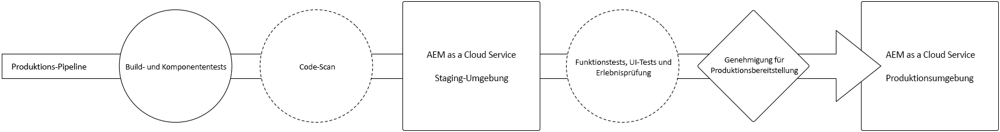
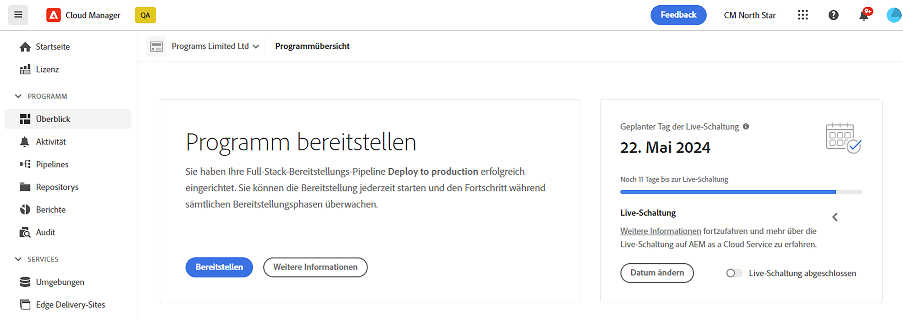
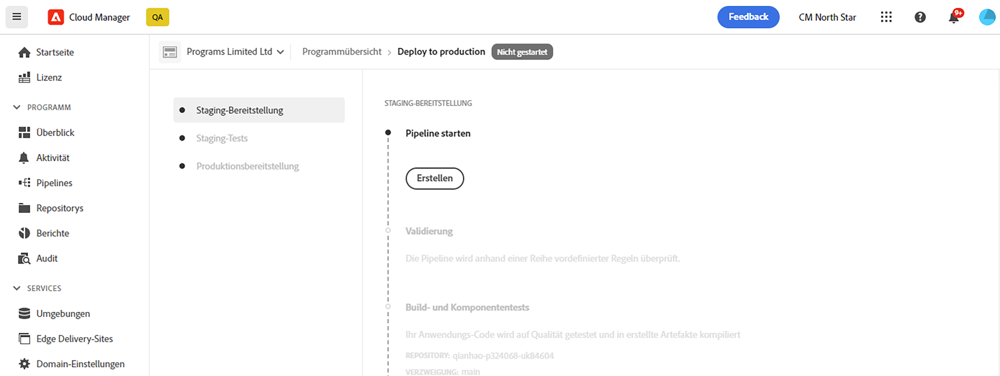
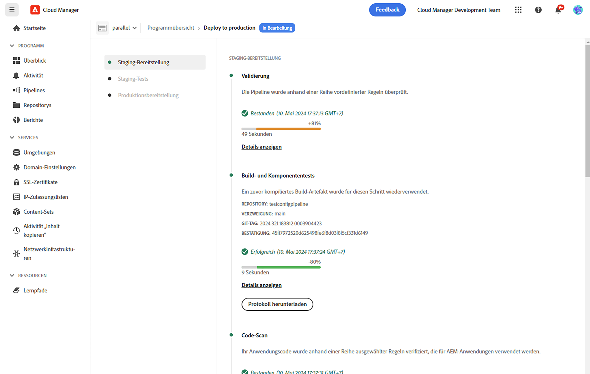
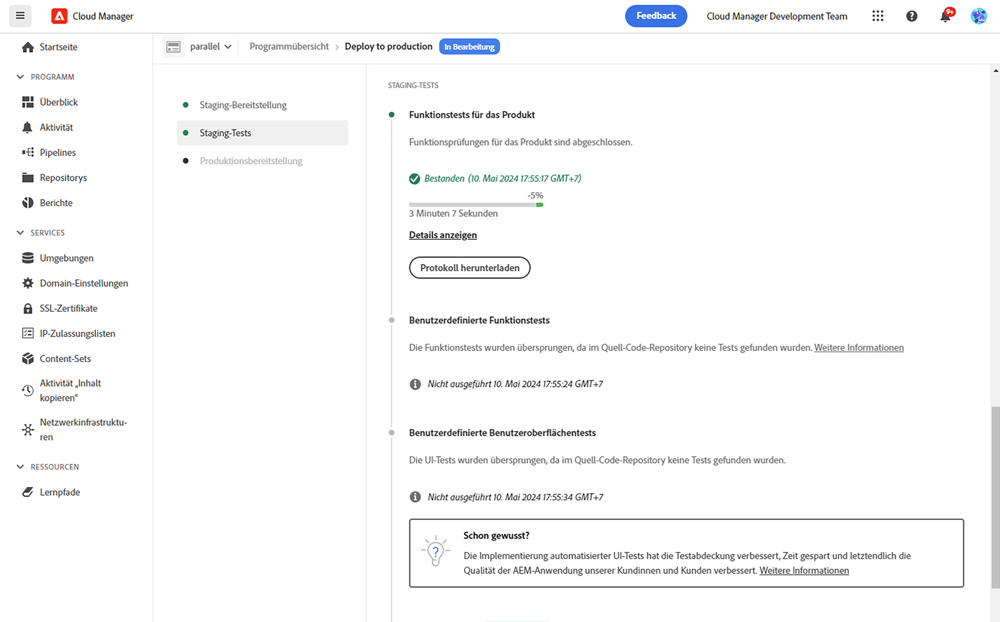
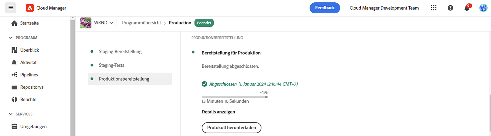

# Bereitstellen Ihres Codes {#deploy-your-code}

Erfahren Sie, wie Sie Ihren Code mithilfe von Cloud Manager-Pipelines in AEM as a Cloud Service für die Produktion bereitstellen.



Die nahtlose Bereitstellung von Code zum Staging und dann bis zur Produktion erfolgt über eine Produktions-Pipeline. Die Ausführung der Produktions-Pipeline ist in die beiden folgenden logischen Phasen unterteilt:

1. **Bereitstellung in der Staging-Umgebung**: Der Code wird erstellt und in der Staging-Umgebung für automatisierte Funktionstests, Benutzeroberflächentests, Erlebnis-Audits und Benutzerakzeptanztests (User Acceptance Testing, UAT) bereitgestellt.
1. **Bereitstellung in der Produktionsumgebung**: Sobald der Build im Staging überprüft und für die Produktion freigegeben ist, wird das gleiche Build-Artefakt in der Produktionsumgebung bereitgestellt.

_Nur der Pipeline-Typ „Full Stack code“ unterstützt das Scannen von Code, Funktionstests, Benutzeroberflächentests und Erlebnis-Audits._

## Bereitstellungsprozess {#deployment-process}

Alle Cloud-Dienste werden in einem fortlaufenden Prozess bereitgestellt, um zu gewährleisten, dass keine Ausfallzeiten entstehen. Weitere Informationen finden Sie unter [Funktionsweise von rollierenden Bereitstellungen](/help/implementing/deploying/overview.md#how-rolling-deployments-work).

>[!NOTE]
>
>Der Dispatcher-Cache wird bei jeder Bereitstellung gelöscht. Er wird anschließend „vorgewärmt“, damit die neuen Veröffentlichungsknoten Traffic akzeptieren.

## Bereitstellen Ihres Codes mit Cloud Manager in AEM as a Cloud Service {#deploying-code-with-cloud-manager}

Sobald Sie [Ihre Produktions-Pipeline einschließlich Repository, Umgebung und Testumgebung konfiguriert](/help/implementing/cloud-manager/configuring-pipelines/configuring-production-pipelines.md) haben, können Sie Ihren Code bereitstellen.

1. Melden Sie sich unter [my.cloudmanager.adobe.com](https://my.cloudmanager.adobe.com/) bei Cloud Manager an und wählen Sie die entsprechende Organisation aus.

1. Klicken Sie in der Konsole **[Meine Programme](/help/implementing/cloud-manager/navigation.md#my-programs)** auf das Programm, für das Code bereitgestellt werden soll.

1. Klicken Sie auf der Seite **Übersicht** im Bereich „Aktionsaufrufe“ auf **Bereitstellen**.

   

1. Klicken Sie auf der Seite **Bereitstellung für Produktion** auf **Build**.

   

Der Build-Prozess stellt Ihren Code in diesen drei aufeinanderfolgenden Phasen bereit:

1. [Phase der Staging-Bereitstellung](#stage-deployment)
1. [Phase der Staging-Tests](#stage-testing)
1. [Phase der Produktionsbereitstellung](#production-deployment)

>[!TIP]
>
>Sie können die Schritte verschiedener Bereitstellungsprozesse überprüfen, indem Sie die Protokolle lesen oder die Ergebnisse anhand der Testkriterien durchgehen.

### Phase der Staging-Bereitstellung {#stage-deployment}

Die **Staging-Bereitstellung** umfasst folgende Schritte:

| Schritt zur Staging-Bereitstellung | Beschreibung |
| --- | --- |
| Validierung | Dieser Schritt stellt sicher, dass die Pipeline für die Verwendung der derzeit verfügbaren Ressourcen konfiguriert ist. Beispielsweise wird getestet, ob die konfigurierte Verzweigung vorhanden ist und ob die Umgebungen verfügbar sind. |
| Build- und Unit-Tests | Dieser Schritt führt einen containerisierten Build-Prozess aus.<br>Weitere Informationen zur Build-Umgebung finden Sie unter [Build-Umgebung](/help/implementing/cloud-manager/getting-access-to-aem-in-cloud/build-environment-details.md). |
| Scannen von Code | Dieser Schritt bewertet die Qualität Ihres Anwendungs-Codes.<br>Weitere Informationen zum Testprozess finden Sie unter [Testen der Code-Qualität](/help/implementing/cloud-manager/code-quality-testing.md). |
| Build-Images | Dieser Prozess konvertiert Inhalte und Dispatcher-Pakete aus dem Build-Schritt in Docker-Images. Dabei werden zudem Kubernetes-Konfigurationen auf Basis dieser Pakete generiert. |
| Bereitstellung für Staging | Das Image wird in der Staging-Umgebung bereitgestellt, um die [Staging-Testphase](#stage-testing) vorzubereiten. |



### Phase der Staging-Tests {#stage-testing}

Die **Staging-Testphase** umfasst die folgenden Schritte:

| Schritt zu Staging-Tests | Beschreibung |
| --- | --- |
| Funktionstests für das Produkt | Die Cloud Manager-Pipeline führt Tests für die Staging-Umgebung aus.<br>Siehe auch [Produktfunktionstests](/help/implementing/cloud-manager/functional-testing.md#product-functional-testing). |
| Benutzerdefinierte Funktionstests | Dieser Schritt in der Pipeline wird immer ausgeführt und kann nicht übersprungen werden. Wenn der Build keine Test-JAR erzeugt, wird der Test automatisch bestanden.<br>Siehe auch [Benutzerdefinierte Funktionstests](/help/implementing/cloud-manager/functional-testing.md#custom-functional-testing). |
| Benutzerdefinierte Benutzeroberflächentests | Eine optionale Funktion, mit der für benutzerdefinierte Anwendungen erstellte Benutzeroberflächentests automatisch ausgeführt werden.<br>Benutzeroberflächentests sind Selenium-basiert und in einem Docker-Image verpackt, um Flexibilität in Bezug auf Sprachen und Frameworks zu ermöglichen. Mit diesem Ansatz können Sie Java und Maven, Node und WebDriver.io oder ein beliebiges Selenium-basiertes Framework bzw. eine beliebige Selenium-Technologie verwenden.<br>Siehe auch [Benutzerdefinierte Benutzeroberflächentests](/help/implementing/cloud-manager/functional-testing.md#custom-ui-testing). |
| Erlebnis-Audit | Dieser Schritt in der Pipeline wird immer ausgeführt und kann nicht übersprungen werden. Bei Ausführung einer Produktions-Pipeline wird nach benutzerdefinierten Funktionstests, die die Prüfungen ausführen, ein Erlebnis-Audit-Schritt eingefügt.<ul><li>Die konfigurierten Seiten werden an den Service übermittelt und ausgewertet.</li><li>Die Ergebnisse sind informativer Natur und zeigen die Bewertungen sowie die Änderung zwischen den aktuellen und vorherigen Bewertungen.</li><li>Diese Erkenntnis ist wertvoll, um festzustellen, ob es eine Regression gibt, die mit der aktuellen Bereitstellung eingeführt wird.</li></ul>Siehe [Grundlegendes zu Erlebnis-Audit-Ergebnissen](/help/implementing/cloud-manager/experience-audit-dashboard.md).</li></ul> |



### Phase der Produktionsbereitstellung {#production-deployment}

Der Prozess für die Bereitstellung in Produktionstopologien unterscheidet sich geringfügig, um die Auswirkungen auf die Besuchenden einer AEM-Site zu minimieren.

Produktionsbereitstellungen nutzen im Allgemeinen die oben beschriebenen Schritte, aber auf rollierende Weise. Dazu gehören die folgenden Schritte:

1. AEM-Pakete werden für Author bereitgestellt
1. `dispatcher1` wird aus dem Lastenausgleich gelöst.
1. AEM-Pakete werden in `publish1` und das Dispatcher-Paket in `dispatcher1` bereitgestellt und der Dispatcher-Cache geleert.
1. `dispatcher1` wird in den Lastenausgleich zurückgesetzt.
1. Sobald `dispatcher1` wieder aktiv ist, wird `dispatcher2` aus dem Lastenausgleich entfernt.
1. AEM-Pakete werden in `publish2` und das Dispatcher-Paket in `dispatcher2` bereitgestellt und der Dispatcher-Cache geleert.
1. `dispatcher2` wird in den Lastenausgleich zurückgesetzt.

Dieser Vorgang wird fortgesetzt, bis die Bereitstellung alle Publisher und Dispatcher in der Topologie erreicht hat.



## Zeitüberschreitungen während einer Bereitstellung {#timeouts}

Bei folgenden Schritten kommt es zu einer Zeitüberschreitung, wenn sie während einer Bereitstellung zu lange auf Benutzer-Feedback warten:

| Schritt | Zeitüberschreitung |
|--- |--- |
| Testen der Code-Qualität | 14 Tage |
| Sicherheitstests | 14 Tage |
| Leistungstests | 14 Tage |
| Genehmigungsantrag | 14 Tage |
| Planen der Bereitstellung für die Produktion | 14 Tage |
| CSE-Unterstützung | 14 Tage |

## Erneutes Ausführen einer Produktionsbereitstellung {#reexecute-deployment}

In seltenen Fällen kann es vorkommen, dass Schritte der Produktionsbereitstellung aus vorübergehenden Gründen fehlschlagen. In solchen Fällen wird die erneute Ausführung des Schritts der Produktionsbereitstellung unterstützt, solange der Schritt der Produktionsbereitstellung abgeschlossen ist, unabhängig von der Art des Abschlusses (wie zum Beispiel abgebrochen oder fehlgeschlagen). Bei der erneuten Ausführung wird eine neue Ausführung mit derselben Pipeline erstellt, die aus den folgenden drei Schritten besteht:

1. **Validierung**: Dieser Schritt führt dieselbe Validierung wie bei einer normalen Pipeline-Ausführung durch.
1. **Build**: Im Rahmen einer erneuten Ausführung kopiert der Build-Schritt Artefakte und führt keinen wirklich neuen Build-Prozess aus.
1. **Produktionsbereitstellung**: Dieser Schritt verwendet dieselbe Konfiguration und dieselben Optionen wie der Schritt der Produktionsbereitstellung bei einer normalen Pipeline-Ausführung.

In solchen Fällen, in denen eine erneute Ausführung möglich ist, bietet die Statusseite der Produktions-Pipeline neben der üblichen Option **Build-Protokoll herunterladen** auch die Option **Erneut ausführen**.


>[!NOTE]
>
>Bei einer erneuten Ausführung wird der Build-Schritt in der Benutzeroberfläche mit dem Hinweis versehen, dass er Artefakte kopiert und nicht neu erstellt.

### Einschränkungen {#limitations}

* Das erneute Ausführen des Produktionsbereitstellungsschritts ist nur für die letzte Ausführung verfügbar.
* Eine erneute Ausführung ist für Push-Update-Ausführungen nicht verfügbar. Wenn die letzte Ausführung eine Push-Update-Ausführung war, ist eine erneute Ausführung nicht möglich.
* Wenn die letzte Ausführung vor dem Produktionsbereitstellungsschritt fehlschlug, ist eine erneute Ausführung nicht möglich.

### Erneutes Ausführen der API {#reexecute-API}

Zusätzlich zur Verfügbarkeit in der Benutzeroberfläche können Sie [die Cloud Manager-API](https://developer.adobe.com/experience-cloud/cloud-manager/reference/api/#tag/Pipeline-Execution) verwenden, um erneute Ausführungen auszulösen und Ausführungen zu identifizieren, die als erneute Ausführungen ausgelöst wurden.

#### Auslösen einer erneuten Ausführung {#reexecute-deployment-api}

Um eine erneute Ausführung auszulösen, muss eine PUT-Anfrage an den HAL-Link `https://ns.adobe.com/adobecloud/rel/pipeline/reExecute` im Status des Produktionsbereitstellungsschritts erfolgen.

* Wenn diese Verknüpfung vorhanden ist, kann die Ausführung von diesem Schritt aus neu gestartet werden.
* Wenn dies nicht der Fall ist, kann die Ausführung von diesem Schritt an nicht erneut gestartet werden.

Diese Verknüpfung ist immer nur für den Schritt der Produktionsbereitstellung verfügbar.

```JavaScript
 {
  "_links": {
    "https://ns.adobe.com/adobecloud/rel/pipeline/logs": {
      "href": "/api/program/4/pipeline/1/execution/953671/phase/1575676/step/2983530/logs",
      "templated": false
    },
    "https://ns.adobe.com/adobecloud/rel/pipeline/reExecute": {
      "href": "/api/program/4/pipeline/1/execution?stepId=2983530",
      "templated": false
    },
    "https://ns.adobe.com/adobecloud/rel/pipeline/metrics": {
      "href": "/api/program/4/pipeline/1/execution/953671/phase/1575676/step/2983530/metrics",
      "templated": false
    },
    "self": {
      "href": "/api/program/4/pipeline/1/execution/953671/phase/1575676/step/2983530",
      "templated": false
    }
  },
  "id": "6187842",
  "stepId": "2983530",
  "phaseId": "1575676",
  "action": "deploy",
  "environment": "weretail-global-b75-prod",
  "environmentType": "prod",
  "environmentId": "59254",
  "startedAt": "2022-01-20T14:47:41.247+0000",
  "finishedAt": "2022-01-20T15:06:19.885+0000",
  "updatedAt": "2022-01-20T15:06:20.803+0000",
  "details": {
  },
  "status": "FINISHED"
```

Die Syntax des href-Werts des HAL-Links ist nur ein Beispiel. Der tatsächliche Wert sollte immer aus dem HAL-Link gelesen und nicht generiert werden.

Das Senden einer PUT-Anfrage an diesen Endpunkt führt zu einer 201-Antwort bei Erfolg, wobei der Antworttext die Darstellung der neuen Ausführung ist. Dieser Workflow ähnelt dem Starten einer regulären Ausführung über die API.

#### Identifizieren einer Ausführung mit erneuter Ausführung {#identify-reexecution}

Das System identifiziert erneut ausgeführte Ausführungen, indem das Feld `trigger` auf den Wert `RE_EXECUTE` gesetzt wird.
