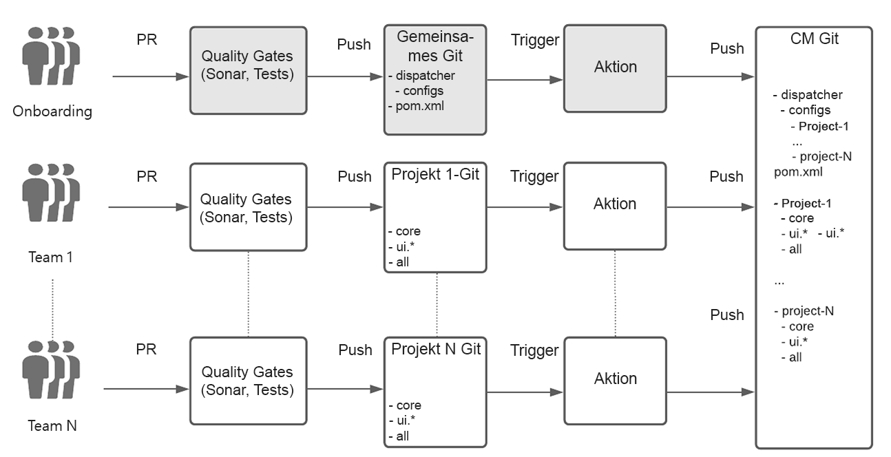
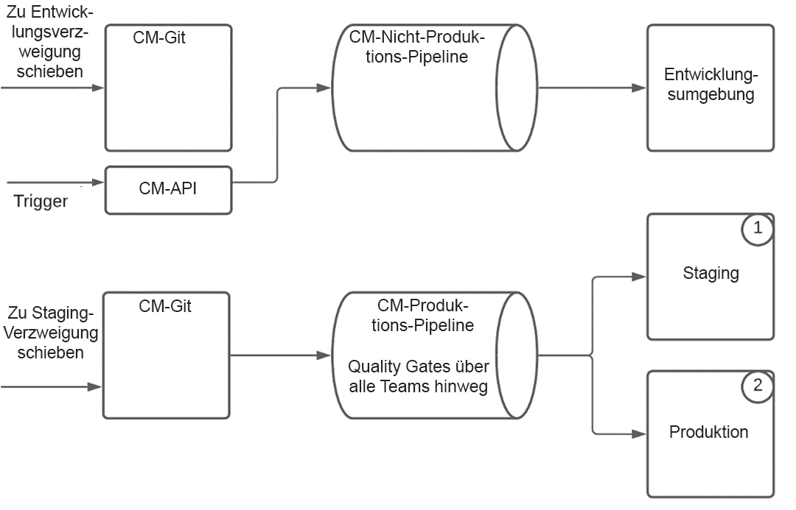
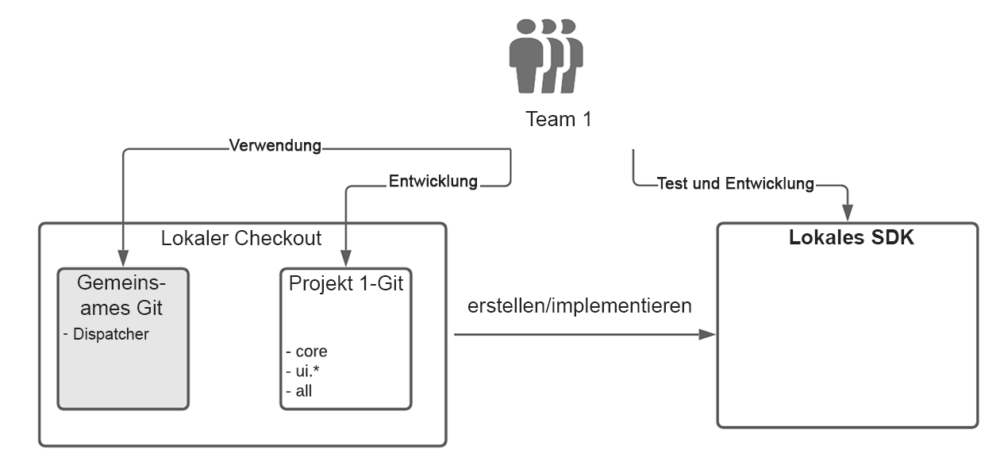

# Einrichten der Enterprise-Team-Entwicklung für AEM als Cloud Service {#enterprise-setup}

## Einführung {#introduction}

AEM als Cloud Service ist ein Cloud-natives Angebot, das AEM as a Service bereitstellt und über 10 Jahre Unternehmenssoftware für Unternehmensteams mit spezifischen Anforderungen bereitstellt. Es erfasst AEM in die native Cloud-Welt, wobei neue Werte wie immer aktiviert, immer aktuell, immer sicher und immer skaliert sind. Es behält jedoch den wichtigsten Wertversprechen bei, der AEM unseren Kunden als anpassbare Plattform bietet und es Teams von Unternehmensklassen ermöglicht, sich in ihre Entwicklungs- und Bereitstellungsverfahren zu integrieren.

Um unsere Kunden mit Enterprise-Entwicklungs-Setups zu unterstützen, integriert AEM as a Cloud Service vollständig in Cloud Manager und seine speziell entwickelten CI/CD-Pipelines, die mit Best Practices und Erfahrungen aus mehrjähriger Erfahrung mit unternehmensweiter Entwicklung und Bereitstellung ausgestattet sind. Dies gewährleistet gründliche Tests und höchste Codequalität, um außergewöhnliche Erlebnisse zu erzielen.

## Unterstützung von Cloud Manager bei der Einrichtung der Enterprise-Team-Entwicklung {#cloud-manager}

Um das schnelle Onboarding für Kunden sicherzustellen, bietet Cloud Manager alles, was für die ersten Schritte mit der Entwicklung von Erlebnissen erforderlich ist, einschließlich eines Git-Repositorys zum Speichern von Anpassungen, die dann von Cloud Manager erstellt, überprüft und bereitgestellt werden.
Mithilfe von Cloud Manager können Entwicklungsteams häufig darauf hinarbeiten, Änderungen zu übernehmen, ohne von Adobe-Mitarbeitern abhängig zu sein.

In Cloud Manager sind drei Umgebungstypen verfügbar:

* Entwicklung
* Staging
* Produktion

Code kann in Entwicklungsumgebungen mithilfe einer Nicht-Produktions-Pipeline bereitgestellt werden. Bei Staging- und Produktionsumgebungen, die immer zusammenpassen und so eine Validierung vor der Produktionsbereitstellung als Best Practice sicherstellen, verwendet eine Produktions-Pipeline Quality Gates, um den Anwendungscode und die Konfigurationsänderungen zu validieren.

Die Produktions-Pipeline stellt den Code und die Konfiguration zuerst in der Staging-Umgebung bereit, testet die Anwendung und stellt schließlich für die Produktion bereit.
Ein Cloud Service-SDK, das immer mit den neuesten Cloud Service-Verbesserungen aktualisiert wird, ermöglicht die lokale Entwicklung, die direkt die lokale Hardware des Entwicklers verwendet. Dies ermöglicht eine schnelle Entwicklung mit sehr niedrigen Bearbeitungszeiten. So können Entwickler in ihrer vertrauten lokalen Umgebung bleiben und aus einer Vielzahl von Entwicklungstools wählen und in Entwicklungsumgebungen oder Produktionsumgebungen pushen, wenn sie es für richtig halten.

Cloud Manager unterstützt flexible Multi-Team-Setups, die an die Anforderungen eines Unternehmens angepasst werden können. Dies gilt sowohl für Cloud Service als auch für AMS. Um stabile Bereitstellungen mit mehreren Teams sicherzustellen und zu vermeiden, dass sich ein Team auf die Produktion aller Teams auswirkt, wird die Cloud Manager-Pipeline immer von allen Teams validiert und getestet.

## Real World Beispiel {#real-world-example}

Jedes Unternehmen hat unterschiedliche Anforderungen, einschließlich verschiedener Teams, Prozesse und Entwicklungs-Workflows. Die unten beschriebene Einrichtung wird von Adobe für verschiedene Projekte verwendet, die Erlebnisse zusätzlich zu AEM als Cloud Service bereitstellen.

Die Adobe Creative Cloud-Anwendungen wie Adobe Photoshop oder Adobe Illustrator enthalten beispielsweise Inhaltsressourcen wie Tutorials, Beispiele und Handbücher, die Endbenutzern zur Verfügung stehen. Dieser Inhalt wird von den Clientanwendungen unter Verwendung von AEM als Cloud Service auf *Headless*-Weise genutzt, indem API-Aufrufe an die AEM Cloud-Veröffentlichungsstufe gesendet werden, um den strukturierten Inhalt als JSON-Streams abzurufen, und indem das [Content Delivery Network (CDN) in AEM als Cloud Service](https://experienceleague.adobe.com/docs/experience-manager-cloud-service/implementing/content-delivery/cdn.html?lang=de#content-delivery) genutzt wird, um strukturierte und unstrukturierte Inhalte mit optimaler Leistung bereitzustellen.

Die an diesem Projekt beteiligten Teams folgen dem nachfolgend beschriebenen Prozess.

>[!NOTE]
>Weitere Informationen zum Einrichten finden Sie unter [Arbeiten mit mehreren Quell-Git-Repositorys](https://experienceleague.adobe.com/docs/experience-manager-cloud-manager/using/managing-code/working-with-multiple-source-git-repos.html#managing-code) .

Jedes Team verwendet seinen eigenen Entwicklungs-Workflow und verfügt über ein eigenes Git-Repository. Ein zusätzliches freigegebenes Git-Repository wird für das Onboarding von Projekten verwendet. Dieses Git-Repository enthält die Stammstruktur des Git-Repositorys von Cloud Manager, einschließlich der freigegebenen Dispatcher-Konfiguration. Für das Onboarding eines neuen Projekts ist es erforderlich, die Datei des Reaktor Maven-Projekts im Stammverzeichnis des freigegebenen Git-Repositorys aufzulisten. Für die Dispatcher-Konfiguration wird innerhalb des Dispatcher-Projekts eine neue Konfigurationsdatei erstellt. Diese Datei wird dann von der Hauptdispatcher-Konfiguration eingeschlossen. Jedes Team ist für seine eigene Dispatcher-Konfigurationsdatei verantwortlich. Änderungen am freigegebenen Git-Repository sind selten und in der Regel nur erforderlich, wenn ein neues Projekt integriert wird. Die Hauptarbeit wird von jedem Projektteam in seinem eigenen Git-Repository ausgeführt.

Das Git-Repository für jedes Team wurde mithilfe des AEM Maven-Archetyps eingerichtet und befolgt daher die Best Practices zum Einrichten AEM Projekts. Die einzige Ausnahme ist die Verarbeitung der Dispatcher-Konfiguration, die wie oben beschrieben im freigegebenen Git-Repository durchgeführt wird.
Jedes Team verwendet einen vereinfachten Git-Workflow mit zwei + N-Verzweigungen, der dem Git-Flussmodell folgt:

* Eine stabile Versionsverzweigung enthält den Produktionscode

* Ein Entwicklungszweig enthält die neueste Entwicklung

* Für jede Funktion wird eine neue Verzweigung erstellt

Die Entwicklung erfolgt in einer Funktionsverzweigung, wenn die Funktion ausgereift ist und in der Entwicklungsverzweigung zusammengeführt wird. Abgeschlossene und validierte Funktionen werden aus der Entwicklungsverzweigung ausgewählt und in der stabilen Verzweigung zusammengeführt. Alle Änderungen werden über Pull Requests (PR) vorgenommen. Jede PR wird automatisch durch Qualitätstests validiert. Sonar wird zur Qualitätsüberprüfung des Codes verwendet und eine Reihe von Test-Suites wird ausgeführt, um sicherzustellen, dass der neue Code keine Regression einführt.

Die Einrichtung im Git-Repository von Cloud Manager umfasst zwei Verzweigungen:

* Eine *Stable-Release-Verzweigung*, die den Produktionscode aller Teams enthält
* Ein *Entwicklungszweig*, der den Entwicklungscode aller Teams enthält

Jeder Push an das Git-Repository eines Teams in der Entwicklungs- oder der Stable-Verzweigung löst eine [github-Aktion](https://experienceleague.adobe.com/docs/experience-manager-cloud-manager/using/managing-code/working-with-multiple-source-git-repos.html?lang=en#managing-code) aus. Alle Projekte folgen demselben Setup für die Stable-Verzweigung. Ein Push in die stabile Verzweigung eines Projekts wird automatisch in die stabile Verzweigung im Git-Repository von Cloud Manager gepusht. Die Produktions-Pipeline in Cloud Manager ist so konfiguriert, dass sie durch einen Push an die stabile Verzweigung ausgelöst wird. Die Produktions-Pipeline wird daher von jedem Push-Vorgang eines Teams in einen stabilen Zweig ausgeführt und die Produktionsbereitstellung wird aktualisiert, wenn alle Quality Gates (Qualitäts-Gates) erfolgreich sind.

Pushes zum Entwicklungszweig werden anders gehandhabt. Während ein Push an eine Entwicklerverzweigung im Git-Repository eines Teams ebenfalls eine GitHub-Aktion auslöst und der Code automatisch in die Entwicklungsverzweigung im Git-Repository von Cloud Manager gepusht wird, wird die Nicht-Produktions-Pipeline nicht automatisch durch den Code-Push ausgelöst. Sie wird durch einen Aufruf der -API von Cloud Manager ausgelöst.
Das Ausführen der Produktions-Pipeline umfasst das Überprüfen des Codes aller Teams über die bereitgestellten Quality Gates. Sobald der Code für die Staging-Umgebung bereitgestellt wurde, werden die Tests und Prüfungen ausgeführt, um sicherzustellen, dass alles erwartungsgemäß funktioniert. Sobald alle Akzeptanztests abgeschlossen sind, werden die Änderungen ohne Unterbrechung oder Ausfallzeiten in die Produktion eingeführt.
Für die lokale Entwicklung wird das [SDK für AEM as a Cloud Service](https://experienceleague.adobe.com/docs/experience-manager-cloud-service/implementing/developing/aem-as-a-cloud-service-sdk.html?lang=de#developing) verwendet. Das SDK ermöglicht die Einrichtung eines lokalen Autors, einer lokalen Veröffentlichung und eines Dispatchers. Dies ermöglicht die Offline-Entwicklung und die schnelle Abwicklung. Manchmal wird nur der Autor für die Entwicklung verwendet, aber das schnelle Einrichten des Dispatchers und der Veröffentlichung ermöglicht es, alles lokal zu testen, bevor es in das Git-Repository gepusht wird. Mitglieder jedes Teams checken normalerweise den Code aus dem freigegebenen Git für sowie ihren eigenen Projektcode aus. Andere Projekte müssen nicht ausgecheckt werden, da die Projekte unabhängig sind.

Dieses reale Setup kann als Entwurf verwendet und dann an die Bedürfnisse eines Unternehmens angepasst werden. Das flexible Verzweigungs- und Zusammenführungskonzept von Git ermöglicht Variationen der oben genannten Workflows, die auf die Anforderungen jedes Teams abgestimmt sind. AEM as a Cloud Service unterstützt alle diese Varianten, ohne den Kernwert der optimierten Cloud Manager-Pipeline zu opfern.

### Überlegungen zur Einrichtung mehrerer Teams {#considerations}

>[!NOTE]
>Für jedes Multi-Team-Setup ist es entscheidend, ein Governance-Modell und einen Satz von Standards zu definieren, die alle Teams befolgen müssen. Der oben beschriebene Entwurf für ein Multi-Team-Setup ermöglicht die Skalierung über eine größere Anzahl von Teams hinweg und Sie können diesen Entwurf als Ausgangspunkt verwenden.

Mit dem Git-Repository von Cloud Manager und der Produktions-Pipeline wird der vollständige Produktionscode immer durch alle Quality Gates ausgeführt und als eine Implementierungseinheit behandelt. Auf diese Weise wird das Produktionssystem *immer auf* ohne Unterbrechung oder Ausfallzeit gehalten.
Ohne ein solches System dagegen besteht die Gefahr, dass ein Update eines einzelnen Teams zu Problemen mit der Produktionsstabilität führen kann, da jedes Team das System separat bereitstellen kann. Darüber hinaus sind eine Koordinierung und geplante Ausfallzeiten erforderlich, um Aktualisierungen durchzuführen. Mit zunehmender Anzahl von Teams werden die Koordinierungsanstrengungen viel komplexer und schnell unkontrollierbar.

Wenn ein Problem in den Qualitätstests erkannt wird, ist die Produktion nicht betroffen, und das Problem kann erkannt und behoben werden, ohne dass Adobe-Mitarbeiter eintreten müssen. Ohne Cloud Service und ohne immer die gesamte Implementierung zu testen, können partielle Bereitstellungen zu Ausfällen führen, die eine Rollback-Anforderung oder sogar eine vollständige Wiederherstellung aus einer Sicherung erfordern. Die Teiltests können auch zu anderen Problemen führen, die dann nach der erneuten Notwendigkeit einer Koordinierung und Unterstützung durch das Personal der Adobe behoben werden müssen.
