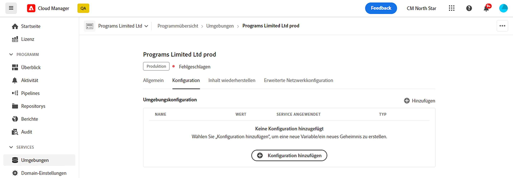
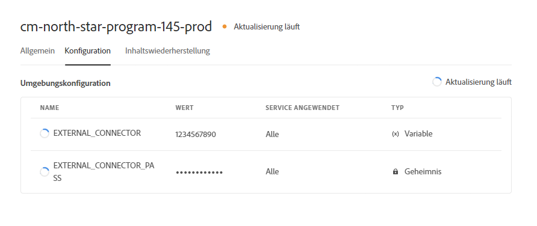
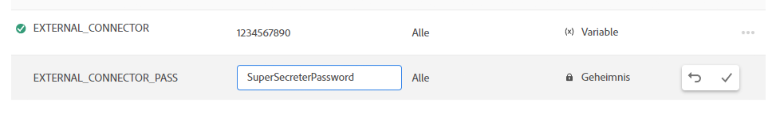

# Umgebungsvariablen in Cloud Manager {#environment-variables}

Standardumgebungsvariablen können über Cloud Manager konfiguriert und verwaltet werden. Sie werden für die Laufzeitumgebung bereitgestellt und können in OSGi-Konfigurationen verwendet werden.

Umgebungsvariablen können umgebungsspezifische Werte oder Umgebungsgeheimnisse sein. Dies ist davon abhängig, was geändert wird.

## Informationen zu Umgebungsvariablen {#overview}

Umgebungsvariablen bieten Benutzenden von AEM as a Cloud Service zahlreiche Vorteile, darunter die Folgenden:

* Sie ermöglichen es, das Verhalten Ihres Codes und Ihres Programms je nach Kontext und Umgebung zu variieren. Beispielsweise können sie verwendet werden, um in der Entwicklungsumgebung andere Konfigurationen als in der Produktions- oder Staging-Umgebung zu ermöglichen, um kostspielige Fehler zu vermeiden.
* Sie müssen nur einmal konfiguriert und eingerichtet werden und können bei Bedarf aktualisiert und gelöscht werden.
* Ihre Werte können jederzeit aktualisiert werden und werden sofort wirksam, ohne dass Code-Änderungen oder -Bereitstellungen erforderlich sind.
* Sie können Code von der Konfiguration trennen und die Notwendigkeit beseitigen, vertrauliche Informationen in die Versionskontrolle einzubeziehen.
* Sie verbessern die Sicherheit des AEM as a Cloud Service-Programms, da sie sich außerhalb des Codes befinden.

Zu den typischen Anwendungsfällen für die Verwendung von Umgebungsvariablen zählen die Folgenden:

* Verbinden des AEM-Programms mit verschiedenen externen Endpunkten
* Verwenden einer Referenz beim Speichern von Kennwörtern (also nicht direkt die Code-Basis)
* Vorhandensein mehrerer Entwicklungsumgebungen in einem Programm, wobei sich einige Konfigurationen von einer Umgebung zur nächsten unterscheiden

## Hinzufügen einer Umgebungsvariablen {#add-variables}

Wenn Sie mehrere Variablen hinzufügen möchten, empfiehlt Adobe, die erste Variable hinzuzufügen und dann im Dialogfeld **Umgebungskonfiguration** die Schaltfläche  **Hinzufügen** zu verwenden, um die zusätzlichen Variablen hinzuzufügen. Mit dieser Methode können Sie sie mit nur einer Aktualisierung zur Umgebung hinzufügen.

Um Umgebungsvariablen hinzufügen, aktualisieren oder löschen zu können, müssen Sie Mitglied der Rolle [**Bereitstellungs-Manager** sein](/help/onboarding/cloud-manager-introduction.md#role-based-premissions).

**So fügen Sie eine Umgebungsvariable hinzu:**

1. Melden Sie sich unter [my.cloudmanager.adobe.com](https://my.cloudmanager.adobe.com/) bei Cloud Manager an und wählen Sie die entsprechende Organisation aus.
1. Wählen Sie in der Konsole **[Meine Programme](/help/implementing/cloud-manager/navigation.md#my-programs)** das Programm aus, das Sie verwalten möchten.
1. Klicken Sie im Seitenmenü auf **Umgebungen**.
1. Wählen Sie auf der Seite **Umgebungen** eine Zeile in der Tabelle aus, die die Umgebung enthält, für die Sie eine Umgebungsvariable hinzufügen möchten.
1. Klicken Sie auf der Seite mit den Umgebungsdetails auf die Registerkarte **Konfiguration**.
1. Klicken Sie auf  **Hinzufügen/Aktualisieren**.
Wenn Sie zum ersten Mal eine Umgebungsvariable hinzufügen, klicken Sie in der Mitte der Seite auf **Konfiguration hinzufügen**.

   

1. Geben Sie im Dialogfeld **Umgebungskonfiguration** die Details in die erste Zeile der Tabelle ein.

   | Feld | Beschreibung |
   | --- | --- |
   | Name | Ein eindeutiger Name der Konfigurationsvariablen. Er identifiziert die spezifische Variable, die in der Umgebung verwendet wird, und muss den folgenden Namenskonventionen entsprechen:<ul><li>Variablen dürfen nur alphanumerische Zeichen und einen Unterstrich (`_`) enthalten.</li><li>Pro Umgebung sind maximal 200 Variablen zulässig.</li><li>Jeder Name darf maximal 100 Zeichen lang sein.</li></ul> |
   | Wert | Der Wert, den die Variable enthält. |
   | Angewendeter Schritt | Wählen Sie den Dienst aus, für den die Variable gilt. Wählen Sie **Alle** aus, damit die Variable auf alle Dienste angewendet wird.<ul><li>**Alle**</li><li>**Autor**</li><li>**Veröffentlichen**</li><li>**Vorschau**</li></ul> |
   | Typ | Legen Sie fest, ob die Variable eine normale Variable oder ein Geheimnis sein soll. |

   

1. Klicken Sie auf **Hinzufügen**.

   Fügen Sie nach Bedarf weitere Variablen hinzu.

1. Klicken Sie auf **Speichern**.

   Oben rechts in der Tabelle wird ein Wartekreisel mit dem Status **Aktualisierung läuft** angezeigt. Links von neu hinzugefügten Variablen wird ebenfalls ein Wartekreisel angezeigt. Diese Status zeigen an, dass die Umgebung mit der Konfiguration aktualisiert wird. Nach Abschluss ist die neue Umgebungsvariable in der Tabelle sichtbar.

## Aktualisieren einer Umgebungsvariablen {#update-variables}

Nachdem Sie Umgebungsvariablen erstellt haben, können Sie sie mit  **Hinzufügen/Aktualisieren** aktualisieren, um das Dialogfeld **Umgebungskonfiguration** zu öffnen.

Wenn mehrere Variablen aktualisiert werden sollen, empfiehlt Adobe, das Dialogfeld **Umgebungskonfiguration** zu verwenden, um alle erforderlichen Variablen gleichzeitig zu aktualisieren, bevor Sie auf **Speichern** klicken. Auf diese Weise können Sie sie mit nur einer Aktualisierung zur Umgebung hinzufügen.

**So aktualisieren Sie eine Umgebungsvariable:**

1. Melden Sie sich unter [my.cloudmanager.adobe.com](https://my.cloudmanager.adobe.com/) bei Cloud Manager an und wählen Sie die entsprechende Organisation aus.
1. Wählen Sie in der Konsole **[Meine Programme](/help/implementing/cloud-manager/navigation.md#my-programs)** das Programm aus, das Sie verwalten möchten.
1. Klicken Sie im Seitenmenü auf **Umgebungen**.
1. Wählen Sie auf der Seite **Umgebungen** eine Zeile in der Tabelle aus, die die Umgebung enthält, für die eine Variable aktualisiert werden soll.
1. Klicken Sie auf der Seite mit den Umgebungsdetails auf die Registerkarte **Konfiguration**.
1. Klicken Sie auf  **Hinzufügen/Aktualisieren**.
1. Klicken Sie im Dialogfeld **Umgebungskonfiguration** auf  in der letzten Spalte der Zeile der Variablen, die geändert werden soll.
1. Klicken Sie im Dropdown-Menü auf **Bearbeiten**.

   

1. Aktualisieren Sie den Wert der Umgebungsvariablen nach Bedarf.
Beim Bearbeiten von Geheimnissen kann der jeweilige Wert nur aktualisiert, aber nicht angezeigt werden.

   

1. Führen Sie einen der folgenden Schritte aus:

   * Klicken Sie auf , um die Änderung anzuwenden.
   * Klicken Sie auf , um die Änderung rückgängig zu machen.

1. Klicken Sie auf **Speichern**.

   Oben rechts in der Tabelle wird ein Wartekreisel mit dem Status **Aktualisierung läuft** angezeigt. Links von aktualisierten Variablen wird ebenfalls ein Wartekreisel angezeigt. Diese Status zeigen an, dass die Umgebung mit der Konfiguration aktualisiert wird. Nach Abschluss ist die aktualisierte Umgebungsvariable in der Tabelle sichtbar.

## Löschen einer Umgebungsvariablen {#delete-env-variable}

1. Melden Sie sich unter [my.cloudmanager.adobe.com](https://my.cloudmanager.adobe.com/) bei Cloud Manager an und wählen Sie die entsprechende Organisation aus.
1. Wählen Sie in der Konsole **[Meine Programme](/help/implementing/cloud-manager/navigation.md#my-programs)** das Programm aus, das Sie verwalten möchten.
1. Klicken Sie im Seitenmenü auf **Umgebungen**.
1. Wählen Sie auf der Seite **Umgebungen** eine Zeile in der Tabelle aus, die die Umgebung enthält, für die eine Variable aktualisiert werden soll.
1. Klicken Sie auf der Seite mit den Umgebungsdetails auf die Registerkarte **Konfiguration**.
1. Klicken Sie auf  **Hinzufügen/Aktualisieren**.
1. Klicken Sie im Dialogfeld **Umgebungskonfiguration** auf  in der letzten Spalte der Zeile der Variablen, die Sie ändern möchten.
1. Klicken Sie im Dropdown-Menü auf **Löschen**, um die Variable umgehend zu entfernen.
1. Klicken Sie auf **Speichern**.

## Verwendung von Umgebungsvariablen {#using}

Umgebungsvariablen können Ihre `pom.xml`-Konfigurationen sicherer und flexibler machen. So müssen beispielsweise Passwörter nicht fest kodiert werden, und Ihre Konfiguration kann auf der Grundlage der Werte in Umgebungsvariablen angepasst werden.

Sie können wie folgt auf Umgebungsvariablen und Geheimnisse über XML zugreifen:

`${env.VARIABLE_NAME}`

Ein Beispiel für die Verwendung beider Arten von Variablen in einer Datei `pom.xml` finden Sie unter [Einrichten eines Projekts](/help/implementing/cloud-manager/getting-access-to-aem-in-cloud/setting-up-project.md#password-protected-maven-repository-support-password-protected-maven-repositories).

Weitere Informationen finden Sie in der [offiziellen Maven-Dokumentation](https://maven.apache.org/settings.html#quick-overview).

## Verfügbarkeit von Umgebungsvariablen {#availability}

Umgebungsvariablen können an mehreren Stellen wie folgt verwendet werden:

| Wo Umgebungsvariablen verwendet werden können | Beschreibung |
| --- | --- |
| Authoring, Vorschau und Veröffentlichung | In der Authoring-, Vorschau- und Veröffentlichungsumgebung können sowohl reguläre Umgebungsvariablen als auch Geheimnisse verwendet werden. |
| Dispatcher | Im [Dispatcher](https://experienceleague.adobe.com/de/docs/experience-manager-dispatcher/using/dispatcher) können nur reguläre Umgebungsvariablen verwendet werden.<ul><li>Geheimnisse können nicht verwendet werden.</li><li>Umgebungsvariablen können nicht in `IfDefine`-Anweisungen verwendet werden.</li><li>Validieren Sie die Verwendung von Umgebungsvariablen [lokal im Dispatcher](https://experienceleague.adobe.com/de/docs/experience-manager-learn/cloud-service/local-development-environment-set-up/dispatcher-tools), bevor Sie sie bereitstellen.</li></ul> |
| OSGi-Konfigurationen | In [OSGi-Konfigurationen](/help/implementing/deploying/configuring-osgi.md) können sowohl reguläre Umgebungsvariablen als auch Geheimnisse verwendet werden. |
| Pipeline-Variablen | Neben Umgebungsvariablen gibt es auch Pipeline-Variablen, die während der Build-Phase verfügbar gemacht werden. Weitere Informationen zu Pipeline-Variablen finden Sie unter [Build-Umgebung](/help/implementing/cloud-manager/getting-access-to-aem-in-cloud/build-environment-details.md#pipeline-variables). |

