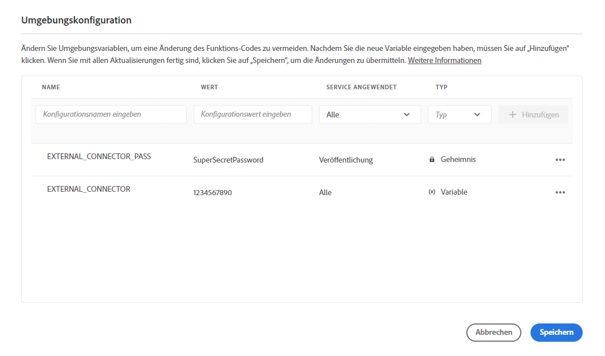
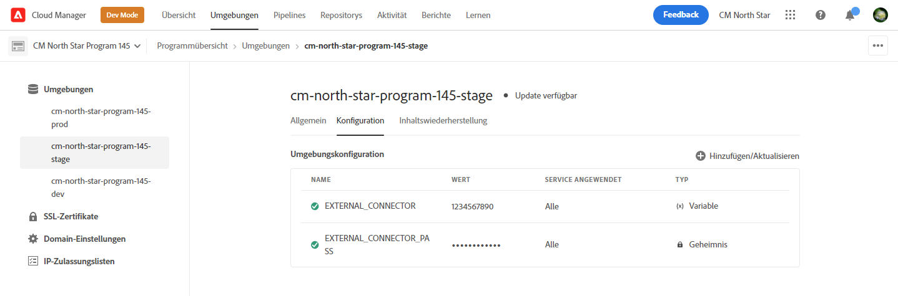

# Cloud Manager-Umgebungsvariablen {#environment-variables}

Standard-Umgebungsvariablen können über Cloud Manager konfiguriert und verwaltet werden. Sie werden der Laufzeitumgebung bereitgestellt und können in OSGi-Konfigurationen verwendet werden. Umgebungsvariablen können entweder umgebungsspezifische Werte oder Umgebungsgeheimnisse sein, je nachdem, was geändert wird.

## Übersicht {#overview}

Umgebungsvariablen bieten Benutzern AEM as a Cloud Service Vorteile:

* Sie ermöglichen es, das Verhalten Ihres Codes und Ihrer Anwendung je nach Kontext und Umgebung zu variieren. Beispielsweise können sie verwendet werden, um in der Entwicklungsumgebung andere Konfigurationen als in der Produktions- oder Staging-Umgebung zu ermöglichen, um kostspielige Fehler zu vermeiden.
* Sie müssen nur einmal konfiguriert und eingerichtet werden und können bei Bedarf aktualisiert und gelöscht werden.
* Ihre Werte können jederzeit aktualisiert werden und sofort wirksam werden, ohne dass Codeänderungen oder -bereitstellungen erforderlich sind.
* Sie können Code von der Konfiguration trennen und die Notwendigkeit, vertrauliche Informationen in die Versionskontrolle einzubeziehen, entfernen.
* Sie verbessern die Sicherheit der AEM as a Cloud Service Anwendung, da sie außerhalb des Codes leben.

Typische Anwendungsfälle für die Verwendung von Umgebungsvariablen sind:

* AEM Anwendung mit verschiedenen externen Endpunkten verbinden
* Verwenden einer Referenz beim Speichern von Kennwörtern anstelle direkt in der Codebasis
* Wenn in einem Programm mehrere Entwicklungsumgebungen vorhanden sind und sich einige Konfigurationen von einer Umgebung zur nächsten unterscheiden

## Hinzufügen von Umgebungsvariablen {#add-variables}

1. Melden Sie sich bei Adobe Cloud Manager an unter [my.cloudmanager.adobe.com](https://my.cloudmanager.adobe.com/).
1. Cloud Manager listet die verschiedenen verfügbaren Programme auf. Wählen Sie die aus, die Sie verwalten möchten.
1. Wählen Sie die **Umgebungen** für das ausgewählte Programm und wählen Sie dann im linken Navigationsbereich die Umgebung aus, für die Sie eine Umgebungsvariable erstellen möchten.
1. Wählen Sie im Detail der Umgebung die **Konfiguration** Registerkarte und wählen Sie **Hinzufügen** , um **Umgebungskonfiguration** angezeigt.
   * Wenn Sie zum ersten Mal eine Umgebungsvariable hinzufügen, wird eine **Konfiguration hinzufügen** in der Mitte der Seite. Sie können diese Schaltfläche oder **Hinzufügen** , um **Umgebungskonfiguration** angezeigt.

   

1. Geben Sie die Variablendetails ein.
   * **Name**
   * **Wert**
   * **Dienst angewendet** - Definiert, für welchen Dienst (Autor/Veröffentlichung/Vorschau) die Variable gilt oder ob sie für alle Dienste gilt
   * **Typ** - Definiert, ob die Variable eine normale Variable oder ein Geheimnis ist

   

1. Nachdem Sie die neue Variable eingegeben haben, müssen Sie **Hinzufügen** in der letzten Spalte der Zeile, die die neue Variable enthält.
   * Sie können mehrere Variablen gleichzeitig eingeben, indem Sie eine neue Zeile eingeben und **Hinzufügen**.

   

1. Auswählen **Speichern** um Ihre Variablen beizubehalten.

Ein Indikator mit dem Status **Aktualisieren** wird oben in der Tabelle und neben der neu hinzugefügten Variablen angezeigt, um anzugeben, dass die Umgebung mit der Konfiguration aktualisiert wird. Nach Abschluss wird die neue Umgebungsvariable in der Tabelle angezeigt.

>[!TIP]
>
>Wenn Sie mehrere Variablen hinzufügen möchten, wird empfohlen, die erste Variable hinzuzufügen. Verwenden Sie dann die **Hinzufügen** im **Umgebungskonfiguration** -Dialogfeld, um die zusätzlichen Variablen hinzuzufügen. Auf diese Weise können Sie sie mit einem Update zur Umgebung hinzufügen.

## Aktualisieren von Umgebungsvariablen {#update-variables}

Nachdem Sie Umgebungsvariablen erstellt haben, können Sie diese mithilfe der Variablen **Hinzufügen/Aktualisieren** Schaltfläche zum Starten **Umgebungskonfiguration** angezeigt.

1. Melden Sie sich bei Adobe Cloud Manager an unter [my.cloudmanager.adobe.com](https://my.cloudmanager.adobe.com/).
1. Cloud Manager listet die verschiedenen verfügbaren Programme auf. Wählen Sie die aus, die Sie verwalten möchten.
1. Wählen Sie die **Umgebungen** für das ausgewählte Programm und wählen Sie dann im linken Navigationsbereich die Umgebung aus, für die Sie eine Umgebungsvariable erstellen möchten.
1. Wählen Sie im Detail der Umgebung die **Konfiguration** Registerkarte und wählen Sie **Hinzufügen/Aktualisieren** oben rechts, um die **Umgebungskonfiguration** angezeigt.

   

1. Verwenden Sie die Suchschaltfläche in der letzten Spalte der Zeile der Variable, die Sie ändern möchten, und wählen Sie **Bearbeiten** oder **Löschen**.

   

1. Bearbeiten Sie die Umgebungsvariable nach Bedarf.
   * Bei der Bearbeitung ändert sich die Schaltfläche mit Auslassungspunkten in Optionen, um zum ursprünglichen Wert zurückzukehren oder Ihre Änderung zu bestätigen.
   * Beim Bearbeiten von Geheimnissen können die Werte nur aktualisiert, nicht angezeigt werden.

   

1. Nachdem Sie alle erforderlichen Konfigurationsänderungen vorgenommen haben, wählen Sie **Speichern**.

[Wie beim Hinzufügen von Variablen,](#add-variables) einen Indikator mit dem Status **Aktualisieren** wird oben in der Tabelle und neben den neu aktualisierten Variablen angezeigt, um anzugeben, dass die Umgebung mit der Konfiguration aktualisiert wird. Nach Abschluss des Vorgangs werden die aktualisierten Umgebungsvariablen in der Tabelle angezeigt.

>[!TIP]
>
>Wenn Sie mehrere Variablen aktualisieren möchten, wird empfohlen, die Variable **Umgebungskonfiguration** Dialogfeld, um alle erforderlichen Variablen gleichzeitig zu aktualisieren, bevor Sie auf **Speichern**. Auf diese Weise können Sie sie mit einem Update zur Umgebung hinzufügen.
