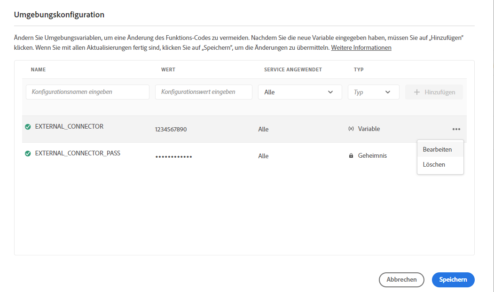

# Cloud Manager-Umgebungsvariablen {#environment-variables}

Standardumgebungsvariablen können über Cloud Manager konfiguriert und verwaltet werden. Sie werden der Laufzeitumgebung bereitgestellt und können in OSGi-Konfigurationen verwendet werden. Umgebungsvariablen können umgebungsspezifische Werte oder Umgebungsgeheimnisse sein. Dies ist davon abhängig, was geändert wird.

## Übersicht {#overview}

Umgebungsvariablen bieten Benutzern von AEM as a Cloud Service viele Vorteile:

* Sie ermöglichen es, das Verhalten Ihres Codes und Ihres Programms je nach Kontext und Umgebung zu variieren. Beispielsweise können sie verwendet werden, um in der Entwicklungsumgebung andere Konfigurationen als in der Produktions- oder Staging-Umgebung zu ermöglichen, um kostspielige Fehler zu vermeiden.
* Sie müssen nur einmal konfiguriert und eingerichtet werden und können bei Bedarf aktualisiert und gelöscht werden.
* Ihre Werte können jederzeit aktualisiert werden und werden sofort wirksam, ohne dass Code-Änderungen oder -Bereitstellungen erforderlich sind.
* Sie können Code von der Konfiguration trennen und die Notwendigkeit beseitigen, vertrauliche Informationen in die Versionskontrolle einzubeziehen.
* Sie verbessern die Sicherheit des AEM as a Cloud Service-Programms, da sie sich außerhalb des Codes befinden.

Typische Anwendungsfälle für die Verwendung von Umgebungsvariablen sind:

* Verbinden des AEM-Programms mit verschiedenen externen Endpunkten
* Verwenden einer Referenz beim Speichern von Kennwörtern (also nicht direkt die Code-Basis)
* Vorhandensein mehrerer Entwicklungsumgebungen in einem Programm, wobei sich einige Konfigurationen von einer Umgebung zur nächsten unterscheiden

## Hinzufügen von Umgebungsvariablen {#add-variables}

1. Melden Sie sich unter [my.cloudmanager.adobe.com](https://my.cloudmanager.adobe.com/) bei Adobe Cloud Manager an.
1. Cloud Manager listet die verschiedenen verfügbaren Programme auf. Wählen Sie die aus, die Sie verwalten möchten.
1. Wählen Sie die Registerkarte **Umgebungen** für das ausgewählte Programm und wählen Sie dann im linken Navigationsfenster die Umgebung aus, für die Sie eine Umgebungsvariable erstellen möchten.
1. Wählen Sie in den Details der Umgebung die Registerkarte **Konfiguration** und dann **Hinzufügen** aus, um das Dialogfeld **Umgebungskonfiguration** zu öffnen.
   * Wenn Sie zum ersten Mal eine Umgebungsvariable hinzufügen, wird die Schaltfläche **Konfiguration hinzufügen** in der Mitte der Seite angezeigt. Sie können diese Schaltfläche oder **Hinzufügen** verwenden, um das Dialogfeld **Umgebungskonfiguration** zu öffnen.

   

1. Geben Sie die Variablendetails ein.
   * **Name**
   * **Wert**
   * **Service angewendet** – Definiert, für welchen Service (Autor/Veröffentlichung/Vorschau) die Variable gilt oder ob sie für alle Services gilt
   * **Typ** – Definiert, ob die Variable eine normale Variable oder ein Geheimnis ist

   

1. Nachdem Sie die neue Variable eingegeben haben, müssen Sie **Hinzufügen** in der letzten Spalte der Zeile auswählen, die die neue Variable enthält.
   * Sie können mehrere Variablen gleichzeitig eingeben, indem Sie in eine neue Zeile wechseln und **Hinzufügen** auswählen.

   

1. Wählen Sie **Speichern** aus, um Ihre Variablen beizubehalten.

Ein Indikator mit dem Status **Aktualisierung läuft** wird oben in der Tabelle und neben der neu hinzugefügten Variablen angezeigt, um anzugeben, dass die Umgebung mit der Konfiguration aktualisiert wird. Nach Abschluss wird die neue Umgebungsvariable in der Tabelle angezeigt.

>[!TIP]
>
>Wenn Sie mehrere Variablen hinzufügen möchten, wird empfohlen, die erste Variable hinzuzufügen. Verwenden Sie dann die Schaltfläche **Hinzufügen** im Dialogfeld **Umgebungskonfiguration**, um die zusätzlichen Variablen hinzuzufügen. Auf diese Weise können Sie sie mit einer Aktualisierung zur Umgebung hinzufügen.

## Aktualisieren von Umgebungsvariablen {#update-variables}

Nachdem Sie Umgebungsvariablen erstellt haben, können Sie diese mithilfe der Schaltfläche **Hinzufügen/Aktualisieren** aktualisieren, um das Dialogfeld **Umgebungskonfiguration** zu starten.

1. Melden Sie sich unter [my.cloudmanager.adobe.com](https://my.cloudmanager.adobe.com/) bei Adobe Cloud Manager an.
1. Cloud Manager listet die verschiedenen verfügbaren Programme auf. Wählen Sie die aus, die Sie verwalten möchten.
1. Wählen Sie die Registerkarte **Umgebungen** für das ausgewählte Programm aus und wählen Sie dann im linken Navigationsfenster die Umgebung aus, für die Sie eine Umgebungsvariable erstellen möchten.
1. Wählen Sie in den Details der Umgebung die Registerkarte **Konfiguration** aus und wählen Sie oben rechts **Hinzufügen/Aktualisieren** aus, um das Dialogfeld **Umgebungskonfiguration** zu öffnen.

   

1. Verwenden Sie die Suchschaltfläche in der letzten Spalte der Zeile der Variablen, die Sie ändern möchten, und wählen Sie **Bearbeiten** oder **Löschen** aus.

   

1. Bearbeiten Sie die Umgebungsvariable nach Bedarf.
   * Bei der Bearbeitung ändert sich die Schaltfläche mit Auslassungspunkten in Optionen, um den ursprünglichen Wert wiederherzustellen oder Ihre Änderung zu bestätigen.
   * Beim Bearbeiten von Geheimnissen können die Werte nur aktualisiert, aber nicht angezeigt werden.

   

1. Nachdem Sie alle erforderlichen Konfigurationsänderungen vorgenommen haben, wählen Sie **Speichern** aus.

[Wie beim Hinzufügen von Variablen](#add-variables) wird ein Indikator mit dem Status **Aktualisieren** oben in der Tabelle und neben den neu aktualisierten Variablen angezeigt, um anzugeben, dass die Umgebung mit der Konfiguration aktualisiert wird. Nach Abschluss des Vorgangs werden die aktualisierten Umgebungsvariablen in der Tabelle angezeigt.

>[!TIP]
>
>Wenn Sie mehrere Variablen aktualisieren möchten, wird empfohlen, das Dialogfeld **Umgebungskonfiguration** zu verwenden, um alle erforderlichen Variablen gleichzeitig zu aktualisieren, bevor Sie auf **Speichern** tippen oder klicken. Auf diese Weise können Sie sie mit einer Aktualisierung zur Umgebung hinzufügen.
