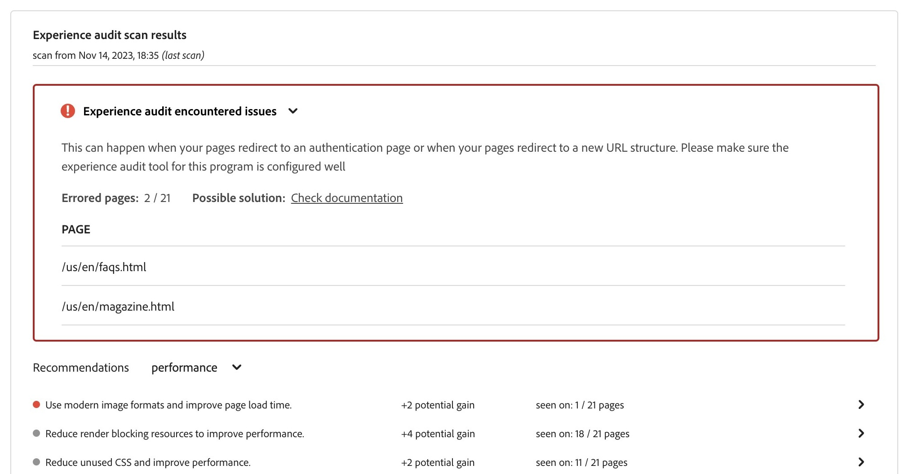

# Experience Audit-Dashboard {#experience-audit-dashboard}

Erfahren Sie, wie Experience Audit Ihren Implementierungsprozess validiert und durch eine klare, informative Dashboard-Oberfläche sicherstellt, dass die bereitgestellten Änderungen den Grundstandards für Leistung, Barrierefreiheit, Best Practices und SEO entsprechen.

>[!NOTE]
>
>Diese Funktion ist nur für das [Early-Adopter-Programm](/help/implementing/cloud-manager/release-notes/current.md#early-adoption) verfügbar.
>
>Weitere Informationen zur vorhandenen Funktion „Erlebnisprüfung“ für AEM as a Cloud Service finden Sie unter [Testen mit der Erlebnisprüfung](/help/implementing/cloud-manager/experience-audit-testing.md).

## Übersicht {#overview}

Die Erlebnisprüfung validiert den Bereitstellungsprozess und stellt sicher, dass die Änderungen bereitgestellt werden:

1. Erfüllen Sie Grundanforderungen an Leistung, Barrierefreiheit, Best Practices, SEO (Suchmaschinenoptimierung) und PWA (Progressive Web App).

1. Führen Sie keine Regressionen ein.

Experience Audit in Cloud Manager stellt sicher, dass das Erlebnis der Benutzenden auf der Site höchsten Standards entspricht.

Die Ergebnisse des Audits sind rein informativ und ermöglichen es dem Bereitstellungs-Manager, die Bewertungen sowie die Unterschiede zwischen aktuellen und vorherigen Bewertungen anzuzeigen. Diese Erkenntnis ist wertvoll, um festzustellen, ob es eine Regression gibt, die mit der aktuellen Bereitstellung eingeführt wurde.

Die Erlebnisprüfung basiert auf [Google Lighthouse](https://developer.chrome.com/docs/lighthouse/overview/), einem Open-Source-Tool von Google, und ist in allen Cloud Manager-Produktions-Pipelines aktiviert.

## Verfügbarkeit {#availability}

Die Erlebnisprüfung ist für folgende Cloud Manager-Pipelines verfügbar:

* standardmäßig für Sites-Produktions-Pipelines
* optional für Entwicklungs-Full-Stack-Pipelines
* optional für Entwicklungs-Front-End-Pipelines

Weitere Informationen zum Konfigurieren der Prüfung für die optionalen Umgebungen finden Sie im [Konfigurationsabschnitt](#configuration).

Prüfungen werden als Teil der Pipeline ausgeführt. Prüfungen können auch [bei Bedarf](#on-demand) außerhalb von Pipelines ausgeführt werden.

## Konfiguration {#configuration}

Die Erlebnisprüfung ist standardmäßig für Produktions-Pipelines verfügbar. Sie kann optional für Entwicklungs-Full-Stack- und -Front-End-Pipelines aktiviert werden. In allen Fällen müssen Sie definieren, welche Inhaltspfade während der Pipeline-Ausführung ausgewertet werden.

1. Je nach Pipeline-Typ, der konfiguriert werden soll, befolgen Sie die Anweisungen für diese Vorgänge:

   * Fügen Sie eine neue [Produktions-Pipeline](/help/implementing/cloud-manager/configuring-pipelines/configuring-production-pipelines.md) hinzu, wenn Sie die Pfade definieren möchten, die von der Prüfung ausgewertet werden sollen.
   * Fügen Sie eine neue [produktionsfremde Pipeline](/help/implementing/cloud-manager/configuring-pipelines/configuring-non-production-pipelines.md) hinzu, wenn Sie die Prüfung in einer Front-End- oder Entwicklungs-Full-Stack-Pipeline aktivieren möchten.
   * Sie können auch [eine vorhandene Pipeline bearbeiten](/help/implementing/cloud-manager/configuring-pipelines/managing-pipelines.md) und die vorhandenen Optionen aktualisieren.

1. Wenn Sie eine produktionsfremde Pipeline hinzufügen oder bearbeiten, für die die Erlebnisprüfung verwendet werden soll, müssen Sie auf der Registerkarte **Quell-Code** das Kontrollkästchen **Erlebnisprüfung** aktivieren.

   

   * Dies ist nur für produktionsfremde Pipelines erforderlich.
   * Die Registerkarte **Erlebnisprüfung** wird angezeigt, wenn das Kontrollkästchen aktiviert ist.

1. Für Produktions- und Nicht-Produktions-Pipelines definieren Sie die in der Erlebnisprüfung einzuschließenden Pfade auf der Registerkarte **Erlebnisprüfung**.

   * Seitenpfade müssen mit `/` beginnen und sind relativ zu Ihrer Site.
   * Wenn es sich beispielsweise bei Ihrer Site um `wknd.site` handelt und `https://wknd.site/us/en/about-us.html` in die Erlebnisprüfung aufgenommen werden soll, geben Sie den Pfad `/us/en/about-us.html` ein.

   

1. Wenn Sie auf **Seite hinzufügen** tippen oder klicken, wird der Pfad automatisch mit der Adresse Ihrer Umgebung aufgefüllt und der Pfadtabelle hinzugefügt.

   

1. Fügen Sie weitere Pfade hinzu, indem Sie die vorherigen beiden Schritte wiederholen.

   * Sie können maximal 25 Pfade hinzufügen.
   * Wenn Sie keine Pfade definieren, wird die Startseite der Site standardmäßig in das Experience Audit einbezogen.

1. Klicken Sie auf **Speichern**, um die Pipeline zu speichern.

## Ergebnisse der Erlebnisprüfung {#results}

Die Ergebnisse der Erlebnisprüfung werden in der Phase **Stage-Testing** der Produktions-Pipeline über die [Ausführungsseite der Produktions-Pipeline](/help/implementing/cloud-manager/deploy-code.md) präsentiert.

Die Erlebnisprüfung gibt die mittleren Google-Lighthouse-Bewertungen für die [konfigurierten Seiten](#configuration) und die Differenz zwischen dem Ergebnis und dem vorherigen Scan an.

Über diese Zusammenfassungsansicht in der Phase **Stage-Testing** der Pipeline haben Sie zwei Optionen:

* **[Langsamste Seiten anzeigen](#view-slowest-pages)**
* **[Vollständigen Bericht anzeigen](#view-full-report)**

Zusätzlich zu der in den Details eines Pipeline-Laufs dargestellten Zusammenfassung können Sie auch direkt auf die vollständigen Ergebnisse der Prüfung zugreifen, indem Sie über die Registerkarte **Berichte** des Cloud Manager-Dashboards auf [den vollständigen Bericht](#view-full-report) zugreifen.

>[!TIP]
>
>In den folgenden Abschnitten wird beschrieben, wie Sie die Ergebnisse der Erlebnisprüfung anzeigen.
>
>* Weitere Informationen zur Funktionsweise der Prüfung finden Sie im Abschnitt [Auswertungsdetails für Erlebnisprüfungen.](#details)
>* Wenn Sie wissen möchten, wie Sie eine Erlebnisprüfung auf Anfrage durchführen, lesen Sie den Abschnitt [On-Demand-Prüfberichte](#on-demand).
>* Wenn bei der Prüfung Probleme auftreten, lesen Sie bitte den Abschnitt [Bei der Erlebnisprüfung treten Probleme auf](#issues).
>* Allgemeine Tipps zur Leistung finden Sie im Abschnitt [Allgemeine Tipps zur Leistung](#performance-tips).

### Langsamste Seiten anzeigen {#view-slowest-pages}

Durch Tippen oder Klicken auf **Langsamste Seiten anzeigen** wird das Dialogfeld **Langsamste 5 Seiten** mit den fünf Seiten mit der niedrigsten Leistung geöffnet, die Sie [zur Prüfung konfiguriert haben](#configuration).

Die Bewertungen werden nach **Leistung**, **Barrierefreiheit**, **Best Practices** und **SEO** zusammen mit der Abweichung der einzelnen Metriken von der letzten Prüfung aufgegliedert.

Standardmäßig wird das Dialogfeld mit den Bewertungen für Mobilgeräte geöffnet. Sie können mithilfe des **Geräte**-Umschalters am oberen Rand des Dialogfelds zu den Desktop-Bewertungen wechseln.

Das Dialogfeld soll einen schnellen Überblick verschaffen. Für die vollständigen Details tippen oder klicken Sie auf **Vollständigen Bericht anzeigen**.

### Anzeigen des vollständigen Berichts {#view-full-report}

Sie können den vollständigen Bericht zur Erlebnisprüfung wie folgt anzeigen:

* Tippen oder Klicken auf **Vollständigen Bericht anzeigen** im Dialogfeld **[Langsamste 5 Seiten](#view-slowest-pages)**.
* Tippen oder Klicken auf **Vollständigen Bericht anzeigen** beim Anzeigen der [Ausführung einer Pipeline.](#results)
* Tippen oder Klicken auf die Registerkarte **Berichte** in Cloud Manager.

Die Registerkarte **Berichte** von Cloud Manager wird geöffnet und zeigt die **Erlebnisprüfung** an.

Der Bericht ist in zwei Bereiche unterteilt:

* **[Seitenbewertungen – Trend](#trend)**
* **[Ergebnisse des Erlebnisprüfungs-Scans](#results)**

#### Seitenbewertungen – Trend {#trend}

Standardmäßig zeigt die ausgewählte Ansicht für **Seitenbewertungen – Trend** die **Medianwerte** für die **letzten 6 Monate**.

Verwenden Sie die Dropdown-Listen **Auswählen** und **Anzeigen** oben und unten im Diagramm, um seitenspezifische Details bzw. unterschiedliche Zeitrahmen auszuwählen. Tippen oder klicken Sie auf die Schaltfläche **Trend aktualisieren** am oberen Rand des Diagramms, um die Auswahl anzuwenden und das Diagramm zu aktualisieren.

Wenn Sie den Mauszeiger über das Diagramm bewegen, zeigt eine QuickInfo die Werte für die Google Lighthouse-Kategorien zu bestimmten Zeitpunkten an.

Wenn Sie auf einen bestimmten Zeitpunkt im Diagramm tippen oder klicken, wird ein Popup mit Details zu diesem Scan geöffnet. Tippen oder klicken Sie auf **Erlebnisprüfungs-Scan öffnen**, um diese Scan-Ergebnisse im Abschnitt **[Ergebnisse des Erlebnisprüfungs-Scans](#scan-results)** zu laden.

#### Ergebnisse des Erlebnisprüfungs-Scans {#scan-results}

Im Abschnitt **Ergebnisse des Erlebnisprüfungs-Scans** finden Sie Empfehlungen dazu, wie Sie Ihre Bewertung und Details aller gescannten Seiten verbessern können. Er ist in zwei Abschnitte unterteilt:

* **[Empfehlungen](#recommendations)**
* **[Gescannte Seiten](#scanned-pages)**

##### Empfehlungen {#recommendations}

Der Abschnitt **Empfehlungen** zeigt einen aggregierten Satz von Einblicken. Standardmäßig werden Empfehlungen für **Leistung** angezeigt. Verwenden Sie das Dropdown-Menü neben der Überschrift **Empfehlungen**, um zu einer anderen Kategorie zu wechseln.

Tippen oder klicken Sie auf den Pfeil für eine beliebige Empfehlung, um Details dazu anzuzeigen.

Sofern verfügbar, enthalten die erweiterten Empfehlungsdetails auch den Prozentsatz der Auswirkungen der Empfehlungen, damit Sie sich auf die wirkungsvollsten Änderungen konzentrieren können.

Tippen oder klicken Sie auf den Link **Seiten anzeigen** in der Detailansicht, um die Seiten anzuzeigen, für die die Empfehlung gilt.

##### Gescannte Seiten {#scanned-pages}

Der Abschnitt **Gescannte Seiten** enthält Detailbewertungen für alle gescannten Seiten. Sie können die Ergebnisse mithilfe der Schaltflächen **Zurück** und **Weiter** durchblättern und festlegen, wie viele die Anzeige paginieren soll.

Durch Tippen oder Klicken auf den Link einer bestimmten Seite wird der Filter **Auswählen** des [**Abschnitts „Seitenbewertungen – Trend“** ](#trend)aktualisiert und die Registerkarte **Bewertungen und Empfehlungen** für die ausgewählte Seite angezeigt.

Die Registerkarte **Rohberichte** gibt Bewertungen für jede Prüfung der Seite an. Tippen oder klicken Sie auf das Symbol **Herunterladen**, um eine JSON-Datei der Rohdaten abzurufen.

Dadurch wird eine neue Registerkarte in Ihrem Browser geöffnet, die auf `https://googlechrome.github.io/lighthouse/viewer/` mit einer signierten URL des JavaScript Object Notation(JSON)-Lighthouse-Rohberichts für die ausgewählte Seite verweist, der automatisch für die ausführliche Überprüfung geöffnet wird.

## On-Demand-Prüfberichte {#on-demand}

Die Berichte der Erlebnisprüfung werden nicht nur während der Pipeline-Ausführung ausgeführt, sondern können auch bei Bedarf generiert werden. Dies ist eine gute Lösung, um Seiten schnell zu scannen, ohne eine Pipeline ausführen zu müssen.

Zum Ausführen eines On-Demand-Scans navigieren Sie zur Registerkarte **Berichte**, um den vollständigen Prüfbericht anzuzeigen, und tippen oder klicken Sie auf die Schaltfläche **Scans durchführen**.

On-Demand-Scans lösen eine Erlebnisprüfung für die letzten 25 [konfigurierten Seiten](#configuration) aus und werden in der Regel innerhalb weniger Minuten abgeschlossen.

Nach Abschluss des Vorgangs wird das Bewertungsdiagramm automatisch aktualisiert und Sie können die Ergebnisse genau wie bei einem Pipeline-Ausführungs-Scan überprüfen.

Sie können das Bewertungsdiagramm nach dem Trigger-Typ filtern, indem Sie die Auswahl **Trigger** auswählen.

>[!NOTE]
>
>Ein On-Demand-Scan kann nur gestartet werden, wenn die Umgebung nicht gelöscht wird und es keine weiteren ausstehenden Scans in derselben Umgebung gibt.

## Probleme bei der Erlebnisprüfung {#issues}

Wenn [von Ihnen zur Prüfung konfigurierte Seiten](#configuration) nicht verfügbar waren, wird dies bei der Erlebnisprüfung widergespiegelt.

Die Pipeline präsentiert einen erweiterbaren Fehlerabschnitt, um die relativen URL-Pfade anzuzeigen, wenn kein Zugriff möglich war.

Wenn Sie sich den vollständigen Bericht ansehen, finden Sie Details dazu im Abschnitt **[Ergebnisse des Erlebnisprüfungs-Scans](#results)**.

Die Seiten können beispielsweise aus folgenden Gründen nicht verfügbar sein:

* Der Zugriff wird durch die Konfiguration blockiert.
* Die Seite ist nicht vorhanden.
* Die Seite wird umgeleitet, wofür die Standardauthentifizierung nicht ausreicht.
* Es ist ein internes Problem aufgetreten.
* usw.

>[!TIP]
>
>Indem Sie die [Rohberichte für eine Seite aufrufen](#scanned-pages), können Sie Einzelheiten darüber erfahren, warum die Seite nicht geprüft werden konnte.

## Allgemeine Tipps zur Leistung {#performance-tips}

Zwei der am häufigsten auftretenden Probleme, die einfach zu beheben sind, beziehen sich auf die Metriken „Cumulative Layout Shifts (CLS)“ und „Largest Contentful Paint (LCP)“.

Diese können durch folgende Maßnahmen verbessert werden:

* kein Lazy Loading der Bilder über der Falz (das ist der Inhalt, der im Browser sichtbar ist, ohne nach unten scrollen zu müssen).
* ordnungsgemäßes Priorisieren der Art und Weise, wie Ressourcen geladen werden (z. B. durch asynchrones Laden der Bilder unterhalb der Falz, nachdem das Dokument geladen wurde)
* Vorabrufen von JavaScript- und CSS-Dateien, die verwendet werden, um Inhalte über der Falz zu rendern (falls erforderlich).
* Reservieren des vertikalen Bereichs durch Zuweisen eines Seitenverhältnisses zu Containern, die entweder langsam geladen oder später gerendert werden.
* Konvertieren der Bilder in das WebP-Format, um ihre Größe zu reduzieren.
* Verwenden von `<picture>` und Bild-`srcset` mit unterschiedlichen Bildgrößen für verschiedene Viewport-Größen (und Sicherstellen, dass die Größenanpassung funktioniert).

## Auswertungsdetails bei der Erlebnisprüfung {#details}

Die folgenden Details liefern zusätzliche Informationen darüber, wie Ihre Site von der Erlebnisprüfung ausgewertet wird. Sie sind für die allgemeine Nutzung der Funktion nicht erforderlich und werden hier der Vollständigkeit halber bereitgestellt.

* Obwohl die [konfigurierten Seitenpfade für die Erlebnisprüfung](#configuration) die Publisher-seitige `.com`-Domain anzeigt, scannt die Prüfung die ursprüngliche Domain (`.net`), um sicherzustellen, dass Probleme, die während der Entwicklung aufgetreten sind, erkannt werden.
   * Die `.com`-Domain verwendet ein CDN und könnte bessere Bewertungen erreichen oder zwischengespeicherte Ergebnisse enthalten.
* In Produktions-Full-Stack-Pipelines wird die Staging-Umgebung gescannt.
   * Um sicherzustellen, dass die Prüfung während des Auditings relevante Details liefert, sollte der Inhalt der Staging-Umgebung dem der Produktionsumgebung so weit wie möglich entsprechen.
* Die Seiten, die im Abschnitt](#trend) [**Seitenbewertungen – Trend** in der Dropdown-Liste **Auswählen** angezeigt werden, sind alle bekannten Seiten, die in der Vergangenheit von der Erlebnisprüfung gescannt wurden.
* [Eine Empfehlung](#recommendations) kann einen potenziellen Gewinn und einen Unterschied zum vorherigen Scan aufweisen.
   * Die Erlebnisprüfung schätzt den potenziellen Gewinn, indem der Rohbericht für jede Seite verarbeitet und die verschwendeten Bytes oder Millisekunden mit einem Einblick korreliert werden, der sich auf das Leistungsergebnis auswirkt.
   * Die Prüfung enthält diese Informationen (sowie die betroffenen Seiten), um zu entscheiden, welcher Empfehlung nachgegangen werden soll.
   * Weitere Informationen finden Sie im [Abschnitt „Allgemeine Tipps zur Leistung“](#performance-tips)
* Da eine Frontend-Pipeline in einer bestehenden Umgebung bereitgestellt werden kann (oder es mehrere Frontend-Pipelines für dieselbe Umgebung geben kann) und die Scan-Ergebnisse auf Umgebungsebene aggregiert werden, werden die Bewertungen, Trends und Empfehlungen in derselben ausgewählten Umgebung angezeigt, unabhängig von der Pipeline-Ausführung, die den Scan ausgelöst hat.
