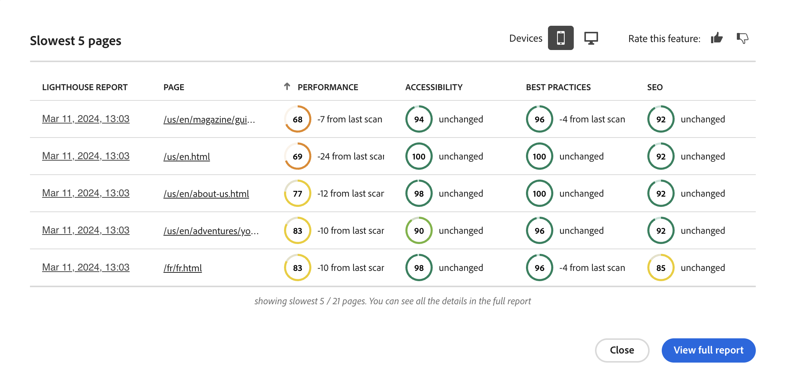
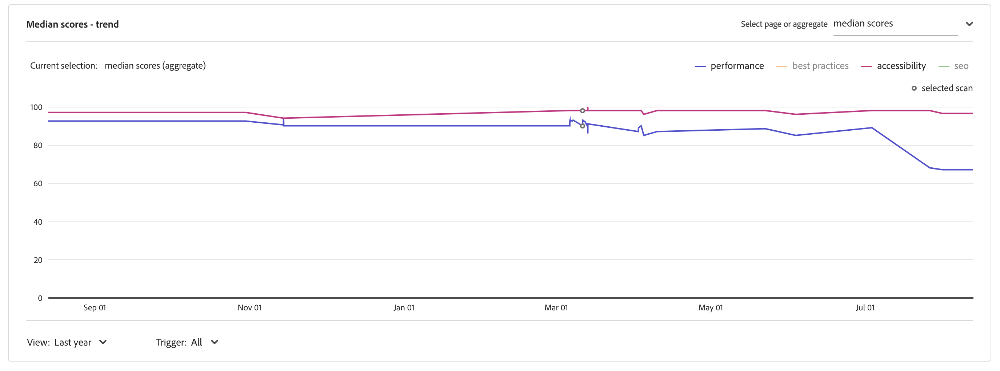
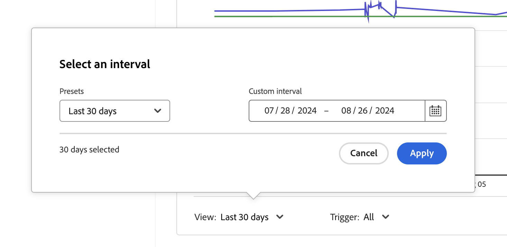

# Experience Audit-Dashboard {#experience-audit-dashboard}

Erfahren Sie, wie der Erlebnis-Audit Ihren Implementierungsprozess validiert und sicherstellt, dass die Änderungen den Grundstandards für Leistung, Barrierefreiheit, Best Practices und SEO entsprechen. Es bietet eine klare und informative Dashboard-Oberfläche zum Verfolgen dieser Metriken.

## Überblick {#overview}

Der Erlebnis-Audit validiert den Bereitstellungsprozess und stellt sicher, dass die Änderungen bereitgestellt werden:

1. Erfüllen Sie Grundstandards für Leistung, Barrierefreiheit, Best Practices und SEO (Suchmaschinenoptimierung).

1. Führen Sie keine Regressionen ein.

Experience Audit in Cloud Manager stellt sicher, dass das Erlebnis der Benutzenden auf der Site höchsten Standards entspricht.

Die Ergebnisse des Audits sind rein informativ und ermöglichen es dem Bereitstellungs-Manager, die Bewertungen sowie die Unterschiede zwischen aktuellen und vorherigen Bewertungen anzuzeigen. Diese Erkenntnis ist wertvoll, um festzustellen, ob es eine Regression gibt, die mit der aktuellen Bereitstellung eingeführt wurde.

Die Erlebnisprüfung basiert auf [Google Lighthouse](https://developer.chrome.com/docs/lighthouse/overview/), einem Open-Source-Tool von Google, und ist in allen Cloud Manager-Produktions-Pipelines aktiviert.

## Verfügbarkeit {#availability}

Die Erlebnisprüfung ist für folgende Cloud Manager-Pipelines verfügbar:

* (Standard) Produktions-Pipelines für Sites
* (Optional) Entwicklung von Full-Stack-Pipelines
* (Optional) Entwicklung von Frontend-Pipelines

Weitere Informationen zum Konfigurieren der Prüfung für die optionalen Umgebungen finden Sie im [Konfigurationsabschnitt](#configuration).

Prüfungen werden als Teil der Pipeline ausgeführt. Prüfungen können auch [bei Bedarf](#on-demand) außerhalb von Pipelines ausgeführt werden.

## Konfiguration {#configuration}

Die Erlebnisprüfung ist standardmäßig für Produktions-Pipelines verfügbar. Sie kann optional für die Entwicklung von Full-Stack- und Frontend-Pipelines aktiviert werden. In allen Fällen müssen Sie definieren, welche Inhaltspfade während der Pipeline-Ausführung ausgewertet werden.

1. Je nach Pipeline-Typ, der konfiguriert werden soll, befolgen Sie die Anweisungen für diese Vorgänge:

   * Fügen Sie eine neue [Produktions-Pipeline](/help/implementing/cloud-manager/configuring-pipelines/configuring-production-pipelines.md) hinzu, um die Pfade zu definieren, die das Audit auswerten soll.
   * Fügen Sie eine neue [produktionsfremde Pipeline](/help/implementing/cloud-manager/configuring-pipelines/configuring-non-production-pipelines.md) hinzu, wenn Sie die Prüfung für eine Frontend- oder Full-Stack-Entwicklungs-Pipeline aktivieren möchten.
   * Oder Sie können [eine vorhandene Pipeline bearbeiten,](/help/implementing/cloud-manager/configuring-pipelines/managing-pipelines.md) und die vorhandenen Optionen aktualisieren.

1. Um den Erlebnis-Audit beim Hinzufügen oder Bearbeiten einer Nicht-Produktions-Pipeline zu verwenden, aktivieren Sie das Kontrollkästchen **Erlebnis-Audit**. Diese Option finden Sie auf der Registerkarte **Quell-Code**.

   

   * Nur für produktionsfremde Pipelines erforderlich.
   * Die Registerkarte **Erlebnisprüfung** wird beim Auswählen des Kontrollkästchens angezeigt.

1. Die Pfade für Produktions-Pipelines und produktionsfremde Pipelines, die in die Erlebnisprüfung aufgenommen werden sollen, werden auf der Registerkarte **Erlebnisprüfung** definiert.

   * Seitenpfade müssen mit `/` beginnen und sind relativ zu Ihrer Site.
   * Wenn Ihre Site beispielsweise `wknd.site` ist und Sie `https://wknd.site/us/en/about-us.html` in die Erlebnisprüfung aufnehmen möchten, geben Sie den Pfad `/us/en/about-us.html` ein.

   

1. Wenn Sie auf **Seite hinzufügen** klicken, wird der Pfad automatisch mit der Adresse Ihrer Umgebung ausgefüllt und der Pfadtabelle hinzugefügt.

   

1. Fügen Sie weitere Pfade hinzu, indem Sie die vorherigen beiden Schritte wiederholen.

   * Sie können maximal 25 Pfade hinzufügen.
   * Wenn Sie keine Pfade definieren, wird die Startseite der Site standardmäßig in das Experience Audit einbezogen.

1. Klicken Sie auf **Speichern**.

## Ergebnisse des Erlebnis-Audits {#results}

Die Ergebnisse des Experience Audit werden im Schritt **Staging-Tests** der Produktions-Pipeline über die [Ausführungsseite der Produktions-Pipeline](/help/implementing/cloud-manager/deploy-code.md) präsentiert.

Die Erlebnisprüfung gibt die mittleren Google-Lighthouse-Bewertungen für die [konfigurierten Seiten](#configuration) und die Differenz zwischen dem Ergebnis und dem vorherigen Scan an.

Über diese Zusammenfassungsansicht in der Phase **Stage-Testing** der Pipeline haben Sie zwei Optionen:

* **[Langsamste Seiten anzeigen](#view-slowest-pages)**
* **[Vollständigen Bericht anzeigen](#view-full-report)**

Sie können auf die vollständigen Prüfergebnisse zugreifen, indem Sie im Cloud Manager-Dashboard auf die Registerkarte **Berichte** klicken. Zusätzlich zur Zusammenfassung, die in den Details der Pipeline-Ausführung angezeigt wird, können Sie [den vollständigen Bericht](#view-full-report) direkt anzeigen.

>[!TIP]
>
>In den folgenden Abschnitten wird beschrieben, wie Sie die Ergebnisse des Erlebnis-Audits anzeigen.
>
>* Weitere Informationen zur Funktionsweise der Prüfung finden Sie unter [Auswertungsdetails beim Erlebnis-Audit](#details).
>* Informationen zum Ausführen eines Erlebnis-Audits nach Bedarf finden Sie unter [On-Demand-Auditberichte](#on-demand).
>* Wenn beim Audit Probleme auftreten, lesen Sie [Beim Erlebnis-Audit treten Probleme auf](#issues).
>* Allgemeine Tipps zur Leistung finden Sie unter [Allgemeine Tipps zur Leistung](#performance-tips).

### Anzeigen der langsamsten Seiten {#view-slowest-pages}

Klicken Sie auf **Langsamste Seiten anzeigen**, um das Dialogfeld **Langsamste 5 Seiten** zu öffnen. Die fünf Seiten mit der niedrigsten Leistung, die Sie [für den Audit konfiguriert haben](#configuration), werden angezeigt.

Cloud Manager schlüsselt die Bewertungen nach **Leistung**, **Barrierefreiheit**, **Best Practices** und **SEO** auf und zeigt die Abweichung der einzelnen Metriken im Vergleich zur vorherigen Prüfung an.

Standardmäßig wird das Dialogfeld mit den Bewertungen für Mobilgeräte geöffnet. Sie können mithilfe des Umschalters **Geräte** am oberen Rand des Dialogfelds die Desktop-Bewertungen anzeigen.

Das Dialogfeld bietet einen schnellen Überblick. Für die vollständigen Details klicken Sie auf **Vollständigen Bericht anzeigen**.

### Anzeigen des vollständigen Berichts {#view-full-report}

Sie können den vollständigen Bericht zum Erlebnis-Audit wie folgt anzeigen:

* Klicken Sie im Dialogfeld **[Langsamste 5 Seiten](#view-slowest-pages)** auf **`View full report`**.
* Klicken Sie beim Anzeigen der [Ausführung einer Pipeline](#results) auf **`View full report`**.
* Klicken Sie in Cloud Manager auf die Registerkarte **Berichte**.

Die Registerkarte **Berichte** von Cloud Manager wird geöffnet und zeigt den **Erlebnis-Audit** an.

Der Bericht ist in zwei Bereiche unterteilt:

* **[Seitenbewertungen – Trend](#trend)**
* **[Ergebnisse des Erlebnis-Audit-Scans](#results)**

#### Seitenbewertungen – Trend {#trend}

Standardmäßig ist die ausgewählte Ansicht für **Seitenergebnisse — Trend** **mittlere Werte** für den **letzten Jahr**.

Sie können die Trends für bestimmte Kategorien von Leuchttürmen anzeigen, indem Sie in der Legende auf den Kategorienamen klicken.

Verwenden Sie das Dropdown-Menü **Auswählen** oben im Diagramm, um seitenspezifische Details auszuwählen, und die Dropdown-Listen **Anzeigen** und **Trigger** am unteren Rand, um verschiedene Zeitrahmen und den Trigger-Typ auszuwählen.

In der Dropdown-Liste **Ansicht** können Sie einen voreingestellten Zeitrahmen oder ein benutzerdefiniertes Intervall für eine spezifischere Ansicht auswählen.

Wenn Sie den Mauszeiger über das Diagramm bewegen, zeigt eine QuickInfo die Werte für die Google Lighthouse-Kategorien zu bestimmten Zeitpunkten an.

Wenn Sie auf einen bestimmten Zeitpunkt im Diagramm klicken, wird ein Popup mit Details zu diesem Scan geöffnet. Klicken Sie auf **Erlebnis-Audit-Scan öffnen**, um diese Scan-Ergebnisse im Abschnitt **[Ergebnisse des Erlebnis-Audit-Scans](#scan-results)** zu laden.

#### Ergebnisse des Erlebnis-Audit-Scans {#scan-results}

Im Abschnitt **Ergebnisse des Erlebnis-Audit-Scans** finden Sie Empfehlungen dazu, wie Sie Ihre Bewertung und Details aller gescannten Seiten verbessern können. Er ist in zwei Abschnitte unterteilt:

* **[Empfehlungen](#recommendations)**
* **[Gescannte Seiten](#scanned-pages)**

##### Empfehlungen {#recommendations}

Der Abschnitt **Empfehlungen** zeigt einen aggregierten Satz von Einblicken. Standardmäßig werden Empfehlungen für **Leistung** angezeigt. Verwenden Sie das Dropdown-Menü neben der Überschrift **Empfehlungen**, um zu einer anderen Kategorie zu wechseln.

Klicken Sie auf eine Empfehlung, um Details dazu anzuzeigen.

Sofern verfügbar, enthalten die erweiterten Empfehlungsdetails auch den Prozentsatz der Auswirkungen der Empfehlungen, um sich auf die wirkungsvollsten Änderungen zu konzentrieren. Darüber hinaus können erweiterte Empfehlungen relevante AEM Dokumentationslinks und Tipps enthalten, die Sie durch die Implementierung der vorgeschlagenen Fehlerbehebungen führen können.

Klicken Sie in der Detailansicht auf den Link **Seiten anzeigen** , um die Seiten anzuzeigen, für die die Empfehlung gilt.

##### Gescannte Seiten {#scanned-pages}

Der Abschnitt **Gescannte Seiten** enthält Detailbewertungen für alle gescannten Seiten. Sie können die Ergebnisse mithilfe der Schaltflächen **Zurück** und **Weiter** durchblättern und festlegen, wie viele die Anzeige paginieren soll.

Durch Klicken auf den Link einer bestimmten Seite wird der Filter **Auswählen** des Abschnitts [**Seitenbewertungen – Trend** ](#trend)aktualisiert und die Registerkarte **Bewertungen und Empfehlungen** für die ausgewählte Seite angezeigt.

Die Registerkarte **Rohberichte** gibt Bewertungen für jede Prüfung der Seite an. Klicken Sie in der Spalte **Lighthouse-Bericht** auf das Berichtsdatum, um eine JSON-Datei der Rohdaten abzurufen.

In Ihrem Browser wird eine neue Registerkarte geöffnet, die Sie zu `https://googlechrome.github.io/lighthouse/viewer/` leitet. Er lädt automatisch eine signierte URL, die den Lighthouse-JSON-Rohbericht für die ausgewählte Seite enthält, und ermöglicht so eine detaillierte Überprüfung.

## On-Demand-Scan-Audit-Berichte {#on-demand}

Die Berichte des Erlebnis-Audits werden nicht nur während der Pipeline-Ausführung ausgeführt, sondern können auch bei Bedarf generiert werden. Dies ist eine gute Lösung, um Ihre Seiten schnell zu scannen, ohne eine Pipeline ausführen zu müssen.

Zum Ausführen eines On-Demand-Scans navigieren Sie zur Registerkarte **Berichte**, um den vollständigen Prüfbericht anzuzeigen, und klicken Sie auf die Schaltfläche **Scan durchführen**.

Die Schaltfläche **Scan durchführen** ist dann nicht mehr verfügbar und wird mit einem Uhrensymbol gekennzeichnet, wenn bereits ein On-Demand-Scan läuft.

On-Demand-Scans lösen eine Erlebnisprüfung für die letzten 25 [konfigurierten Seiten](#configuration) aus und werden in der Regel innerhalb weniger Minuten abgeschlossen.

Nach Abschluss des Vorgangs wird das Bewertungsdiagramm automatisch aktualisiert und Sie können die Ergebnisse genau wie bei einem Pipeline-Ausführungs-Scan überprüfen.

Sie können das Bewertungsdiagramm nach dem Trigger-Typ filtern, indem Sie die Auswahl **Trigger** auswählen.

>[!NOTE]
>
>Ein On-Demand-Scan kann nur gestartet werden, wenn die Umgebung nicht gelöscht wird und es keine weiteren ausstehenden Scans in derselben Umgebung gibt.

## Probleme bei der Erlebnisprüfung {#issues}

Wenn [Seiten, die Sie für den Audit konfiguriert haben](#configuration), nicht verfügbar waren oder beim Audit andere Fehler aufgetreten sind, spiegelt der Erlebnis-Audit dies wider.

Die Pipeline präsentiert einen erweiterbaren Fehlerabschnitt, um die relativen URL-Pfade anzuzeigen, wenn kein Zugriff möglich war.

Wenn Sie den vollständigen Bericht anzeigen, finden Sie Details dazu im erweiterbaren Abschnitt **[Ergebnisse des Erlebnis-Audit-Scans](#results)**.

Die Seiten können beispielsweise aus folgenden Gründen nicht verfügbar sein:

* Der Zugriff wird durch die Konfiguration blockiert.
* Die Seite ist nicht vorhanden.
* Die Seite wird umgeleitet, wofür die Standardauthentifizierung nicht ausreicht.
* Es ist ein internes Problem aufgetreten.
* usw.

>[!TIP]
>
>Indem Sie die [Rohberichte für eine Seite aufrufen](#scanned-pages), können Sie Einzelheiten darüber erfahren, warum die Seite nicht geprüft werden konnte.

## Allgemeine Tipps zur Leistung {#performance-tips}

Zwei der am häufigsten auftretenden Probleme, die einfach zu beheben sind, beziehen sich auf die Metriken „Cumulative Layout Shifts (CLS)“ und „Largest Contentful Paint (LCP)“.

Sie können diese Bereiche verbessern, indem Sie folgende Schritte ausführen:

* Kein verzögertes Laden der Bilder über der Falz – das ist der Inhalt, der im Browser sichtbar ist, ohne nach unten scrollen zu müssen.
* Ordnungsgemäßes Priorisieren der Art und Weise, wie Ressourcen geladen werden (z. B. durch asynchrones Laden der Bilder unterhalb der Falz, nachdem das Dokument geladen wurde).
* Vorabrufen von JavaScript- und CSS-Dateien, die verwendet werden, um Inhalte über der Falz zu rendern (falls erforderlich).
* Reservieren des vertikalen Bereichs durch Zuweisen eines Seitenverhältnisses zu Containern, die entweder langsam geladen oder später gerendert werden.
* Konvertieren der Bilder in das WebP-Format, um ihre Größe zu reduzieren.
* Verwenden von `<picture>` und Bild-`srcset` mit unterschiedlichen Bildgrößen für verschiedene Viewport-Größen (und Sicherstellen, dass die Größenanpassung funktioniert).

## Auswertungsdetails bei der Erlebnisprüfung {#details}

Die folgenden Details liefern zusätzliche Informationen darüber, wie Ihre Site von der Erlebnisprüfung ausgewertet wird. Sie sind für die allgemeine Nutzung der Funktion nicht erforderlich und werden hier der Vollständigkeit halber bereitgestellt.

* Der Audit scannt die Ursprungs-Domain (`.com`), wie sie in den [konfigurierten Pfaden der Erlebnis-Audit-Seite](#configuration) des Herausgebers definiert ist, um reale Benutzererlebnisse zu simulieren und Ihnen dabei zu helfen, bessere Entscheidungen über die Verwaltung und Optimierung Ihrer Websites zu treffen.
* In Produktions-Full-Stack-Pipelines wird die Staging-Umgebung gescannt. Um sicherzustellen, dass der Audit während des Auditings relevante Details liefert, sollte der Inhalt der Staging-Umgebung dem der Produktionsumgebung so weit wie möglich entsprechen.
* Die Seiten, die im Abschnitt [**Seitenbewertungen – Trend**](#trend) in der Dropdown-Liste **Auswählen** angezeigt werden, sind alle bekannten Seiten, die in der Vergangenheit durch den Erlebnis-Audit gescannt wurden.
* [Eine Empfehlung](#recommendations) kann einen potenziellen Gewinn und einen Unterschied zum vorherigen Scan aufweisen.
* Der Erlebnis-Audit schätzt potenzielle Verbesserungen, indem der Rohbericht für jede Seite verarbeitet wird. Er fasst verschwendete Bytes oder Millisekunden mit Erkenntnissen zusammen, wodurch eine gewichtete Auswirkung auf den Performance-Wert zugewiesen wird. Der Audit enthält diese Informationen sowie die betroffenen Seiten, um zu entscheiden, welcher Empfehlung nachgegangen werden soll.
Weitere Informationen finden Sie im Abschnitt [Allgemeine Tipps zur Leistung](#performance-tips) .
* Eine Frontend-Pipeline kann in einer vorhandenen Umgebung bereitgestellt werden und mehrere Frontend-Pipelines können für dieselbe Umgebung genutzt werden. Da die Scan-Ergebnisse auf Umgebungsebene aggregiert werden, sind die Bewertungen, Trends und Empfehlungen konsistent. Diese Ergebnisse werden in der ausgewählten Umgebung angezeigt, unabhängig davon, welche Pipeline den Scan ausgelöst hat.
