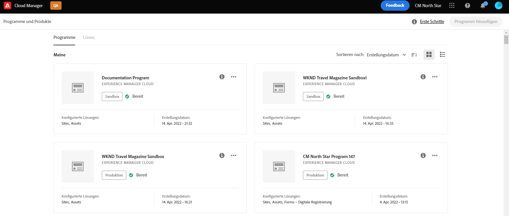
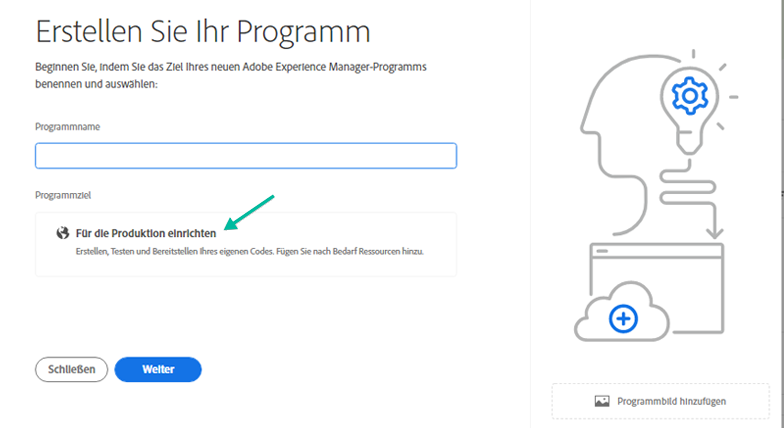
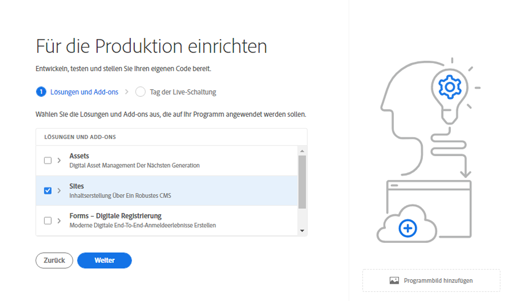

# Erstellen von Produktionsprogrammen {#create-production-program}

Ein Produktionsprogramm ist für Benutzer gedacht, die mit AEM und Cloud Manager vertraut sind und mit dem Schreiben, Erstellen und Testen von Code beginnen können, um ihn für das Hosten von Live-Traffic bereitzustellen.

Weitere Informationen zu Programmtypen finden Sie im Dokument . [Grundlegendes zu Programm- und Programmtypen.](program-types.md)

## Tutorials für Videos {#video-tutorials}

In diesen beiden Anleitungsvideos erfahren Sie, wie Sie ein Programm in Cloud Manager erstellen. [befolgen Sie unsere dokumentierten Anweisungen.](#create)

>[!VIDEO](https://video.tv.adobe.com/v/334953)

>[!VIDEO](https://video.tv.adobe.com/v/334954)

## Erstellen eines Produktionsprogramms {#create}

Führen Sie die folgenden Schritte aus, um ein Produktionsprogramm zu erstellen.

1. Melden Sie sich bei Cloud Manager an unter [my.cloudmanager.adobe.com](https://my.cloudmanager.adobe.com/) und wählen Sie die entsprechende Organisation aus.

1. Klicken Sie auf **Programm hinzufügen** oben rechts im Bildschirm.

   

1. Auswählen **Für Produktion einrichten** im Assistenten Programm erstellen , um ein Produktionsprogramm zu erstellen. Sie können den standardmäßigen Programmnamen akzeptieren oder ihn vor der Auswahl bearbeiten **Erstellen**.

   

1. Wählen Sie im nächsten Tab die Lösungen aus, die in das Programm aufgenommen werden sollen.

   

1. Klicken Sie auf den Pfeil vor den Lösungsnamen, um optionale Add-ons anzuzeigen, z. B. die **Handel** Add-On-Option unter **Sites**.

   

1. Klicken Sie bei ausgewählten Lösungen und Add-ons auf **Erstellen**.

Ihr Programm wird von Cloud Manager erstellt und kann auf der Landingpage angezeigt und ausgewählt werden.

## Auf Ihr Programm zugreifen {#acessing}

1. Nachdem Sie Ihre Programmkarte auf der Landingpage angezeigt haben, wählen Sie die Suchschaltfläche aus, um die verfügbaren Menüoptionen anzuzeigen.

   

1. Auswählen **Programmübersicht** , um zum Cloud Manager zu navigieren. **Übersicht** Seite.

1. Die HauptAktionsaufruf-Karte auf der Übersichtsseite führt Sie durch die Erstellung einer Umgebung, einer Nicht-Produktions-Pipeline und schließlich einer Produktions-Pipeline.

   

Wenn Sie zu einem anderen Programm wechseln oder zur Übersichtsseite zurückkehren müssen, um ein anderes Programm zu erstellen, klicken Sie auf den Programmnamen oben links im Bildschirm, um die **Navigieren Sie zu** -Option.

>[!NOTE]
>
>Im Gegensatz zu [Sandbox-Programm,](introduction-sandbox-programs.md#auto-creation) Ein Produktionsprogramm erfordert, dass der Benutzer in der entsprechenden Cloud Manager-Rolle das Projekt erstellt und über die Self-Service-Benutzeroberfläche eine Umgebung hinzufügt.
