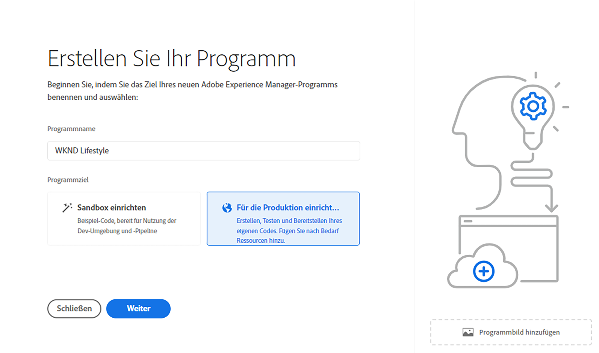
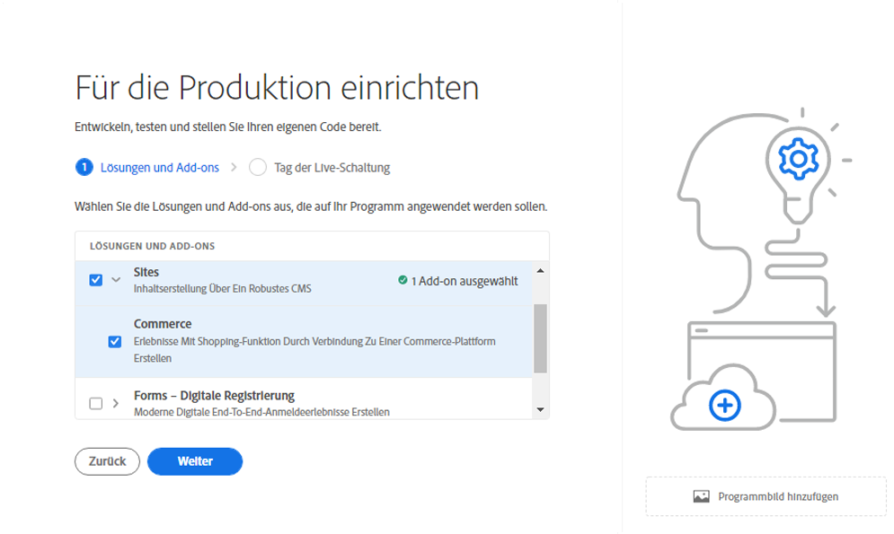
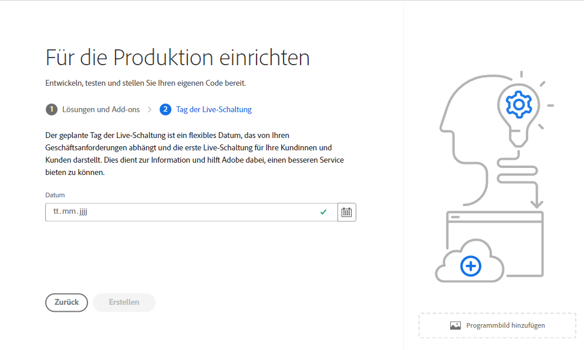
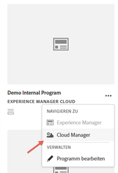
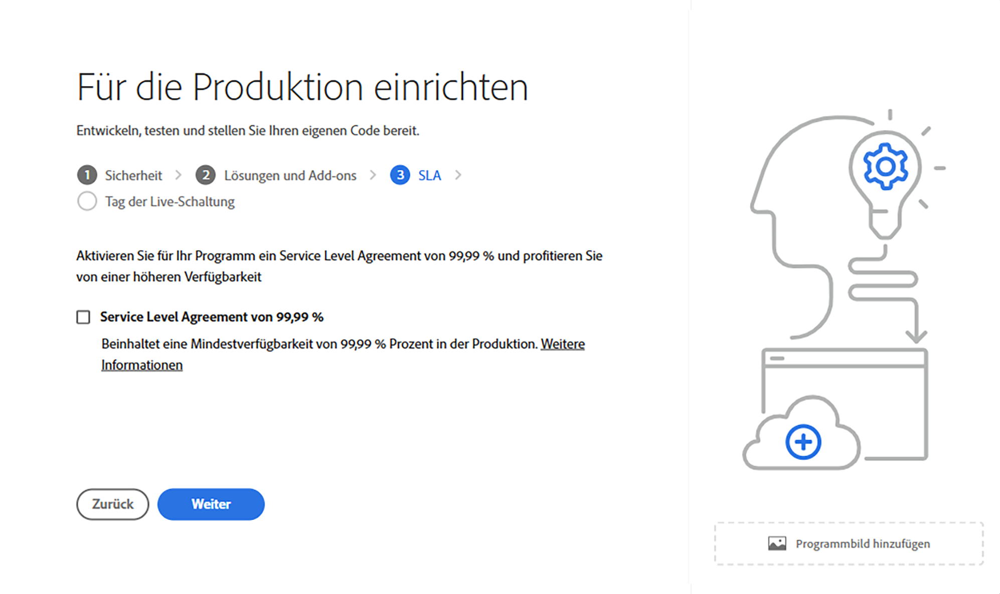
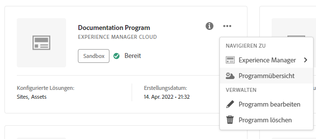
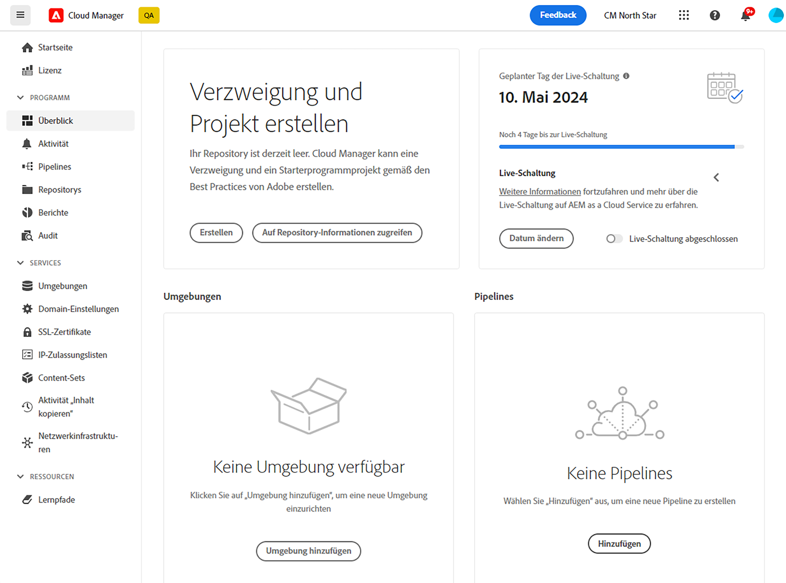

# Erstellen von Produktionsprogrammen {#create-production-program}

Ein Produktionsprogramm richtet sich an Benutzende, die mit AEM und Cloud Manager vertraut sind und Code schreiben, erstellen und testen können, um ihn für Live-Traffic bereitzustellen.

Weitere Informationen zu Programmtypen finden Sie unter [Programme und Programmtypen](program-types.md).

## Erstellen eines Produktionsprogramms {#create}

Abhängig von den Berechtigungen Ihrer Organisation werden möglicherweise [zusätzliche Optionen](#options) angezeigt, wenn Sie Ihr Programm hinzufügen.

**So erstellen Sie ein Produktionsprogramm:**

1. Melden Sie sich unter [my.cloudmanager.adobe.com](https://my.cloudmanager.adobe.com/) bei Cloud Manager an und wählen Sie die entsprechende Organisation aus.

1. Klicken Sie oben rechts in der Konsole **[Meine Programme](/help/implementing/cloud-manager/navigation.md#my-programs)** auf **Programm hinzufügen**.

   

1. Geben Sie im Assistenten *Erstellen Sie Ihr Programm* im Textfeld **Programmname** den gewünschten Namen für das Programm ein.

1. Wählen Sie unter **Programmziel** die Option **`Set up for production`** aus.

   

1. (Optional) Führen Sie unten rechts im Dialogfeld des Assistenten einen der folgenden Schritte aus:

   * Ziehen Sie eine Bilddatei per Drag-and-Drop auf das Ziel **Programmbild hinzufügen**.
   * Klicken Sie auf **Programmbild hinzufügen** und wählen Sie dann ein Bild aus einem Datei-Browser aus.
   * Klicken Sie auf das Papierkorbsymbol, um ein hinzugefügtes Bild zu löschen.

1. Klicken Sie auf **Weiter**.

1. Wählen Sie im Listenfeld **Lösungen und Add-ons** eine oder mehrere Lösungen aus, die im Programm enthalten sein sollen.

   * Wenn Sie sich nicht sicher sind, ob Sie ein oder mehrere Programme für die verschiedenen verfügbaren Lösungen benötigen, wählen Sie diejenige aus, die für Sie am interessantesten ist. Sie können zusätzliche Lösungen aktivieren, indem Sie [das Programm später bearbeiten](/help/implementing/cloud-manager/getting-access-to-aem-in-cloud/editing-programs.md). Weitere Empfehlungen zur Programmeinrichtung finden Sie im Dokument [Einführung in Produktionsprogramme](/help/implementing/cloud-manager/getting-access-to-aem-in-cloud/introduction-production-programs.md).
   * Für die Programmerstellung ist mindestens eine Lösung erforderlich.
   * Wählen Sie **Edge Deliver Services** für eine vollständig verwaltete CDN-Lösung, die digitale Erlebnisse optimiert. Siehe [Informationen zur Verwendung von Edge Delivery Services zum Bereitstellen Ihres Cloud Manager-Projekts](#edge-overview)
   * Wenn Sie die Option **[Erweiterte Sicherheit aktivieren](#security)** ausgewählt haben, können Sie nur diejenigen Lösungen auswählen, für die HIPAA-Berechtigungen verfügbar sind.

   

1. Klicken Sie auf den Pfeil links neben einem Lösungsnamen, um optionale Add-ons anzuzeigen, z. B. die Add-on-Option **Commerce** unter **Sites**.

   

1. Klicken Sie nach der Auswahl von Lösungen und Add-ons auf **Weiter**.

1. Geben Sie auf der Registerkarte **Tag der Veröffentlichung** das Datum ein, an dem Ihr Produktionsprogramm veröffentlicht werden soll.

   

   * Sie können dieses Datum jederzeit bearbeiten.
   * Das Datum dient zu Informationszwecken und löst das Go Live-Widget auf der Seite [**Programmübersicht** aus](/help/implementing/cloud-manager/getting-access-to-aem-in-cloud/editing-programs.md#program-overview). Diese Funktion bietet zeitnah produktinterne Links zu Best Practices für AEM as a Cloud Service, um ein reibungsloses Live-Erlebnis zu gewährleisten.

1. Klicken Sie auf **Erstellen**. Cloud Manager erstellt Ihr Programm und zeigt es zur Auswahl auf der Landingpage an.

## Zusätzliche Optionen für Produktionsprogramme {#options}

Je nachdem, welche Berechtigungen Ihrer Organisation zur Verfügung stehen, stehen Ihnen beim Erstellen eines Produktionsprogramms möglicherweise zusätzliche Optionen zur Verfügung.

### Sicherheit {#security}

Wenn Sie über die erforderlichen Berechtigungen verfügen, wird die Registerkarte **Sicherheit** als erste Registerkarte im Dialogfeld **`Set up for production`** angezeigt.

Die Registerkarte **Sicherheit** bietet die Möglichkeit, **HIPAA** und/oder **WAF-DDOS-Schutz** oder beide Optionen für Ihr Produktionsprogramm zu aktivieren.

Die HIPAA-Compliance und WAF-DDOS (Web Application Firewall- Distributed Denial of Service) von Adobe erleichtert die Cloud-basierte Sicherheit als Teil eines mehrschichtigen Ansatzes zum Schutz vor Sicherheitslücken.

* **HIPAA**: Diese Option ermöglicht die Implementierung der Adobe HIPAA-fähigen Lösung.
   * Hier finden Sie [weitere Informationen](https://www.adobe.com/trust/compliance/hipaa-ready.html) zur Implementierung einer HIPAA-fähigen Lösung von Adobe.
   * Die HIPAA-Option kann nach der Programmerstellung weder aktiviert noch deaktiviert werden.
* **WAF-DDOS-Schutz**: Diese Option aktiviert die Firewall der Web-Anwendung über Regeln, um Ihre Anwendung zu schützen.
   * Nach der Aktivierung kann der WAF-DDOS-Schutz durch Einrichten einer [produktionsfremden Pipeline](/help/implementing/cloud-manager/configuring-pipelines/configuring-non-production-pipelines.md) konfiguriert werden.
   * Unter [Traffic-Filterregeln einschließlich WAF-Regeln](/help/security/traffic-filter-rules-including-waf.md) finden Sie Informationen dazu, wie Sie Traffic-Filterregeln in Ihrem Repository verwalten, damit sie ordnungsgemäß bereitgestellt werden.

### SLA {#sla}

Wenn Sie über die erforderlichen Berechtigungen verfügen, wird die Registerkarte **SLA** als zweite oder dritte Registerkarte im Dialogfeld **`Set up for production`** angezeigt.

AEM Sites und Forms bieten standardmäßig ein Service Level Agreement (SLA) mit 99,99 % an. Die Option **Service Level Agreement von 99,99 %** ermöglicht einen minimalen Betriebszeitprozentsatz von 99,99 % für Ihre Sites- und/oder Forms-Produktionsumgebungen.

99,99 % SLA bietet Vorteile wie höhere Verfügbarkeit und geringere Latenz und erfordert, dass eine [zusätzliche Veröffentlichungsregion](/help/implementing/cloud-manager/manage-environments.md#multiple-regions) auf die Produktionsumgebung im Programm angewendet wird.

Wenn die [Anforderungen](#sla-requirements) für die Aktivierung von 99,99 % SLA erfüllt sind, müssen Sie eine [Full-Stack-Pipeline](/help/implementing/cloud-manager/configuring-pipelines/configuring-production-pipelines.md) ausführen, um sie zu aktivieren.

#### Anforderungen für 99,99 % SLA {#sla-requirements}

Über die erforderlichen Berechtigungen hinaus gelten für 99,99 % SLA zusätzliche Nutzungsanforderungen.

* Sowohl 99,99 % SLA als auch zusätzliche Berechtigungen für die Veröffentlichungsregion müssen der Organisation zur Verfügung stehen, wenn 99,99 % SLA auf das Programm angewendet wird.
* Cloud Manager überprüft, ob eine nicht verwendete Berechtigung für [zusätzliche Veröffentlichungsregion](/help/implementing/cloud-manager/manage-environments.md#multiple-regions) verfügbar ist, bevor 99,99 % SLA auf das Programm angewendet wird.
* Wenn ein Programm bereits eine Produktionsumgebung mit mindestens einer zusätzlichen Veröffentlichungsregion enthält, prüft Cloud Manager beim Bearbeiten nur die Verfügbarkeit einer SLA-Berechtigung von 99,99 %.
* Damit 99,99 % SLA und die Berichterstellung aktiviert werden können, muss die [Produktions-/Staging-Umgebung](/help/implementing/cloud-manager/manage-environments.md#adding-environments) erstellt worden sein und es muss mindestens eine zusätzliche Veröffentlichungsregion auf die Produktions-/Staging-Umgebung angewendet worden sein.
   * Wenn Sie ein [erweitertes Netzwerk](/help/security/configuring-advanced-networking.md) verwenden, stellen Sie sicher, dass Sie die Empfehlungen im Dokument [Hinzufügen mehrerer Veröffentlichungsregionen zu einer neuen Umgebung](/help/implementing/cloud-manager/manage-environments.md#adding-regions) befolgen, damit die Konnektivität im Falle eines regionalen Ausfalls erhalten bleibt.
* Mindestens eine zusätzliche Veröffentlichungsregion muss in Ihrem 99,99 %-SLA-Programm verbleiben. Benutzende dürfen den letzten zusätzlichen Veröffentlichungsbereich nicht aus Ihrem 99,99 %-SLA-Programm löschen.
* Ein SLA von 99,99 % wird für Produktionsprogramme unterstützt, für die die Sites- oder Forms-Lösung aktiviert ist.
* Führen Sie eine [vollständige Stack-Pipeline](/help/implementing/cloud-manager/configuring-pipelines/configuring-production-pipelines.md) aus, um das SLA von 99,99 % zu aktivieren (bzw. zu deaktivieren, wenn Sie ein Programm bearbeiten).

## Zugriff auf ein Programm {#accessing}

1. Wenn Sie Ihre Programmkarte auf der Landingpage sehen, klicken Sie auf https://spectrum.adobe.com/static/icons/workflow_18/Smock_More_18_N.svg, um die für Sie verfügbaren Menüoptionen anzuzeigen.

   

1. Wählen Sie **Cloud Manager** aus, um zur Seite **Übersicht** von Cloud Manager zu gelangen.

1. Die wichtigste Karte mit Handlungsaufforderung auf der Übersichtsseite führt Sie durch die Erstellung einer Umgebung, einer produktionsfremden Pipeline und schließlich einer Produktions-Pipeline.

   

>[!TIP]
>
>Weitere Informationen zum Navigieren in Cloud Manager und zum Verständnis der Konsole **Meine Programme** finden Sie unter [Navigation in der Cloud Manager-Benutzeroberfläche](/help/implementing/cloud-manager/navigation.md).

>[!NOTE]
>
>Im Gegensatz zu einem [Sandbox-Programm](introduction-sandbox-programs.md#auto-creation) erfordert ein Produktionsprogramm, dass die Person das Projekt in der entsprechenden Cloud Manager-Rolle erstellt und über die Self-Service-Benutzeroberfläche eine Umgebung hinzufügt.

