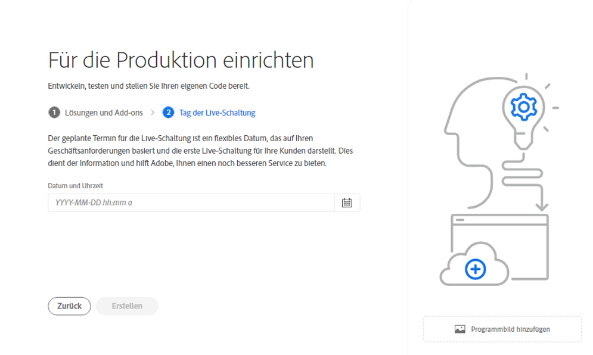

# Erstellen von Produktionsprogrammen {#create-production-program}

Ein Produktionsprogramm ist für einen Benutzer gedacht, der mit AEM und Cloud Manager vertraut ist und Code für die Bereitstellung zum Hosten von Live-Traffic schreiben, erstellen und testen möchte.

Weitere Informationen zu Programmtypen finden Sie im Dokument [Programm- und Programmtypen](program-types.md).

## Erstellen eines Produktionsprogramms {#create}

Gehen Sie wie folgt vor, um ein Produktionsprogramm zu erstellen.

1. Melden Sie sich unter [my.cloudmanager.adobe.com](https://my.cloudmanager.adobe.com/) bei Cloud Manager an und wählen Sie die entsprechende Organisation aus.

1. Im **[Eigene Programme](/help/implementing/cloud-manager/getting-access-to-aem-in-cloud/editing-programs.md#my-programs)** Bildschirm, tippen oder klicken Sie **Programm hinzufügen** in der oberen rechten Ecke des Bildschirms.

   

1. Wählen Sie im Assistenten „Programm erstellen“ die Option **Für die Produktion einrichten** aus, um ein Produktionsprogramm zu erstellen und einen Programmnamen anzugeben.

   

1. Optional können Sie ein Bild zum Programm hinzufügen, indem Sie eine Bilddatei per Drag-and-Drop auf das Ziel **Programmbild hinzufügen** ziehen oder darauf klicken, um ein Bild aus einem Datei-Browser auszuwählen. Wählen Sie **Weiter**.

1. Wenn Sie über die erforderlichen Berechtigungen verfügen, wird die Registerkarte **Sicherheit** angezeigt. Dort können Sie für Ihr Produktionsprogramm die Optionen **HIPAA** und/oder **WAF-DDOS-Schutz** aktivieren. Aktivieren Sie ggf. die entsprechenden Optionen für das Programm und wählen Sie dann **Weiter** aus.

   * Die HIPAA-Option kann nach der Programmerstellung weder aktiviert noch deaktiviert werden.
      * Hier finden Sie [weitere Informationen](https://www.adobe.com/go/hipaa-ready) zur Implementierung einer HIPAA-fähigen Lösung von Adobe.
   * Nach der Aktivierung kann der WAF-DDOS-Schutz durch Einrichten einer [produktionsfremden Pipeline](/help/implementing/cloud-manager/configuring-pipelines/configuring-non-production-pipelines.md) konfiguriert werden.

   

1. Wählen Sie auf der Registerkarte **Lösungen und Add-ons** die Lösungen aus, die im Programm enthalten sein sollen.

   * Wenn Sie sich nicht sicher sind, ob Sie ein oder mehrere Programme für die verschiedenen verfügbaren Lösungen benötigen, wählen Sie diejenige aus, die für Sie am interessantesten ist. Sie können zusätzliche Lösungen aktivieren, indem Sie [das Programm später bearbeiten](/help/implementing/cloud-manager/getting-access-to-aem-in-cloud/editing-programs.md). Weitere Empfehlungen zur Programmeinrichtung finden Sie im Dokument [Einführung in Produktionsprogramme](/help/implementing/cloud-manager/getting-access-to-aem-in-cloud/introduction-production-programs.md).
   * Wenn Sie die Option **Erweiterte Sicherheit aktivieren** zuvor ausgewählt haben, dürfen Sie nur diejenigen Lösungen auswählen, für die HIPAA-Berechtigungen verfügbar sind.

   

1. Klicken Sie auf den Pfeil vor den Lösungsnamen, um optionale Add-ons anzuzeigen, z. B. die Add-on-Option **Commerce** unter **Sites**.

   

1. Klicken Sie nach der Auswahl von Lösungen und Add-ons auf **Weiter**.

1. Geben Sie auf der Registerkarte **Tag der Live-Schaltung** das Datum ein, an dem Ihr Produktionsprogramm veröffentlicht werden soll.

   

   * Dieses Datum kann jederzeit bearbeitet werden.
   * Dieses Datum dient nur zur informativen Verwendung und für Trigger das Widget &quot;Go Live&quot;im [**Programmübersicht** page](/help/implementing/cloud-manager/getting-access-to-aem-in-cloud/editing-programs.md#program-overview) Bereitstellung produktinterner Links zur AEM as a Cloud Service Best Practice-Dokumentation in zeitnaher Abstimmung mit Ihrem Journey, was zu einem erfolgreichen und reibungslosen Go Live-Erlebnis führt.

1. Klicken Sie auf **Erstellen**.

Ihr Programm wird von Cloud Manager erstellt, wird auf der Landingpage angezeigt und kann dort ausgewählt werden.

## Zugriff auf ein Programm {#accessing}

1. Wenn Sie die Programmkarte auf der Landingpage sehen, wählen Sie die Schaltfläche mit den Auslassungspunkten aus, um die für Sie verfügbaren Menüoptionen anzuzeigen.

   

1. Wählen Sie **Cloud Manager** aus, um zur Seite **Übersicht** von Cloud Manager zu gelangen.

1. Die wichtigste Karte mit Handlungsaufforderung auf der Übersichtsseite führt Sie durch die Erstellung einer Umgebung, einer produktionsfremden Pipeline und schließlich einer Produktions-Pipeline.

   

Wenn Sie zu einem anderen Programm wechseln oder zur Übersichtsseite zurückkehren möchten, um ein anderes Programm zu erstellen, klicken Sie oben links auf dem Bildschirm auf den Namen Ihres Programms, um die Option **Navigieren zu** aufzurufen.

>[!NOTE]
>
>Im Gegensatz zu einem [Sandbox-Programm](introduction-sandbox-programs.md#auto-creation) erfordert ein Produktionsprogramm, dass der Benutzer das Projekt in der entsprechenden Cloud Manager-Rolle erstellt und über die Self-Service-Benutzeroberfläche eine Umgebung hinzufügt.
