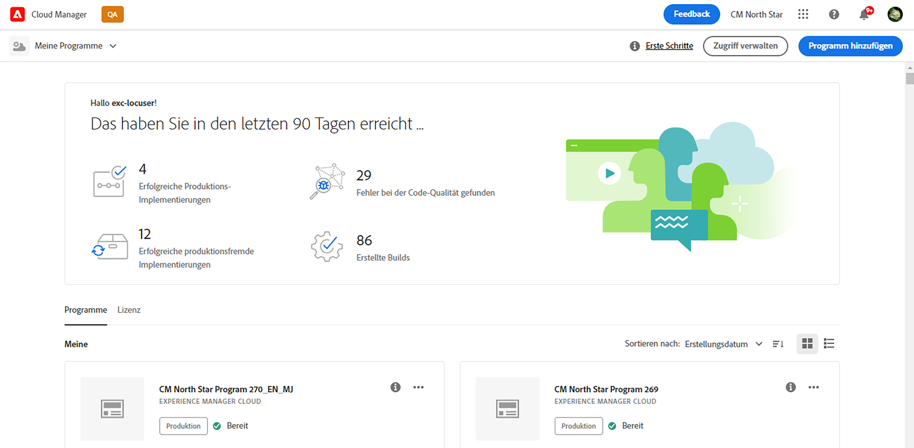
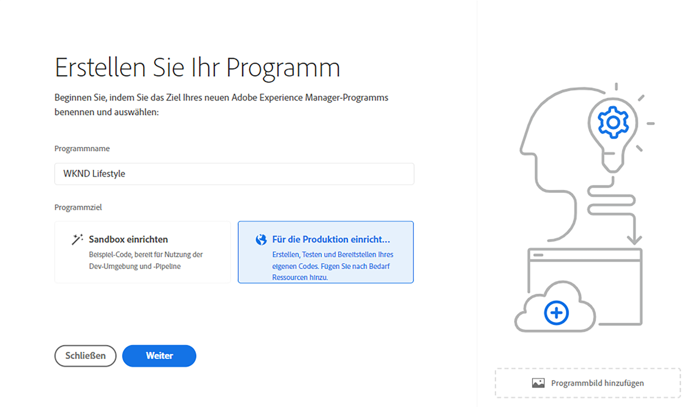
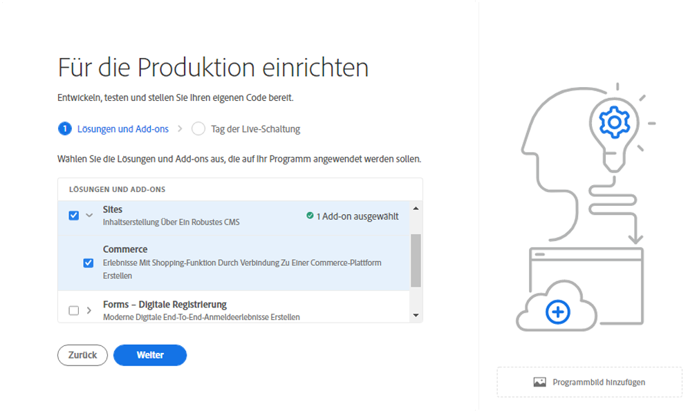
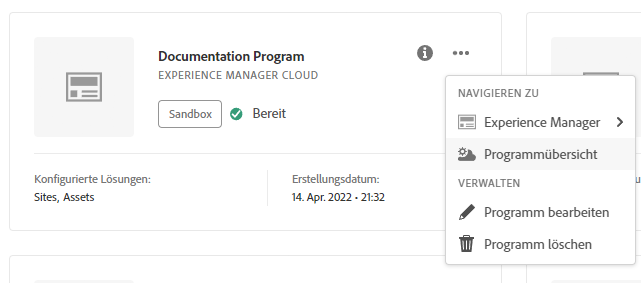
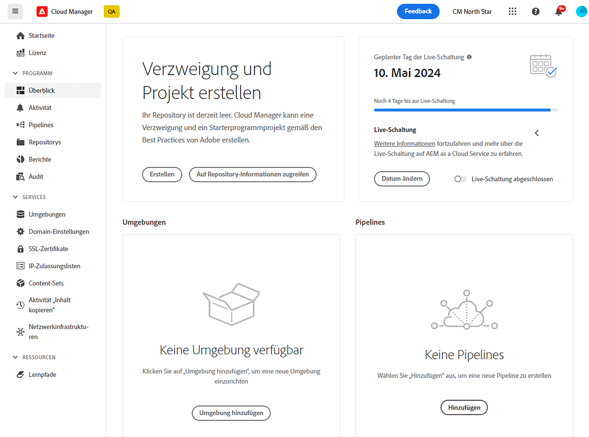

# Erstellen von Produktionsprogrammen {#create-production-program}

Ein Produktionsprogramm richtet sich an Benutzende, die mit Adobe Experience Manager (AEM) und Cloud Manager vertraut sind und Code schreiben, erstellen und testen können, um ihn für Live-Traffic bereitzustellen.

Weitere Informationen zu Programmtypen finden Sie unter [Programme und Programmtypen](program-types.md).

## Erstellen eines Produktionsprogramms {#create}

Die Berechtigungen Ihres Unternehmens bestimmen die zusätzlichen Produktionsprogrammoptionen, die beim Hinzufügen Ihres Programms verfügbar sind.
Siehe [Zusätzliche Produktions-Programmoptionen](#options).

**So erstellen Sie ein Produktionsprogramm:**

1. Melden Sie sich unter [my.cloudmanager.adobe.com](https://my.cloudmanager.adobe.com/) bei Cloud Manager an und wählen Sie die entsprechende Organisation aus.

1. Klicken Sie oben rechts in der Konsole **[Meine Programme](/help/implementing/cloud-manager/navigation.md#my-programs)** auf **Programm hinzufügen**.

   

1. Geben Sie im Assistenten *Erstellen Sie Ihr Programm* im Textfeld **Programmname** den gewünschten Namen für das Programm ein.

1. Wählen Sie unter **Programmziel** die Option  **Für die Produktion einrichten**.

   

1. (Optional) Führen Sie unten rechts im Dialogfeld des Assistenten einen der folgenden Schritte aus:

   * Ziehen Sie eine Bilddatei per Drag-and-Drop auf das Ziel  **Programmbild hinzufügen**.
   * Klicken Sie auf  **Programmbild hinzufügen** und wählen Sie dann ein Bild aus einem Datei-Browser aus.
   * Klicken Sie auf , um ein hinzugefügtes Bild zu löschen.

1. Klicken Sie auf **Weiter**.

1. Wählen Sie auf **Registerkarte** die Sicherheitsoptionen aus, die Sie verwenden möchten. Siehe [Sicherheit](#security).

   

1. Klicken Sie auf **Weiter**.

1. Wählen Sie im Listenfeld **Lösungen und Add-ons** eine oder mehrere Lösungen aus, die im Programm enthalten sein sollen.

   * Wenn Sie nicht sicher sind, ob Sie ein oder mehrere Programme für die verschiedenen verfügbaren Lösungen benötigen, wählen Sie das Programm aus, das Sie am meisten interessiert. Sie können zusätzliche Lösungen aktivieren, indem Sie [das Programm später bearbeiten](/help/implementing/cloud-manager/getting-access-to-aem-in-cloud/editing-programs.md). Weitere Empfehlungen zur Programmeinrichtung finden Sie im Dokument [Einführung in Produktionsprogramme](/help/implementing/cloud-manager/getting-access-to-aem-in-cloud/introduction-production-programs.md).
   * Sie müssen mindestens eine Lösung für die Programmerstellung auswählen. Sie können beispielsweise **Edge Delivery Services** auswählen, um eine vollständig verwaltete CDN-Lösung zu erhalten, die digitale Erlebnisse optimiert. Siehe [Informationen zur Verwendung von Edge Delivery Services zur Bereitstellung Ihres Cloud Manager-Projekts](/help/implementing/cloud-manager/edge-delivery/introduction-to-edge-delivery-services.md).

   * Klicken Sie auf  links neben einem Lösungsnamen, um optionale Add-ons anzuzeigen. <!-- such as the **Commerce** add-on option under **Sites**. -->

<!--    -->

    >[!NOTE]
    >
    >Wenn Ihr Programm Edge Delivery Services für die Bereitstellung verwendet, ist möglicherweise keine Veröffentlichungsebene erforderlich. Mit der Funktion „Flexible Veröffentlichungsebene“ (Beta) können Sie konfigurieren, ob auf der Registerkarte „Lösungen und Add-ons“ eine Veröffentlichungsebene bereitgestellt werden soll. Siehe [Flexible Veröffentlichungsebene (Beta)](/help/implementing/cloud-manager/getting-access-to-aem-in-cloud/creating-production-programs.md#flexible-publish-tier).
    
    

1. Klicken Sie auf **Weiter**.

1. Beachten Sie **dass die Registerkarte** Bereitstellungstyp“ auf der Grundlage der im vorherigen Schritt ausgewählten Lösungen und Add-ons bereits ausgefüllt ist. Wenn Sie **AEM Publish** auswählen, können Sie diese später bei Bedarf bereitstellen.

   

   <!-- * If you selected the **[Enable Enhanced Security](#security)** option, you can select only as many solutions for which HIPAA entitlements are available. -->

1. Klicken Sie auf **Weiter**.

1. Wenn Sie über die erforderlichen Berechtigungen verfügen, wird die Registerkarte **SLA** als zweite oder dritte Registerkarte im Dialogfeld **`Set up for production`** angezeigt. Siehe [SLA](#sla).

   

   Sites und Forms bieten standardmäßig ein Service Level Agreement (SLA) mit 99,99 % an.

1. Klicken Sie auf **Weiter**.

1. Geben **auf der Registerkarte** Tag der Live-Schaltung“ das Datum ein, an dem Ihr Produktionsprogramm veröffentlicht werden soll.

   

   * Sie können dieses Datum jederzeit bearbeiten.
   * Das Datum dient zu Informationszwecken und löst das Go Live-Widget auf der Seite [**Programmübersicht** aus](/help/implementing/cloud-manager/getting-access-to-aem-in-cloud/editing-programs.md#program-overview). Diese Funktion bietet zeitnah produktinterne Links zu Best Practices für AEM as a Cloud Service, um ein reibungsloses Live-Erlebnis zu gewährleisten.

1. Klicken Sie auf **Erstellen**. Cloud Manager erstellt Ihr Programm und zeigt es zur Auswahl auf der Landingpage an.

   

## Zusätzliche Optionen für Produktionsprogramme {#options}

Je nachdem, welche Berechtigungen Ihrer Organisation zur Verfügung stehen, stehen Ihnen beim Erstellen eines Produktionsprogramms die folgenden zusätzlichen Optionen zur Verfügung.

### Sicherheit {#security}

Wenn Sie über die erforderlichen Berechtigungen verfügen, wird die Registerkarte **Sicherheit** als erste Registerkarte im Dialogfeld **`Set up for production`** angezeigt.

Die Registerkarte **Sicherheit** bietet die Optionen zum Aktivieren **HIPAA**, **WAF-DDOS-** oder beides für Ihr Produktionsprogramm und **Kundenseitig verwaltete Schlüssel**.

Die HIPAA-Compliance und WAF-DDOS (Web Application Firewall- Distributed Denial of Service) von Adobe erleichtert die Cloud-basierte Sicherheit als Teil eines mehrschichtigen Ansatzes zum Schutz vor Sicherheitslücken.

* **HIPAA** - Diese Option ermöglicht die Implementierung der HIPAA-fähigen Lösung von Adobe.
   * Erfahren Sie mehr über [HIPAA-Bereitschaft für Adobe Experience Manager as a Cloud Service](/help/compliance/hipaa/hipaa-readiness.md) und die Implementierung der [Adobe HIPAA-fähigen Lösung](https://www.adobe.com/trust/compliance/hipaa-hds/hipaa-ready.html).
   * Die HIPAA-Option kann nach der Programmerstellung weder aktiviert noch deaktiviert werden.
* **WAF-DDOS-Schutz** - Mit dieser Option wird die Web Application Firewall durch Regeln zum Schutz Ihrer Anwendung aktiviert.
   * Nach der Aktivierung kann der WAF-DDOS-Schutz durch Einrichten einer [produktionsfremden Pipeline](/help/implementing/cloud-manager/configuring-pipelines/configuring-non-production-pipelines.md) konfiguriert werden.

     >[!NOTE]
     >
     >Wenn Sie **WAF-DDOS-Schutz** aktivieren, wird die Funktion aktiviert, aber abgesehen von einigen CVE-Schutzmechanismen (Automatic Common Vulnerabilities and Expositions) müssen Sie die WAF-Regeln über Cloud Manager bereitstellen, um vollen Schutz zu erhalten. Unter [Traffic-Filterregeln einschließlich WAF-Regeln](/help/security/traffic-filter-rules-including-waf.md) erfahren Sie, wie Sie Traffic-Filterregeln in Ihrem Repository verwalten, damit sie ordnungsgemäß bereitgestellt werden.
     >
     >Um sicherzustellen, dass die Funktion aktiv ist, überprüfen Sie die [CDN](//help/security/traffic-filter-rules-including-waf.md#cdn-logs)Protokolle, sobald Traffic auf die Site fließt. Suchen Sie nach Protokolleinträgen, die eine `rules`-Eigenschaft mit einem `waf` enthalten. Zum Beispiel:
     >
     >`"rules": "*waf=*"`
     >
     >Dieses Attribut wird angezeigt, wenn WAF aktiv ist, sogar bevor WAF-Regeln bereitgestellt werden.

* **Kundenseitig verwaltete Schlüssel** - Mit dieser Option wird CMK (Customer Managed Keys) für das Programm aktiviert, sodass Sie eigene Verschlüsselungsschlüssel für ruhende Daten in Azure Blob Storage und MongoDB bereitstellen können. Wenn Sie möchten, können Sie später CMK aktivieren, indem Sie [ein Programm bearbeiten](/help/implementing/cloud-manager/getting-access-to-aem-in-cloud/editing-programs.md#editing).

   * CMK ist nur für Cloud Service-Programme verfügbar. Es kann nicht in Sandbox-Programmen aktiviert werden.
   * Innerhalb eines Programms deckt CMK nur die Staging- und Produktionsumgebungen ab.
   * CMK kann nicht deaktiviert werden, nachdem es für ein Programm aktiviert wurde.
   * Konfigurieren Sie nach der Aktivierung von CMK Ihre Verschlüsselungsschlüssel in Experience Hub.
Siehe [Einrichten kundenverwalteter Schlüssel für AEM as a Cloud Service](/help/security/customer-managed-keys.md).
   * Wenn CMK aktiviert ist, zeigt die Programmübersichtsseite ein Sperrsymbol an, um anzugeben, dass CMK im Programm aktiv ist. Das Symbol spiegelt nicht den Aktivierungsstatus von CMK für einzelne Umgebungen innerhalb des Programms wider.
     
Die CMK-Lizenznutzung ist im Lizenz-Dashboard sichtbar. Informationen zur Anzahl der CMK-Credits, die Ihr Unternehmen erworben hat, und zur Anzahl der Programme, die diese Credits nutzen, finden Sie unter [Lizenz-Dashboard](/help/implementing/cloud-manager/license-dashboard.md).
     

### Flexible Veröffentlichungsebene (Beta) {#flexible-publish-tier}

>[!NOTE]
>
>Die hier beschriebene flexible Veröffentlichungsebene befindet sich in Beta. Um sich der Beta anzuschließen, senden Sie eine E-Mail an [&#128279;](mailto:grp-beta_xwalk-publish_config@adobe.com)grp-beta_xwalk-publish_config@adobe.com) mit Ihrer Adobe Organisations-ID und Programm-ID.

Wenn für Ihr Unternehmen die Funktion „Flexible Veröffentlichungsebene“ aktiviert ist, können Sie konfigurieren, ob für die Umgebungen Ihres Programms eine Veröffentlichungsebene erforderlich ist. Diese Option wird auf der Registerkarte **Bereitstellungstyp** im Dialogfeld **Für Produktion einrichten** angezeigt (während der [Programmerstellung](/help/implementing/cloud-manager/getting-access-to-aem-in-cloud/creating-production-programs.md)).

Es wird auch im Dialogfeld **Programm bearbeiten** angezeigt (wenn Sie [Programm bearbeiten](/help/implementing/cloud-manager/getting-access-to-aem-in-cloud/editing-programs.md)).

Nicht alle Architekturen erfordern eine Veröffentlichungsebene. Die folgende Tabelle zeigt, welche Architekturen eine Veröffentlichungsebene erfordern und welche nicht:

| Architektur | Veröffentlichungsebene |
| --- | --- |
| Traditionelles AEM Sites | Erforderlich |
| Headless/API-First | Erforderlich |
| Edge Delivery Services | Nicht erforderlich |

Indem Sie die Veröffentlichungsebene nur bei Bedarf aktivieren, können Teams Folgendes tun:

* Schnellere Bereitstellung von Umgebungen.
* Vereinfachung der Infrastruktur.
* Reduzierung unnötiger Komponenten.

**Funktionsweise**
Wenn die Funktion für die flexible Veröffentlichungsebene für Ihre Organisation aktiviert ist:

* Cloud Manager stellt allen neuen Umgebungen im Programm standardmäßig die **nur Autorenebene** zur Verfügung. Eine Informationsmeldung, die auf der Benutzeroberfläche angezeigt wird, bestätigt dieses Verhalten.
* Wenn der/die Benutzende während **Programmerstellung die Option** AEM-Veröffentlichung“ auswählt, wird die Veröffentlichungsebene aktiviert und mit &quot;*Umgebungen“*.
* Die Veröffentlichungsebene kann auch später durch Bearbeiten des Programms aktiviert werden. Siehe [Bearbeiten von Programmen](/help/implementing/cloud-manager/getting-access-to-aem-in-cloud/editing-programs.md).

>[!NOTE]
>
>Wenn Ihr Programm Edge Delivery Services für die Bereitstellung von Inhalten und AEM Author für die Inhaltserstellung verwendet, ist keine Veröffentlichungsebene erforderlich. Inhalte werden über Edge Delivery bereitgestellt und durchlaufen nicht die AEM-Veröffentlichungsebene. Siehe Informationen zu Edge Delivery Services mit AEM-Authoring (Beta).

### SLA {#sla}

Wenn Sie über die erforderlichen Berechtigungen verfügen, wird die Registerkarte **SLA** als zweite oder dritte Registerkarte im Dialogfeld **`Set up for production`** angezeigt.

Sites und Forms bieten standardmäßig ein Service Level Agreement (SLA) mit 99,99 % an. Die Option **Service Level Agreement von 99,99 %** ermöglicht eine Mindestverfügbarkeit von 99,99 % für Ihre Produktionsumgebungen für Sites, Forms, Edge Delivery Services oder alle drei.

Das SLA von 99,99 % bietet unter anderem die Vorteile einer höheren Verfügbarkeit und geringeren Latenz.

Für Sites- und Forms-Programme erfordert die SLA von 99,99 % eine [zusätzliche Veröffentlichungsregion](/help/implementing/cloud-manager/manage-environments.md#multiple-regions), die im Programm auf die Produktionsumgebung angewendet werden muss. Um SLA zu 99,99 % zu aktivieren, wenn die [Anforderungen](#sla-requirements) erfüllt sind, führen Sie eine [Full-Stack-Pipeline](/help/implementing/cloud-manager/configuring-pipelines/configuring-production-pipelines.md) aus.

Für Edge Delivery Services besteht *keine* andere Anforderung als die Konfiguration der SLA-Lizenz von 99,99 % im Programm.

#### Anforderungen für ein SLA von 99,99 % {#sla-requirements}

Zusätzlich zu den erforderlichen Berechtigungen umfasst die Verwendung des SLA von 99,99 % für Sites- oder Forms-Programme die folgenden zusätzlichen Anforderungen:

* Sowohl 99,99 % SLA als auch zusätzliche Berechtigungen für die Veröffentlichungsregion müssen der Organisation zur Verfügung stehen, wenn 99,99 % SLA auf das Programm angewendet wird.
* Cloud Manager überprüft, ob eine nicht verwendete Berechtigung für [zusätzliche Veröffentlichungsregion](/help/implementing/cloud-manager/manage-environments.md#multiple-regions) verfügbar ist, bevor 99,99 % SLA auf das Programm angewendet wird.
* Wenn ein Programm bereits eine Produktionsumgebung mit mindestens einer zusätzlichen Veröffentlichungsregion enthält, prüft Cloud Manager beim Bearbeiten nur die Verfügbarkeit einer SLA-Berechtigung von 99,99 %.
* Für die Aktivierung von 99,99 % SLA und die Berichterstellung muss [Produktions-/Staging](/help/implementing/cloud-manager/manage-environments.md#adding-environments)Umgebung erstellt und mindestens eine zusätzliche Veröffentlichungsregion auf die Produktions-/Staging-Umgebung angewendet worden sein.
   * Wenn Sie ein [erweitertes Netzwerk](/help/security/configuring-advanced-networking.md) verwenden, stellen Sie sicher, dass Sie die Empfehlungen im Dokument [Hinzufügen mehrerer Veröffentlichungsregionen zu einer neuen Umgebung](/help/implementing/cloud-manager/manage-environments.md#adding-regions) befolgen, damit die Konnektivität im Falle eines regionalen Ausfalls erhalten bleibt.
* Ihr SLA-Programm von 99,99 % muss immer mindestens eine zusätzliche Veröffentlichungsregion umfassen. Benutzende dürfen den letzten verbleibenden zusätzlichen Veröffentlichungsbereich nicht aus dem Programm löschen.
* Ihr SLA von 99,99 % wird für Produktionsprogramme unterstützt, für die die Sites- oder Forms-Lösung aktiviert ist.
* Führen Sie eine [vollständige Stack-Pipeline](/help/implementing/cloud-manager/configuring-pipelines/configuring-production-pipelines.md) aus, um das SLA von 99,99 % zu aktivieren (bzw. zu deaktivieren, wenn Sie ein Programm bearbeiten).

## Zugriff auf ein Programm {#accessing}

1. Wenn Sie Ihre Programmkarte auf der Landingpage sehen, klicken Sie auf , um die für Sie verfügbaren Menüoptionen anzuzeigen.

   

1. Wählen Sie **Cloud Manager** aus, um zur Seite **Übersicht** von Cloud Manager zu gelangen.

1. Die wichtigste Karte mit Handlungsaufforderung auf der Übersichtsseite führt Sie durch die Erstellung einer Umgebung, einer produktionsfremden Pipeline und schließlich einer Produktions-Pipeline.

   

>[!TIP]
>
>Unter [Navigieren in der Cloud Manager-Benutzeroberfläche](/help/implementing/cloud-manager/navigation.md) finden Sie Details zum Navigieren in Cloud Manager und zur **&quot;** Programme“.

>[!NOTE]
>
>Im Gegensatz zu einem [Sandbox-Programm](introduction-sandbox-programs.md#auto-creation) erfordert ein Produktionsprogramm, dass die Person das Projekt in der entsprechenden Cloud Manager-Rolle erstellt und über die Self-Service-Benutzeroberfläche eine Umgebung hinzufügt.

