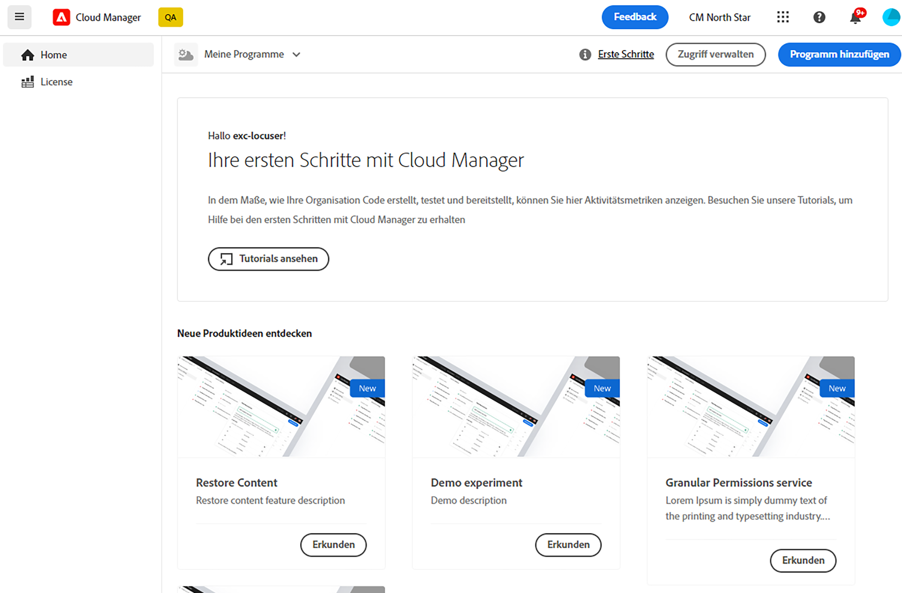
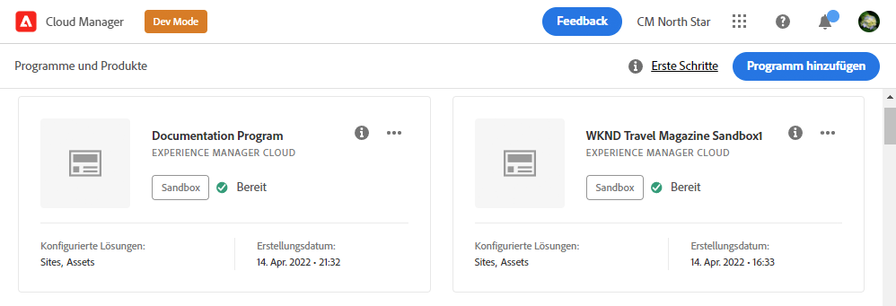

# Erstellen von Produktionsprogrammen {#create-production-program}

Ein Produktionsprogramm ist für einen Benutzer gedacht, der mit AEM und Cloud Manager vertraut ist und Code für die Bereitstellung zum Hosten von Live-Traffic schreiben, erstellen und testen möchte.

Weitere Informationen zu Programmtypen finden Sie im Dokument [Programm- und Programmtypen](program-types.md).

## Erstellen eines Produktionsprogramms {#create}

Führen Sie die folgenden Schritte aus, um ein Produktionsprogramm zu erstellen. Beachten Sie, dass abhängig von den Berechtigungen Ihres Unternehmens [zusätzliche Optionen](#options) wenn Sie Ihr Programm hinzufügen.

1. Melden Sie sich unter [my.cloudmanager.adobe.com](https://my.cloudmanager.adobe.com/) bei Cloud Manager an und wählen Sie die entsprechende Organisation aus.

1. Im **[Eigene Programme](/help/implementing/cloud-manager/getting-access-to-aem-in-cloud/editing-programs.md#my-programs)** Bildschirm, tippen oder klicken Sie **Programm hinzufügen** in der oberen rechten Ecke des Bildschirms.

   

1. Wählen Sie im Assistenten „Programm erstellen“ die Option **Für die Produktion einrichten** aus, um ein Produktionsprogramm zu erstellen und einen Programmnamen anzugeben.

   

1. Optional können Sie ein Bild zum Programm hinzufügen, indem Sie eine Bilddatei per Drag-and-Drop auf das Ziel **Programmbild hinzufügen** ziehen oder darauf klicken, um ein Bild aus einem Datei-Browser auszuwählen. Wählen Sie **Weiter**.

1. Wählen Sie auf der Registerkarte **Lösungen und Add-ons** die Lösungen aus, die im Programm enthalten sein sollen.

   * Wenn Sie sich nicht sicher sind, ob Sie ein oder mehrere Programme für die verschiedenen verfügbaren Lösungen benötigen, wählen Sie diejenige aus, die für Sie am interessantesten ist. Sie können zusätzliche Lösungen aktivieren, indem Sie [das Programm später bearbeiten](/help/implementing/cloud-manager/getting-access-to-aem-in-cloud/editing-programs.md). Weitere Empfehlungen zur Programmeinrichtung finden Sie im Dokument [Einführung in Produktionsprogramme](/help/implementing/cloud-manager/getting-access-to-aem-in-cloud/introduction-production-programs.md).
   * Für die Programmerstellung ist mindestens eine Lösung erforderlich.
   * Wenn Sie die Option **[Verbesserte Sicherheit aktivieren](#security)** können Sie nur so viele Lösungen auswählen, für die HIPAA-Berechtigungen verfügbar sind.

   

1. Klicken Sie auf den Pfeil vor den Lösungsnamen, um optionale Add-ons anzuzeigen, z. B. die Add-on-Option **Commerce** unter **Sites**.

   

1. Klicken Sie nach der Auswahl von Lösungen und Add-ons auf **Weiter**.

1. Geben Sie auf der Registerkarte **Tag der Live-Schaltung** das Datum ein, an dem Ihr Produktionsprogramm veröffentlicht werden soll.

   

   * Dieses Datum kann jederzeit bearbeitet werden.
   * Dieses Datum dient nur zur informativen Verwendung und für Trigger das Widget &quot;Go Live&quot;im [**Programmübersicht** page](/help/implementing/cloud-manager/getting-access-to-aem-in-cloud/editing-programs.md#program-overview) Bereitstellung produktinterner Links zur AEM as a Cloud Service Best Practice-Dokumentation in zeitnaher Abstimmung mit Ihrem Journey, was zu einem erfolgreichen und reibungslosen Go Live-Erlebnis führt.

1. Klicken Sie auf **Erstellen**.

Ihr Programm wird von Cloud Manager erstellt, wird auf der Landingpage angezeigt und kann dort ausgewählt werden.

## Zusätzliche Produktions-Programmoptionen {#options}

Je nachdem, welche Berechtigungen Ihrer Organisation zur Verfügung stehen, stehen Ihnen beim Erstellen eines Produktionsprogramms möglicherweise zusätzliche Optionen zur Verfügung.

### Sicherheit {#security}

Wenn Sie über die erforderlichen Berechtigungen verfügen, wird die **Sicherheit** wird als erste Registerkarte im **Für Produktion einrichten** angezeigt.

Die **Sicherheit** bietet die zu aktivierenden Optionen **HIPAA** und/oder **WAF-DDOS-Schutz** für Ihr Produktionsprogramm.

Adobe HIPAA-konform und Web Application Firewall (WAF) erleichtern die Cloud-basierte Sicherheit als Teil eines mehrschichtigen Ansatzes zum Schutz vor Sicherheitslücken.

* **HIPAA** - Diese Option ermöglicht die Implementierung der Adobe HIPPA-fähigen Lösung.
   * Hier finden Sie [weitere Informationen](https://www.adobe.com/go/hipaa-ready) zur Implementierung einer HIPAA-fähigen Lösung von Adobe.
   * Die HIPAA-Option kann nach der Programmerstellung weder aktiviert noch deaktiviert werden.
* **WAF-DDOS-Schutz** - Diese Option aktiviert die Firewall der Webanwendung über Regeln, um Ihre Anwendung zu schützen.
   * Nach der Aktivierung kann der WAF-DDOS-Schutz durch Einrichten einer [produktionsfremden Pipeline](/help/implementing/cloud-manager/configuring-pipelines/configuring-non-production-pipelines.md) konfiguriert werden.
   * Im Dokument [Traffic-Filterregeln einschließlich WAF-Regeln](/help/security/traffic-filter-rules-including-waf.md) finden Sie Informationen dazu, wie Sie Traffic-Filterregeln in Ihrem Repository verwalten, damit sie ordnungsgemäß bereitgestellt werden.

### SLA {#sla}

Wenn Sie über die erforderlichen Berechtigungen verfügen, wird die **SLA** wird als zweite oder dritte Registerkarte im **Für Produktion einrichten** angezeigt.

AEM Sites bietet einen standardmäßigen Service Level Agreement (SLA) zu 99,9 % an. Die **99,99 % Service Level Agreement** ermöglicht einen minimalen Betriebszeitprozentsatz von 99,99 % für Ihre Produktionsumgebungen.

SLA mit 99,99 % bietet Vorteile wie höhere Verfügbarkeit und geringere Latenz und erfordert eine [zusätzliche Veröffentlichungsregion](/help/implementing/cloud-manager/manage-environments.md#multiple-regions) auf die Produktionsumgebung im Programm anzuwenden.

Einmal die [Anforderungen](#sla-requirements) Um 99,99 % SLA zu aktivieren, müssen Sie eine [Vollständige Stack-Pipeline](/help/implementing/cloud-manager/configuring-pipelines/configuring-production-pipelines.md) um sie zu aktivieren.

#### Anforderungen an SLA 99,99 % {#sla-requirements}

Über die erforderlichen Berechtigungen hinaus gelten für 99,99 % SLA zusätzliche Nutzungsanforderungen.

* Sowohl 99,99 % SLA als auch zusätzliche Berechtigungen für die Veröffentlichungsregion müssen der Organisation zum Zeitpunkt der Anwendung von 99,99 % SLA auf das Programm zur Verfügung stehen.
* Um eine SLA von 99,99 % auf das Programm anzuwenden, prüft Cloud Manager, ob ein nicht verwendeter [zusätzliche Veröffentlichungsregion](/help/implementing/cloud-manager/manage-environments.md#multiple-regions) Die Berechtigung ist auch verfügbar und kann auf das Programm angewendet werden.
* Wenn ein Programm bereits eine Produktionsumgebung mit mindestens einer zusätzlichen Veröffentlichungsregion enthält, prüft Cloud Manager beim Bearbeiten nur die Verfügbarkeit einer SLA-Berechtigung von 99,99 %.
* Damit der SLA von 99,99 % und die Berichterstellung aktiviert werden, muss die [Produktions-/Staging-Umgebung](/help/implementing/cloud-manager/manage-environments.md#adding-environments) muss erstellt worden sein und mindestens ein zusätzlicher Veröffentlichungsbereich muss auf die Produktions-/Staging-Umgebung angewendet worden sein.
   * Wenn Sie [erweiterte Vernetzung,](/help/security/configuring-advanced-networking.md) Überprüfen Sie die [Hinzufügen mehrerer Veröffentlichungsbereiche zu einer neuen Umgebung](/help/implementing/cloud-manager/manage-environments.md#adding-regions) für Empfehlungen, damit die Konnektivität im Falle eines regionalen Fehlers aufrechterhalten wird.
* Mindestens eine weitere Veröffentlichungsregion muss im SLA-Programm zu 99,99 % verbleiben. Benutzer dürfen den letzten zusätzlichen Veröffentlichungsbereich nicht aus Ihrem SLA-Programm 99,99 % löschen.
* 99,99 % SLA wird für Produktionsprogramme unterstützt, für die die Sites-Lösung aktiviert ist.
* Sie müssen eine [Vollständige Stack-Pipeline](/help/implementing/cloud-manager/configuring-pipelines/configuring-production-pipelines.md) um die SLA 99,99% zu aktivieren (oder, wenn Sie ein Programm bearbeiten, zu deaktivieren).

## Zugriff auf ein Programm {#accessing}

1. Wenn Sie die Programmkarte auf der Landingpage sehen, wählen Sie die Schaltfläche mit den Auslassungspunkten aus, um die für Sie verfügbaren Menüoptionen anzuzeigen.

   

1. Wählen Sie **Cloud Manager** aus, um zur Seite **Übersicht** von Cloud Manager zu gelangen.

1. Die wichtigste Karte mit Handlungsaufforderung auf der Übersichtsseite führt Sie durch die Erstellung einer Umgebung, einer produktionsfremden Pipeline und schließlich einer Produktions-Pipeline.

   

Wenn Sie zu einem anderen Programm wechseln oder zur Übersichtsseite zurückkehren möchten, um ein anderes Programm zu erstellen, klicken Sie oben links auf dem Bildschirm auf den Namen Ihres Programms, um die Option **Navigieren zu** aufzurufen.

>[!NOTE]
>
>Im Gegensatz zu einem [Sandbox-Programm](introduction-sandbox-programs.md#auto-creation) erfordert ein Produktionsprogramm, dass der Benutzer das Projekt in der entsprechenden Cloud Manager-Rolle erstellt und über die Self-Service-Benutzeroberfläche eine Umgebung hinzufügt.
