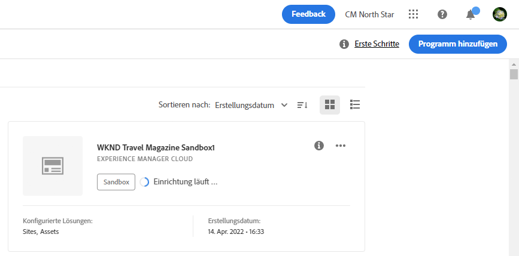

# Erstellen eines Sandbox-Programms {#create-sandbox-program}

Gehen Sie wie folgt vor, um ein Sandbox-Programm zu erstellen:

1. Starten Sie die Landingpage von Cloud Manager und klicken Sie oben rechts im Bildschirm auf **Programm hinzufügen**.

   

1. Wählen Sie im Assistenten zum Erstellen von Programmen **Eine Sandbox einrichten** aus. Der Benutzer gibt den Programmnamen ein, bevor er **Erstellen** auswählt.

   

1. Der Benutzer sieht die Karte des neuen Sandbox-Programms auf der Landingpage und kann mit dem Mauszeiger darauf fahren, um das Cloud Manager-Symbol auszuwählen und zur Übersichtsseite von Cloud Manager zu navigieren. Die Karte informiert den Benutzer über den Status der automatischen Einrichtung des neu erstellten Sandbox-Programms. Der Benutzer wird den Fortschritt sehen.

   

1. Nach der Einrichtung des Programms und dem Abschluss der Projekterstellung kann der Benutzer auf den Link **Git verwalten** zugreifen, wie in der Abbildung unten dargestellt:

   

   >[!NOTE]
   >
   >Weitere Informationen zum Zugriff auf und Verwalten des Git-Repositorys mithilfe des Self-Service-Git-Account-Management über die Cloud Manager-Benutzeroberfläche finden Sie unter [Zugriff auf Git](/help/implementing/cloud-manager/managing-code/accessing-repos.md).

1. Nachdem die Entwicklungsumgebung erstellt wurde, kann der Benutzer den Link **AEM aufrufen**, wie in der folgenden Abbildung dargestellt:

   

1. Sobald die Bereitstellung der produktionsfremden Pipeline in der Entwicklungsumgebung abgeschlossen ist, führt der Assistent den Benutzer entweder zum Zugriff auf AEM (in der Entwicklungsumgebung) oder zur Bereitstellung von Code in der Entwicklungsumgebung:

   

   >[!NOTE]
   >Sie können ein Programm auch auf der Cloud Manager-Übersichtsseite bearbeiten, wechseln oder hinzufügen, wie unten dargestellt:

   
