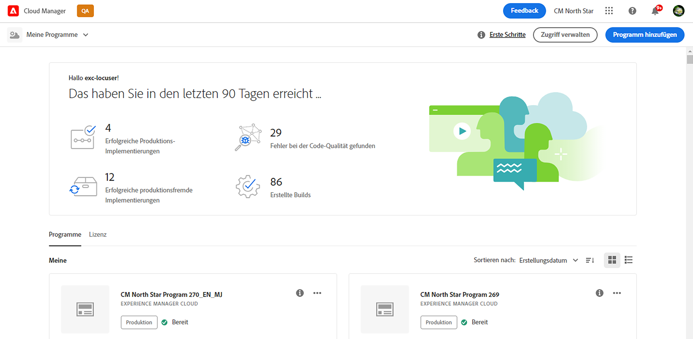
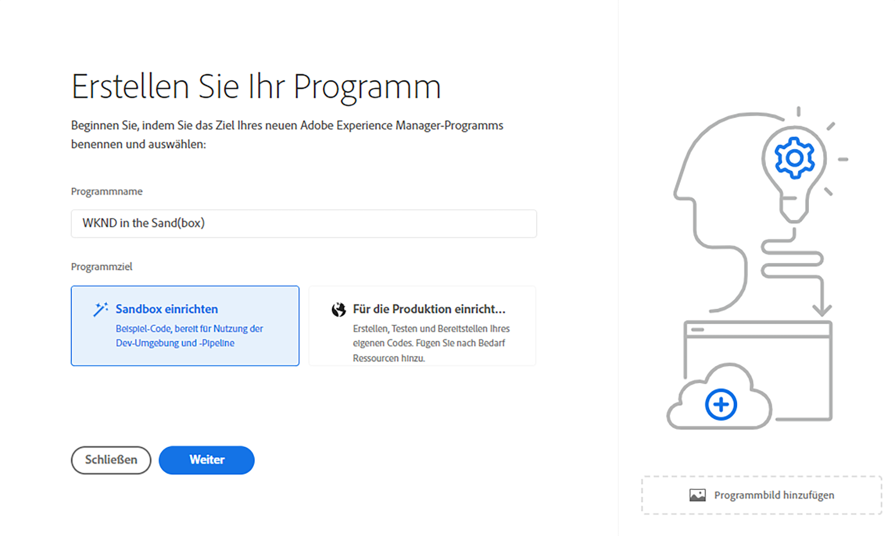
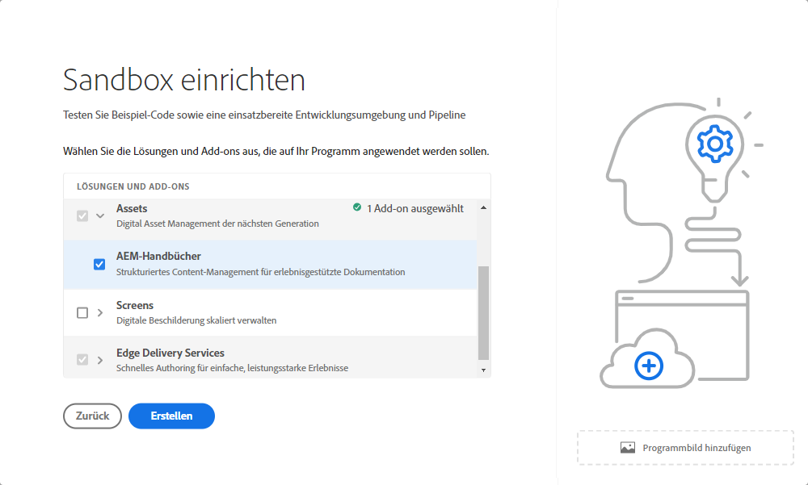
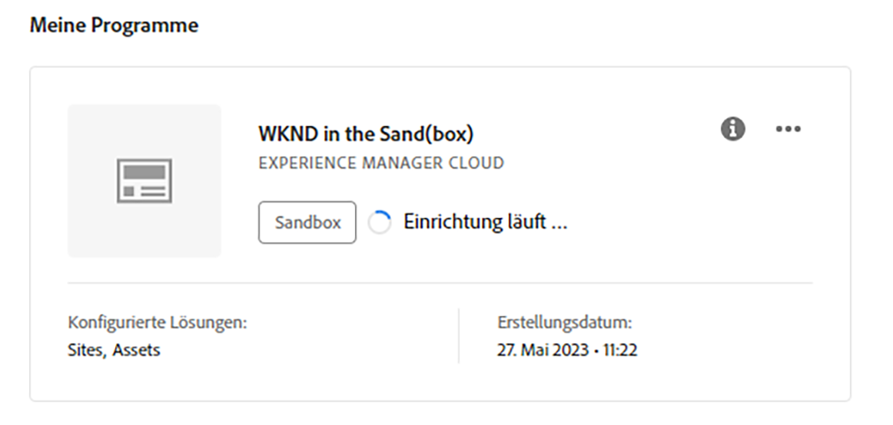
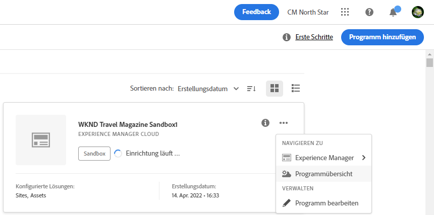
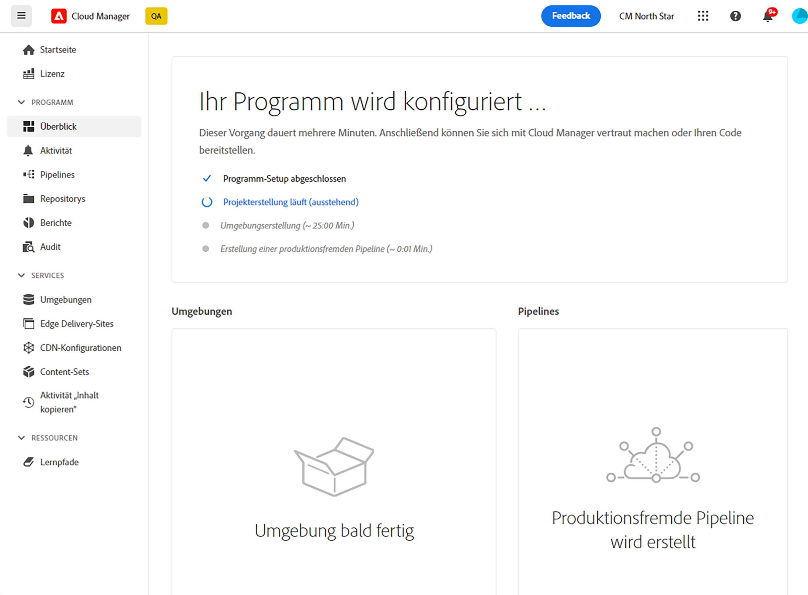
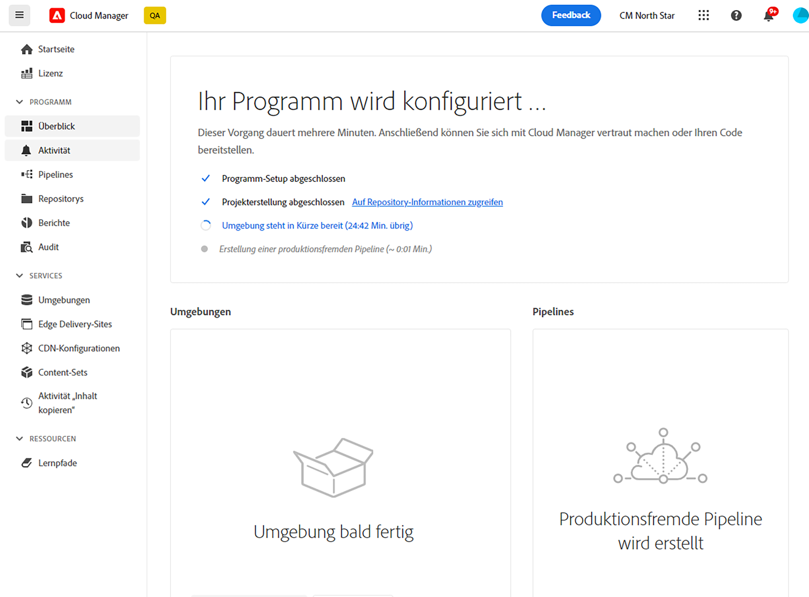
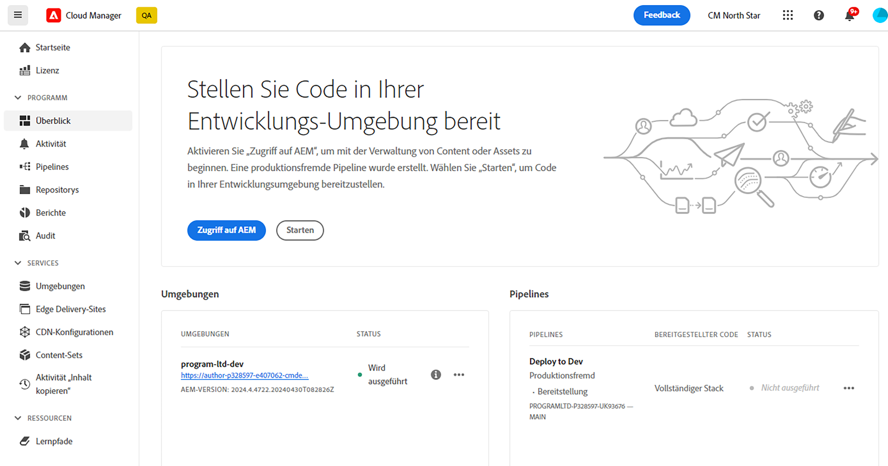

# Erstellen von Sandbox-Programmen {#create-sandbox-program}

Sandbox-Programme werden normalerweise für Schulungen, das Ausführen von Demos, Aktivierungen, POCs oder Dokumentationen erstellt und sind nicht für Live-Traffic vorgesehen. Siehe [Einführung in Sandbox-Programme](/help/implementing/cloud-manager/getting-access-to-aem-in-cloud/introduction-sandbox-programs.md).

Weitere Informationen zu Programmtypen finden Sie unter [Programme und Programmtypen](program-types.md).

## Erstellen eines Sandbox-Programms {#create}

1. Melden Sie sich bei Cloud Manager unter [my.cloudmanager.adobe.com](https://my.cloudmanager.adobe.com/) an und wählen Sie die entsprechende Organisation aus.

1. Klicken Sie oben rechts in der Konsole **[Meine Programme](/help/implementing/cloud-manager/navigation.md#my-programs)** auf **Programm hinzufügen**.

   

1. Geben Sie im Assistenten *Erstellen Sie Ihr Programm* im Textfeld **Programmname** den gewünschten Namen für das Programm ein.

1. Wählen Sie unter **Programmziel** die Option  **Sandbox einrichten**.

   

1. (Optional) Führen Sie unten rechts im Dialogfeld des Assistenten einen der folgenden Schritte aus:

   * Ziehen Sie eine Bilddatei per Drag-and-Drop auf das Ziel  **Programmbild hinzufügen**.
   * Klicken Sie auf  **Programmbild hinzufügen** und wählen Sie dann ein Bild aus einem Datei-Browser aus.
   * Klicken Sie auf , um ein hinzugefügtes Bild zu löschen.

1. Klicken Sie auf **Weiter**.

1. Wählen Sie im Listenfeld **Lösungen und Add-ons** eine oder mehrere Lösungen aus, die im Programm enthalten sein sollen.

   * Klicken Sie auf den Pfeil links neben dem Lösungsnamen, um alle verfügbaren optionalen Add-ons anzuzeigen, die in eine ausgewählte Lösung aufgenommen werden sollen.
   * Die Lösungen **Sites**, **Assets** und **Edge Deliver Services** sind beim Erstellen eines Sandbox-Programms standardmäßig immer ausgewählt. Sie können sie nicht abwählen.

   

1. Klicken Sie auf **Erstellen**. Cloud Manager erstellt Ihr Sandbox-Programm und zeigt es zur Auswahl auf der Landingpage an.

 aus

## Sandbox-Zugriff {#access}

Nachdem ein neues Sandbox-Programm erstellt wurde, können Sie Details Ihrer Sandbox-Einrichtung anzeigen und auf die Umgebung zugreifen, indem Sie die Seite „Programmübersicht“ aufrufen.

1. Klicken Sie auf der Landingpage von Cloud Manager im Sandbox-Programm auf  in Ihrem erstellten Sandbox-Programm.

   

1. Sobald der Schritt zur Projekterstellung abgeschlossen ist, können Sie den Link **Auf Repository-Informationen zugreifen** verwenden, um Ihr Git-Repository zu verwenden.

   

   >[!TIP]
   >
   >Weitere Informationen zum Zugriff auf und zur Verwaltung Ihres Git-Repositorys finden Sie unter [Zugriff auf Git](/help/implementing/cloud-manager/managing-code/accessing-repos.md).

1. Nachdem die Entwicklungsumgebung erstellt wurde, können Sie den Link **Zugriff auf AEM** verwenden, um sich bei AEM anzumelden.

   

1. Wenn die Bereitstellung der produktionsfremden Pipeline in der Entwicklungsumgebung abgeschlossen ist, führt Sie der Assistent in den Anleitungen zum Aktionsaufruf entweder zum Zugriff auf die AEM-Entwicklungsumgebung oder zur Code-Bereitstellung in der Entwicklungsumgebung.

   

>[!TIP]
>
>Weitere Informationen zum Navigieren in Cloud Manager und zum Verständnis der Konsole **Meine Programme** finden Sie unter [Navigation in der Cloud Manager-Benutzeroberfläche](/help/implementing/cloud-manager/navigation.md).
