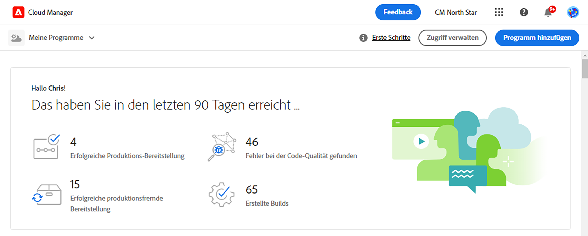

# Erstellen von Sandbox-Programmen {#create-sandbox-program}

Sandbox-Programme werden normalerweise für Schulungen, das Ausführen von Demos, Aktivierungen, POCs oder Dokumentationen erstellt und sind nicht für Live-Traffic vorgesehen.

Weitere Informationen zu Programmtypen finden Sie im Dokument [Programm- und Programmtypen](program-types.md).

## Erstellen eines Sandbox-Programms {#create}

1. Melden Sie sich bei Cloud Manager unter [my.cloudmanager.adobe.com](https://my.cloudmanager.adobe.com/) an und wählen Sie die entsprechende Organisation aus.

1. Klicken Sie auf der Landingpage von Cloud Manager oben rechts im Bildschirm auf **Programm hinzufügen**.

   

1. Wählen Sie im Assistenten zum Erstellen von Programmen die Option **Sandbox einrichten** und geben Sie einen Programmnamen ein.

   

1. Optional können Sie ein Bild zum Programm hinzufügen, indem Sie eine Bilddatei per Drag-and-Drop auf das Ziel **Programmbild hinzufügen** ziehen oder darauf klicken, um ein Bild aus einem Dateibrowser auszuwählen. Klicken Sie auf **Weiter**.

   * Das Bild dient nur als Kachel im Programmübersichtsfenster und hilft bei der Identifizierung des Programms.

1. Im **Sandbox einrichten** auswählen, welche Lösungen Sie in Ihrem Sandbox-Programm aktivieren möchten, indem Sie die Optionen im **Lösungen und Add-ons** Tabelle.

   * Verwenden Sie die Pfeile neben den Lösungsnamen, um zusätzliche, optionale Add-ons für die Lösungen anzuzeigen.

   * Die **Sites**- und **Assets**-Lösungen sind immer in Sandbox-Programmen enthalten und können nicht deaktiviert werden.

   

1. Nachdem Sie die Lösungen und Add-ons für Ihr Sandbox-Programm ausgewählt haben, tippen Sie auf **Erstellen**.

Auf der Landingpage wird eine neue Sandbox-Programmkarte mit einer Statusanzeige angezeigt, während der Einrichtungsprozess fortgesetzt wird.

## Sandbox-Zugriff {#access}

Sie können die Details Ihrer Sandbox-Einrichtung anzeigen und auf die Umgebung zugreifen (sobald sie verfügbar ist), indem Sie die Seite „Programmübersicht“ aufrufen.

1. Klicken Sie auf der Landingpage von Cloud Manager auf die Suchschaltfläche in Ihrem erstellten Programm.

   

1. Sobald der Schritt zur Projekterstellung abgeschlossen ist, können Sie den Link **Zugriff auf Repo-Info** verwenden, um Ihr Git-Repo verwenden zu können.

   

   >[!TIP]
   >
   >Weitere Informationen zum Zugriff auf und zur Verwaltung Ihres Git-Repositorys finden Sie unter [Zugriff auf Git](/help/implementing/cloud-manager/managing-code/accessing-repos.md).

1. Nachdem die Entwicklungsumgebung erstellt wurde, können Sie den Link **Zugriff auf AEM** verwenden, um sich bei AEM anzumelden.

   

1. Sobald die Bereitstellung der produktionsfremden Pipeline in der Entwicklungsumgebung abgeschlossen ist, führt der Assistent den Benutzer entweder zum Zugriff auf AEM (in der Entwicklungsumgebung) oder zur Bereitstellung von Code in der Entwicklungsumgebung.

   

Wenn Sie irgendwann zu einem anderen Programm wechseln oder zur Übersichtsseite zurückkehren möchten, um ein anderes Programm zu erstellen, klicken Sie auf den Namen Ihres Programms oben links im Bildschirm, um die Option **Navigieren zu** aufzurufen.

