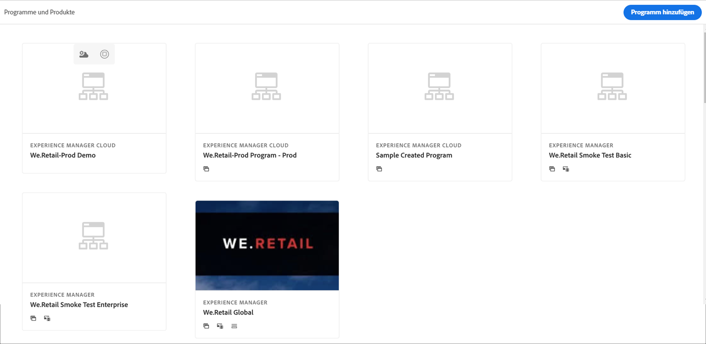
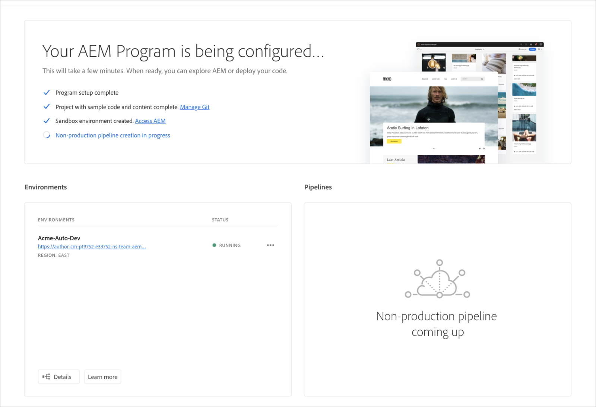

# Erstellen von Sandbox-Programmen {#create-sandbox-program}

Sandbox-Programme werden normalerweise für Schulungen, das Ausführen von Demos, Aktivierungen, POCs oder Dokumentationen erstellt und sind nicht für Live-Traffic vorgesehen.

Weitere Informationen zu Programmtypen finden Sie im Dokument [Programm- und Programmtypen](program-types.md).

## Erstellen eines Sandbox-Programms {#create}

Gehen Sie wie folgt vor, um ein Sandbox-Programm zu erstellen.

1. Melden Sie sich unter [my.cloudmanager.adobe.com](https://my.cloudmanager.adobe.com/) bei Cloud Manager an und wählen Sie die entsprechende Organisation aus.

1. Klicken Sie auf der Landingpage von Cloud Manager in der oberen rechten Ecke des Bildschirms auf **Programm hinzufügen**.

   

1. Wählen Sie im Assistenten „Programm erstellen“ die Option **Sandbox einrichten**, geben Sie einen Programmnamen ein und klicken Sie auf **Erstellen**.

   

Auf der Landingpage wird eine neue Sandbox-Programmkarte mit einer Statusanzeige angezeigt, während der Einrichtungsprozess fortgesetzt wird.

## Zugriff auf Sandboxes {#access}

Sie können die Details Ihrer Sandbox-Einrichtung anzeigen und auf die Umgebung zugreifen (sobald sie verfügbar ist), indem Sie die Seite „Programmübersicht“ aufrufen.

1. Klicken Sie auf der Landingpage von Cloud Manager in Ihrem neu erstellten Programm auf die Schaltfläche mit den Auslassungspunkten.

   

1. Sobald der Schritt zur Projekterstellung abgeschlossen ist, können Sie den Link **Zugriff auf Repo-Info** verwenden, um Ihr Git-Repo verwenden zu können.

   

   >[!TIP]
   >
   >Weitere Informationen zum Zugriff auf und zur Verwaltung Ihres Git-Repositorys finden Sie im Dokument [Zugriff auf Git](/help/implementing/cloud-manager/managing-code/accessing-repos.md).

1. Nachdem die Entwicklungsumgebung erstellt wurde, können Sie den Link **Zugriff auf AEM** verwenden, um sich bei AEM anzumelden.

   

1. Sobald die Bereitstellung der produktionsfremden Pipeline in der Entwicklungsumgebung abgeschlossen ist, führt der Assistent den Benutzer entweder zum Zugriff auf AEM (in der Entwicklungsumgebung) oder zur Bereitstellung von Code in der Entwicklungsumgebung.

   

Wenn Sie irgendwann zu einem anderen Programm wechseln oder zur Übersichtsseite zurückkehren möchten, um ein anderes Programm zu erstellen, klicken Sie auf den Namen Ihres Programms oben links im Bildschirm, um die Option **Navigieren zu** aufzurufen.

